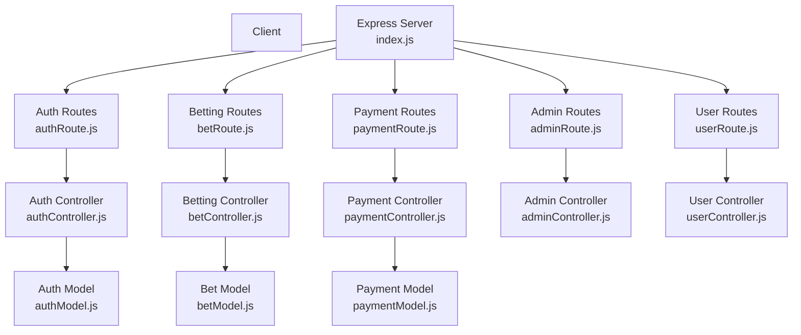
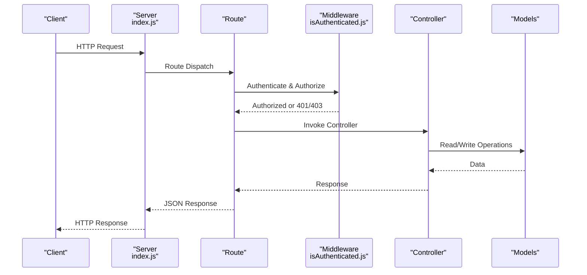
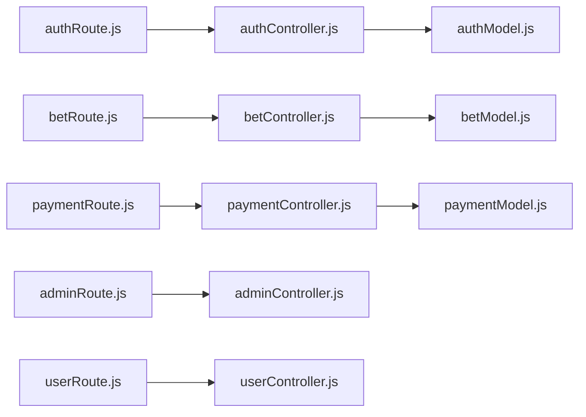
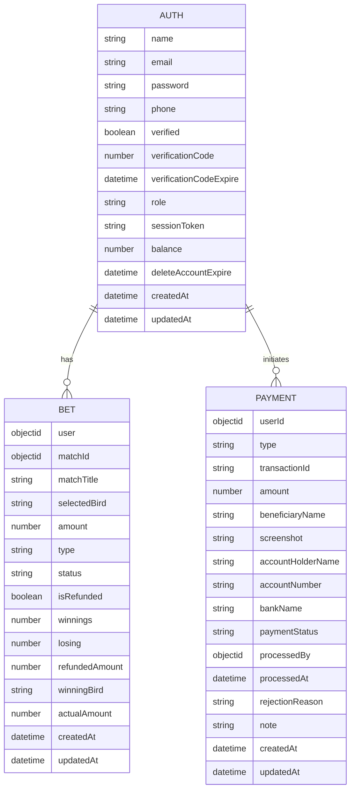

# API Reference

<cite>
**Referenced Files in This Document**
- [index.js](file://server/index.js)
- [authRoute.js](file://server/routes/auth/authRoute.js)
- [authController.js](file://server/controllers/auth/authController.js)
- [betRoute.js](file://server/routes/bet/betRoute.js)
- [betController.js](file://server/controllers/bet/betController.js)
- [paymentRoute.js](file://server/routes/payment/paymentRoute.js)
- [paymentController.js](file://server/controllers/payment/paymentController.js)
- [adminRoute.js](file://server/routes/admin/adminRoute.js)
- [adminController.js](file://server/controllers/admin/adminController.js)
- [userRoute.js](file://server/routes/users/userRoute.js)
- [userController.js](file://server/controllers/users/userController.js)
- [isAuthenticated.js](file://server/middleware/isAuthenticated.js)
- [authModel.js](file://server/models/authModel.js)
- [betModel.js](file://server/models/betModel.js)
- [paymentModel.js](file://server/models/paymentModel.js)
</cite>

## Table of Contents
1. [Introduction](#introduction)
2. [Project Structure](#project-structure)
3. [Core Components](#core-components)
4. [Architecture Overview](#architecture-overview)
5. [Detailed Component Analysis](#detailed-component-analysis)
6. [Dependency Analysis](#dependency-analysis)
7. [Performance Considerations](#performance-considerations)
8. [Troubleshooting Guide](#troubleshooting-guide)
9. [Conclusion](#conclusion)
10. [Appendices](#appendices)

## Introduction
This document provides comprehensive API documentation for the Betting application’s backend. It covers authentication, betting, payment, administrative, and user management endpoints. For each endpoint, you will find HTTP method, path, authentication requirements, request/response schemas, validation rules, error response codes, and practical curl examples. It also documents CORS, security headers, rate limiting, and the API versioning strategy.

## Project Structure
The API is organized by feature domains with dedicated routes and controllers. Middleware enforces authentication and authorization. Models define data structures and indexes. The server initializes security headers, CORS, body parsing, and global error handling.

**Diagram sources**
- [index.js](file://server/index.js#L93-L100)
- [authRoute.js](file://server/routes/auth/authRoute.js#L1-L34)
- [betRoute.js](file://server/routes/bet/betRoute.js#L1-L11)
- [paymentRoute.js](file://server/routes/payment/paymentRoute.js#L1-L82)
- [adminRoute.js](file://server/routes/admin/adminRoute.js#L1-L22)
- [userRoute.js](file://server/routes/users/userRoute.js#L1-L11)
- [authController.js](file://server/controllers/auth/authController.js#L50-L124)
- [betController.js](file://server/controllers/bet/betController.js#L43-L106)
- [paymentController.js](file://server/controllers/payment/paymentController.js#L341-L396)
- [adminController.js](file://server/controllers/admin/adminController.js#L5-L68)
- [userController.js](file://server/controllers/users/userController.js#L3-L27)
- [authModel.js](file://server/models/authModel.js#L3-L32)
- [betModel.js](file://server/models/betModel.js#L3-L20)
- [paymentModel.js](file://server/models/paymentModel.js#L3-L114)

**Section sources**
- [index.js](file://server/index.js#L93-L100)

## Core Components
- Authentication and Authorization Middleware
  - Authentication: Validates Authorization header JWT and checks session validity.
  - Authorization: Role-based access control for admin/superadmin endpoints.
- Models
  - Auth: Users, roles, balances, verification, and session tokens.
  - Bet: Betting records, outcomes, and statuses.
  - Payment: Deposit/withdrawal requests, statuses, and metadata.
- Controllers
  - Implement business logic for registration, login, OTP verification, logout, placing bets, payments, and admin operations.
- Routes
  - Group endpoints under /api/{domain} with appropriate middleware.

**Section sources**
- [isAuthenticated.js](file://server/middleware/isAuthenticated.js#L1-L62)
- [authModel.js](file://server/models/authModel.js#L3-L32)
- [betModel.js](file://server/models/betModel.js#L3-L20)
- [paymentModel.js](file://server/models/paymentModel.js#L3-L114)

## Architecture Overview
High-level API flow: Client sends requests to domain routes, which are handled by controllers after passing through authentication and authorization middleware. Responses are returned with standardized success/error envelopes.

**Diagram sources**
- [index.js](file://server/index.js#L93-L100)
- [isAuthenticated.js](file://server/middleware/isAuthenticated.js#L1-L62)
- [authController.js](file://server/controllers/auth/authController.js#L50-L124)
- [betController.js](file://server/controllers/bet/betController.js#L43-L106)
- [paymentController.js](file://server/controllers/payment/paymentController.js#L341-L396)
- [adminController.js](file://server/controllers/admin/adminController.js#L5-L68)
- [userController.js](file://server/controllers/users/userController.js#L3-L27)

## Detailed Component Analysis

### Authentication Endpoints
- Base Path: /api/auth
- Authentication: None for registration/login/OTP; Required for protected endpoints.
- Authorization: Some endpoints require admin/superadmin.

Endpoints
- POST /register
  - Description: Registers a new user with name, email, phone, password, and confirm password.
  - Headers: Content-Type: application/json
  - Request Body
    - name: string, required
    - email: string, required
    - phone: string, required
    - password: string, required
    - confirmPassword: string, required
  - Responses
    - 200: Success envelope with message
    - 400: Validation or duplicate errors
    - 500: Internal server error
  - Example curl
    - curl -X POST https://your-domain.com/api/auth/register -H "Content-Type: application/json" -d '{"name":"John","email":"john@example.com","phone":"+123456789","password":"Passw0rd!","confirmPassword":"Passw0rd!"}'
  - Notes
    - Phone number validated via regex.
    - Email validated via external service.
    - Registration attempts limited per email.

- POST /verify-otp
  - Description: Verifies email verification code.
  - Request Body
    - email: string, required
    - otp: number/string, required
  - Responses
    - 200: Success envelope with message
    - 400: Invalid/expired OTP or user not found
    - 500: Internal server error

- POST /resend-otp
  - Description: Resends verification code.
  - Request Body
    - email: string, required
  - Responses
    - 200: Success envelope with message
    - 400: User not found
    - 500: Internal server error

- POST /login
  - Description: Logs in user and issues JWT.
  - Request Body
    - email: string, required
    - password: string, required
  - Responses
    - 200: Success envelope with Token and userData
    - 400: Not found, invalid credentials, or unverified account
    - 500: Internal server error
  - Example curl
    - curl -X POST https://your-domain.com/api/auth/login -H "Content-Type: application/json" -d '{"email":"john@example.com","password":"Passw0rd!"}'

- POST /logout
  - Description: Clears current session token.
  - Authentication: Required
  - Responses
    - 200: Success envelope with message
    - 400: User not found
    - 500: Internal server error

- GET /get-user
  - Description: Returns current user details (without password).
  - Authentication: Required
  - Responses
    - 200: Success envelope with userData
    - 400: User not found
    - 500: Internal server error

- POST /forgot-password
  - Description: Sends password reset code.
  - Request Body
    - email: string, required
  - Responses
    - 200: Success envelope with message
    - 400: User not found
    - 500: Internal server error

- POST /reset-password
  - Description: Resets password using reset code.
  - Request Body
    - email: string, required
    - newPassword: string, required
    - confirmPassword: string, required
    - otp: number/string, required
  - Responses
    - 200: Success envelope with message
    - 400: Validation or expired OTP
    - 500: Internal server error

- POST /force-logout-send-otp
  - Description: Sends OTP for forced logout.
  - Request Body
    - email: string, required
  - Responses
    - 200: Success envelope with message
    - 400: User not found
    - 500: Internal server error

- POST /force-logout
  - Description: Forces logout using OTP.
  - Request Body
    - email: string, required
    - otp: number/string, required
  - Responses
    - 200: Success envelope with message
    - 400: Invalid/expired OTP or user not found
    - 500: Internal server error

- POST /superadmin-force-logout-all
  - Description: Forces logout for all non-admin users.
  - Authentication: Required
  - Authorization: superadmin
  - Responses
    - 200: Success envelope with message
    - 500: Internal server error

- POST /superadmin-force-logout-user
  - Description: Forces logout for a specific user.
  - Authentication: Required
  - Authorization: superadmin
  - Request Body
    - userId: ObjectId, required
  - Responses
    - 200: Success envelope with message
    - 400: User not found
    - 500: Internal server error

Validation Rules
- All fields marked required must be present.
- Passwords must match for registration/reset.
- Phone must match regex pattern.
- OTP must be valid and not expired.
- Email must pass external validation.

Error Codes
- 400: Bad request (validation, not found, invalid/expired OTP)
- 401: Unauthorized (missing/invalid/expired token, session terminated)
- 403: Forbidden (insufficient role)
- 500: Internal server error

**Section sources**
- [authRoute.js](file://server/routes/auth/authRoute.js#L20-L31)
- [authController.js](file://server/controllers/auth/authController.js#L50-L124)
- [authController.js](file://server/controllers/auth/authController.js#L150-L193)
- [authController.js](file://server/controllers/auth/authController.js#L195-L250)
- [authController.js](file://server/controllers/auth/authController.js#L252-L267)
- [authController.js](file://server/controllers/auth/authController.js#L339-L354)
- [authController.js](file://server/controllers/auth/authController.js#L356-L384)
- [authController.js](file://server/controllers/auth/authController.js#L386-L425)
- [authController.js](file://server/controllers/auth/authController.js#L268-L292)
- [authController.js](file://server/controllers/auth/authController.js#L294-L337)
- [authController.js](file://server/controllers/auth/authController.js#L428-L456)

### Betting Endpoints
- Base Path: /api/bet
- Authentication: Required for all endpoints.

Endpoints
- POST /create
  - Description: Places a new bet.
  - Request Body
    - matchId: ObjectId, required
    - selectedBird: string, required
    - amount: number, required (> 0)
    - type: enum ["Straight", "Lay90", "Call90"], required
    - userId: ObjectId, required
  - Responses
    - 201: Success envelope with bet
    - 400: Missing fields, invalid amount, insufficient funds, match not active
    - 404: User or match not found
    - 500: Internal server error
  - Example curl
    - curl -X POST https://your-domain.com/api/bet/create -H "Authorization: Bearer <JWT>" -H "Content-Type: application/json" -d '{"matchId":"<ObjectId>","selectedBird":"A","amount":100,"type":"Straight","userId":"<ObjectId>"}'

- GET /get-bets-status
  - Description: Retrieves betting history for a user.
  - Query Params
    - userId: string (required)
  - Responses
    - 200: Success envelope with bets array
    - 404: No bets placed yet
    - 500: Internal server error

- GET /:matchId
  - Description: Retrieves all bets for a given match.
  - Path Params
    - matchId: string, required
  - Responses
    - 200: Success envelope with bets array and count
    - 404: Match not found
    - 500: Internal server error

Validation Rules
- Amount must be positive.
- User must have sufficient balance.
- Match must be active.
- Bet type must be one of the allowed enums.

Error Codes
- 400: Validation, insufficient funds, match inactive
- 404: User/match not found
- 500: Internal server error

**Section sources**
- [betRoute.js](file://server/routes/bet/betRoute.js#L6-L8)
- [betController.js](file://server/controllers/bet/betController.js#L43-L106)
- [betController.js](file://server/controllers/bet/betController.js#L108-L124)
- [betController.js](file://server/controllers/bet/betController.js#L8-L40)

### Payment Endpoints
- Base Path: /api/payment
- Authentication: Required for user endpoints; admin endpoints require admin/superadmin.

User Endpoints
- POST /upload-screenshot
  - Description: Uploads a payment screenshot (supports HEIC conversion and server-side compression).
  - Authentication: Required
  - Request
    - multipart/form-data with field image
  - Responses
    - 200: Success envelope with secure_url, public_id, size, dimensions
    - 400: No file uploaded
    - 413: File too large
    - 504: Upload timeout
    - 500: Upload failure
  - Example curl
    - curl -X POST https://your-domain.com/api/payment/upload-screenshot -H "Authorization: Bearer <JWT>" -F "image=@receipt.jpg"

- POST /upload-chunk
  - Description: Receives a chunk for chunked upload.
  - Authentication: Required
  - Request Body
    - chunkIndex: number, required
    - totalChunks: number, required
    - uploadId: string, required
    - fileName: string, required
    - chunk: file, required
  - Responses
    - 200: Success envelope with progress
    - 400: No chunk uploaded
    - 500: Chunk upload failed

- POST /finalize-upload
  - Description: Finalizes chunked upload and uploads to Cloudinary.
  - Authentication: Required
  - Request Body
    - uploadId: string, required
    - fileName: string, required
  - Responses
    - 200: Success envelope with secure_url and metadata
    - 404: Upload not found
    - 400: Missing chunks
    - 500: Finalization failed

- POST /deposit
  - Description: Creates a deposit request.
  - Authentication: Required
  - Request Body
    - beneficiaryName: string, required
    - bankName: string, required
    - amount: number, required (>= 100)
    - transactionId: string, required
    - screenshot: object with url, required
    - note: string, optional
    - depositDate: string, optional
    - depositTime: string, optional
  - Responses
    - 201: Success envelope with deposit request
    - 400: Validation errors
    - 500: Internal server error

- POST /withdraw
  - Description: Creates a withdrawal request.
  - Authentication: Required
  - Request Body
    - amount: number, required (>= 500)
    - accountHolderName: string, required
    - accountNumber: string, required
    - bankName: string, required
    - note: string, optional
  - Responses
    - 201: Success envelope with withdrawal request
    - 400: Insufficient balance or validation errors
    - 404: User not found
    - 500: Internal server error

- GET /my-transactions
  - Description: Lists user transactions with pagination and filters.
  - Authentication: Required
  - Query Params
    - type: enum ["deposit", "withdrawal"], optional
    - status: enum ["pending", "approved", "rejected", "completed", "failed", "cancelled"], optional
    - limit: number, default 10
    - page: number, default 1
  - Responses
    - 200: Success envelope with data and pagination
    - 500: Internal server error

- GET /:id
  - Description: Retrieves a single transaction by ID.
  - Authentication: Required
  - Path Params
    - id: string, required
  - Responses
    - 200: Success envelope with data
    - 404: Transaction not found
    - 500: Internal server error

- PUT /cancel/:id
  - Description: Cancels a pending payment.
  - Authentication: Required
  - Path Params
    - id: string, required
  - Responses
    - 200: Success envelope with message
    - 404: Payment not found
    - 400: Payment not pending
    - 500: Internal server error

Admin Endpoints
- GET /admin/all
  - Description: Lists all payments with filters and pagination.
  - Authentication: Required
  - Authorization: admin, superadmin
  - Query Params
    - type, status, search, limit, page
  - Responses
    - 200: Success envelope with data, stats, pagination
    - 500: Internal server error

- GET /admin/pending
  - Description: Lists pending payments.
  - Authentication: Required
  - Authorization: admin, superadmin
  - Responses
    - 200: Success envelope with count and data
    - 500: Internal server error

- GET /admin/stats
  - Description: Returns payment statistics.
  - Authentication: Required
  - Authorization: admin, superadmin
  - Responses
    - 200: Success envelope with stats
    - 500: Internal server error

- PUT /admin/approve/:id
  - Description: Approves a payment and credits user balance (for deposits).
  - Authentication: Required
  - Authorization: admin, superadmin
  - Path Params
    - id: string, required
  - Responses
    - 200: Success envelope with updated payment
    - 400: Already processed
    - 404: Payment not found
    - 500: Internal server error

- PUT /admin/reject/:id
  - Description: Rejects a payment and refunds balance (for withdrawals).
  - Authentication: Required
  - Authorization: admin, superadmin
  - Path Params
    - id: string, required
  - Request Body
    - reason: string, optional
  - Responses
    - 200: Success envelope with updated payment
    - 400: Already processed
    - 404: Payment not found
    - 500: Internal server error

- GET /admin/:id
  - Description: Retrieves a single payment by ID with admin details.
  - Authentication: Required
  - Authorization: admin, superadmin
  - Path Params
    - id: string, required
  - Responses
    - 200: Success envelope with data
    - 404: Payment not found
    - 500: Internal server error

Validation Rules
- Deposit: amount >= 100, requires transactionId, screenshot, beneficiaryName, bankName.
- Withdrawal: amount >= 500, requires bank details, sufficient balance.
- Upload: supports HEIC conversion and compression; large files handled with timeouts and chunked upload.

Error Codes
- 400: Validation, insufficient balance, already processed
- 401: Unauthorized
- 403: Forbidden
- 404: Not found
- 413: File too large
- 500: Internal server error
- 504: Upload timeout

**Section sources**
- [paymentRoute.js](file://server/routes/payment/paymentRoute.js#L24-L81)
- [paymentController.js](file://server/controllers/payment/paymentController.js#L11-L200)
- [paymentController.js](file://server/controllers/payment/paymentController.js#L205-L340)
- [paymentController.js](file://server/controllers/payment/paymentController.js#L341-L396)
- [paymentController.js](file://server/controllers/payment/paymentController.js#L398-L464)
- [paymentController.js](file://server/controllers/payment/paymentController.js#L466-L533)
- [paymentController.js](file://server/controllers/payment/paymentController.js#L537-L606)
- [paymentController.js](file://server/controllers/payment/paymentController.js#L608-L625)
- [paymentController.js](file://server/controllers/payment/paymentController.js#L746-L794)
- [paymentController.js](file://server/controllers/payment/paymentController.js#L627-L692)
- [paymentController.js](file://server/controllers/payment/paymentController.js#L694-L744)
- [paymentController.js](file://server/controllers/payment/paymentController.js#L800-L868)

### Administrative Endpoints
- Base Path: /api/admin
- Authentication: Required
- Authorization: admin, superadmin

Endpoints
- GET /all-users
  - Description: Lists users with search and pagination.
  - Query Params
    - page, limit, search, role
  - Responses
    - 200: Success envelope with users and pagination
    - 500: Internal server error

- PUT /update-user-role
  - Description: Updates user role.
  - Authentication: Required
  - Authorization: superadmin
  - Request Body
    - userId: ObjectId, required
    - role: enum ["admin", "user", "superadmin"], required
  - Responses
    - 200: Success envelope with message
    - 400: User not found
    - 500: Internal server error

- PUT /update-user-balance
  - Description: Updates user balance.
  - Authentication: Required
  - Authorization: superadmin
  - Request Body
    - userId: ObjectId, required
    - balance: number, required
  - Responses
    - 200: Success envelope with message
    - 400: User not found
    - 500: Internal server error

- DELETE /delete-user
  - Description: Deletes a user.
  - Authentication: Required
  - Authorization: superadmin
  - Request Body
    - userId: ObjectId, required
  - Responses
    - 200: Success envelope with message
    - 400: User not found
    - 500: Internal server error

- GET /platform-statistics
  - Description: Retrieves platform statistics for completed events with aggregated bet stats.
  - Query Params
    - startDate, endDate, page, limit, location
  - Responses
    - 200: Success envelope with events, pagination, and overall stats
    - 500: Internal server error

- GET /platform-summary
  - Description: Retrieves monthly summary of commissions, bet counts, and unique users.
  - Query Params
    - startDate, endDate
  - Responses
    - 200: Success envelope with summary data
    - 500: Internal server error

Validation Rules
- Superadmin-only endpoints restrict access to superadmin role.
- Pagination defaults and limits enforced.

Error Codes
- 400: Validation or unauthorized role
- 403: Forbidden
- 500: Internal server error

**Section sources**
- [adminRoute.js](file://server/routes/admin/adminRoute.js#L14-L19)
- [adminController.js](file://server/controllers/admin/adminController.js#L5-L68)
- [adminController.js](file://server/controllers/admin/adminController.js#L70-L107)
- [adminController.js](file://server/controllers/admin/adminController.js#L108-L126)
- [adminController.js](file://server/controllers/admin/adminController.js#L128-L382)
- [adminController.js](file://server/controllers/admin/adminController.js#L384-L463)

### User Management Endpoints
- Base Path: /api/user
- Authentication: Required

Endpoints
- POST /balance/confirm-deposit
  - Description: Confirms a deposit (placeholder/update logic).
  - Authentication: Required
  - Responses
    - 200: Success envelope with balance
    - 500: Internal server error

- GET /balance
  - Description: Retrieves current user balance.
  - Authentication: Required
  - Responses
    - 200: Success envelope with balance
    - 500: Internal server error

Validation Rules
- Balance retrieval uses authenticated user ID.

Error Codes
- 401: Unauthorized
- 500: Internal server error

**Section sources**
- [userRoute.js](file://server/routes/users/userRoute.js#L6-L8)
- [userController.js](file://server/controllers/users/userController.js#L3-L27)
- [userController.js](file://server/controllers/users/userController.js#L29-L46)

## Dependency Analysis
- Route-to-Controller Mapping
  - Each route file exports an Express router that mounts controller functions.
- Middleware Dependencies
  - isAuthenticated verifies JWT and attaches user payload to req.user.
  - authorize enforces role-based access.
- Model Dependencies
  - Controllers interact with Auth, Bet, and Payment models.
- External Integrations
  - Email sending via SendGrid.
  - File upload via Cloudinary with HEIC conversion and compression.

**Diagram sources**
- [authRoute.js](file://server/routes/auth/authRoute.js#L1-L34)
- [betRoute.js](file://server/routes/bet/betRoute.js#L1-L11)
- [paymentRoute.js](file://server/routes/payment/paymentRoute.js#L1-L82)
- [adminRoute.js](file://server/routes/admin/adminRoute.js#L1-L22)
- [userRoute.js](file://server/routes/users/userRoute.js#L1-L11)
- [authController.js](file://server/controllers/auth/authController.js#L50-L124)
- [betController.js](file://server/controllers/bet/betController.js#L43-L106)
- [paymentController.js](file://server/controllers/payment/paymentController.js#L341-L396)
- [adminController.js](file://server/controllers/admin/adminController.js#L5-L68)
- [userController.js](file://server/controllers/users/userController.js#L3-L27)
- [authModel.js](file://server/models/authModel.js#L3-L32)
- [betModel.js](file://server/models/betModel.js#L3-L20)
- [paymentModel.js](file://server/models/paymentModel.js#L3-L114)

**Section sources**
- [isAuthenticated.js](file://server/middleware/isAuthenticated.js#L1-L62)

## Performance Considerations
- Body Parsing Limits
  - JSON and URL-encoded bodies limited to 50MB.
- Timeout
  - Requests and responses configured with 3-minute timeout.
- File Uploads
  - HEIC conversion and compression reduce payload sizes.
  - Chunked upload supported for large files.
- Database Indexes
  - Auth, Bet, and Payment models include strategic indexes for frequent queries.
- Aggregation Pipelines
  - Admin statistics use efficient aggregations with pagination.

[No sources needed since this section provides general guidance]

## Troubleshooting Guide
Common Issues and Fixes
- Authentication Failures
  - Missing or malformed Authorization header: returns 401 with message.
  - Expired token: returns 401 with expiration message.
  - Invalid token: returns 401 with invalid token message.
  - Session terminated: returns 401 with force logout flag.
- Authorization Failures
  - Non-admin attempting admin endpoint: returns 403.
- Validation Errors
  - Missing required fields: returns 400 with validation message.
  - Insufficient balance: returns 400 with balance message.
  - File too large: returns 413.
  - Upload timeout: returns 504.
- CORS Errors
  - Origin not allowed: global error handler returns 403 with CORS policy violation.

**Section sources**
- [isAuthenticated.js](file://server/middleware/isAuthenticated.js#L12-L44)
- [index.js](file://server/index.js#L111-L140)

## Conclusion
This API provides a robust set of endpoints for authentication, betting, payments, administration, and user management. It enforces strong security via JWT, CORS, and security headers, and offers clear validation and error responses. Administrators benefit from powerful analytics and payment oversight, while users can manage accounts and transactions seamlessly.

[No sources needed since this section summarizes without analyzing specific files]

## Appendices

### Authentication Headers
- Authorization: Bearer <JWT>
- Content-Type: application/json for JSON payloads
- For multipart uploads: multipart/form-data

**Section sources**
- [isAuthenticated.js](file://server/middleware/isAuthenticated.js#L5-L6)

### Error Response Envelope
- All endpoints return a consistent envelope:
  - success: boolean
  - message: string
  - Optional fields: error, stack (in development), data, pagination

**Section sources**
- [authController.js](file://server/controllers/auth/authController.js#L110-L123)
- [paymentController.js](file://server/controllers/payment/paymentController.js#L383-L387)
- [adminController.js](file://server/controllers/admin/adminController.js#L50-L63)

### API Versioning and Backward Compatibility
- Versioning Strategy
  - Base path includes /api prefix; versioning can be introduced by adding /v1 to base path.
- Backward Compatibility
  - New endpoints should be additive.
  - Deprecated endpoints should remain functional during deprecation period with warnings.
  - Maintain stable request/response shapes where possible.

**Section sources**
- [index.js](file://server/index.js#L93-L100)

### CORS Configuration
- Allowed Origins: Production and localhost origins configured.
- Methods: GET, POST, DELETE, PUT, PATCH
- Allowed Headers: Content-Type, Authorization, Cache-Control, Expires, Prgma, X-Requested-With
- Exposed Headers: Content-Length, X-Powered-By
- Credentials: true
- Max Age: 86400 seconds (24 hours)

**Section sources**
- [index.js](file://server/index.js#L34-L51)

### Security Headers
- Helmet enabled with cross-origin resource policy and CSP disabled.
- Configure CSP based on deployment needs.

**Section sources**
- [index.js](file://server/index.js#L28-L31)

### Rate Limiting
- Rate limiting middleware imported but not explicitly configured in the provided code.
- Consider adding rate limiter instances per endpoint or globally.

**Section sources**
- [index.js](file://server/index.js#L4)

### Data Models Overview

**Diagram sources**
- [authModel.js](file://server/models/authModel.js#L3-L32)
- [betModel.js](file://server/models/betModel.js#L3-L20)
- [paymentModel.js](file://server/models/paymentModel.js#L3-L114)