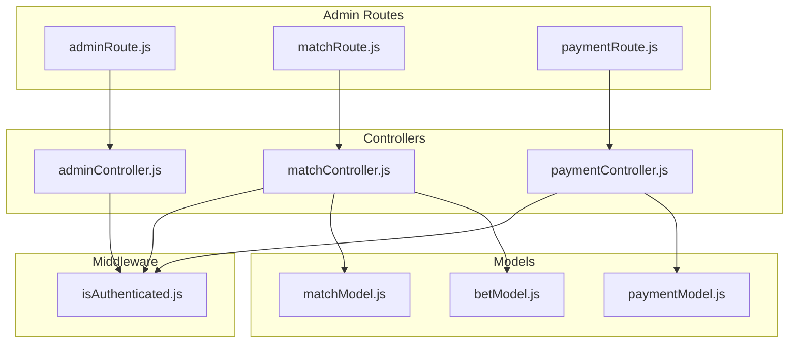
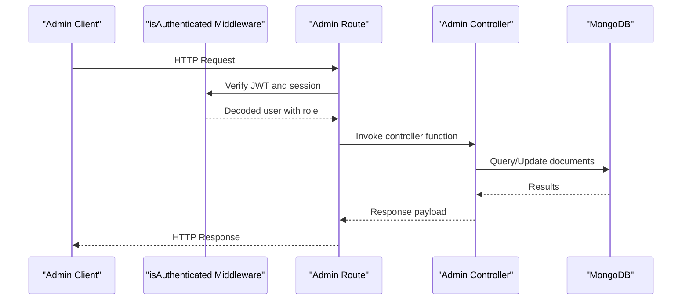
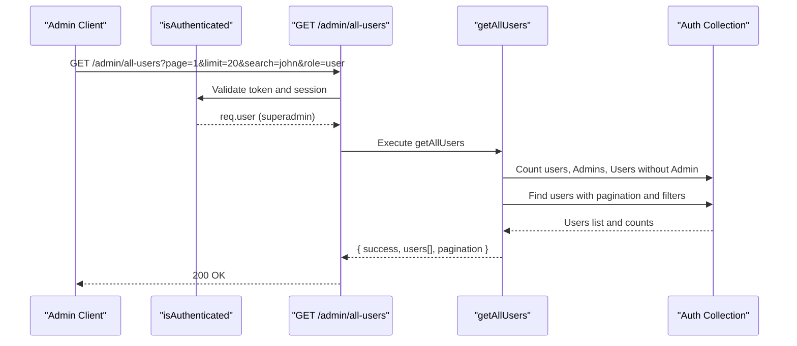
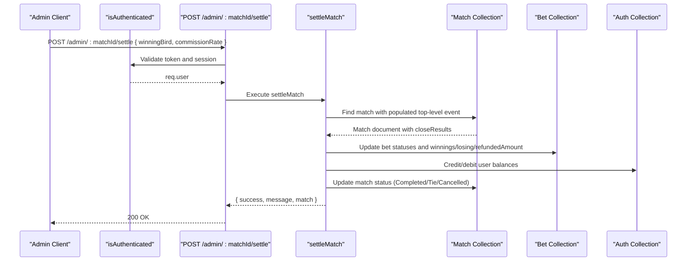
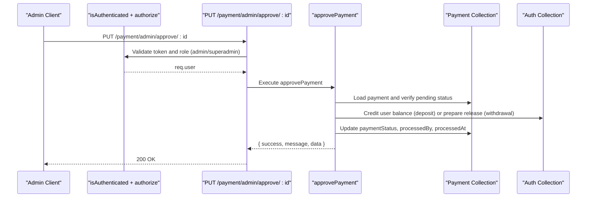
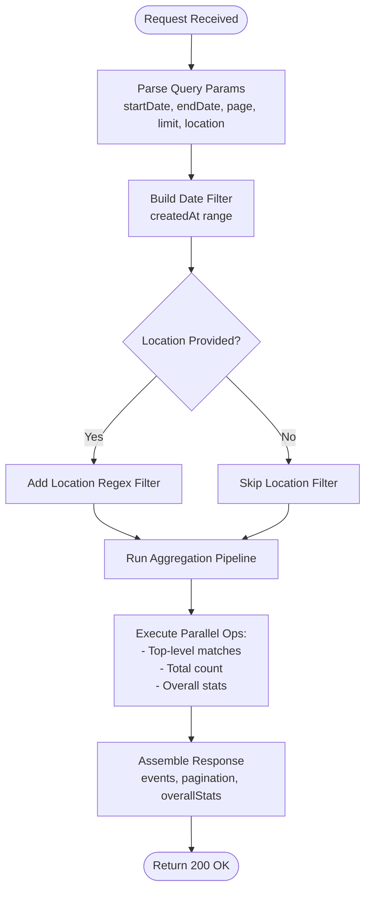
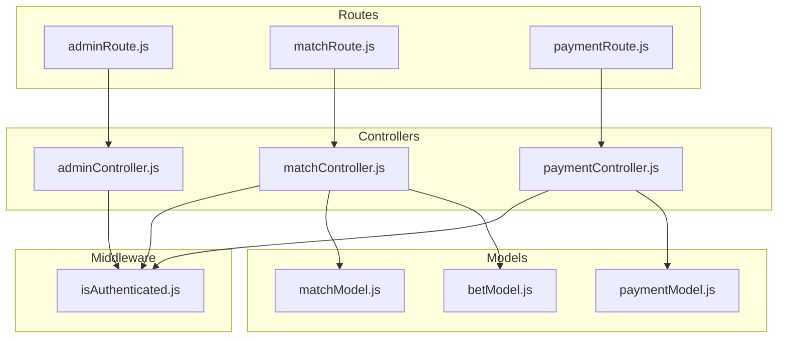

# Administrative Endpoints

<cite>
**Referenced Files in This Document**
- [adminRoute.js](file://server/routes/admin/adminRoute.js)
- [adminController.js](file://server/controllers/admin/adminController.js)
- [matchRoute.js](file://server/routes/admin/matchRoute.js)
- [matchController.js](file://server/controllers/admin/matchController.js)
- [paymentRoute.js](file://server/routes/payment/paymentRoute.js)
- [paymentController.js](file://server/controllers/payment/paymentController.js)
- [isAuthenticated.js](file://server/middleware/isAuthenticated.js)
- [matchModel.js](file://server/models/matchModel.js)
- [betModel.js](file://server/models/betModel.js)
- [paymentModel.js](file://server/models/paymentModel.js)
- [UserManagement.jsx](file://client/src/Pages/adminPage/UserManagement.jsx)
- [ManageEvents.jsx](file://client/src/Pages/adminPage/ManageEvents.jsx)
- [PaymentManagement.jsx](file://client/src/Pages/adminPage/PaymentManagement.jsx)
- [PlatformEarning.jsx](file://client/src/Pages/adminPage/PlatformEarning.jsx)
</cite>

## Table of Contents
1. [Introduction](#introduction)
2. [Project Structure](#project-structure)
3. [Core Components](#core-components)
4. [Architecture Overview](#architecture-overview)
5. [Detailed Component Analysis](#detailed-component-analysis)
6. [Dependency Analysis](#dependency-analysis)
7. [Performance Considerations](#performance-considerations)
8. [Troubleshooting Guide](#troubleshooting-guide)
9. [Conclusion](#conclusion)

## Introduction
This document provides comprehensive API documentation for administrative endpoints across four primary domains: user management, event and match management, payment oversight, and platform analytics. It covers request/response schemas, authorization requirements, and administrative workflows, with emphasis on security considerations for privileged operations and data protection.

## Project Structure
The administrative functionality is organized by domain with dedicated routes, controllers, and models:
- User management: `/admin/all-users`, `/admin/update-user-role`, `/admin/update-user-balance`, `/admin/delete-user`, `/admin/platform-statistics`, `/admin/platform-summary`
- Event and match management: `/admin/top-level/create`, `/admin/top-level`, `/admin/:id`, `/admin/create`, `/admin/:matchId`, `/admin/:matchId/status`, `/admin/:matchId/settle`, `/admin/:matchId/bets`, `/admin/top-level/:topLevelMatchId/complete`, `/admin/:topLevelMatchId/match-a-b`
- Payment oversight: `/payment/admin/all`, `/payment/admin/pending`, `/payment/admin/stats`, `/payment/admin/approve/:id`, `/payment/admin/reject/:id`, `/payment/admin/:id`
- Platform analytics: `/admin/platform-statistics`, `/admin/platform-summary`

**Diagram sources**
- [adminRoute.js](file://server/routes/admin/adminRoute.js#L1-L22)
- [matchRoute.js](file://server/routes/admin/matchRoute.js#L1-L38)
- [paymentRoute.js](file://server/routes/payment/paymentRoute.js#L1-L82)
- [adminController.js](file://server/controllers/admin/adminController.js#L1-L465)
- [matchController.js](file://server/controllers/admin/matchController.js#L1-L1188)
- [paymentController.js](file://server/controllers/payment/paymentController.js#L1-L868)
- [isAuthenticated.js](file://server/middleware/isAuthenticated.js#L1-L62)
- [matchModel.js](file://server/models/matchModel.js#L1-L101)
- [betModel.js](file://server/models/betModel.js#L1-L24)
- [paymentModel.js](file://server/models/paymentModel.js#L1-L160)

**Section sources**
- [adminRoute.js](file://server/routes/admin/adminRoute.js#L1-L22)
- [matchRoute.js](file://server/routes/admin/matchRoute.js#L1-L38)
- [paymentRoute.js](file://server/routes/payment/paymentRoute.js#L1-L82)

## Core Components

### Authentication and Authorization
- Authentication: JWT-based verification via `isAuthenticated` middleware validates tokens and checks session invalidation.
- Authorization: Role-based access control via `authorize` middleware restricts endpoints to admin roles.

Key behaviors:
- Token extraction from Authorization header
- Session token validation against user record
- Role enforcement for admin-only endpoints

**Section sources**
- [isAuthenticated.js](file://server/middleware/isAuthenticated.js#L1-L62)

### User Management Endpoints
- GET `/admin/all-users`: Retrieve paginated user listings with filtering by search term and role.
- PUT `/admin/update-user-role`: Change user role (admin/superadmin only).
- PUT `/admin/update-user-balance`: Adjust user balance.
- DELETE `/admin/delete-user`: Remove user account.
- GET `/admin/platform-statistics`: Comprehensive event-level analytics with pagination and date/location filters.
- GET `/admin/platform-summary`: Monthly summary of platform earnings.

Response schema (common):
- success: boolean
- message: string (on error)
- data: payload-specific object

User listing response (GET `/admin/all-users`):
- users: array of user objects with id, name, email, role, balance, createdAt
- pagination: currentPage, totalPages, totalUsers, totalAdmins, totalUsersWithoutAdmin, hasNextPage, hasPrevPage

Platform statistics response (GET `/admin/platform-statistics`):
- events: array of event objects with matchesArray containing match-level stats
- pagination: currentPage, totalPages, totalEvents, hasNextPage, hasPrevPage
- overallStats: totalCommissionEarned, totalEvents, totalUsers

**Section sources**
- [adminRoute.js](file://server/routes/admin/adminRoute.js#L14-L19)
- [adminController.js](file://server/controllers/admin/adminController.js#L5-L126)
- [adminController.js](file://server/controllers/admin/adminController.js#L128-L463)

### Event and Match Management Endpoints
- POST `/admin/top-level/create`: Create a top-level event (tournament) with location and thumbnail.
- GET `/admin/top-level`: Retrieve top-level matches with nested matches.
- PUT `/admin/:id`: Update top-level event details.
- POST `/admin/create`: Create a match under a top-level event with section and birds.
- GET `/admin/:matchId`: Retrieve match details with populated top-level event.
- PUT `/admin/:matchId/status`: Update match status (Upcoming, Active, Closed).
- POST `/admin/:matchId/settle`: Settle match with winner determination and fund distribution.
- GET `/admin/:matchId/bets`: Retrieve all bets for a specific match.
- POST `/admin/top-level/:topLevelMatchId/complete`: Mark top-level event as completed.
- GET `/admin/:topLevelMatchId/match-a-b`: Fetch matches with Active/Closed/Upcoming status.

Match settlement workflow:
- Precondition: Match must be Closed with stored close results.
- Winner selection: Red, Green, Tie, or Cancelled.
- Settlement logic:
  - Tie/Cancelled: Refund matched amounts to users (no commission).
  - Straight bets: Distribute matched amounts plus commission-deducted winnings.
  - Lay90/Call90 combinations: Apply specialized payout rules with commission calculations.
- Post-processing: Update match status to Completed/Tie/Cancelled and emit real-time notifications.

**Section sources**
- [matchRoute.js](file://server/routes/admin/matchRoute.js#L21-L34)
- [matchController.js](file://server/controllers/admin/matchController.js#L67-L1188)
- [matchModel.js](file://server/models/matchModel.js#L17-L92)
- [betModel.js](file://server/models/betModel.js#L3-L20)

### Payment Oversight Endpoints
- GET `/payment/admin/all`: Retrieve paginated payment requests with filtering by type and status.
- GET `/payment/admin/pending`: Fetch pending payment requests.
- GET `/payment/admin/stats`: Aggregate payment statistics by status/type.
- PUT `/payment/admin/approve/:id`: Approve payment and credit user balance (deposit) or release funds (withdrawal).
- PUT `/payment/admin/reject/:id`: Reject payment with optional reason.
- GET `/payment/admin/:id`: Retrieve payment details with user and admin metadata.

Payment lifecycle:
- Pending: Initial state for all requests.
- Approved: Deposit credited to user balance; withdrawal released.
- Rejected: Funds returned to user (withdrawal) or marked rejected.
- Completed/Failed/Cancelled: Terminal states.

**Section sources**
- [paymentRoute.js](file://server/routes/payment/paymentRoute.js#L65-L81)
- [paymentController.js](file://server/controllers/payment/paymentController.js#L537-L800)
- [paymentModel.js](file://server/models/paymentModel.js#L3-L160)

### Platform Analytics Endpoints
- GET `/admin/platform-statistics`: Detailed event-level analytics with match-level breakdowns (bet counts, total bet amounts, total commission).
- GET `/admin/platform-summary`: Monthly rollup of platform earnings by location and bet counts.

Analytics features:
- Date range filtering (startDate, endDate)
- Location filtering (location)
- Pagination (page, limit)
- Real-time commission calculation (10% from winning bets)

**Section sources**
- [adminRoute.js](file://server/routes/admin/adminRoute.js#L18-L19)
- [adminController.js](file://server/controllers/admin/adminController.js#L128-L463)

## Architecture Overview

**Diagram sources**
- [adminRoute.js](file://server/routes/admin/adminRoute.js#L14-L19)
- [adminController.js](file://server/controllers/admin/adminController.js#L5-L126)
- [isAuthenticated.js](file://server/middleware/isAuthenticated.js#L1-L62)

## Detailed Component Analysis

### User Management API

Authorization requirements:
- Endpoint requires authentication and superadmin role.

Request parameters:
- Query: page, limit, search, role

Response structure:
- success: boolean
- users: array of { id, name, email, role, balance, createdAt }
- pagination: { currentPage, totalPages, totalUsers, totalAdmins, totalUsersWithoutAdmin, hasNextPage, hasPrevPage }

**Diagram sources**
- [adminRoute.js](file://server/routes/admin/adminRoute.js#L14-L14)
- [adminController.js](file://server/controllers/admin/adminController.js#L5-L68)
- [isAuthenticated.js](file://server/middleware/isAuthenticated.js#L51-L61)

**Section sources**
- [adminRoute.js](file://server/routes/admin/adminRoute.js#L14-L14)
- [adminController.js](file://server/controllers/admin/adminController.js#L5-L68)

### Event and Match Management API

Settlement rules:
- Tie/Cancelled: Refund matched amounts; no commission applied.
- Straight bets: Distribute matched amount plus commission-deducted winnings.
- Lay90/Call90: Specialized payouts with commission calculations per side.

Validation:
- Match must be Closed and have closeResults.
- WinningBird must be one of the valid options.

**Diagram sources**
- [matchRoute.js](file://server/routes/admin/matchRoute.js#L31-L31)
- [matchController.js](file://server/controllers/admin/matchController.js#L902-L1165)
- [matchModel.js](file://server/models/matchModel.js#L36-L72)
- [betModel.js](file://server/models/betModel.js#L3-L20)

**Section sources**
- [matchRoute.js](file://server/routes/admin/matchRoute.js#L31-L31)
- [matchController.js](file://server/controllers/admin/matchController.js#L902-L1165)

### Payment Oversight API

Security considerations:
- Transaction isolation using MongoDB sessions for atomicity.
- Role-based authorization enforced via `authorize` middleware.
- Session token validation prevents replay attacks.

**Diagram sources**
- [paymentRoute.js](file://server/routes/payment/paymentRoute.js#L74-L74)
- [paymentController.js](file://server/controllers/payment/paymentController.js#L627-L692)
- [isAuthenticated.js](file://server/middleware/isAuthenticated.js#L51-L61)

**Section sources**
- [paymentRoute.js](file://server/routes/payment/paymentRoute.js#L74-L74)
- [paymentController.js](file://server/controllers/payment/paymentController.js#L627-L692)

### Platform Analytics API

Analytics features:
- Event-level aggregation with match-level stats (bet counts, total bet amounts, total commission).
- Monthly rollup for platform summary.
- Real-time commission computation (10% from winning bets).

**Diagram sources**
- [adminController.js](file://server/controllers/admin/adminController.js#L128-L382)
- [adminController.js](file://server/controllers/admin/adminController.js#L384-L463)

**Section sources**
- [adminController.js](file://server/controllers/admin/adminController.js#L128-L382)
- [adminController.js](file://server/controllers/admin/adminController.js#L384-L463)

## Dependency Analysis

**Diagram sources**
- [adminRoute.js](file://server/routes/admin/adminRoute.js#L1-L22)
- [matchRoute.js](file://server/routes/admin/matchRoute.js#L1-L38)
- [paymentRoute.js](file://server/routes/payment/paymentRoute.js#L1-L82)
- [adminController.js](file://server/controllers/admin/adminController.js#L1-L465)
- [matchController.js](file://server/controllers/admin/matchController.js#L1-L1188)
- [paymentController.js](file://server/controllers/payment/paymentController.js#L1-L868)
- [isAuthenticated.js](file://server/middleware/isAuthenticated.js#L1-L62)
- [matchModel.js](file://server/models/matchModel.js#L1-L101)
- [betModel.js](file://server/models/betModel.js#L1-L24)
- [paymentModel.js](file://server/models/paymentModel.js#L1-L160)

**Section sources**
- [adminRoute.js](file://server/routes/admin/adminRoute.js#L1-L22)
- [matchRoute.js](file://server/routes/admin/matchRoute.js#L1-L38)
- [paymentRoute.js](file://server/routes/payment/paymentRoute.js#L1-L82)

## Performance Considerations
- Aggregation pipelines in platform analytics leverage indexed fields for efficient filtering and sorting.
- Pagination parameters (page, limit) prevent large result sets and reduce memory usage.
- Parallel execution of analytics queries improves response times for complex aggregations.
- Database indexes on frequently queried fields (status, createdAt, matchId) optimize query performance.

## Troubleshooting Guide
Common issues and resolutions:
- Authentication failures: Verify Authorization header format and token validity; check session token against user record.
- Authorization errors: Ensure user role includes required admin privileges.
- Business rule violations: Match settlement requires Closed status with stored close results; status transitions are validated.
- Payment approvals: Confirm payment is in pending state and perform atomic updates with session handling.

Operational tips:
- Monitor database query performance using indexes.
- Validate request payloads before invoking controllers.
- Use pagination to manage large datasets.

**Section sources**
- [isAuthenticated.js](file://server/middleware/isAuthenticated.js#L4-L49)
- [matchController.js](file://server/controllers/admin/matchController.js#L513-L901)
- [paymentController.js](file://server/controllers/payment/paymentController.js#L627-L744)

## Conclusion
The administrative endpoints provide comprehensive control over user accounts, event and match lifecycle, payment processing, and platform analytics. Robust authentication and authorization ensure only authorized administrators can perform privileged operations. The APIs support real-time updates, detailed analytics, and secure financial workflows with proper validation and error handling.