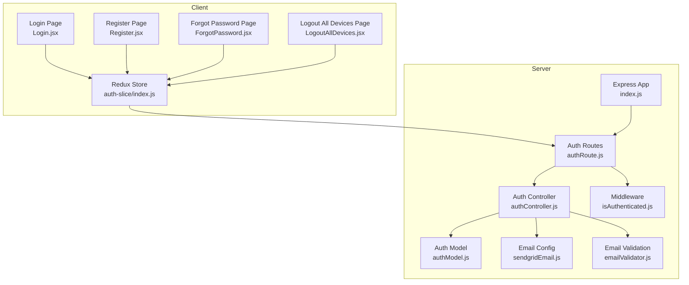
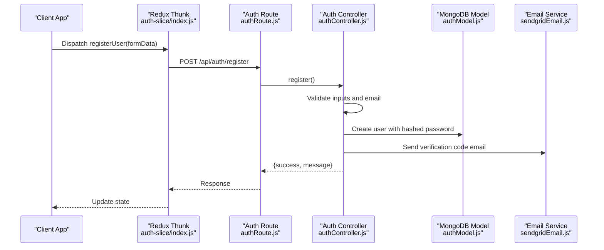
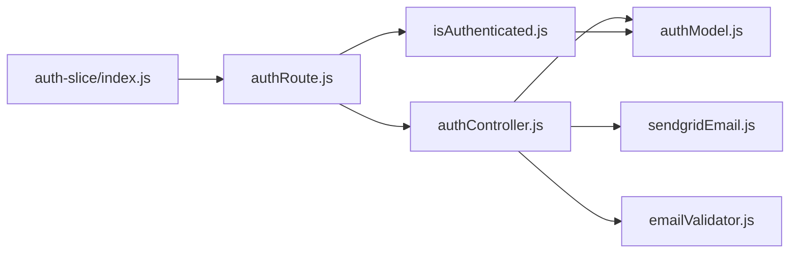

# Authentication Endpoints

<cite>
**Referenced Files in This Document**
- [authRoute.js](file://server/routes/auth/authRoute.js)
- [authController.js](file://server/controllers/auth/authController.js)
- [isAuthenticated.js](file://server/middleware/isAuthenticated.js)
- [authModel.js](file://server/models/authModel.js)
- [index.js](file://server/index.js)
- [emailValidator.js](file://server/config/emailValidator.js)
- [sendgridEmail.js](file://server/config/sendgridEmail.js)
- [index.js](file://client/src/store/auth-slice/index.js)
- [Login.jsx](file://client/src/Pages/authPage/Login.jsx)
- [Register.jsx](file://client/src/Pages/authPage/Register.jsx)
- [ForgotPassword.jsx](file://client/src/Pages/ForgotPassword.jsx)
- [LogoutAllDevices.jsx](file://client/src/Pages/LogoutAllDevices.jsx)
- [.env](file://server/.env)
</cite>

## Table of Contents
1. [Introduction](#introduction)
2. [Project Structure](#project-structure)
3. [Core Components](#core-components)
4. [Architecture Overview](#architecture-overview)
5. [Detailed Component Analysis](#detailed-component-analysis)
6. [Dependency Analysis](#dependency-analysis)
7. [Performance Considerations](#performance-considerations)
8. [Troubleshooting Guide](#troubleshooting-guide)
9. [Conclusion](#conclusion)
10. [Appendices](#appendices)

## Introduction
This document provides comprehensive API documentation for the authentication endpoints in the betting application. It covers registration, login, OTP verification, logout (including forced logout), password recovery, and administrative logout endpoints. For each endpoint, you will find request/response schemas, authentication headers, error codes, security considerations, and practical curl examples with response samples.

## Project Structure
The authentication system spans both backend and frontend:
- Backend routes define the endpoints and apply middleware for authentication and authorization.
- Controllers implement business logic, including validation, hashing, JWT generation, and email delivery.
- Middleware enforces bearer token validation and role-based access control.
- Models define the user schema and indexes.
- Frontend pages integrate with Redux Thunks to call the backend APIs and manage user sessions.

**Diagram sources**
- [authRoute.js](file://server/routes/auth/authRoute.js#L1-L34)
- [authController.js](file://server/controllers/auth/authController.js#L1-L457)
- [isAuthenticated.js](file://server/middleware/isAuthenticated.js#L1-L62)
- [authModel.js](file://server/models/authModel.js#L1-L40)
- [index.js](file://server/index.js#L1-L150)
- [index.js](file://client/src/store/auth-slice/index.js#L1-L342)

**Section sources**
- [authRoute.js](file://server/routes/auth/authRoute.js#L1-L34)
- [index.js](file://server/index.js#L93-L100)

## Core Components
- Authentication routes expose endpoints under /api/auth.
- Controllers implement validation, hashing, JWT signing, and email delivery.
- Middleware validates JWT tokens and checks for forced logout conditions.
- Model defines user fields, roles, and verification fields.
- Frontend Redux Thunks encapsulate HTTP calls and manage state transitions.

Key responsibilities:
- Registration: validate inputs, check email validity, hash password, create user, send OTP email.
- Login: verify credentials, check account verification, generate JWT, save session token.
- OTP verification: validate OTP and expiration, mark user as verified.
- Logout: remove session token for current user.
- Force logout: send OTP, verify OTP, invalidate session token for user.
- Password recovery: send OTP, verify OTP, reset password and invalidate sessions.
- Admin logout: superadmin endpoints to force logout all users or a specific user.

**Section sources**
- [authController.js](file://server/controllers/auth/authController.js#L50-L124)
- [authController.js](file://server/controllers/auth/authController.js#L195-L250)
- [authController.js](file://server/controllers/auth/authController.js#L150-L193)
- [authController.js](file://server/controllers/auth/authController.js#L252-L267)
- [authController.js](file://server/controllers/auth/authController.js#L268-L337)
- [authController.js](file://server/controllers/auth/authController.js#L356-L425)
- [authController.js](file://server/controllers/auth/authController.js#L427-L456)
- [authModel.js](file://server/models/authModel.js#L3-L32)

## Architecture Overview
The authentication flow integrates frontend Redux Thunks with backend routes and controllers. Middleware verifies JWTs and ensures sessions remain valid. Email services are configured for OTP delivery.

**Diagram sources**
- [index.js](file://client/src/store/auth-slice/index.js#L12-L29)
- [authRoute.js](file://server/routes/auth/authRoute.js#L20-L20)
- [authController.js](file://server/controllers/auth/authController.js#L50-L124)
- [authModel.js](file://server/models/authModel.js#L3-L32)
- [sendgridEmail.js](file://server/config/sendgridEmail.js#L6-L31)

## Detailed Component Analysis

### Registration Endpoint
- Path: POST /api/auth/register
- Purpose: Create a new user account with validated email and hashed password, send verification code via email.
- Authentication: Not required.
- Request body:
  - name: string (required)
  - email: string (required)
  - phone: string (required)
  - password: string (required)
  - confirmPassword: string (required)
- Response body:
  - success: boolean
  - message: string
- Error codes:
  - 400: All fields required, passwords do not match, invalid phone number, user exists, max attempts exceeded, email validation failed.
  - 500: Server error.
- Security considerations:
  - Phone number validation regex enforced.
  - Email validation via ZeroBounce and DNS MX records.
  - Duplicate email/phone detection.
  - OTP expiry set to 10 minutes.
- curl example:
  - curl -X POST https://localhost:5500/api/auth/register -H "Content-Type: application/json" -d '{"name":"John Doe","email":"john@example.com","phone":"+11234567890","password":"SecurePass123","confirmPassword":"SecurePass123"}'
- Response sample:
  - {"success":true,"message":"Verification email successfully sent to john@example.com"}

**Section sources**
- [authRoute.js](file://server/routes/auth/authRoute.js#L20-L20)
- [authController.js](file://server/controllers/auth/authController.js#L50-L124)
- [emailValidator.js](file://server/config/emailValidator.js#L10-L126)
- [sendgridEmail.js](file://server/config/sendgridEmail.js#L6-L31)

### Login Endpoint
- Path: POST /api/auth/login
- Purpose: Authenticate user credentials, verify account, generate JWT, and save session token.
- Authentication: Not required.
- Request body:
  - email: string (required)
  - password: string (required)
- Response body:
  - success: boolean
  - message: string
  - verified: boolean
  - Token: string (JWT)
  - userData: object (excluding password)
- Error codes:
  - 400: All fields required, user not found, invalid credentials, account not verified.
  - 500: Server error.
- Security considerations:
  - Password comparison using bcrypt.
  - JWT signing with secret key from environment.
  - Session token stored in user document.
  - Account verification check before login success.
- curl example:
  - curl -X POST https://localhost:5500/api/auth/login -H "Content-Type: application/json" -d '{"email":"john@example.com","password":"SecurePass123"}'
- Response sample:
  - {"success":true,"message":"Login successful","verified":true,"Token":"<JWT>","userData":{"_id":"...","email":"john@example.com","name":"John Doe","phone":"+11234567890","verified":true,"balance":0,"role":"user"}}

**Section sources**
- [authRoute.js](file://server/routes/auth/authRoute.js#L21-L21)
- [authController.js](file://server/controllers/auth/authController.js#L195-L250)
- [isAuthenticated.js](file://server/middleware/isAuthenticated.js#L1-L62)

### OTP Verification Endpoint
- Path: POST /api/auth/verify-otp
- Purpose: Verify the 6-digit OTP sent to the user’s email and mark the account as verified.
- Authentication: Not required.
- Request body:
  - email: string (required)
  - otp: string (required)
- Response body:
  - success: boolean
  - message: string
- Error codes:
  - 400: User not found, invalid OTP, OTP expired.
  - 500: OTP verification failed.
- Security considerations:
  - OTP must match stored numeric code.
  - Expiration checked against current time.
  - Cleanup of verification fields upon success.
- curl example:
  - curl -X POST https://localhost:5500/api/auth/verify-otp -H "Content-Type: application/json" -d '{"email":"john@example.com","otp":"123456"}'
- Response sample:
  - {"success":true,"message":"OTP verified successfully."}

**Section sources**
- [authRoute.js](file://server/routes/auth/authRoute.js#L22-L22)
- [authController.js](file://server/controllers/auth/authController.js#L150-L193)

### Resend OTP Endpoint
- Path: POST /api/auth/resend-otp
- Purpose: Resend a new 6-digit verification code to the user’s email.
- Authentication: Not required.
- Request body:
  - email: string (required)
- Response body:
  - success: boolean
  - message: string
- Error codes:
  - 400: All fields required, user not found.
  - 500: Server error.
- curl example:
  - curl -X POST https://localhost:5500/api/auth/resend-otp -H "Content-Type: application/json" -d '{"email":"john@example.com"}'
- Response sample:
  - {"success":true,"message":"Verification code sent successfully"}

**Section sources**
- [authRoute.js](file://server/routes/auth/authRoute.js#L29-L29)
- [authController.js](file://server/controllers/auth/authController.js#L125-L149)

### Logout Endpoint
- Path: POST /api/auth/logout
- Purpose: Remove the current session token for the authenticated user.
- Authentication: Required (Bearer token).
- Headers:
  - Authorization: Bearer <JWT>
- Request body: empty
- Response body:
  - success: boolean
  - message: string
- Error codes:
  - 401: User not authenticated, token expired, invalid token, user not found, session terminated.
  - 500: Server error.
- curl example:
  - curl -X POST https://localhost:5500/api/auth/logout -H "Authorization: Bearer <JWT>" -H "Content-Type: application/json"
- Response sample:
  - {"success":true,"message":"Logout successful"}

**Section sources**
- [authRoute.js](file://server/routes/auth/authRoute.js#L23-L23)
- [authController.js](file://server/controllers/auth/authController.js#L252-L267)
- [isAuthenticated.js](file://server/middleware/isAuthenticated.js#L1-L62)

### Force Logout (Send OTP) Endpoint
- Path: POST /api/auth/force-logout-send-otp
- Purpose: Send a 6-digit OTP to the user’s email for forced logout confirmation.
- Authentication: Not required.
- Request body:
  - email: string (required)
- Response body:
  - success: boolean
  - message: string
- Error codes:
  - 400: All fields required, user not found.
  - 500: Server error.
- curl example:
  - curl -X POST https://localhost:5500/api/auth/force-logout-send-otp -H "Content-Type: application/json" -d '{"email":"john@example.com"}'
- Response sample:
  - {"success":true,"message":"Force logout code sent successfully"}

**Section sources**
- [authRoute.js](file://server/routes/auth/authRoute.js#L28-L28)
- [authController.js](file://server/controllers/auth/authController.js#L268-L292)

### Force Logout Endpoint
- Path: POST /api/auth/force-logout
- Purpose: Invalidate the user’s session token after verifying OTP.
- Authentication: Not required.
- Request body:
  - email: string (required)
  - otp: string (required)
- Response body:
  - success: boolean
  - message: string
- Error codes:
  - 400: Email and OTP required, user not found, invalid OTP, OTP expired.
  - 500: Server error.
- curl example:
  - curl -X POST https://localhost:5500/api/auth/force-logout -H "Content-Type: application/json" -d '{"email":"john@example.com","otp":"123456"}'
- Response sample:
  - {"success":true,"message":"logged out from all devices successfully"}

**Section sources**
- [authRoute.js](file://server/routes/auth/authRoute.js#L27-L27)
- [authController.js](file://server/controllers/auth/authController.js#L294-L337)

### Password Recovery (Forgot Password) Endpoint
- Path: POST /api/auth/forgot-password
- Purpose: Send a 6-digit OTP to the user’s email for password reset.
- Authentication: Not required.
- Request body:
  - email: string (required)
- Response body:
  - success: boolean
  - message: string
- Error codes:
  - 400: All fields required, user not found.
  - 500: Server error.
- curl example:
  - curl -X POST https://localhost:5500/api/auth/forgot-password -H "Content-Type: application/json" -d '{"email":"john@example.com"}'
- Response sample:
  - {"success":true,"message":"Password reset code sent successfully"}

**Section sources**
- [authRoute.js](file://server/routes/auth/authRoute.js#L25-L25)
- [authController.js](file://server/controllers/auth/authController.js#L356-L384)

### Reset Password Endpoint
- Path: POST /api/auth/reset-password
- Purpose: Reset the user’s password after verifying OTP and ensure session invalidation.
- Authentication: Not required.
- Request body:
  - email: string (required)
  - newPassword: string (required)
  - confirmPassword: string (required)
  - otp: string (required)
- Response body:
  - success: boolean
  - message: string
- Error codes:
  - 400: All fields required, passwords do not match, user not found, invalid OTP, OTP expired.
  - 500: Server error.
- curl example:
  - curl -X POST https://localhost:5500/api/auth/reset-password -H "Content-Type: application/json" -d '{"email":"john@example.com","newPassword":"NewPass456","confirmPassword":"NewPass456","otp":"123456"}'
- Response sample:
  - {"success":true,"message":"Password reset successfully"}

**Section sources**
- [authRoute.js](file://server/routes/auth/authRoute.js#L26-L26)
- [authController.js](file://server/controllers/auth/authController.js#L386-L425)

### User Profile Retrieval Endpoint
- Path: GET /api/auth/get-user
- Purpose: Retrieve the authenticated user’s profile data.
- Authentication: Required (Bearer token).
- Headers:
  - Authorization: Bearer <JWT>
- Request body: empty
- Response body:
  - success: boolean
  - message: string
  - userData: object (excluding password)
- Error codes:
  - 401: User not authenticated, token expired, invalid token, user not found, session terminated.
  - 500: Server error.
- curl example:
  - curl -X GET https://localhost:5500/api/auth/get-user -H "Authorization: Bearer <JWT>"
- Response sample:
  - {"success":true,"message":"User details fetched successfully","userData":{"_id":"...","email":"john@example.com","name":"John Doe","phone":"+11234567890","verified":true,"balance":0,"role":"user"}}

**Section sources**
- [authRoute.js](file://server/routes/auth/authRoute.js#L24-L24)
- [authController.js](file://server/controllers/auth/authController.js#L339-L354)
- [isAuthenticated.js](file://server/middleware/isAuthenticated.js#L1-L62)

### Administrative Logout Endpoints
- Superadmin Force Logout All Users
  - Path: POST /api/auth/superadmin-force-logout-all
  - Purpose: Force logout all non-admin users by clearing their session tokens.
  - Authentication: Required (Bearer token), Role: superadmin.
  - Headers:
    - Authorization: Bearer <JWT>
  - Request body: empty
  - Response body:
    - success: boolean
    - message: string
  - Error codes:
    - 401: User not authenticated, token expired, invalid token, user not found, session terminated.
    - 403: Unauthorized role access.
    - 500: Server error.
  - curl example:
    - curl -X POST https://localhost:5500/api/auth/superadmin-force-logout-all -H "Authorization: Bearer <JWT>" -H "Content-Type: application/json"
  - Response sample:
    - {"success":true,"message":"All users logged out successfully"}

- Superadmin Force Logout Specific User
  - Path: POST /api/auth/superadmin-force-logout-user
  - Purpose: Force logout a specific user by clearing their session token.
  - Authentication: Required (Bearer token), Role: superadmin.
  - Headers:
    - Authorization: Bearer <JWT>
  - Request body:
    - userId: string (required)
  - Response body:
    - success: boolean
    - message: string
  - Error codes:
    - 400: User not found.
    - 401: User not authenticated, token expired, invalid token, user not found, session terminated.
    - 403: Unauthorized role access.
    - 500: Server error.
  - curl example:
    - curl -X POST https://localhost:5500/api/auth/superadmin-force-logout-user -H "Authorization: Bearer <JWT>" -H "Content-Type: application/json" -d '{"userId":"<USER_ID>"}'
  - Response sample:
    - {"success":true,"message":"User logged out successfully"}

**Section sources**
- [authRoute.js](file://server/routes/auth/authRoute.js#L30-L31)
- [authController.js](file://server/controllers/auth/authController.js#L427-L456)
- [isAuthenticated.js](file://server/middleware/isAuthenticated.js#L51-L61)

## Dependency Analysis
- Routes depend on controllers for business logic.
- Controllers depend on:
  - Auth model for user persistence.
  - Email service for OTP delivery.
  - Email validation service for email checks.
- Middleware depends on JWT library and Auth model for token verification and session checks.
- Frontend Redux Thunks depend on environment variables for base URL and Axios for HTTP calls.

**Diagram sources**
- [authRoute.js](file://server/routes/auth/authRoute.js#L1-L34)
- [authController.js](file://server/controllers/auth/authController.js#L1-L457)
- [authModel.js](file://server/models/authModel.js#L1-L40)
- [isAuthenticated.js](file://server/middleware/isAuthenticated.js#L1-L62)
- [sendgridEmail.js](file://server/config/sendgridEmail.js#L1-L58)
- [emailValidator.js](file://server/config/emailValidator.js#L1-L127)
- [index.js](file://client/src/store/auth-slice/index.js#L1-L342)

**Section sources**
- [authRoute.js](file://server/routes/auth/authRoute.js#L1-L34)
- [authController.js](file://server/controllers/auth/authController.js#L1-L457)
- [isAuthenticated.js](file://server/middleware/isAuthenticated.js#L1-L62)
- [authModel.js](file://server/models/authModel.js#L1-L40)
- [sendgridEmail.js](file://server/config/sendgridEmail.js#L1-L58)
- [emailValidator.js](file://server/config/emailValidator.js#L1-L127)
- [index.js](file://client/src/store/auth-slice/index.js#L1-L342)

## Performance Considerations
- Rate limiting and CORS are configured at the Express level to prevent abuse and ensure cross-origin safety.
- Body parsing limits are increased to accommodate larger payloads.
- Request timeouts are extended to 3 minutes to handle long-running operations.
- Email validation and OTP generation are asynchronous; ensure queueing or background processing for high throughput.
- JWT signing and bcrypt hashing are CPU-intensive; monitor server resources during peak login periods.

[No sources needed since this section provides general guidance]

## Troubleshooting Guide
Common issues and resolutions:
- Authentication failures:
  - Ensure Authorization header includes Bearer token.
  - Verify token is not expired and matches stored session token.
  - Check user still exists and sessionToken is present.
- Email delivery problems:
  - Confirm SendGrid API key and environment variables are set.
  - Validate email domain has MX records and is not disposable.
- OTP issues:
  - Verify OTP length and numeric format.
  - Check OTP expiration (10 minutes).
  - Ensure resend-otp is used when needed.
- Registration errors:
  - Validate phone number format and uniqueness.
  - Confirm email passes ZeroBounce and DNS checks.
  - Respect maximum registration attempts.

**Section sources**
- [isAuthenticated.js](file://server/middleware/isAuthenticated.js#L1-L62)
- [authController.js](file://server/controllers/auth/authController.js#L125-L149)
- [emailValidator.js](file://server/config/emailValidator.js#L10-L126)
- [sendgridEmail.js](file://server/config/sendgridEmail.js#L6-L58)

## Conclusion
The authentication system provides robust endpoints for user lifecycle management, including secure registration, login, OTP verification, logout, password recovery, and administrative logout controls. The design emphasizes validation, security (JWT, bcrypt), and user experience (email-based OTP). Following the documented schemas, headers, and examples will help integrate clients and troubleshoot issues effectively.

[No sources needed since this section summarizes without analyzing specific files]

## Appendices

### Request/Response Schemas

- Registration
  - Request: { name, email, phone, password, confirmPassword }
  - Response: { success, message }

- Login
  - Request: { email, password }
  - Response: { success, message, verified, Token, userData }

- OTP Verification
  - Request: { email, otp }
  - Response: { success, message }

- Resend OTP
  - Request: { email }
  - Response: { success, message }

- Logout
  - Request: {}
  - Response: { success, message }

- Force Logout (Send OTP)
  - Request: { email }
  - Response: { success, message }

- Force Logout
  - Request: { email, otp }
  - Response: { success, message }

- Forgot Password
  - Request: { email }
  - Response: { success, message }

- Reset Password
  - Request: { email, newPassword, confirmPassword, otp }
  - Response: { success, message }

- Get User
  - Request: {}
  - Response: { success, message, userData }

- Superadmin Force Logout All
  - Request: {}
  - Response: { success, message }

- Superadmin Force Logout User
  - Request: { userId }
  - Response: { success, message }

### Authentication Headers
- Authorization: Bearer <JWT>

### Environment Variables
- JWT_SECRET_KEY: Secret key for JWT signing.
- SENDGRID_API_KEY: SendGrid API key for email delivery.
- ZEROBOUNCE_API_KEY: ZeroBounce API key for email validation.

**Section sources**
- [.env](file://server/.env#L4-L44)
- [authController.js](file://server/controllers/auth/authController.js#L227-L238)
- [isAuthenticated.js](file://server/middleware/isAuthenticated.js#L5-L6)