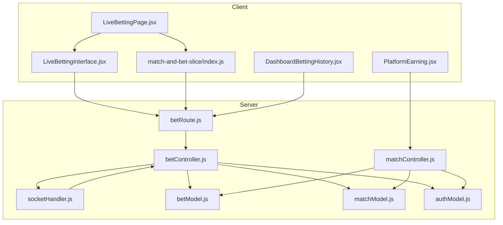
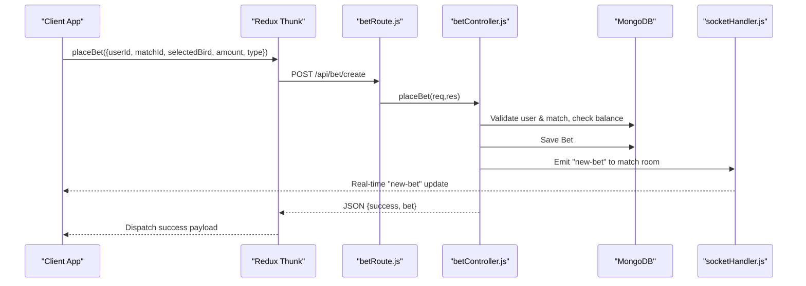
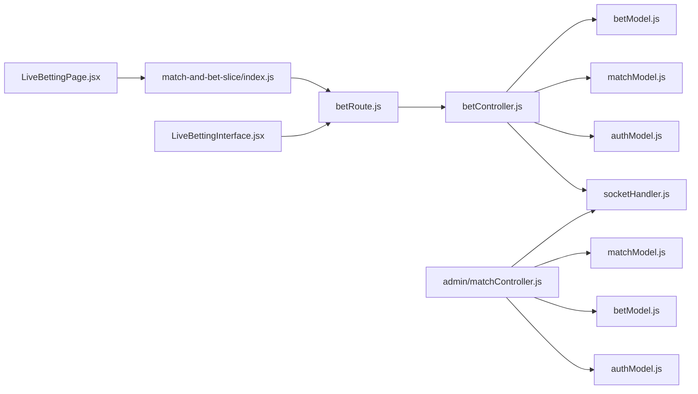
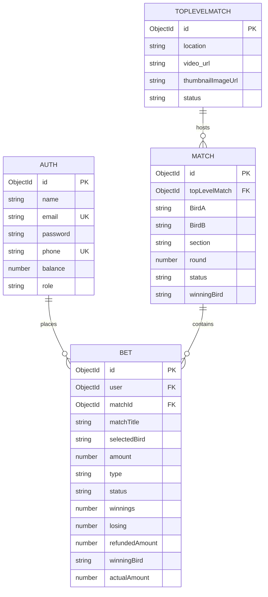

# Betting Endpoints

<cite>
**Referenced Files in This Document**
- [betRoute.js](file://server/routes/bet/betRoute.js)
- [betController.js](file://server/controllers/bet/betController.js)
- [betModel.js](file://server/models/betModel.js)
- [matchModel.js](file://server/models/matchModel.js)
- [authModel.js](file://server/models/authModel.js)
- [socketHandler.js](file://server/socket/socketHandler.js)
- [matchController.js](file://server/controllers/admin/matchController.js)
- [LiveBettingPage.jsx](file://client/src/Pages/Bet/LiveBettingPage.jsx)
- [LiveBettingInterface.jsx](file://client/src/components/Bet/LiveBettingInterface.jsx)
- [match-and-bet-slice/index.js](file://client/src/store/user/match-and-bet-slice/index.js)
- [DashboardBettingHistory.jsx](file://client/src/components/User/DashboardBettingHistory.jsx)
- [PlatformEarning.jsx](file://client/src/Pages/adminPage/PlatformEarning.jsx)
- [adminController.js](file://server/controllers/admin/adminController.js)
</cite>

## Table of Contents
1. [Introduction](#introduction)
2. [Project Structure](#project-structure)
3. [Core Components](#core-components)
4. [Architecture Overview](#architecture-overview)
5. [Detailed Component Analysis](#detailed-component-analysis)
6. [Dependency Analysis](#dependency-analysis)
7. [Performance Considerations](#performance-considerations)
8. [Troubleshooting Guide](#troubleshooting-guide)
9. [Conclusion](#conclusion)
10. [Appendices](#appendices)

## Introduction
This document provides comprehensive API documentation for betting endpoints in the application. It covers bet placement, odds retrieval for live betting, betting history, bet settlement, cancellation/modification constraints, and analytics/statistics. It also documents request/response schemas, validation rules, error handling, and examples of bet types (Straight, Lay90, Call90).

## Project Structure
The betting system spans server-side routes/controllers/models and client-side pages/slices that integrate with WebSocket updates and Redux for state management.

**Diagram sources**
- [betRoute.js](file://server/routes/bet/betRoute.js#L1-L11)
- [betController.js](file://server/controllers/bet/betController.js#L1-L125)
- [matchController.js](file://server/controllers/admin/matchController.js#L1-L1188)
- [socketHandler.js](file://server/socket/socketHandler.js#L1-L101)
- [betModel.js](file://server/models/betModel.js#L1-L24)
- [matchModel.js](file://server/models/matchModel.js#L1-L101)
- [authModel.js](file://server/models/authModel.js#L1-L40)
- [LiveBettingPage.jsx](file://client/src/Pages/Bet/LiveBettingPage.jsx#L1-L943)
- [LiveBettingInterface.jsx](file://client/src/components/Bet/LiveBettingInterface.jsx#L1-L439)
- [match-and-bet-slice/index.js](file://client/src/store/user/match-and-bet-slice/index.js#L1-L127)
- [DashboardBettingHistory.jsx](file://client/src/components/User/DashboardBettingHistory.jsx#L1-L523)
- [PlatformEarning.jsx](file://client/src/Pages/adminPage/PlatformEarning.jsx#L1-L140)

**Section sources**
- [betRoute.js](file://server/routes/bet/betRoute.js#L1-L11)
- [betController.js](file://server/controllers/bet/betController.js#L1-L125)
- [matchController.js](file://server/controllers/admin/matchController.js#L1-L1188)
- [socketHandler.js](file://server/socket/socketHandler.js#L1-L101)
- [betModel.js](file://server/models/betModel.js#L1-L24)
- [matchModel.js](file://server/models/matchModel.js#L1-L101)
- [authModel.js](file://server/models/authModel.js#L1-L40)
- [LiveBettingPage.jsx](file://client/src/Pages/Bet/LiveBettingPage.jsx#L1-L943)
- [LiveBettingInterface.jsx](file://client/src/components/Bet/LiveBettingInterface.jsx#L1-L439)
- [match-and-bet-slice/index.js](file://client/src/store/user/match-and-bet-slice/index.js#L1-L127)
- [DashboardBettingHistory.jsx](file://client/src/components/User/DashboardBettingHistory.jsx#L1-L523)
- [PlatformEarning.jsx](file://client/src/Pages/adminPage/PlatformEarning.jsx#L1-L140)

## Core Components
- Routes: Define endpoints for bet placement, bet status lookup, and per-match bets retrieval.
- Controllers: Implement business logic for placing bets, validating inputs, checking balances, and emitting real-time updates.
- Models: Define schemas for Bet, Match, and Auth, including enums and indexes.
- Socket: Manage rooms and broadcast real-time updates for new bets, match status, and bet close/refund notifications.
- Client slices/pages: Integrate with Redux Thunk to call server endpoints and consume WebSocket events.

**Section sources**
- [betRoute.js](file://server/routes/bet/betRoute.js#L1-L11)
- [betController.js](file://server/controllers/bet/betController.js#L1-L125)
- [betModel.js](file://server/models/betModel.js#L1-L24)
- [matchModel.js](file://server/models/matchModel.js#L1-L101)
- [authModel.js](file://server/models/authModel.js#L1-L40)
- [socketHandler.js](file://server/socket/socketHandler.js#L1-L101)
- [match-and-bet-slice/index.js](file://client/src/store/user/match-and-bet-slice/index.js#L1-L127)

## Architecture Overview
The system uses REST APIs for CRUD-like operations and Socket.IO for real-time updates. The bet placement flow validates user balance and match status, persists the bet, and emits updates to the match room and admin room. Settlement and cancellation are handled by admin controllers that compute matching results and update user balances and bet statuses.

**Diagram sources**
- [match-and-bet-slice/index.js](file://client/src/store/user/match-and-bet-slice/index.js#L95-L114)
- [betRoute.js](file://server/routes/bet/betRoute.js#L1-L11)
- [betController.js](file://server/controllers/bet/betController.js#L42-L106)
- [socketHandler.js](file://server/socket/socketHandler.js#L58-L72)

## Detailed Component Analysis

### Bet Placement Endpoint
- Method: POST
- Path: /api/bet/create
- Purpose: Place a new bet with validation and real-time updates.

Request
- Body fields:
  - matchId: ObjectId (required)
  - userId: ObjectId (required)
  - selectedBird: String (required; must be one of the two birds in the match)
  - amount: Number (required; must be > 0; validated against user balance)
  - type: Enum ["Straight", "Lay90", "Call90"] (required)
- Validation rules:
  - All required fields present.
  - amount > 0.
  - User exists and has sufficient balance.
  - Match exists and status is "Active".
  - selectedBird must match one of the match’s birds.
  - Rounded amount to two decimals before persisting.
- Behavior:
  - Deduct amount from user balance.
  - Persist Bet with computed matchTitle.
  - Emit "new-bet" to the match-specific room.
  - Return success with bet details.

Response
- Success: 201 Created with {success: true, message, bet}.
- Errors: 400 Bad Request for missing fields, insufficient funds, invalid match status; 404 Not Found for user/match; 500 Internal Server Error otherwise.

Real-time Updates
- Clients join "match-{matchId}" room and receive "new-bet" events.

Examples
- Straight bet: type = "Straight"
- Lay90 bet: type = "Lay90" (UI currently marks as "Coming Soon")
- Call90 bet: type = "Call90" (UI currently marks as "Coming Soon")

**Section sources**
- [betRoute.js](file://server/routes/bet/betRoute.js#L6-L6)
- [betController.js](file://server/controllers/bet/betController.js#L42-L106)
- [betModel.js](file://server/models/betModel.js#L10-L11)
- [matchModel.js](file://server/models/matchModel.js#L24-L26)
- [authModel.js](file://server/models/authModel.js#L22-L22)
- [socketHandler.js](file://server/socket/socketHandler.js#L9-L14)
- [LiveBettingPage.jsx](file://client/src/Pages/Bet/LiveBettingPage.jsx#L420-L517)
- [LiveBettingInterface.jsx](file://client/src/components/Bet/LiveBettingInterface.jsx#L216-L235)

### Odds Retrieval and Live Betting
- Method: GET
- Path: /api/bet/:matchId
- Purpose: Retrieve all bets for a given match (used by client to populate live feed and stats).

Request
- Path parameters:
  - matchId: ObjectId (required)
- Validation:
  - Match must exist; otherwise 404 Not Found.

Response
- Success: 200 OK with {success: true, bets[], count}.
- Errors: 500 Internal Server Error on failure.

Real-time Updates
- Clients listen for "new-bet" events via Socket.IO to keep the live feed fresh.
- Clients also listen for "match-update" to refresh match status and trigger local fetches.

**Section sources**
- [betRoute.js](file://server/routes/bet/betRoute.js#L8-L8)
- [betController.js](file://server/controllers/bet/betController.js#L8-L40)
- [LiveBettingInterface.jsx](file://client/src/components/Bet/LiveBettingInterface.jsx#L75-L108)
- [LiveBettingPage.jsx](file://client/src/Pages/Bet/LiveBettingPage.jsx#L388-L390)

### Betting History Endpoint
- Method: GET
- Path: /api/bet/get-bets-status?userId={userId}
- Purpose: Fetch user’s bet history with nested match and top-level match metadata.

Request
- Query parameters:
  - userId: ObjectId (required)
- Validation:
  - userId must be provided.

Response
- Success: 200 OK with {success: true, bets[]}.
- Errors: 404 Not Found if no bets; 500 Internal Server Error otherwise.

Client-side Filtering and Pagination
- Client-side dashboard supports filtering by status/type, search term, sorting, and pagination.

**Section sources**
- [betRoute.js](file://server/routes/bet/betRoute.js#L7-L7)
- [betController.js](file://server/controllers/bet/betController.js#L108-L124)
- [DashboardBettingHistory.jsx](file://client/src/components/User/DashboardBettingHistory.jsx#L78-L131)

### Bet Settlement and Cancellation Endpoints
Settlement
- Admin controller computes matching results and settles bets:
  - For Straight: Update bet status and actualAmount based on winner.
  - For Lay90/Call90: Compute net wins/losses with commission and update balances.
  - Tie/Cancelled: Refund matched amounts without commission.
- Close match and settle:
  - Validates presence of valid bets.
  - Builds queues and matches bets using FIFO.
  - Emits "bet-close-update" to affected users and "match-update" to rooms.

Cancellation
- The repository does not expose a dedicated cancellation endpoint. Cancellation appears to be handled via match status transitions and settlement logic. If a user needs to cancel, they would rely on match closure and refund logic.

Timing Restrictions
- Betting is only allowed when match status is "Active". Attempts to bet when inactive return an error.

**Section sources**
- [matchController.js](file://server/controllers/admin/matchController.js#L538-L967)
- [matchController.js](file://server/controllers/admin/matchController.js#L941-L1056)
- [matchModel.js](file://server/models/matchModel.js#L29-L33)
- [LiveBettingPage.jsx](file://client/src/Pages/Bet/LiveBettingPage.jsx#L439-L442)

### Bet Statistics and Analytics Endpoints
Platform Earnings
- Admin-only endpoint aggregates platform statistics:
  - Total commission earned from settled won bets.
  - Event-level and match-level metrics (bet counts, bet amounts, unique users).
  - Pagination support and optional date-range filters.

Request
- Query parameters:
  - startDate, endDate (optional)
  - page, limit (optional)
- Response includes:
  - events[]
  - pagination info
  - overallStats with totalCommissionEarned

User Dashboard Analytics
- Client-side dashboard computes:
  - Total bets, total wagered, total won, win rate.
  - Supports filtering by status/type and search.

**Section sources**
- [adminController.js](file://server/controllers/admin/adminController.js#L214-L382)
- [PlatformEarning.jsx](file://client/src/Pages/adminPage/PlatformEarning.jsx#L89-L107)
- [DashboardBettingHistory.jsx](file://client/src/components/User/DashboardBettingHistory.jsx#L78-L89)

## Dependency Analysis

**Diagram sources**
- [betRoute.js](file://server/routes/bet/betRoute.js#L1-L11)
- [betController.js](file://server/controllers/bet/betController.js#L1-L125)
- [matchController.js](file://server/controllers/admin/matchController.js#L1-L1188)
- [socketHandler.js](file://server/socket/socketHandler.js#L1-L101)
- [betModel.js](file://server/models/betModel.js#L1-L24)
- [matchModel.js](file://server/models/matchModel.js#L1-L101)
- [authModel.js](file://server/models/authModel.js#L1-L40)
- [match-and-bet-slice/index.js](file://client/src/store/user/match-and-bet-slice/index.js#L1-L127)
- [LiveBettingPage.jsx](file://client/src/Pages/Bet/LiveBettingPage.jsx#L1-L943)
- [LiveBettingInterface.jsx](file://client/src/components/Bet/LiveBettingInterface.jsx#L1-L439)

**Section sources**
- [betRoute.js](file://server/routes/bet/betRoute.js#L1-L11)
- [betController.js](file://server/controllers/bet/betController.js#L1-L125)
- [matchController.js](file://server/controllers/admin/matchController.js#L1-L1188)
- [socketHandler.js](file://server/socket/socketHandler.js#L1-L101)
- [betModel.js](file://server/models/betModel.js#L1-L24)
- [matchModel.js](file://server/models/matchModel.js#L1-L101)
- [authModel.js](file://server/models/authModel.js#L1-L40)
- [match-and-bet-slice/index.js](file://client/src/store/user/match-and-bet-slice/index.js#L1-L127)
- [LiveBettingPage.jsx](file://client/src/Pages/Bet/LiveBettingPage.jsx#L1-L943)
- [LiveBettingInterface.jsx](file://client/src/components/Bet/LiveBettingInterface.jsx#L1-L439)

## Performance Considerations
- Indexes on Bet: createdAt, (matchId, status) improve sorting and filtering.
- Indexes on Match: status, timestamps, compound indexes for efficient queries.
- Socket rooms: Emit only to specific match rooms to reduce broadcast overhead.
- Client-side caching: Local storage for user bet history and close updates reduces redundant server calls.

[No sources needed since this section provides general guidance]

## Troubleshooting Guide
Common Issues and Resolutions
- Missing required fields: Ensure matchId, userId, selectedBird, amount, type are provided.
- Insufficient funds: Verify user.balance >= amount.
- Match not active: Betting is only allowed when match status is "Active".
- User/Match not found: Confirm ObjectId validity and existence.
- Socket emit errors: Check socket initialization and room joining.

Client-side Tips
- Live feed not updating: Ensure the client joined "match-{matchId}" and listens for "new-bet".
- Bet history not reflecting: Use "bet-history-update" and "bet-close-update" rooms for user-specific updates.

**Section sources**
- [betController.js](file://server/controllers/bet/betController.js#L46-L58)
- [socketHandler.js](file://server/socket/socketHandler.js#L9-L14)
- [LiveBettingPage.jsx](file://client/src/Pages/Bet/LiveBettingPage.jsx#L208-L224)
- [LiveBettingInterface.jsx](file://client/src/components/Bet/LiveBettingInterface.jsx#L111-L169)

## Conclusion
The betting system provides robust endpoints for placing bets, retrieving live odds and histories, and settling outcomes with real-time updates. While cancellation is not exposed as a dedicated endpoint, settlement logic handles refunds and payouts according to bet types and match outcomes. The admin endpoints enable comprehensive analytics and platform insights.

[No sources needed since this section summarizes without analyzing specific files]

## Appendices

### API Definitions

- Place Bet
  - Method: POST
  - Path: /api/bet/create
  - Request body: {matchId, userId, selectedBird, amount, type}
  - Responses:
    - 201 Created: {success: true, message, bet}
    - 400 Bad Request: Validation errors
    - 404 Not Found: User or match not found
    - 500 Internal Server Error

- Get Match Bets (Live Feed)
  - Method: GET
  - Path: /api/bet/:matchId
  - Responses:
    - 200 OK: {success: true, bets[], count}
    - 404 Not Found: Match not found
    - 500 Internal Server Error

- Get User Bet Status
  - Method: GET
  - Path: /api/bet/get-bets-status?userId={userId}
  - Responses:
    - 200 OK: {success: true, bets[]}
    - 404 Not Found: No bets found
    - 500 Internal Server Error

- Platform Statistics (Admin)
  - Method: GET
  - Path: /api/admin/platform-statistics
  - Query: startDate, endDate, page, limit
  - Responses:
    - 200 OK: {success: true, data: {events, pagination, overallStats}}

**Section sources**
- [betRoute.js](file://server/routes/bet/betRoute.js#L6-L8)
- [betController.js](file://server/controllers/bet/betController.js#L8-L124)
- [adminController.js](file://server/controllers/admin/adminController.js#L385-L425)

### Data Models

**Diagram sources**
- [authModel.js](file://server/models/authModel.js#L1-L40)
- [matchModel.js](file://server/models/matchModel.js#L1-L101)
- [betModel.js](file://server/models/betModel.js#L1-L24)

### Bet Types and Parameters
- Straight
  - Description: Standard bet on a specific bird.
  - Parameters: selectedBird (one of the two), amount, type = "Straight".
- Lay90
  - Description: Backed bet with 90% risk exposure; UI marked as "Coming Soon".
  - Parameters: selectedBird, amount, type = "Lay90".
- Call90
  - Description: Laid bet with 90% liability; UI marked as "Coming Soon".
  - Parameters: selectedBird, amount, type = "Call90".

**Section sources**
- [betModel.js](file://server/models/betModel.js#L10-L11)
- [LiveBettingInterface.jsx](file://client/src/components/Bet/LiveBettingInterface.jsx#L216-L235)
- [matchController.js](file://server/controllers/admin/matchController.js#L982-L1056)