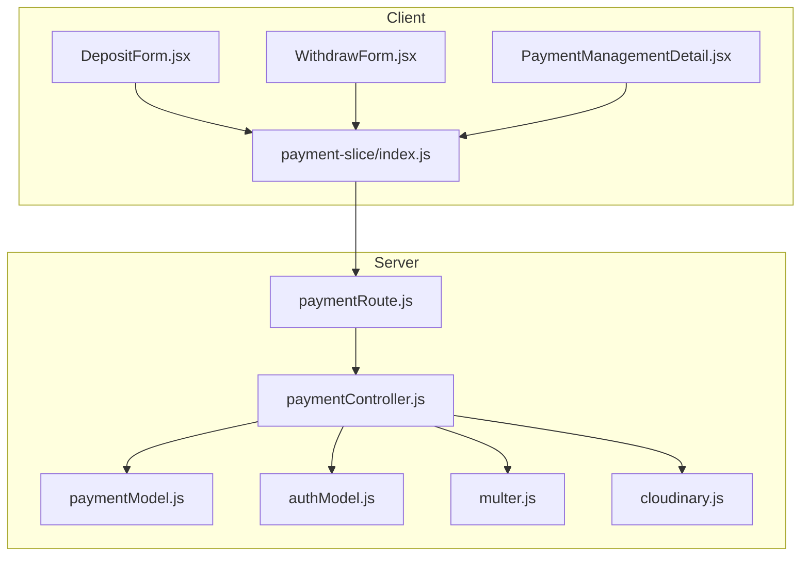
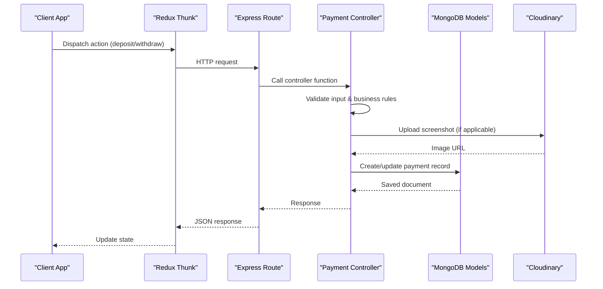
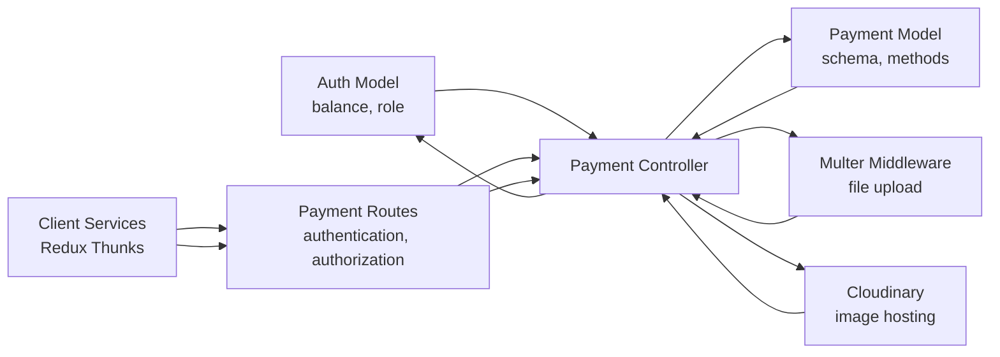

# Payment Endpoints

<cite>
**Referenced Files in This Document**
- [paymentController.js](file://server/controllers/payment/paymentController.js)
- [paymentRoute.js](file://server/routes/payment/paymentRoute.js)
- [paymentModel.js](file://server/models/paymentModel.js)
- [authModel.js](file://server/models/authModel.js)
- [cloudinary.js](file://server/config/cloudinary.js)
- [multer.js](file://server/middleware/multer.js)
- [DepositForm.jsx](file://client/src/components/User/walletComponent/DepositForm.jsx)
- [WithdrawForm.jsx](file://client/src/components/User/walletComponent/WithdrawForm.jsx)
- [payment-slice/index.js](file://client/src/store/user/payment-slice/index.js)
- [PaymentManagementDetail.jsx](file://client/src/components/Admin/PaymentManagementDetail.jsx)
</cite>

## Table of Contents
1. [Introduction](#introduction)
2. [Project Structure](#project-structure)
3. [Core Components](#core-components)
4. [Architecture Overview](#architecture-overview)
5. [Detailed Component Analysis](#detailed-component-analysis)
6. [Dependency Analysis](#dependency-analysis)
7. [Performance Considerations](#performance-considerations)
8. [Troubleshooting Guide](#troubleshooting-guide)
9. [Conclusion](#conclusion)

## Introduction
This document provides comprehensive API documentation for payment endpoints in a betting platform. It covers:
- Deposit endpoint with bank transfer details, screenshot upload, and verification workflow
- Withdrawal endpoint with amount validation, account verification, and processing status tracking
- Transaction history endpoint with filtering by date, type, and status
- Payment verification endpoints for admin approval processes
- Wallet balance inquiry and transaction status endpoints
- Payment method configuration and bank detail management endpoints
- Request/response schemas, file upload handling, validation rules, and error codes
- Security considerations for sensitive financial data and compliance requirements

## Project Structure
The payment system is implemented with a clear separation of concerns:
- Frontend (React + Redux Toolkit): Handles UI, form validation, file uploads, and API interactions
- Backend (Node.js + Express + MongoDB): Implements controllers, routes, models, and middleware
- Storage: Local disk for temporary uploads and Cloudinary for production image hosting
- Authentication: JWT-based protected routes with role-based access control

**Diagram sources**
- [paymentRoute.js](file://server/routes/payment/paymentRoute.js#L1-L82)
- [paymentController.js](file://server/controllers/payment/paymentController.js#L1-L868)
- [paymentModel.js](file://server/models/paymentModel.js#L1-L160)
- [authModel.js](file://server/models/authModel.js#L1-L40)
- [multer.js](file://server/middleware/multer.js#L1-L88)
- [cloudinary.js](file://server/config/cloudinary.js#L1-L10)
- [DepositForm.jsx](file://client/src/components/User/walletComponent/DepositForm.jsx#L1-L329)
- [WithdrawForm.jsx](file://client/src/components/User/walletComponent/WithdrawForm.jsx#L1-L118)
- [payment-slice/index.js](file://client/src/store/user/payment-slice/index.js#L1-L344)
- [PaymentManagementDetail.jsx](file://client/src/components/Admin/PaymentManagementDetail.jsx#L1-L713)

**Section sources**
- [paymentRoute.js](file://server/routes/payment/paymentRoute.js#L1-L82)
- [paymentController.js](file://server/controllers/payment/paymentController.js#L1-L868)
- [paymentModel.js](file://server/models/paymentModel.js#L1-L160)
- [authModel.js](file://server/models/authModel.js#L1-L40)
- [multer.js](file://server/middleware/multer.js#L1-L88)
- [cloudinary.js](file://server/config/cloudinary.js#L1-L10)
- [DepositForm.jsx](file://client/src/components/User/walletComponent/DepositForm.jsx#L1-L329)
- [WithdrawForm.jsx](file://client/src/components/User/walletComponent/WithdrawForm.jsx#L1-L118)
- [payment-slice/index.js](file://client/src/store/user/payment-slice/index.js#L1-L344)
- [PaymentManagementDetail.jsx](file://client/src/components/Admin/PaymentManagementDetail.jsx#L1-L713)

## Core Components
- Payment Controller: Implements all payment operations including deposits, withdrawals, transaction history, admin approvals, and cancellations
- Payment Model: Defines the payment schema with dynamic field requirements based on transaction type
- Authentication Model: Manages user balances and roles
- Multer Middleware: Handles file uploads with size limits and type restrictions
- Cloudinary Config: Provides secure image hosting for screenshots
- Client Services: Redux Thunks for API calls and progress tracking
- UI Forms: Deposit and Withdraw forms with validation and UX feedback

Key responsibilities:
- Validate input parameters and enforce business rules
- Manage transaction lifecycle (pending → approved/rejected/cancelled)
- Securely handle file uploads and transformations
- Provide paginated and filtered transaction history
- Support admin workflows for approvals and rejections

**Section sources**
- [paymentController.js](file://server/controllers/payment/paymentController.js#L1-L868)
- [paymentModel.js](file://server/models/paymentModel.js#L1-L160)
- [authModel.js](file://server/models/authModel.js#L1-L40)
- [multer.js](file://server/middleware/multer.js#L1-L88)
- [cloudinary.js](file://server/config/cloudinary.js#L1-L10)
- [payment-slice/index.js](file://client/src/store/user/payment-slice/index.js#L1-L344)

## Architecture Overview
The payment architecture follows a layered approach:
- Presentation Layer: React components and Redux slices
- Application Layer: Express routes and controllers
- Domain Layer: Business logic for payments and user balances
- Persistence Layer: MongoDB models and Cloudinary storage
- Security Layer: JWT authentication and role-based authorization

**Diagram sources**
- [payment-slice/index.js](file://client/src/store/user/payment-slice/index.js#L105-L148)
- [paymentRoute.js](file://server/routes/payment/paymentRoute.js#L27-L61)
- [paymentController.js](file://server/controllers/payment/paymentController.js#L341-L464)
- [cloudinary.js](file://server/config/cloudinary.js#L1-L10)

## Detailed Component Analysis

### Deposit Endpoint
Purpose: Submit a deposit request with bank transfer details and payment screenshot.

Endpoints:
- POST /api/payment/deposit (authenticated)
- POST /api/payment/upload-screenshot (authenticated, multipart/form-data)

Workflow:
1. User fills deposit form with beneficiary name, bank name, amount, transaction ID, deposit date/time, and screenshot
2. Screenshot is uploaded to Cloudinary with automatic HEIC conversion and compression
3. Deposit request is created with status "pending"
4. Admin approval updates user balance upon confirmation

Request Schema (POST /api/payment/deposit):
- Fields:
  - amount: number (minimum 100)
  - beneficiaryName: string (required for deposit)
  - bankName: string (required)
  - transactionId: string (required for deposit)
  - screenshot: object (required for deposit) with keys: url, public_id, format, size, width, height
  - note: string (optional, max 500 chars)
  - depositDate: string (YYYY-MM-DD)
  - depositTime: string (HH:mm:ss)

Response Schema:
- success: boolean
- message: string
- data: Payment document (with populated userId)

Validation Rules:
- Minimum deposit amount: $100
- Required fields: amount, beneficiaryName, bankName, transactionId, screenshot, depositDate, depositTime
- Amount precision: rounded to 2 decimals

Error Codes:
- 400: Validation errors (missing fields, invalid amount)
- 401: Unauthorized (missing/invalid token)
- 500: Internal server error

**Section sources**
- [paymentController.js](file://server/controllers/payment/paymentController.js#L341-L396)
- [paymentModel.js](file://server/models/paymentModel.js#L17-L42)
- [paymentRoute.js](file://server/routes/payment/paymentRoute.js#L27-L50)
- [cloudinary.js](file://server/config/cloudinary.js#L1-L10)
- [multer.js](file://server/middleware/multer.js#L31-L49)
- [DepositForm.jsx](file://client/src/components/User/walletComponent/DepositForm.jsx#L198-L234)
- [payment-slice/index.js](file://client/src/store/user/payment-slice/index.js#L105-L127)

### Withdrawal Endpoint
Purpose: Submit a withdrawal request to a bank account with validation against user balance.

Endpoints:
- POST /api/payment/withdraw (authenticated)

Request Schema (POST /api/payment/withdraw):
- Fields:
  - amount: number (minimum 500)
  - accountHolderName: string (required for withdrawal)
  - accountNumber: string (required for withdrawal)
  - bankName: string (required)
  - note: string (optional, max 500 chars)

Response Schema:
- success: boolean
- message: string
- data: Payment document (with populated userId)

Validation Rules:
- Minimum withdrawal amount: $500
- Required fields: amount, accountHolderName, accountNumber, bankName
- Insufficient balance check against user.balance
- Amount precision: rounded to 2 decimals

Processing Workflow:
1. Validate amount and account details
2. Check user balance
3. Deduct amount from user.balance immediately (pending state)
4. Create withdrawal request with status "pending"
5. Admin approval adds amount back to user.balance
6. Admin rejection refunds the deducted amount

Error Codes:
- 400: Validation errors or insufficient balance
- 404: User not found
- 401: Unauthorized
- 500: Internal server error

**Section sources**
- [paymentController.js](file://server/controllers/payment/paymentController.js#L398-L464)
- [paymentModel.js](file://server/models/paymentModel.js#L44-L57)
- [authModel.js](file://server/models/authModel.js#L22)
- [paymentRoute.js](file://server/routes/payment/paymentRoute.js#L52-L53)
- [WithdrawForm.jsx](file://client/src/components/User/walletComponent/WithdrawForm.jsx#L22-L101)
- [payment-slice/index.js](file://client/src/store/user/payment-slice/index.js#L128-L148)

### Transaction History Endpoint
Purpose: Retrieve paginated transaction history with filtering capabilities.

Endpoints:
- GET /api/payment/my-transactions (authenticated)

Query Parameters:
- type: string (deposit | withdrawal)
- status: string (pending | approved | rejected | completed | failed | cancelled)
- limit: number (default 10)
- page: number (default 1)

Response Schema:
- success: boolean
- data: array of Payment documents (with populated userId)
- pagination: object with total, page, pages

Filtering Logic:
- Filter by userId (current user)
- Optional filters: type, paymentStatus
- Sort by createdAt descending

Error Codes:
- 401: Unauthorized
- 500: Internal server error

**Section sources**
- [paymentController.js](file://server/controllers/payment/paymentController.js#L466-L503)
- [paymentRoute.js](file://server/routes/payment/paymentRoute.js#L55-L59)

### Payment Verification Endpoints (Admin)
Purpose: Admin approval and rejection workflows with audit trail.

Endpoints:
- GET /api/payment/admin/all (admin/superadmin)
- GET /api/payment/admin/pending (admin/superadmin)
- GET /api/payment/admin/stats (admin/superadmin)
- PUT /api/payment/admin/approve/:id (admin/superadmin)
- PUT /api/payment/admin/reject/:id (admin/superadmin)
- GET /api/payment/admin/:id (admin/superadmin)

Approval Workflow:
1. Admin retrieves pending payments
2. Admin approves payment (status becomes "approved")
3. System updates user.balance (+ for deposits, no change for withdrawals)
4. Transaction remains in "approved" until processed

Rejection Workflow:
1. Admin rejects payment with reason
2. System sets status to "rejected" and stores rejectionReason
3. For withdrawals, refunded amount is credited back to user.balance

Statistics:
- Aggregated counts and totals by status and type
- Overall transaction metrics

Error Codes:
- 400: Payment already processed or invalid state
- 401: Unauthorized
- 404: Payment not found
- 500: Internal server error

**Section sources**
- [paymentController.js](file://server/controllers/payment/paymentController.js#L537-L744)
- [paymentModel.js](file://server/models/paymentModel.js#L74-L92)
- [paymentRoute.js](file://server/routes/payment/paymentRoute.js#L63-L81)
- [PaymentManagementDetail.jsx](file://client/src/components/Admin/PaymentManagementDetail.jsx#L189-L240)

### Wallet Balance and Transaction Status
Purpose: Query user wallet balance and individual transaction details.

Endpoints:
- GET /api/user/balance (authenticated)
- GET /api/payment/:id (authenticated)

Wallet Balance:
- Returns user.balance from Auth model
- Protected by JWT and cache-control headers

Transaction Status:
- Retrieves a specific transaction by ID with populated userId and processedBy
- Validates ownership (userId matches current user)

Error Codes:
- 401: Unauthorized
- 404: Not found
- 500: Internal server error

**Section sources**
- [payment-slice/index.js](file://client/src/store/user/payment-slice/index.js#L12-L32)
- [payment-slice/index.js](file://client/src/store/user/payment-slice/index.js#L215-L234)
- [paymentController.js](file://server/controllers/payment/paymentController.js#L505-L533)
- [authModel.js](file://server/models/authModel.js#L22)

### File Upload Handling
Purpose: Secure and efficient handling of payment screenshots with support for HEIC and large files.

Endpoints:
- POST /api/payment/upload-screenshot (authenticated)
- POST /api/payment/upload-chunk (authenticated)
- POST /api/payment/finalize-upload (authenticated)

Upload Pipeline:
1. Multer validates file type and size (max 50MB)
2. HEIC/HEIF files are automatically converted to JPEG
3. Large images are compressed to reduce bandwidth and storage
4. Upload to Cloudinary with transformations and timeouts
5. Cleanup temporary files

Chunked Upload (Optional):
- Supports large files via chunked upload for unreliable connections
- Combines chunks server-side before uploading to Cloudinary

Security Measures:
- File type whitelist (images and HEIC)
- Size limits and timeouts
- Temporary file cleanup
- Cloudinary secure URLs

Error Codes:
- 400: Invalid file or upload error
- 413: File too large
- 504: Upload timeout
- 500: Internal server error

**Section sources**
- [paymentController.js](file://server/controllers/payment/paymentController.js#L11-L200)
- [paymentController.js](file://server/controllers/payment/paymentController.js#L205-L340)
- [multer.js](file://server/middleware/multer.js#L31-L58)
- [cloudinary.js](file://server/config/cloudinary.js#L1-L10)

### Payment Method Configuration and Bank Detail Management
Current Implementation:
- Static bank information in frontend DepositForm (beneficiary, bank, CLABE)
- Dynamic bank details captured during withdrawal
- No dedicated API endpoints for managing payment methods or bank details

Recommended Enhancements:
- GET/POST/PUT/PATCH endpoints for payment methods
- Bank detail validation and verification workflows
- Multi-method support (bank transfers, e-wallets, cards)
- PCI-compliant handling for sensitive banking data

**Section sources**
- [DepositForm.jsx](file://client/src/components/User/walletComponent/DepositForm.jsx#L17-L22)
- [paymentModel.js](file://server/models/paymentModel.js#L68-L71)

## Dependency Analysis
Payment endpoints depend on several core systems:

**Diagram sources**
- [paymentController.js](file://server/controllers/payment/paymentController.js#L1-L868)
- [paymentModel.js](file://server/models/paymentModel.js#L1-L160)
- [authModel.js](file://server/models/authModel.js#L1-L40)
- [multer.js](file://server/middleware/multer.js#L1-L88)
- [cloudinary.js](file://server/config/cloudinary.js#L1-L10)
- [paymentRoute.js](file://server/routes/payment/paymentRoute.js#L1-L82)
- [payment-slice/index.js](file://client/src/store/user/payment-slice/index.js#L1-L344)

Key Dependencies:
- Authentication: JWT tokens and role-based authorization
- Database: MongoDB with indexes for performance
- Storage: Local disk for temp files, Cloudinary for production images
- Frontend: Redux Thunks for async operations and progress tracking

Potential Issues:
- Circular dependencies: None detected
- Tight coupling: Controllers depend on models and middleware
- External dependencies: Cloudinary and MongoDB

**Section sources**
- [paymentController.js](file://server/controllers/payment/paymentController.js#L1-L868)
- [paymentRoute.js](file://server/routes/payment/paymentRoute.js#L1-L82)
- [paymentModel.js](file://server/models/paymentModel.js#L117-L119)

## Performance Considerations
- File Upload Optimization:
  - HEIC conversion and compression reduce payload sizes
  - Chunked upload supports large files
  - Cloudinary transformations optimize delivery
- Database Queries:
  - Indexes on userId, paymentStatus, and type/status combinations
  - Pagination with limit/skip for transaction history
- Caching:
  - Cache-control headers prevent stale balances
  - CDN caching for static assets
- Concurrency:
  - MongoDB transactions for atomic admin operations
  - Session-based transactions for approval/rejection workflows

## Troubleshooting Guide
Common Issues and Resolutions:

Upload Problems:
- Symptom: 413 File too large
  - Cause: Exceeds 50MB limit
  - Resolution: Compress image or use smaller format
- Symptom: HEIC conversion failure
  - Cause: Corrupted HEIC file
  - Resolution: Convert to JPG manually
- Symptom: Upload timeout
  - Cause: Slow network or large file
  - Resolution: Retry with chunked upload

Validation Errors:
- Symptom: 400 Bad Request on deposit
  - Cause: Missing required fields or amount < $100
  - Resolution: Fill all fields and ensure amount meets minimum
- Symptom: 400 Bad Request on withdrawal
  - Cause: Amount < $500 or insufficient balance
  - Resolution: Increase amount or check available balance

Admin Approval Issues:
- Symptom: 400 Payment already processed
  - Cause: Attempting to approve/reject non-pending payment
  - Resolution: Refresh pending list
- Symptom: 500 Internal server error
  - Cause: Database transaction failure
  - Resolution: Retry operation

Frontend Integration:
- Symptom: Upload progress not updating
  - Cause: Missing onUploadProgress callback
  - Resolution: Ensure progress handler is attached
- Symptom: Balance not refreshing
  - Cause: Cache-control headers blocking updates
  - Resolution: Use no-store headers in requests

**Section sources**
- [paymentController.js](file://server/controllers/payment/paymentController.js#L183-L199)
- [paymentController.js](file://server/controllers/payment/paymentController.js#L348-L361)
- [paymentController.js](file://server/controllers/payment/paymentController.js#L403-L409)
- [payment-slice/index.js](file://client/src/store/user/payment-slice/index.js#L75-L101)

## Conclusion
The payment system provides a robust foundation for financial operations with strong validation, secure file handling, and comprehensive admin workflows. Key strengths include:
- Clear separation of user and admin responsibilities
- Comprehensive transaction lifecycle management
- Efficient file upload pipeline with HEIC support
- Strong database indexing for performance
- Progressive enhancement with chunked uploads

Areas for future improvement include:
- Dedicated payment method configuration endpoints
- Enhanced bank detail verification workflows
- Multi-currency support
- Advanced compliance reporting
- Audit trail enhancements

The current implementation satisfies core requirements while maintaining extensibility for future enhancements.