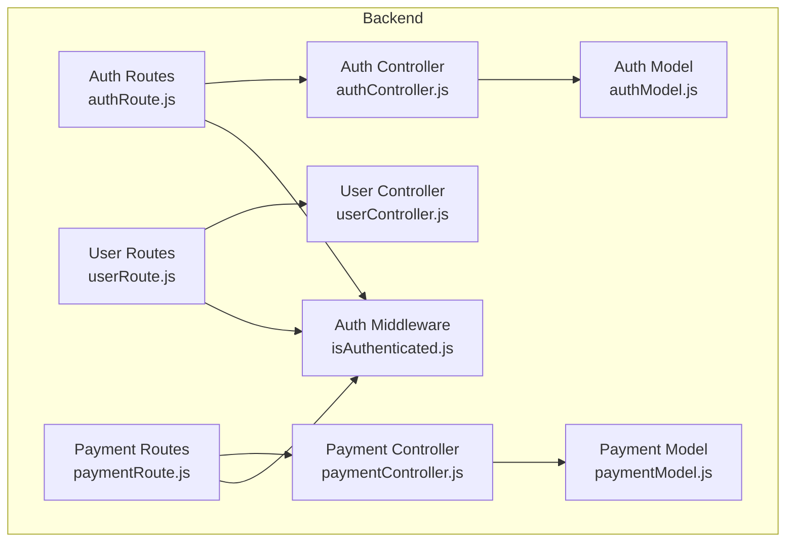
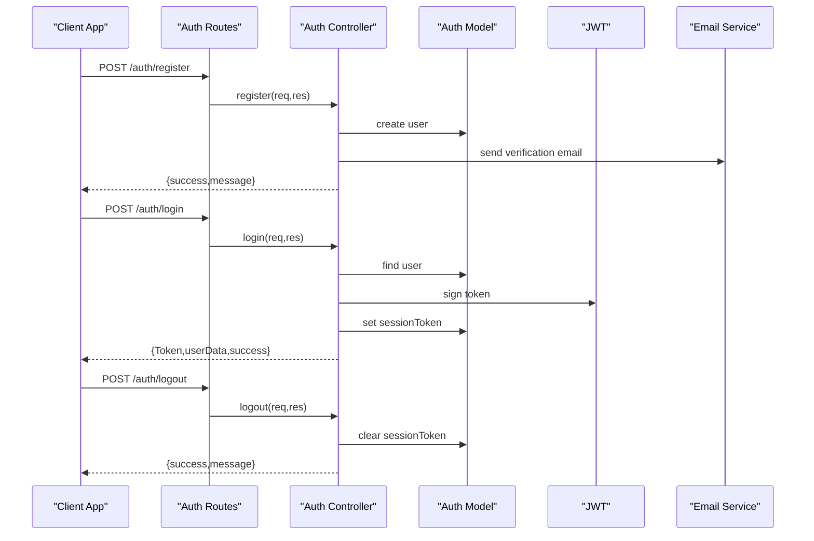
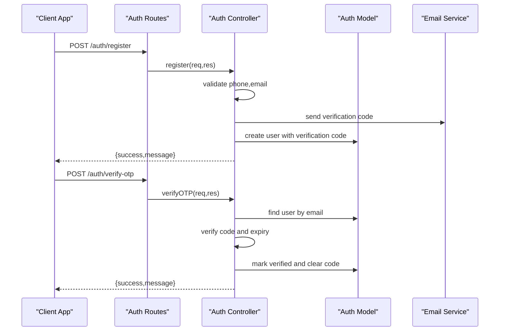
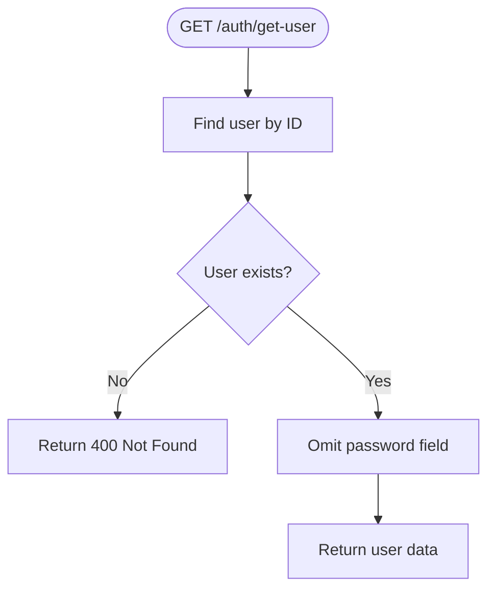
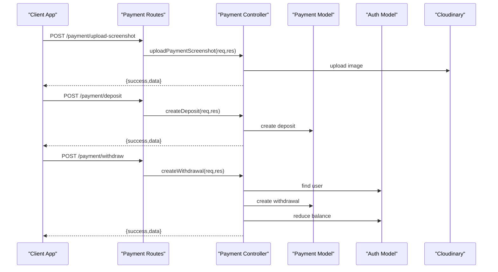
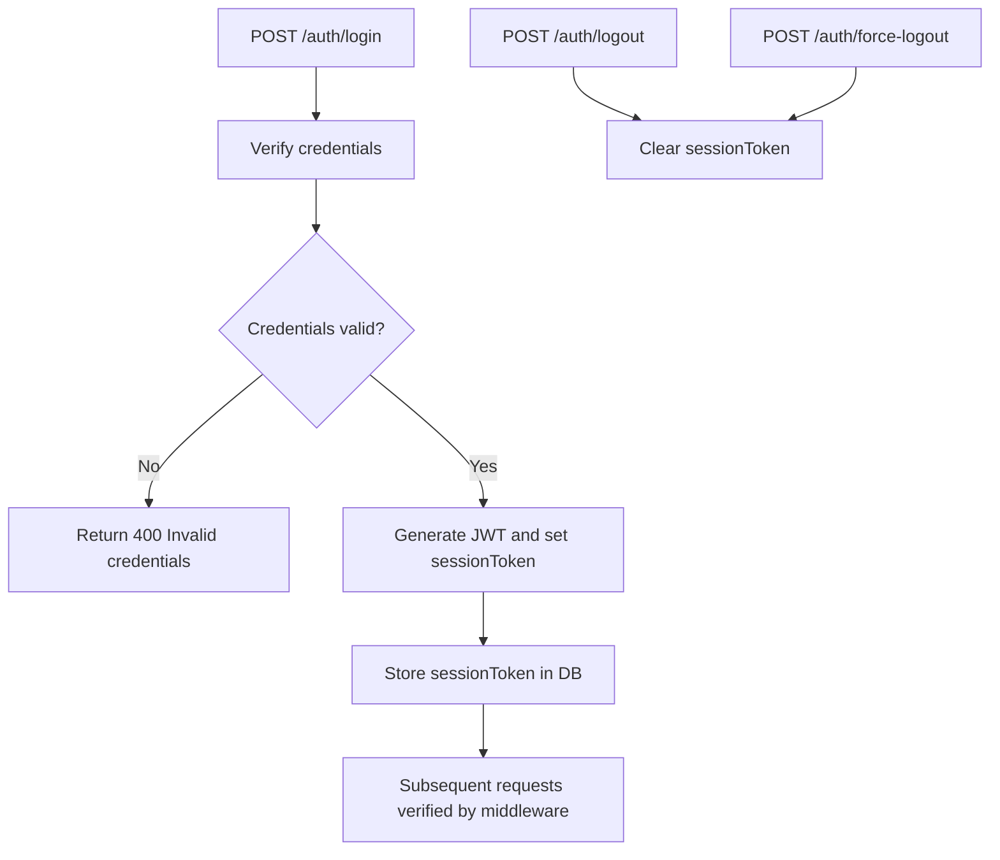
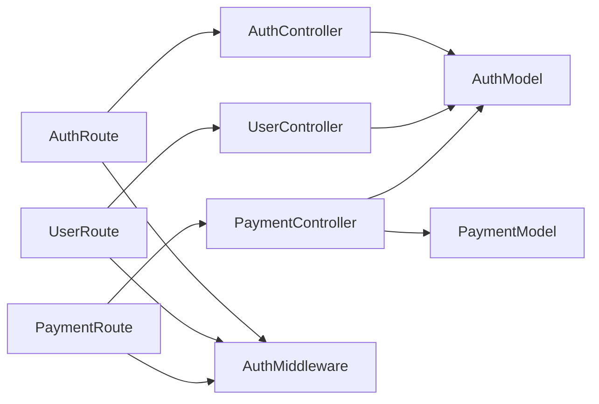

# User Management Endpoints

<cite>
**Referenced Files in This Document**
- [userRoute.js](file://server/routes/users/userRoute.js)
- [userController.js](file://server/controllers/users/userController.js)
- [authRoute.js](file://server/routes/auth/authRoute.js)
- [authController.js](file://server/controllers/auth/authController.js)
- [paymentRoute.js](file://server/routes/payment/paymentRoute.js)
- [paymentController.js](file://server/controllers/payment/paymentController.js)
- [paymentModel.js](file://server/models/paymentModel.js)
- [authModel.js](file://server/models/authModel.js)
- [isAuthenticated.js](file://server/middleware/isAuthenticated.js)
- [emailValidator.js](file://server/config/emailValidator.js)
- [i18next.js](file://client/src/utils/i18next.js)
- [Login.jsx](file://client/src/Pages/authPage/Login.jsx)
- [Register.jsx](file://client/src/Pages/authPage/Register.jsx)
- [LogoutAllDevices.jsx](file://client/src/Pages/LogoutAllDevices.jsx)
- [ForgotPassword.jsx](file://client/src/Pages/ForgotPassword.jsx)
- [AccountLayout.jsx](file://client/src/components/User/AccountLayout.jsx)
- [DashboardProfile.jsx](file://client/src/components/User/DashboardProfile.jsx)
</cite>

## Table of Contents
1. [Introduction](#introduction)
2. [Project Structure](#project-structure)
3. [Core Components](#core-components)
4. [Architecture Overview](#architecture-overview)
5. [Detailed Component Analysis](#detailed-component-analysis)
6. [Dependency Analysis](#dependency-analysis)
7. [Performance Considerations](#performance-considerations)
8. [Troubleshooting Guide](#troubleshooting-guide)
9. [Conclusion](#conclusion)
10. [Appendices](#appendices)

## Introduction
This document provides comprehensive API documentation for user management endpoints in the betting platform. It covers:
- Profile update endpoints for personal information, contact details, and preferences
- Account settings endpoints including notification preferences, security settings, and privacy controls
- Wallet management endpoints for balance inquiries, transaction history, and account activity
- User preference endpoints for language selection, theme customization, and betting preferences
- Account verification endpoints for KYC processes and identity confirmation
- User activity endpoints for login history and session management

It also documents request/response schemas, validation rules, and data protection measures, with a focus on GDPR compliance and data privacy considerations.

## Project Structure
The backend is organized by feature-based routing and controllers:
- Authentication routes and controllers handle user registration, login, logout, OTP verification, and password reset
- User routes and controllers handle balance retrieval and updates
- Payment routes and controllers handle deposits, withdrawals, transaction history, and admin approvals
- Middleware enforces authentication and authorization
- Models define user and payment data structures
- Frontend integrates with these APIs via React components and Redux slices

**Diagram sources**
- [authRoute.js](file://server/routes/auth/authRoute.js#L1-L34)
- [userRoute.js](file://server/routes/users/userRoute.js#L1-L11)
- [paymentRoute.js](file://server/routes/payment/paymentRoute.js#L1-L82)
- [authController.js](file://server/controllers/auth/authController.js#L1-L457)
- [userController.js](file://server/controllers/users/userController.js#L1-L49)
- [paymentController.js](file://server/controllers/payment/paymentController.js#L1-L868)
- [authModel.js](file://server/models/authModel.js#L1-L40)
- [paymentModel.js](file://server/models/paymentModel.js#L1-L160)
- [isAuthenticated.js](file://server/middleware/isAuthenticated.js#L1-L62)

**Section sources**
- [authRoute.js](file://server/routes/auth/authRoute.js#L1-L34)
- [userRoute.js](file://server/routes/users/userRoute.js#L1-L11)
- [paymentRoute.js](file://server/routes/payment/paymentRoute.js#L1-L82)
- [authController.js](file://server/controllers/auth/authController.js#L1-L457)
- [userController.js](file://server/controllers/users/userController.js#L1-L49)
- [paymentController.js](file://server/controllers/payment/paymentController.js#L1-L868)
- [authModel.js](file://server/models/authModel.js#L1-L40)
- [paymentModel.js](file://server/models/paymentModel.js#L1-L160)
- [isAuthenticated.js](file://server/middleware/isAuthenticated.js#L1-L62)

## Core Components
- Authentication endpoints: Registration, login, logout, OTP verification, resend OTP, forgot/reset password, force logout, and superadmin force logout
- User endpoints: Balance retrieval and balance confirmation/update
- Payment endpoints: Deposit creation, withdrawal creation, transaction history, single transaction lookup, admin actions (approve/reject/cancel), and statistics
- Middleware: JWT-based authentication and role-based authorization
- Models: User (Auth) and Payment schemas with indexes and virtuals
- Frontend integration: React components for login, registration, logout, and profile display

**Section sources**
- [authRoute.js](file://server/routes/auth/authRoute.js#L1-L34)
- [authController.js](file://server/controllers/auth/authController.js#L1-L457)
- [userRoute.js](file://server/routes/users/userRoute.js#L1-L11)
- [userController.js](file://server/controllers/users/userController.js#L1-L49)
- [paymentRoute.js](file://server/routes/payment/paymentRoute.js#L1-L82)
- [paymentController.js](file://server/controllers/payment/paymentController.js#L1-L868)
- [authModel.js](file://server/models/authModel.js#L1-L40)
- [paymentModel.js](file://server/models/paymentModel.js#L1-L160)
- [isAuthenticated.js](file://server/middleware/isAuthenticated.js#L1-L62)

## Architecture Overview
The system uses Express routers delegating to controllers, which interact with Mongoose models. Authentication middleware validates JWTs and checks session tokens. Payment operations use MongoDB transactions for atomicity.

**Diagram sources**
- [authRoute.js](file://server/routes/auth/authRoute.js#L1-L34)
- [authController.js](file://server/controllers/auth/authController.js#L1-L457)
- [authModel.js](file://server/models/authModel.js#L1-L40)

## Detailed Component Analysis

### Authentication Endpoints
- POST /auth/register
  - Purpose: Register a new user with name, email, phone, password, and confirm password
  - Validation: All fields required; passwords must match; phone format validated; email validated via ZeroBounce and DNS; registration attempts limited
  - Response: Success message and verification email status
  - Security: Password hashed; unique constraints on email/phone; verification code with expiry
  - GDPR: Minimal data collection; disposable email blocked; deletion expiry field present

- POST /auth/resend-otp
  - Purpose: Resend verification code to user’s email
  - Validation: Email required; user must exist
  - Response: Success message

- POST /auth/verify-otp
  - Purpose: Verify user account using OTP
  - Validation: Email and OTP required; OTP must match and not expired
  - Response: Success message; user marked verified

- POST /auth/login
  - Purpose: Authenticate user and issue JWT
  - Validation: Email and password required; user must exist and credentials must match
  - Response: JWT token, user data (without password), verified flag
  - Session: Stores session token in database; middleware checks session token validity

- POST /auth/logout
  - Purpose: Logout current user
  - Action: Clears session token from database
  - Response: Success message

- POST /auth/force-logout-send-otp
  - Purpose: Send OTP for force logout
  - Validation: Email required; user must exist
  - Response: Success message

- POST /auth/force-logout
  - Purpose: Force logout using OTP
  - Validation: Email and OTP required; OTP must match and not expired
  - Action: Clears session token from database
  - Response: Success message

- POST /auth/forgot-password
  - Purpose: Send OTP for password reset
  - Validation: Email required; user must exist
  - Response: Success message

- POST /auth/reset-password
  - Purpose: Reset password using OTP
  - Validation: Email, new password, confirm password, OTP required; passwords must match; OTP must be valid
  - Action: Hashes new password and clears verification code/token
  - Response: Success message

- Superadmin endpoints (requires superadmin role):
  - POST /auth/superadmin-force-logout-all
  - POST /auth/superadmin-force-logout-user

**Diagram sources**
- [authRoute.js](file://server/routes/auth/authRoute.js#L1-L34)
- [authController.js](file://server/controllers/auth/authController.js#L50-L193)
- [authModel.js](file://server/models/authModel.js#L1-L40)
- [emailValidator.js](file://server/config/emailValidator.js#L1-L127)

**Section sources**
- [authRoute.js](file://server/routes/auth/authRoute.js#L1-L34)
- [authController.js](file://server/controllers/auth/authController.js#L50-L457)
- [authModel.js](file://server/models/authModel.js#L1-L40)
- [emailValidator.js](file://server/config/emailValidator.js#L1-L127)

### User Profile and Preferences
- GET /auth/get-user
  - Purpose: Retrieve current user details (excluding password)
  - Response: User data without sensitive fields
  - Notes: Used by frontend to populate profile UI

- Language and Theme Preferences (frontend)
  - Language selection persisted in localStorage and synchronized with i18n library
  - Theme customization handled by frontend UI components
  - No dedicated backend endpoints for theme; preferences stored client-side

- Contact and Personal Information
  - Frontend displays user email and phone in dashboard profile
  - No dedicated backend endpoint for updating personal info in the analyzed code

**Diagram sources**
- [authRoute.js](file://server/routes/auth/authRoute.js#L24-L24)
- [authController.js](file://server/controllers/auth/authController.js#L339-L354)

**Section sources**
- [authRoute.js](file://server/routes/auth/authRoute.js#L24-L24)
- [authController.js](file://server/controllers/auth/authController.js#L339-L354)
- [DashboardProfile.jsx](file://client/src/components/User/DashboardProfile.jsx#L169-L196)
- [i18next.js](file://client/src/utils/i18next.js#L679-L690)

### Wallet Management Endpoints
- GET /users/balance
  - Purpose: Retrieve user’s current balance
  - Authentication: Requires JWT
  - Response: Balance value

- POST /users/balance/confirm-deposit
  - Purpose: Confirm deposit and update balance
  - Authentication: Requires JWT
  - Notes: Controller loads user and saves; actual deposit approval handled by admin flow in payment module

- POST /payment/upload-screenshot
  - Purpose: Upload payment screenshot (supports HEIC conversion and compression)
  - Authentication: Requires JWT
  - Validation: File required; handles errors and cleanup
  - Response: Uploaded image metadata

- POST /payment/deposit
  - Purpose: Submit deposit request with beneficiary, bank, amount, transactionId, screenshot, note, date/time
  - Validation: Amount minimum threshold; all required fields; rounds amount to two decimals
  - Response: Created deposit request with populated user details

- POST /payment/withdraw
  - Purpose: Submit withdrawal request with account holder, account number, bank, amount, note
  - Validation: Amount minimum threshold; sufficient balance; all required fields; rounds amount to two decimals
  - Response: Created withdrawal request; balance reduced

- GET /payment/my-transactions
  - Purpose: Fetch user’s transaction history with filters (type, status), pagination
  - Response: Transactions array with pagination metadata

- GET /payment/:id
  - Purpose: Fetch single transaction by ID
  - Response: Transaction details with populated user/admin

- PUT /payment/cancel/:id
  - Purpose: Cancel a payment (admin-only in analyzed code)
  - Notes: Admin-only route present; user cancellation logic not shown in analyzed code

- Admin endpoints (require admin/superadmin role):
  - GET /payment/admin/all
  - GET /payment/admin/pending
  - GET /payment/admin/stats
  - PUT /payment/admin/approve/:id
  - PUT /payment/admin/reject/:id
  - GET /payment/admin/:id

**Diagram sources**
- [paymentRoute.js](file://server/routes/payment/paymentRoute.js#L1-L82)
- [paymentController.js](file://server/controllers/payment/paymentController.js#L11-L800)
- [paymentModel.js](file://server/models/paymentModel.js#L1-L160)
- [authModel.js](file://server/models/authModel.js#L1-L40)

**Section sources**
- [userRoute.js](file://server/routes/users/userRoute.js#L1-L11)
- [userController.js](file://server/controllers/users/userController.js#L1-L49)
- [paymentRoute.js](file://server/routes/payment/paymentRoute.js#L1-L82)
- [paymentController.js](file://server/controllers/payment/paymentController.js#L341-L503)
- [paymentModel.js](file://server/models/paymentModel.js#L1-L160)
- [authModel.js](file://server/models/authModel.js#L1-L40)

### Account Settings and Privacy Controls
- Session management:
  - JWT issued on login; stored as session token in user document
  - Middleware verifies token and checks session token equality to prevent reuse
  - Force logout endpoints clear session tokens
  - Superadmin can force logout all users or specific users

- Privacy and verification:
  - Email validation via ZeroBounce and DNS MX records
  - Disposable email domains blocked
  - Verification code with expiry; OTP verification required
  - Registration attempts tracked and limited

- Data retention:
  - User model includes deletion expiry field
  - No explicit GDPR data deletion endpoints in analyzed code

**Diagram sources**
- [authController.js](file://server/controllers/auth/authController.js#L195-L267)
- [isAuthenticated.js](file://server/middleware/isAuthenticated.js#L1-L62)
- [authModel.js](file://server/models/authModel.js#L1-L40)

**Section sources**
- [authController.js](file://server/controllers/auth/authController.js#L195-L337)
- [isAuthenticated.js](file://server/middleware/isAuthenticated.js#L1-L62)
- [authModel.js](file://server/models/authModel.js#L1-L40)
- [emailValidator.js](file://server/config/emailValidator.js#L1-L127)

### User Activity and Session Management
- Frontend pages demonstrate:
  - Login with OTP verification
  - Registration with OTP flow
  - Logout from all devices with OTP confirmation
  - Forgot password with OTP verification
- These flows integrate with backend authentication endpoints documented above

**Section sources**
- [Login.jsx](file://client/src/Pages/authPage/Login.jsx#L37-L131)
- [Register.jsx](file://client/src/Pages/authPage/Register.jsx#L74-L171)
- [LogoutAllDevices.jsx](file://client/src/Pages/LogoutAllDevices.jsx#L132-L230)
- [ForgotPassword.jsx](file://client/src/Pages/ForgotPassword.jsx#L225-L265)

## Dependency Analysis
- Controllers depend on models for data access
- Routes depend on controllers for business logic
- Middleware depends on models for user/session validation
- Payment controller uses Cloudinary for image uploads and MongoDB transactions for approvals
- Frontend components depend on Redux and i18n for user preferences and translations

**Diagram sources**
- [authRoute.js](file://server/routes/auth/authRoute.js#L1-L34)
- [userRoute.js](file://server/routes/users/userRoute.js#L1-L11)
- [paymentRoute.js](file://server/routes/payment/paymentRoute.js#L1-L82)
- [authController.js](file://server/controllers/auth/authController.js#L1-L457)
- [userController.js](file://server/controllers/users/userController.js#L1-L49)
- [paymentController.js](file://server/controllers/payment/paymentController.js#L1-L868)
- [authModel.js](file://server/models/authModel.js#L1-L40)
- [paymentModel.js](file://server/models/paymentModel.js#L1-L160)
- [isAuthenticated.js](file://server/middleware/isAuthenticated.js#L1-L62)

**Section sources**
- [authRoute.js](file://server/routes/auth/authRoute.js#L1-L34)
- [userRoute.js](file://server/routes/users/userRoute.js#L1-L11)
- [paymentRoute.js](file://server/routes/payment/paymentRoute.js#L1-L82)
- [authController.js](file://server/controllers/auth/authController.js#L1-L457)
- [userController.js](file://server/controllers/users/userController.js#L1-L49)
- [paymentController.js](file://server/controllers/payment/paymentController.js#L1-L868)
- [authModel.js](file://server/models/authModel.js#L1-L40)
- [paymentModel.js](file://server/models/paymentModel.js#L1-L160)
- [isAuthenticated.js](file://server/middleware/isAuthenticated.js#L1-L62)

## Performance Considerations
- Payment screenshots: HEIC conversion, server-side compression for large files, and chunked upload support improve reliability and performance
- Database indexing: Auth and Payment models include strategic indexes for email/name/role and status/type queries
- Pagination: Transaction history endpoints support pagination to limit response sizes
- JWT middleware: Efficient token verification and session token checks minimize overhead

[No sources needed since this section provides general guidance]

## Troubleshooting Guide
Common issues and resolutions:
- Authentication failures:
  - Missing or invalid Authorization header
  - Expired JWT token
  - Session terminated (force logout)
  - User not found
- Email validation failures:
  - Invalid format or disposable domain
  - DNS MX record missing
  - ZeroBounce API failure (fallback behavior)
- Payment upload failures:
  - File too large or upload timeout
  - Missing file or invalid chunk
- OTP verification failures:
  - Invalid or expired OTP
  - User not found during OTP operations

**Section sources**
- [isAuthenticated.js](file://server/middleware/isAuthenticated.js#L1-L62)
- [emailValidator.js](file://server/config/emailValidator.js#L1-L127)
- [paymentController.js](file://server/controllers/payment/paymentController.js#L11-L200)
- [authController.js](file://server/controllers/auth/authController.js#L150-L193)

## Conclusion
The user management system provides robust authentication, verification, session control, and wallet operations. While profile update endpoints for personal information are not present in the analyzed code, the system supports language preferences and integrates with frontend components for user experience. Payment operations include comprehensive validation, image handling, and admin workflows. Security measures include JWT-based sessions, OTP verification, email validation, and force logout capabilities. GDPR-aligned practices include disposable email blocking and optional deletion expiry fields.

[No sources needed since this section summarizes without analyzing specific files]

## Appendices

### Request/Response Schemas

- POST /auth/register
  - Request: { name, email, phone, password, confirmPassword }
  - Response: { success, message }
  - Validation: All fields required; passwords must match; phone format; email validation; registration attempts limit

- POST /auth/verify-otp
  - Request: { email, otp }
  - Response: { success, message }

- POST /auth/login
  - Request: { email, password }
  - Response: { Token, userData, success, message, verified }

- POST /auth/logout
  - Request: none
  - Response: { success, message }

- POST /auth/force-logout-send-otp
  - Request: { email }
  - Response: { success, message }

- POST /auth/force-logout
  - Request: { email, otp }
  - Response: { success, message }

- POST /auth/forgot-password
  - Request: { email }
  - Response: { success, message }

- POST /auth/reset-password
  - Request: { email, newPassword, confirmPassword, otp }
  - Response: { success, message }

- GET /auth/get-user
  - Request: none
  - Response: { userData, success, message }

- GET /users/balance
  - Request: none
  - Response: { success, balance }

- POST /users/balance/confirm-deposit
  - Request: none
  - Response: { message, balance, success }

- POST /payment/upload-screenshot
  - Request: multipart/form-data with image
  - Response: { success, message, data }

- POST /payment/deposit
  - Request: { beneficiaryName, bankName, amount, transactionId, screenshot, note, depositDate, depositTime }
  - Response: { success, message, data }

- POST /payment/withdraw
  - Request: { amount, accountHolderName, accountNumber, bankName, note }
  - Response: { success, message, data }

- GET /payment/my-transactions
  - Request: query params { type, status, limit, page }
  - Response: { success, data, pagination }

- GET /payment/:id
  - Request: path param { id }
  - Response: { success, data }

- PUT /payment/cancel/:id
  - Request: path param { id }
  - Response: { success, message }

- Admin endpoints:
  - GET /payment/admin/all, /payment/admin/pending, /payment/admin/stats
  - PUT /payment/admin/approve/:id, /payment/admin/reject/:id
  - GET /payment/admin/:id

**Section sources**
- [authRoute.js](file://server/routes/auth/authRoute.js#L1-L34)
- [authController.js](file://server/controllers/auth/authController.js#L50-L457)
- [userRoute.js](file://server/routes/users/userRoute.js#L1-L11)
- [userController.js](file://server/controllers/users/userController.js#L1-L49)
- [paymentRoute.js](file://server/routes/payment/paymentRoute.js#L1-L82)
- [paymentController.js](file://server/controllers/payment/paymentController.js#L341-L503)
- [paymentModel.js](file://server/models/paymentModel.js#L1-L160)

### Data Protection and GDPR Considerations
- Data minimization: Only necessary fields collected during registration
- Consent and verification: Email verification via OTP; user must actively verify
- Data portability: No explicit export endpoints in analyzed code
- Right to erasure: Deletion expiry field present; no explicit deletion endpoint in analyzed code
- Security: Password hashing, JWT with session token, OTP-based operations, and email validation
- Privacy: Language preference stored client-side; no backend preference endpoints

**Section sources**
- [authModel.js](file://server/models/authModel.js#L1-L40)
- [emailValidator.js](file://server/config/emailValidator.js#L1-L127)
- [i18next.js](file://client/src/utils/i18next.js#L679-L690)