# Administrative Panel

<cite>
**Referenced Files in This Document**
- [UserManagement.jsx](file://client/src/Pages/adminPage/UserManagement.jsx)
- [ManageEvents.jsx](file://client/src/Pages/adminPage/ManageEvents.jsx)
- [PaymentManagement.jsx](file://client/src/Pages/adminPage/PaymentManagement.jsx)
- [PlatformEarning.jsx](file://client/src/Pages/adminPage/PlatformEarning.jsx)
- [adminController.js](file://server/controllers/admin/adminController.js)
- [matchController.js](file://server/controllers/admin/matchController.js)
- [adminRoute.js](file://server/routes/admin/adminRoute.js)
- [matchRoute.js](file://server/routes/admin/matchRoute.js)
- [isAuthenticated.js](file://server/middleware/isAuthenticated.js)
- [index.js](file://client/src/store/admin/index.js)
- [Layout.jsx](file://client/src/components/Admin/Layout.jsx)
- [Header.jsx](file://client/src/components/Admin/Header.jsx)
- [Sidebar.jsx](file://client/src/components/Admin/Sidebar.jsx)
- [PaymentManagementDetail.jsx](file://client/src/components/Admin/PaymentManagementDetail.jsx)
- [index.js](file://client/src/store/user/payment-slice/index.js)
- [index.js](file://client/src/store/auth-slice/index.js)
</cite>

## Table of Contents
1. [Introduction](#introduction)
2. [Project Structure](#project-structure)
3. [Core Components](#core-components)
4. [Architecture Overview](#architecture-overview)
5. [Detailed Component Analysis](#detailed-component-analysis)
6. [Dependency Analysis](#dependency-analysis)
7. [Performance Considerations](#performance-considerations)
8. [Troubleshooting Guide](#troubleshooting-guide)
9. [Conclusion](#conclusion)

## Introduction
This document provides comprehensive administrative panel documentation for a betting platform. It covers the admin user management interface for viewing, editing, and monitoring user accounts; the event and match management system including creation, modification, and status control; payment oversight tools for reviewing deposit and withdrawal requests; the platform earnings dashboard with revenue tracking and analytics; admin controller implementation and authorization mechanisms; admin-only routes and security measures; administrative workflows for approving user actions and managing platform content; productivity features and bulk operations; and integration between admin components and backend management APIs.

## Project Structure
The administrative panel is organized into two primary layers:
- Frontend (React + Redux Toolkit): Admin pages, components, and stores for user, payment, and admin operations.
- Backend (Node.js + Express + MongoDB): Controllers, routes, and middleware for admin functionality and security.

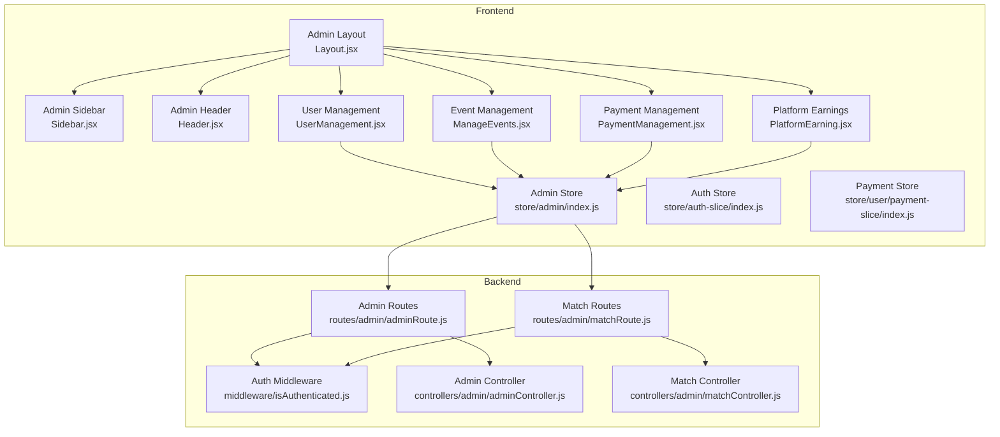

**Diagram sources**
- [Layout.jsx](file://client/src/components/Admin/Layout.jsx#L1-L22)
- [Sidebar.jsx](file://client/src/components/Admin/Sidebar.jsx#L1-L177)
- [Header.jsx](file://client/src/components/Admin/Header.jsx#L1-L55)
- [UserManagement.jsx](file://client/src/Pages/adminPage/UserManagement.jsx#L1-L554)
- [ManageEvents.jsx](file://client/src/Pages/adminPage/ManageEvents.jsx#L1-L800)
- [PaymentManagement.jsx](file://client/src/Pages/adminPage/PaymentManagement.jsx#L1-L701)
- [PlatformEarning.jsx](file://client/src/Pages/adminPage/PlatformEarning.jsx#L1-L672)
- [index.js](file://client/src/store/admin/index.js#L1-L334)
- [index.js](file://client/src/store/auth-slice/index.js#L1-L342)
- [index.js](file://client/src/store/user/payment-slice/index.js#L1-L344)
- [adminRoute.js](file://server/routes/admin/adminRoute.js#L1-L22)
- [matchRoute.js](file://server/routes/admin/matchRoute.js#L1-L38)
- [isAuthenticated.js](file://server/middleware/isAuthenticated.js#L1-L62)
- [adminController.js](file://server/controllers/admin/adminController.js#L1-L465)
- [matchController.js](file://server/controllers/admin/matchController.js#L1-L800)

**Section sources**
- [Layout.jsx](file://client/src/components/Admin/Layout.jsx#L1-L22)
- [Sidebar.jsx](file://client/src/components/Admin/Sidebar.jsx#L1-L177)
- [Header.jsx](file://client/src/components/Admin/Header.jsx#L1-L55)
- [UserManagement.jsx](file://client/src/Pages/adminPage/UserManagement.jsx#L1-L554)
- [ManageEvents.jsx](file://client/src/Pages/adminPage/ManageEvents.jsx#L1-L800)
- [PaymentManagement.jsx](file://client/src/Pages/adminPage/PaymentManagement.jsx#L1-L701)
- [PlatformEarning.jsx](file://client/src/Pages/adminPage/PlatformEarning.jsx#L1-L672)
- [index.js](file://client/src/store/admin/index.js#L1-L334)
- [index.js](file://client/src/store/auth-slice/index.js#L1-L342)
- [index.js](file://client/src/store/user/payment-slice/index.js#L1-L344)
- [adminRoute.js](file://server/routes/admin/adminRoute.js#L1-L22)
- [matchRoute.js](file://server/routes/admin/matchRoute.js#L1-L38)
- [isAuthenticated.js](file://server/middleware/isAuthenticated.js#L1-L62)
- [adminController.js](file://server/controllers/admin/adminController.js#L1-L465)
- [matchController.js](file://server/controllers/admin/matchController.js#L1-L800)

## Core Components
- Admin Layout and Navigation: Provides responsive layout, header with logout, and sidebar navigation to admin sections.
- User Management: Lists users with filtering, role updates, balance adjustments, deletion, and force logout capabilities.
- Event and Match Management: Creates, edits, settles, and manages top-level events and matches; integrates with real-time notifications.
- Payment Oversight: Reviews deposit and withdrawal requests, approves or rejects them, and tracks statistics.
- Platform Earnings Dashboard: Aggregates revenue from completed matches with date-range filters and CSV export.
- Admin Stores: Redux slices for admin operations, authentication, and payment management.
- Security Middleware: JWT-based authentication and authorization enforcement.

**Section sources**
- [Layout.jsx](file://client/src/components/Admin/Layout.jsx#L1-L22)
- [Sidebar.jsx](file://client/src/components/Admin/Sidebar.jsx#L1-L177)
- [Header.jsx](file://client/src/components/Admin/Header.jsx#L1-L55)
- [UserManagement.jsx](file://client/src/Pages/adminPage/UserManagement.jsx#L1-L554)
- [ManageEvents.jsx](file://client/src/Pages/adminPage/ManageEvents.jsx#L1-L800)
- [PaymentManagement.jsx](file://client/src/Pages/adminPage/PaymentManagement.jsx#L1-L701)
- [PlatformEarning.jsx](file://client/src/Pages/adminPage/PlatformEarning.jsx#L1-L672)
- [index.js](file://client/src/store/admin/index.js#L1-L334)
- [index.js](file://client/src/store/auth-slice/index.js#L1-L342)
- [index.js](file://client/src/store/user/payment-slice/index.js#L1-L344)

## Architecture Overview
The admin panel follows a layered architecture:
- Presentation Layer: React components and Redux stores manage UI state and async operations.
- API Layer: Express routes expose admin endpoints for user, event, match, and payment management.
- Business Logic Layer: Controllers implement domain-specific logic and orchestrate database operations.
- Persistence Layer: MongoDB models store user, match, bet, and payment data.
- Security Layer: Authentication middleware validates tokens and enforces role-based access.

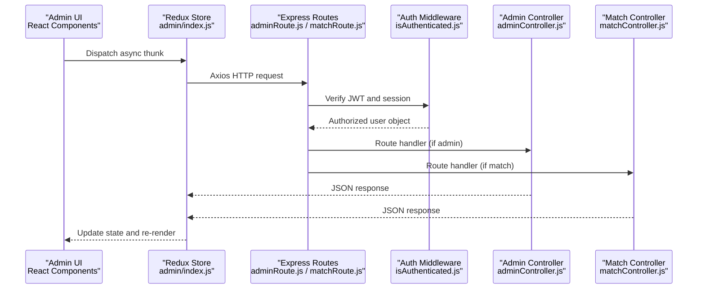

**Diagram sources**
- [index.js](file://client/src/store/admin/index.js#L1-L334)
- [adminRoute.js](file://server/routes/admin/adminRoute.js#L1-L22)
- [matchRoute.js](file://server/routes/admin/matchRoute.js#L1-L38)
- [isAuthenticated.js](file://server/middleware/isAuthenticated.js#L1-L62)
- [adminController.js](file://server/controllers/admin/adminController.js#L1-L465)
- [matchController.js](file://server/controllers/admin/matchController.js#L1-L800)

## Detailed Component Analysis

### Admin User Management
The user management interface enables administrators to:
- View users with pagination, sorting, and filtering by role and search term.
- Update user roles with optimistic UI updates and rollback on failure.
- Adjust user balances with immediate UI feedback.
- Delete users with confirmation dialogs.
- Force logout individual users or all users with confirmation prompts.
- Display user statistics (total users, admins, non-admins).

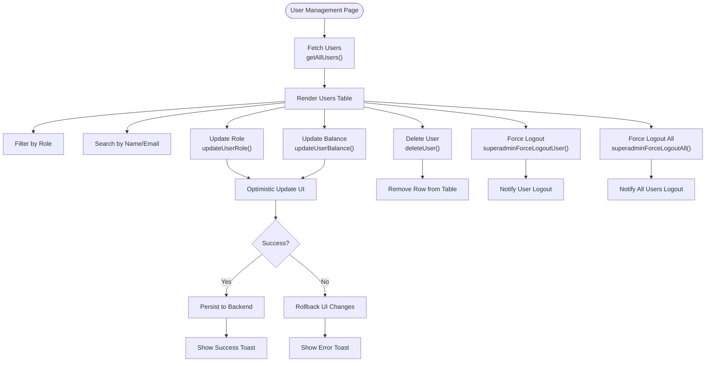

**Diagram sources**
- [UserManagement.jsx](file://client/src/Pages/adminPage/UserManagement.jsx#L1-L554)
- [index.js](file://client/src/store/admin/index.js#L206-L292)
- [index.js](file://client/src/store/auth-slice/index.js#L206-L255)

**Section sources**
- [UserManagement.jsx](file://client/src/Pages/adminPage/UserManagement.jsx#L1-L554)
- [index.js](file://client/src/store/admin/index.js#L206-L292)
- [index.js](file://client/src/store/auth-slice/index.js#L206-L255)

### Event and Match Management
The event and match management system supports:
- Creating top-level events with location and thumbnail.
- Editing event metadata.
- Completing events after settling all matches.
- Creating matches under events with section and team names.
- Updating match status (Upcoming → Active → Closed).
- Settling matches with winner selection and automated bet matching.
- Viewing all bets for a match.
- Real-time notifications via WebSocket for admin and global updates.

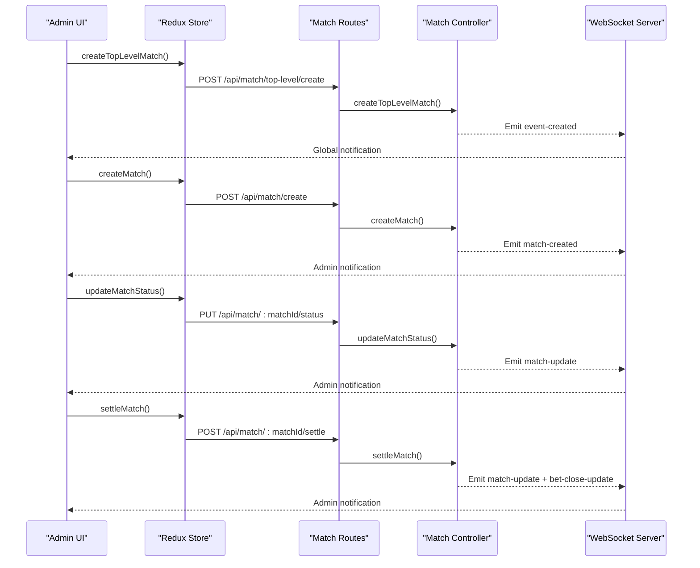

**Diagram sources**
- [ManageEvents.jsx](file://client/src/Pages/adminPage/ManageEvents.jsx#L1-L800)
- [index.js](file://client/src/store/admin/index.js#L85-L205)
- [matchRoute.js](file://server/routes/admin/matchRoute.js#L1-L38)
- [matchController.js](file://server/controllers/admin/matchController.js#L1-L800)

**Section sources**
- [ManageEvents.jsx](file://client/src/Pages/adminPage/ManageEvents.jsx#L1-L800)
- [index.js](file://client/src/store/admin/index.js#L85-L205)
- [matchRoute.js](file://server/routes/admin/matchRoute.js#L1-L38)
- [matchController.js](file://server/controllers/admin/matchController.js#L1-L800)

### Payment Oversight Tools
The payment management interface allows administrators to:
- Review all deposit and withdrawal requests with filtering and search.
- View detailed payment records with screenshots and bank/account details.
- Approve or reject pending requests with reason capture for rejections.
- Track payment statistics (counts and totals) per status.
- Navigate to detailed views for each payment record.

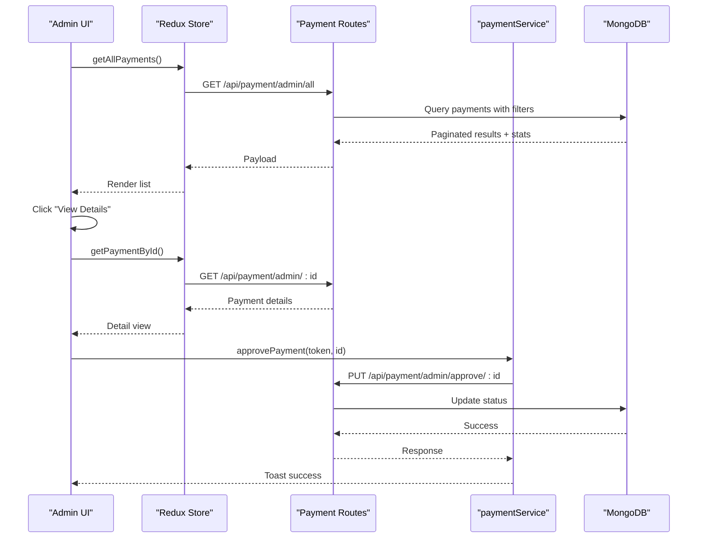

**Diagram sources**
- [PaymentManagement.jsx](file://client/src/Pages/adminPage/PaymentManagement.jsx#L1-L701)
- [PaymentManagementDetail.jsx](file://client/src/components/Admin/PaymentManagementDetail.jsx#L1-L823)
- [index.js](file://client/src/store/user/payment-slice/index.js#L193-L322)
- [index.js](file://client/src/store/admin/index.js#L1-L334)

**Section sources**
- [PaymentManagement.jsx](file://client/src/Pages/adminPage/PaymentManagement.jsx#L1-L701)
- [PaymentManagementDetail.jsx](file://client/src/components/Admin/PaymentManagementDetail.jsx#L1-L823)
- [index.js](file://client/src/store/user/payment-slice/index.js#L193-L322)
- [index.js](file://client/src/store/admin/index.js#L1-L334)

### Platform Earnings Dashboard
The platform earnings dashboard provides:
- Revenue tracking from 10% commission on winning bets.
- Filtering by location and date range with quick date presets.
- Pagination and expandable event details with match-level breakdown.
- CSV export for event-level statistics and match-level data.

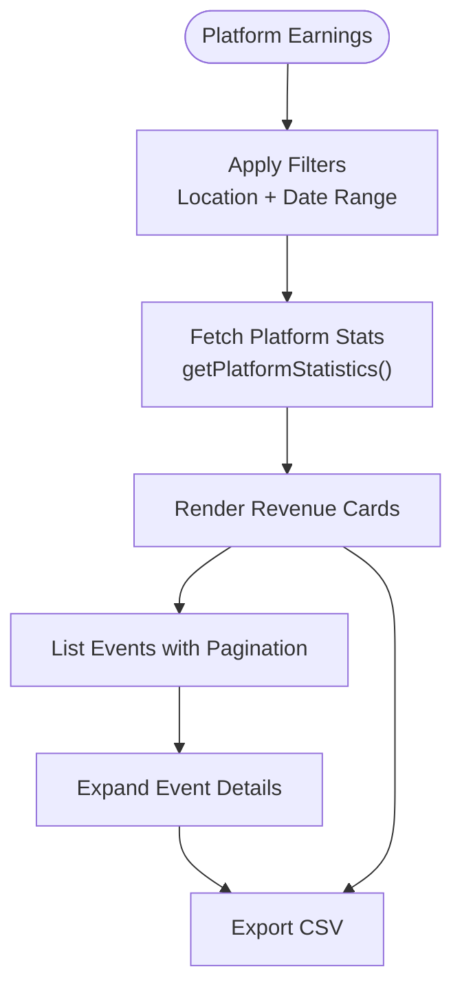

**Diagram sources**
- [PlatformEarning.jsx](file://client/src/Pages/adminPage/PlatformEarning.jsx#L1-L672)
- [index.js](file://client/src/store/admin/index.js#L130-L158)

**Section sources**
- [PlatformEarning.jsx](file://client/src/Pages/adminPage/PlatformEarning.jsx#L1-L672)
- [index.js](file://client/src/store/admin/index.js#L130-L158)

### Admin Controller Implementation and Authorization
Admin endpoints enforce:
- Authentication via JWT verification and session token validation.
- Authorization checks for admin-only routes.
- Comprehensive CRUD operations for users and platform statistics retrieval.

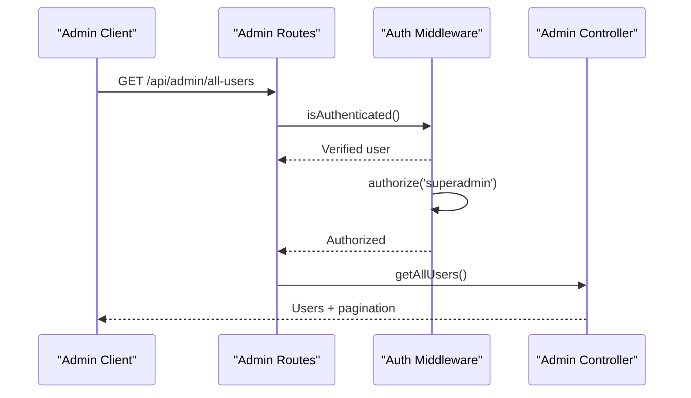

**Diagram sources**
- [adminRoute.js](file://server/routes/admin/adminRoute.js#L1-L22)
- [isAuthenticated.js](file://server/middleware/isAuthenticated.js#L1-L62)
- [adminController.js](file://server/controllers/admin/adminController.js#L1-L68)

**Section sources**
- [adminRoute.js](file://server/routes/admin/adminRoute.js#L1-L22)
- [isAuthenticated.js](file://server/middleware/isAuthenticated.js#L1-L62)
- [adminController.js](file://server/controllers/admin/adminController.js#L1-L68)

### Admin-Only Routes and Security Measures
Security measures include:
- JWT-based authentication with expiration and invalidation checks.
- Session token validation to support force logout scenarios.
- Role-based authorization for sensitive admin endpoints.
- Secure headers and cache-control policies for protected routes.

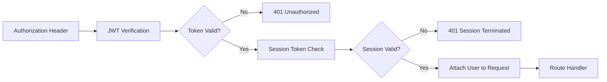

**Diagram sources**
- [isAuthenticated.js](file://server/middleware/isAuthenticated.js#L1-L62)

**Section sources**
- [isAuthenticated.js](file://server/middleware/isAuthenticated.js#L1-L62)

### Administrative Workflow: Approving User Actions and Managing Content
Common administrative workflows:
- Approve or reject payment requests with reason capture for rejections.
- Force logout users to invalidate sessions and require re-authentication.
- Settle matches and update statuses to finalize betting outcomes.
- Complete events after ensuring all matches are settled.

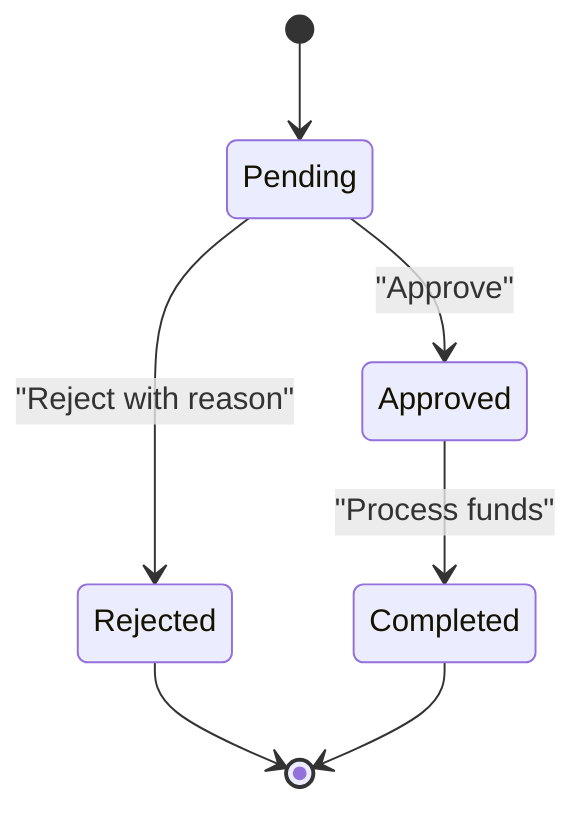

**Diagram sources**
- [PaymentManagementDetail.jsx](file://client/src/components/Admin/PaymentManagementDetail.jsx#L1-L823)
- [index.js](file://client/src/store/user/payment-slice/index.js#L271-L299)

**Section sources**
- [PaymentManagementDetail.jsx](file://client/src/components/Admin/PaymentManagementDetail.jsx#L1-L823)
- [index.js](file://client/src/store/user/payment-slice/index.js#L271-L299)

### Productivity Features and Bulk Operations
Productivity enhancements:
- Optimistic UI updates for role and balance changes with automatic rollback on errors.
- Debounced search and filtering for efficient user and payment listings.
- Real-time notifications via WebSocket for match and payment events.
- Pagination and load-more patterns for large datasets.
- CSV export for earnings reports.

**Section sources**
- [UserManagement.jsx](file://client/src/Pages/adminPage/UserManagement.jsx#L1-L554)
- [PlatformEarning.jsx](file://client/src/Pages/adminPage/PlatformEarning.jsx#L1-L672)
- [ManageEvents.jsx](file://client/src/Pages/adminPage/ManageEvents.jsx#L1-L800)

### Integration Between Admin Components and Backend APIs
Integration points:
- Redux async thunks dispatch HTTP requests to backend routes.
- Backend routes validate JWT and delegate to controllers.
- Controllers perform business logic and interact with MongoDB models.
- WebSocket emits real-time updates to admin clients.

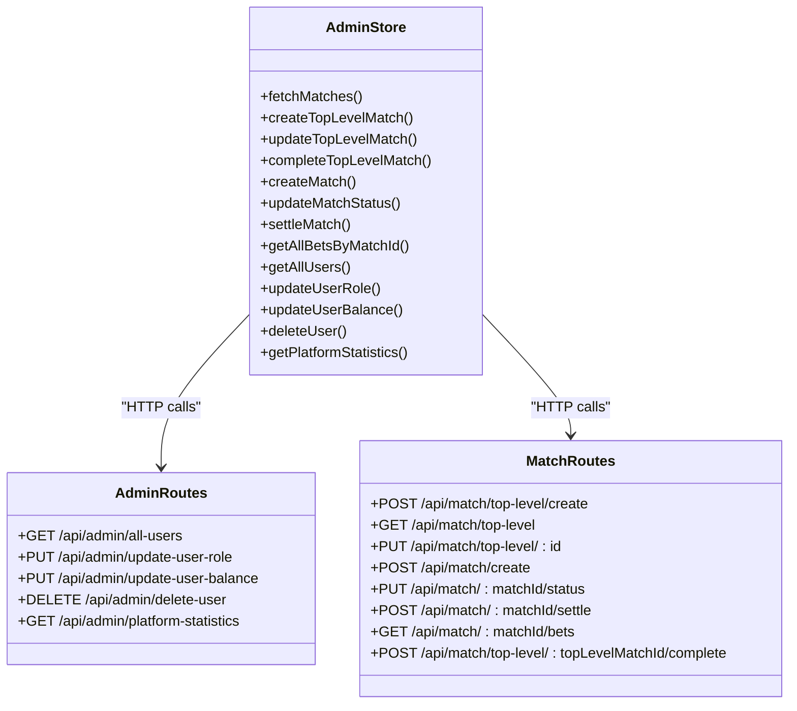

**Diagram sources**
- [index.js](file://client/src/store/admin/index.js#L1-L334)
- [adminRoute.js](file://server/routes/admin/adminRoute.js#L1-L22)
- [matchRoute.js](file://server/routes/admin/matchRoute.js#L1-L38)

**Section sources**
- [index.js](file://client/src/store/admin/index.js#L1-L334)
- [adminRoute.js](file://server/routes/admin/adminRoute.js#L1-L22)
- [matchRoute.js](file://server/routes/admin/matchRoute.js#L1-L38)

## Dependency Analysis
Key dependencies and relationships:
- Frontend depends on Redux for state management and Axios for HTTP communication.
- Backend routes depend on authentication middleware and controllers.
- Controllers depend on models and WebSocket handlers for real-time updates.
- Admin UI components rely on Redux slices for data fetching and mutations.

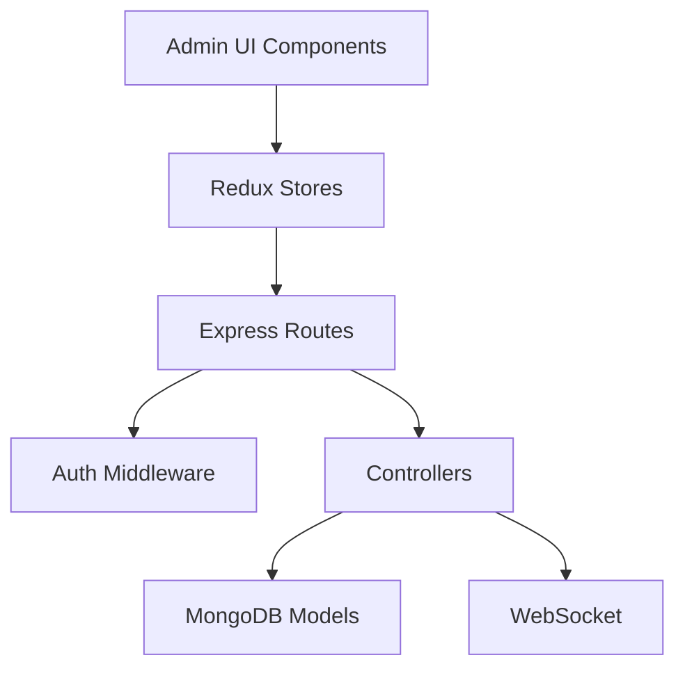

**Diagram sources**
- [index.js](file://client/src/store/admin/index.js#L1-L334)
- [adminRoute.js](file://server/routes/admin/adminRoute.js#L1-L22)
- [isAuthenticated.js](file://server/middleware/isAuthenticated.js#L1-L62)
- [adminController.js](file://server/controllers/admin/adminController.js#L1-L465)
- [matchController.js](file://server/controllers/admin/matchController.js#L1-L800)

**Section sources**
- [index.js](file://client/src/store/admin/index.js#L1-L334)
- [adminRoute.js](file://server/routes/admin/adminRoute.js#L1-L22)
- [isAuthenticated.js](file://server/middleware/isAuthenticated.js#L1-L62)
- [adminController.js](file://server/controllers/admin/adminController.js#L1-L465)
- [matchController.js](file://server/controllers/admin/matchController.js#L1-L800)

## Performance Considerations
- Use pagination and debounced search to reduce payload sizes and server load.
- Implement optimistic updates for immediate UI feedback with rollback on failure.
- Leverage WebSocket for real-time updates to minimize polling overhead.
- Apply database indexing on frequently queried fields (e.g., user roles, match status, payment status).
- Cache non-sensitive static assets and use CDN for thumbnails and media.

## Troubleshooting Guide
Common issues and resolutions:
- Authentication failures: Verify JWT validity and session token alignment; ensure proper headers are sent.
- Authorization errors: Confirm user role is superadmin for admin routes.
- Network timeouts: Increase timeout values for large file uploads; monitor progress callbacks.
- WebSocket disconnections: Re-join rooms on reconnect and refresh data on reconnection.
- Pagination inconsistencies: Ensure skip/limit calculations match backend expectations.

**Section sources**
- [isAuthenticated.js](file://server/middleware/isAuthenticated.js#L1-L62)
- [index.js](file://client/src/store/admin/index.js#L23-L83)
- [index.js](file://client/src/store/user/payment-slice/index.js#L35-L102)

## Conclusion
The administrative panel provides a robust, secure, and efficient interface for managing users, events, matches, payments, and platform earnings. Its layered architecture ensures clear separation of concerns, while Redux and Express streamline data flow and business logic. Security is enforced through JWT-based authentication and authorization, and real-time updates enhance operational responsiveness. The documented workflows and integrations enable administrators to perform complex tasks efficiently with built-in safeguards and productivity features.