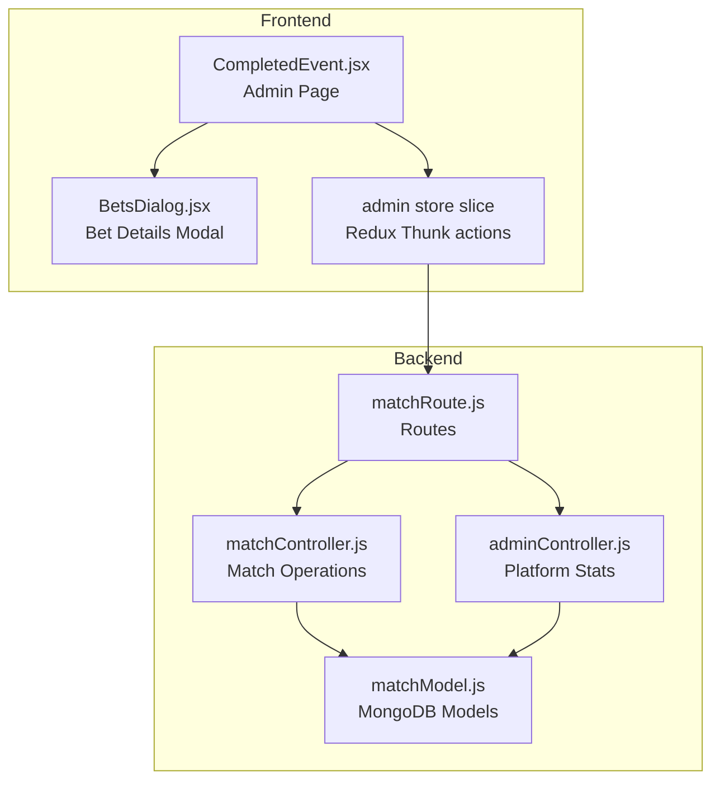
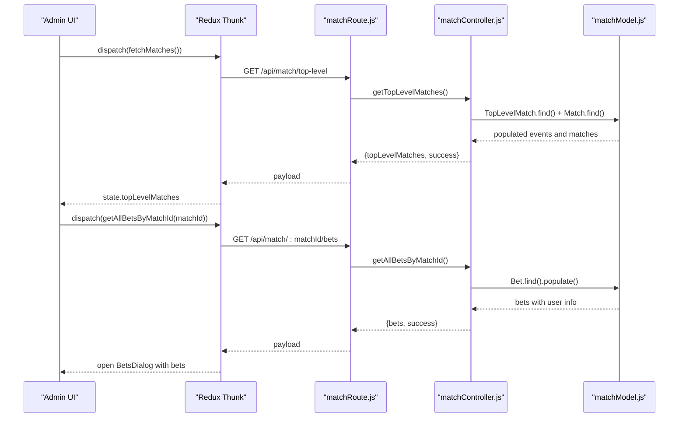
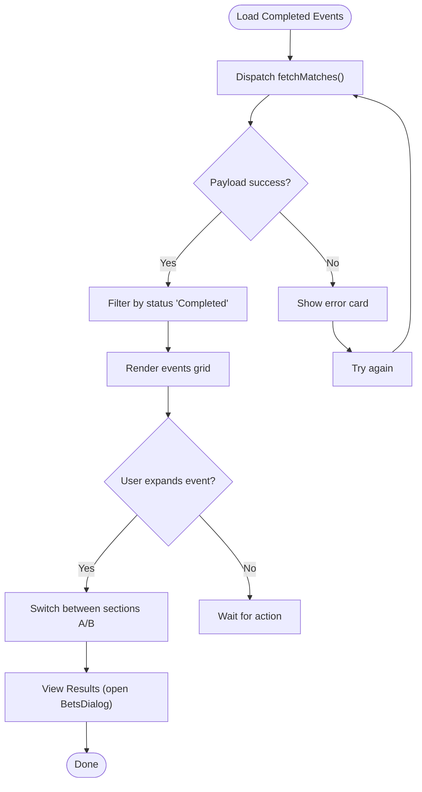
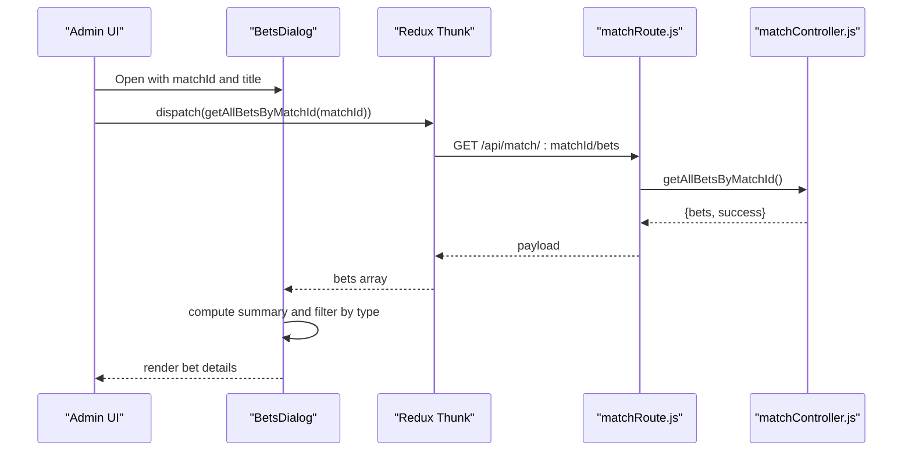
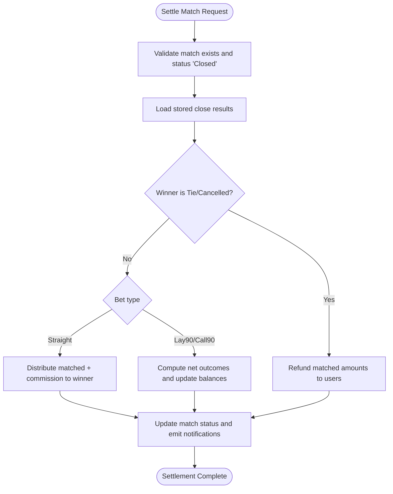
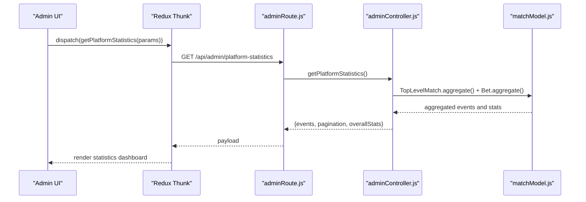
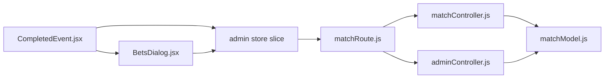

# Completed Events Tracking

<cite>
**Referenced Files in This Document**
- [CompletedEvent.jsx](file://client/src/Pages/adminPage/CompletedEvent.jsx)
- [BetsDialog.jsx](file://client/src/components/Admin/BetsDialog.jsx)
- [index.js](file://client/src/store/admin/index.js)
- [matchController.js](file://server/controllers/admin/matchController.js)
- [matchModel.js](file://server/models/matchModel.js)
- [matchRoute.js](file://server/routes/admin/matchRoute.js)
- [adminController.js](file://server/controllers/admin/adminController.js)
- [PlatformEarning.jsx](file://client/src/Pages/adminPage/PlatformEarning.jsx)
</cite>

## Table of Contents
1. [Introduction](#introduction)
2. [Project Structure](#project-structure)
3. [Core Components](#core-components)
4. [Architecture Overview](#architecture-overview)
5. [Detailed Component Analysis](#detailed-component-analysis)
6. [Dependency Analysis](#dependency-analysis)
7. [Performance Considerations](#performance-considerations)
8. [Troubleshooting Guide](#troubleshooting-guide)
9. [Conclusion](#conclusion)

## Introduction
This document describes the completed events tracking system designed for administrators to view, filter, and manage finished matches. It covers the CompletedEvent page functionality, filtering and sorting mechanisms, match result management, settlement confirmation, and payout processing workflows. It also documents historical data access, statistics aggregation, and reporting features, along with integrations to the betting settlement system and their impact on user accounts and platform analytics.

## Project Structure
The completed events tracking system spans the frontend admin interface and backend APIs:
- Frontend: CompletedEvent page renders completed events, provides filtering/searching, and displays match details via a modal dialog.
- Backend: Match controller handles match lifecycle operations (closing, settling), settlement logic, and bet retrieval. Admin controller aggregates platform statistics for reporting.

**Diagram sources**
- [CompletedEvent.jsx](file://client/src/Pages/adminPage/CompletedEvent.jsx#L32-L572)
- [BetsDialog.jsx](file://client/src/components/Admin/BetsDialog.jsx#L21-L333)
- [index.js](file://client/src/store/admin/index.js#L10-L334)
- [matchController.js](file://server/controllers/admin/matchController.js#L1-L1188)
- [adminController.js](file://server/controllers/admin/adminController.js#L128-L465)
- [matchRoute.js](file://server/routes/admin/matchRoute.js#L1-L38)
- [matchModel.js](file://server/models/matchModel.js#L1-L101)

**Section sources**
- [CompletedEvent.jsx](file://client/src/Pages/adminPage/CompletedEvent.jsx#L32-L572)
- [BetsDialog.jsx](file://client/src/components/Admin/BetsDialog.jsx#L21-L333)
- [index.js](file://client/src/store/admin/index.js#L10-L334)
- [matchController.js](file://server/controllers/admin/matchController.js#L1-L1188)
- [adminController.js](file://server/controllers/admin/adminController.js#L128-L465)
- [matchRoute.js](file://server/routes/admin/matchRoute.js#L1-L38)
- [matchModel.js](file://server/models/matchModel.js#L1-L101)

## Core Components
- CompletedEvent page: Loads completed events, applies search and status filters, expands event sections, and opens a modal to view match bets.
- BetsDialog: Displays bet details per match, including type distribution and per-bet status, winnings, and refunds.
- Redux store: Provides async thunks to fetch matches and bets, and manages loading/error states.
- Match controller: Implements match closing (validation, matching engine), settlement (payout processing, refunds), and bet retrieval.
- Admin controller: Aggregates platform statistics for reporting, including date-range and location filters.

**Section sources**
- [CompletedEvent.jsx](file://client/src/Pages/adminPage/CompletedEvent.jsx#L32-L572)
- [BetsDialog.jsx](file://client/src/components/Admin/BetsDialog.jsx#L21-L333)
- [index.js](file://client/src/store/admin/index.js#L10-L334)
- [matchController.js](file://server/controllers/admin/matchController.js#L513-L1188)
- [adminController.js](file://server/controllers/admin/adminController.js#L128-L465)

## Architecture Overview
The system follows a layered architecture:
- UI Layer: React components render completed events and bet details.
- Store Layer: Redux Thunk actions orchestrate API calls and state updates.
- Controller Layer: Express controllers implement business logic for match operations and statistics.
- Data Layer: MongoDB models define schemas and indexes for efficient queries.

**Diagram sources**
- [matchRoute.js](file://server/routes/admin/matchRoute.js#L21-L34)
- [matchController.js](file://server/controllers/admin/matchController.js#L366-L1188)
- [matchModel.js](file://server/models/matchModel.js#L1-L101)
- [index.js](file://client/src/store/admin/index.js#L294-L309)
- [CompletedEvent.jsx](file://client/src/Pages/adminPage/CompletedEvent.jsx#L101-L120)
- [BetsDialog.jsx](file://client/src/components/Admin/BetsDialog.jsx#L21-L333)

## Detailed Component Analysis

### CompletedEvent Page
The CompletedEvent page:
- Loads completed events via Redux thunk and filters to status "Completed".
- Provides search by location or bird names and status filter dropdown.
- Supports expanding/collapsing events and switching between sections A/B.
- Opens BetsDialog to display all bets for a selected match.

Key behaviors:
- Filtering and memoization: Uses useMemo to compute filtered matches based on search and status.
- Loading states: Renders shimmer cards during initial load and error cards on failure.
- Action triggers: Toggles expand/collapse and opens the bets modal with match-specific title.

**Diagram sources**
- [CompletedEvent.jsx](file://client/src/Pages/adminPage/CompletedEvent.jsx#L47-L134)
- [index.js](file://client/src/store/admin/index.js#L10-L22)

**Section sources**
- [CompletedEvent.jsx](file://client/src/Pages/adminPage/CompletedEvent.jsx#L32-L572)
- [index.js](file://client/src/store/admin/index.js#L10-L334)

### BetsDialog Component
The BetsDialog presents:
- Bet summary and type distribution (Straight/Lay90/Call90).
- Tabbed view to filter by bet type.
- Detailed table of bets with user email, selected bird, type, status, amounts, and timestamps.

Processing highlights:
- Memoized filtering by bet type.
- Badge rendering for bet types and statuses.
- Tabular display sorted by creation time.

**Diagram sources**
- [BetsDialog.jsx](file://client/src/components/Admin/BetsDialog.jsx#L21-L333)
- [index.js](file://client/src/store/admin/index.js#L294-L309)
- [matchRoute.js](file://server/routes/admin/matchRoute.js#L31-L34)
- [matchController.js](file://server/controllers/admin/matchController.js#L1166-L1188)

**Section sources**
- [BetsDialog.jsx](file://client/src/components/Admin/BetsDialog.jsx#L21-L333)
- [index.js](file://client/src/store/admin/index.js#L294-L309)
- [matchController.js](file://server/controllers/admin/matchController.js#L1166-L1188)

### Match Settlement and Payout Processing
The settlement workflow ensures accurate accounting and user payouts:
- Close match: Validates bets, builds matching queues, executes FIFO matching for Straight and Lay90/Call90 combinations, computes user summaries, and stores close results on the match.
- Settle match: Uses stored close results to avoid re-matching. Processes:
  - Tie/Cancelled: Refunds matched amounts to users.
  - Straight bets: Distributes matched amounts plus commission to winners.
  - Lay90/Call90: Computes net outcomes based on winner and updates balances and bet statuses.
- Emits real-time notifications to users and admin rooms.

**Diagram sources**
- [matchController.js](file://server/controllers/admin/matchController.js#L902-L1165)
- [matchModel.js](file://server/models/matchModel.js#L36-L72)

**Section sources**
- [matchController.js](file://server/controllers/admin/matchController.js#L513-L1165)
- [matchModel.js](file://server/models/matchModel.js#L36-L72)

### Reporting and Statistics
The platform statistics endpoint aggregates:
- Completed events within a date range and optional location filter.
- Per-event metrics: total matches, total users, net profit (commission), and match-level details.
- Overall platform summary across time windows.

**Diagram sources**
- [adminController.js](file://server/controllers/admin/adminController.js#L128-L382)
- [matchRoute.js](file://server/routes/admin/matchRoute.js#L1-L38)
- [matchModel.js](file://server/models/matchModel.js#L1-L101)
- [PlatformEarning.jsx](file://client/src/Pages/adminPage/PlatformEarning.jsx#L36-L128)

**Section sources**
- [adminController.js](file://server/controllers/admin/adminController.js#L128-L465)
- [PlatformEarning.jsx](file://client/src/Pages/adminPage/PlatformEarning.jsx#L36-L128)

## Dependency Analysis
- CompletedEvent depends on Redux thunks to fetch matches and on BetsDialog for detailed views.
- BetsDialog depends on Redux thunks to fetch bets by match ID.
- Match controller depends on Bet and Auth models for settlement and user balance updates.
- Admin controller depends on TopLevelMatch and Bet models for aggregations.
- Routes connect frontend actions to backend controllers.

**Diagram sources**
- [CompletedEvent.jsx](file://client/src/Pages/adminPage/CompletedEvent.jsx#L1-L572)
- [BetsDialog.jsx](file://client/src/components/Admin/BetsDialog.jsx#L1-L333)
- [index.js](file://client/src/store/admin/index.js#L1-L334)
- [matchRoute.js](file://server/routes/admin/matchRoute.js#L1-L38)
- [matchController.js](file://server/controllers/admin/matchController.js#L1-L1188)
- [adminController.js](file://server/controllers/admin/adminController.js#L1-L465)
- [matchModel.js](file://server/models/matchModel.js#L1-L101)

**Section sources**
- [CompletedEvent.jsx](file://client/src/Pages/adminPage/CompletedEvent.jsx#L1-L572)
- [BetsDialog.jsx](file://client/src/components/Admin/BetsDialog.jsx#L1-L333)
- [index.js](file://client/src/store/admin/index.js#L1-L334)
- [matchRoute.js](file://server/routes/admin/matchRoute.js#L1-L38)
- [matchController.js](file://server/controllers/admin/matchController.js#L1-L1188)
- [adminController.js](file://server/controllers/admin/adminController.js#L1-L465)
- [matchModel.js](file://server/models/matchModel.js#L1-L101)

## Performance Considerations
- Database indexing: Match and TopLevelMatch schemas include indexes on status and createdAt for efficient filtering and sorting.
- Aggregation pipeline: Platform statistics use MongoDB aggregation to compute counts and sums server-side, reducing payload sizes.
- Memoization: Frontend uses useMemo to avoid unnecessary recomputation of filtered lists.
- Pagination: Platform statistics support pagination to limit response sizes.

Recommendations:
- Monitor aggregation performance with explain plans for large datasets.
- Consider adding compound indexes for frequent query patterns (e.g., status + createdAt).
- Optimize frontend rendering by virtualizing long lists in future enhancements.

**Section sources**
- [matchModel.js](file://server/models/matchModel.js#L94-L96)
- [adminController.js](file://server/controllers/admin/adminController.js#L158-L307)

## Troubleshooting Guide
Common issues and resolutions:
- No completed events displayed:
  - Verify that events have status "Completed" and that fetchMatches returned success.
  - Clear search/filter and retry loading.
- Bet details modal shows empty:
  - Ensure the match has associated bets and that getAllBetsByMatchId succeeded.
  - Confirm matchId is valid and match status supports bet retrieval.
- Settlement errors:
  - Check that match status is "Closed" before settling.
  - Validate winningBird selection against match participants or special values (Tie/Cancelled).
  - Confirm close results exist on the match document.
- Real-time updates not appearing:
  - Verify socket connections and room emissions in matchController.
  - Ensure clients listen to appropriate socket channels.

**Section sources**
- [CompletedEvent.jsx](file://client/src/Pages/adminPage/CompletedEvent.jsx#L47-L76)
- [matchController.js](file://server/controllers/admin/matchController.js#L919-L939)
- [matchController.js](file://server/controllers/admin/matchController.js#L872-L882)

## Conclusion
The completed events tracking system provides administrators with a comprehensive interface to review, filter, and analyze settled matches. It integrates tightly with the betting settlement system to ensure accurate payouts, refunds, and real-time notifications. Reporting capabilities enable historical insights and platform analytics, supporting informed decision-making and operational oversight.