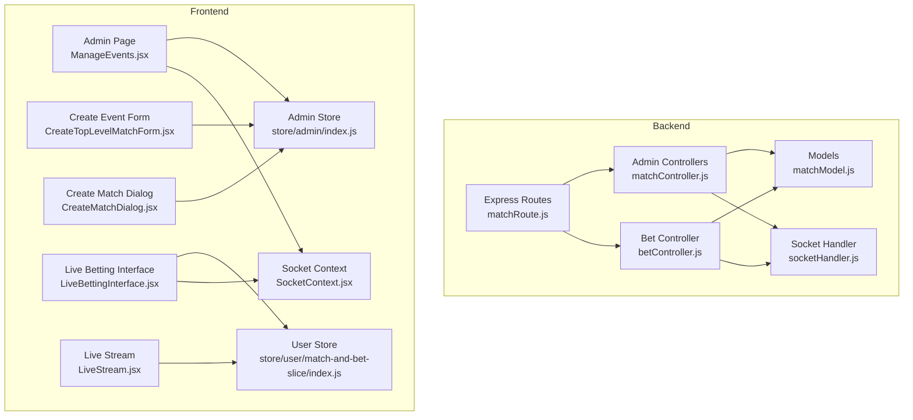
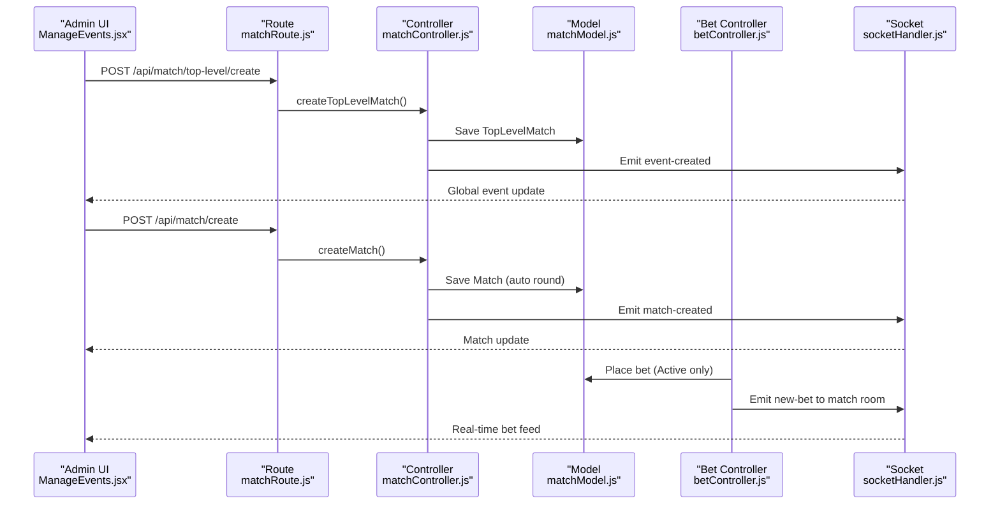
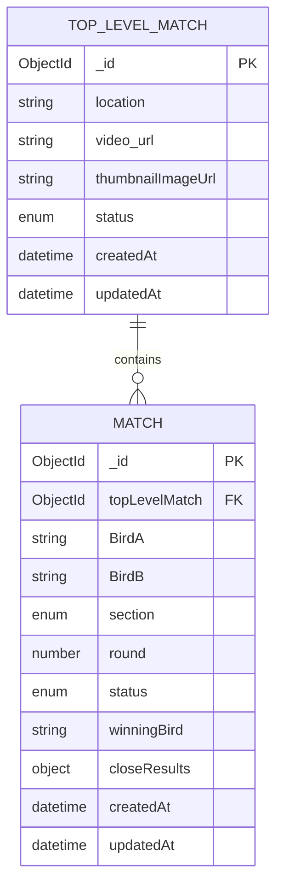
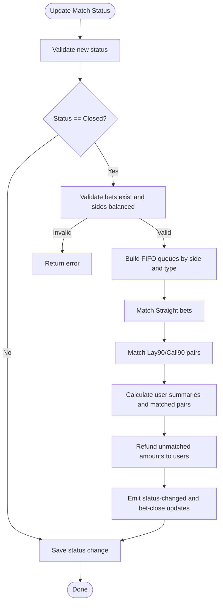
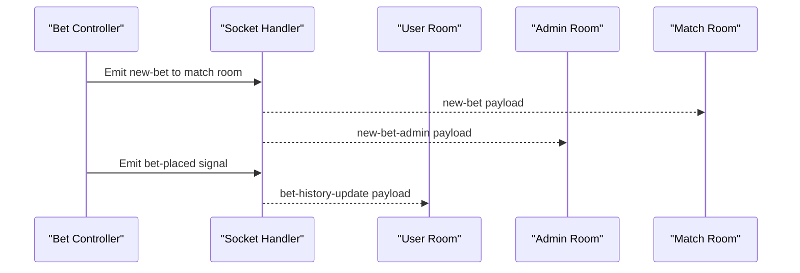
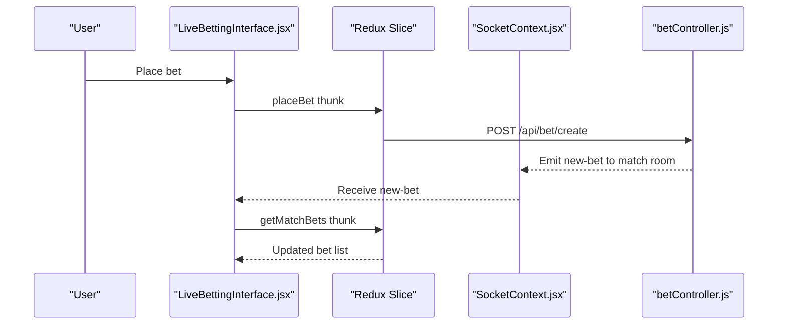
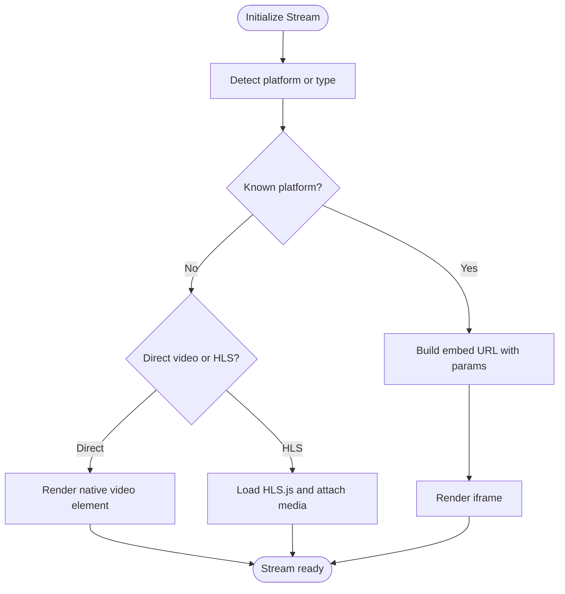
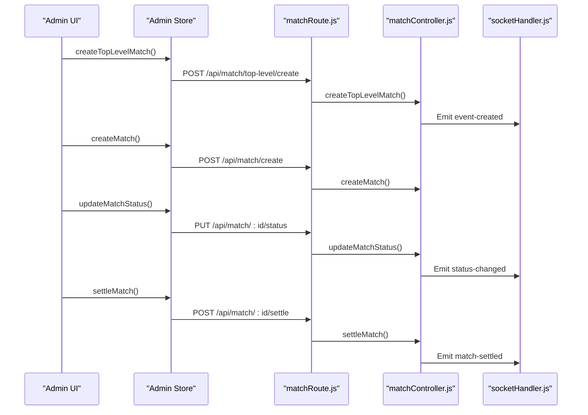
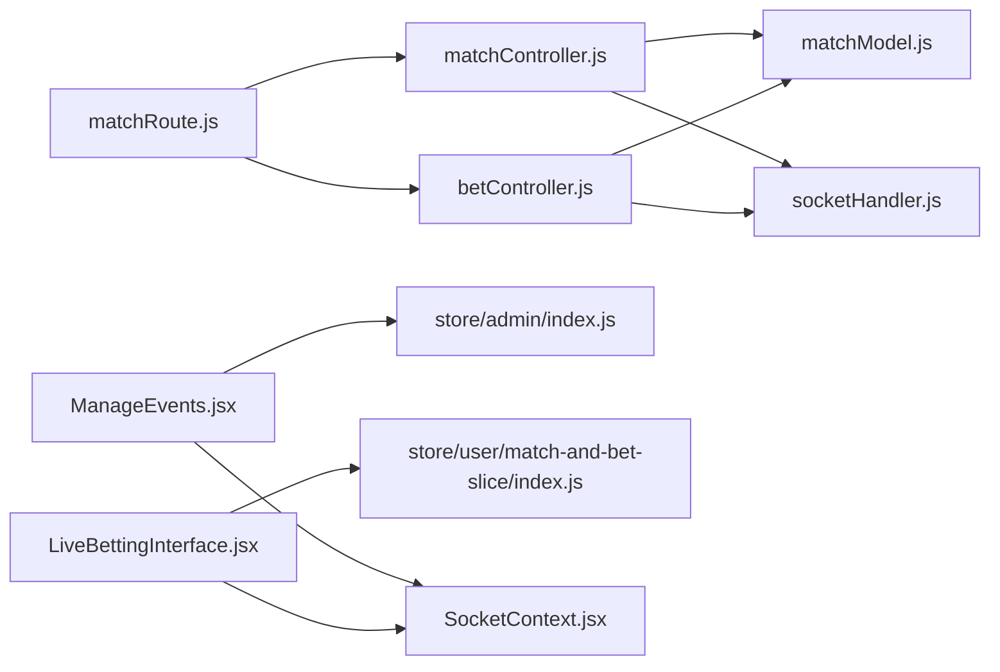

# Event and Match Management

<cite>
**Referenced Files in This Document**
- [matchModel.js](file://server/models/matchModel.js)
- [matchController.js](file://server/controllers/admin/matchController.js)
- [matchRoute.js](file://server/routes/admin/matchRoute.js)
- [socketHandler.js](file://server/socket/socketHandler.js)
- [betController.js](file://server/controllers/bet/betController.js)
- [ManageEvents.jsx](file://client/src/Pages/adminPage/ManageEvents.jsx)
- [CreateTopLevelMatchForm.jsx](file://client/src/components/Admin/CreateTopLevelMatchForm.jsx)
- [CreateMatchDialog.jsx](file://client/src/components/Admin/CreateMatchDialog.jsx)
- [LiveBettingInterface.jsx](file://client/src/components/Bet/LiveBettingInterface.jsx)
- [LiveStream.jsx](file://client/src/components/Bet/LiveStream.jsx)
- [SocketContext.jsx](file://client/src/context/SocketContext.jsx)
- [index.js](file://client/src/store/admin/index.js)
- [index.js](file://client/src/store/user/match-and-bet-slice/index.js)
</cite>

## Table of Contents
1. [Introduction](#introduction)
2. [Project Structure](#project-structure)
3. [Core Components](#core-components)
4. [Architecture Overview](#architecture-overview)
5. [Detailed Component Analysis](#detailed-component-analysis)
6. [Dependency Analysis](#dependency-analysis)
7. [Performance Considerations](#performance-considerations)
8. [Troubleshooting Guide](#troubleshooting-guide)
9. [Conclusion](#conclusion)

## Introduction
This document explains the event and match management system for a live betting platform. It covers the hierarchical tournament structure (top-level events and sub-matches), match lifecycle (creation, editing, scheduling, closing, settlement), real-time updates, betting integration, live streaming, and administrative controls. The system supports Section A and Section B match grouping, with robust validation and data integrity enforced at both frontend and backend layers.

## Project Structure
The system is organized around a clear separation of concerns:
- Backend: Express routes, controllers, Mongoose models, and Socket.IO handlers
- Frontend: React pages and components with Redux slices for state management
- Real-time: Socket.IO rooms for match, event, admin, and user-specific updates

**Diagram sources**
- [matchRoute.js](file://server/routes/admin/matchRoute.js#L1-L38)
- [matchController.js](file://server/controllers/admin/matchController.js#L1-L1188)
- [betController.js](file://server/controllers/bet/betController.js#L1-L125)
- [matchModel.js](file://server/models/matchModel.js#L1-L101)
- [socketHandler.js](file://server/socket/socketHandler.js#L1-L101)
- [ManageEvents.jsx](file://client/src/Pages/adminPage/ManageEvents.jsx#L1-L1173)
- [CreateTopLevelMatchForm.jsx](file://client/src/components/Admin/CreateTopLevelMatchForm.jsx#L1-L618)
- [CreateMatchDialog.jsx](file://client/src/components/Admin/CreateMatchDialog.jsx#L1-L122)
- [LiveBettingInterface.jsx](file://client/src/components/Bet/LiveBettingInterface.jsx#L1-L439)
- [LiveStream.jsx](file://client/src/components/Bet/LiveStream.jsx#L1-L462)
- [SocketContext.jsx](file://client/src/context/SocketContext.jsx#L1-L62)
- [index.js](file://client/src/store/admin/index.js#L1-L334)
- [index.js](file://client/src/store/user/match-and-bet-slice/index.js#L1-L127)

**Section sources**
- [matchRoute.js](file://server/routes/admin/matchRoute.js#L1-L38)
- [matchController.js](file://server/controllers/admin/matchController.js#L1-L1188)
- [matchModel.js](file://server/models/matchModel.js#L1-L101)
- [socketHandler.js](file://server/socket/socketHandler.js#L1-L101)
- [ManageEvents.jsx](file://client/src/Pages/adminPage/ManageEvents.jsx#L1-L1173)
- [CreateTopLevelMatchForm.jsx](file://client/src/components/Admin/CreateTopLevelMatchForm.jsx#L1-L618)
- [CreateMatchDialog.jsx](file://client/src/components/Admin/CreateMatchDialog.jsx#L1-L122)
- [LiveBettingInterface.jsx](file://client/src/components/Bet/LiveBettingInterface.jsx#L1-L439)
- [LiveStream.jsx](file://client/src/components/Bet/LiveStream.jsx#L1-L462)
- [SocketContext.jsx](file://client/src/context/SocketContext.jsx#L1-L62)
- [index.js](file://client/src/store/admin/index.js#L1-L334)
- [index.js](file://client/src/store/user/match-and-bet-slice/index.js#L1-L127)

## Core Components
- Top-level matches (events): Represented by the TopLevelMatch model with location, video URL, and thumbnail image. Admins create and update events.
- Sub-matches: Represented by the Match model with fields for participants (BirdA/B), section (Section A/B), round number, and status.
- Status lifecycle: Upcoming → Active → Closed → Completed/Tie/Cancelled.
- Real-time updates: Socket.IO rooms broadcast match and event updates to admins, users, and betting interfaces.
- Betting integration: Place bets, live feed, and settlement with commission handling and refunds.
- Live streaming: Embedded player supporting multiple platforms and HLS streams.

**Section sources**
- [matchModel.js](file://server/models/matchModel.js#L3-L99)
- [matchController.js](file://server/controllers/admin/matchController.js#L66-L254)
- [socketHandler.js](file://server/socket/socketHandler.js#L1-L101)
- [betController.js](file://server/controllers/bet/betController.js#L42-L106)
- [LiveStream.jsx](file://client/src/components/Bet/LiveStream.jsx#L1-L462)

## Architecture Overview
The system uses a layered architecture:
- Presentation layer: React components and pages
- Application layer: Redux slices and route handlers
- Domain layer: Controllers implementing business logic
- Data layer: Mongoose models with indexes for performance
- Communication layer: Socket.IO for real-time updates

**Diagram sources**
- [matchRoute.js](file://server/routes/admin/matchRoute.js#L21-L34)
- [matchController.js](file://server/controllers/admin/matchController.js#L66-L364)
- [matchModel.js](file://server/models/matchModel.js#L3-L99)
- [betController.js](file://server/controllers/bet/betController.js#L42-L106)
- [socketHandler.js](file://server/socket/socketHandler.js#L58-L72)
- [ManageEvents.jsx](file://client/src/Pages/adminPage/ManageEvents.jsx#L203-L272)

## Detailed Component Analysis

### Hierarchical Tournament Structure
- Top-level matches (events) encapsulate multiple sub-matches.
- Sub-matches are grouped by section (Section A/B) and ordered by round.
- Rounds are auto-generated per top-level match and section.

**Diagram sources**
- [matchModel.js](file://server/models/matchModel.js#L3-L99)

**Section sources**
- [matchModel.js](file://server/models/matchModel.js#L77-L92)
- [matchController.js](file://server/controllers/admin/matchController.js#L282-L364)

### Match Lifecycle and Status Management
- Creation: Validates non-empty participants and unique section constraints; assigns round automatically.
- Status transitions: Upcoming → Active → Closed; direct completion requires settlement.
- Closing: Matches bets using FIFO queues for Straight, Lay90, and Call90; calculates matched pairs and user summaries.
- Settlement: Applies commission for Straight bets; handles Lay90/Call90 outcomes; refunds unmatched amounts; updates match status to Completed, Tie, or Cancelled.

**Diagram sources**
- [matchController.js](file://server/controllers/admin/matchController.js#L513-L901)

**Section sources**
- [matchController.js](file://server/controllers/admin/matchController.js#L513-L901)
- [matchController.js](file://server/controllers/admin/matchController.js#L902-L1165)

### Real-Time Updates and Broadcasting
- Socket rooms: match-{id}, event-{id}, admin-room, global channels.
- Admin notifications: created/updated events and matches, bet placement, settlement results.
- User bet history updates: individual user rooms for bet-close and settlement notifications.

**Diagram sources**
- [socketHandler.js](file://server/socket/socketHandler.js#L58-L72)
- [betController.js](file://server/controllers/bet/betController.js#L79-L96)
- [matchController.js](file://server/controllers/admin/matchController.js#L41-L64)

**Section sources**
- [socketHandler.js](file://server/socket/socketHandler.js#L1-L101)
- [betController.js](file://server/controllers/bet/betController.js#L79-L96)
- [matchController.js](file://server/controllers/admin/matchController.js#L41-L64)

### Betting Interface Integration
- Live betting panel displays real-time bet feed, pool statistics, and recent bets.
- Socket listeners subscribe to new-bet and match-update events for the current match.
- Amount presets and validation ensure safe betting during Active status.

**Diagram sources**
- [LiveBettingInterface.jsx](file://client/src/components/Bet/LiveBettingInterface.jsx#L110-L169)
- [index.js](file://client/src/store/user/match-and-bet-slice/index.js#L95-L127)
- [betController.js](file://server/controllers/bet/betController.js#L42-L106)
- [SocketContext.jsx](file://client/src/context/SocketContext.jsx#L14-L61)

**Section sources**
- [LiveBettingInterface.jsx](file://client/src/components/Bet/LiveBettingInterface.jsx#L1-L439)
- [index.js](file://client/src/store/user/match-and-bet-slice/index.js#L95-L127)
- [betController.js](file://server/controllers/bet/betController.js#L42-L106)
- [SocketContext.jsx](file://client/src/context/SocketContext.jsx#L14-L61)

### Live Stream Management
- Supports YouTube, Vimeo, Twitch, Facebook, Dailymotion, Google Drive, Streamable, and HLS.
- Embeds platform players with appropriate parameters and fallbacks.
- Handles autoplay, muting, fullscreen, and retry logic.

**Diagram sources**
- [LiveStream.jsx](file://client/src/components/Bet/LiveStream.jsx#L129-L321)

**Section sources**
- [LiveStream.jsx](file://client/src/components/Bet/LiveStream.jsx#L1-L462)

### Administrative Workflows
- Create/Edit Top-Level Matches: Form validation enforces required fields and image constraints.
- Create Sub-Matches: Section validation prevents concurrent active matches in the same section.
- Status Controls: Open/Close bet actions and settlement with winner selection.
- Event Completion: Ensures all sub-matches are Completed/Tie/Cancelled before marking event complete.

**Diagram sources**
- [CreateTopLevelMatchForm.jsx](file://client/src/components/Admin/CreateTopLevelMatchForm.jsx#L266-L315)
- [CreateMatchDialog.jsx](file://client/src/components/Admin/CreateMatchDialog.jsx#L27-L58)
- [index.js](file://client/src/store/admin/index.js#L85-L205)
- [matchRoute.js](file://server/routes/admin/matchRoute.js#L21-L34)
- [matchController.js](file://server/controllers/admin/matchController.js#L66-L364)
- [socketHandler.js](file://server/socket/socketHandler.js#L1-L101)

**Section sources**
- [CreateTopLevelMatchForm.jsx](file://client/src/components/Admin/CreateTopLevelMatchForm.jsx#L1-L618)
- [CreateMatchDialog.jsx](file://client/src/components/Admin/CreateMatchDialog.jsx#L1-L122)
- [index.js](file://client/src/store/admin/index.js#L85-L205)
- [matchRoute.js](file://server/routes/admin/matchRoute.js#L1-L38)
- [matchController.js](file://server/controllers/admin/matchController.js#L66-L364)
- [socketHandler.js](file://server/socket/socketHandler.js#L1-L101)

## Dependency Analysis
- Controllers depend on models and socket handlers for persistence and real-time updates.
- Routes delegate to controllers; controllers orchestrate business logic and emit events.
- Frontend Redux slices call backend APIs and consume Socket.IO events.
- Socket rooms decouple components and scale horizontally.

**Diagram sources**
- [matchRoute.js](file://server/routes/admin/matchRoute.js#L1-L38)
- [matchController.js](file://server/controllers/admin/matchController.js#L1-L1188)
- [betController.js](file://server/controllers/bet/betController.js#L1-L125)
- [matchModel.js](file://server/models/matchModel.js#L1-L101)
- [socketHandler.js](file://server/socket/socketHandler.js#L1-L101)
- [ManageEvents.jsx](file://client/src/Pages/adminPage/ManageEvents.jsx#L1-L1173)
- [LiveBettingInterface.jsx](file://client/src/components/Bet/LiveBettingInterface.jsx#L1-L439)
- [index.js](file://client/src/store/admin/index.js#L1-L334)
- [index.js](file://client/src/store/user/match-and-bet-slice/index.js#L1-L127)
- [SocketContext.jsx](file://client/src/context/SocketContext.jsx#L1-L62)

**Section sources**
- [matchRoute.js](file://server/routes/admin/matchRoute.js#L1-L38)
- [matchController.js](file://server/controllers/admin/matchController.js#L1-L1188)
- [betController.js](file://server/controllers/bet/betController.js#L1-L125)
- [matchModel.js](file://server/models/matchModel.js#L1-L101)
- [socketHandler.js](file://server/socket/socketHandler.js#L1-L101)
- [ManageEvents.jsx](file://client/src/Pages/adminPage/ManageEvents.jsx#L1-L1173)
- [LiveBettingInterface.jsx](file://client/src/components/Bet/LiveBettingInterface.jsx#L1-L439)
- [index.js](file://client/src/store/admin/index.js#L1-L334)
- [index.js](file://client/src/store/user/match-and-bet-slice/index.js#L1-L127)
- [SocketContext.jsx](file://client/src/context/SocketContext.jsx#L1-L62)

## Performance Considerations
- Database indexing: Compound indexes on top-level match and section for efficient queries.
- Pre-save hooks: Auto-round assignment minimizes race conditions.
- Socket rooms: Targeted broadcasts reduce unnecessary network overhead.
- Frontend caching: Use memoization and debounced search/filter to minimize re-renders.
- Streaming: Lazy-load HLS.js and avoid autoplay failures by handling browser policies.

[No sources needed since this section provides general guidance]

## Troubleshooting Guide
- Socket connection issues: Verify server URL and transport settings; check reconnection attempts.
- Bet placement errors: Ensure match status is Active and user has sufficient balance.
- Settlement failures: Confirm match is Closed and close results exist; validate winner selection.
- Stream loading errors: Validate platform URL patterns and fallback to generic iframe embedding.

**Section sources**
- [SocketContext.jsx](file://client/src/context/SocketContext.jsx#L18-L54)
- [betController.js](file://server/controllers/bet/betController.js#L42-L106)
- [matchController.js](file://server/controllers/admin/matchController.js#L902-L1165)
- [LiveStream.jsx](file://client/src/components/Bet/LiveStream.jsx#L284-L321)

## Conclusion
The event and match management system provides a robust, real-time platform for organizing tournaments, managing sub-matches, enforcing betting rules, and delivering live streaming experiences. Its modular architecture, strong validation, and comprehensive real-time updates ensure reliability and scalability for administrators and users alike.