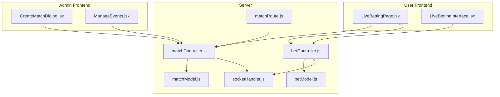
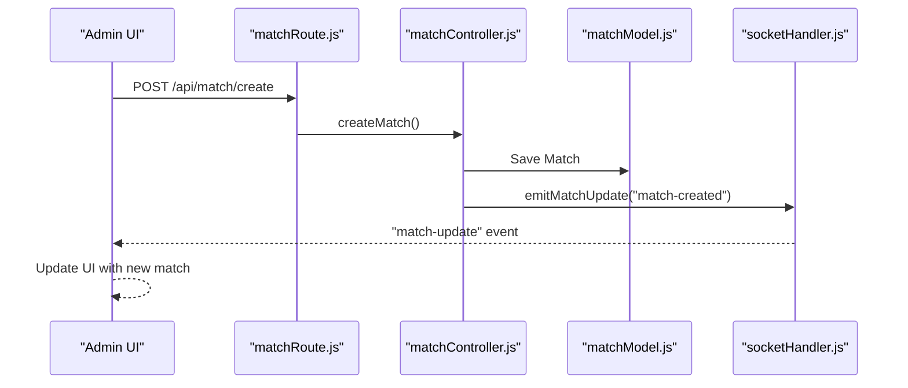
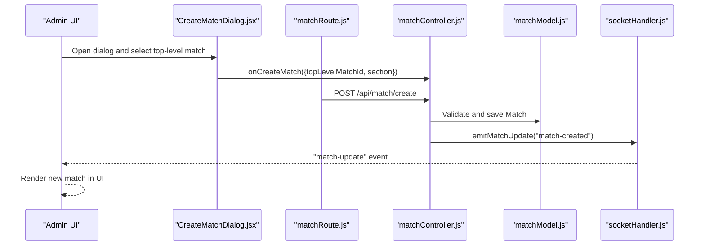
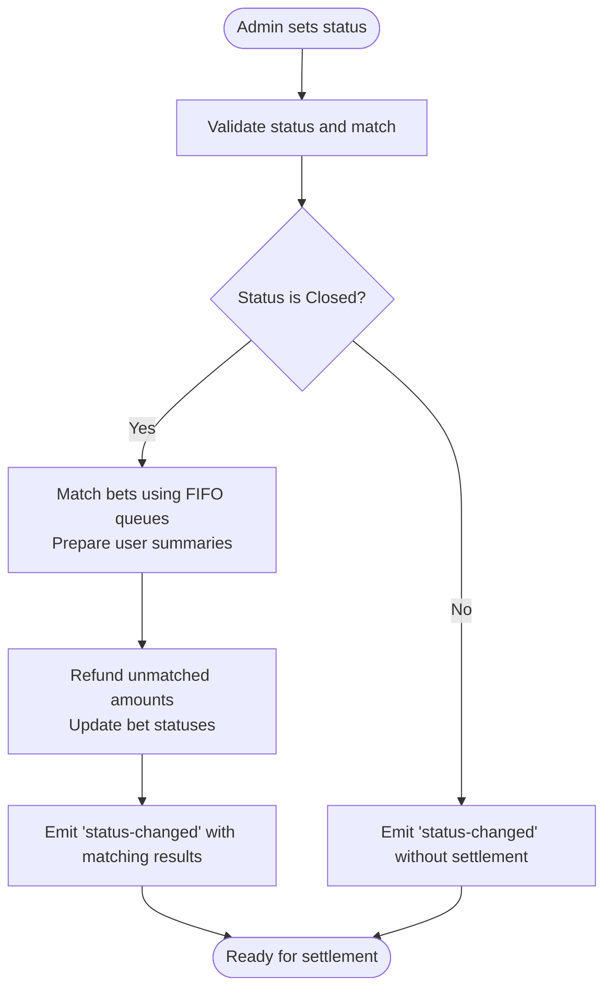
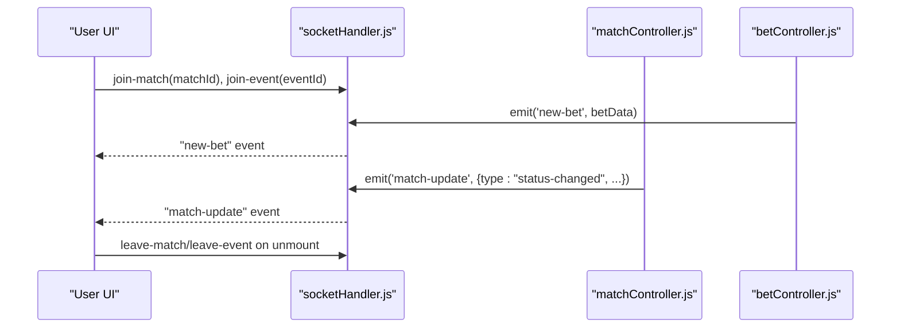
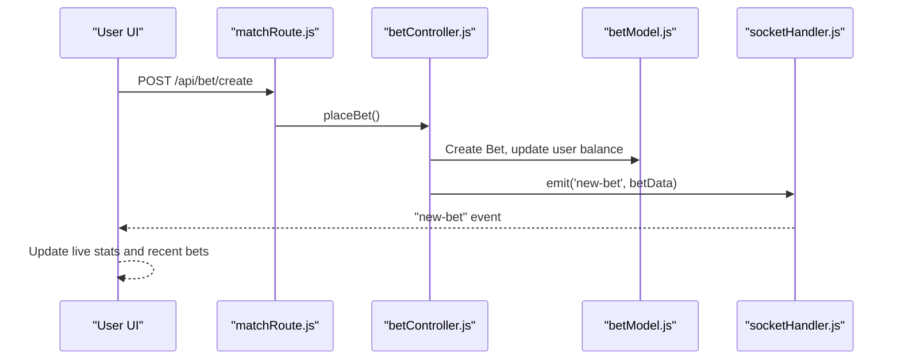
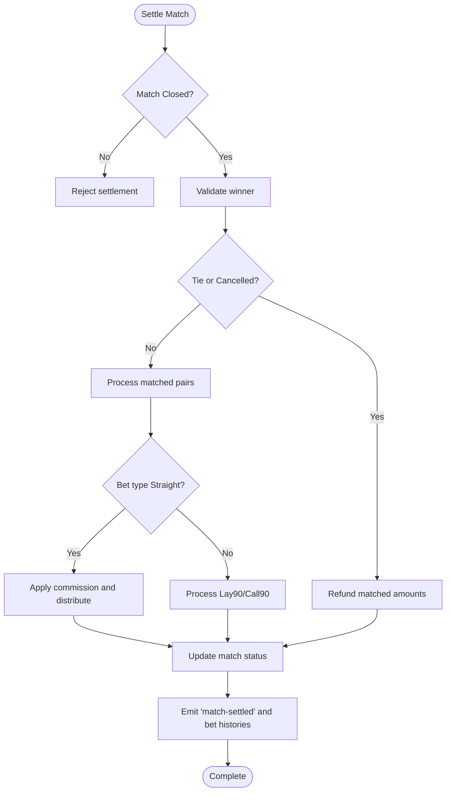
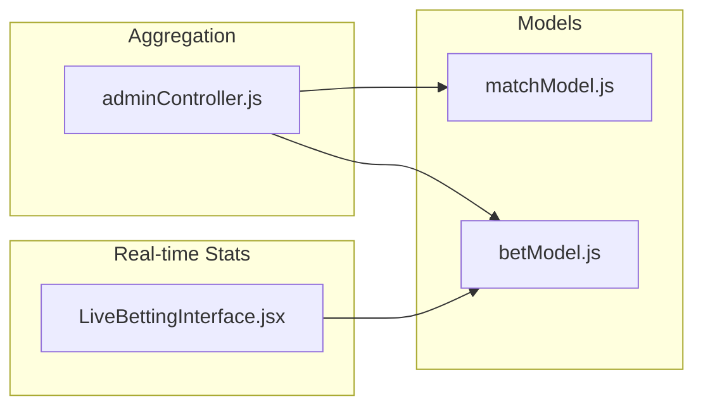
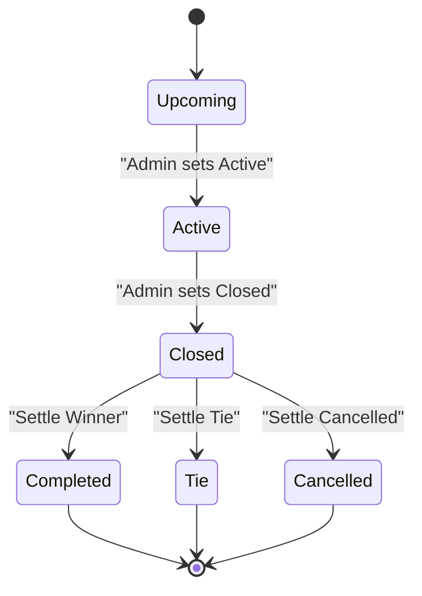
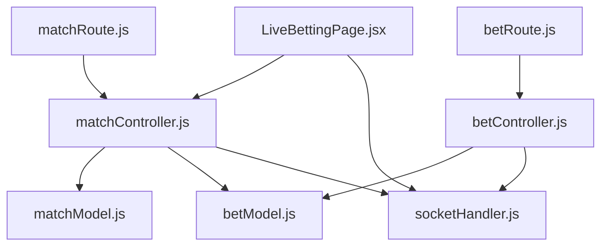

# Match Lifecycle Management

<cite>
**Referenced Files in This Document**
- [CreateMatchDialog.jsx](file://client/src/components/Admin/CreateMatchDialog.jsx)
- [matchController.js](file://server/controllers/admin/matchController.js)
- [matchModel.js](file://server/models/matchModel.js)
- [matchRoute.js](file://server/routes/admin/matchRoute.js)
- [LiveBettingPage.jsx](file://client/src/Pages/Bet/LiveBettingPage.jsx)
- [LiveBettingInterface.jsx](file://client/src/components/Bet/LiveBettingInterface.jsx)
- [socketHandler.js](file://server/socket/socketHandler.js)
- [betController.js](file://server/controllers/bet/betController.js)
- [betModel.js](file://server/models/betModel.js)
- [index.js](file://client/src/store/user/match-and-bet-slice/index.js)
- [ManageEvents.jsx](file://client/src/Pages/adminPage/ManageEvents.jsx)
</cite>

## Table of Contents
1. [Introduction](#introduction)
2. [Project Structure](#project-structure)
3. [Core Components](#core-components)
4. [Architecture Overview](#architecture-overview)
5. [Detailed Component Analysis](#detailed-component-analysis)
6. [Dependency Analysis](#dependency-analysis)
7. [Performance Considerations](#performance-considerations)
8. [Troubleshooting Guide](#troubleshooting-guide)
9. [Conclusion](#conclusion)

## Introduction
This document provides comprehensive match lifecycle management documentation for a real-time betting platform. It covers match creation workflows, status transitions (Upcoming → Active → Closed → Completed), automated triggers, match editing and real-time updates, settlement processes, winner determination, result broadcasting, analytics and betting statistics, and the relationship between match lifecycle and betting operations.

## Project Structure
The system is organized around a React frontend and an Express/Node.js backend with MongoDB for persistence and Socket.IO for real-time communication. Key areas:
- Admin match management: creation, status updates, settlement
- User live betting: real-time odds, live feed, bet placement
- Real-time updates: socket rooms for matches, events, and admin notifications
- Analytics: platform-level statistics aggregation

**Diagram sources**
- [CreateMatchDialog.jsx](file://client/src/components/Admin/CreateMatchDialog.jsx#L1-L122)
- [ManageEvents.jsx](file://client/src/Pages/adminPage/ManageEvents.jsx#L804-L1082)
- [LiveBettingPage.jsx](file://client/src/Pages/Bet/LiveBettingPage.jsx#L1-L943)
- [LiveBettingInterface.jsx](file://client/src/components/Bet/LiveBettingInterface.jsx#L1-L439)
- [matchController.js](file://server/controllers/admin/matchController.js#L1-L1188)
- [betController.js](file://server/controllers/bet/betController.js#L1-L125)
- [socketHandler.js](file://server/socket/socketHandler.js#L1-L101)
- [matchModel.js](file://server/models/matchModel.js#L1-L101)
- [betModel.js](file://server/models/betModel.js#L1-L24)
- [matchRoute.js](file://server/routes/admin/matchRoute.js#L1-L38)

**Section sources**
- [matchRoute.js](file://server/routes/admin/matchRoute.js#L1-L38)
- [matchController.js](file://server/controllers/admin/matchController.js#L1-L1188)
- [socketHandler.js](file://server/socket/socketHandler.js#L1-L101)

## Core Components
- Match creation and configuration: Admin creates matches under a top-level event with validation and real-time broadcasting.
- Status transitions: Controlled by admin actions with strict validation and automated socket emissions.
- Settlement engine: Automated matching of bets, refunding unmatched amounts, and distributing winnings with commission logic.
- Real-time updates: Socket rooms for match, event, and admin notifications; live bet feeds and status notifications.
- Betting operations: Place bets, fetch live bets, and manage bet states.
- Analytics: Platform-level statistics including total bets, bet amounts, and commission calculations.

**Section sources**
- [matchController.js](file://server/controllers/admin/matchController.js#L282-L364)
- [matchController.js](file://server/controllers/admin/matchController.js#L513-L901)
- [matchController.js](file://server/controllers/admin/matchController.js#L902-L1165)
- [betController.js](file://server/controllers/bet/betController.js#L43-L106)
- [LiveBettingPage.jsx](file://client/src/Pages/Bet/LiveBettingPage.jsx#L208-L408)
- [LiveBettingInterface.jsx](file://client/src/components/Bet/LiveBettingInterface.jsx#L110-L169)

## Architecture Overview
The system uses a layered architecture:
- Presentation layer: React components for admin and user interfaces
- Application layer: Controllers for match and bet operations
- Domain layer: Models for matches, bets, and top-level events
- Infrastructure layer: Socket.IO for real-time updates and Express routes

**Diagram sources**
- [matchRoute.js](file://server/routes/admin/matchRoute.js#L28-L34)
- [matchController.js](file://server/controllers/admin/matchController.js#L282-L364)
- [matchModel.js](file://server/models/matchModel.js#L17-L92)
- [socketHandler.js](file://server/socket/socketHandler.js#L1-L101)

## Detailed Component Analysis

### Match Creation Workflow
- Admin selects a top-level event and opens the CreateMatchDialog.
- The dialog validates the presence of a top-level match selection and delegates creation to the controller.
- The controller validates required fields, prevents duplicate active matches per section, and persists the match.
- On success, the controller emits a "match-created" event to match, event, admin, and global rooms.

**Diagram sources**
- [CreateMatchDialog.jsx](file://client/src/components/Admin/CreateMatchDialog.jsx#L23-L58)
- [matchRoute.js](file://server/routes/admin/matchRoute.js#L28-L34)
- [matchController.js](file://server/controllers/admin/matchController.js#L282-L364)
- [socketHandler.js](file://server/socket/socketHandler.js#L8-L40)

**Section sources**
- [CreateMatchDialog.jsx](file://client/src/components/Admin/CreateMatchDialog.jsx#L23-L58)
- [matchController.js](file://server/controllers/admin/matchController.js#L282-L364)

### Match Status Transitions and Automated Triggers
- Valid transitions: Upcoming → Active → Closed → Completed.
- The updateMatchStatus endpoint enforces:
  - No direct setting to Completed (use settleMatch instead)
  - Validates status values
  - On Closed: performs automated bet matching, refunding unmatched amounts, and prepares settlement data
  - Emits "status-changed" with detailed messages and matching results
- Settlement:
  - settleMatch requires Closed status and a valid winner (Red, Green, Tie, Cancelled)
  - Uses stored closeResults to avoid re-matching
  - Distributes winnings with commission for Straight bets and special rules for Lay90/Call90
  - Updates match status and emits "match-settled" with totals and winner

**Diagram sources**
- [matchController.js](file://server/controllers/admin/matchController.js#L513-L901)
- [matchController.js](file://server/controllers/admin/matchController.js#L902-L1165)

**Section sources**
- [matchController.js](file://server/controllers/admin/matchController.js#L513-L901)
- [matchController.js](file://server/controllers/admin/matchController.js#L902-L1165)

### Real-Time Updates and Broadcasting
- Socket rooms:
  - Match room: "match-{matchId}"
  - Event room: "event-{eventId}"
  - Admin room: "admin-room"
  - Global: io.emit for cross-component updates
- Live betting:
  - Users join match and event rooms upon navigation
  - New bets emit to match room and admin
  - Status changes and settlements broadcast to relevant rooms
  - UI listens for "match-update", "event-update", "new-bet", "bet-history-update", "bet-close-update"

**Diagram sources**
- [socketHandler.js](file://server/socket/socketHandler.js#L6-L88)
- [betController.js](file://server/controllers/bet/betController.js#L79-L96)
- [matchController.js](file://server/controllers/admin/matchController.js#L8-L40)

**Section sources**
- [socketHandler.js](file://server/socket/socketHandler.js#L6-L88)
- [LiveBettingPage.jsx](file://client/src/Pages/Bet/LiveBettingPage.jsx#L208-L408)
- [LiveBettingInterface.jsx](file://client/src/components/Bet/LiveBettingInterface.jsx#L110-L169)

### Betting Operations During Lifecycle
- Place bets:
  - Validates user balance, match status (Active), and bet amount
  - Deducts stake from user balance and creates bet record
  - Emits "new-bet" to match room and admin
- Live bet feed:
  - Fetches historical bets and subscribes to new bets via socket
  - Maintains live stats (totals, percentages) and recent bets display
- Bet history and close updates:
  - Listens for "bet-history-update" and "bet-close-update"
  - Persists user bet history and close updates locally

**Diagram sources**
- [betController.js](file://server/controllers/bet/betController.js#L43-L106)
- [betModel.js](file://server/models/betModel.js#L3-L24)
- [LiveBettingInterface.jsx](file://client/src/components/Bet/LiveBettingInterface.jsx#L110-L169)

**Section sources**
- [betController.js](file://server/controllers/bet/betController.js#L43-L106)
- [LiveBettingInterface.jsx](file://client/src/components/Bet/LiveBettingInterface.jsx#L75-L169)
- [index.js](file://client/src/store/user/match-and-bet-slice/index.js#L95-L127)

### Settlement Engine and Winner Determination
- Pre-requisites:
  - Match must be Closed
  - Winner must be one of the defined options
- Automated matching and refunding occur during Close
- Settlement logic:
  - Straight bets: apply commission on winnings, distribute matched amounts
  - Lay90/Call90: compute risk and payouts based on winning side
  - Tie/Cancelled: refund matched amounts to users
- Updates:
  - Match status updated to Completed/Tie/Cancelled
  - Bet records updated with status, winnings, losers, and actual amounts
  - Broadcasting settlement results and bet histories

**Diagram sources**
- [matchController.js](file://server/controllers/admin/matchController.js#L902-L1165)

**Section sources**
- [matchController.js](file://server/controllers/admin/matchController.js#L902-L1165)

### Analytics, Betting Statistics, and Performance Monitoring
- Live betting statistics:
  - Real-time calculation of total bets and amounts per side
  - Percentage distribution and unique bettor counts
- Platform-level analytics:
  - Aggregation pipeline computes total bets, bet amounts, and commission per event and match
  - Overall platform statistics including total commission earned
- Performance considerations:
  - Efficient indexing on matchId, status, createdAt for bet queries
  - Socket room-based broadcasting minimizes unnecessary updates

**Diagram sources**
- [LiveBettingInterface.jsx](file://client/src/components/Bet/LiveBettingInterface.jsx#L50-L73)
- [adminController.js](file://server/controllers/admin/adminController.js#L215-L307)
- [matchModel.js](file://server/models/matchModel.js#L17-L92)
- [betModel.js](file://server/models/betModel.js#L3-L24)

**Section sources**
- [LiveBettingInterface.jsx](file://client/src/components/Bet/LiveBettingInterface.jsx#L50-L73)
- [adminController.js](file://server/controllers/admin/adminController.js#L215-L307)

### Relationship Between Match Lifecycle and Betting Operations
- Status affects bet placement:
  - Active: Accept new bets
  - Closed: Stop accepting bets; initiate automated matching and refunding
  - Completed/Tie/Cancelled: Settlement finalized; no further betting
- Real-time feedback:
  - Users receive notifications for status changes and settlement outcomes
  - Bet history and close updates reflect settlement results
- Administrative controls:
  - Admin can set status and settle matches
  - ManageEvents UI provides winner selection dropdowns for settlement

**Diagram sources**
- [matchController.js](file://server/controllers/admin/matchController.js#L513-L901)
- [matchController.js](file://server/controllers/admin/matchController.js#L902-L1165)
- [ManageEvents.jsx](file://client/src/Pages/adminPage/ManageEvents.jsx#L804-L1082)

**Section sources**
- [matchController.js](file://server/controllers/admin/matchController.js#L513-L901)
- [ManageEvents.jsx](file://client/src/Pages/adminPage/ManageEvents.jsx#L804-L1082)

## Dependency Analysis
- Controllers depend on models for persistence and on socketHandler for real-time updates.
- Routes define the API surface for match and bet operations.
- Frontend slices encapsulate async thunks for data fetching and bet placement.
- Socket rooms decouple components and enable scalable broadcasting.

**Diagram sources**
- [matchRoute.js](file://server/routes/admin/matchRoute.js#L1-L38)
- [matchController.js](file://server/controllers/admin/matchController.js#L1-L1188)
- [matchModel.js](file://server/models/matchModel.js#L1-L101)
- [betModel.js](file://server/models/betModel.js#L1-L24)
- [socketHandler.js](file://server/socket/socketHandler.js#L1-L101)
- [LiveBettingPage.jsx](file://client/src/Pages/Bet/LiveBettingPage.jsx#L1-L943)
- [betController.js](file://server/controllers/bet/betController.js#L1-L125)

**Section sources**
- [matchRoute.js](file://server/routes/admin/matchRoute.js#L1-L38)
- [matchController.js](file://server/controllers/admin/matchController.js#L1-L1188)
- [betController.js](file://server/controllers/bet/betController.js#L1-L125)

## Performance Considerations
- Indexing:
  - Match: {status: 1, createdAt: -1}, {topLevelMatch: 1, section: 1, round: 1}
  - Bet: {matchId: 1, status: 1}, {createdAt: -1}
- Socket efficiency:
  - Room-based broadcasting reduces payload size and improves scalability
- Data consistency:
  - Stored closeResults prevent redundant matching computations during settlement
- Frontend caching:
  - Local storage for user bet history and close updates reduces server load

## Troubleshooting Guide
- Common errors and resolutions:
  - Invalid match ID: Verify ObjectId format and existence
  - Insufficient balance: Ensure user has sufficient funds before placing bets
  - Betting outside Active status: Confirm match status is Active
  - Settlement preconditions: Ensure match is Closed and winner is valid
  - Socket not initialized: Check server initialization and room joining logic
- Logging and diagnostics:
  - Server logs indicate socket events and error conditions
  - Frontend toast notifications provide immediate feedback for user actions

**Section sources**
- [matchController.js](file://server/controllers/admin/matchController.js#L486-L510)
- [betController.js](file://server/controllers/bet/betController.js#L43-L106)
- [LiveBettingPage.jsx](file://client/src/Pages/Bet/LiveBettingPage.jsx#L420-L517)
- [socketHandler.js](file://server/socket/socketHandler.js#L84-L87)

## Conclusion
The match lifecycle management system integrates robust validation, automated bet matching, precise settlement logic, and real-time broadcasting to deliver a seamless betting experience. Admin controls enforce lifecycle integrity, while users benefit from live updates, accurate statistics, and transparent settlement outcomes. The modular architecture supports scalability and maintainability across match creation, status transitions, and settlement processes.