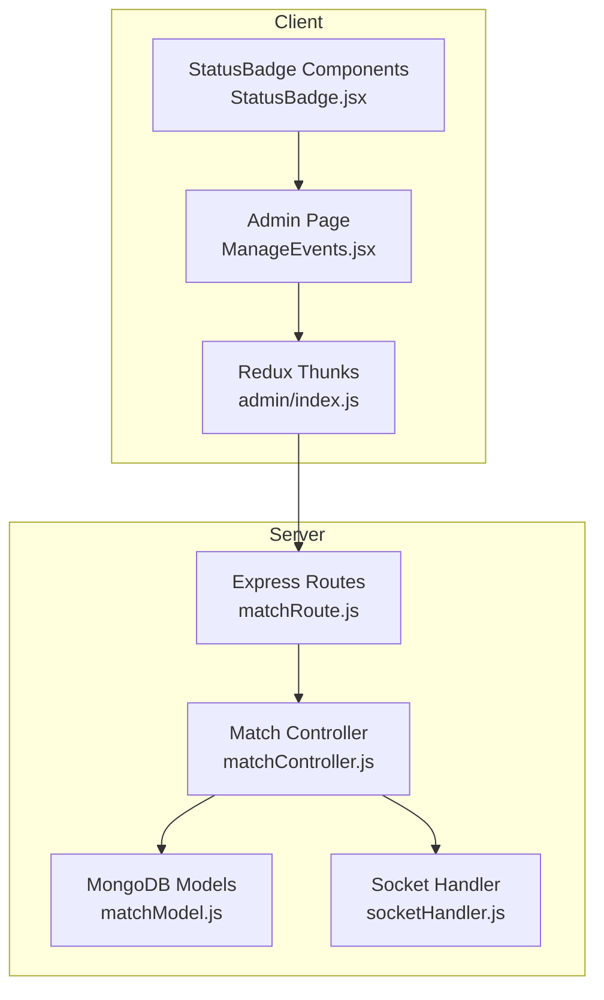
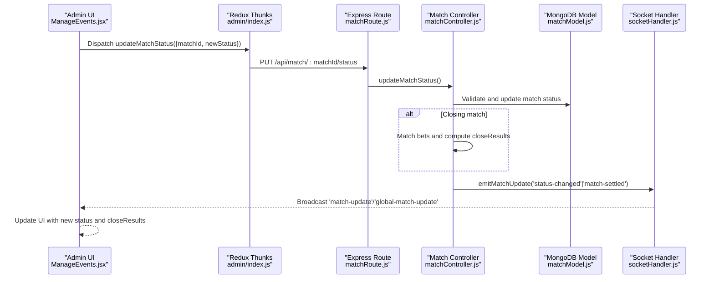
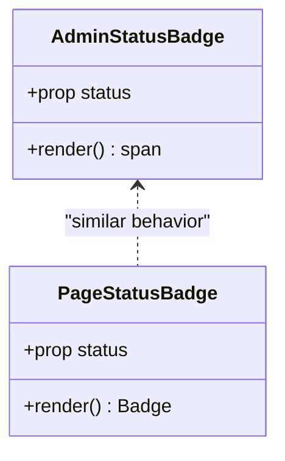
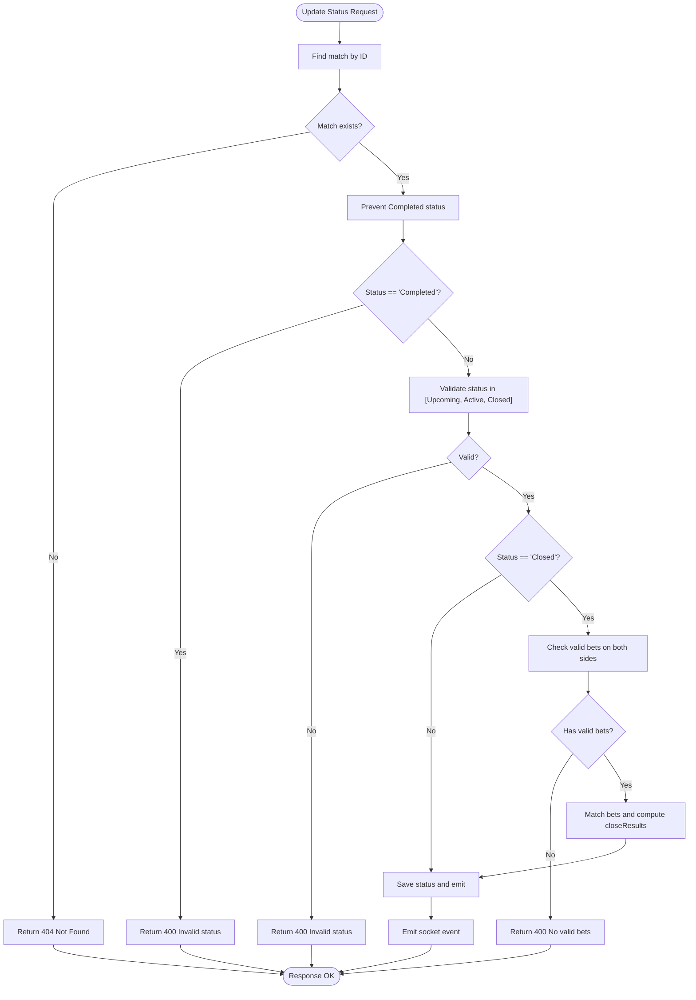
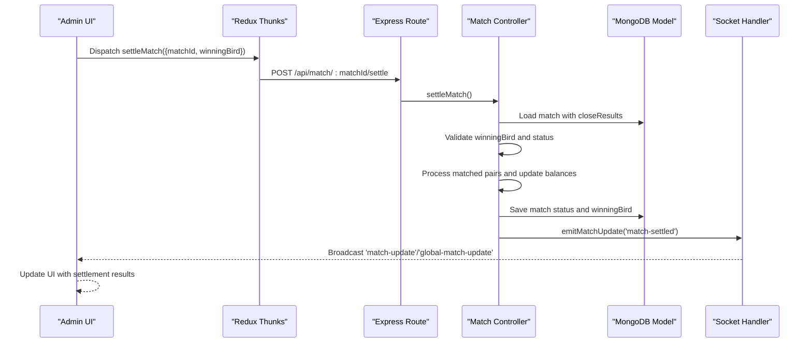
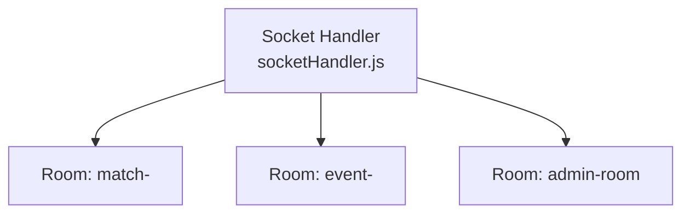
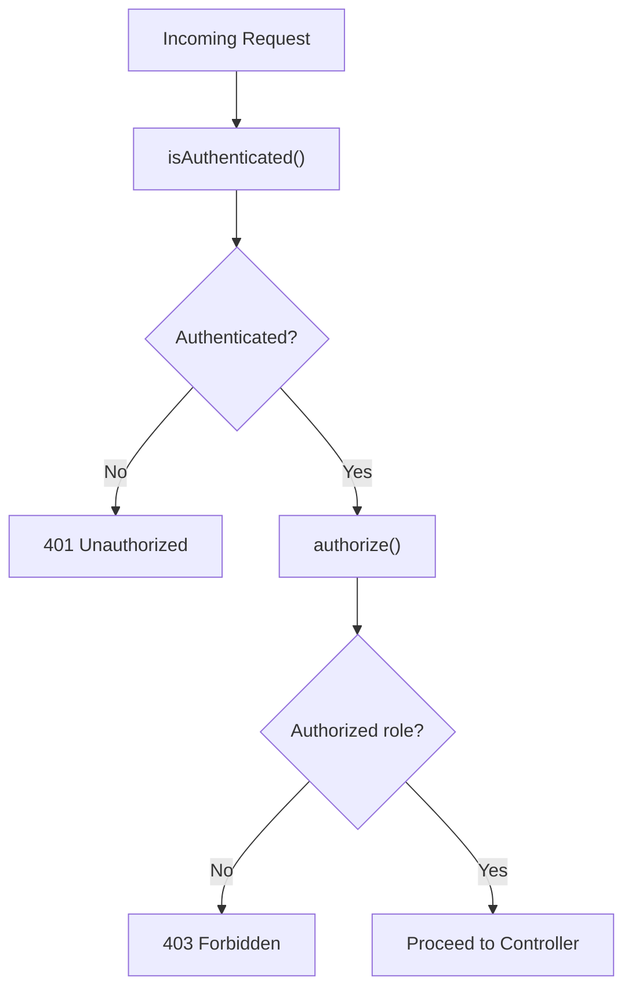
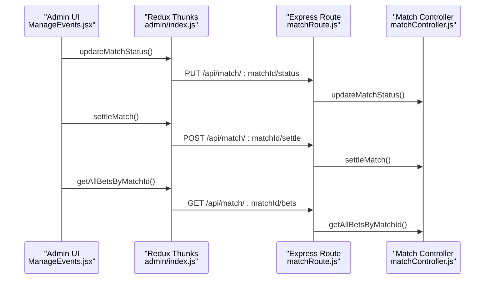
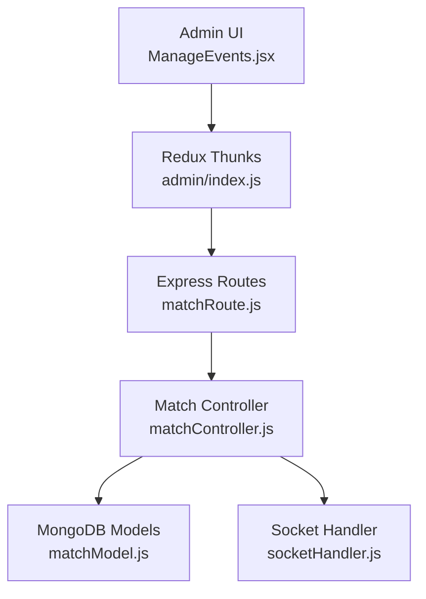

# Match Status Controls

<cite>
**Referenced Files in This Document**
- [StatusBadge.jsx](file://client/src/Pages/adminPage/StatusBadge.jsx)
- [StatusBadge.jsx](file://client/src/components/Admin/StatusBadge.jsx)
- [matchController.js](file://server/controllers/admin/matchController.js)
- [matchModel.js](file://server/models/matchModel.js)
- [matchRoute.js](file://server/routes/admin/matchRoute.js)
- [socketHandler.js](file://server/socket/socketHandler.js)
- [index.js](file://client/src/store/admin/index.js)
- [ManageEvents.jsx](file://client/src/Pages/adminPage/ManageEvents.jsx)
- [isAuthenticated.js](file://server/middleware/isAuthenticated.js)
- [adminController.js](file://server/controllers/admin/adminController.js)
</cite>

## Table of Contents
1. [Introduction](#introduction)
2. [Project Structure](#project-structure)
3. [Core Components](#core-components)
4. [Architecture Overview](#architecture-overview)
5. [Detailed Component Analysis](#detailed-component-analysis)
6. [Dependency Analysis](#dependency-analysis)
7. [Performance Considerations](#performance-considerations)
8. [Troubleshooting Guide](#troubleshooting-guide)
9. [Conclusion](#conclusion)

## Introduction
This document explains the match status control mechanisms in the betting platform. It covers the status badge system, visual indicators for match states (Upcoming, Active, Closed, Completed, Cancelled, Tie), status change workflows (opening bets, closing bets, and match completion), real-time updates via sockets, validation rules, permission controls, and administrative capabilities for monitoring match progression and betting activity.

## Project Structure
The status control system spans both frontend and backend components:
- Frontend: StatusBadge components for rendering match status visually, Redux thunks for API interactions, and UI pages orchestrating admin actions.
- Backend: Match controller managing status transitions and settlement, MongoDB models defining status enums and close results, Express routes exposing admin endpoints, and Socket.IO handlers broadcasting real-time updates.

**Diagram sources**
- [ManageEvents.jsx](file://client/src/Pages/adminPage/ManageEvents.jsx#L295-L313)
- [index.js](file://client/src/store/admin/index.js#L191-L205)
- [matchRoute.js](file://server/routes/admin/matchRoute.js#L1-L38)
- [matchController.js](file://server/controllers/admin/matchController.js#L513-L901)
- [matchModel.js](file://server/models/matchModel.js#L1-L101)
- [socketHandler.js](file://server/socket/socketHandler.js#L1-L101)

**Section sources**
- [matchRoute.js](file://server/routes/admin/matchRoute.js#L1-L38)
- [matchController.js](file://server/controllers/admin/matchController.js#L513-L901)
- [matchModel.js](file://server/models/matchModel.js#L1-L101)
- [socketHandler.js](file://server/socket/socketHandler.js#L1-L101)
- [index.js](file://client/src/store/admin/index.js#L191-L205)
- [ManageEvents.jsx](file://client/src/Pages/adminPage/ManageEvents.jsx#L295-L313)

## Core Components
- StatusBadge components render visual status indicators on the admin interface.
- Match controller enforces status validation, performs betting matching during closure, and handles settlement.
- Socket handler broadcasts real-time updates to clients.
- Redux thunks orchestrate admin actions and keep the UI synchronized.

Key responsibilities:
- Status rendering: Two StatusBadge variants exist—one using a UI badge component and another using inline styles.
- Status transitions: Controlled via updateMatchStatus endpoint with strict validation rules.
- Settlement: Separate settleMatch endpoint processes matched bets and updates balances.
- Real-time updates: Socket events notify clients of status changes, bet placements, and settlement outcomes.

**Section sources**
- [StatusBadge.jsx](file://client/src/Pages/adminPage/StatusBadge.jsx#L1-L43)
- [StatusBadge.jsx](file://client/src/components/Admin/StatusBadge.jsx#L1-L15)
- [matchController.js](file://server/controllers/admin/matchController.js#L513-L901)
- [socketHandler.js](file://server/socket/socketHandler.js#L1-L101)
- [index.js](file://client/src/store/admin/index.js#L191-L205)

## Architecture Overview
The status control architecture integrates REST APIs, database models, and WebSocket broadcasting to provide a real-time, auditable system for match lifecycle management.

**Diagram sources**
- [ManageEvents.jsx](file://client/src/Pages/adminPage/ManageEvents.jsx#L295-L313)
- [index.js](file://client/src/store/admin/index.js#L191-L205)
- [matchRoute.js](file://server/routes/admin/matchRoute.js#L30-L31)
- [matchController.js](file://server/controllers/admin/matchController.js#L513-L901)
- [socketHandler.js](file://server/socket/socketHandler.js#L1-L101)

## Detailed Component Analysis

### StatusBadge Components
Two StatusBadge components provide consistent visual indicators for match status across the admin interface.

- Admin StatusBadge (inline styles): Renders a compact badge with color-coded background and text based on status.
- Page StatusBadge (UI badge): Uses a UI badge component with hover effects and text labels.

**Diagram sources**
- [StatusBadge.jsx](file://client/src/components/Admin/StatusBadge.jsx#L1-L15)
- [StatusBadge.jsx](file://client/src/Pages/adminPage/StatusBadge.jsx#L1-L43)

**Section sources**
- [StatusBadge.jsx](file://client/src/components/Admin/StatusBadge.jsx#L1-L15)
- [StatusBadge.jsx](file://client/src/Pages/adminPage/StatusBadge.jsx#L1-L43)

### Match Status Validation and Transition Rules
The updateMatchStatus endpoint enforces strict validation and prevents invalid transitions.

Validation rules:
- Prevent direct setting to Completed; use settleMatch instead.
- Allow only Upcoming, Active, Closed.
- During Close: validate that there are valid bets on both sides (Straight) or both sides (Lay90/Call90).

**Diagram sources**
- [matchController.js](file://server/controllers/admin/matchController.js#L513-L901)

**Section sources**
- [matchController.js](file://server/controllers/admin/matchController.js#L513-L901)

### Settlement Workflow and Close Results
The settleMatch endpoint finalizes betting activity after a match is closed.

Key steps:
- Validate match exists and is Closed.
- Validate winningBird is one of the allowed values.
- Use stored closeResults to avoid re-matching.
- Process matched pairs (Straight and Lay90/Call90) with commission calculations.
- Update user balances and bet statuses.
- Update match status to Completed, Cancelled, or Tie.
- Broadcast settlement outcome to clients.

**Diagram sources**
- [index.js](file://client/src/store/admin/index.js#L174-L189)
- [matchRoute.js](file://server/routes/admin/matchRoute.js#L31-L31)
- [matchController.js](file://server/controllers/admin/matchController.js#L902-L1165)
- [socketHandler.js](file://server/socket/socketHandler.js#L1-L101)

**Section sources**
- [matchController.js](file://server/controllers/admin/matchController.js#L902-L1165)

### Real-Time Updates and Broadcast Mechanisms
The socket handler manages rooms and emits events for real-time synchronization.

Rooms and events:
- Match room: match-<matchId>
- Event room: event-<eventId>
- Admin room: admin-room
- Global events: global-match-update, global-event-created, global-event-updated

Broadcasts:
- match-update: emitted on status changes and settlement
- admin-notification: emitted for admin room
- bet history updates: emitted to user-specific rooms

**Diagram sources**
- [socketHandler.js](file://server/socket/socketHandler.js#L1-L101)
- [matchController.js](file://server/controllers/admin/matchController.js#L8-L40)

**Section sources**
- [socketHandler.js](file://server/socket/socketHandler.js#L1-L101)
- [matchController.js](file://server/controllers/admin/matchController.js#L8-L40)

### Permission Controls and Authentication
Access to match status controls is protected by authentication and authorization middleware.

- isAuthenticated: Verifies JWT and ensures session validity.
- authorize: Restricts routes to specific roles (admin/superadmin).
- Admin-only endpoints: match status updates, settlement, and related operations are guarded by middleware.

**Diagram sources**
- [isAuthenticated.js](file://server/middleware/isAuthenticated.js#L1-L62)
- [adminController.js](file://server/controllers/admin/adminController.js#L1-L120)

**Section sources**
- [isAuthenticated.js](file://server/middleware/isAuthenticated.js#L1-L62)
- [adminController.js](file://server/controllers/admin/adminController.js#L1-L120)

### Administrative Actions and Monitoring
Administrators can manage matches and monitor progress through the admin interface.

- Update status: Open/close matches with validation.
- Settle matches: Declare winners and finalize betting outcomes.
- View bets: Fetch all bets for a match to review activity.
- Event management: Complete top-level events after sub-matches finish.

**Diagram sources**
- [ManageEvents.jsx](file://client/src/Pages/adminPage/ManageEvents.jsx#L295-L313)
- [index.js](file://client/src/store/admin/index.js#L174-L205)
- [matchRoute.js](file://server/routes/admin/matchRoute.js#L30-L34)
- [matchController.js](file://server/controllers/admin/matchController.js#L513-L1188)

**Section sources**
- [ManageEvents.jsx](file://client/src/Pages/adminPage/ManageEvents.jsx#L295-L313)
- [index.js](file://client/src/store/admin/index.js#L174-L205)
- [matchRoute.js](file://server/routes/admin/matchRoute.js#L30-L34)
- [matchController.js](file://server/controllers/admin/matchController.js#L513-L1188)

## Dependency Analysis
The status control system exhibits clear separation of concerns with minimal coupling between layers.

**Diagram sources**
- [ManageEvents.jsx](file://client/src/Pages/adminPage/ManageEvents.jsx#L295-L313)
- [index.js](file://client/src/store/admin/index.js#L191-L205)
- [matchRoute.js](file://server/routes/admin/matchRoute.js#L1-L38)
- [matchController.js](file://server/controllers/admin/matchController.js#L513-L901)
- [matchModel.js](file://server/models/matchModel.js#L1-L101)
- [socketHandler.js](file://server/socket/socketHandler.js#L1-L101)

**Section sources**
- [matchController.js](file://server/controllers/admin/matchController.js#L513-L901)
- [matchModel.js](file://server/models/matchModel.js#L1-L101)
- [socketHandler.js](file://server/socket/socketHandler.js#L1-L101)

## Performance Considerations
- Betting matching during close uses FIFO queues per bet type and side, minimizing repeated database scans.
- Stored closeResults eliminate re-matching on settlement, reducing computational overhead.
- Socket broadcasting targets specific rooms to reduce unnecessary network traffic.
- Indexes on match status and timestamps improve query performance for filtering and sorting.

## Troubleshooting Guide
Common issues and resolutions:
- Cannot set status to Completed: Use the settleMatch endpoint instead.
- Cannot close match: Ensure valid bets exist on both sides (Straight or Lay90/Call90).
- Settlement fails: Verify match is Closed and winningBird is valid.
- Real-time updates not received: Confirm client joined match/event/admin rooms and socket connection is active.
- Authentication failures: Check JWT validity and session token status.

**Section sources**
- [matchController.js](file://server/controllers/admin/matchController.js#L527-L542)
- [matchController.js](file://server/controllers/admin/matchController.js#L926-L939)
- [socketHandler.js](file://server/socket/socketHandler.js#L6-L88)

## Conclusion
The match status control system provides a robust, validated, and real-time framework for managing betting lifecycle events. Through strict validation, comprehensive betting matching, and targeted socket broadcasts, administrators can confidently oversee match progression and settlement while maintaining transparency and auditability.