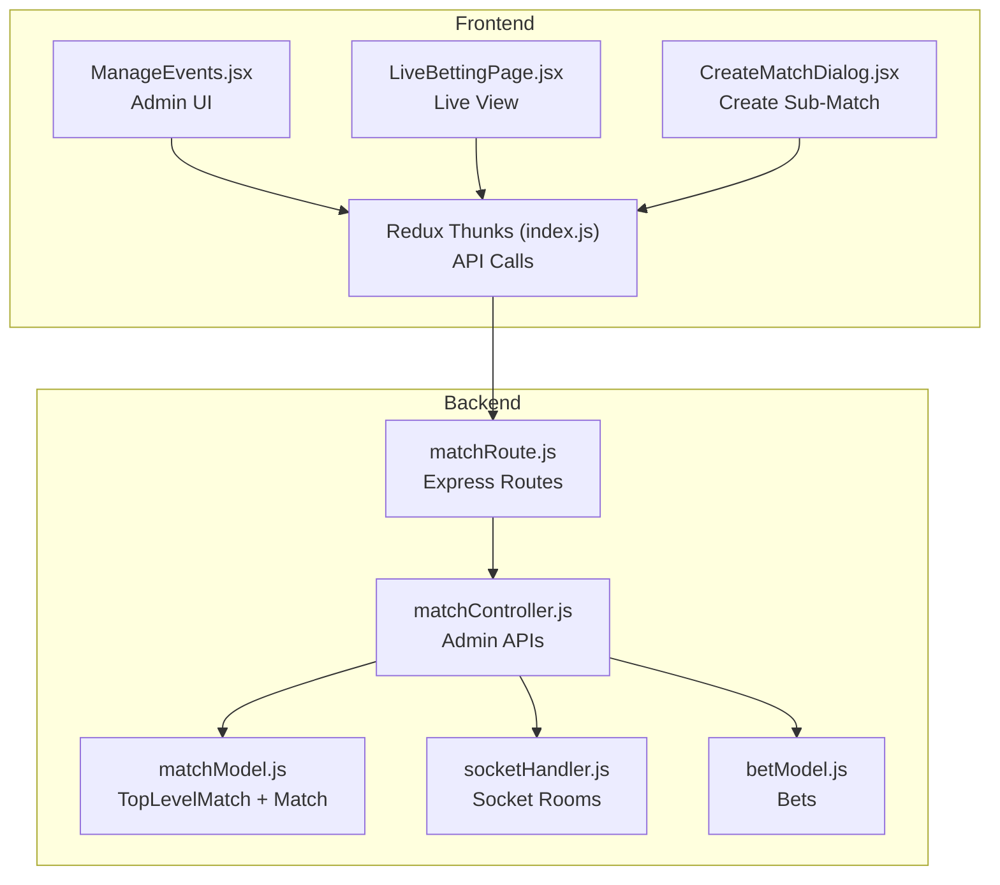
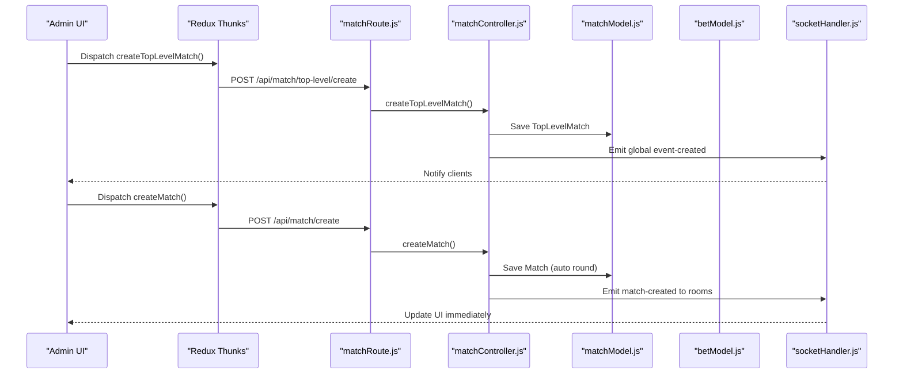
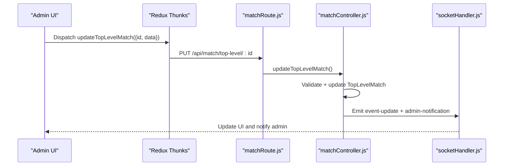
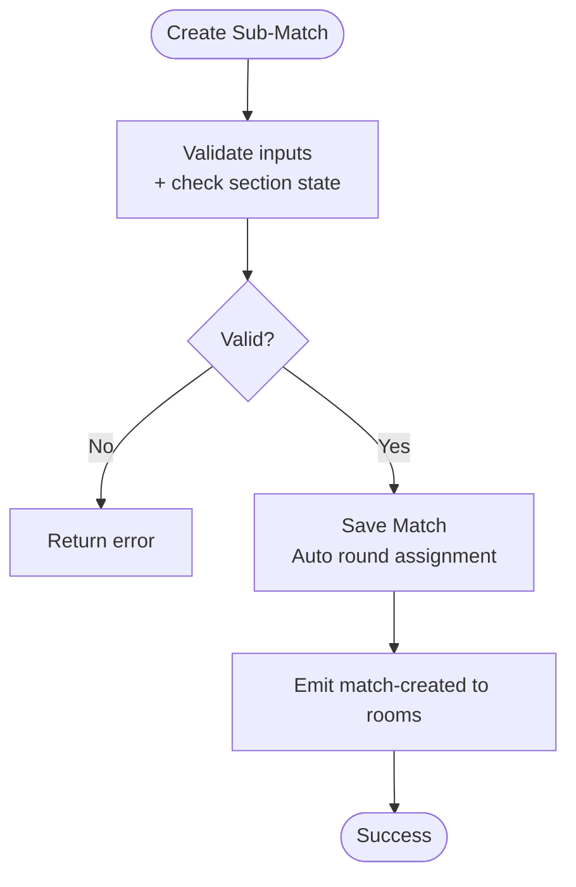
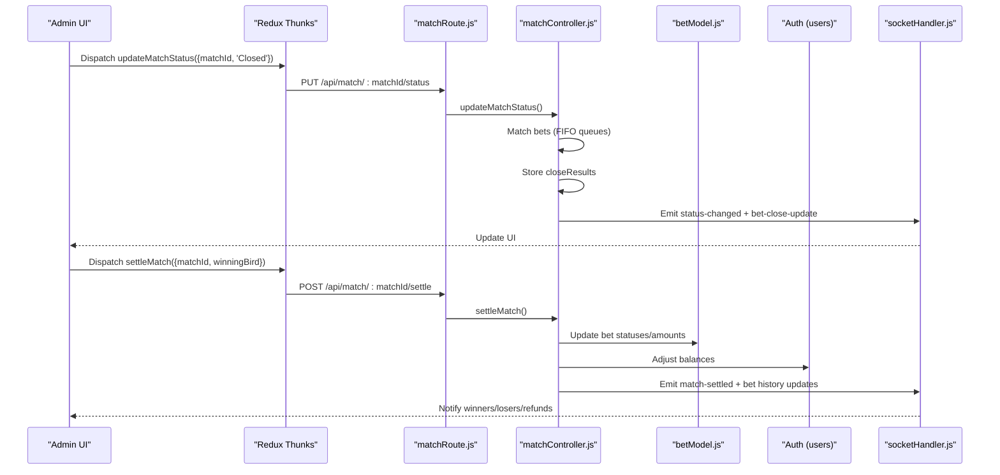
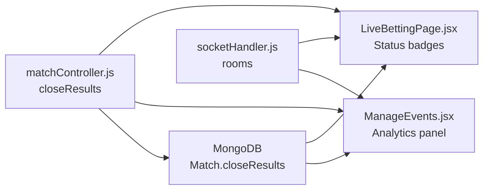
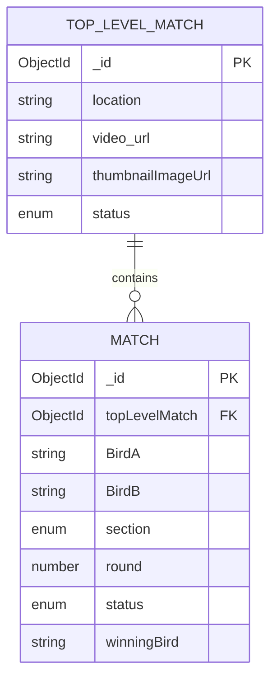
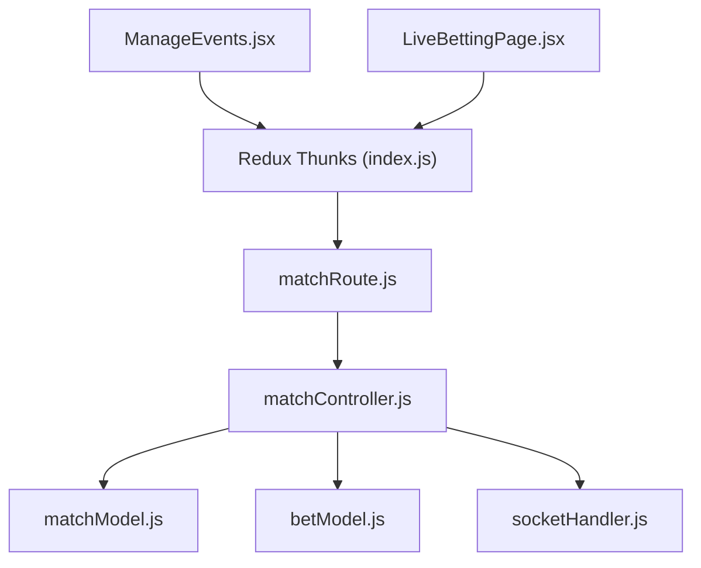

# Tournament Structure

<cite>
**Referenced Files in This Document**
- [matchModel.js](file://server/models/matchModel.js)
- [matchController.js](file://server/controllers/admin/matchController.js)
- [matchRoute.js](file://server/routes/admin/matchRoute.js)
- [socketHandler.js](file://server/socket/socketHandler.js)
- [betModel.js](file://server/models/betModel.js)
- [ManageEvents.jsx](file://client/src/Pages/adminPage/ManageEvents.jsx)
- [LiveBettingPage.jsx](file://client/src/Pages/Bet/LiveBettingPage.jsx)
- [CreateMatchDialog.jsx](file://client/src/components/Admin/CreateMatchDialog.jsx)
- [index.js](file://client/src/store/admin/index.js)
</cite>

## Table of Contents
1. [Introduction](#introduction)
2. [Project Structure](#project-structure)
3. [Core Components](#core-components)
4. [Architecture Overview](#architecture-overview)
5. [Detailed Component Analysis](#detailed-component-analysis)
6. [Dependency Analysis](#dependency-analysis)
7. [Performance Considerations](#performance-considerations)
8. [Troubleshooting Guide](#troubleshooting-guide)
9. [Conclusion](#conclusion)

## Introduction
This document explains the tournament structure management system that organizes top-level competitions (events) into section-based sub-matches. It covers how tournaments are created, configured, grouped by sections, and progressed through status changes and settlement. It also documents analytics and progress monitoring capabilities, and clarifies the relationship between top-level tournaments and individual matches.

## Project Structure
The tournament system spans backend models and controllers, frontend admin pages, and real-time socket notifications:

- Backend
  - Models define tournament hierarchy and match rounds
  - Controllers implement creation, status updates, settlement, and analytics
  - Routes expose admin APIs for managing tournaments and sub-matches
  - Socket handler manages real-time updates across rooms
- Frontend
  - Admin pages render tournaments and sub-matches, enable actions, and display analytics
  - Redux thunks orchestrate API calls and state updates
  - Real-time updates are received via sockets for immediate UI refresh

**Diagram sources**
- [matchModel.js](file://server/models/matchModel.js#L3-L99)
- [matchController.js](file://server/controllers/admin/matchController.js#L67-L1188)
- [matchRoute.js](file://server/routes/admin/matchRoute.js#L1-L38)
- [socketHandler.js](file://server/socket/socketHandler.js#L1-L101)
- [betModel.js](file://server/models/betModel.js#L1-L24)
- [ManageEvents.jsx](file://client/src/Pages/adminPage/ManageEvents.jsx#L1-L1173)
- [LiveBettingPage.jsx](file://client/src/Pages/Bet/LiveBettingPage.jsx#L1-L629)
- [CreateMatchDialog.jsx](file://client/src/components/Admin/CreateMatchDialog.jsx#L1-L121)
- [index.js](file://client/src/store/admin/index.js#L1-L334)

**Section sources**
- [matchModel.js](file://server/models/matchModel.js#L3-L99)
- [matchController.js](file://server/controllers/admin/matchController.js#L67-L1188)
- [matchRoute.js](file://server/routes/admin/matchRoute.js#L1-L38)
- [socketHandler.js](file://server/socket/socketHandler.js#L1-L101)
- [betModel.js](file://server/models/betModel.js#L1-L24)
- [ManageEvents.jsx](file://client/src/Pages/adminPage/ManageEvents.jsx#L1-L1173)
- [LiveBettingPage.jsx](file://client/src/Pages/Bet/LiveBettingPage.jsx#L1-L629)
- [CreateMatchDialog.jsx](file://client/src/components/Admin/CreateMatchDialog.jsx#L1-L121)
- [index.js](file://client/src/store/admin/index.js#L1-L334)

## Core Components
- Top-Level Match (tournament)
  - Represents a competition with metadata (location, media) and lifecycle status
  - Contains multiple sub-matches grouped by section
- Sub-Match (round)
  - A single contest between two birds within a section
  - Automatically assigns round numbers per section
  - Supports status transitions and settlement
- Betting and Analytics
  - Stores close results with matched pairs and user summaries
  - Tracks unmatched amounts and refunds during closure
  - Settlement distributes winnings or refunds based on winner

Key behaviors:
- Section-based grouping: Matches are tagged with sectionA or sectionB
- Round sequencing: Rounds increment automatically within each section
- Status lifecycle: Upcoming → Active → Closed → Completed/Tie/Cancelled
- Settlement workflow: Close bets → Refund unmatched → Distribute matched → Update match status

**Section sources**
- [matchModel.js](file://server/models/matchModel.js#L3-L99)
- [matchController.js](file://server/controllers/admin/matchController.js#L282-L364)
- [matchController.js](file://server/controllers/admin/matchController.js#L513-L901)
- [matchController.js](file://server/controllers/admin/matchController.js#L902-L1165)

## Architecture Overview
The system uses a layered architecture:
- Data layer: MongoDB models for tournaments and matches
- Business logic: Admin controllers manage creation, status, and settlement
- API layer: Express routes expose admin endpoints
- Real-time layer: Socket.IO broadcasts updates to rooms
- Presentation layer: Admin UI renders tournaments, sub-matches, and analytics

**Diagram sources**
- [matchRoute.js](file://server/routes/admin/matchRoute.js#L21-L34)
- [matchController.js](file://server/controllers/admin/matchController.js#L67-L110)
- [matchController.js](file://server/controllers/admin/matchController.js#L282-L364)
- [matchModel.js](file://server/models/matchModel.js#L3-L99)
- [socketHandler.js](file://server/socket/socketHandler.js#L1-L101)

## Detailed Component Analysis

### Tournament Creation and Configuration
- Create top-level tournament
  - Endpoint: POST /api/match/top-level/create
  - Fields: location, video_url, thumbnailImageUrl
  - Emits global notifications for live UI updates
- Update tournament metadata
  - Endpoint: PUT /api/match/top-level/:id
  - Emits event updates to rooms and admin notifications
- Mark tournament as completed
  - Endpoint: POST /api/match/top-level/:topLevelMatchId/complete
  - Validates completion prerequisites and emits completion events

**Diagram sources**
- [matchRoute.js](file://server/routes/admin/matchRoute.js#L23-L23)
- [matchController.js](file://server/controllers/admin/matchController.js#L112-L196)
- [socketHandler.js](file://server/socket/socketHandler.js#L1-L101)

**Section sources**
- [matchController.js](file://server/controllers/admin/matchController.js#L67-L110)
- [matchController.js](file://server/controllers/admin/matchController.js#L112-L196)
- [matchController.js](file://server/controllers/admin/matchController.js#L197-L254)
- [matchRoute.js](file://server/routes/admin/matchRoute.js#L21-L26)

### Sub-Match Creation and Grouping
- Create sub-match under a tournament
  - Endpoint: POST /api/match/create
  - Fields: BirdA, BirdB, topLevelMatchId, section
  - Enforces section isolation: only one active/upcoming/closed match per section at a time
  - Auto-assigns round number within the section
- Fetch sub-matches by tournament
  - Endpoint: GET /api/match/:topLevelMatchId/match-a-b
  - Returns matches filtered by status suitable for user-side display

**Diagram sources**
- [matchController.js](file://server/controllers/admin/matchController.js#L282-L364)
- [matchModel.js](file://server/models/matchModel.js#L77-L92)

**Section sources**
- [matchController.js](file://server/controllers/admin/matchController.js#L282-L364)
- [matchModel.js](file://server/models/matchModel.js#L77-L92)
- [matchRoute.js](file://server/routes/admin/matchRoute.js#L28-L34)

### Tournament Status Management and Completion Workflows
- Status transitions
  - Upcoming → Active: open bets
  - Active → Closed: close bets and compute matching results
  - Closed → Completed/Tie/Cancelled: settle and distribute/refund
- Settlement process
  - Uses stored close results to avoid re-matching
  - Refunds unmatched amounts to users
  - Distributes matched amounts with commission rules
  - Updates bet statuses and user balances
  - Emits settlement events to rooms and users

**Diagram sources**
- [matchRoute.js](file://server/routes/admin/matchRoute.js#L30-L31)
- [matchController.js](file://server/controllers/admin/matchController.js#L513-L901)
- [matchController.js](file://server/controllers/admin/matchController.js#L902-L1165)
- [betModel.js](file://server/models/betModel.js#L1-L24)
- [socketHandler.js](file://server/socket/socketHandler.js#L1-L101)

**Section sources**
- [matchController.js](file://server/controllers/admin/matchController.js#L513-L901)
- [matchController.js](file://server/controllers/admin/matchController.js#L902-L1165)

### Tournament Analytics, Participant Tracking, and Progress Monitoring
- Close results storage
  - Total bets, matched pairs, total amounts
  - Per-user summaries: bet breakdowns, matched/unmatched amounts
  - Matched pairs details for auditability
- Real-time progress
  - Socket rooms for match, event, admin, and user-specific updates
  - Global events for live UI refresh across components
- Frontend monitoring
  - Admin dashboard shows section tabs, match counts, and status badges
  - Live betting page displays section availability and stream info
  - Redux thunks coordinate API calls and state updates

**Diagram sources**
- [matchController.js](file://server/controllers/admin/matchController.js#L547-L812)
- [matchController.js](file://server/controllers/admin/matchController.js#L880-L882)
- [ManageEvents.jsx](file://client/src/Pages/adminPage/ManageEvents.jsx#L1-L1173)
- [LiveBettingPage.jsx](file://client/src/Pages/Bet/LiveBettingPage.jsx#L568-L629)
- [socketHandler.js](file://server/socket/socketHandler.js#L1-L101)

**Section sources**
- [matchController.js](file://server/controllers/admin/matchController.js#L547-L812)
- [matchController.js](file://server/controllers/admin/matchController.js#L880-L882)
- [ManageEvents.jsx](file://client/src/Pages/adminPage/ManageEvents.jsx#L1-L1173)
- [LiveBettingPage.jsx](file://client/src/Pages/Bet/LiveBettingPage.jsx#L568-L629)
- [socketHandler.js](file://server/socket/socketHandler.js#L1-L101)

### Relationship Between Tournaments and Matches
- One-to-many relationship
  - Top-level match contains multiple sub-matches
  - Sub-matches are sectioned and sequenced independently
- Section isolation
  - Only one active/upcoming/closed match per section at a time
- Round sequencing
  - Rounds increment per section automatically upon creation
- Status propagation
  - Parent tournament status can be marked as completed when all sub-matches are finalized

**Diagram sources**
- [matchModel.js](file://server/models/matchModel.js#L3-L99)

**Section sources**
- [matchModel.js](file://server/models/matchModel.js#L3-L99)
- [matchController.js](file://server/controllers/admin/matchController.js#L282-L364)

## Dependency Analysis
- Backend dependencies
  - matchController depends on matchModel, betModel, and socketHandler
  - matchRoute wires endpoints to controller methods
- Frontend dependencies
  - ManageEvents.jsx and LiveBettingPage.jsx consume Redux thunks
  - Redux thunks call server endpoints and update state
- Real-time dependencies
  - Socket rooms isolate match/event/admin contexts
  - Global events keep UI synchronized without polling

**Diagram sources**
- [matchRoute.js](file://server/routes/admin/matchRoute.js#L1-L38)
- [matchController.js](file://server/controllers/admin/matchController.js#L1-L40)
- [matchModel.js](file://server/models/matchModel.js#L1-L101)
- [betModel.js](file://server/models/betModel.js#L1-L24)
- [socketHandler.js](file://server/socket/socketHandler.js#L1-L101)
- [ManageEvents.jsx](file://client/src/Pages/adminPage/ManageEvents.jsx#L1-L1173)
- [LiveBettingPage.jsx](file://client/src/Pages/Bet/LiveBettingPage.jsx#L1-L629)
- [index.js](file://client/src/store/admin/index.js#L1-L334)

**Section sources**
- [matchRoute.js](file://server/routes/admin/matchRoute.js#L1-L38)
- [matchController.js](file://server/controllers/admin/matchController.js#L1-L40)
- [matchModel.js](file://server/models/matchModel.js#L1-L101)
- [betModel.js](file://server/models/betModel.js#L1-L24)
- [socketHandler.js](file://server/socket/socketHandler.js#L1-L101)
- [ManageEvents.jsx](file://client/src/Pages/adminPage/ManageEvents.jsx#L1-L1173)
- [LiveBettingPage.jsx](file://client/src/Pages/Bet/LiveBettingPage.jsx#L1-L629)
- [index.js](file://client/src/store/admin/index.js#L1-L334)

## Performance Considerations
- Indexes
  - Top-level match status and createdAt index supports filtering
  - Match composite index on topLevelMatch, section, round accelerates queries
  - Match status and createdAt index improves status-based listings
- Settlement efficiency
  - Stored close results eliminate re-matching on settlement
  - Batched refund and balance updates reduce database round-trips
- Real-time scalability
  - Room-based broadcasting limits event fan-out
  - Global events reserved for critical updates to minimize overhead

[No sources needed since this section provides general guidance]

## Troubleshooting Guide
Common issues and resolutions:
- Cannot create sub-match in a section
  - Cause: Active/upcoming/closed match exists in the same section
  - Resolution: Settle or cancel the existing match before creating a new one
- Cannot close match
  - Cause: No valid bets on both sides
  - Resolution: Ensure Straight bets on both sides or Lay90/Call90 pairs exist
- Cannot settle match
  - Cause: Match not closed or missing close results
  - Resolution: Close the match first; ensure close results are computed
- Tournament completion blocked
  - Cause: Active or closed sub-matches remain
  - Resolution: Settle all sub-matches before marking tournament as completed

**Section sources**
- [matchController.js](file://server/controllers/admin/matchController.js#L308-L334)
- [matchController.js](file://server/controllers/admin/matchController.js#L527-L577)
- [matchController.js](file://server/controllers/admin/matchController.js#L926-L949)
- [ManageEvents.jsx](file://client/src/Pages/adminPage/ManageEvents.jsx#L342-L377)

## Conclusion
The tournament structure management system cleanly separates top-level competitions from sectioned sub-matches, automates round sequencing, and enforces section isolation. Its robust settlement workflow, real-time updates, and analytics support enable efficient tournament administration and transparent progress monitoring for both admins and users.