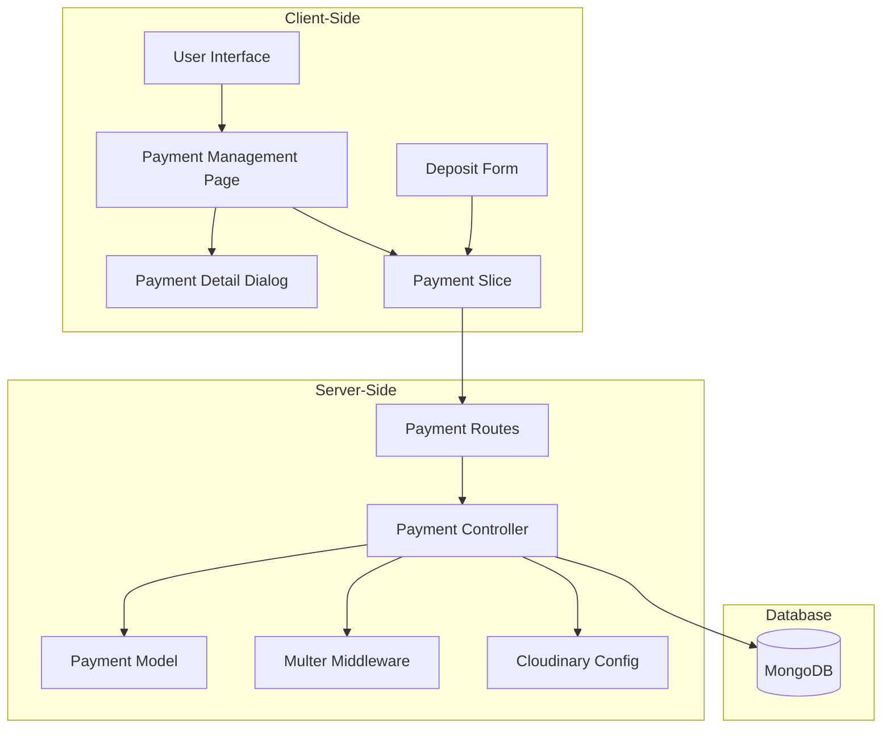
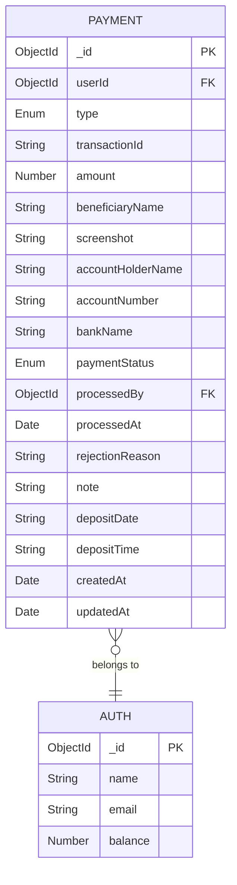
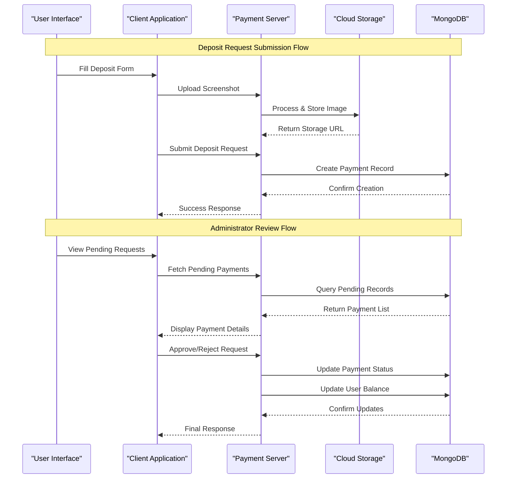
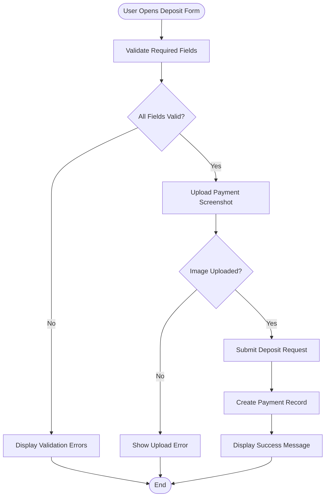
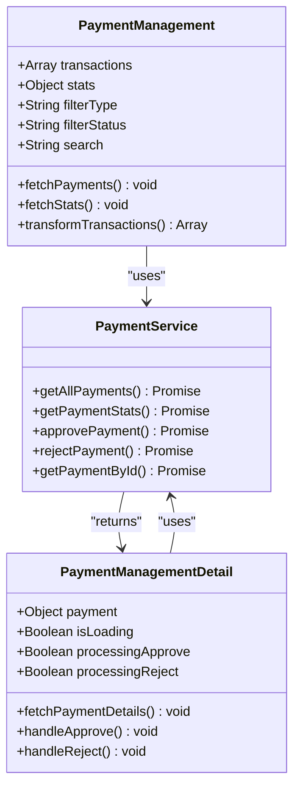
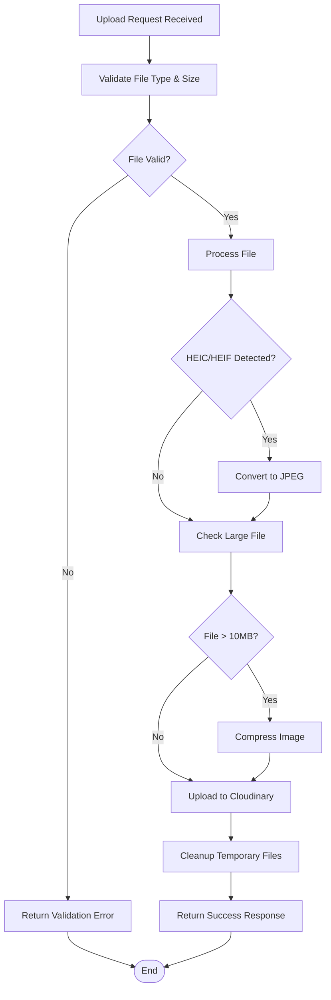
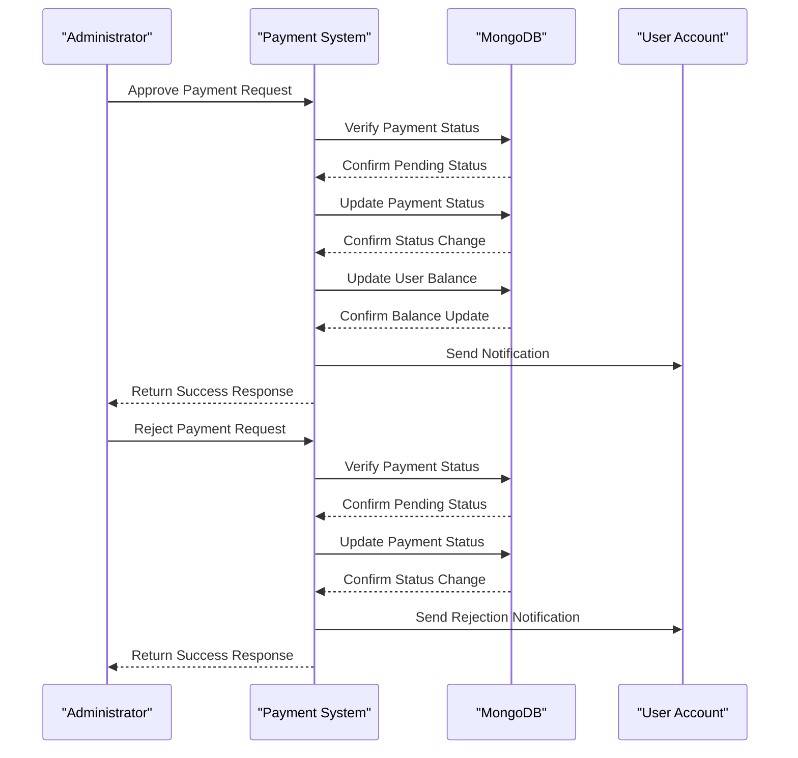
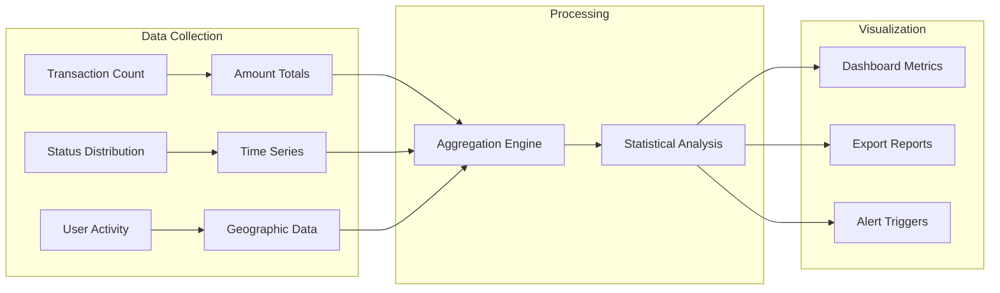
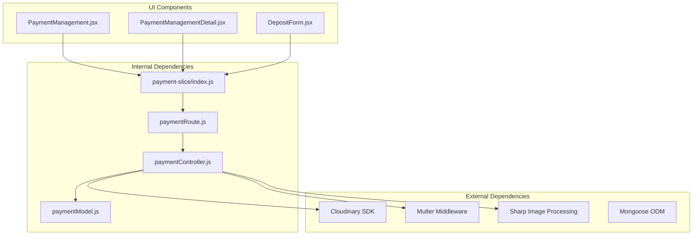

# Deposit Request Management

<cite>
**Referenced Files in This Document**
- [paymentModel.js](file://server/models/paymentModel.js)
- [paymentController.js](file://server/controllers/payment/paymentController.js)
- [paymentRoute.js](file://server/routes/payment/paymentRoute.js)
- [multer.js](file://server/middleware/multer.js)
- [cloudinary.js](file://server/config/cloudinary.js)
- [PaymentManagement.jsx](file://client/src/Pages/adminPage/PaymentManagement.jsx)
- [PaymentManagementDetail.jsx](file://client/src/components/Admin/PaymentManagementDetail.jsx)
- [DepositForm.jsx](file://client/src/components/User/walletComponent/DepositForm.jsx)
- [payment-slice/index.js](file://client/src/store/user/payment-slice/index.js)
</cite>

## Table of Contents
1. [Introduction](#introduction)
2. [Project Structure](#project-structure)
3. [Core Components](#core-components)
4. [Architecture Overview](#architecture-overview)
5. [Detailed Component Analysis](#detailed-component-analysis)
6. [Dependency Analysis](#dependency-analysis)
7. [Performance Considerations](#performance-considerations)
8. [Troubleshooting Guide](#troubleshooting-guide)
9. [Conclusion](#conclusion)

## Introduction

This document provides comprehensive documentation for the deposit request management system. It covers the complete workflow from user deposit submission through administrator review and approval, including screenshot validation, amount confirmation, user account updates, and automated notification processes. The system implements robust verification mechanisms, analytics tracking, and compliance features to ensure secure and efficient financial operations.

## Project Structure

The deposit request management system follows a clear separation of concerns with distinct frontend and backend components:

**Diagram sources**
- [PaymentManagement.jsx](file://client/src/Pages/adminPage/PaymentManagement.jsx#L1-L701)
- [paymentController.js](file://server/controllers/payment/paymentController.js#L1-L868)
- [paymentModel.js](file://server/models/paymentModel.js#L1-L160)

**Section sources**
- [paymentRoute.js](file://server/routes/payment/paymentRoute.js#L1-L82)
- [payment-slice/index.js](file://client/src/store/user/payment-slice/index.js#L1-L344)

## Core Components

### Payment Model Architecture

The payment system utilizes a comprehensive MongoDB schema designed specifically for financial transactions:

**Diagram sources**
- [paymentModel.js](file://server/models/paymentModel.js#L3-L158)

### Key Features

The system implements several critical features for secure deposit management:

- **Multi-format Image Support**: Handles various image formats including HEIC/HEIF conversions
- **Advanced File Processing**: Automatic compression and optimization for large files
- **Cloud Storage Integration**: Secure cloud storage with CDN delivery
- **Transaction Tracking**: Complete audit trail with timestamps and status changes
- **Administrative Controls**: Role-based access with approval/rejection workflows
- **Analytics Dashboard**: Comprehensive reporting and statistics

**Section sources**
- [paymentModel.js](file://server/models/paymentModel.js#L1-L160)

## Architecture Overview

The deposit request management system follows a modern MERN stack architecture with specialized payment processing capabilities:

**Diagram sources**
- [paymentController.js](file://server/controllers/payment/paymentController.js#L11-L396)
- [paymentRoute.js](file://server/routes/payment/paymentRoute.js#L24-L61)

## Detailed Component Analysis

### User Deposit Submission Interface

The user-facing deposit form provides a comprehensive interface for submitting payment requests:

**Diagram sources**
- [DepositForm.jsx](file://client/src/components/User/walletComponent/DepositForm.jsx#L126-L189)
- [payment-slice/index.js](file://client/src/store/user/payment-slice/index.js#L105-L127)

#### Key Form Elements

The deposit form includes comprehensive validation and user guidance:

- **Beneficiary Information**: Name and bank details validation
- **Transaction Details**: Reference number and amount verification
- **Date/Time Selection**: Proper format validation for deposit timing
- **Image Upload**: Multi-format support with progress indication
- **Real-time Validation**: Immediate feedback for field requirements

**Section sources**
- [DepositForm.jsx](file://client/src/components/User/walletComponent/DepositForm.jsx#L1-L329)

### Administrator Review Interface

The administrator dashboard provides comprehensive oversight of all payment requests:

**Diagram sources**
- [PaymentManagement.jsx](file://client/src/Pages/adminPage/PaymentManagement.jsx#L1-L701)
- [PaymentManagementDetail.jsx](file://client/src/components/Admin/PaymentManagementDetail.jsx#L1-L823)

#### Administrative Features

The administrator interface offers extensive functionality:

- **Real-time Statistics**: Live tracking of pending, approved, and rejected requests
- **Advanced Filtering**: Multi-dimensional search by type, status, and user criteria
- **Bulk Operations**: Efficient management of multiple payment requests
- **Detailed Analytics**: Comprehensive reporting and trend analysis
- **Audit Trail**: Complete transaction history with timestamps

**Section sources**
- [PaymentManagement.jsx](file://client/src/Pages/adminPage/PaymentManagement.jsx#L190-L290)

### Backend Processing Pipeline

The server-side processing implements robust validation and security measures:

**Diagram sources**
- [paymentController.js](file://server/controllers/payment/paymentController.js#L11-L200)
- [multer.js](file://server/middleware/multer.js#L1-L88)

#### Security and Validation Features

The backend implements multiple layers of security and validation:

- **File Format Validation**: Strict MIME type and extension checking
- **Size Limit Enforcement**: 50MB maximum file size with intelligent compression
- **HEIC/HEIF Support**: Automatic conversion to standard formats
- **Cloud Storage Security**: Encrypted storage with CDN delivery
- **Transaction Integrity**: Atomic operations with rollback capabilities

**Section sources**
- [paymentController.js](file://server/controllers/payment/paymentController.js#L11-L200)
- [cloudinary.js](file://server/config/cloudinary.js#L1-L10)

### Approval and Rejection Workflows

The system implements comprehensive approval workflows with proper state management:

**Diagram sources**
- [paymentController.js](file://server/controllers/payment/paymentController.js#L627-L744)

#### Automated Notification System

The system automatically handles user notifications for all status changes:

- **Approval Notifications**: Immediate confirmation of successful deposit processing
- **Rejection Notifications**: Clear communication of rejection reasons
- **Status Updates**: Real-time notifications for all payment state changes
- **Compliance Tracking**: Complete audit trail for regulatory compliance

**Section sources**
- [paymentController.js](file://server/controllers/payment/paymentController.js#L627-L744)

### Analytics and Reporting

The system provides comprehensive analytics and reporting capabilities:

**Diagram sources**
- [paymentController.js](file://server/controllers/payment/paymentController.js#L746-L794)
- [PaymentManagement.jsx](file://client/src/Pages/adminPage/PaymentManagement.jsx#L225-L245)

#### Analytics Features

The analytics system tracks multiple dimensions:

- **Real-time Statistics**: Live updates of pending, approved, and rejected counts
- **Financial Tracking**: Total amounts processed by status and type
- **User Behavior**: Transaction patterns and user engagement metrics
- **Performance Monitoring**: System performance and processing times
- **Compliance Reporting**: Regulatory compliance documentation and audit trails

**Section sources**
- [paymentController.js](file://server/controllers/payment/paymentController.js#L746-L794)
- [PaymentManagement.jsx](file://client/src/Pages/adminPage/PaymentManagement.jsx#L382-L513)

## Dependency Analysis

The deposit request management system has well-defined dependencies and relationships:

**Diagram sources**
- [paymentController.js](file://server/controllers/payment/paymentController.js#L1-L8)
- [payment-slice/index.js](file://client/src/store/user/payment-slice/index.js#L1-L10)

### Component Coupling Analysis

The system maintains loose coupling between components while ensuring cohesive functionality:

- **Frontend-Backend Separation**: Clear API boundaries with Redux state management
- **Model-Controller Separation**: Clean separation of data modeling and business logic
- **Middleware Integration**: Modular file processing and validation middleware
- **Storage Abstraction**: Cloud storage abstraction layer for scalability

**Section sources**
- [paymentRoute.js](file://server/routes/payment/paymentRoute.js#L1-L82)
- [payment-slice/index.js](file://client/src/store/user/payment-slice/index.js#L193-L322)

## Performance Considerations

The system implements several performance optimization strategies:

### File Processing Optimization

- **Intelligent Compression**: Automatic file size reduction for large images
- **Parallel Processing**: Concurrent file operations for improved throughput
- **Memory Management**: Efficient memory usage during file processing
- **CDN Integration**: Optimized image delivery through cloud storage networks

### Database Performance

- **Index Optimization**: Strategic indexing for frequent query patterns
- **Connection Pooling**: Efficient database connection management
- **Query Optimization**: Optimized aggregation queries for analytics
- **Caching Strategies**: Appropriate caching for frequently accessed data

### Frontend Performance

- **Lazy Loading**: Component lazy loading for improved initial load times
- **State Management**: Efficient Redux state updates and subscriptions
- **Image Optimization**: Client-side image optimization and lazy loading
- **API Caching**: Strategic API response caching for reduced network requests

## Troubleshooting Guide

### Common Issues and Solutions

#### Upload Failures

**Problem**: File upload errors or timeouts
**Causes**: 
- Large file sizes exceeding limits
- Network connectivity issues
- Unsupported file formats
- Server processing errors

**Solutions**:
- Verify file format compatibility (JPEG, PNG, HEIC supported)
- Check file size limitations (50MB maximum)
- Ensure stable internet connection
- Retry upload with compressed images

#### Payment Processing Errors

**Problem**: Deposit requests not appearing or status not updating
**Causes**:
- Authentication token expiration
- Database connectivity issues
- Payment record creation failures
- User account synchronization problems

**Solutions**:
- Refresh browser and re-authenticate
- Check payment status in user dashboard
- Verify database connectivity
- Contact system administrator for manual intervention

#### Image Display Issues

**Problem**: Payment screenshots not displaying correctly
**Causes**:
- Cloud storage access permissions
- Image processing failures
- Browser compatibility issues
- Network connectivity problems

**Solutions**:
- Verify cloud storage configuration
- Check image processing logs
- Test with different browsers
- Ensure stable network connection

**Section sources**
- [paymentController.js](file://server/controllers/payment/paymentController.js#L163-L199)
- [multer.js](file://server/middleware/multer.js#L60-L86)

### Debugging Procedures

#### Backend Debugging

1. **Enable Debug Logging**: Set environment variable for detailed logging
2. **Monitor File Uploads**: Track upload progress and error messages
3. **Database Queries**: Monitor payment record creation and updates
4. **Cloud Storage**: Verify image upload and URL generation

#### Frontend Debugging

1. **Redux DevTools**: Monitor payment state changes and API responses
2. **Network Monitoring**: Track API request/response cycles
3. **Console Logging**: Enable detailed client-side error reporting
4. **Component State**: Monitor UI state transitions and loading indicators

## Conclusion

The deposit request management system provides a comprehensive solution for handling financial transactions with robust security, validation, and administrative controls. The system successfully balances user experience with administrative oversight, providing real-time processing capabilities and comprehensive analytics.

Key strengths of the system include:

- **Security**: Multi-layered validation and secure file handling
- **Scalability**: Cloud-based architecture with automatic scaling
- **User Experience**: Intuitive interfaces for both users and administrators
- **Compliance**: Complete audit trails and regulatory reporting capabilities
- **Performance**: Optimized processing pipeline with intelligent caching

The system is well-positioned to handle growing transaction volumes while maintaining high security standards and providing excellent user experiences for both depositors and administrators.