# Payment Management

<cite>
**Referenced Files in This Document**
- [PaymentManagement.jsx](file://client/src/Pages/adminPage/PaymentManagement.jsx)
- [PaymentManagementDetail.jsx](file://client/src/components/Admin/PaymentManagementDetail.jsx)
- [paymentController.js](file://server/controllers/payment/paymentController.js)
- [paymentModel.js](file://server/models/paymentModel.js)
- [paymentRoute.js](file://server/routes/payment/paymentRoute.js)
- [index.js](file://client/src/store/user/payment-slice/index.js)
- [multer.js](file://server/middleware/multer.js)
- [cloudinary.js](file://server/config/cloudinary.js)
- [isAuthenticated.js](file://server/middleware/isAuthenticated.js)
- [.env](file://server/.env)
</cite>

## Table of Contents
1. [Introduction](#introduction)
2. [Project Structure](#project-structure)
3. [Core Components](#core-components)
4. [Architecture Overview](#architecture-overview)
5. [Detailed Component Analysis](#detailed-component-analysis)
6. [Dependency Analysis](#dependency-analysis)
7. [Performance Considerations](#performance-considerations)
8. [Troubleshooting Guide](#troubleshooting-guide)
9. [Conclusion](#conclusion)

## Introduction
This document provides comprehensive payment management documentation for administrators. It covers the payment request review system for deposits and withdrawals, verification workflows (including screenshot validation and amount confirmation), approval and rejection processes with automated notifications, analytics and transaction statistics, revenue tracking, payment method management, bank detail verification, security measures, fraud detection, compliance features, and bulk operations with administrative overrides.

## Project Structure
The payment management system spans the client (React + Redux Toolkit) and server (Node.js + Express + MongoDB) layers. Key areas:
- Client-side administration dashboard for viewing and acting on payments
- Client-side Redux slices for payment operations and uploads
- Server-side controllers for payment CRUD, approvals, and statistics
- Server-side models defining payment schema and status transitions
- Server-side routes enforcing authentication and authorization
- Middleware for file uploads and Cloudinary integration
- Authentication and authorization middleware

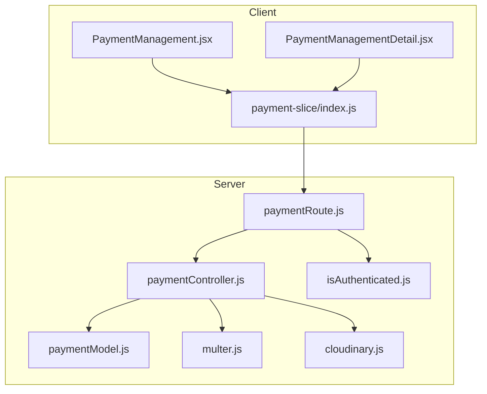

**Diagram sources**
- [PaymentManagement.jsx](file://client/src/Pages/adminPage/PaymentManagement.jsx#L1-L701)
- [PaymentManagementDetail.jsx](file://client/src/components/Admin/PaymentManagementDetail.jsx#L1-L823)
- [index.js](file://client/src/store/user/payment-slice/index.js#L1-L344)
- [paymentController.js](file://server/controllers/payment/paymentController.js#L1-L868)
- [paymentModel.js](file://server/models/paymentModel.js#L1-L160)
- [paymentRoute.js](file://server/routes/payment/paymentRoute.js#L1-L82)
- [isAuthenticated.js](file://server/middleware/isAuthenticated.js#L1-L62)
- [multer.js](file://server/middleware/multer.js#L1-L88)
- [cloudinary.js](file://server/config/cloudinary.js#L1-L10)

**Section sources**
- [PaymentManagement.jsx](file://client/src/Pages/adminPage/PaymentManagement.jsx#L1-L701)
- [PaymentManagementDetail.jsx](file://client/src/components/Admin/PaymentManagementDetail.jsx#L1-L823)
- [index.js](file://client/src/store/user/payment-slice/index.js#L1-L344)
- [paymentController.js](file://server/controllers/payment/paymentController.js#L1-L868)
- [paymentModel.js](file://server/models/paymentModel.js#L1-L160)
- [paymentRoute.js](file://server/routes/payment/paymentRoute.js#L1-L82)
- [isAuthenticated.js](file://server/middleware/isAuthenticated.js#L1-L62)
- [multer.js](file://server/middleware/multer.js#L1-L88)
- [cloudinary.js](file://server/config/cloudinary.js#L1-L10)

## Core Components
- Payment listing and filtering for administrators
- Payment detail view with screenshot preview and actions
- Upload and validation pipeline for payment screenshots
- Approval and rejection workflows with admin audit trail
- Statistics and analytics for transaction counts and amounts
- Bank detail verification for withdrawals
- Security middleware for authentication and authorization

**Section sources**
- [PaymentManagement.jsx](file://client/src/Pages/adminPage/PaymentManagement.jsx#L39-L290)
- [PaymentManagementDetail.jsx](file://client/src/components/Admin/PaymentManagementDetail.jsx#L155-L250)
- [paymentController.js](file://server/controllers/payment/paymentController.js#L11-L200)
- [paymentController.js](file://server/controllers/payment/paymentController.js#L537-L606)
- [paymentController.js](file://server/controllers/payment/paymentController.js#L627-L744)
- [paymentController.js](file://server/controllers/payment/paymentController.js#L746-L794)
- [paymentModel.js](file://server/models/paymentModel.js#L3-L114)

## Architecture Overview
The system follows a layered architecture:
- Presentation Layer: React components for admin UI
- Application Layer: Redux slices orchestrating API calls
- Domain Layer: Controllers implementing business logic
- Persistence Layer: Mongoose model with indexes and methods
- Infrastructure Layer: Multer for uploads, Cloudinary for storage, JWT for auth

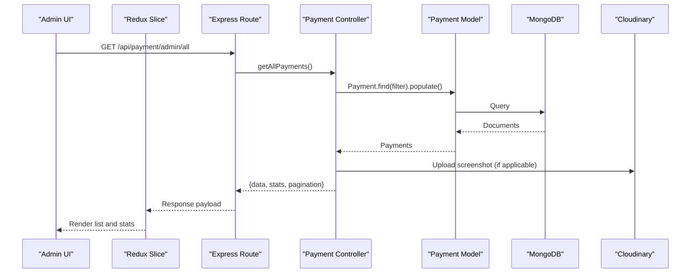

**Diagram sources**
- [paymentRoute.js](file://server/routes/payment/paymentRoute.js#L65-L71)
- [paymentController.js](file://server/controllers/payment/paymentController.js#L537-L598)
- [paymentModel.js](file://server/models/paymentModel.js#L116-L151)
- [cloudinary.js](file://server/config/cloudinary.js#L1-L10)

## Detailed Component Analysis

### Payment Listing and Filtering (Admin)
- Provides aggregated statistics (total, pending, approved, rejected, cancelled) and total amounts
- Supports filtering by type (deposit/withdrawal) and status
- Supports searching by transaction ID, user email, or user ID
- Displays recent transactions with status badges and navigation to detail view

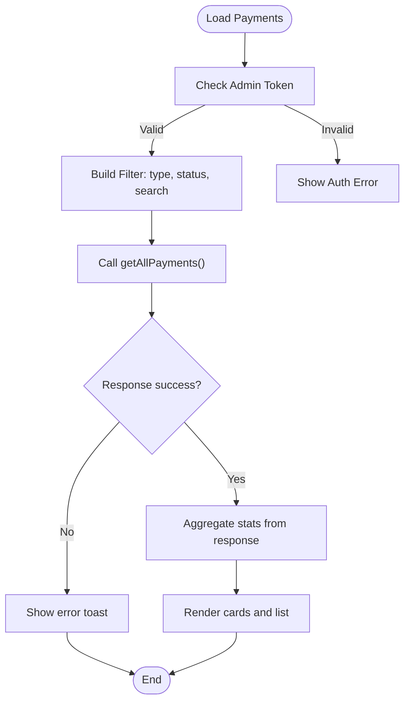

**Diagram sources**
- [PaymentManagement.jsx](file://client/src/Pages/adminPage/PaymentManagement.jsx#L189-L261)
- [PaymentManagement.jsx](file://client/src/Pages/adminPage/PaymentManagement.jsx#L225-L245)

**Section sources**
- [PaymentManagement.jsx](file://client/src/Pages/adminPage/PaymentManagement.jsx#L39-L290)

### Payment Detail View and Actions
- Displays transaction details, user info, and payment proof (screenshot)
- Shows deposit-specific info (beneficiary, bank, transaction ID, date/time) or withdrawal-specific info (account holder, bank, account number, CLABE)
- Provides Approve and Reject actions when status is pending
- Shows timeline of creation, updates, and processing

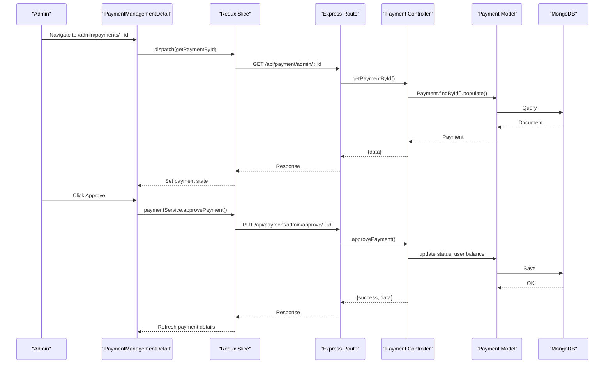

**Diagram sources**
- [PaymentManagementDetail.jsx](file://client/src/components/Admin/PaymentManagementDetail.jsx#L155-L250)
- [index.js](file://client/src/store/user/payment-slice/index.js#L271-L284)
- [paymentRoute.js](file://server/routes/payment/paymentRoute.js#L74-L74)
- [paymentController.js](file://server/controllers/payment/paymentController.js#L627-L692)
- [paymentModel.js](file://server/models/paymentModel.js#L129-L144)

**Section sources**
- [PaymentManagementDetail.jsx](file://client/src/components/Admin/PaymentManagementDetail.jsx#L155-L250)
- [index.js](file://client/src/store/user/payment-slice/index.js#L235-L302)
- [paymentRoute.js](file://server/routes/payment/paymentRoute.js#L74-L74)
- [paymentController.js](file://server/controllers/payment/paymentController.js#L627-L692)
- [paymentModel.js](file://server/models/paymentModel.js#L129-L144)

### Screenshot Upload and Validation
- Accepts image uploads (JPEG, PNG, GIF, WebP, HEIC/HEIF) with size limits
- Converts HEIC/HEIF to JPEG and compresses large files
- Uploads optimized images to Cloudinary with transformations
- Returns secure URL and metadata for later retrieval

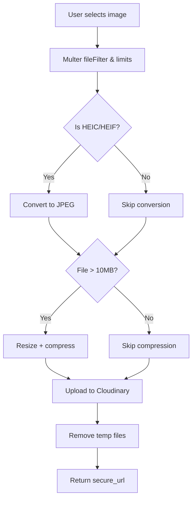

**Diagram sources**
- [multer.js](file://server/middleware/multer.js#L31-L58)
- [paymentController.js](file://server/controllers/payment/paymentController.js#L11-L200)
- [cloudinary.js](file://server/config/cloudinary.js#L1-L10)

**Section sources**
- [multer.js](file://server/middleware/multer.js#L31-L58)
- [paymentController.js](file://server/controllers/payment/paymentController.js#L11-L200)
- [cloudinary.js](file://server/config/cloudinary.js#L1-L10)

### Payment Verification Workflows
- Screenshot validation: Admin can view uploaded proof and confirm alignment with requested amount and details
- Amount confirmation: Admin reviews requested amount against user profile and supporting evidence
- Bank detail verification: For withdrawals, validates account holder name, account number, bank name, and CLABE interbancaria

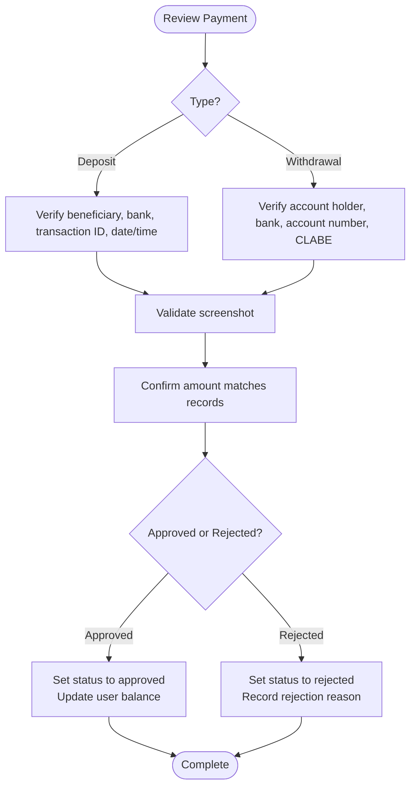

**Diagram sources**
- [PaymentManagementDetail.jsx](file://client/src/components/Admin/PaymentManagementDetail.jsx#L513-L638)
- [paymentController.js](file://server/controllers/payment/paymentController.js#L627-L744)
- [paymentModel.js](file://server/models/paymentModel.js#L30-L71)

**Section sources**
- [PaymentManagementDetail.jsx](file://client/src/components/Admin/PaymentManagementDetail.jsx#L513-L638)
- [paymentController.js](file://server/controllers/payment/paymentController.js#L627-L744)
- [paymentModel.js](file://server/models/paymentModel.js#L30-L71)

### Approval and Rejection Processes
- Approval: Updates payment status to approved, sets processedBy and processedAt, adjusts user balance for deposits
- Rejection: Updates status to rejected, sets processedBy and processedAt, records rejection reason, refunds amount for withdrawals
- Notifications: Frontend displays success/error toasts after actions

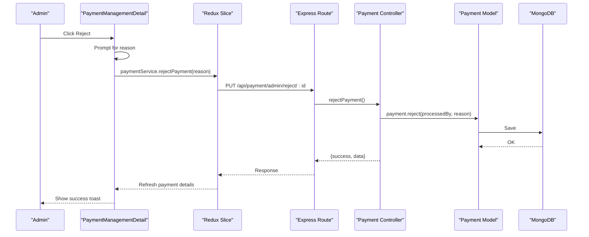

**Diagram sources**
- [PaymentManagementDetail.jsx](file://client/src/components/Admin/PaymentManagementDetail.jsx#L212-L240)
- [index.js](file://client/src/store/user/payment-slice/index.js#L286-L299)
- [paymentRoute.js](file://server/routes/payment/paymentRoute.js#L76-L77)
- [paymentController.js](file://server/controllers/payment/paymentController.js#L694-L744)
- [paymentModel.js](file://server/models/paymentModel.js#L137-L144)

**Section sources**
- [PaymentManagementDetail.jsx](file://client/src/components/Admin/PaymentManagementDetail.jsx#L189-L240)
- [index.js](file://client/src/store/user/payment-slice/index.js#L286-L299)
- [paymentController.js](file://server/controllers/payment/paymentController.js#L694-L744)
- [paymentModel.js](file://server/models/paymentModel.js#L137-L144)

### Payment Analytics, Transaction Statistics, and Revenue Tracking
- Aggregates counts and total amounts by status and type
- Provides overall transaction volume and monetary totals
- Used to populate summary cards and detailed charts in the admin UI

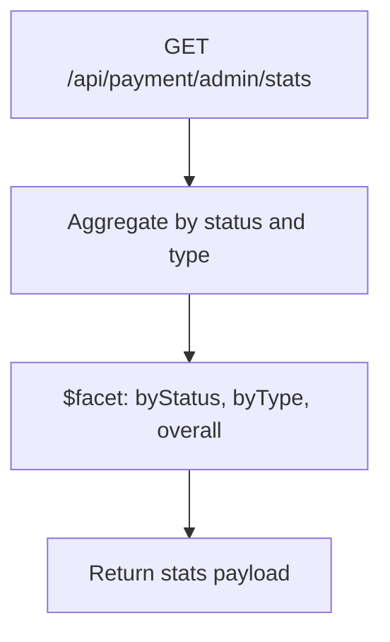

**Diagram sources**
- [paymentRoute.js](file://server/routes/payment/paymentRoute.js#L70-L71)
- [paymentController.js](file://server/controllers/payment/paymentController.js#L746-L794)

**Section sources**
- [PaymentManagement.jsx](file://client/src/Pages/adminPage/PaymentManagement.jsx#L225-L245)
- [paymentController.js](file://server/controllers/payment/paymentController.js#L746-L794)

### Payment Method Management and Bank Detail Verification
- Deposit requests require beneficiary name, bank name, transaction ID, screenshot, deposit date, and time
- Withdrawal requests require account holder name, account number, bank name, and optional note
- CLABE interbancaria is captured for withdrawals to support standardized transfers

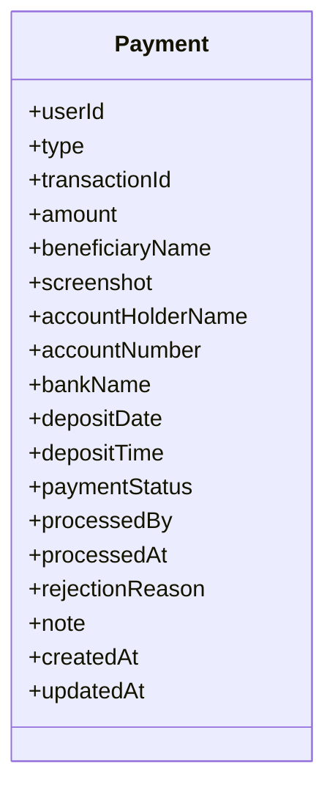

**Diagram sources**
- [paymentModel.js](file://server/models/paymentModel.js#L3-L114)

**Section sources**
- [paymentModel.js](file://server/models/paymentModel.js#L30-L71)
- [paymentController.js](file://server/controllers/payment/paymentController.js#L341-L396)
- [paymentController.js](file://server/controllers/payment/paymentController.js#L398-L464)

### Payment Security Measures, Fraud Detection, and Compliance Features
- Authentication: JWT-based middleware verifies tokens and checks session validity
- Authorization: Role-based access control restricts admin endpoints to admin/superadmin
- File upload security: Multer file filter and size limits prevent malicious uploads
- Cloudinary security: Secure URLs and transformations reduce exposure
- Audit trail: processedBy and processedAt track who acted and when
- Compliance: Required fields enforce completeness of payment records

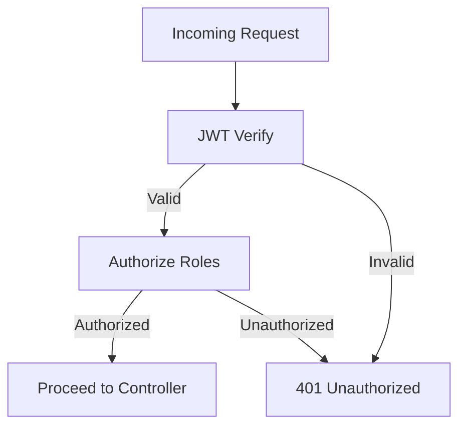

**Diagram sources**
- [isAuthenticated.js](file://server/middleware/isAuthenticated.js#L1-L62)
- [paymentRoute.js](file://server/routes/payment/paymentRoute.js#L65-L71)

**Section sources**
- [isAuthenticated.js](file://server/middleware/isAuthenticated.js#L1-L62)
- [paymentRoute.js](file://server/routes/payment/paymentRoute.js#L65-L71)
- [multer.js](file://server/middleware/multer.js#L31-L58)
- [cloudinary.js](file://server/config/cloudinary.js#L1-L10)
- [paymentModel.js](file://server/models/paymentModel.js#L80-L92)

### Bulk Payment Operations and Administrative Overrides
- Bulk operations are supported via server-side aggregation and filtering
- Administrative overrides occur when approving or rejecting payments, updating balances, and setting processedBy
- Pending payments can be cancelled by admins, refunding the amount to user balance

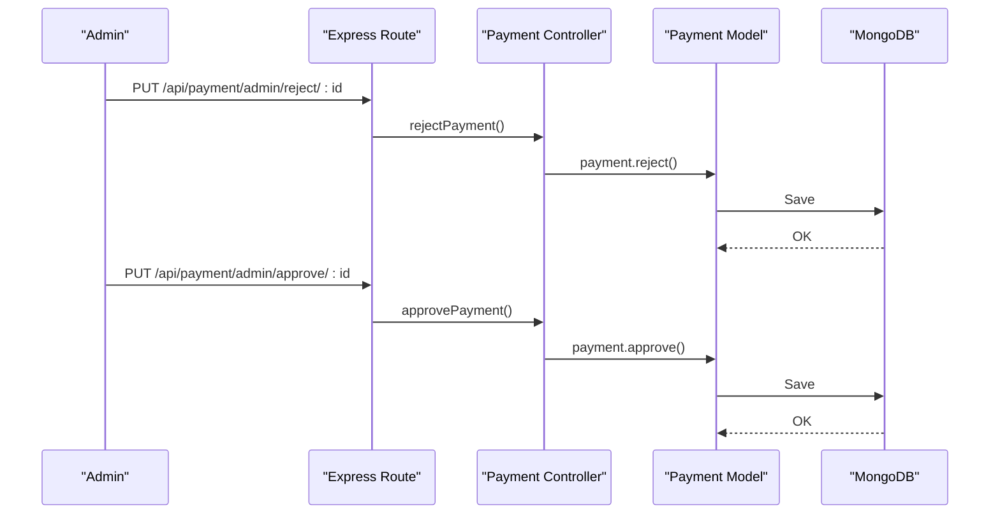

**Diagram sources**
- [paymentRoute.js](file://server/routes/payment/paymentRoute.js#L74-L77)
- [paymentController.js](file://server/controllers/payment/paymentController.js#L627-L744)
- [paymentModel.js](file://server/models/paymentModel.js#L129-L144)

**Section sources**
- [paymentController.js](file://server/controllers/payment/paymentController.js#L627-L744)
- [paymentModel.js](file://server/models/paymentModel.js#L129-L144)

## Dependency Analysis
Key dependencies and relationships:
- Routes depend on authentication and authorization middleware
- Controllers depend on the Payment model and external storage (Cloudinary)
- Client Redux slices depend on server routes for all operations
- Multer and Cloudinary integrate with the upload pipeline

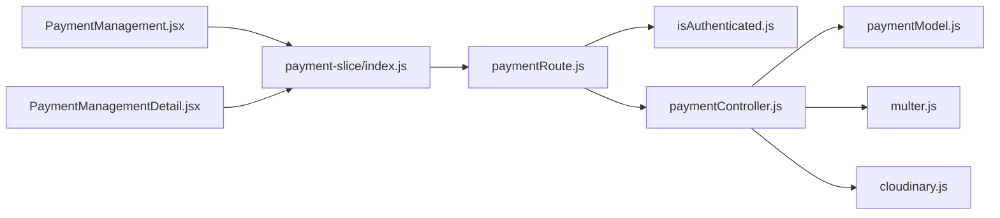

**Diagram sources**
- [paymentRoute.js](file://server/routes/payment/paymentRoute.js#L1-L82)
- [isAuthenticated.js](file://server/middleware/isAuthenticated.js#L1-L62)
- [paymentController.js](file://server/controllers/payment/paymentController.js#L1-L868)
- [paymentModel.js](file://server/models/paymentModel.js#L1-L160)
- [multer.js](file://server/middleware/multer.js#L1-L88)
- [cloudinary.js](file://server/config/cloudinary.js#L1-L10)
- [index.js](file://client/src/store/user/payment-slice/index.js#L1-L344)
- [PaymentManagement.jsx](file://client/src/Pages/adminPage/PaymentManagement.jsx#L1-L701)
- [PaymentManagementDetail.jsx](file://client/src/components/Admin/PaymentManagementDetail.jsx#L1-L823)

**Section sources**
- [paymentRoute.js](file://server/routes/payment/paymentRoute.js#L1-L82)
- [paymentController.js](file://server/controllers/payment/paymentController.js#L1-L868)
- [paymentModel.js](file://server/models/paymentModel.js#L1-L160)
- [index.js](file://client/src/store/user/payment-slice/index.js#L1-L344)

## Performance Considerations
- Image optimization: HEIC conversion and server-side compression reduce payload sizes
- Cloudinary transformations: Automatic resizing and quality tuning improve delivery performance
- Pagination: Server-side limits and skip for listing and statistics
- Indexes: Compound indexes on userId+createdAt, paymentStatus, and type+paymentStatus improve query performance
- Transaction isolation: MongoDB sessions ensure atomicity during approval/rejection workflows

[No sources needed since this section provides general guidance]

## Troubleshooting Guide
Common issues and resolutions:
- Authentication failures: Verify JWT token validity and session status
- File upload errors: Check file size limits, allowed MIME types, and Cloudinary availability
- Payment not found: Confirm payment ID and user/admin permissions
- Approval/rejection errors: Ensure payment is pending and admin has proper roles
- Stats fetch failures: Validate database connectivity and aggregation pipeline

**Section sources**
- [isAuthenticated.js](file://server/middleware/isAuthenticated.js#L12-L48)
- [multer.js](file://server/middleware/multer.js#L60-L86)
- [paymentController.js](file://server/controllers/payment/paymentController.js#L505-L533)
- [paymentController.js](file://server/controllers/payment/paymentController.js#L627-L692)
- [paymentController.js](file://server/controllers/payment/paymentController.js#L746-L794)

## Conclusion
The payment management system provides a robust, secure, and scalable solution for administrators to review, verify, approve, and reject payment requests. It integrates efficient upload handling, comprehensive analytics, strict security controls, and clear audit trails to support compliance and operational excellence.