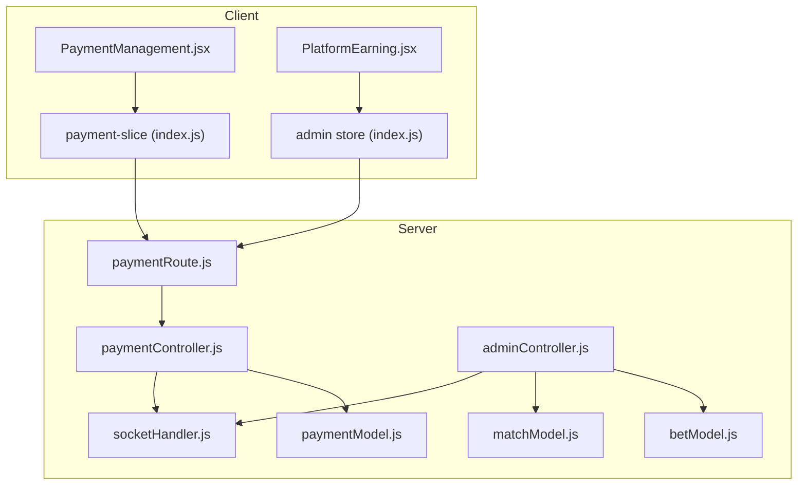
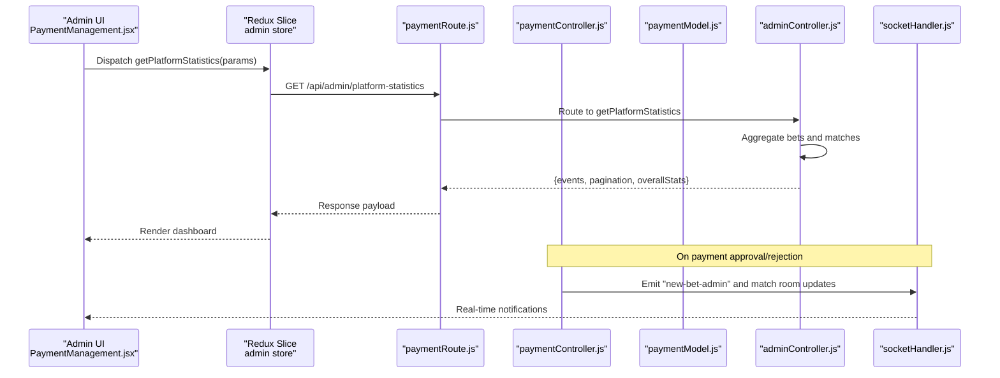
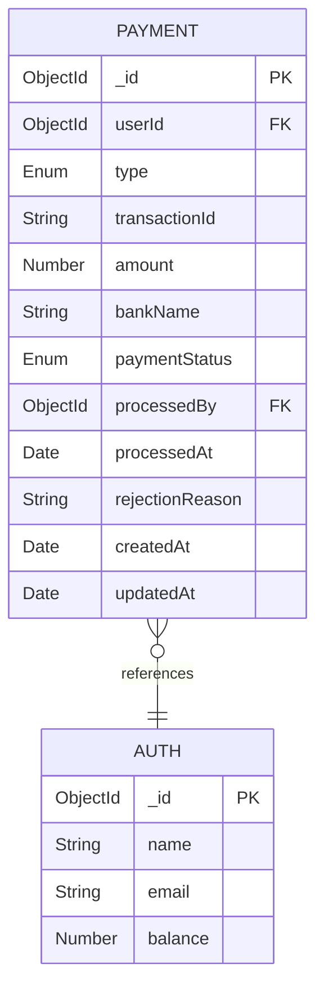
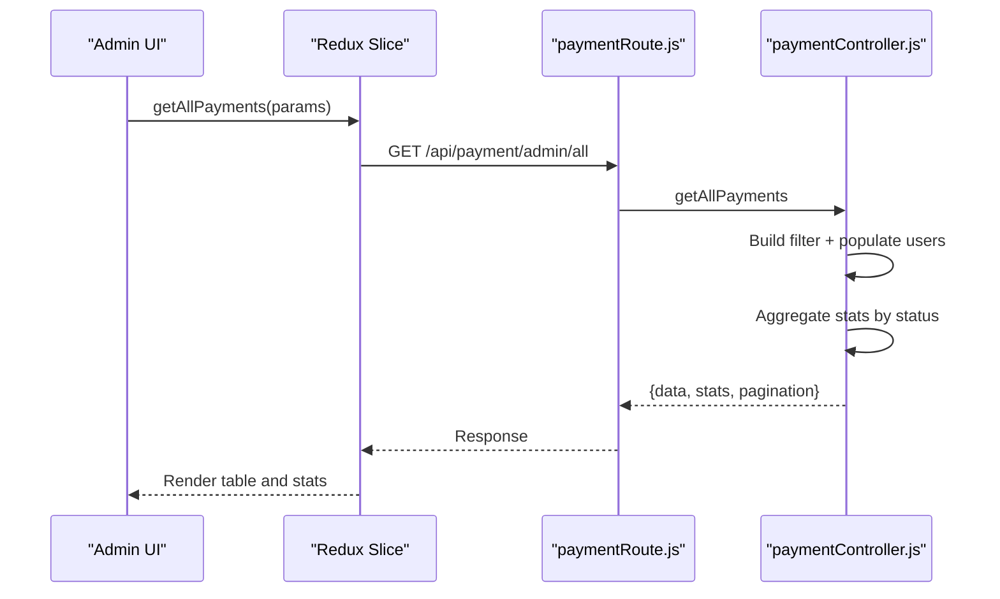
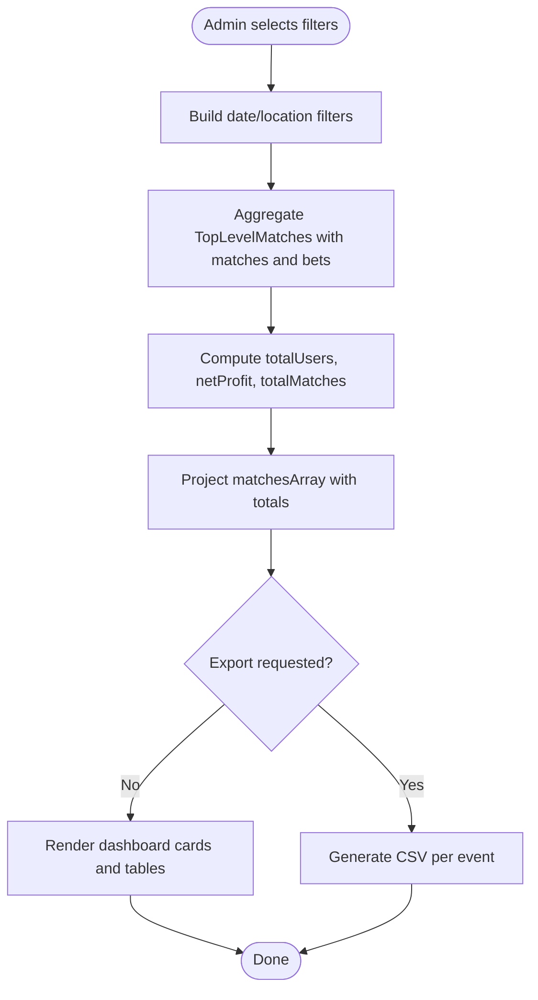
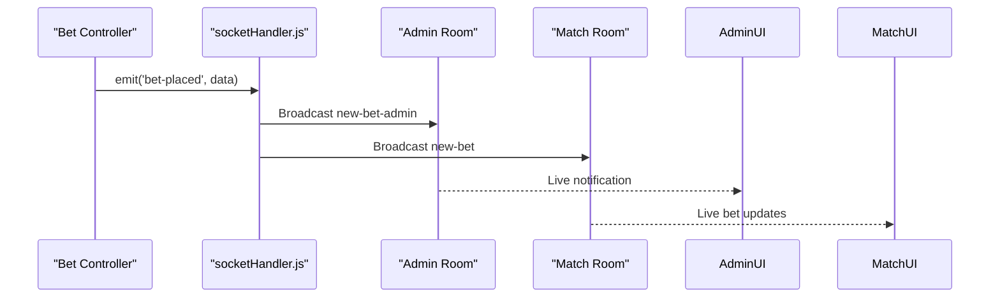
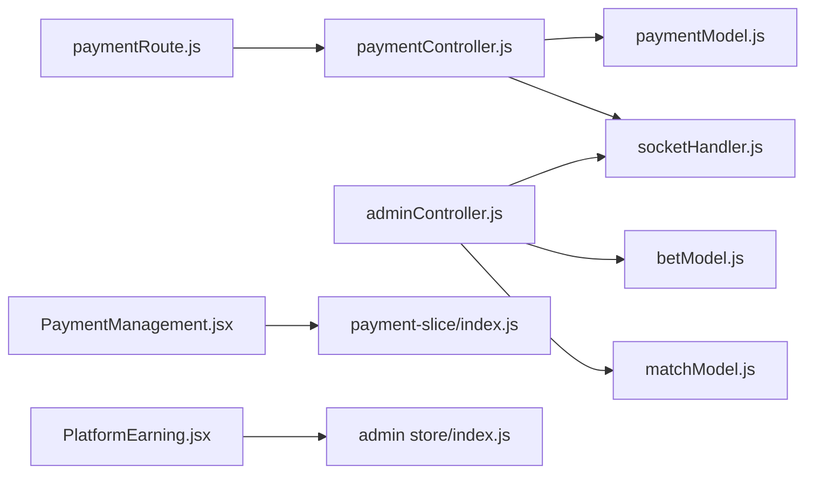

# Transaction Analytics

<cite>
**Referenced Files in This Document**
- [paymentModel.js](file://server/models/paymentModel.js)
- [paymentController.js](file://server/controllers/payment/paymentController.js)
- [paymentRoute.js](file://server/routes/payment/paymentRoute.js)
- [adminController.js](file://server/controllers/admin/adminController.js)
- [socketHandler.js](file://server/socket/socketHandler.js)
- [PaymentManagement.jsx](file://client/src/Pages/adminPage/PaymentManagement.jsx)
- [PlatformEarning.jsx](file://client/src/Pages/adminPage/PlatformEarning.jsx)
- [index.js (admin store)](file://client/src/store/admin/index.js)
- [index.js (payment slice)](file://client/src/store/user/payment-slice/index.js)
- [betModel.js](file://server/models/betModel.js)
- [matchModel.js](file://server/models/matchModel.js)
</cite>

## Table of Contents
1. [Introduction](#introduction)
2. [Project Structure](#project-structure)
3. [Core Components](#core-components)
4. [Architecture Overview](#architecture-overview)
5. [Detailed Component Analysis](#detailed-component-analysis)
6. [Dependency Analysis](#dependency-analysis)
7. [Performance Considerations](#performance-considerations)
8. [Troubleshooting Guide](#troubleshooting-guide)
9. [Conclusion](#conclusion)
10. [Appendices](#appendices)

## Introduction
This document provides comprehensive transaction analytics for the betting platform, focusing on payment volume tracking, revenue calculations, profit margin analysis, user transaction patterns, peak activity periods, seasonal trends, payment method analytics, conversion rates, and user behavior insights. It also covers real-time transaction monitoring, alert systems, anomaly detection, export capabilities, reporting features, and data visualization tools available to administrators.

## Project Structure
The analytics system spans backend models and controllers, frontend admin dashboards, Redux slices for state management, and WebSocket-based real-time notifications.

**Diagram sources**
- [paymentRoute.js](file://server/routes/payment/paymentRoute.js#L1-L82)
- [paymentController.js](file://server/controllers/payment/paymentController.js#L1-L868)
- [adminController.js](file://server/controllers/admin/adminController.js#L1-L465)
- [paymentModel.js](file://server/models/paymentModel.js#L1-L160)
- [betModel.js](file://server/models/betModel.js#L1-L24)
- [matchModel.js](file://server/models/matchModel.js#L1-L101)
- [socketHandler.js](file://server/socket/socketHandler.js#L1-L101)
- [PaymentManagement.jsx](file://client/src/Pages/adminPage/PaymentManagement.jsx#L1-L701)
- [PlatformEarning.jsx](file://client/src/Pages/adminPage/PlatformEarning.jsx#L1-L672)
- [index.js (admin store)](file://client/src/store/admin/index.js#L1-L334)
- [index.js (payment slice)](file://client/src/store/user/payment-slice/index.js#L1-L344)

**Section sources**
- [paymentRoute.js](file://server/routes/payment/paymentRoute.js#L1-L82)
- [paymentController.js](file://server/controllers/payment/paymentController.js#L1-L868)
- [adminController.js](file://server/controllers/admin/adminController.js#L1-L465)
- [paymentModel.js](file://server/models/paymentModel.js#L1-L160)
- [betModel.js](file://server/models/betModel.js#L1-L24)
- [matchModel.js](file://server/models/matchModel.js#L1-L101)
- [socketHandler.js](file://server/socket/socketHandler.js#L1-L101)
- [PaymentManagement.jsx](file://client/src/Pages/adminPage/PaymentManagement.jsx#L1-L701)
- [PlatformEarning.jsx](file://client/src/Pages/adminPage/PlatformEarning.jsx#L1-L672)
- [index.js (admin store)](file://client/src/store/admin/index.js#L1-L334)
- [index.js (payment slice)](file://client/src/store/user/payment-slice/index.js#L1-L344)

## Core Components
- Payment model: Defines transaction records, statuses, and indexes for efficient queries.
- Payment controller: Handles deposit/withdrawal requests, approvals, rejections, cancellations, and statistics.
- Admin controller: Provides platform-level statistics, including revenue and seasonal summaries.
- Frontend dashboards: Admin Payment Management and Platform Earnings dashboards with filtering, pagination, and export.
- Redux slices: Manage API calls and state for payments and admin actions.
- Real-time notifications: WebSocket rooms for live updates to admins and users.

Key analytics capabilities:
- Payment volume tracking by status and type.
- Revenue calculation from approved transactions and platform commission.
- Profit margin analysis via platform summary aggregation.
- User transaction patterns and conversion rates.
- Seasonal trends via monthly aggregation.
- Real-time monitoring and alerts via WebSocket.

**Section sources**
- [paymentModel.js](file://server/models/paymentModel.js#L1-L160)
- [paymentController.js](file://server/controllers/payment/paymentController.js#L537-L829)
- [adminController.js](file://server/controllers/admin/adminController.js#L128-L463)
- [PaymentManagement.jsx](file://client/src/Pages/adminPage/PaymentManagement.jsx#L39-L275)
- [PlatformEarning.jsx](file://client/src/Pages/adminPage/PlatformEarning.jsx#L36-L107)
- [index.js (admin store)](file://client/src/store/admin/index.js#L130-L158)
- [index.js (payment slice)](file://client/src/store/user/payment-slice/index.js#L193-L322)
- [socketHandler.js](file://server/socket/socketHandler.js#L1-L101)

## Architecture Overview
The system integrates REST APIs with MongoDB aggregation for analytics and WebSocket for real-time updates.

**Diagram sources**
- [paymentRoute.js](file://server/routes/payment/paymentRoute.js#L65-L81)
- [paymentController.js](file://server/controllers/payment/paymentController.js#L627-L692)
- [adminController.js](file://server/controllers/admin/adminController.js#L128-L382)
- [socketHandler.js](file://server/socket/socketHandler.js#L58-L72)
- [index.js (admin store)](file://client/src/store/admin/index.js#L130-L143)

## Detailed Component Analysis

### Payment Analytics Engine
- Data model: Supports deposits and withdrawals with status tracking, user references, and timestamps.
- Aggregations: Group by status/type and compute totals for payment stats.
- Admin endpoints: Retrieve all payments with filters, pending lists, and statistics.

**Diagram sources**
- [paymentModel.js](file://server/models/paymentModel.js#L3-L114)

**Section sources**
- [paymentModel.js](file://server/models/paymentModel.js#L1-L160)
- [paymentController.js](file://server/controllers/payment/paymentController.js#L537-L794)

### Admin Payment Management Dashboard
- Features:
  - Filter by type (deposit/withdrawal) and status (pending/approved/rejected/cancelled).
  - Search by transaction ID, user email, or user ID.
  - Pagination and statistics cards (totals, amounts per status).
  - View details modal and approve/reject actions.
- Backend integration:
  - Fetches payments with stats and pagination.
  - Calls approve/reject endpoints and updates UI.

**Diagram sources**
- [paymentRoute.js](file://server/routes/payment/paymentRoute.js#L65-L81)
- [paymentController.js](file://server/controllers/payment/paymentController.js#L537-L606)
- [PaymentManagement.jsx](file://client/src/Pages/adminPage/PaymentManagement.jsx#L189-L289)
- [index.js (payment slice)](file://client/src/store/user/payment-slice/index.js#L193-L234)

**Section sources**
- [PaymentManagement.jsx](file://client/src/Pages/adminPage/PaymentManagement.jsx#L39-L275)
- [index.js (payment slice)](file://client/src/store/user/payment-slice/index.js#L193-L322)
- [paymentRoute.js](file://server/routes/payment/paymentRoute.js#L65-L81)
- [paymentController.js](file://server/controllers/payment/paymentController.js#L537-L606)

### Platform Earnings and Seasonal Trends
- Platform Earnings Dashboard:
  - Filters: location, date range (quick filters), pagination.
  - Metrics: total commission earned (10% of winning bets), event-level stats, match-level breakdown.
  - Export: CSV export per event.
- Backend aggregation:
  - Aggregates completed top-level matches and nested matches/bets.
  - Computes net profit (commission) and match-level totals.
  - Summary endpoint provides monthly trends across locations.

**Diagram sources**
- [adminController.js](file://server/controllers/admin/adminController.js#L128-L382)
- [PlatformEarning.jsx](file://client/src/Pages/adminPage/PlatformEarning.jsx#L82-L107)

**Section sources**
- [PlatformEarning.jsx](file://client/src/Pages/adminPage/PlatformEarning.jsx#L36-L286)
- [adminController.js](file://server/controllers/admin/adminController.js#L128-L382)
- [betModel.js](file://server/models/betModel.js#L1-L24)
- [matchModel.js](file://server/models/matchModel.js#L1-L101)

### Real-Time Monitoring and Alerts
- WebSocket rooms:
  - Admin room for admin-only updates.
  - Match and event rooms for targeted notifications.
- Triggers:
  - Bet placed notifications broadcast to match room and admin room.
- Client-side:
  - Admin dashboards can subscribe to rooms and render live updates.

**Diagram sources**
- [socketHandler.js](file://server/socket/socketHandler.js#L58-L72)

**Section sources**
- [socketHandler.js](file://server/socket/socketHandler.js#L1-L101)

### Payment Method Analytics and Conversion Rates
- Current capabilities:
  - Payment method identification via bankName.
  - Status-based conversion tracking (approved vs pending/rejected).
- Recommendations:
  - Extend payment model to capture method metadata.
  - Add conversion funnel metrics (deposit attempts → approvals).
  - Implement cohort analysis for user retention post-deposits.

[No sources needed since this section provides recommendations based on existing capabilities]

### Anomaly Detection and Alert Systems
- Existing mechanisms:
  - Real-time notifications for payment actions.
  - Admin room broadcasts for immediate visibility.
- Suggested enhancements:
  - Threshold-based alerts for unusual spikes in pending/rejected counts.
  - Suspicious user behavior detection (multiple failed withdrawals).
  - Automated email/SMS alerts via middleware hooks.

[No sources needed since this section proposes enhancements]

### Reporting and Export Capabilities
- Admin Payment Management:
  - CSV export per transaction (via modal actions).
- Platform Earnings:
  - CSV export per event with match-level details.
- Future improvements:
  - Scheduled exports and downloadable reports.
  - PDF generation for executive summaries.

**Section sources**
- [PaymentManagement.jsx](file://client/src/Pages/adminPage/PaymentManagement.jsx#L665-L672)
- [PlatformEarning.jsx](file://client/src/Pages/adminPage/PlatformEarning.jsx#L194-L262)

## Dependency Analysis
- Backend dependencies:
  - Routes depend on controllers.
  - Controllers depend on models and middleware.
  - Admin controller depends on bet and match models for aggregations.
- Frontend dependencies:
  - Dashboards depend on Redux slices for API integration.
  - Redux slices depend on server endpoints.
- Real-time dependencies:
  - Controllers emit events consumed by WebSocket handlers.

**Diagram sources**
- [paymentRoute.js](file://server/routes/payment/paymentRoute.js#L1-L82)
- [paymentController.js](file://server/controllers/payment/paymentController.js#L1-L868)
- [adminController.js](file://server/controllers/admin/adminController.js#L1-L465)
- [paymentModel.js](file://server/models/paymentModel.js#L1-L160)
- [betModel.js](file://server/models/betModel.js#L1-L24)
- [matchModel.js](file://server/models/matchModel.js#L1-L101)
- [socketHandler.js](file://server/socket/socketHandler.js#L1-L101)
- [PaymentManagement.jsx](file://client/src/Pages/adminPage/PaymentManagement.jsx#L1-L701)
- [PlatformEarning.jsx](file://client/src/Pages/adminPage/PlatformEarning.jsx#L1-L672)
- [index.js (admin store)](file://client/src/store/admin/index.js#L1-L334)
- [index.js (payment slice)](file://client/src/store/user/payment-slice/index.js#L1-L344)

**Section sources**
- [paymentRoute.js](file://server/routes/payment/paymentRoute.js#L1-L82)
- [paymentController.js](file://server/controllers/payment/paymentController.js#L1-L868)
- [adminController.js](file://server/controllers/admin/adminController.js#L1-L465)
- [PaymentManagement.jsx](file://client/src/Pages/adminPage/PaymentManagement.jsx#L1-L701)
- [PlatformEarning.jsx](file://client/src/Pages/adminPage/PlatformEarning.jsx#L1-L672)
- [index.js (admin store)](file://client/src/store/admin/index.js#L1-L334)
- [index.js (payment slice)](file://client/src/store/user/payment-slice/index.js#L1-L344)

## Performance Considerations
- Database indexing:
  - Payment model includes indexes on user and status for faster queries.
- Aggregation efficiency:
  - Use pipeline stages to minimize data transfer and leverage MongoDB’s parallel execution.
- Pagination:
  - Apply skip/limit on large datasets to avoid memory pressure.
- Caching:
  - Cache frequently accessed stats endpoints with appropriate invalidation.
- Image optimization:
  - Server compresses screenshots and uses Cloudinary transformations to reduce bandwidth.

[No sources needed since this section provides general guidance]

## Troubleshooting Guide
- Upload failures:
  - Large files, timeouts, and network errors are handled with specific status codes and user-friendly messages.
- Payment approval/rejection:
  - Ensure payment is pending before attempting approval/rejection.
  - Verify user exists and balances are adjusted accordingly.
- WebSocket connectivity:
  - Use heartbeat ping/pong to detect disconnections.
  - Ensure clients join appropriate rooms (admin, match, event).

**Section sources**
- [paymentController.js](file://server/controllers/payment/paymentController.js#L11-L200)
- [paymentController.js](file://server/controllers/payment/paymentController.js#L627-L744)
- [socketHandler.js](file://server/socket/socketHandler.js#L74-L87)

## Conclusion
The platform provides robust transaction analytics through a combination of MongoDB aggregations, REST endpoints, Redux-driven dashboards, and WebSocket-based real-time updates. Administrators can track payment volumes, calculate revenues, analyze profit margins, and monitor user behavior. The system supports filtering, pagination, export, and seasonal trend analysis. Recommended enhancements include richer payment method analytics, anomaly detection, and automated alerting to further strengthen operational oversight.

## Appendices
- API endpoints overview:
  - Admin payments: GET /api/payment/admin/all, GET /api/payment/admin/pending, GET /api/payment/admin/stats, PUT /api/payment/admin/approve/:id, PUT /api/payment/admin/reject/:id.
  - Platform statistics: GET /api/admin/platform-statistics, GET /api/admin/platform-summary.
  - Payment management: POST /api/payment/upload-screenshot, POST /api/payment/deposit, POST /api/payment/withdraw, GET /api/payment/my-transactions, GET /api/payment/:id, PUT /api/payment/cancel/:id.

**Section sources**
- [paymentRoute.js](file://server/routes/payment/paymentRoute.js#L24-L81)
- [adminController.js](file://server/controllers/admin/adminController.js#L128-L463)