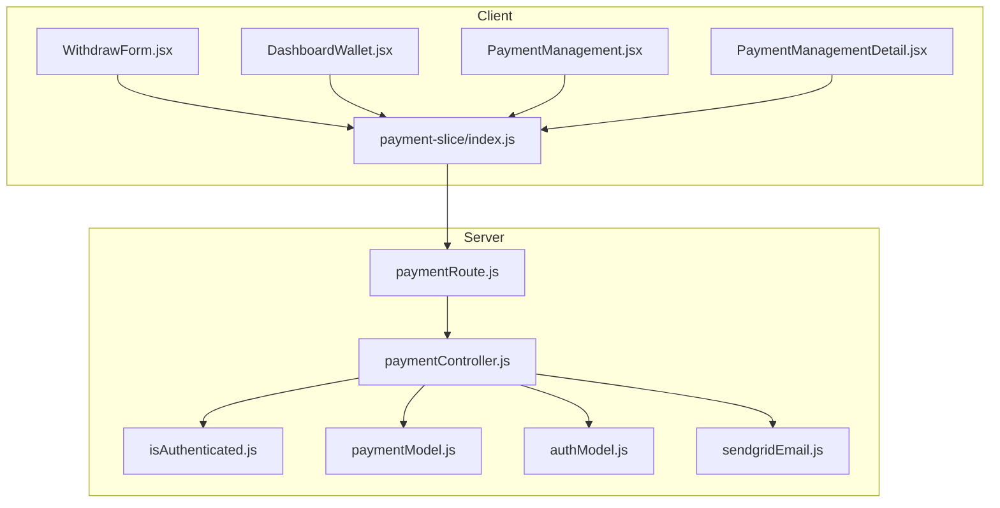
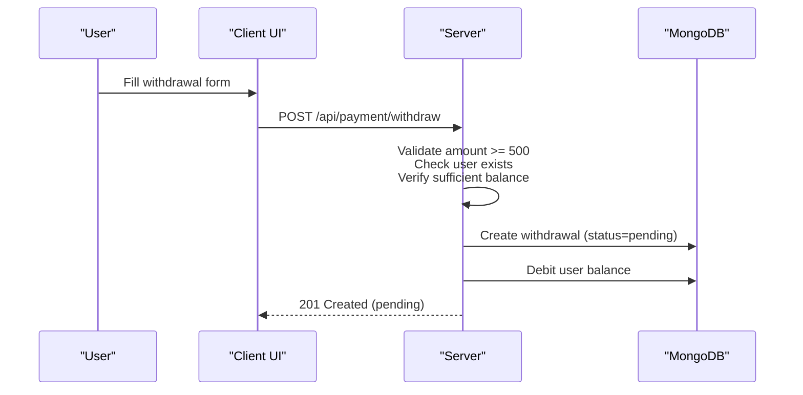
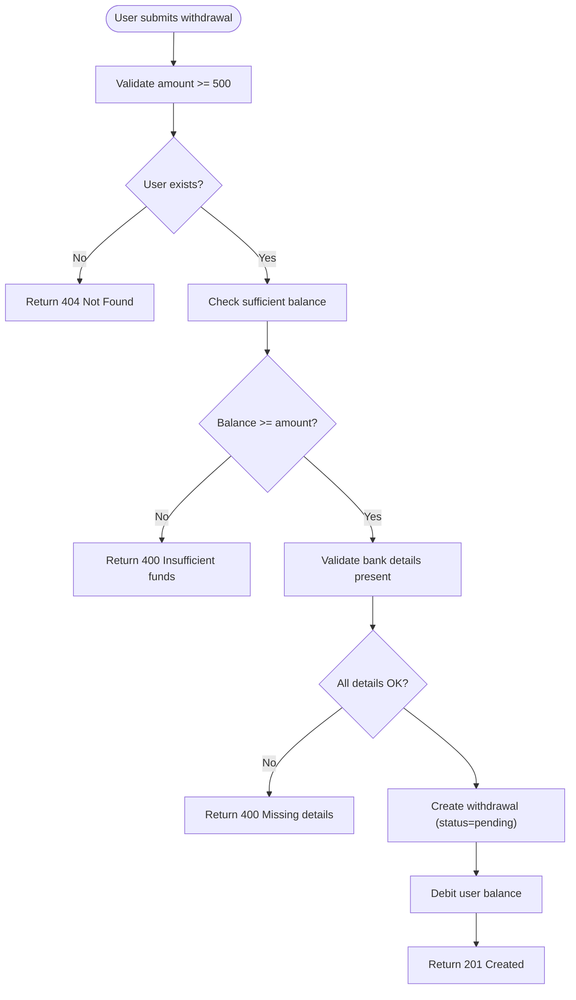
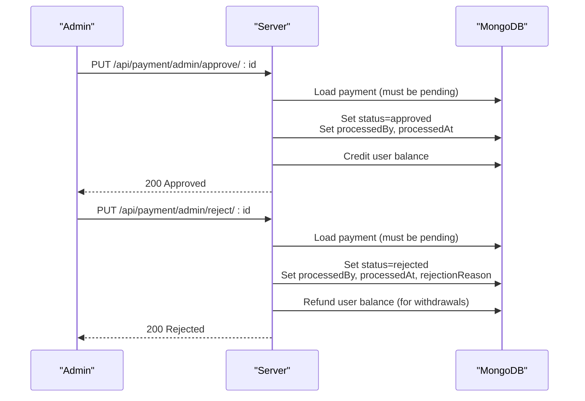
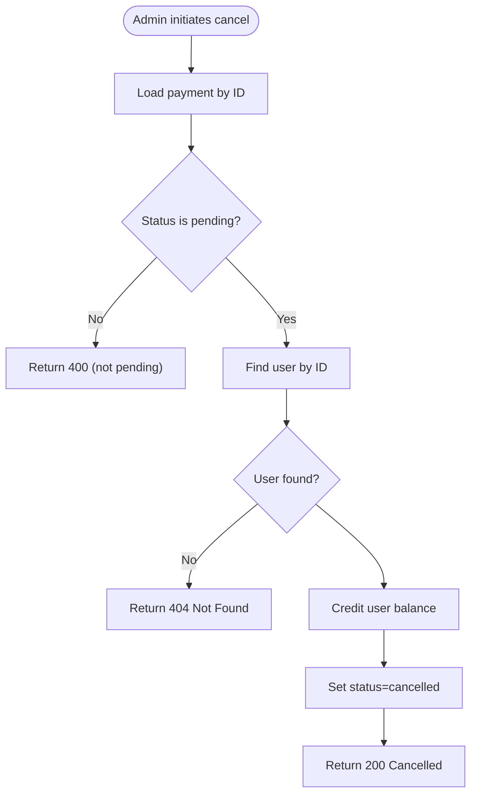
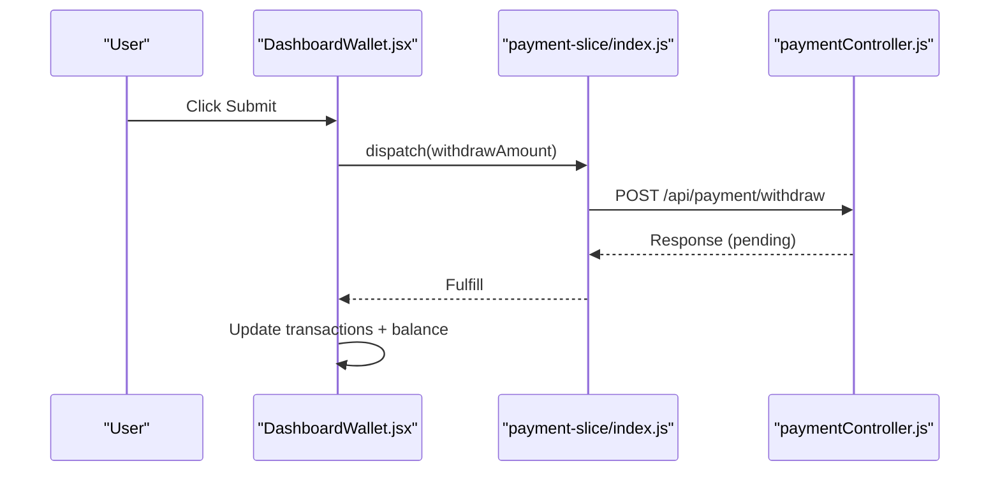
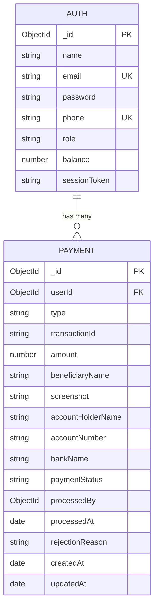
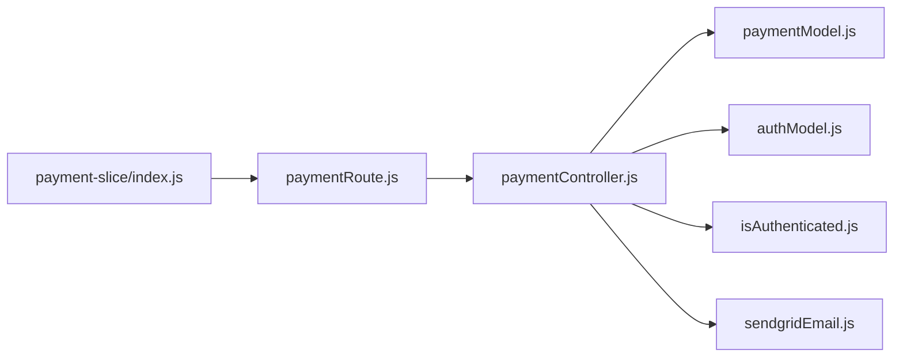

# Withdrawal Processing

<cite>
**Referenced Files in This Document**
- [paymentController.js](file://server/controllers/payment/paymentController.js)
- [paymentModel.js](file://server/models/paymentModel.js)
- [paymentRoute.js](file://server/routes/payment/paymentRoute.js)
- [isAuthenticated.js](file://server/middleware/isAuthenticated.js)
- [authModel.js](file://server/models/authModel.js)
- [WithdrawForm.jsx](file://client/src/components/User/walletComponent/WithdrawForm.jsx)
- [DashboardWallet.jsx](file://client/src/components/User/DashboardWallet.jsx)
- [PaymentManagement.jsx](file://client/src/Pages/adminPage/PaymentManagement.jsx)
- [PaymentManagementDetail.jsx](file://client/src/components/Admin/PaymentManagementDetail.jsx)
- [index.js](file://client/src/store/user/payment-slice/index.js)
- [sendgridEmail.js](file://server/config/sendgridEmail.js)
</cite>

## Table of Contents
1. [Introduction](#introduction)
2. [Project Structure](#project-structure)
3. [Core Components](#core-components)
4. [Architecture Overview](#architecture-overview)
5. [Detailed Component Analysis](#detailed-component-analysis)
6. [Dependency Analysis](#dependency-analysis)
7. [Performance Considerations](#performance-considerations)
8. [Troubleshooting Guide](#troubleshooting-guide)
9. [Conclusion](#conclusion)

## Introduction
This document provides comprehensive guidance for withdrawal processing workflows in the betting platform. It covers request submission, validation, user balance adjustments, administrative review and approval, rejection with refund, cancellation, analytics, and notification capabilities. It also outlines operational controls, security measures, and compliance considerations to help administrators manage withdrawal operations safely and efficiently.

## Project Structure
The withdrawal workflow spans client-side UI components, Redux slices for state management, backend routes, controllers, and MongoDB models. Authentication middleware ensures secure access to withdrawal endpoints, while administrative pages enable oversight and approvals.

**Diagram sources**
- [paymentRoute.js](file://server/routes/payment/paymentRoute.js#L1-L82)
- [paymentController.js](file://server/controllers/payment/paymentController.js#L398-L464)
- [paymentModel.js](file://server/models/paymentModel.js#L1-L160)
- [authModel.js](file://server/models/authModel.js#L1-L40)
- [isAuthenticated.js](file://server/middleware/isAuthenticated.js#L1-L62)
- [sendgridEmail.js](file://server/config/sendgridEmail.js#L1-L58)
- [WithdrawForm.jsx](file://client/src/components/User/walletComponent/WithdrawForm.jsx#L1-L118)
- [DashboardWallet.jsx](file://client/src/components/User/DashboardWallet.jsx#L191-L247)
- [PaymentManagement.jsx](file://client/src/Pages/adminPage/PaymentManagement.jsx#L1-L701)
- [PaymentManagementDetail.jsx](file://client/src/components/Admin/PaymentManagementDetail.jsx#L1-L608)
- [index.js](file://client/src/store/user/payment-slice/index.js#L128-L148)

**Section sources**
- [paymentRoute.js](file://server/routes/payment/paymentRoute.js#L1-L82)
- [paymentController.js](file://server/controllers/payment/paymentController.js#L398-L464)
- [paymentModel.js](file://server/models/paymentModel.js#L1-L160)
- [authModel.js](file://server/models/authModel.js#L1-L40)
- [isAuthenticated.js](file://server/middleware/isAuthenticated.js#L1-L62)
- [sendgridEmail.js](file://server/config/sendgridEmail.js#L1-L58)
- [WithdrawForm.jsx](file://client/src/components/User/walletComponent/WithdrawForm.jsx#L1-L118)
- [DashboardWallet.jsx](file://client/src/components/User/DashboardWallet.jsx#L191-L247)
- [PaymentManagement.jsx](file://client/src/Pages/adminPage/PaymentManagement.jsx#L1-L701)
- [PaymentManagementDetail.jsx](file://client/src/components/Admin/PaymentManagementDetail.jsx#L1-L608)
- [index.js](file://client/src/store/user/payment-slice/index.js#L128-L148)

## Core Components
- Withdrawal request creation: Validates minimum amount, checks user balance, collects bank details, persists withdrawal record, and immediately debits the user’s balance.
- Administrative review and approval: Approves pending withdrawals, crediting the user’s balance upon approval.
- Rejection and refund: Rejects pending withdrawals, automatically refunds the amount to the user’s balance.
- Cancellation: Allows cancellation of pending withdrawals, reversing the pre-deduction.
- Analytics and reporting: Aggregates payment statistics by status and type for dashboard insights.
- Notifications: Email notifications via SendGrid for verification and communication.

**Section sources**
- [paymentController.js](file://server/controllers/payment/paymentController.js#L398-L464)
- [paymentController.js](file://server/controllers/payment/paymentController.js#L627-L692)
- [paymentController.js](file://server/controllers/payment/paymentController.js#L694-L744)
- [paymentController.js](file://server/controllers/payment/paymentController.js#L800-L841)
- [paymentController.js](file://server/controllers/payment/paymentController.js#L746-L794)
- [sendgridEmail.js](file://server/config/sendgridEmail.js#L1-L58)

## Architecture Overview
The withdrawal workflow follows a request-response pattern with strict validation and atomic operations. The client submits a withdrawal request, the server validates inputs, updates user balance, and stores a pending withdrawal record. Administrators review and act on pending requests, with immediate balance adjustments upon approval or refund upon rejection.

**Diagram sources**
- [paymentController.js](file://server/controllers/payment/paymentController.js#L398-L464)
- [paymentModel.js](file://server/models/paymentModel.js#L1-L160)
- [authModel.js](file://server/models/authModel.js#L1-L40)

**Section sources**
- [paymentController.js](file://server/controllers/payment/paymentController.js#L398-L464)
- [paymentModel.js](file://server/models/paymentModel.js#L1-L160)
- [authModel.js](file://server/models/authModel.js#L1-L40)

## Detailed Component Analysis

### Withdrawal Request Creation
- Validation rules:
  - Minimum withdrawal amount enforced.
  - User existence checked.
  - Sufficient balance validated.
  - Required bank details collected.
- Immediate user balance adjustment:
  - Deducts requested amount from user’s balance.
- Persistence:
  - Creates a withdrawal record with status “pending”.
- Response:
  - Returns success with withdrawal details and processing notice.

**Diagram sources**
- [paymentController.js](file://server/controllers/payment/paymentController.js#L398-L464)
- [authModel.js](file://server/models/authModel.js#L1-L40)

**Section sources**
- [paymentController.js](file://server/controllers/payment/paymentController.js#L398-L464)
- [authModel.js](file://server/models/authModel.js#L1-L40)

### Administrative Approval and Rejection
- Approval:
  - Requires pending status.
  - Credits user balance for approved withdrawals.
  - Persists approval metadata (processed by, processed at).
- Rejection:
  - Requires pending status.
  - Refunds amount to user balance for withdrawals.
  - Records rejection reason and processed metadata.

**Diagram sources**
- [paymentController.js](file://server/controllers/payment/paymentController.js#L627-L692)
- [paymentController.js](file://server/controllers/payment/paymentController.js#L694-L744)
- [paymentModel.js](file://server/models/paymentModel.js#L129-L144)
- [authModel.js](file://server/models/authModel.js#L1-L40)

**Section sources**
- [paymentController.js](file://server/controllers/payment/paymentController.js#L627-L692)
- [paymentController.js](file://server/controllers/payment/paymentController.js#L694-L744)
- [paymentModel.js](file://server/models/paymentModel.js#L129-L144)
- [authModel.js](file://server/models/authModel.js#L1-L40)

### Cancellation of Pending Withdrawals
- Only pending withdrawals can be cancelled.
- On cancellation:
  - Reverses the pre-deduction by crediting user balance.
  - Updates payment status to “cancelled”.

**Diagram sources**
- [paymentController.js](file://server/controllers/payment/paymentController.js#L800-L841)
- [authModel.js](file://server/models/authModel.js#L1-L40)

**Section sources**
- [paymentController.js](file://server/controllers/payment/paymentController.js#L800-L841)
- [authModel.js](file://server/models/authModel.js#L1-L40)

### Client-Side Integration
- Withdrawal form:
  - Enforces minimum amount and available balance display.
  - Collects required bank details.
- Submission flow:
  - Dispatches withdrawal thunk to backend.
  - Updates recent transactions and user balance after success.
- Admin UI:
  - Lists pending withdrawals, filters by type/status, and supports approve/reject actions.
  - Detailed view shows withdrawal-specific fields (account holder, bank name, account number).

**Diagram sources**
- [DashboardWallet.jsx](file://client/src/components/User/DashboardWallet.jsx#L191-L247)
- [index.js](file://client/src/store/user/payment-slice/index.js#L128-L148)
- [paymentController.js](file://server/controllers/payment/paymentController.js#L398-L464)

**Section sources**
- [WithdrawForm.jsx](file://client/src/components/User/walletComponent/WithdrawForm.jsx#L1-L118)
- [DashboardWallet.jsx](file://client/src/components/User/DashboardWallet.jsx#L191-L247)
- [PaymentManagement.jsx](file://client/src/Pages/adminPage/PaymentManagement.jsx#L1-L701)
- [PaymentManagementDetail.jsx](file://client/src/components/Admin/PaymentManagementDetail.jsx#L582-L608)
- [index.js](file://client/src/store/user/payment-slice/index.js#L128-L148)
- [paymentController.js](file://server/controllers/payment/paymentController.js#L398-L464)

### Data Model and Constraints
- Payment schema:
  - Supports both deposit and withdrawal types.
  - Withdrawal-specific fields: account holder name, account number, bank name.
  - Status lifecycle: pending → approved/rejected/completed/failed/cancelled.
  - Admin action metadata: processedBy, processedAt, rejectionReason.
- Auth schema:
  - Tracks user balance and roles.

**Diagram sources**
- [paymentModel.js](file://server/models/paymentModel.js#L1-L160)
- [authModel.js](file://server/models/authModel.js#L1-L40)

**Section sources**
- [paymentModel.js](file://server/models/paymentModel.js#L1-L160)
- [authModel.js](file://server/models/authModel.js#L1-L40)

## Dependency Analysis
- Routes depend on controllers for business logic.
- Controllers depend on models for persistence and on authentication middleware for access control.
- Client Redux slices encapsulate API interactions and state updates.
- Email service integrates with SendGrid for notifications.

**Diagram sources**
- [paymentRoute.js](file://server/routes/payment/paymentRoute.js#L1-L82)
- [paymentController.js](file://server/controllers/payment/paymentController.js#L398-L464)
- [paymentModel.js](file://server/models/paymentModel.js#L1-L160)
- [authModel.js](file://server/models/authModel.js#L1-L40)
- [isAuthenticated.js](file://server/middleware/isAuthenticated.js#L1-L62)
- [sendgridEmail.js](file://server/config/sendgridEmail.js#L1-L58)
- [index.js](file://client/src/store/user/payment-slice/index.js#L128-L148)

**Section sources**
- [paymentRoute.js](file://server/routes/payment/paymentRoute.js#L1-L82)
- [paymentController.js](file://server/controllers/payment/paymentController.js#L398-L464)
- [paymentModel.js](file://server/models/paymentModel.js#L1-L160)
- [authModel.js](file://server/models/authModel.js#L1-L40)
- [isAuthenticated.js](file://server/middleware/isAuthenticated.js#L1-L62)
- [sendgridEmail.js](file://server/config/sendgridEmail.js#L1-L58)
- [index.js](file://client/src/store/user/payment-slice/index.js#L128-L148)

## Performance Considerations
- Indexes on Payment model support efficient queries by userId, status, and type combinations.
- Aggregation queries for statistics avoid scanning entire collections unnecessarily.
- Client-side pagination and filtering reduce payload sizes for admin dashboards.
- Image upload optimization (compression, chunking) reduces latency and storage overhead during related operations.

**Section sources**
- [paymentModel.js](file://server/models/paymentModel.js#L116-L120)
- [paymentController.js](file://server/controllers/payment/paymentController.js#L746-L794)

## Troubleshooting Guide
Common issues and resolutions:
- Insufficient balance:
  - Validation prevents requests exceeding user balance.
  - Ensure user has sufficient funds before submitting.
- Invalid or missing bank details:
  - All required bank fields must be present.
  - Verify account holder name, account number, and bank name.
- Pending-only actions:
  - Approve/reject/cancel only apply to pending payments.
  - Check payment status before attempting actions.
- Authentication failures:
  - Ensure valid JWT token and active session.
  - Middleware handles expired or invalid tokens.
- Network timeouts or large uploads:
  - Client upload thunk includes timeout and progress tracking.
  - Server upload handlers support chunked uploads for large files.

**Section sources**
- [paymentController.js](file://server/controllers/payment/paymentController.js#L398-L464)
- [paymentController.js](file://server/controllers/payment/paymentController.js#L627-L692)
- [paymentController.js](file://server/controllers/payment/paymentController.js#L694-L744)
- [paymentController.js](file://server/controllers/payment/paymentController.js#L800-L841)
- [isAuthenticated.js](file://server/middleware/isAuthenticated.js#L1-L62)
- [index.js](file://client/src/store/user/payment-slice/index.js#L34-L102)

## Conclusion
The withdrawal processing system enforces strict validation, maintains accurate user balances, and provides robust administrative controls for approvals, rejections, and cancellations. With built-in analytics and notification capabilities, administrators can monitor and manage withdrawal operations effectively while ensuring compliance and security.