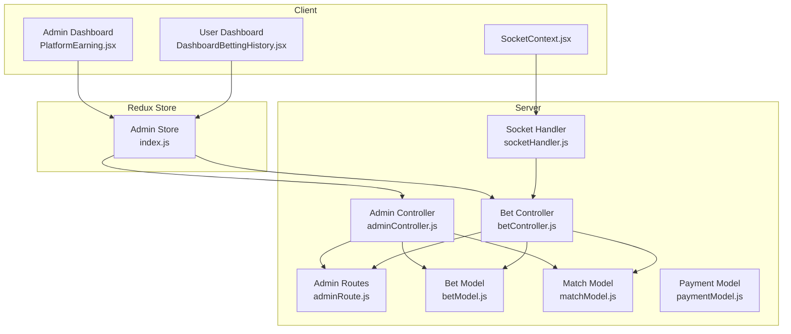
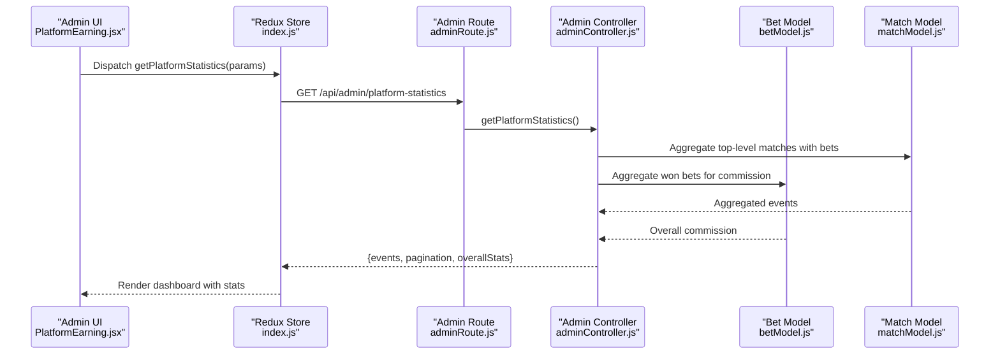
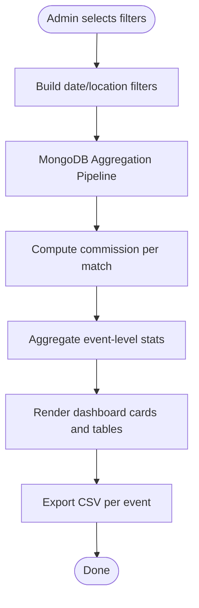
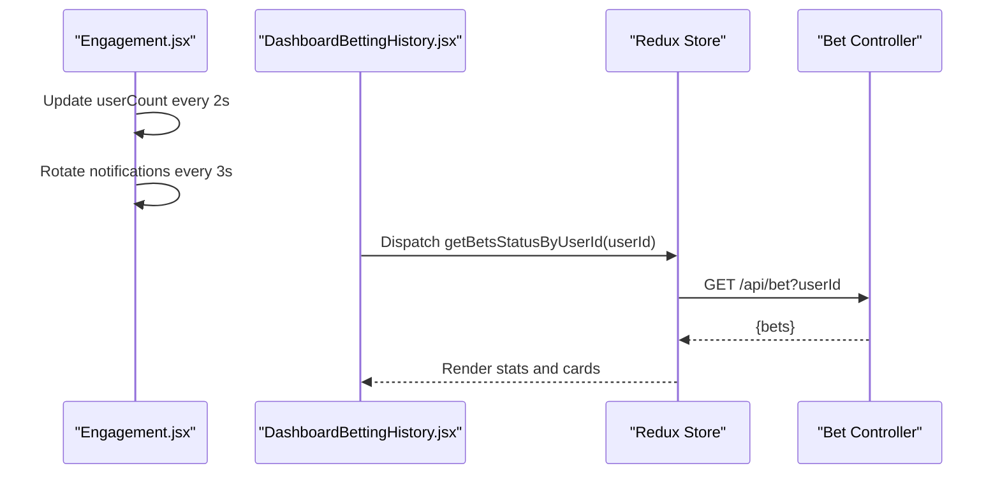
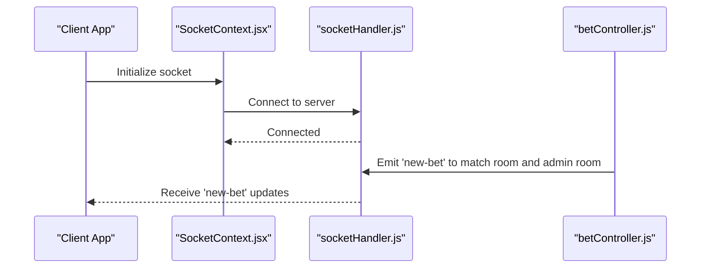
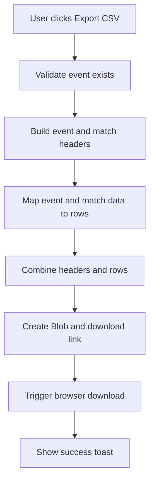
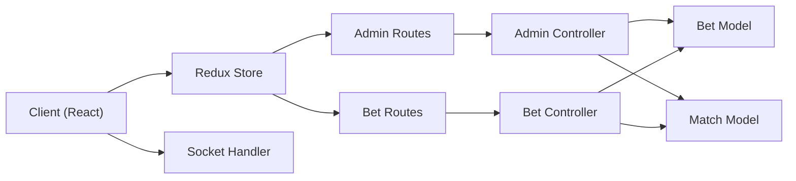

# Platform Analytics and Earnings

<cite>
**Referenced Files in This Document**
- [PlatformEarning.jsx](file://client/src/Pages/adminPage/PlatformEarning.jsx)
- [adminController.js](file://server/controllers/admin/adminController.js)
- [adminRoute.js](file://server/routes/admin/adminRoute.js)
- [index.js](file://client/src/store/admin/index.js)
- [betModel.js](file://server/models/betModel.js)
- [matchModel.js](file://server/models/matchModel.js)
- [paymentModel.js](file://server/models/paymentModel.js)
- [DashboardBettingHistory.jsx](file://client/src/components/User/DashboardBettingHistory.jsx)
- [betController.js](file://server/controllers/bet/betController.js)
- [socketHandler.js](file://server/socket/socketHandler.js)
- [SocketContext.jsx](file://client/src/context/SocketContext.jsx)
- [Engagement.jsx](file://client/src/components/Default/Engagement.jsx)
</cite>

## Table of Contents
1. [Introduction](#introduction)
2. [Project Structure](#project-structure)
3. [Core Components](#core-components)
4. [Architecture Overview](#architecture-overview)
5. [Detailed Component Analysis](#detailed-component-analysis)
6. [Dependency Analysis](#dependency-analysis)
7. [Performance Considerations](#performance-considerations)
8. [Troubleshooting Guide](#troubleshooting-guide)
9. [Conclusion](#conclusion)
10. [Appendices](#appendices)

## Introduction
This document provides comprehensive platform analytics and earnings documentation for a real-time betting platform. It covers the revenue tracking system, user engagement metrics, betting volume statistics, platform performance indicators, real-time monitoring, automated reporting, dashboard visualizations, user acquisition and retention analytics, monetization tracking, platform health indicators, system performance metrics, operational KPIs, export capabilities, custom reporting, and executive dashboards.

## Project Structure
The analytics and earnings system spans both frontend and backend components:
- Frontend: Admin dashboard for platform earnings, user dashboard for personal betting history, and real-time socket connections for live updates.
- Backend: Admin endpoints for platform statistics and summaries, MongoDB models for bets, matches, and payments, and WebSocket handlers for real-time notifications.

**Diagram sources**
- [PlatformEarning.jsx](file://client/src/Pages/adminPage/PlatformEarning.jsx#L1-L672)
- [DashboardBettingHistory.jsx](file://client/src/components/User/DashboardBettingHistory.jsx#L1-L565)
- [SocketContext.jsx](file://client/src/context/SocketContext.jsx#L1-L61)
- [index.js](file://client/src/store/admin/index.js#L1-L334)
- [adminController.js](file://server/controllers/admin/adminController.js#L128-L382)
- [betController.js](file://server/controllers/bet/betController.js#L108-L124)
- [adminRoute.js](file://server/routes/admin/adminRoute.js#L1-L22)
- [betModel.js](file://server/models/betModel.js#L1-L24)
- [matchModel.js](file://server/models/matchModel.js#L1-L101)
- [paymentModel.js](file://server/models/paymentModel.js#L1-L160)
- [socketHandler.js](file://server/socket/socketHandler.js#L1-L101)

**Section sources**
- [PlatformEarning.jsx](file://client/src/Pages/adminPage/PlatformEarning.jsx#L1-L672)
- [DashboardBettingHistory.jsx](file://client/src/components/User/DashboardBettingHistory.jsx#L1-L565)
- [SocketContext.jsx](file://client/src/context/SocketContext.jsx#L1-L61)
- [index.js](file://client/src/store/admin/index.js#L1-L334)
- [adminController.js](file://server/controllers/admin/adminController.js#L128-L382)
- [betController.js](file://server/controllers/bet/betController.js#L108-L124)
- [adminRoute.js](file://server/routes/admin/adminRoute.js#L1-L22)
- [betModel.js](file://server/models/betModel.js#L1-L24)
- [matchModel.js](file://server/models/matchModel.js#L1-L101)
- [paymentModel.js](file://server/models/paymentModel.js#L1-L160)
- [socketHandler.js](file://server/socket/socketHandler.js#L1-L101)

## Core Components
- Revenue Tracking System
  - Platform earnings dashboard aggregates total commission earned, event-level net profit, match-level statistics, and exports to CSV.
  - Backend aggregation pipeline computes commission from won bets and user counts per event.
- User Engagement Metrics
  - Real-time user counts and notifications carousel on the landing page.
  - User dashboard displays personal betting statistics including total bets, total wagered, total won, and win rate.
- Betting Volume Statistics
  - Match-level totals, total bet amounts, and commission per match are computed and displayed.
- Platform Performance Indicators
  - Socket connection health, reconnection attempts, and room-based broadcasting.
- Real-Time Earnings Monitoring
  - WebSocket rooms for match and admin notifications.
- Automated Reporting
  - CSV export per event with event-level and match-level data.
- Dashboard Visualization
  - Admin dashboard cards for platform commission and filters for date ranges and locations.
- User Acquisition and Retention
  - User counts and notifications indicate active participation; retention can be inferred from repeated betting activity.
- Monetization Tracking
  - Commission calculation at 10% of winning bet amounts.
- Platform Health and Operational KPIs
  - Socket connectivity status, admin room broadcasting, and pagination controls.
- Export and Custom Reporting
  - CSV export functionality and flexible date-range filtering.

**Section sources**
- [PlatformEarning.jsx](file://client/src/Pages/adminPage/PlatformEarning.jsx#L1-L672)
- [adminController.js](file://server/controllers/admin/adminController.js#L128-L382)
- [Engagement.jsx](file://client/src/components/Default/Engagement.jsx#L1-L106)
- [DashboardBettingHistory.jsx](file://client/src/components/User/DashboardBettingHistory.jsx#L76-L89)
- [socketHandler.js](file://server/socket/socketHandler.js#L1-L101)

## Architecture Overview
The analytics and earnings architecture integrates Redux for state management, Express routes for admin APIs, MongoDB models for data persistence, and Socket.IO for real-time updates.

**Diagram sources**
- [PlatformEarning.jsx](file://client/src/Pages/adminPage/PlatformEarning.jsx#L82-L107)
- [index.js](file://client/src/store/admin/index.js#L130-L143)
- [adminRoute.js](file://server/routes/admin/adminRoute.js#L18-L19)
- [adminController.js](file://server/controllers/admin/adminController.js#L128-L382)
- [betModel.js](file://server/models/betModel.js#L1-L24)
- [matchModel.js](file://server/models/matchModel.js#L1-L101)

## Detailed Component Analysis

### Revenue Tracking System
- Data Sources
  - Top-level matches with status "Completed".
  - Bets with status "Won" contribute to commission computation.
- Computation
  - Commission: 10% of actualAmount for each won bet.
  - Event-level netProfit: sum of match-level totalCommission.
  - Event-level totalUsers: distinct user count across matches.
- Frontend Rendering
  - Platform commission card, event cards with match tables, pagination, and CSV export per event.

**Diagram sources**
- [adminController.js](file://server/controllers/admin/adminController.js#L158-L307)
- [PlatformEarning.jsx](file://client/src/Pages/adminPage/PlatformEarning.jsx#L194-L262)

**Section sources**
- [adminController.js](file://server/controllers/admin/adminController.js#L128-L382)
- [PlatformEarning.jsx](file://client/src/Pages/adminPage/PlatformEarning.jsx#L1-L672)

### User Engagement Metrics
- Active Bettors
  - Real-time counter increments periodically.
- Live Notifications
  - Rotating notification carousel for recent wins.
- User Dashboard
  - Personal betting history with calculated stats: total bets, total wagered, total won, win rate.

**Diagram sources**
- [Engagement.jsx](file://client/src/components/Default/Engagement.jsx#L1-L106)
- [DashboardBettingHistory.jsx](file://client/src/components/User/DashboardBettingHistory.jsx#L56-L89)
- [betController.js](file://server/controllers/bet/betController.js#L108-L124)

**Section sources**
- [Engagement.jsx](file://client/src/components/Default/Engagement.jsx#L1-L106)
- [DashboardBettingHistory.jsx](file://client/src/components/User/DashboardBettingHistory.jsx#L1-L565)
- [betController.js](file://server/controllers/bet/betController.js#L108-L124)

### Real-Time Earnings Monitoring
- Socket Rooms
  - Match-specific rooms for live bet updates.
  - Admin room for centralized monitoring.
- Connection Handling
  - Reconnection attempts, heartbeat ping/pong, and disconnect logging.
- Frontend Integration
  - Socket provider wraps the app and exposes connection status.

**Diagram sources**
- [SocketContext.jsx](file://client/src/context/SocketContext.jsx#L14-L54)
- [socketHandler.js](file://server/socket/socketHandler.js#L3-L90)
- [betController.js](file://server/controllers/bet/betController.js#L79-L96)

**Section sources**
- [socketHandler.js](file://server/socket/socketHandler.js#L1-L101)
- [SocketContext.jsx](file://client/src/context/SocketContext.jsx#L1-L61)
- [betController.js](file://server/controllers/bet/betController.js#L1-L125)

### Automated Reporting and Export
- CSV Export
  - Event-level headers: EventId, Location, Event Date, Total Unique Users, Net Profit, Total Matches.
  - Match-level headers: Match Id, Round, Status, Section, Winning Bird, Total Bets, Winners Bets Amounts, Total Commission.
  - Single CSV file combining both sections for easy sharing and analysis.

**Diagram sources**
- [PlatformEarning.jsx](file://client/src/Pages/adminPage/PlatformEarning.jsx#L194-L262)

**Section sources**
- [PlatformEarning.jsx](file://client/src/Pages/adminPage/PlatformEarning.jsx#L194-L262)

### User Acquisition and Retention Analytics
- Acquisition
  - Active user counter and rotating notifications highlight ongoing engagement.
- Retention
  - Personal betting history enables win rate calculation; repeated participation indicates retention.
- Monetization
  - Commission tracking supports monetization KPIs.

**Section sources**
- [Engagement.jsx](file://client/src/components/Default/Engagement.jsx#L1-L106)
- [DashboardBettingHistory.jsx](file://client/src/components/User/DashboardBettingHistory.jsx#L76-L89)
- [adminController.js](file://server/controllers/admin/adminController.js#L128-L382)

### Platform Health and Operational KPIs
- Health Indicators
  - Socket connection status, reconnection attempts, and room join/leave logs.
- Operational KPIs
  - Pagination controls, filter application, and export actions reflect operational usage.

**Section sources**
- [socketHandler.js](file://server/socket/socketHandler.js#L1-L101)
- [PlatformEarning.jsx](file://client/src/Pages/adminPage/PlatformEarning.jsx#L422-L441)

## Dependency Analysis
The system exhibits clear separation of concerns:
- Frontend depends on Redux for state and Axios for API calls.
- Backend routes delegate to controllers that interact with models.
- Socket handler coordinates real-time updates across clients.

**Diagram sources**
- [index.js](file://client/src/store/admin/index.js#L1-L334)
- [adminRoute.js](file://server/routes/admin/adminRoute.js#L1-L22)
- [betController.js](file://server/controllers/bet/betController.js#L1-L125)
- [adminController.js](file://server/controllers/admin/adminController.js#L1-L465)
- [betModel.js](file://server/models/betModel.js#L1-L24)
- [matchModel.js](file://server/models/matchModel.js#L1-L101)
- [socketHandler.js](file://server/socket/socketHandler.js#L1-L101)

**Section sources**
- [index.js](file://client/src/store/admin/index.js#L1-L334)
- [adminRoute.js](file://server/routes/admin/adminRoute.js#L1-L22)
- [betController.js](file://server/controllers/bet/betController.js#L1-L125)
- [adminController.js](file://server/controllers/admin/adminController.js#L1-L465)
- [betModel.js](file://server/models/betModel.js#L1-L24)
- [matchModel.js](file://server/models/matchModel.js#L1-L101)
- [socketHandler.js](file://server/socket/socketHandler.js#L1-L101)

## Performance Considerations
- Database Indexes
  - Bet model indexes on createdAt and (matchId, status) improve query performance for analytics.
  - Match model indexes on (topLevelMatch, section, round) and status support efficient match queries.
- Aggregation Pipelines
  - Efficient use of $lookup, $group, and $project minimizes data transfer and computation.
- Pagination
  - Backend pagination reduces payload sizes; frontend pagination ensures smooth navigation.
- Real-Time Updates
  - Room-based broadcasting limits unnecessary traffic; heartbeat and reconnection logic maintain reliability.

[No sources needed since this section provides general guidance]

## Troubleshooting Guide
- Socket Connection Issues
  - Verify server URL and network connectivity; check reconnection attempts and logs.
  - Ensure rooms are joined properly and admin room is accessible.
- API Errors
  - Confirm route availability and authentication; inspect server logs for aggregation pipeline errors.
- Data Discrepancies
  - Validate date filters and location search; confirm status filters for completed matches and won bets.
- Export Failures
  - Ensure event exists and CSV generation completes; check browser download permissions.

**Section sources**
- [socketHandler.js](file://server/socket/socketHandler.js#L1-L101)
- [adminRoute.js](file://server/routes/admin/adminRoute.js#L1-L22)
- [adminController.js](file://server/controllers/admin/adminController.js#L128-L382)
- [PlatformEarning.jsx](file://client/src/Pages/adminPage/PlatformEarning.jsx#L194-L262)

## Conclusion
The platform provides a robust analytics and earnings framework with real-time monitoring, automated reporting, and comprehensive dashboard visualizations. The backend aggregation pipelines efficiently compute revenue and engagement metrics, while the frontend delivers responsive and insightful dashboards. Extending the system with scheduled reports, advanced segmentation, and executive dashboards would further enhance operational visibility and decision-making.

[No sources needed since this section summarizes without analyzing specific files]

## Appendices
- Executive Dashboards
  - Consider adding monthly summaries, top-performing locations, and user cohort analysis.
- Custom Reporting
  - Allow date range selection, location filters, and CSV/Excel exports for ad-hoc analysis.
- Operational KPIs
  - Track average bet size, conversion rates, and platform uptime metrics.

[No sources needed since this section provides general guidance]