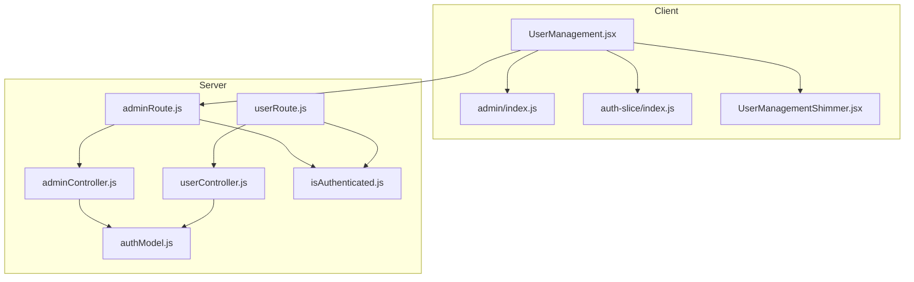
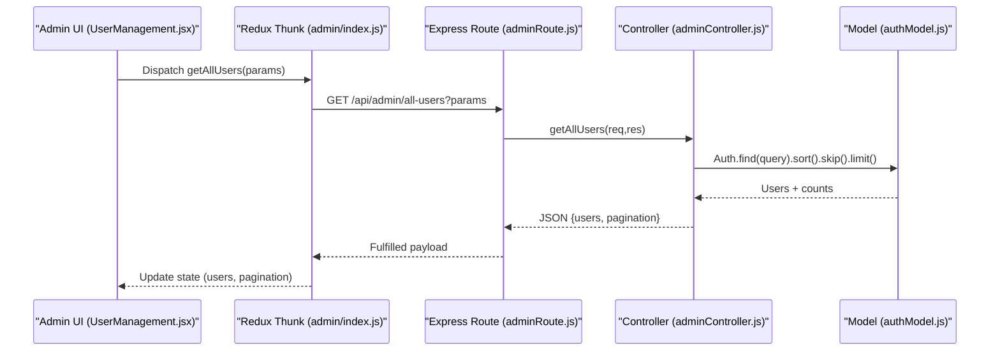
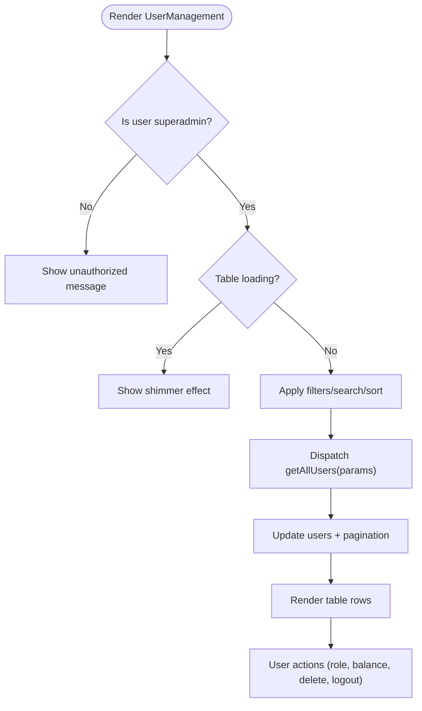
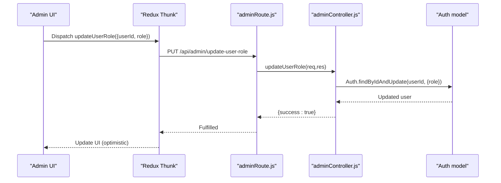
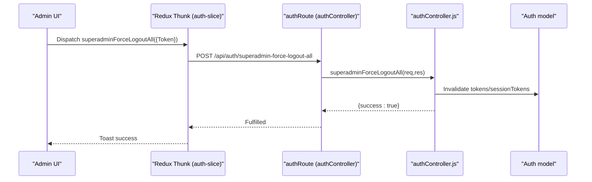
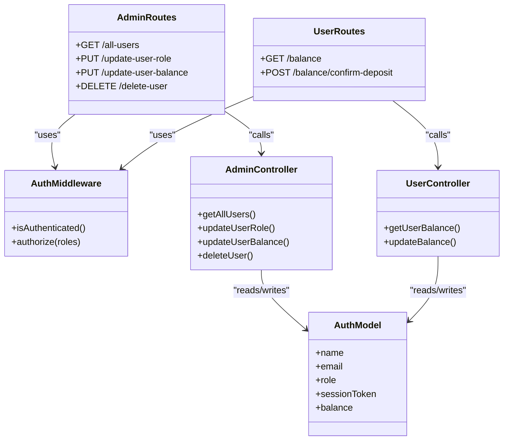
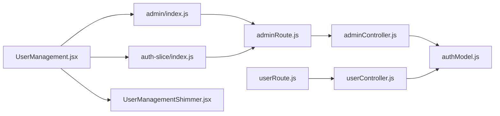

# User Management

<cite>
**Referenced Files in This Document**
- [UserManagement.jsx](file://client/src/Pages/adminPage/UserManagement.jsx)
- [admin/index.js](file://client/src/store/admin/index.js)
- [auth-slice/index.js](file://client/src/store/auth-slice/index.js)
- [UserManagementShimmer.jsx](file://client/src/shimmer-effect/UserManagementShimmer.jsx)
- [adminController.js](file://server/controllers/admin/adminController.js)
- [userController.js](file://server/controllers/users/userController.js)
- [adminRoute.js](file://server/routes/admin/adminRoute.js)
- [userRoute.js](file://server/routes/users/userRoute.js)
- [isAuthenticated.js](file://server/middleware/isAuthenticated.js)
- [authModel.js](file://server/models/authModel.js)
</cite>

## Table of Contents
1. [Introduction](#introduction)
2. [Project Structure](#project-structure)
3. [Core Components](#core-components)
4. [Architecture Overview](#architecture-overview)
5. [Detailed Component Analysis](#detailed-component-analysis)
6. [Dependency Analysis](#dependency-analysis)
7. [Performance Considerations](#performance-considerations)
8. [Troubleshooting Guide](#troubleshooting-guide)
9. [Conclusion](#conclusion)

## Introduction
This document provides comprehensive user management documentation for the administrative panel. It covers the user listing interface with filtering, searching, and sorting; user account status management (role updates and balance adjustments); user profile viewing/editing; bulk administrative actions; integration with backend APIs; user data visualization and statistics; and security measures including verification and compliance features.

## Project Structure
The user management feature spans the client-side React application and the server-side Express API:
- Client-side:
  - Administrative UI page for user listing and actions
  - Redux slices for admin operations and authentication
  - Loading shims for improved UX
- Server-side:
  - Admin controllers for user CRUD and statistics
  - User controllers for user-specific operations
  - Routes exposing admin and user endpoints
  - Authentication middleware and user model

**Diagram sources**
- [UserManagement.jsx](file://client/src/Pages/adminPage/UserManagement.jsx#L1-L554)
- [admin/index.js](file://client/src/store/admin/index.js#L206-L292)
- [auth-slice/index.js](file://client/src/store/auth-slice/index.js#L206-L255)
- [UserManagementShimmer.jsx](file://client/src/shimmer-effect/UserManagementShimmer.jsx#L1-L95)
- [adminController.js](file://server/controllers/admin/adminController.js#L5-L126)
- [userController.js](file://server/controllers/users/userController.js#L1-L49)
- [adminRoute.js](file://server/routes/admin/adminRoute.js#L1-L22)
- [userRoute.js](file://server/routes/users/userRoute.js#L1-L11)
- [isAuthenticated.js](file://server/middleware/isAuthenticated.js#L1-L62)
- [authModel.js](file://server/models/authModel.js#L1-L40)

**Section sources**
- [UserManagement.jsx](file://client/src/Pages/adminPage/UserManagement.jsx#L1-L554)
- [admin/index.js](file://client/src/store/admin/index.js#L206-L292)
- [auth-slice/index.js](file://client/src/store/auth-slice/index.js#L206-L255)
- [UserManagementShimmer.jsx](file://client/src/shimmer-effect/UserManagementShimmer.jsx#L1-L95)
- [adminController.js](file://server/controllers/admin/adminController.js#L5-L126)
- [userController.js](file://server/controllers/users/userController.js#L1-L49)
- [adminRoute.js](file://server/routes/admin/adminRoute.js#L1-L22)
- [userRoute.js](file://server/routes/users/userRoute.js#L1-L11)
- [isAuthenticated.js](file://server/middleware/isAuthenticated.js#L1-L62)
- [authModel.js](file://server/models/authModel.js#L1-L40)

## Core Components
- User listing page with:
  - Search by name or email
  - Role filter (user/admin/all)
  - Sorting by creation date
  - Pagination and infinite-load continuation
  - Statistics cards (total users, non-admin users, admins)
- Bulk actions:
  - Force logout all users
- Per-user actions:
  - Role modification (user/admin)
  - Balance adjustment
  - Delete user
  - Force logout single user
- Optimistic updates and loading states per action
- Authorization guard (superadmin only)

**Section sources**
- [UserManagement.jsx](file://client/src/Pages/adminPage/UserManagement.jsx#L38-L554)
- [admin/index.js](file://client/src/store/admin/index.js#L206-L292)
- [auth-slice/index.js](file://client/src/store/auth-slice/index.js#L206-L255)

## Architecture Overview
The admin user management flow integrates the client UI with server endpoints through Redux thunks and HTTP requests. Authentication middleware ensures only authorized users can access admin routes.

**Diagram sources**
- [UserManagement.jsx](file://client/src/Pages/adminPage/UserManagement.jsx#L86-L118)
- [admin/index.js](file://client/src/store/admin/index.js#L206-L226)
- [adminRoute.js](file://server/routes/admin/adminRoute.js#L14-L14)
- [adminController.js](file://server/controllers/admin/adminController.js#L5-L68)
- [authModel.js](file://server/models/authModel.js#L1-L40)

## Detailed Component Analysis

### User Listing Interface
- Filtering and searching:
  - Debounced search input updates query parameters
  - Role filter applied via select dropdown
  - Sorting by creation date with configurable order
- Pagination:
  - Current page, total pages, and next/previous indicators
  - Load more functionality for infinite scroll
- Statistics:
  - Total users, non-admin users, and admin counts rendered as cards
- Table:
  - Columns: Name, Email, Role, Balance, Registration date, Actions
  - Action buttons: Delete, Force Logout
  - Inline role selector and balance input with update button

**Diagram sources**
- [UserManagement.jsx](file://client/src/Pages/adminPage/UserManagement.jsx#L274-L295)
- [UserManagement.jsx](file://client/src/Pages/adminPage/UserManagement.jsx#L86-L118)
- [UserManagement.jsx](file://client/src/Pages/adminPage/UserManagement.jsx#L307-L550)

**Section sources**
- [UserManagement.jsx](file://client/src/Pages/adminPage/UserManagement.jsx#L43-L136)
- [UserManagement.jsx](file://client/src/Pages/adminPage/UserManagement.jsx#L307-L550)
- [UserManagementShimmer.jsx](file://client/src/shimmer-effect/UserManagementShimmer.jsx#L1-L95)

### User Account Status Management
- Role modification:
  - Optimistic UI update followed by server call
  - Reverts on failure with toast notification
- Balance adjustment:
  - Inline numeric input with immediate update
  - Optimistic update with revert on error
- Delete user:
  - Confirmation prompt
  - Removes user from UI and decrements totals
- Force logout:
  - Single user: per-user loading state
  - All users: global loading state with confirmation

**Diagram sources**
- [UserManagement.jsx](file://client/src/Pages/adminPage/UserManagement.jsx#L138-L172)
- [admin/index.js](file://client/src/store/admin/index.js#L227-L248)
- [adminRoute.js](file://server/routes/admin/adminRoute.js#L15-L15)
- [adminController.js](file://server/controllers/admin/adminController.js#L70-L88)
- [authModel.js](file://server/models/authModel.js#L15-L22)

**Section sources**
- [UserManagement.jsx](file://client/src/Pages/adminPage/UserManagement.jsx#L138-L236)
- [admin/index.js](file://client/src/store/admin/index.js#L227-L292)
- [adminController.js](file://server/controllers/admin/adminController.js#L70-L126)

### User Profile Viewing and Editing
- Profile viewing:
  - Accessible via user dashboard components
  - Displays user details (email, phone)
- Editing:
  - Profile editing is handled in user dashboard components
  - Not exposed in admin user management page

**Section sources**
- [UserManagement.jsx](file://client/src/Pages/adminPage/UserManagement.jsx#L1-L554)
- [UserDashboard.jsx](file://client/src/Pages/User/UserDashboard.jsx#L1-L34)
- [DashboardProfile.jsx](file://client/src/components/User/DashboardProfile.jsx#L169-L196)

### Bulk User Operations and Administrative Actions
- Bulk force logout:
  - Endpoint: POST /api/auth/superadmin-force-logout-all
  - Requires superadmin token
- Individual force logout:
  - Endpoint: POST /api/auth/superadmin-force-logout-user
  - Requires superadmin token and target userId

**Diagram sources**
- [UserManagement.jsx](file://client/src/Pages/adminPage/UserManagement.jsx#L259-L272)
- [auth-slice/index.js](file://client/src/store/auth-slice/index.js#L206-L230)
- [authController.js](file://server/controllers/auth/authController.js#L1-L255)

**Section sources**
- [UserManagement.jsx](file://client/src/Pages/adminPage/UserManagement.jsx#L259-L272)
- [auth-slice/index.js](file://client/src/store/auth-slice/index.js#L206-L255)

### Backend API Integration
- Admin endpoints:
  - GET /api/admin/all-users → getAllUsers
  - PUT /api/admin/update-user-role → updateUserRole
  - PUT /api/admin/update-user-balance → updateUserBalance
  - DELETE /api/admin/delete-user → deleteUser
- User endpoints:
  - GET /api/users/balance → getUserBalance
  - POST /api/users/balance/confirm-deposit → updateBalance
- Authentication:
  - Middleware verifies JWT and checks session validity
  - Superadmin authorization enforced in controllers

**Diagram sources**
- [adminRoute.js](file://server/routes/admin/adminRoute.js#L1-L22)
- [userRoute.js](file://server/routes/users/userRoute.js#L1-L11)
- [isAuthenticated.js](file://server/middleware/isAuthenticated.js#L1-L62)
- [adminController.js](file://server/controllers/admin/adminController.js#L5-L126)
- [userController.js](file://server/controllers/users/userController.js#L1-L49)
- [authModel.js](file://server/models/authModel.js#L1-L40)

**Section sources**
- [adminRoute.js](file://server/routes/admin/adminRoute.js#L1-L22)
- [userRoute.js](file://server/routes/users/userRoute.js#L1-L11)
- [adminController.js](file://server/controllers/admin/adminController.js#L5-L126)
- [userController.js](file://server/controllers/users/userController.js#L1-L49)
- [isAuthenticated.js](file://server/middleware/isAuthenticated.js#L1-L62)
- [authModel.js](file://server/models/authModel.js#L1-L40)

### User Data Visualization and Audit Trail
- Statistics cards:
  - Total users, non-admin users, admins
- Platform statistics (separate feature):
  - Aggregation pipeline for completed events, match-level stats, and overall commission
  - Pagination and date-range filtering
- Audit trail:
  - Not implemented in user management; platform-level statistics available

**Section sources**
- [UserManagement.jsx](file://client/src/Pages/adminPage/UserManagement.jsx#L307-L348)
- [adminController.js](file://server/controllers/admin/adminController.js#L128-L382)

### Security Measures, Verification Status, and Compliance
- Role-based access:
  - Superadmin-only access to user management actions
- Session invalidation:
  - Force logout terminates sessions by invalidating stored tokens
- Verification status:
  - Users marked as verified upon OTP completion
  - Login flow prevents access until verification
- Compliance:
  - JWT-based authentication with expiration handling
  - Strict authorization guards on admin endpoints

**Section sources**
- [UserManagement.jsx](file://client/src/Pages/adminPage/UserManagement.jsx#L274-L291)
- [isAuthenticated.js](file://server/middleware/isAuthenticated.js#L34-L40)
- [authModel.js](file://server/models/authModel.js#L9-L14)
- [authController.js](file://server/controllers/auth/authController.js#L195-L250)

## Dependency Analysis
- Client-side dependencies:
  - UserManagement.jsx depends on Redux thunks for admin operations and auth actions
  - Uses shimmer effect for loading states
- Server-side dependencies:
  - Admin routes depend on admin controller and authentication middleware
  - Controllers operate on the Auth model with role and session validations

**Diagram sources**
- [UserManagement.jsx](file://client/src/Pages/adminPage/UserManagement.jsx#L1-L554)
- [admin/index.js](file://client/src/store/admin/index.js#L206-L292)
- [auth-slice/index.js](file://client/src/store/auth-slice/index.js#L206-L255)
- [UserManagementShimmer.jsx](file://client/src/shimmer-effect/UserManagementShimmer.jsx#L1-L95)
- [adminRoute.js](file://server/routes/admin/adminRoute.js#L1-L22)
- [adminController.js](file://server/controllers/admin/adminController.js#L5-L126)
- [userRoute.js](file://server/routes/users/userRoute.js#L1-L11)
- [userController.js](file://server/controllers/users/userController.js#L1-L49)
- [authModel.js](file://server/models/authModel.js#L1-L40)

**Section sources**
- [UserManagement.jsx](file://client/src/Pages/adminPage/UserManagement.jsx#L1-L554)
- [admin/index.js](file://client/src/store/admin/index.js#L206-L292)
- [auth-slice/index.js](file://client/src/store/auth-slice/index.js#L206-L255)
- [adminRoute.js](file://server/routes/admin/adminRoute.js#L1-L22)
- [adminController.js](file://server/controllers/admin/adminController.js#L5-L126)
- [userRoute.js](file://server/routes/users/userRoute.js#L1-L11)
- [userController.js](file://server/controllers/users/userController.js#L1-L49)
- [authModel.js](file://server/models/authModel.js#L1-L40)

## Performance Considerations
- Debounced search reduces network requests during typing
- Pagination and load-more minimize initial payload sizes
- Optimistic UI updates improve perceived responsiveness; errors trigger rollback
- Aggregation queries for platform statistics are optimized with indexes and projections

## Troubleshooting Guide
- Unauthorized access:
  - Ensure user role is superadmin; otherwise UI displays unauthorized message
- Token issues:
  - Expired or invalid tokens trigger authentication failures; refresh or re-login
- Action failures:
  - Role/balance updates and deletions show toast errors; UI reverts optimistic changes
- Force logout:
  - Confirm action; global loading state indicates operation progress

**Section sources**
- [UserManagement.jsx](file://client/src/Pages/adminPage/UserManagement.jsx#L274-L291)
- [isAuthenticated.js](file://server/middleware/isAuthenticated.js#L12-L40)
- [UserManagement.jsx](file://client/src/Pages/adminPage/UserManagement.jsx#L138-L236)

## Conclusion
The administrative user management system provides a robust, secure, and efficient interface for listing, filtering, and managing users. It integrates seamlessly with backend APIs, supports bulk operations, and emphasizes user experience through optimistic updates and loading states. Security is enforced via role-based access and session invalidation, while verification and compliance are addressed through JWT and model-level controls.