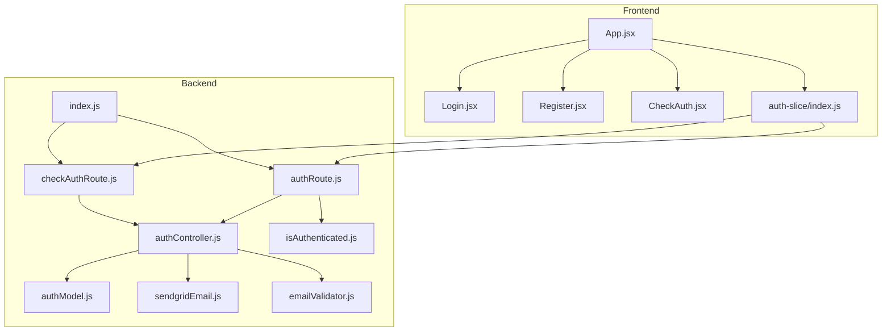
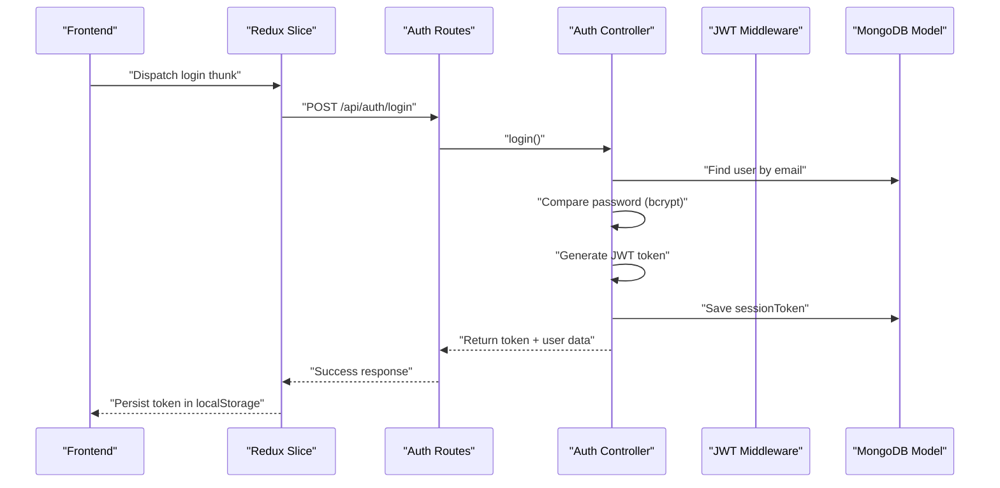
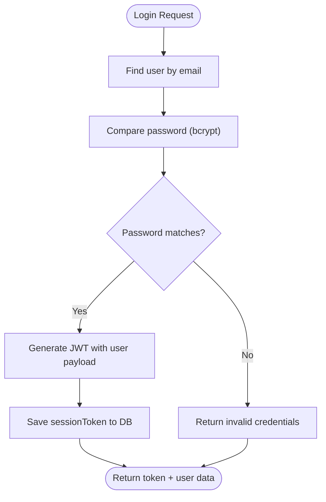
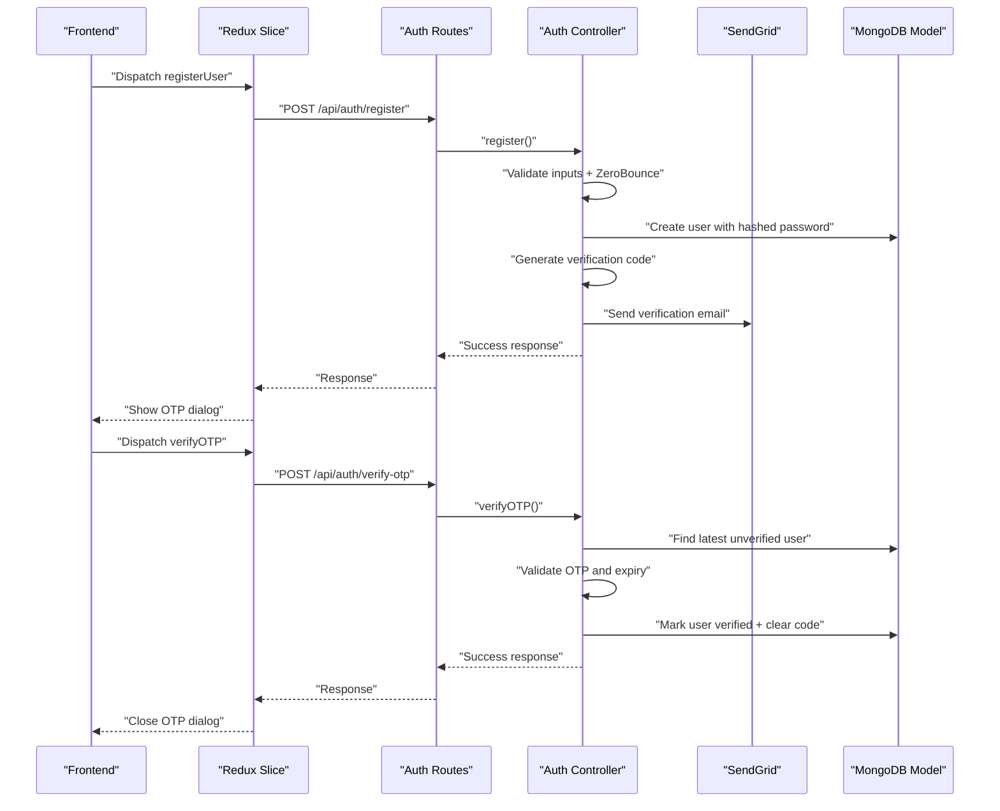
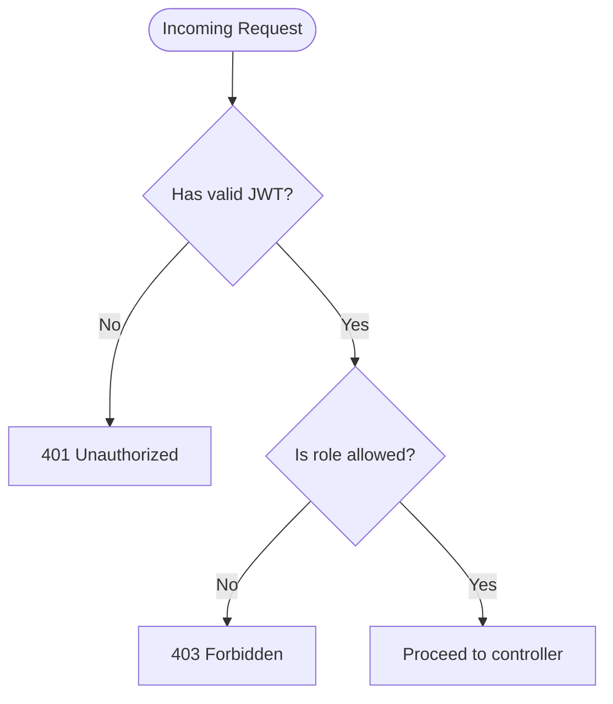
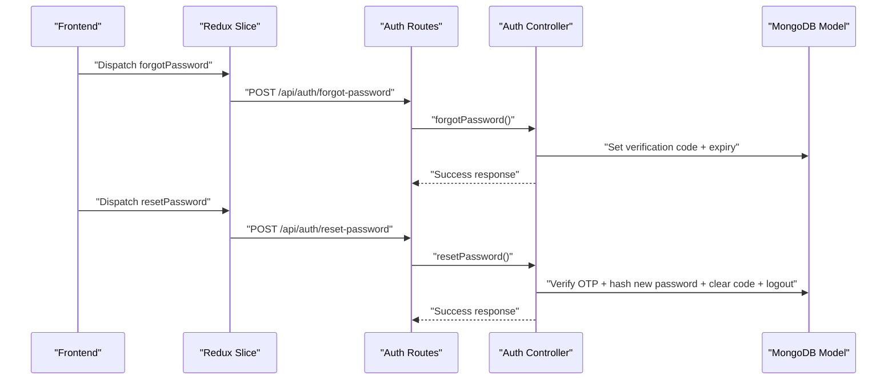
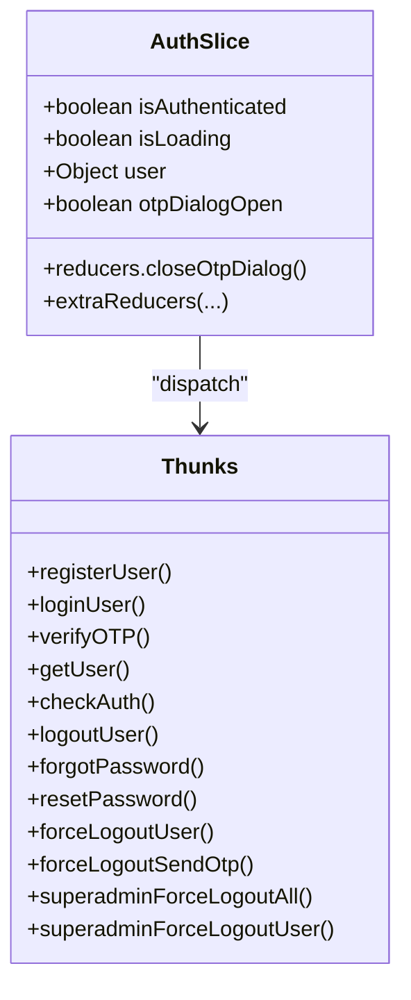
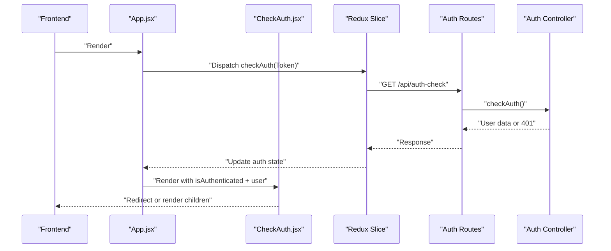
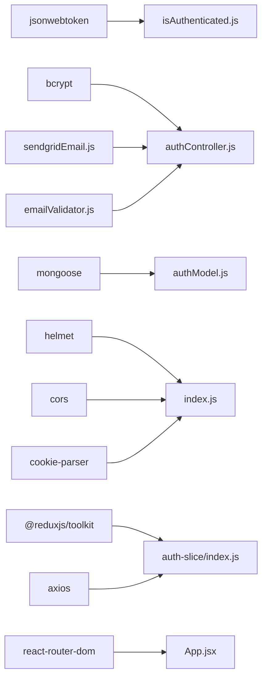

# Authentication System

<cite>
**Referenced Files in This Document**
- [authController.js](file://server/controllers/auth/authController.js)
- [isAuthenticated.js](file://server/middleware/isAuthenticated.js)
- [authModel.js](file://server/models/authModel.js)
- [authRoute.js](file://server/routes/auth/authRoute.js)
- [checkAuth.js](file://server/controllers/auth/checkAuth.js)
- [checkAuthRoute.js](file://server/routes/auth/checkAuth.js)
- [index.js](file://server/index.js)
- [sendgridEmail.js](file://server/config/sendgridEmail.js)
- [emailValidator.js](file://server/config/emailValidator.js)
- [auth-slice/index.js](file://client/src/store/auth-slice/index.js)
- [Login.jsx](file://client/src/Pages/authPage/Login.jsx)
- [Register.jsx](file://client/src/Pages/authPage/Register.jsx)
- [CheckAuth.jsx](file://client/src/components/common/CheckAuth.jsx)
- [App.jsx](file://client/src/App.jsx)
- [package.json](file://server/package.json)
</cite>

## Table of Contents
1. [Introduction](#introduction)
2. [Project Structure](#project-structure)
3. [Core Components](#core-components)
4. [Architecture Overview](#architecture-overview)
5. [Detailed Component Analysis](#detailed-component-analysis)
6. [Dependency Analysis](#dependency-analysis)
7. [Performance Considerations](#performance-considerations)
8. [Troubleshooting Guide](#troubleshooting-guide)
9. [Conclusion](#conclusion)

## Introduction
This document describes the authentication system for the betting platform. It covers JWT-based authentication, a multi-step registration flow with email verification and OTP, role-based access control (RBAC) with user, admin, and superadmin roles, password hashing, session management, and security measures. It also documents the authentication middleware, protected route handling, API endpoints, and frontend Redux-based state management. Finally, it includes troubleshooting guidance for common authentication issues.

## Project Structure
The authentication system spans the backend (Express server) and the frontend (React + Redux). Key areas:
- Backend
  - Controllers: handle registration, login, logout, OTP verification, password reset, and admin/superadmin forced logout
  - Middleware: JWT verification and role authorization
  - Models: user schema with roles, verification codes, and session tokens
  - Routes: public and protected endpoints
  - Config: email delivery via SendGrid and email validation via ZeroBounce
  - Security: Helmet, CORS, cookies, and rate limiting
- Frontend
  - Redux slice: async thunks for all auth actions, local storage for tokens
  - UI pages: Login and Registration forms with OTP dialogs
  - Routing guard: role-aware navigation

**Diagram sources**
- [index.js](file://server/index.js#L1-L76)
- [authRoute.js](file://server/routes/auth/authRoute.js#L1-L34)
- [checkAuthRoute.js](file://server/routes/auth/checkAuth.js#L1-L9)
- [authController.js](file://server/controllers/auth/authController.js#L1-L457)
- [isAuthenticated.js](file://server/middleware/isAuthenticated.js#L1-L62)
- [authModel.js](file://server/models/authModel.js#L1-L40)
- [sendgridEmail.js](file://server/config/sendgridEmail.js#L1-L58)
- [emailValidator.js](file://server/config/emailValidator.js#L1-L127)
- [auth-slice/index.js](file://client/src/store/auth-slice/index.js#L1-L342)
- [Login.jsx](file://client/src/Pages/authPage/Login.jsx#L1-L221)
- [Register.jsx](file://client/src/Pages/authPage/Register.jsx#L1-L223)
- [CheckAuth.jsx](file://client/src/components/common/CheckAuth.jsx#L1-L44)
- [App.jsx](file://client/src/App.jsx#L1-L114)

**Section sources**
- [index.js](file://server/index.js#L1-L76)
- [authRoute.js](file://server/routes/auth/authRoute.js#L1-L34)
- [authController.js](file://server/controllers/auth/authController.js#L1-L457)
- [isAuthenticated.js](file://server/middleware/isAuthenticated.js#L1-L62)
- [authModel.js](file://server/models/authModel.js#L1-L40)
- [sendgridEmail.js](file://server/config/sendgridEmail.js#L1-L58)
- [emailValidator.js](file://server/config/emailValidator.js#L1-L127)
- [auth-slice/index.js](file://client/src/store/auth-slice/index.js#L1-L342)
- [Login.jsx](file://client/src/Pages/authPage/Login.jsx#L1-L221)
- [Register.jsx](file://client/src/Pages/authPage/Register.jsx#L1-L223)
- [CheckAuth.jsx](file://client/src/components/common/CheckAuth.jsx#L1-L44)
- [App.jsx](file://client/src/App.jsx#L1-L114)

## Core Components
- JWT-based authentication
  - Token payload includes user identity and attributes; signed with a secret key
  - Middleware validates token signature, expiration, and checks for forced logout
- Multi-step registration
  - Initial registration stores hashed password and sets a temporary verification code
  - Email verification via SendGrid; OTP validated with expiry checks
- Role-based access control
  - Roles: user, admin, superadmin
  - Authorization middleware restricts routes by role
- Password hashing
  - bcrypt used for password hashing during registration and password reset
- Session management
  - sessionToken stored per user; logout clears token; admin can force logout
- Frontend state management
  - Redux slice manages loading, auth state, user data, and OTP dialog visibility
  - Local storage persists token; pages coordinate OTP verification and redirects

**Section sources**
- [authController.js](file://server/controllers/auth/authController.js#L195-L250)
- [isAuthenticated.js](file://server/middleware/isAuthenticated.js#L1-L62)
- [authModel.js](file://server/models/authModel.js#L15-L22)
- [auth-slice/index.js](file://client/src/store/auth-slice/index.js#L1-L342)

## Architecture Overview
The system uses a layered architecture:
- Presentation layer: React pages and Redux slice
- Application layer: Express routes delegating to controllers
- Domain layer: Controllers implement business logic
- Infrastructure layer: JWT middleware, MongoDB model, email services

**Diagram sources**
- [auth-slice/index.js](file://client/src/store/auth-slice/index.js#L49-L63)
- [authRoute.js](file://server/routes/auth/authRoute.js#L20-L21)
- [authController.js](file://server/controllers/auth/authController.js#L195-L250)
- [isAuthenticated.js](file://server/middleware/isAuthenticated.js#L12-L44)
- [authModel.js](file://server/models/authModel.js#L21-L22)

## Detailed Component Analysis

### JWT Authentication Flow
- Token generation
  - On successful login, a JWT is signed with a secret key and stored in the user’s sessionToken field
- Token validation
  - Middleware extracts Authorization header, verifies signature, decodes payload, and checks user existence
  - Enforces session termination if sessionToken differs or is missing
- Protected routes
  - Apply isAuthenticated to require a valid token
  - Use authorize([...roles]) to enforce RBAC

**Diagram sources**
- [authController.js](file://server/controllers/auth/authController.js#L195-L250)
- [authModel.js](file://server/models/authModel.js#L21-L22)

**Section sources**
- [authController.js](file://server/controllers/auth/authController.js#L195-L250)
- [isAuthenticated.js](file://server/middleware/isAuthenticated.js#L12-L44)
- [authRoute.js](file://server/routes/auth/authRoute.js#L23-L24)

### Multi-Step Registration and OTP System
- Registration
  - Validates required fields, phone format, and email eligibility via ZeroBounce
  - Hashes password and creates a user record with a 10-minute verification code
  - Sends verification email via SendGrid
- OTP resend and verification
  - Resend OTP updates the verification code and expiry
  - Verify OTP compares code, checks expiry, marks user verified, and clears verification fields
- Frontend integration
  - Registration page collects form data, dispatches registerUser thunk, and shows OTP dialog
  - Login page handles verified vs pending verification states and OTP dialog

**Diagram sources**
- [Register.jsx](file://client/src/Pages/authPage/Register.jsx#L35-L80)
- [Login.jsx](file://client/src/Pages/authPage/Login.jsx#L30-L61)
- [auth-slice/index.js](file://client/src/store/auth-slice/index.js#L12-L81)
- [authRoute.js](file://server/routes/auth/authRoute.js#L20-L22)
- [authController.js](file://server/controllers/auth/authController.js#L50-L124)
- [authController.js](file://server/controllers/auth/authController.js#L150-L193)
- [sendgridEmail.js](file://server/config/sendgridEmail.js#L6-L31)
- [emailValidator.js](file://server/config/emailValidator.js#L10-L126)

**Section sources**
- [authController.js](file://server/controllers/auth/authController.js#L50-L124)
- [authController.js](file://server/controllers/auth/authController.js#L125-L149)
- [authController.js](file://server/controllers/auth/authController.js#L150-L193)
- [Register.jsx](file://client/src/Pages/authPage/Register.jsx#L35-L80)
- [Login.jsx](file://client/src/Pages/authPage/Login.jsx#L30-L61)
- [sendgridEmail.js](file://server/config/sendgridEmail.js#L1-L58)
- [emailValidator.js](file://server/config/emailValidator.js#L1-L127)

### Role-Based Access Control (RBAC)
- Roles
  - Enumerated in the model: user, admin, superadmin
- Authorization middleware
  - authorize(...) checks if the authenticated user’s role is included in allowed roles
- Protected routes
  - Superadmin endpoints are guarded by authorize('superadmin')

**Diagram sources**
- [isAuthenticated.js](file://server/middleware/isAuthenticated.js#L51-L61)
- [authModel.js](file://server/models/authModel.js#L15-L20)
- [authRoute.js](file://server/routes/auth/authRoute.js#L30-L31)

**Section sources**
- [authModel.js](file://server/models/authModel.js#L15-L20)
- [isAuthenticated.js](file://server/middleware/isAuthenticated.js#L51-L61)
- [authRoute.js](file://server/routes/auth/authRoute.js#L30-L31)

### Password Reset and Force Logout Mechanisms
- Password reset
  - Generates a 10-minute OTP, compares with submitted OTP, hashes new password, clears verification code, and logs out the user
- Force logout
  - Sends OTP for logout; verifies OTP and clears sessionToken
  - Superadmin can force logout all non-admin users or a specific user

**Diagram sources**
- [auth-slice/index.js](file://client/src/store/auth-slice/index.js#L170-L205)
- [authRoute.js](file://server/routes/auth/authRoute.js#L25-L26)
- [authController.js](file://server/controllers/auth/authController.js#L356-L425)

**Section sources**
- [authController.js](file://server/controllers/auth/authController.js#L356-L425)
- [authController.js](file://server/controllers/auth/authController.js#L268-L337)
- [authController.js](file://server/controllers/auth/authController.js#L428-L456)

### Frontend Authentication State Management (Redux)
- Async thunks
  - registerUser, loginUser, verifyOTP, getUser, checkAuth, logoutUser, forgotPassword, resetPassword, forceLogoutUser, forceLogoutSendOtp, superadminForceLogoutAll, superadminForceLogoutUser
- State fields
  - isAuthenticated, isLoading, user, otpDialogOpen
- Behavior
  - Persist token on successful login
  - Clear token on logout and failed auth checks
  - Open/close OTP dialog based on server responses

**Diagram sources**
- [auth-slice/index.js](file://client/src/store/auth-slice/index.js#L257-L342)

**Section sources**
- [auth-slice/index.js](file://client/src/store/auth-slice/index.js#L1-L342)

### Protected Route Handling and Navigation Guards
- Backend
  - isAuthenticated middleware protects routes; authorize(...) restricts by role
  - checkAuth endpoint returns current user data for client-side hydration
- Frontend
  - App performs initial auth check on non-default routes
  - CheckAuth component enforces redirect logic based on authentication and role

**Diagram sources**
- [App.jsx](file://client/src/App.jsx#L27-L43)
- [checkAuthRoute.js](file://server/routes/auth/checkAuth.js#L1-L9)
- [checkAuth.js](file://server/controllers/auth/checkAuth.js#L1-L14)
- [CheckAuth.jsx](file://client/src/components/common/CheckAuth.jsx#L4-L41)

**Section sources**
- [isAuthenticated.js](file://server/middleware/isAuthenticated.js#L3-L49)
- [checkAuthRoute.js](file://server/routes/auth/checkAuth.js#L1-L9)
- [checkAuth.js](file://server/controllers/auth/checkAuth.js#L1-L14)
- [App.jsx](file://client/src/App.jsx#L27-L43)
- [CheckAuth.jsx](file://client/src/components/common/CheckAuth.jsx#L4-L41)

### API Endpoints Summary
- Public
  - POST /api/auth/register
  - POST /api/auth/login
  - POST /api/auth/verify-otp
  - POST /api/auth/resend-otp
  - POST /api/auth/forgot-password
  - POST /api/auth/reset-password
- Protected
  - POST /api/auth/logout
  - GET /api/auth/get-user
  - POST /api/auth/force-logout
  - POST /api/auth/force-logout-send-otp
  - POST /api/auth/superadmin-force-logout-all
  - POST /api/auth/superadmin-force-logout-user
- Auth check
  - GET /api/auth-check

**Section sources**
- [authRoute.js](file://server/routes/auth/authRoute.js#L1-L34)

## Dependency Analysis
- Backend dependencies
  - jsonwebtoken for JWT signing/verification
  - bcrypt for password hashing
  - mongoose for user model
  - @sendgrid/mail for email delivery
  - @zerobounce/zero-bounce-sdk for email validation
  - helmet for security headers
  - cors for cross-origin policy
  - cookie-parser for cookie handling
- Frontend dependencies
  - @reduxjs/toolkit for Redux state management
  - axios for HTTP requests
  - react-router-dom for routing and guards

**Diagram sources**
- [isAuthenticated.js](file://server/middleware/isAuthenticated.js#L1-L2)
- [authController.js](file://server/controllers/auth/authController.js#L1-L6)
- [authModel.js](file://server/models/authModel.js#L1-L2)
- [sendgridEmail.js](file://server/config/sendgridEmail.js#L1-L4)
- [emailValidator.js](file://server/config/emailValidator.js#L1-L8)
- [index.js](file://server/index.js#L17-L59)
- [auth-slice/index.js](file://client/src/store/auth-slice/index.js#L1-L3)

**Section sources**
- [package.json](file://server/package.json#L19-L37)
- [index.js](file://server/index.js#L1-L76)
- [auth-slice/index.js](file://client/src/store/auth-slice/index.js#L1-L3)

## Performance Considerations
- Token verification overhead
  - Each protected request triggers JWT verification and a DB lookup for sessionToken
- Recommendations
  - Consider short-lived access tokens with a refresh mechanism if scaling
  - Cache recent verified tokens per IP or implement token blacklists for revoked sessions
  - Optimize DB indexes on email, role, and createdAt fields as used in queries

[No sources needed since this section provides general guidance]

## Troubleshooting Guide
- Common issues and resolutions
  - Invalid credentials
    - Cause: incorrect email/password
    - Action: prompt user to re-enter; ensure email is case-sensitive
  - Account not verified
    - Cause: verified flag false with OTP present
    - Action: show OTP dialog; resend OTP if needed
  - OTP expired or invalid
    - Cause: OTP mismatch or expiry beyond 10 minutes
    - Action: resend OTP; confirm user receives email
  - Session expired or terminated
    - Cause: token invalid/expired or forced logout
    - Action: redirect to login; frontend should clear local token
  - Email delivery failures
    - Cause: SendGrid errors or bounce reasons
    - Action: retry resend; check bounceReason in error logs
  - Rate limiting or CORS errors
    - Cause: excessive requests or unauthorized origins
    - Action: adjust rate limits; verify client base URLs
- Frontend diagnostics
  - Verify localStorage contains a token after login
  - Confirm Redux state reflects isAuthenticated and user fields
  - Use browser devtools Network tab to inspect auth requests and responses

**Section sources**
- [authController.js](file://server/controllers/auth/authController.js#L7-L20)
- [authController.js](file://server/controllers/auth/authController.js#L172-L180)
- [isAuthenticated.js](file://server/middleware/isAuthenticated.js#L14-L23)
- [sendgridEmail.js](file://server/config/sendgridEmail.js#L31-L57)
- [index.js](file://server/index.js#L27-L51)
- [auth-slice/index.js](file://client/src/store/auth-slice/index.js#L331-L337)

## Conclusion
The authentication system combines robust JWT-based authentication, a secure multi-step registration flow with OTP, and role-based access control. Backend middleware ensures token validity and session integrity, while the frontend Redux slice centralizes state and user experience. Security is strengthened through Helmet, CORS, email validation, and controlled sessionToken management. The documented endpoints and flows provide a clear blueprint for extending or troubleshooting the system.