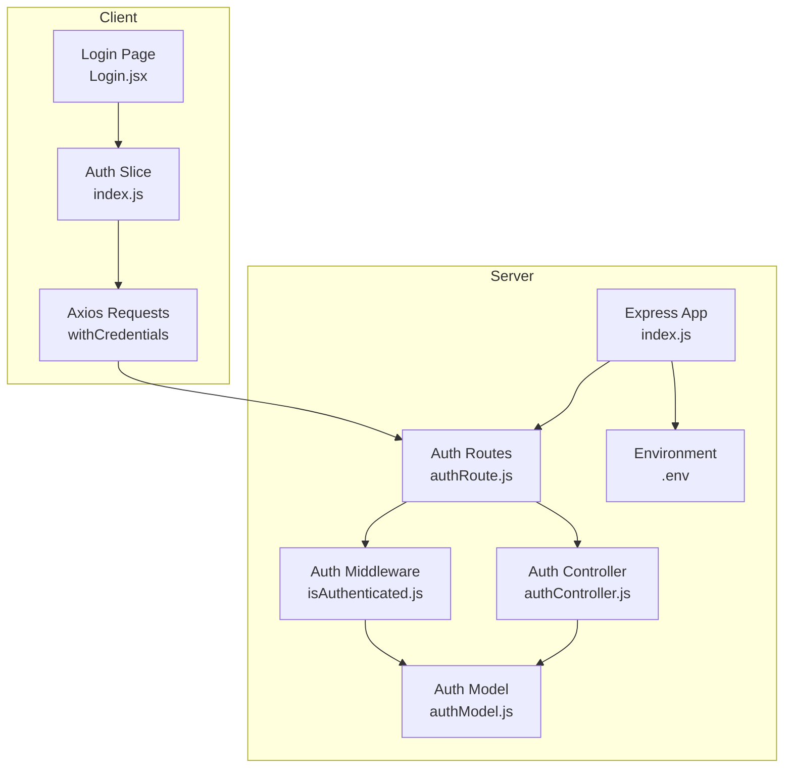
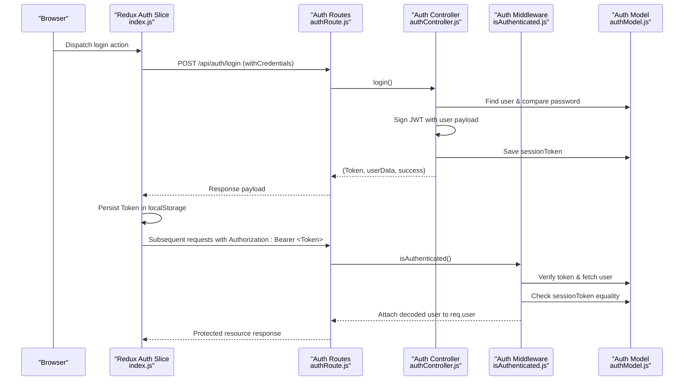
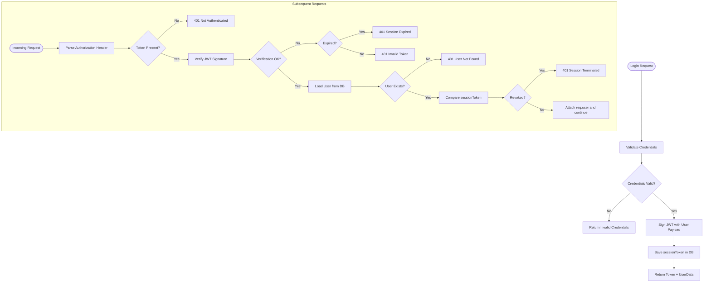
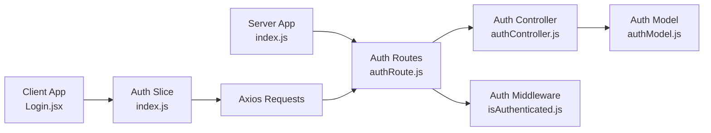

# JWT Authentication Flow

<cite>
**Referenced Files in This Document**
- [authController.js](file://server/controllers/auth/authController.js)
- [isAuthenticated.js](file://server/middleware/isAuthenticated.js)
- [authModel.js](file://server/models/authModel.js)
- [authRoute.js](file://server/routes/auth/authRoute.js)
- [checkAuth.js](file://server/controllers/auth/checkAuth.js)
- [index.js](file://server/index.js)
- [.env](file://server/.env)
- [index.js](file://client/src/store/auth-slice/index.js)
- [Login.jsx](file://client/src/Pages/authPage/Login.jsx)
- [index.js](file://client/src/config/index.js)
- [.env](file://client/.env)
- [package.json](file://server/package.json)
- [package.json](file://client/package.json)
</cite>

## Table of Contents
1. [Introduction](#introduction)
2. [Project Structure](#project-structure)
3. [Core Components](#core-components)
4. [Architecture Overview](#architecture-overview)
5. [Detailed Component Analysis](#detailed-component-analysis)
6. [Dependency Analysis](#dependency-analysis)
7. [Performance Considerations](#performance-considerations)
8. [Troubleshooting Guide](#troubleshooting-guide)
9. [Conclusion](#conclusion)
10. [Appendices](#appendices)

## Introduction
This document explains the complete JWT authentication flow for the betting platform, covering token lifecycle, middleware protection, protected routes, token verification, header parsing, error handling, secure storage, and frontend integration via Redux. It also documents how tokens are automatically injected into API requests and outlines security considerations such as token expiration, renewal strategies, and secure transmission.

## Project Structure
The authentication system spans two primary layers:
- Server-side: Express routes, controller logic, middleware, and MongoDB model for JWT-backed sessions.
- Client-side: Redux slices for state management, async thunks for API calls, and UI pages for login and OTP verification.

**Diagram sources**
- [Login.jsx](file://client/src/Pages/authPage/Login.jsx#L1-L221)
- [index.js](file://client/src/store/auth-slice/index.js#L1-L342)
- [authRoute.js](file://server/routes/auth/authRoute.js#L1-L34)
- [authController.js](file://server/controllers/auth/authController.js#L1-L457)
- [isAuthenticated.js](file://server/middleware/isAuthenticated.js#L1-L62)
- [authModel.js](file://server/models/authModel.js#L1-L40)
- [index.js](file://server/index.js#L1-L150)
- [.env](file://server/.env#L1-L44)

**Section sources**
- [authRoute.js](file://server/routes/auth/authRoute.js#L1-L34)
- [authController.js](file://server/controllers/auth/authController.js#L1-L457)
- [isAuthenticated.js](file://server/middleware/isAuthenticated.js#L1-L62)
- [authModel.js](file://server/models/authModel.js#L1-L40)
- [index.js](file://server/index.js#L1-L150)
- [.env](file://server/.env#L1-L44)
- [index.js](file://client/src/store/auth-slice/index.js#L1-L342)
- [Login.jsx](file://client/src/Pages/authPage/Login.jsx#L1-L221)
- [.env](file://client/.env#L1-L3)

## Core Components
- Server routes define endpoints for registration, login, logout, user retrieval, OTP handling, password reset, and admin force logout.
- Middleware validates Authorization headers, verifies JWT signatures, checks token revocation, and attaches user payload to the request.
- Controller signs JWTs with user attributes and stores the token in the user record for session invalidation.
- Model defines the schema for user data, including sessionToken used to invalidate active sessions.
- Client Redux slice manages authentication state, persists tokens in local storage, and injects Authorization headers on requests.

Key implementation references:
- JWT signing and sessionToken storage on login: [authController.js](file://server/controllers/auth/authController.js#L227-L240)
- Middleware token verification and revocation check: [isAuthenticated.js](file://server/middleware/isAuthenticated.js#L12-L44)
- Protected route usage: [authRoute.js](file://server/routes/auth/authRoute.js#L23-L24)
- Client token persistence and header injection: [index.js](file://client/src/store/auth-slice/index.js#L290-L291)

**Section sources**
- [authController.js](file://server/controllers/auth/authController.js#L227-L240)
- [isAuthenticated.js](file://server/middleware/isAuthenticated.js#L12-L44)
- [authRoute.js](file://server/routes/auth/authRoute.js#L23-L24)
- [index.js](file://client/src/store/auth-slice/index.js#L290-L291)

## Architecture Overview
The JWT authentication flow follows a standard pattern:
- Client sends credentials to the server.
- Server validates credentials and issues a signed JWT stored in the user record.
- Client stores the token and includes it in Authorization headers for subsequent requests.
- Middleware verifies the token, ensures the user still exists, and checks that the token has not been invalidated.

**Diagram sources**
- [index.js](file://client/src/store/auth-slice/index.js#L49-L63)
- [authRoute.js](file://server/routes/auth/authRoute.js#L21-L24)
- [authController.js](file://server/controllers/auth/authController.js#L195-L250)
- [isAuthenticated.js](file://server/middleware/isAuthenticated.js#L3-L49)
- [authModel.js](file://server/models/authModel.js#L21-L21)

## Detailed Component Analysis

### Server-Side JWT Lifecycle
- Generation: On successful credential validation, the server signs a JWT containing user attributes and stores it in the user record as sessionToken.
- Validation: Middleware extracts the Authorization header, splits by whitespace, and verifies the token against the secret. It distinguishes expired vs invalid tokens and checks revocation by comparing sessionToken.
- Revocation: If the stored sessionToken differs from the incoming token or is null, the request is rejected with a force logout signal.

**Diagram sources**
- [authController.js](file://server/controllers/auth/authController.js#L195-L250)
- [isAuthenticated.js](file://server/middleware/isAuthenticated.js#L12-L44)
- [authModel.js](file://server/models/authModel.js#L21-L21)

**Section sources**
- [authController.js](file://server/controllers/auth/authController.js#L195-L250)
- [isAuthenticated.js](file://server/middleware/isAuthenticated.js#L12-L44)
- [authModel.js](file://server/models/authModel.js#L21-L21)

### Protected Routes and Authorization Roles
- Routes requiring authentication apply the isAuthenticated middleware.
- Role-based authorization uses an authorize higher-order function to restrict access to superadmin-only endpoints.

References:
- Protected GET user: [authRoute.js](file://server/routes/auth/authRoute.js#L24)
- Superadmin-only routes: [authRoute.js](file://server/routes/auth/authRoute.js#L30-L31)
- Middleware implementation: [isAuthenticated.js](file://server/middleware/isAuthenticated.js#L51-L61)

**Section sources**
- [authRoute.js](file://server/routes/auth/authRoute.js#L24-L31)
- [isAuthenticated.js](file://server/middleware/isAuthenticated.js#L51-L61)

### Token Structure and Expiration Handling
- Token payload includes user identifiers and attributes returned during login.
- Expiration is enforced by the JWT library; middleware differentiates expired vs invalid tokens and responds accordingly.
- No explicit refresh mechanism is implemented server-side; clients should rely on re-authentication upon expiration.

References:
- JWT signing: [authController.js](file://server/controllers/auth/authController.js#L227-L238)
- Expiration handling: [isAuthenticated.js](file://server/middleware/isAuthenticated.js#L14-L18)

**Section sources**
- [authController.js](file://server/controllers/auth/authController.js#L227-L238)
- [isAuthenticated.js](file://server/middleware/isAuthenticated.js#L14-L18)

### Secure Storage Practices
- Client stores the JWT in localStorage after successful login.
- Requests include withCredentials to support cookies if needed and Authorization headers for bearer tokens.
- Environment variables configure the JWT secret and base URLs.

References:
- Local storage persistence: [index.js](file://client/src/store/auth-slice/index.js#L290-L291)
- Authorization header injection: [index.js](file://client/src/store/auth-slice/index.js#L84-L90)
- Environment configuration: [.env](file://server/.env#L4-L4)

**Section sources**
- [index.js](file://client/src/store/auth-slice/index.js#L290-L291)
- [index.js](file://client/src/store/auth-slice/index.js#L84-L90)
- [.env](file://server/.env#L4-L4)

### Authentication Middleware Implementation
- Extracts token from Authorization header, verifies signature, loads user, and checks revocation via sessionToken.
- Returns structured error messages for expired, invalid, and revoked tokens.

References:
- Header parsing and verification: [isAuthenticated.js](file://server/middleware/isAuthenticated.js#L5-L44)

**Section sources**
- [isAuthenticated.js](file://server/middleware/isAuthenticated.js#L5-L44)

### Frontend Integration and Redux State Management
- Async thunks handle login, logout, user retrieval, OTP resend/verify, and password reset.
- Successful login updates authentication state and persists the token.
- Protected requests include Authorization headers with the stored token.
- Logout clears the token from storage and resets state.

References:
- Login thunk and state update: [index.js](file://client/src/store/auth-slice/index.js#L49-L63)
- Token persistence: [index.js](file://client/src/store/auth-slice/index.js#L290-L291)
- Protected request headers: [index.js](file://client/src/store/auth-slice/index.js#L84-L90)
- Logout thunk: [index.js](file://client/src/store/auth-slice/index.js#L117-L130)

**Section sources**
- [index.js](file://client/src/store/auth-slice/index.js#L49-L63)
- [index.js](file://client/src/store/auth-slice/index.js#L290-L291)
- [index.js](file://client/src/store/auth-slice/index.js#L84-L90)
- [index.js](file://client/src/store/auth-slice/index.js#L117-L130)

### Practical Examples

#### API Request with Bearer Token
- Include Authorization header with Bearer scheme.
- Example path references:
  - Header injection for protected requests: [index.js](file://client/src/store/auth-slice/index.js#L84-L90)
  - Logout request with Authorization: [index.js](file://client/src/store/auth-slice/index.js#L118-L127)

**Section sources**
- [index.js](file://client/src/store/auth-slice/index.js#L84-L90)
- [index.js](file://client/src/store/auth-slice/index.js#L118-L127)

#### Frontend Login Flow
- Dispatch login thunk with credentials.
- On success, persist token and redirect.
- Example path references:
  - Login page submission: [Login.jsx](file://client/src/Pages/authPage/Login.jsx#L30-L33)
  - Redux login thunk: [index.js](file://client/src/store/auth-slice/index.js#L49-L63)

**Section sources**
- [Login.jsx](file://client/src/Pages/authPage/Login.jsx#L30-L33)
- [index.js](file://client/src/store/auth-slice/index.js#L49-L63)

## Dependency Analysis
- Server depends on jsonwebtoken for signing/verifying tokens and mongoose for user persistence.
- Client depends on axios for HTTP requests and Redux Toolkit for state management.
- Environment variables supply secrets and base URLs.

**Diagram sources**
- [index.js](file://server/index.js#L1-L150)
- [authRoute.js](file://server/routes/auth/authRoute.js#L1-L34)
- [authController.js](file://server/controllers/auth/authController.js#L1-L457)
- [isAuthenticated.js](file://server/middleware/isAuthenticated.js#L1-L62)
- [authModel.js](file://server/models/authModel.js#L1-L40)
- [Login.jsx](file://client/src/Pages/authPage/Login.jsx#L1-L221)
- [index.js](file://client/src/store/auth-slice/index.js#L1-L342)

**Section sources**
- [package.json](file://server/package.json#L19-L37)
- [package.json](file://client/package.json#L14-L51)
- [index.js](file://server/index.js#L1-L150)
- [index.js](file://client/src/store/auth-slice/index.js#L1-L342)

## Performance Considerations
- Token verification occurs per request; keep payload minimal to reduce overhead.
- Use short-lived tokens and avoid long sessions to minimize exposure windows.
- Consider adding rate limiting around authentication endpoints to mitigate brute-force attacks.
- Ensure database indexes on user lookup fields to optimize middleware user loading.

## Troubleshooting Guide
Common issues and resolutions:
- 401 Not Authenticated: Missing or malformed Authorization header. Ensure the header is present and formatted as Bearer <token>.
- 401 Session Expired: Token expired. Trigger re-login flow.
- 401 Invalid Token: Signature verification failed. Confirm JWT_SECRET_KEY correctness.
- 401 Session Terminated: Token invalidated (e.g., force logout). Clear local token and prompt re-login.
- User Not Found: User deleted or corrupted. Clear local state and re-authenticate.
- CORS Errors: Origin not allowed. Verify CLIENT_BASE_URL and CORS configuration.

References:
- Middleware error handling: [isAuthenticated.js](file://server/middleware/isAuthenticated.js#L14-L39)
- Client logout cleanup: [index.js](file://client/src/store/auth-slice/index.js#L336-L337)
- CORS configuration: [index.js](file://server/index.js#L34-L51)

**Section sources**
- [isAuthenticated.js](file://server/middleware/isAuthenticated.js#L14-L39)
- [index.js](file://client/src/store/auth-slice/index.js#L336-L337)
- [index.js](file://server/index.js#L34-L51)

## Conclusion
The system implements a robust JWT-based authentication flow with middleware-driven validation, session revocation via stored tokens, and client-side state management with automatic header injection. While no built-in refresh mechanism exists, the design supports secure token handling and straightforward re-authentication upon expiration.

## Appendices

### Token Lifecycle Summary
- Generate: Sign JWT on successful login and save sessionToken.
- Validate: Verify signature, load user, and confirm sessionToken equality.
- Invalidate: Clear sessionToken to terminate sessions.
- Renew: Re-authenticate when token expires.

References:
- Signing and saving token: [authController.js](file://server/controllers/auth/authController.js#L227-L240)
- Revocation check: [isAuthenticated.js](file://server/middleware/isAuthenticated.js#L33-L40)
- Logout clearing token: [authController.js](file://server/controllers/auth/authController.js#L252-L266)

**Section sources**
- [authController.js](file://server/controllers/auth/authController.js#L227-L240)
- [isAuthenticated.js](file://server/middleware/isAuthenticated.js#L33-L40)
- [authController.js](file://server/controllers/auth/authController.js#L252-L266)