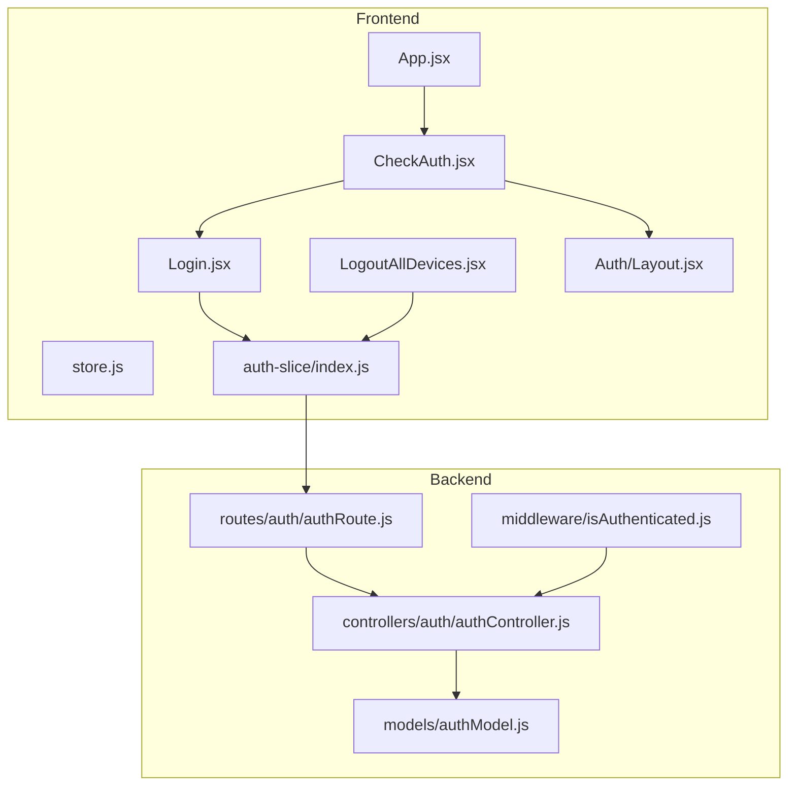
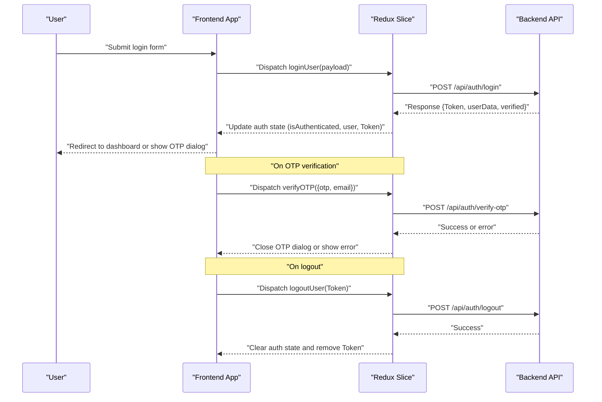
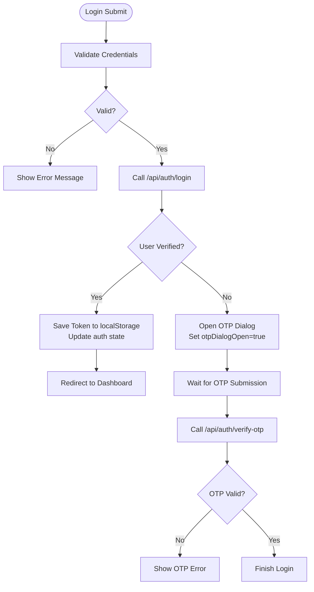
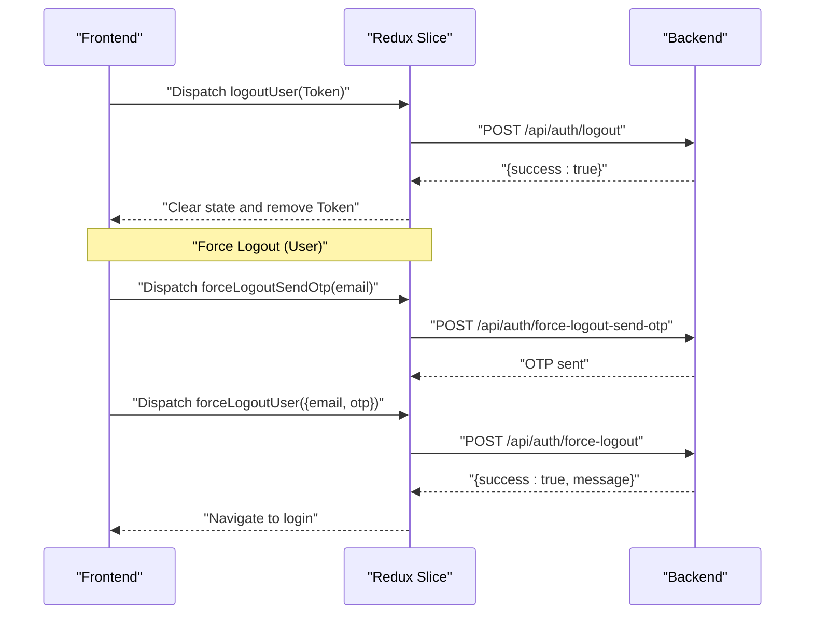
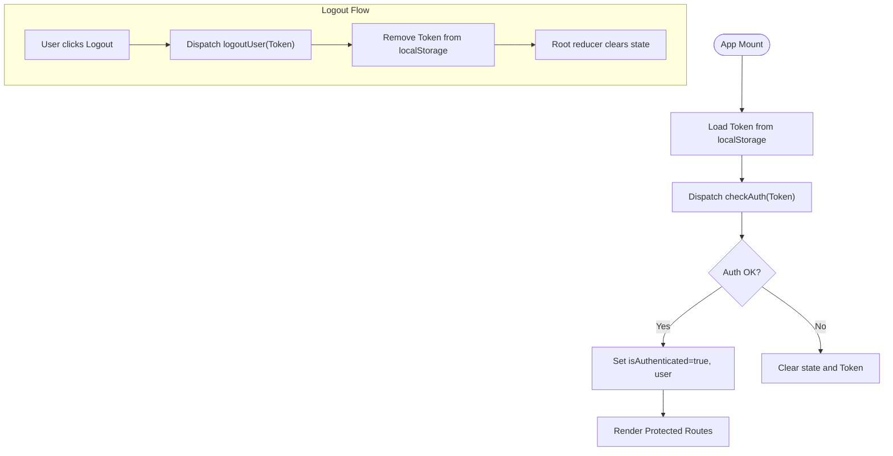
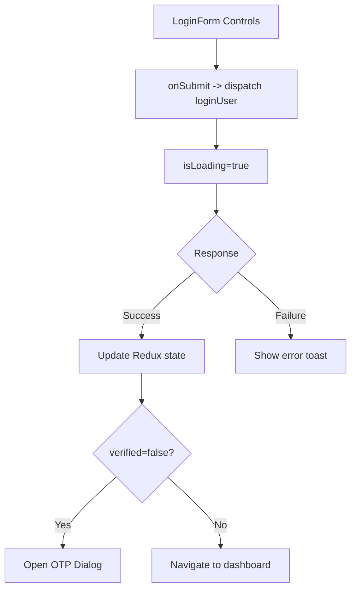
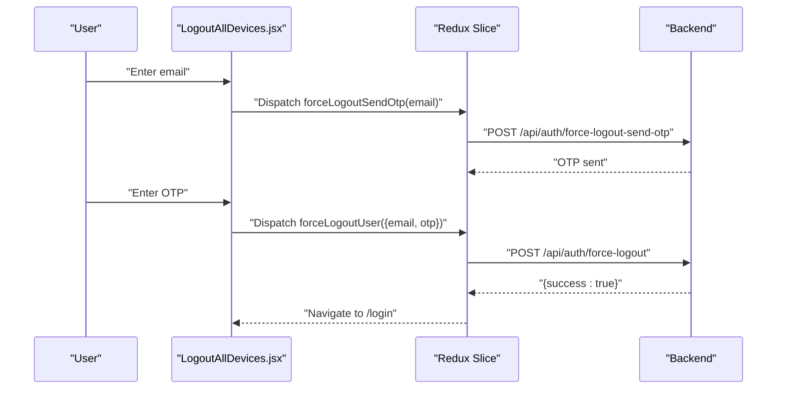
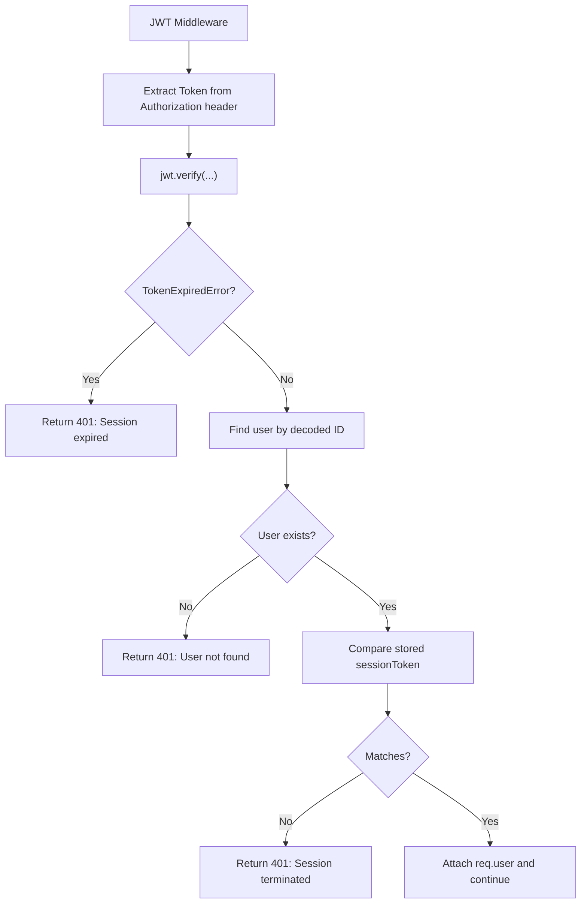
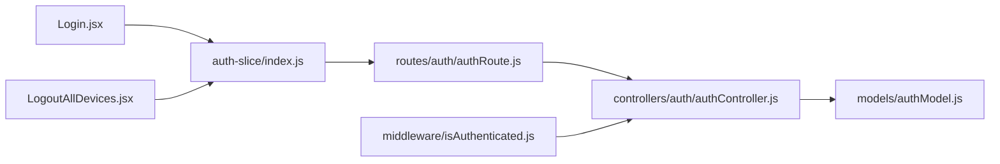

# Login and Logout Mechanisms

<cite>
**Referenced Files in This Document**
- [Login.jsx](file://client/src/Pages/authPage/Login.jsx)
- [LogoutAllDevices.jsx](file://client/src/Pages/LogoutAllDevices.jsx)
- [index.js](file://client/src/store/auth-slice/index.js)
- [store.js](file://client/src/store/store.js)
- [App.jsx](file://client/src/App.jsx)
- [CheckAuth.jsx](file://client/src/components/common/CheckAuth.jsx)
- [Layout.jsx](file://client/src/components/Auth/Layout.jsx)
- [authController.js](file://server/controllers/auth/authController.js)
- [isAuthenticated.js](file://server/middleware/isAuthenticated.js)
- [authRoute.js](file://server/routes/auth/authRoute.js)
- [authModel.js](file://server/models/authModel.js)
- [index.js](file://client/src/config/index.js)
</cite>

## Table of Contents
1. [Introduction](#introduction)
2. [Project Structure](#project-structure)
3. [Core Components](#core-components)
4. [Architecture Overview](#architecture-overview)
5. [Detailed Component Analysis](#detailed-component-analysis)
6. [Dependency Analysis](#dependency-analysis)
7. [Performance Considerations](#performance-considerations)
8. [Troubleshooting Guide](#troubleshooting-guide)
9. [Conclusion](#conclusion)

## Introduction
This document explains the login and logout mechanisms across the frontend (React + Redux) and backend (Node.js + Express) systems. It covers:
- Credential validation and user verification during login
- Session establishment and persistence
- Logout procedures including local cleanup, server-side token invalidation, and forced logout scenarios
- Frontend login form implementation, validation, and error handling
- Authentication state management in Redux, including user data persistence and session restoration
- Special logout scenarios: force logout, superadmin logout, and logout from all devices
- Security considerations: session timeout, concurrent sessions, and logout confirmation dialogs

## Project Structure
The authentication system spans three layers:
- Frontend (React + Redux Toolkit):
  - Login page and form controls
  - Redux slices for authentication actions and state
  - Global store configuration and session restoration
  - Route protection and navigation guards
- Backend (Express + MongoDB):
  - Authentication routes and controllers
  - JWT middleware for session validation and termination
  - User model with session token storage

**Diagram sources**
- [App.jsx](file://client/src/App.jsx#L27-L111)
- [Login.jsx](file://client/src/Pages/authPage/Login.jsx#L12-L221)
- [LogoutAllDevices.jsx](file://client/src/Pages/LogoutAllDevices.jsx#L28-L278)
- [store.js](file://client/src/store/store.js#L1-L26)
- [index.js](file://client/src/store/auth-slice/index.js#L1-L342)
- [CheckAuth.jsx](file://client/src/components/common/CheckAuth.jsx#L4-L44)
- [Layout.jsx](file://client/src/components/Auth/Layout.jsx#L8-L81)
- [authRoute.js](file://server/routes/auth/authRoute.js#L18-L34)
- [authController.js](file://server/controllers/auth/authController.js#L195-L267)
- [isAuthenticated.js](file://server/middleware/isAuthenticated.js#L3-L49)
- [authModel.js](file://server/models/authModel.js#L3-L32)

**Section sources**
- [App.jsx](file://client/src/App.jsx#L27-L111)
- [authRoute.js](file://server/routes/auth/authRoute.js#L18-L34)

## Core Components
- Frontend Login Page: Handles form submission, OTP verification flow, and navigation.
- Auth Redux Slice: Manages login, OTP verification, logout, and session persistence.
- Global Store: Clears state on logout and restores session on app load.
- Backend Authentication Controller: Implements login, logout, OTP verification, and force logout.
- Authentication Middleware: Validates JWT and detects terminated sessions.
- Route Protection: Redirects unauthenticated users and roles.

Key implementation references:
- Login form and OTP dialog: [Login.jsx](file://client/src/Pages/authPage/Login.jsx#L30-L110)
- Redux auth actions and reducers: [index.js](file://client/src/store/auth-slice/index.js#L49-L342)
- Store root reducer logout handling: [store.js](file://client/src/store/store.js#L14-L19)
- Backend login and logout: [authController.js](file://server/controllers/auth/authController.js#L195-L267)
- JWT middleware and session termination: [isAuthenticated.js](file://server/middleware/isAuthenticated.js#L3-L49)
- Route protection: [CheckAuth.jsx](file://client/src/components/common/CheckAuth.jsx#L4-L44)

**Section sources**
- [Login.jsx](file://client/src/Pages/authPage/Login.jsx#L12-L221)
- [index.js](file://client/src/store/auth-slice/index.js#L49-L342)
- [store.js](file://client/src/store/store.js#L14-L19)
- [authController.js](file://server/controllers/auth/authController.js#L195-L267)
- [isAuthenticated.js](file://server/middleware/isAuthenticated.js#L3-L49)
- [CheckAuth.jsx](file://client/src/components/common/CheckAuth.jsx#L4-L44)

## Architecture Overview
The authentication flow integrates frontend and backend components to establish and terminate sessions securely.

**Diagram sources**
- [Login.jsx](file://client/src/Pages/authPage/Login.jsx#L30-L61)
- [index.js](file://client/src/store/auth-slice/index.js#L49-L130)
- [authController.js](file://server/controllers/auth/authController.js#L195-L267)

## Detailed Component Analysis

### Login Process
- Credential validation: Frontend validates presence of email and password before dispatching the login thunk.
- User verification: Backend checks user existence, verification status, and password hash comparison.
- Session establishment: Backend generates a JWT and stores it in the user document; frontend persists the token and updates state.
- OTP flow: If the account is not verified, backend signals that the user needs OTP verification; frontend opens the OTP dialog.

**Diagram sources**
- [Login.jsx](file://client/src/Pages/authPage/Login.jsx#L30-L61)
- [index.js](file://client/src/store/auth-slice/index.js#L49-L81)
- [authController.js](file://server/controllers/auth/authController.js#L195-L250)

**Section sources**
- [Login.jsx](file://client/src/Pages/authPage/Login.jsx#L30-L61)
- [index.js](file://client/src/store/auth-slice/index.js#L282-L304)
- [authController.js](file://server/controllers/auth/authController.js#L195-L250)

### Logout Procedures
- Local cleanup: Redux clears authentication state and removes the token from localStorage.
- Server-side token invalidation: Backend sets the user’s session token to null.
- Forced logout mechanisms:
  - User-initiated logout from all devices: OTP-based endpoint logs out the user from all devices.
  - Superadmin logout: Admin endpoints to force logout all users or a specific user.

**Diagram sources**
- [index.js](file://client/src/store/auth-slice/index.js#L117-L150)
- [authController.js](file://server/controllers/auth/authController.js#L252-L267)
- [LogoutAllDevices.jsx](file://client/src/Pages/LogoutAllDevices.jsx#L49-L103)

**Section sources**
- [index.js](file://client/src/store/auth-slice/index.js#L117-L150)
- [authController.js](file://server/controllers/auth/authController.js#L252-L267)
- [LogoutAllDevices.jsx](file://client/src/Pages/LogoutAllDevices.jsx#L49-L103)

### Authentication State Management in Redux
- State shape: Tracks authentication status, loading state, user data, and OTP dialog visibility.
- Persistence: Token stored in localStorage; restored on app initialization.
- Session restoration: On app load, a check-auth thunk verifies the token and updates state accordingly.
- Logout behavior: Root reducer resets state to initial on logout completion.

**Diagram sources**
- [App.jsx](file://client/src/App.jsx#L27-L43)
- [index.js](file://client/src/store/auth-slice/index.js#L82-L116)
- [store.js](file://client/src/store/store.js#L14-L19)

**Section sources**
- [App.jsx](file://client/src/App.jsx#L27-L43)
- [index.js](file://client/src/store/auth-slice/index.js#L5-L10)
- [store.js](file://client/src/store/store.js#L14-L19)

### Frontend Login Form Implementation
- Form controls definition: Centralized form field configurations for login.
- Validation and error handling: Prevents submission with empty fields, shows localized messages, and disables buttons while loading.
- Navigation: Links to register, forgot password, and logout-all-devices pages.

**Diagram sources**
- [index.js](file://client/src/config/index.js#L55-L70)
- [Login.jsx](file://client/src/Pages/authPage/Login.jsx#L30-L61)
- [index.js](file://client/src/store/auth-slice/index.js#L282-L304)

**Section sources**
- [index.js](file://client/src/config/index.js#L55-L70)
- [Login.jsx](file://client/src/Pages/authPage/Login.jsx#L30-L61)
- [index.js](file://client/src/store/auth-slice/index.js#L282-L304)

### Special Logout Scenarios
- Force logout from all devices:
  - Step 1: Send OTP to the user’s email.
  - Step 2: Enter 6-digit OTP; verify via backend.
  - Step 3: Confirm logout; backend clears session tokens across devices.
- Superadmin logout:
  - Force logout all users: Admin endpoint clears session tokens for all non-admin users.
  - Force logout specific user: Admin endpoint clears a single user’s session token.

**Diagram sources**
- [LogoutAllDevices.jsx](file://client/src/Pages/LogoutAllDevices.jsx#L49-L103)
- [index.js](file://client/src/store/auth-slice/index.js#L131-L150)
- [authController.js](file://server/controllers/auth/authController.js#L294-L337)

**Section sources**
- [LogoutAllDevices.jsx](file://client/src/Pages/LogoutAllDevices.jsx#L49-L103)
- [index.js](file://client/src/store/auth-slice/index.js#L131-L150)
- [authController.js](file://server/controllers/auth/authController.js#L294-L337)

### Security Considerations
- Session timeout: JWT middleware checks token expiration and returns appropriate errors.
- Concurrent sessions: The backend stores a single session token per user; middleware rejects tokens that do not match the stored value, enabling forced logout detection.
- Logout confirmation dialogs: The “logout from all devices” page includes a warning and confirmation step to prevent accidental mass logout.

**Diagram sources**
- [isAuthenticated.js](file://server/middleware/isAuthenticated.js#L3-L49)
- [authModel.js](file://server/models/authModel.js#L21)

**Section sources**
- [isAuthenticated.js](file://server/middleware/isAuthenticated.js#L3-L49)
- [authModel.js](file://server/models/authModel.js#L21)

## Dependency Analysis
- Frontend depends on:
  - Redux actions for API calls
  - Backend routes for login, logout, OTP, and force logout
- Backend depends on:
  - Authentication controller for business logic
  - JWT middleware for request validation
  - User model for session token storage

**Diagram sources**
- [Login.jsx](file://client/src/Pages/authPage/Login.jsx#L12-L221)
- [LogoutAllDevices.jsx](file://client/src/Pages/LogoutAllDevices.jsx#L28-L278)
- [index.js](file://client/src/store/auth-slice/index.js#L49-L150)
- [authRoute.js](file://server/routes/auth/authRoute.js#L18-L34)
- [authController.js](file://server/controllers/auth/authController.js#L195-L267)
- [isAuthenticated.js](file://server/middleware/isAuthenticated.js#L3-L49)
- [authModel.js](file://server/models/authModel.js#L3-L32)

**Section sources**
- [index.js](file://client/src/store/auth-slice/index.js#L49-L150)
- [authRoute.js](file://server/routes/auth/authRoute.js#L18-L34)
- [authController.js](file://server/controllers/auth/authController.js#L195-L267)
- [isAuthenticated.js](file://server/middleware/isAuthenticated.js#L3-L49)
- [authModel.js](file://server/models/authModel.js#L3-L32)

## Performance Considerations
- Minimize unnecessary re-renders by memoizing token retrieval and using selectors efficiently.
- Debounce search and pagination to reduce backend requests.
- Use optimistic UI updates for admin actions and revert on failure to improve perceived performance.
- Avoid storing sensitive data in localStorage; rely on server-side tokens and short-lived sessions.

## Troubleshooting Guide
- Login fails with invalid credentials:
  - Verify email and password are provided and correct.
  - Check backend error responses for specific messages.
- Account not verified:
  - Ensure OTP verification completes; the frontend will open the OTP dialog automatically.
- Session expired or terminated:
  - The middleware returns explicit errors for expired or invalidated tokens; redirect to login.
- Logout does not work:
  - Confirm the token is present and valid; ensure the logout thunk is dispatched and the root reducer clears state.
- Force logout from all devices:
  - Ensure OTP is valid and not expired; confirm the backend clears session tokens.

**Section sources**
- [authController.js](file://server/controllers/auth/authController.js#L195-L250)
- [isAuthenticated.js](file://server/middleware/isAuthenticated.js#L12-L49)
- [index.js](file://client/src/store/auth-slice/index.js#L282-L337)
- [LogoutAllDevices.jsx](file://client/src/Pages/LogoutAllDevices.jsx#L49-L103)

## Conclusion
The authentication system combines robust frontend Redux state management with secure backend JWT validation and token invalidation. It supports standard login and logout, OTP-based verification, and advanced scenarios like force logout and superadmin session management. Adhering to the outlined security practices ensures resilient and user-friendly authentication across devices and roles.