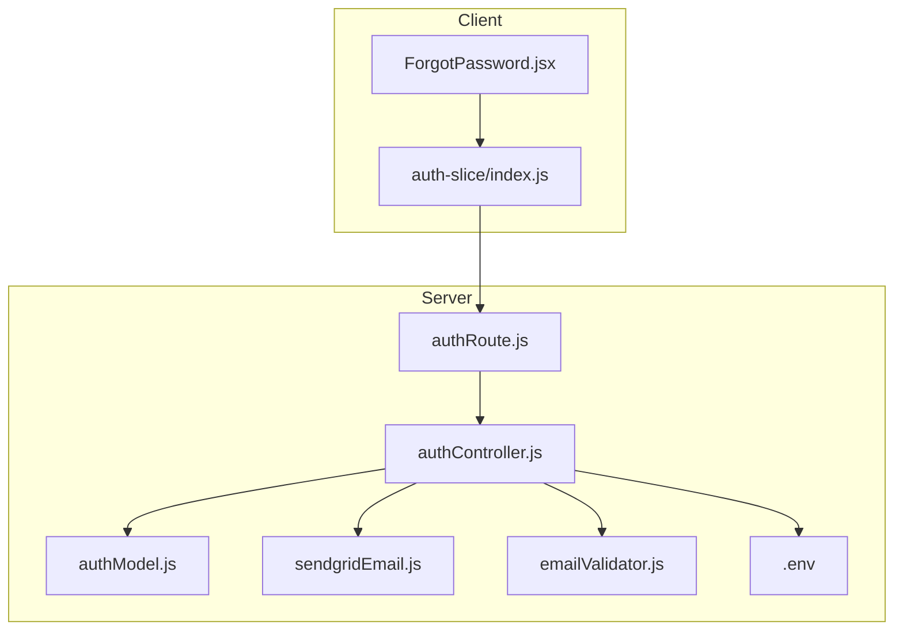
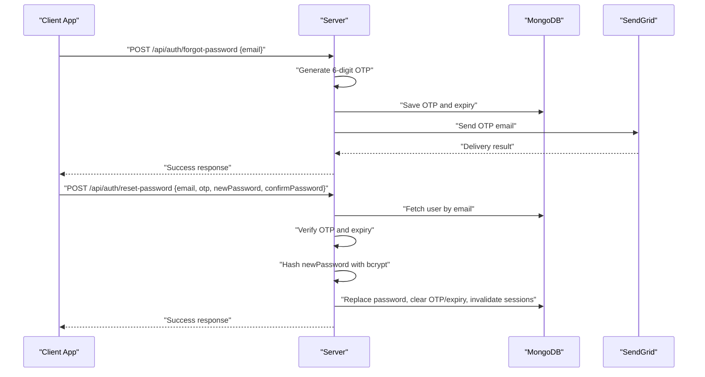
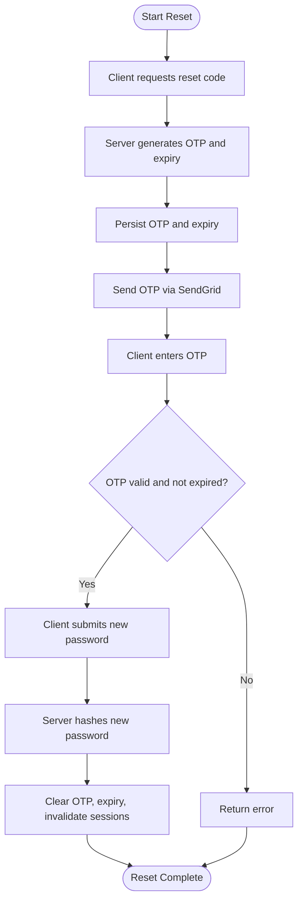
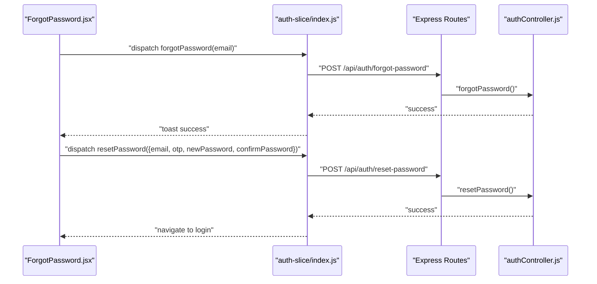
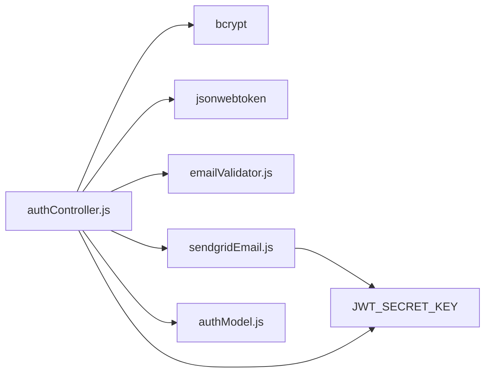

# Password Management

<cite>
**Referenced Files in This Document**
- [authController.js](file://server/controllers/auth/authController.js)
- [authModel.js](file://server/models/authModel.js)
- [authRoute.js](file://server/routes/auth/authRoute.js)
- [sendgridEmail.js](file://server/config/sendgridEmail.js)
- [emailValidator.js](file://server/config/emailValidator.js)
- [ForgotPassword.jsx](file://client/src/Pages/ForgotPassword.jsx)
- [auth-slice/index.js](file://client/src/store/auth-slice/index.js)
- [.env](file://server/.env)
- [package.json](file://server/package.json)
</cite>

## Table of Contents
1. [Introduction](#introduction)
2. [Project Structure](#project-structure)
3. [Core Components](#core-components)
4. [Architecture Overview](#architecture-overview)
5. [Detailed Component Analysis](#detailed-component-analysis)
6. [Dependency Analysis](#dependency-analysis)
7. [Performance Considerations](#performance-considerations)
8. [Troubleshooting Guide](#troubleshooting-guide)
9. [Conclusion](#conclusion)

## Introduction
This document provides comprehensive password management guidance for the betting platform. It focuses on secure password hashing, the OTP-based password reset workflow, email notifications, validation rules, and frontend form behavior. It also outlines current security measures and highlights areas for improvement such as password expiration, reuse prevention, and breach detection.

## Project Structure
The password management system spans the backend controller, database model, routing, and email configuration, and integrates with the frontend via Redux Thunks and a dedicated page for password reset.

**Diagram sources**
- [authRoute.js](file://server/routes/auth/authRoute.js#L1-L34)
- [authController.js](file://server/controllers/auth/authController.js#L1-L457)
- [authModel.js](file://server/models/authModel.js#L1-L40)
- [sendgridEmail.js](file://server/config/sendgridEmail.js#L1-L58)
- [emailValidator.js](file://server/config/emailValidator.js#L1-L127)
- [ForgotPassword.jsx](file://client/src/Pages/ForgotPassword.jsx#L1-L290)
- [auth-slice/index.js](file://client/src/store/auth-slice/index.js#L1-L342)
- [.env](file://server/.env#L1-L44)

**Section sources**
- [authRoute.js](file://server/routes/auth/authRoute.js#L1-L34)
- [authController.js](file://server/controllers/auth/authController.js#L1-L457)
- [authModel.js](file://server/models/authModel.js#L1-L40)
- [sendgridEmail.js](file://server/config/sendgridEmail.js#L1-L58)
- [emailValidator.js](file://server/config/emailValidator.js#L1-L127)
- [ForgotPassword.jsx](file://client/src/Pages/ForgotPassword.jsx#L1-L290)
- [auth-slice/index.js](file://client/src/store/auth-slice/index.js#L1-L342)
- [.env](file://server/.env#L1-L44)

## Core Components
- Backend controller implements password hashing, OTP generation and verification, password reset, and JWT-based session tokens.
- Database model stores hashed passwords, optional verification codes, and session tokens.
- Email configuration integrates SendGrid for OTP delivery and ZeroBounce for email validation.
- Frontend provides a three-step password reset flow: email submission, OTP verification, and new password creation.

**Section sources**
- [authController.js](file://server/controllers/auth/authController.js#L1-L457)
- [authModel.js](file://server/models/authModel.js#L1-L40)
- [sendgridEmail.js](file://server/config/sendgridEmail.js#L1-L58)
- [emailValidator.js](file://server/config/emailValidator.js#L1-L127)
- [ForgotPassword.jsx](file://client/src/Pages/ForgotPassword.jsx#L1-L290)
- [auth-slice/index.js](file://client/src/store/auth-slice/index.js#L1-L342)

## Architecture Overview
The password reset flow is initiated from the client, validated by the server, and executed with secure hashing and token clearing.

**Diagram sources**
- [authRoute.js](file://server/routes/auth/authRoute.js#L25-L26)
- [authController.js](file://server/controllers/auth/authController.js#L356-L425)
- [sendgridEmail.js](file://server/config/sendgridEmail.js#L6-L31)
- [authModel.js](file://server/models/authModel.js#L1-L40)

## Detailed Component Analysis

### Password Hashing Implementation
- bcrypt is used for hashing with a configurable cost factor. The server hashes during registration and password reset.
- During login, the server compares the provided password against the stored hash.

Security notes:
- bcrypt cost factor is applied consistently across the application.
- No explicit password expiration or reuse policy is enforced in the current implementation.

**Section sources**
- [authController.js](file://server/controllers/auth/authController.js#L84-L85)
- [authController.js](file://server/controllers/auth/authController.js#L217-L218)
- [authController.js](file://server/controllers/auth/authController.js#L412-L413)
- [package.json](file://server/package.json#L22)

### OTP-Based Password Reset Workflow
- Step 1: Client requests a reset code via email.
- Step 2: Client submits the 6-digit OTP; server validates it and expiry.
- Step 3: Client sends new password; server hashes it and clears OTP/expiry/session tokens.

**Diagram sources**
- [authController.js](file://server/controllers/auth/authController.js#L356-L425)
- [sendgridEmail.js](file://server/config/sendgridEmail.js#L6-L31)

**Section sources**
- [authRoute.js](file://server/routes/auth/authRoute.js#L25-L26)
- [authController.js](file://server/controllers/auth/authController.js#L356-L425)
- [ForgotPassword.jsx](file://client/src/Pages/ForgotPassword.jsx#L50-L103)
- [auth-slice/index.js](file://client/src/store/auth-slice/index.js#L170-L205)

### Email Notification and Delivery
- SendGrid is configured with API credentials and used to send HTML and plain-text messages.
- The email template renders the OTP prominently and includes a footer.

Operational notes:
- Delivery errors are captured and returned as structured errors for the caller to handle.

**Section sources**
- [sendgridEmail.js](file://server/config/sendgridEmail.js#L1-L58)
- [.env](file://server/.env#L37-L41)

### Email Validation and Anti-Spoofing
- ZeroBounce SDK is used to validate email addresses, including MX record checks and reputation scoring.
- The server rejects registrations for disposable or invalid domains.

**Section sources**
- [emailValidator.js](file://server/config/emailValidator.js#L1-L127)
- [authController.js](file://server/controllers/auth/authController.js#L69-L76)

### Frontend Password Change Forms and Validation Logic
- Three-step UI: email input, OTP entry (6 digits), and new password confirmation.
- Client-side validations include email presence and OTP length.
- Redux Thunks orchestrate network calls and update UI state.

**Diagram sources**
- [ForgotPassword.jsx](file://client/src/Pages/ForgotPassword.jsx#L50-L103)
- [auth-slice/index.js](file://client/src/store/auth-slice/index.js#L170-L205)
- [authRoute.js](file://server/routes/auth/authRoute.js#L25-L26)
- [authController.js](file://server/controllers/auth/authController.js#L356-L425)

**Section sources**
- [ForgotPassword.jsx](file://client/src/Pages/ForgotPassword.jsx#L1-L290)
- [auth-slice/index.js](file://client/src/store/auth-slice/index.js#L170-L205)

### Password Validation Rules and User Feedback
- Current server-side rules:
  - Passwords must match during registration and reset.
  - Phone number format is validated.
  - Email is validated via ZeroBounce and MX records.
- Frontend feedback:
  - Toast notifications for success and error conditions.
  - Step-based UI progression for reset flow.

Recommendations:
- Enforce minimum length, character diversity, and common pattern restrictions at the server level.
- Provide granular client-side feedback for password strength.

**Section sources**
- [authController.js](file://server/controllers/auth/authController.js#L57-L62)
- [emailValidator.js](file://server/config/emailValidator.js#L19-L52)
- [ForgotPassword.jsx](file://client/src/Pages/ForgotPassword.jsx#L78-L82)

### Security Measures Implemented
- bcrypt hashing for passwords.
- JWT-based session tokens stored in the database and cleared on reset.
- OTP with short expiry window (10 minutes).
- Email validation via ZeroBounce and MX checks.
- Rate limiting and helmet are included in dependencies; ensure they are configured.

Areas to enhance:
- Password expiration policy (e.g., periodic re-prompts).
- Password reuse prevention (compare against last N hashes).
- Breach detection (integration with external breach checking APIs).
- Additional rate limits around OTP resend and reset endpoints.

**Section sources**
- [authController.js](file://server/controllers/auth/authController.js#L84-L85)
- [authController.js](file://server/controllers/auth/authController.js#L412-L418)
- [authModel.js](file://server/models/authModel.js#L1-L40)
- [package.json](file://server/package.json#L29-L31)

## Dependency Analysis

**Diagram sources**
- [authController.js](file://server/controllers/auth/authController.js#L1-L6)
- [sendgridEmail.js](file://server/config/sendgridEmail.js#L1-L4)
- [emailValidator.js](file://server/config/emailValidator.js#L1-L8)
- [authModel.js](file://server/models/authModel.js#L1-L40)
- [.env](file://server/.env#L37-L44)

**Section sources**
- [authController.js](file://server/controllers/auth/authController.js#L1-L6)
- [sendgridEmail.js](file://server/config/sendgridEmail.js#L1-L4)
- [emailValidator.js](file://server/config/emailValidator.js#L1-L8)
- [authModel.js](file://server/models/authModel.js#L1-L40)
- [.env](file://server/.env#L37-L44)

## Performance Considerations
- bcrypt cost factor impacts CPU usage during hashing; monitor latency under load.
- OTP expiry reduces long-lived secrets but requires timely user interaction.
- Email delivery throughput depends on provider quotas; consider queuing for high volume.

## Troubleshooting Guide
Common issues and resolutions:
- Reset failures
  - Cause: OTP mismatch or expired.
  - Resolution: Regenerate OTP and retry; ensure client displays appropriate messages.
- Hash verification problems
  - Cause: Incorrect bcrypt cost or corrupted storage.
  - Resolution: Verify bcrypt installation and database integrity.
- Security breach responses
  - Recommendation: Integrate breach detection and force password resets for affected accounts.

Operational tips:
- Inspect SendGrid delivery logs for bounce and suppression events.
- Monitor ZeroBounce API responses for transient failures and fallback behavior.

**Section sources**
- [authController.js](file://server/controllers/auth/authController.js#L403-L411)
- [sendgridEmail.js](file://server/config/sendgridEmail.js#L31-L57)
- [emailValidator.js](file://server/config/emailValidator.js#L114-L126)

## Conclusion
The platform implements robust password hashing with bcrypt, a secure OTP-based reset flow, and email validation. To strengthen security posture, introduce password expiration, reuse prevention, and breach detection. Enhance client-side feedback and server-side validation to improve usability and resilience.