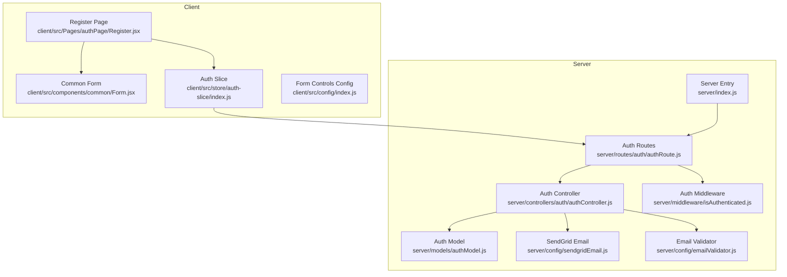
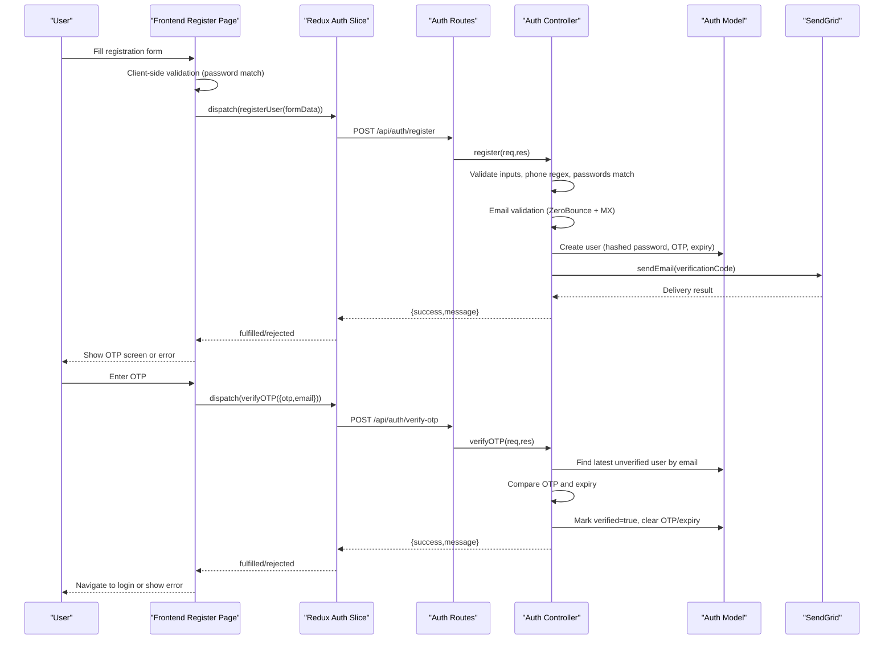
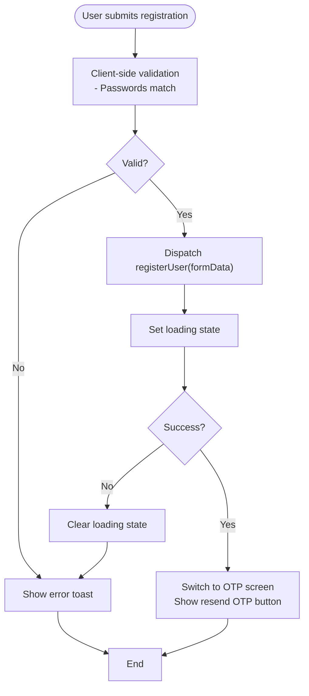
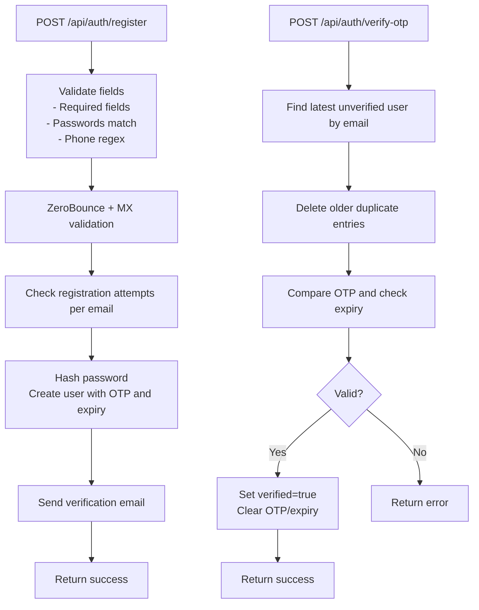
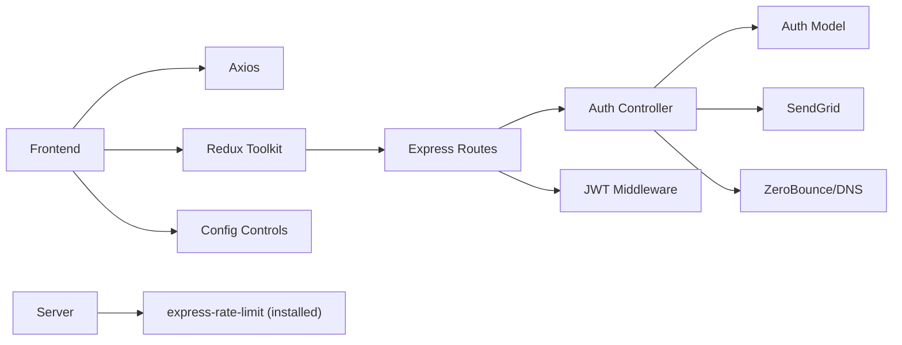

# Registration and Verification Process

<cite>
**Referenced Files in This Document**
- [Register.jsx](file://client/src/Pages/authPage/Register.jsx)
- [Form.jsx](file://client/src/components/common/Form.jsx)
- [index.js](file://client/src/config/index.js)
- [auth-slice/index.js](file://client/src/store/auth-slice/index.js)
- [authController.js](file://server/controllers/auth/authController.js)
- [authModel.js](file://server/models/authModel.js)
- [authRoute.js](file://server/routes/auth/authRoute.js)
- [sendgridEmail.js](file://server/config/sendgridEmail.js)
- [emailValidator.js](file://server/config/emailValidator.js)
- [isAuthenticated.js](file://server/middleware/isAuthenticated.js)
- [index.js](file://server/index.js)
- [package.json](file://server/package.json)
</cite>

## Table of Contents
1. [Introduction](#introduction)
2. [Project Structure](#project-structure)
3. [Core Components](#core-components)
4. [Architecture Overview](#architecture-overview)
5. [Detailed Component Analysis](#detailed-component-analysis)
6. [Dependency Analysis](#dependency-analysis)
7. [Performance Considerations](#performance-considerations)
8. [Troubleshooting Guide](#troubleshooting-guide)
9. [Conclusion](#conclusion)

## Introduction
This document explains the end-to-end multi-step registration and verification process for the platform. It covers the frontend registration form, validation, and submission flow; the backend validation, sanitization, database storage, and OTP generation and verification; the email delivery pipeline; and the security measures in place. It also provides troubleshooting guidance for common issues encountered during registration and verification.

## Project Structure
The registration and verification workflow spans the client-side React application and the server-side Node.js/Express API:
- Frontend: Registration page, shared form component, Redux slice for async actions and state.
- Backend: Authentication routes, controller with validation and OTP logic, Mongoose model, email transport, and middleware.

**Diagram sources**
- [Register.jsx](file://client/src/Pages/authPage/Register.jsx#L1-L223)
- [Form.jsx](file://client/src/components/common/Form.jsx#L1-L170)
- [auth-slice/index.js](file://client/src/store/auth-slice/index.js#L1-L342)
- [authRoute.js](file://server/routes/auth/authRoute.js#L1-L34)
- [authController.js](file://server/controllers/auth/authController.js#L1-L457)
- [authModel.js](file://server/models/authModel.js#L1-L40)
- [sendgridEmail.js](file://server/config/sendgridEmail.js#L1-L58)
- [emailValidator.js](file://server/config/emailValidator.js#L1-L127)
- [isAuthenticated.js](file://server/middleware/isAuthenticated.js#L1-L62)
- [index.js](file://server/index.js#L1-L150)

**Section sources**
- [Register.jsx](file://client/src/Pages/authPage/Register.jsx#L1-L223)
- [auth-slice/index.js](file://client/src/store/auth-slice/index.js#L1-L342)
- [authRoute.js](file://server/routes/auth/authRoute.js#L1-L34)
- [authController.js](file://server/controllers/auth/authController.js#L1-L457)
- [authModel.js](file://server/models/authModel.js#L1-L40)
- [sendgridEmail.js](file://server/config/sendgridEmail.js#L1-L58)
- [emailValidator.js](file://server/config/emailValidator.js#L1-L127)
- [isAuthenticated.js](file://server/middleware/isAuthenticated.js#L1-L62)
- [index.js](file://server/index.js#L1-L150)

## Core Components
- Frontend Registration Page: Manages form state, client-side password matching, submission via Redux Thunks, OTP display and resend logic.
- Common Form Component: Renders dynamic form controls based on configuration and handles input updates.
- Redux Auth Slice: Defines async thunks for registration, OTP resend, OTP verification, and login; manages loading and error states.
- Backend Auth Controller: Implements registration validation, duplicate detection, hashing, OTP generation and expiry, email sending, and OTP verification.
- Auth Model: Defines schema for user data, indexes, and OTP fields.
- Email Transport: SendGrid integration for sending verification emails.
- Email Validation: ZeroBounce SDK plus DNS checks to prevent disposable and invalid addresses.
- Authentication Middleware: JWT verification and session token invalidation for logout and force logout flows.

**Section sources**
- [Register.jsx](file://client/src/Pages/authPage/Register.jsx#L1-L223)
- [Form.jsx](file://client/src/components/common/Form.jsx#L1-L170)
- [auth-slice/index.js](file://client/src/store/auth-slice/index.js#L1-L342)
- [authController.js](file://server/controllers/auth/authController.js#L1-L457)
- [authModel.js](file://server/models/authModel.js#L1-L40)
- [sendgridEmail.js](file://server/config/sendgridEmail.js#L1-L58)
- [emailValidator.js](file://server/config/emailValidator.js#L1-L127)
- [isAuthenticated.js](file://server/middleware/isAuthenticated.js#L1-L62)

## Architecture Overview
The registration and verification flow is a multi-step process orchestrated by the frontend and backend:

**Diagram sources**
- [Register.jsx](file://client/src/Pages/authPage/Register.jsx#L35-L90)
- [auth-slice/index.js](file://client/src/store/auth-slice/index.js#L12-L81)
- [authRoute.js](file://server/routes/auth/authRoute.js#L20-L29)
- [authController.js](file://server/controllers/auth/authController.js#L50-L124)
- [authModel.js](file://server/models/authModel.js#L1-L40)
- [sendgridEmail.js](file://server/config/sendgridEmail.js#L6-L31)

## Detailed Component Analysis

### Frontend Registration Page
- State management: Tracks form data and OTP form data; toggles loading states; conditionally renders registration vs OTP entry UI.
- Client-side validation: Ensures passwords match before submitting.
- Submission flow: Dispatches registerUser thunk; on success, switches to OTP entry; on failure, displays error via toast.
- OTP entry and resend: Dispatches verifyOTP and resendOtp thunks; disables submit until OTP is entered.

**Diagram sources**
- [Register.jsx](file://client/src/Pages/authPage/Register.jsx#L35-L60)
- [auth-slice/index.js](file://client/src/store/auth-slice/index.js#L12-L29)

**Section sources**
- [Register.jsx](file://client/src/Pages/authPage/Register.jsx#L1-L223)
- [auth-slice/index.js](file://client/src/store/auth-slice/index.js#L12-L81)

### Common Form Component
- Dynamic rendering: Renders inputs, textareas, selects, and a specialized phone input with country code selector.
- Controlled inputs: Updates parent state on change; disables inputs during loading.
- Accessibility: Provides labels and placeholders; supports internationalization.

**Section sources**
- [Form.jsx](file://client/src/components/common/Form.jsx#L1-L170)
- [index.js](file://client/src/config/index.js#L1-L70)

### Redux Auth Slice
- Async thunks:
  - registerUser: POSTs registration payload; handles success and rejection.
  - resendOtp: POSTs resend OTP request; shows success toast.
  - verifyOTP: POSTs OTP verification; resolves on success.
  - loginUser: Handles login; opens OTP dialog if account not verified.
- State management: Tracks authentication status, user data, and loading states; persists token on successful login.

**Section sources**
- [auth-slice/index.js](file://client/src/store/auth-slice/index.js#L1-L342)

### Backend Auth Controller
- Registration:
  - Validates required fields, password match, phone number format.
  - Checks for existing verified user by email.
  - Validates email using ZeroBounce and MX record checks.
  - Limits registration attempts per email.
  - Hashes password, creates user record with OTP and expiry, sends email.
- OTP resend:
  - Finds user by email, regenerates OTP and expiry, sends email.
- OTP verification:
  - Finds latest unverified user by email; deletes older duplicates.
  - Compares OTP and verifies expiry; marks user as verified and clears OTP/expiry.
- Login:
  - Verifies credentials; if account not verified, returns pending verification info.
- Password reset and force logout:
  - Similar OTP-based flows with expiry checks and cleanup.

**Diagram sources**
- [authController.js](file://server/controllers/auth/authController.js#L50-L124)
- [authController.js](file://server/controllers/auth/authController.js#L150-L193)

**Section sources**
- [authController.js](file://server/controllers/auth/authController.js#L1-L457)
- [emailValidator.js](file://server/config/emailValidator.js#L1-L127)

### Auth Model
- Schema fields: name, email (unique), phone (unique), password, role, verified, OTP fields, session token, balance, timestamps, registration attempts.
- Indexes: Optimizes queries by email, name, role, and creation time.

**Section sources**
- [authModel.js](file://server/models/authModel.js#L1-L40)

### Email Transport and Validation
- SendGrid integration: Sends HTML and plain-text emails with reply-to and custom args; maps errors to structured objects.
- Email validation: Uses ZeroBounce SDK, disposable email checks, and DNS MX record validation; fallback behavior when API fails.

**Section sources**
- [sendgridEmail.js](file://server/config/sendgridEmail.js#L1-L58)
- [emailValidator.js](file://server/config/emailValidator.js#L1-L127)

### Authentication Middleware
- JWT verification: Extracts token from Authorization header; validates signature and expiry; ensures user still exists and session token matches.
- Role authorization: Helper to restrict routes by role.

**Section sources**
- [isAuthenticated.js](file://server/middleware/isAuthenticated.js#L1-L62)

## Dependency Analysis
- Frontend depends on:
  - Redux Thunks for async flows.
  - Axios for HTTP requests.
  - Shared form configuration for rendering inputs.
- Backend depends on:
  - Express routes for endpoints.
  - Mongoose model for persistence.
  - SendGrid and ZeroBounce for email and validation.
  - Helmet and CORS for security and cross-origin policies.
  - Rate limiting library present in dependencies.

**Diagram sources**
- [auth-slice/index.js](file://client/src/store/auth-slice/index.js#L1-L342)
- [authRoute.js](file://server/routes/auth/authRoute.js#L1-L34)
- [authController.js](file://server/controllers/auth/authController.js#L1-L457)
- [authModel.js](file://server/models/authModel.js#L1-L40)
- [sendgridEmail.js](file://server/config/sendgridEmail.js#L1-L58)
- [emailValidator.js](file://server/config/emailValidator.js#L1-L127)
- [isAuthenticated.js](file://server/middleware/isAuthenticated.js#L1-L62)
- [package.json](file://server/package.json#L19-L37)

**Section sources**
- [auth-slice/index.js](file://client/src/store/auth-slice/index.js#L1-L342)
- [authRoute.js](file://server/routes/auth/authRoute.js#L1-L34)
- [authController.js](file://server/controllers/auth/authController.js#L1-L457)
- [authModel.js](file://server/models/authModel.js#L1-L40)
- [sendgridEmail.js](file://server/config/sendgridEmail.js#L1-L58)
- [emailValidator.js](file://server/config/emailValidator.js#L1-L127)
- [isAuthenticated.js](file://server/middleware/isAuthenticated.js#L1-L62)
- [package.json](file://server/package.json#L19-L37)

## Performance Considerations
- Email delivery latency: Network-dependent; consider queuing and retries for robustness.
- Database writes: OTP generation and expiry updates are minimal; ensure indexes on email and timestamps are effective.
- Client-side UX: Disable inputs during async operations to prevent duplicate submissions.
- Rate limiting: The server includes the rate limiting dependency; configure route-level limits for registration and OTP endpoints to mitigate abuse.

[No sources needed since this section provides general guidance]

## Troubleshooting Guide
- Registration fails with “All fields required”:
  - Ensure name, email, phone, and password are provided.
  - Confirm password and confirm password match.
- Registration fails with “Invalid phone number”:
  - Verify phone number matches the accepted format.
- Registration fails with “User already exists”:
  - Use a different email or phone number; only verified users count toward duplication.
- Email validation fails:
  - Disposable or temporary emails are rejected; use a valid provider (e.g., Gmail, Outlook).
  - Domain must have MX records; retry with a working domain.
- OTP not received:
  - Check spam/junk folders; ensure the email address is correct.
  - Resend OTP using the resend button; ensure the email exists in the system.
- OTP expired or invalid:
  - OTP expires after 10 minutes; request a new OTP.
  - Ensure OTP matches exactly; avoid leading/trailing spaces.
- Verification fails repeatedly:
  - Clear browser cache/local storage and retry.
  - Use the latest OTP; older ones are cleaned up automatically.
- Login shows “Account not verified”:
  - Complete OTP verification; check your inbox for the verification code.
- Force logout or password reset:
  - Follow the OTP prompts; ensure OTP is entered before proceeding.

**Section sources**
- [authController.js](file://server/controllers/auth/authController.js#L7-L20)
- [authController.js](file://server/controllers/auth/authController.js#L150-L193)
- [emailValidator.js](file://server/config/emailValidator.js#L10-L127)
- [Register.jsx](file://client/src/Pages/authPage/Register.jsx#L81-L90)

## Conclusion
The registration and verification system combines a user-friendly frontend with robust backend validation, secure OTP handling, and reliable email delivery. By enforcing strong validation rules, managing OTP lifecycle, and providing clear feedback, the system ensures a secure and smooth onboarding experience. For enhanced resilience, consider implementing rate limiting for sensitive endpoints and adding queue-based email delivery.