# Role-Based Access Control

<cite>
**Referenced Files in This Document**
- [authModel.js](file://server/models/authModel.js)
- [isAuthenticated.js](file://server/middleware/isAuthenticated.js)
- [authController.js](file://server/controllers/auth/authController.js)
- [adminRoute.js](file://server/routes/admin/adminRoute.js)
- [adminController.js](file://server/controllers/admin/adminController.js)
- [App.jsx](file://client/src/App.jsx)
- [CheckAuth.jsx](file://client/src/components/common/CheckAuth.jsx)
- [Layout.jsx](file://client/src/components/Admin/Layout.jsx)
- [Header.jsx](file://client/src/components/Admin/Header.jsx)
- [Sidebar.jsx](file://client/src/components/Admin/Sidebar.jsx)
- [UserManagement.jsx](file://client/src/Pages/adminPage/UserManagement.jsx)
- [index.js](file://client/src/store/auth-slice/index.js)
- [SocketContext.jsx](file://client/src/context/SocketContext.jsx)
</cite>

## Table of Contents
1. [Introduction](#introduction)
2. [Project Structure](#project-structure)
3. [Core Components](#core-components)
4. [Architecture Overview](#architecture-overview)
5. [Detailed Component Analysis](#detailed-component-analysis)
6. [Dependency Analysis](#dependency-analysis)
7. [Performance Considerations](#performance-considerations)
8. [Troubleshooting Guide](#troubleshooting-guide)
9. [Conclusion](#conclusion)
10. [Appendices](#appendices)

## Introduction
This document provides comprehensive Role-Based Access Control (RBAC) documentation for the betting platform. It covers the role hierarchy (user, admin, superadmin), permission assignment and validation, authorization middleware, route protection, frontend role checks, conditional UI rendering, role escalation procedures, and the database schema for user-role relationships. Practical examples illustrate role-specific UI elements, menu items, and feature access.

## Project Structure
The RBAC implementation spans both backend and frontend:
- Backend: Authentication and authorization middleware, JWT-based user identity, role field in the user model, admin-only endpoints, and controller-level role checks.
- Frontend: Route protection via a shared guard component, Redux slice managing authentication state and actions, admin layout and navigation, and UI components that conditionally render based on user roles.

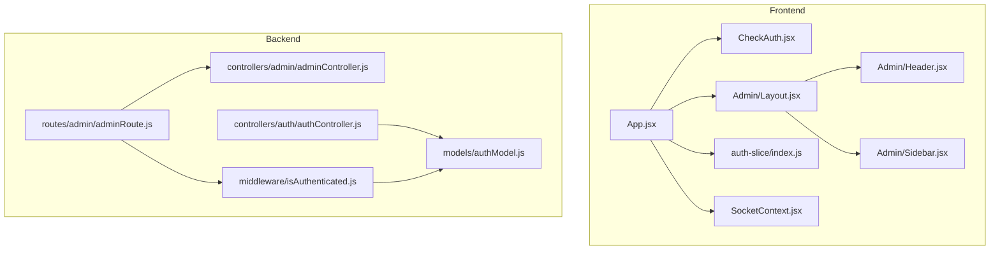

**Diagram sources**
- [App.jsx](file://client/src/App.jsx#L27-L111)
- [CheckAuth.jsx](file://client/src/components/common/CheckAuth.jsx#L4-L43)
- [Layout.jsx](file://client/src/components/Admin/Layout.jsx#L6-L19)
- [Header.jsx](file://client/src/components/Admin/Header.jsx#L10-L27)
- [Sidebar.jsx](file://client/src/components/Admin/Sidebar.jsx#L37-L74)
- [index.js](file://client/src/store/auth-slice/index.js#L257-L342)
- [SocketContext.jsx](file://client/src/context/SocketContext.jsx#L14-L61)
- [adminRoute.js](file://server/routes/admin/adminRoute.js#L1-L22)
- [authController.js](file://server/controllers/auth/authController.js#L195-L250)
- [adminController.js](file://server/controllers/admin/adminController.js#L70-L88)
- [isAuthenticated.js](file://server/middleware/isAuthenticated.js#L3-L61)
- [authModel.js](file://server/models/authModel.js#L15-L20)

**Section sources**
- [App.jsx](file://client/src/App.jsx#L27-L111)
- [adminRoute.js](file://server/routes/admin/adminRoute.js#L1-L22)

## Core Components
- Role model and schema: Defines the role field with allowed values and default role for new users.
- Authentication middleware: Validates JWT tokens and enforces session validity.
- Authorization middleware: Enforces role-based access to protected routes.
- Admin routes: Expose administrative endpoints guarded by authentication.
- Frontend route guard: Redirects unauthenticated users and restricts access based on roles.
- Admin layout and navigation: Provides role-aware UI for administrators.
- Redux auth slice: Manages authentication state, user data, and role-aware actions.

**Section sources**
- [authModel.js](file://server/models/authModel.js#L15-L20)
- [isAuthenticated.js](file://server/middleware/isAuthenticated.js#L3-L61)
- [adminRoute.js](file://server/routes/admin/adminRoute.js#L14-L19)
- [CheckAuth.jsx](file://client/src/components/common/CheckAuth.jsx#L4-L43)
- [Layout.jsx](file://client/src/components/Admin/Layout.jsx#L6-L19)
- [Sidebar.jsx](file://client/src/components/Admin/Sidebar.jsx#L8-L35)
- [index.js](file://client/src/store/auth-slice/index.js#L257-L342)

## Architecture Overview
The RBAC architecture integrates JWT-based authentication, middleware-driven authorization, and frontend route protection. Roles are stored in the user model and propagated via JWT claims. Backend routes enforce role constraints, while frontend guards redirect unauthorized access and conditionally render UI elements.

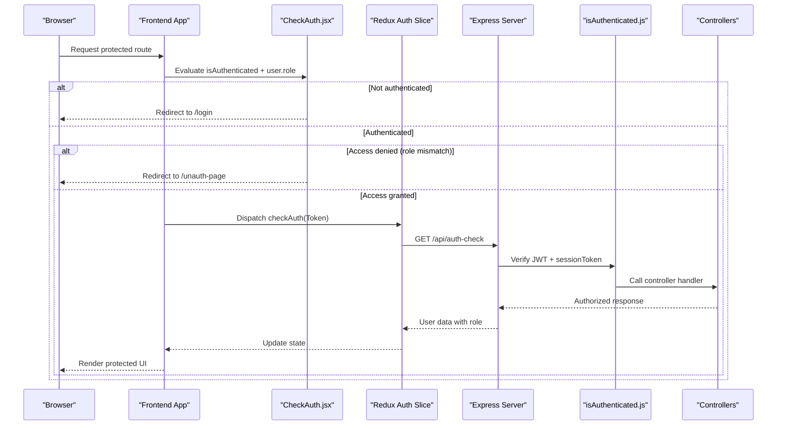

**Diagram sources**
- [CheckAuth.jsx](file://client/src/components/common/CheckAuth.jsx#L4-L43)
- [index.js](file://client/src/store/auth-slice/index.js#L100-L116)
- [isAuthenticated.js](file://server/middleware/isAuthenticated.js#L3-L61)
- [authController.js](file://server/controllers/auth/authController.js#L339-L354)

## Detailed Component Analysis

### Role Model and Schema
- The user model defines a role field with allowed values: admin, user, and superadmin. New users default to user.
- Indexes on role and other fields optimize queries for role-based filtering and user lookups.

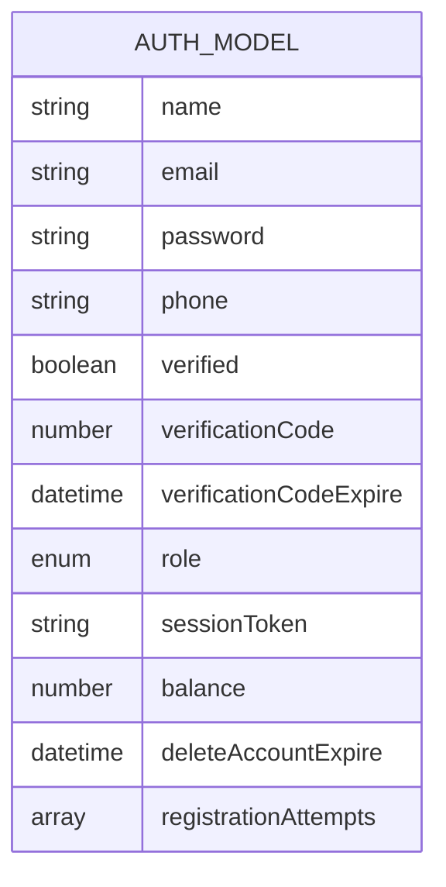

**Diagram sources**
- [authModel.js](file://server/models/authModel.js#L3-L39)

**Section sources**
- [authModel.js](file://server/models/authModel.js#L15-L20)
- [authModel.js](file://server/models/authModel.js#L34-L37)

### Authentication Middleware
- Extracts Bearer token from Authorization header.
- Verifies JWT signature and handles token expiration and invalid token errors.
- Loads user from database and validates sessionToken to detect forced logout.
- Attaches decoded user object to request for downstream authorization checks.

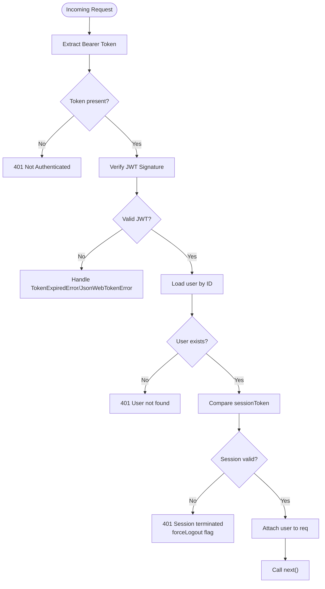

**Diagram sources**
- [isAuthenticated.js](file://server/middleware/isAuthenticated.js#L3-L49)

**Section sources**
- [isAuthenticated.js](file://server/middleware/isAuthenticated.js#L3-L49)

### Authorization Middleware
- Provides a factory function to create role-based authorization middleware.
- Checks if the authenticated user’s role is included in the allowed roles list.
- Returns 403 Forbidden if role is not authorized.

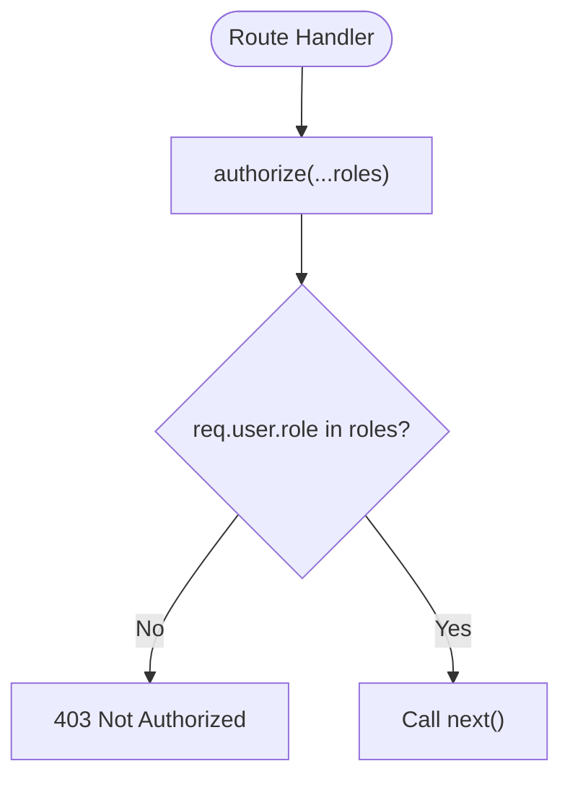

**Diagram sources**
- [isAuthenticated.js](file://server/middleware/isAuthenticated.js#L51-L61)

**Section sources**
- [isAuthenticated.js](file://server/middleware/isAuthenticated.js#L51-L61)

### Admin Routes and Controllers
- Admin routes are protected by the authentication middleware.
- Administrative endpoints include user management and platform statistics.
- Controllers enforce role checks; for example, updating user roles and balances requires superadmin.

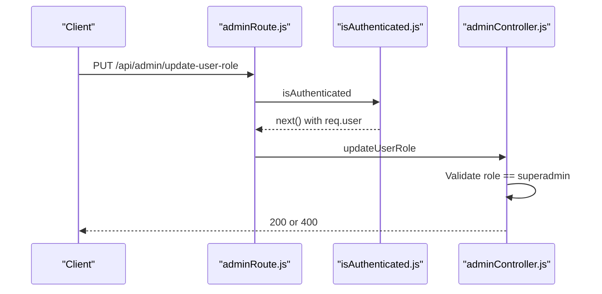

**Diagram sources**
- [adminRoute.js](file://server/routes/admin/adminRoute.js#L14-L16)
- [isAuthenticated.js](file://server/middleware/isAuthenticated.js#L3-L61)
- [adminController.js](file://server/controllers/admin/adminController.js#L70-L88)

**Section sources**
- [adminRoute.js](file://server/routes/admin/adminRoute.js#L14-L16)
- [adminController.js](file://server/controllers/admin/adminController.js#L70-L88)

### Frontend Route Protection and Conditional Rendering
- The route guard redirects unauthenticated users to login and prevents role-based access violations.
- On successful authentication, the app navigates authenticated users to appropriate dashboards.
- Admin pages display role-aware navigation and actions.

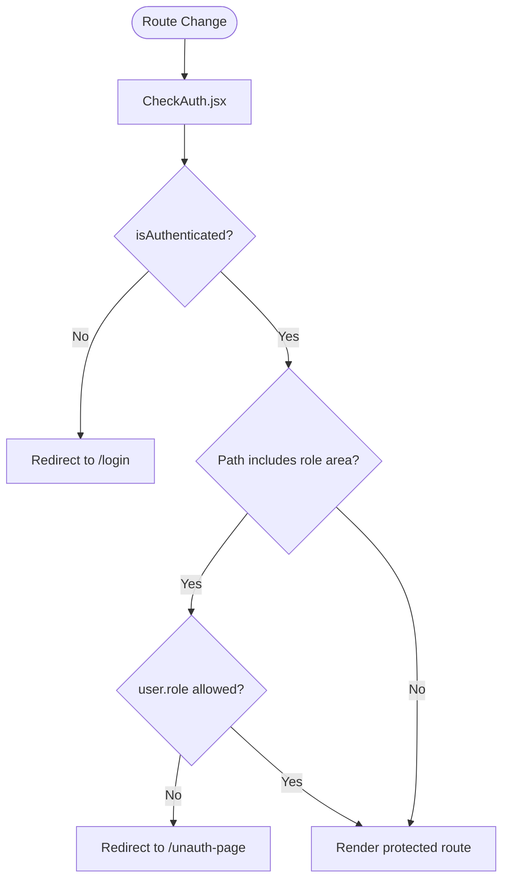

**Diagram sources**
- [CheckAuth.jsx](file://client/src/components/common/CheckAuth.jsx#L4-L43)
- [App.jsx](file://client/src/App.jsx#L54-L108)

**Section sources**
- [CheckAuth.jsx](file://client/src/components/common/CheckAuth.jsx#L4-L43)
- [App.jsx](file://client/src/App.jsx#L54-L108)

### Admin Layout and Navigation
- Admin layout composes sidebar and header components.
- Sidebar defines role-aware menu items for admin areas.
- Header provides logout integration with Redux actions.

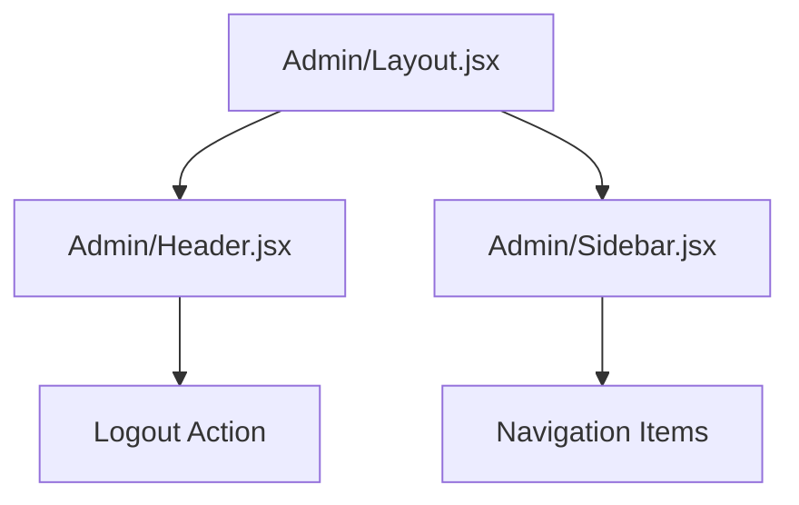

**Diagram sources**
- [Layout.jsx](file://client/src/components/Admin/Layout.jsx#L6-L19)
- [Header.jsx](file://client/src/components/Admin/Header.jsx#L10-L27)
- [Sidebar.jsx](file://client/src/components/Admin/Sidebar.jsx#L8-L35)

**Section sources**
- [Layout.jsx](file://client/src/components/Admin/Layout.jsx#L6-L19)
- [Header.jsx](file://client/src/components/Admin/Header.jsx#L10-L27)
- [Sidebar.jsx](file://client/src/components/Admin/Sidebar.jsx#L8-L35)

### Role-Specific UI Elements and Feature Access
- Role-aware routing ensures users see only permitted pages.
- Admin pages conditionally render controls based on role (e.g., superadmin-only actions).
- Example: Superadmin-only force logout endpoints are exposed via Redux actions and invoked in admin UI.

Practical examples:
- Admin dashboard navigation items are defined in the admin sidebar.
- Superadmin-only actions in the user management page trigger Redux thunks for force logout.

**Section sources**
- [Sidebar.jsx](file://client/src/components/Admin/Sidebar.jsx#L8-L35)
- [UserManagement.jsx](file://client/src/Pages/adminPage/UserManagement.jsx#L240-L272)
- [index.js](file://client/src/store/auth-slice/index.js#L206-L230)

### Role Assignment, Validation, and Enforcement
- Role assignment: The admin controller updates user roles; currently restricted to superadmin.
- Validation: JWT payload includes role; middleware attaches user object; controllers re-validate roles for sensitive endpoints.
- Enforcement: Frontend guard prevents navigation to admin areas for non-admin users; backend routes enforce role constraints.

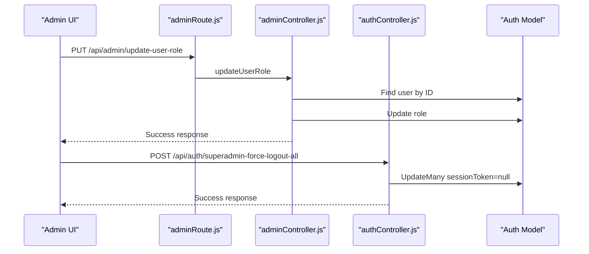

**Diagram sources**
- [adminController.js](file://server/controllers/admin/adminController.js#L70-L88)
- [authController.js](file://server/controllers/auth/authController.js#L427-L440)
- [authModel.js](file://server/models/authModel.js#L15-L20)

**Section sources**
- [adminController.js](file://server/controllers/admin/adminController.js#L70-L88)
- [authController.js](file://server/controllers/auth/authController.js#L427-L440)

### Role Escalation Procedures and Security Boundaries
- Role escalation: Only superadmin can update user roles and balances.
- Security boundaries:
  - JWT sessionToken is validated against the database to prevent replay and enforce forced logout.
  - Superadmin can force logout all non-admin users or a specific user.
  - Frontend guard prevents cross-role navigation.

**Section sources**
- [adminController.js](file://server/controllers/admin/adminController.js#L70-L88)
- [authController.js](file://server/controllers/auth/authController.js#L427-L456)
- [isAuthenticated.js](file://server/middleware/isAuthenticated.js#L33-L40)
- [CheckAuth.jsx](file://client/src/components/common/CheckAuth.jsx#L26-L39)

### Database Schema for Role Management
- User collection stores role and sessionToken for authorization and session management.
- Indexes support role-based queries and user lookups.

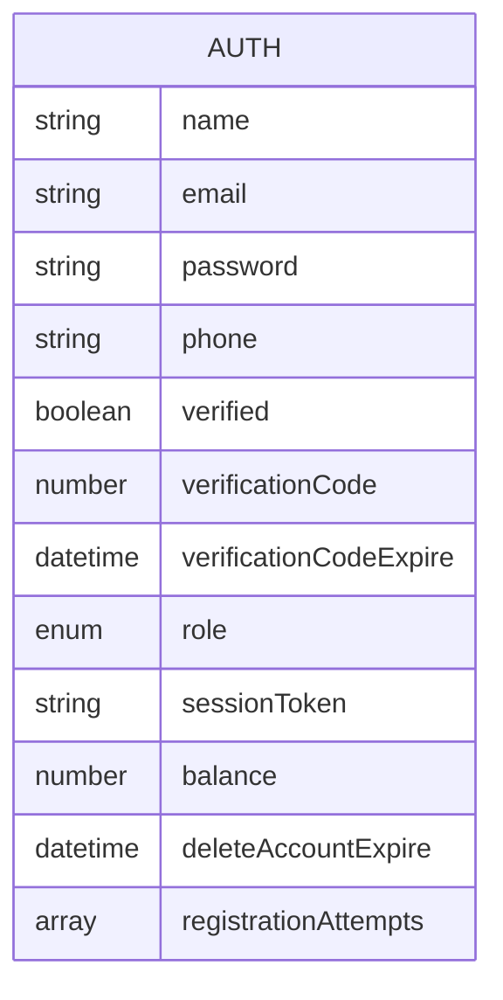

**Diagram sources**
- [authModel.js](file://server/models/authModel.js#L3-L39)

**Section sources**
- [authModel.js](file://server/models/authModel.js#L15-L20)
- [authModel.js](file://server/models/authModel.js#L34-L37)

## Dependency Analysis
The RBAC system exhibits clear separation of concerns:
- Backend depends on the user model for role storage and JWT verification.
- Routes depend on middleware for authentication and authorization.
- Controllers depend on the model for role-sensitive operations.
- Frontend depends on Redux for state and on the route guard for navigation enforcement.

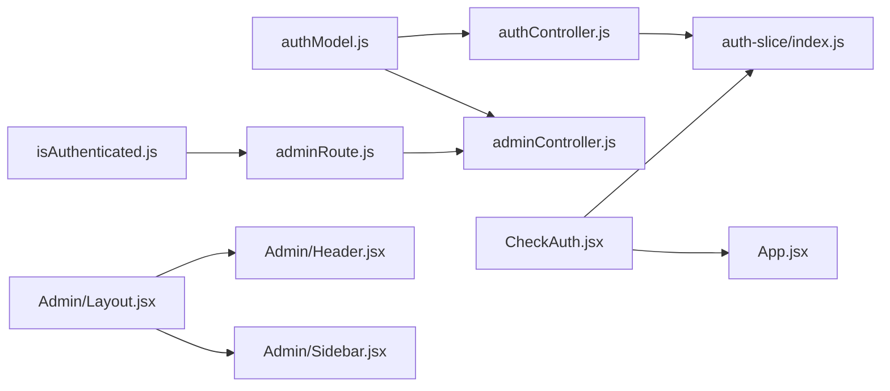

**Diagram sources**
- [authModel.js](file://server/models/authModel.js#L1-L40)
- [authController.js](file://server/controllers/auth/authController.js#L1-L457)
- [adminController.js](file://server/controllers/admin/adminController.js#L1-L120)
- [isAuthenticated.js](file://server/middleware/isAuthenticated.js#L1-L62)
- [adminRoute.js](file://server/routes/admin/adminRoute.js#L1-L22)
- [index.js](file://client/src/store/auth-slice/index.js#L257-L342)
- [CheckAuth.jsx](file://client/src/components/common/CheckAuth.jsx#L4-L43)
- [App.jsx](file://client/src/App.jsx#L27-L111)
- [Layout.jsx](file://client/src/components/Admin/Layout.jsx#L6-L19)
- [Header.jsx](file://client/src/components/Admin/Header.jsx#L10-L27)
- [Sidebar.jsx](file://client/src/components/Admin/Sidebar.jsx#L37-L74)

**Section sources**
- [authModel.js](file://server/models/authModel.js#L1-L40)
- [isAuthenticated.js](file://server/middleware/isAuthenticated.js#L1-L62)
- [adminRoute.js](file://server/routes/admin/adminRoute.js#L1-L22)
- [adminController.js](file://server/controllers/admin/adminController.js#L70-L88)
- [authController.js](file://server/controllers/auth/authController.js#L195-L250)
- [index.js](file://client/src/store/auth-slice/index.js#L257-L342)
- [CheckAuth.jsx](file://client/src/components/common/CheckAuth.jsx#L4-L43)
- [App.jsx](file://client/src/App.jsx#L27-L111)

## Performance Considerations
- JWT verification occurs per request; keep token size minimal by including only essential claims (role is sufficient).
- SessionToken comparison prevents unnecessary database reads for invalid sessions.
- Use indexes on role and frequently queried fields to optimize admin queries.
- Avoid excessive re-renders by memoizing role checks in the route guard and UI components.

## Troubleshooting Guide
Common issues and resolutions:
- 401 Not Authenticated: Ensure Authorization header contains a valid Bearer token.
- 401 Session Terminated: The user was forcibly logged out; prompt the user to log in again.
- 403 Not Authorized: The user’s role lacks permission for the requested endpoint; verify role assignments.
- Frontend redirect loops: Confirm CheckAuth logic and user role values align with expected behavior.
- Socket connection state: Monitor connection events and reconnect logic for real-time features.

**Section sources**
- [isAuthenticated.js](file://server/middleware/isAuthenticated.js#L8-L40)
- [CheckAuth.jsx](file://client/src/components/common/CheckAuth.jsx#L4-L43)
- [SocketContext.jsx](file://client/src/context/SocketContext.jsx#L18-L54)

## Conclusion
The platform implements a robust RBAC system with clear role boundaries, JWT-based authentication, middleware-driven authorization, and frontend route protection. Roles are enforced consistently across backend routes and frontend UI, with superadmin having elevated privileges for user management and session control. The schema supports efficient role-based queries, and the architecture provides a foundation for secure and scalable access control.

## Appendices
- Role hierarchy summary:
  - user: Standard user with basic access.
  - admin: Administrator with access to admin areas; limited role management capabilities.
  - superadmin: Highest authority; can manage roles, balances, and force logout users.