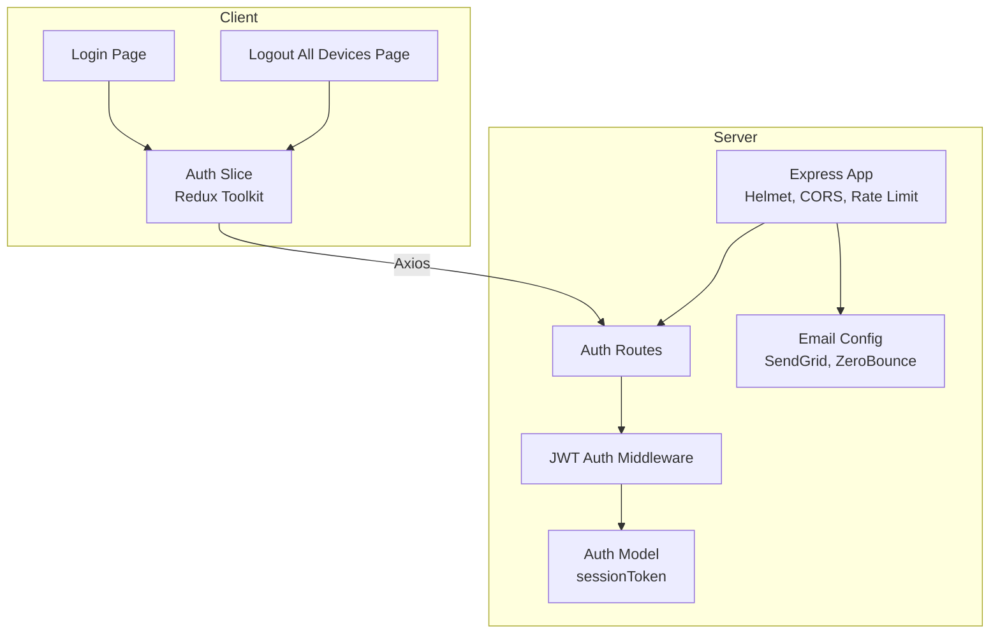
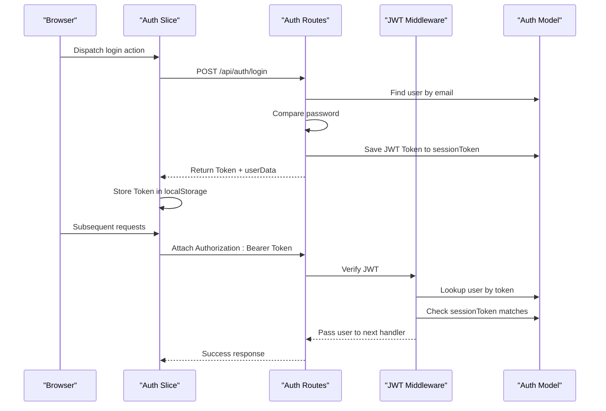
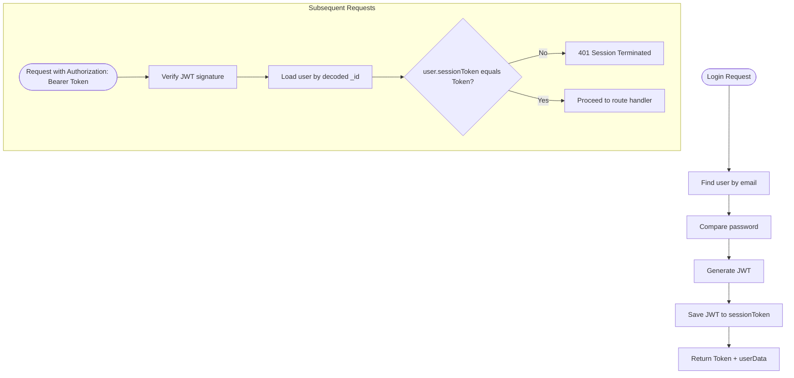
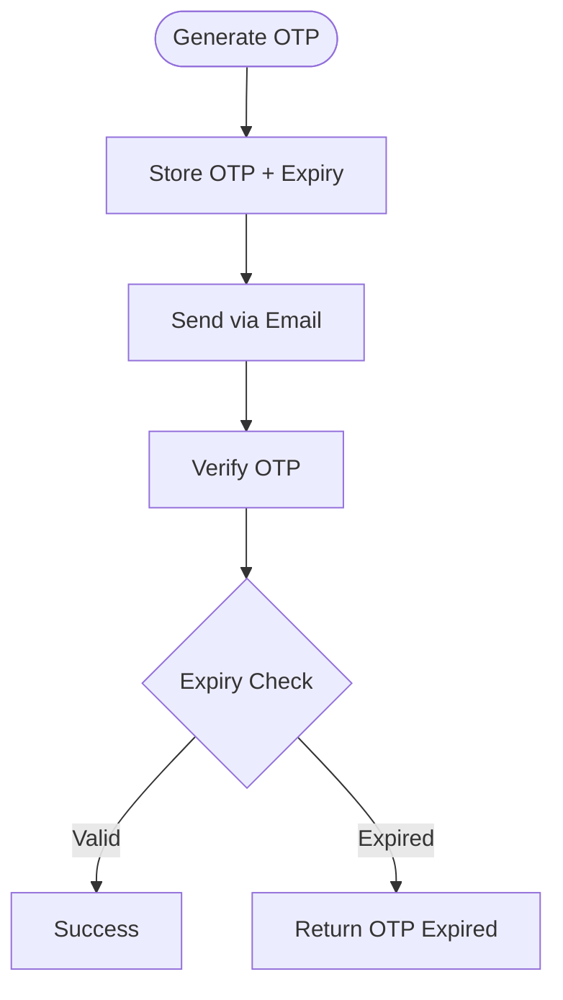
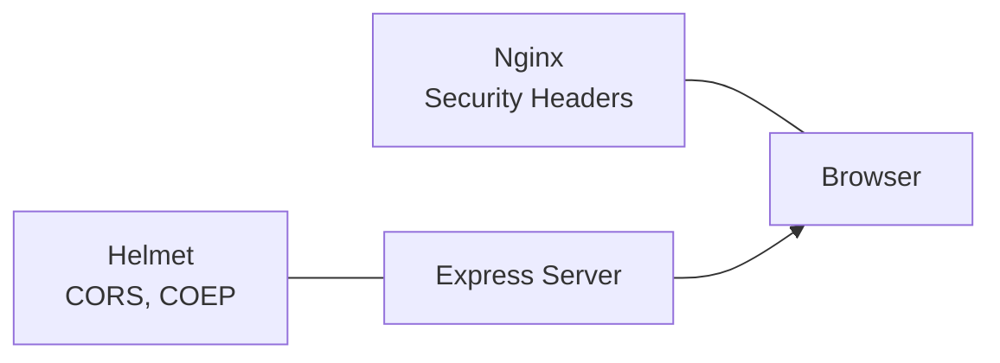
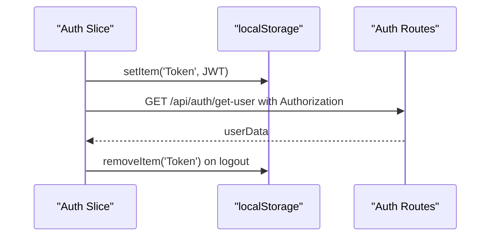
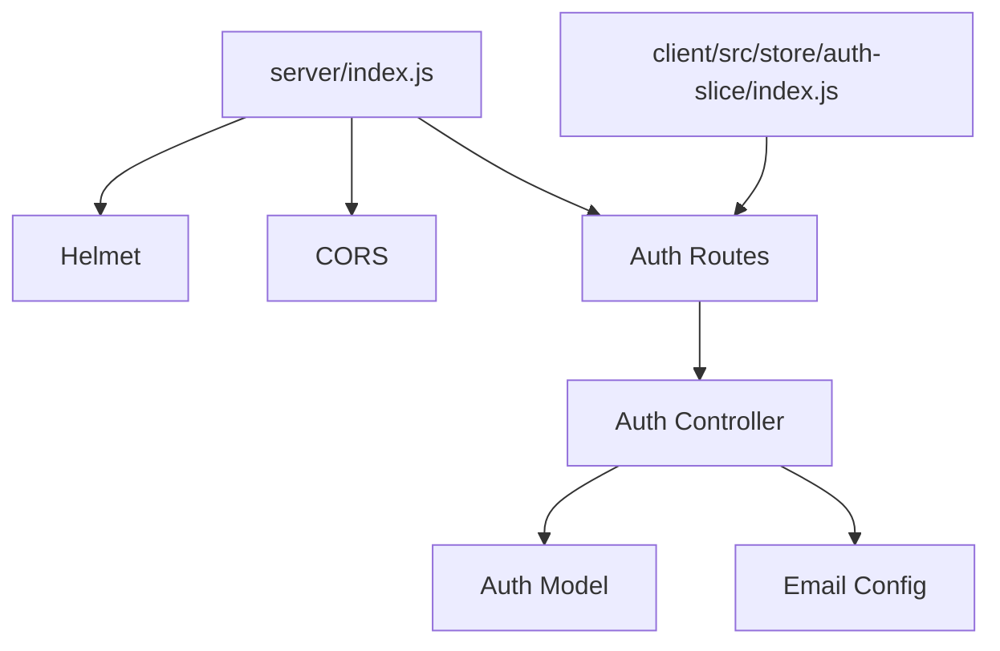

# Session Security Measures

<cite>
**Referenced Files in This Document**
- [index.js](file://server/index.js)
- [authController.js](file://server/controllers/auth/authController.js)
- [isAuthenticated.js](file://server/middleware/isAuthenticated.js)
- [authModel.js](file://server/models/authModel.js)
- [authRoute.js](file://server/routes/auth/authRoute.js)
- [emailValidator.js](file://server/config/emailValidator.js)
- [sendgridEmail.js](file://server/config/sendgridEmail.js)
- [Login.jsx](file://client/src/Pages/authPage/Login.jsx)
- [LogoutAllDevices.jsx](file://client/src/Pages/LogoutAllDevices.jsx)
- [auth-slice/index.js](file://client/src/store/auth-slice/index.js)
- [nginx.conf](file://client/nginx.conf)
</cite>

## Table of Contents
1. [Introduction](#introduction)
2. [Project Structure](#project-structure)
3. [Core Components](#core-components)
4. [Architecture Overview](#architecture-overview)
5. [Detailed Component Analysis](#detailed-component-analysis)
6. [Dependency Analysis](#dependency-analysis)
7. [Performance Considerations](#performance-considerations)
8. [Troubleshooting Guide](#troubleshooting-guide)
9. [Conclusion](#conclusion)

## Introduction
This document details the session security measures and protection mechanisms implemented in the betting platform. It covers CSRF protection, secure cookie handling, session fixation prevention, rate limiting for login attempts and OTP/password reset requests, session timeout configurations, automatic logout procedures, concurrent session management, security headers, monitoring/logging of suspicious activities, session hijacking prevention via IP binding and device fingerprinting, and frontend session management including automatic logout on inactivity and cross-tab synchronization.

## Project Structure
The session security implementation spans backend Express server, MongoDB models, JWT-based authentication middleware, and the React frontend with Redux Toolkit slices and Axios HTTP client.

**Diagram sources**
- [index.js](file://server/index.js#L1-L150)
- [authRoute.js](file://server/routes/auth/authRoute.js#L1-L34)
- [isAuthenticated.js](file://server/middleware/isAuthenticated.js#L1-L62)
- [authModel.js](file://server/models/authModel.js#L1-L40)
- [auth-slice/index.js](file://client/src/store/auth-slice/index.js#L1-L342)
- [Login.jsx](file://client/src/Pages/authPage/Login.jsx#L1-L221)
- [LogoutAllDevices.jsx](file://client/src/Pages/LogoutAllDevices.jsx#L1-L196)

**Section sources**
- [index.js](file://server/index.js#L1-L150)
- [authRoute.js](file://server/routes/auth/authRoute.js#L1-L34)
- [isAuthenticated.js](file://server/middleware/isAuthenticated.js#L1-L62)
- [authModel.js](file://server/models/authModel.js#L1-L40)
- [auth-slice/index.js](file://client/src/store/auth-slice/index.js#L1-L342)
- [Login.jsx](file://client/src/Pages/authPage/Login.jsx#L1-L221)
- [LogoutAllDevices.jsx](file://client/src/Pages/LogoutAllDevices.jsx#L1-L196)

## Core Components
- Backend Express app with Helmet security headers, CORS configuration, and request logging.
- JWT-based authentication middleware verifying tokens and enforcing session validity.
- Auth controller implementing login, logout, OTP verification, password reset, and force logout flows.
- Auth model storing session tokens and verification codes with expiration.
- Frontend Redux slice managing authentication state, caching tokens in localStorage, and coordinating with backend APIs.
- Email configuration using SendGrid and ZeroBounce for robust email validation and delivery.

Key security controls:
- JWT bearer tokens stored in localStorage on the client; server-side sessionToken field prevents token reuse and enables centralized logout.
- OTP-based flows for verification, password reset, and force logout with expiry checks.
- CORS with credentials enabled and strict origin allowlist.
- Helmet for security headers; Nginx adds HSTS, XSS, and frame options.

**Section sources**
- [index.js](file://server/index.js#L27-L51)
- [isAuthenticated.js](file://server/middleware/isAuthenticated.js#L3-L49)
- [authController.js](file://server/controllers/auth/authController.js#L195-L250)
- [authModel.js](file://server/models/authModel.js#L21-L21)
- [auth-slice/index.js](file://client/src/store/auth-slice/index.js#L286-L298)
- [sendgridEmail.js](file://server/config/sendgridEmail.js#L6-L31)
- [emailValidator.js](file://server/config/emailValidator.js#L10-L126)

## Architecture Overview
The authentication flow integrates frontend Redux actions with backend routes and middleware. Tokens are validated centrally, and session termination is enforced via the sessionToken field.

**Diagram sources**
- [auth-slice/index.js](file://client/src/store/auth-slice/index.js#L49-L63)
- [authRoute.js](file://server/routes/auth/authRoute.js#L21-L21)
- [isAuthenticated.js](file://server/middleware/isAuthenticated.js#L12-L44)
- [authModel.js](file://server/models/authModel.js#L21-L21)
- [authController.js](file://server/controllers/auth/authController.js#L227-L240)

## Detailed Component Analysis

### CSRF Protection
- The backend does not implement CSRF tokens for state-changing requests. Authentication relies on Authorization headers with JWT bearer tokens rather than cookies, reducing CSRF risk. However, CSRF protection should be considered for forms or endpoints that accept cookies.
- Recommendations:
  - Introduce SameSite cookies for session cookies if cookies are used.
  - Add CSRF tokens for HTML forms and validate them server-side.
  - Enforce Content-Type restrictions and Origin/CORS policies strictly.

[No sources needed since this section provides general guidance]

### Secure Cookie Handling
- Current implementation stores JWT in localStorage on the client; no cookies are used for session storage.
- If cookies were used, the following would apply:
  - Set HttpOnly flag to prevent client-side script access.
  - Set Secure flag for HTTPS-only transmission.
  - Set SameSite=Lax or Strict depending on CSRF risk tolerance.
  - Enforce SameSite=None with Secure for cross-site requests.

[No sources needed since this section provides general guidance]

### Session Fixation Prevention
- Implemented via the sessionToken field in the Auth model and middleware validation:
  - On login, the server generates a new JWT and saves it to sessionToken.
  - On subsequent requests, middleware verifies that the token matches the stored sessionToken.
  - Centralized logout clears sessionToken, immediately terminating the session server-side.

**Diagram sources**
- [authController.js](file://server/controllers/auth/authController.js#L227-L240)
- [isAuthenticated.js](file://server/middleware/isAuthenticated.js#L25-L40)
- [authModel.js](file://server/models/authModel.js#L21-L21)

**Section sources**
- [authController.js](file://server/controllers/auth/authController.js#L227-L240)
- [isAuthenticated.js](file://server/middleware/isAuthenticated.js#L33-L40)
- [authModel.js](file://server/models/authModel.js#L21-L21)

### Rate Limiting Mechanisms
- The server imports express-rate-limit but does not configure route-specific rate limits in the provided code.
- Recommended implementation:
  - Apply rate limits per IP for login, OTP resend, and password reset endpoints.
  - Use separate windows and limits for different endpoints (e.g., stricter limits for login).
  - Integrate with Redis for distributed rate limiting in production.

[No sources needed since this section provides general guidance]

### OTP Retries and Expiry
- OTP generation and verification:
  - OTP is a 6-digit random number with a 10-minute expiry.
  - Registration attempts are capped to prevent abuse.
  - OTP resend and verification endpoints enforce expiry checks.
- Force logout and password reset also use OTP with expiry enforcement.

**Diagram sources**
- [authController.js](file://server/controllers/auth/authController.js#L27-L29)
- [authController.js](file://server/controllers/auth/authController.js#L102-L105)
- [authController.js](file://server/controllers/auth/authController.js#L154-L180)
- [authController.js](file://server/controllers/auth/authController.js#L389-L411)

**Section sources**
- [authController.js](file://server/controllers/auth/authController.js#L27-L29)
- [authController.js](file://server/controllers/auth/authController.js#L102-L105)
- [authController.js](file://server/controllers/auth/authController.js#L154-L180)
- [authController.js](file://server/controllers/auth/authController.js#L389-L411)

### Session Timeout and Automatic Logout
- JWT expiration is handled by the library; the middleware returns a specific message for expired tokens.
- No server-side session TTL is configured; sessions persist until logout or forced logout.
- Recommendations:
  - Set short-lived access tokens and refresh tokens.
  - Implement sliding expiration on activity.
  - Add server-side TTL on sessionToken with cleanup jobs.

**Section sources**
- [isAuthenticated.js](file://server/middleware/isAuthenticated.js#L14-L18)
- [authModel.js](file://server/models/authModel.js#L21-L21)

### Concurrent Session Management
- The current model supports single active session per user via sessionToken.
- To enable multiple concurrent sessions, consider:
  - Storing multiple tokens per user and validating against a set.
  - Implementing device/session identifiers and revocation lists.
  - Using refresh tokens with per-device rotation.

[No sources needed since this section provides general guidance]

### Security Headers Implementation
- Backend (Helmet):
  - Cross-Origin Resource Policy configured.
  - Content-Security-Policy disabled for flexibility; can be hardened.
- Nginx:
  - X-Frame-Options, X-XSS-Protection, X-Content-Type-Options, Referrer-Policy, Strict-Transport-Security applied.
  - Enforces TLS v1.2/v1.3 and modern cipher suites.

**Diagram sources**
- [index.js](file://server/index.js#L27-L31)
- [nginx.conf](file://client/nginx.conf#L48-L52)

**Section sources**
- [index.js](file://server/index.js#L27-L31)
- [nginx.conf](file://client/nginx.conf#L48-L52)

### Monitoring and Logging of Suspicious Activities
- Request logging middleware logs method, path, and IP for all requests.
- Global error handler responds with generic messages; sensitive details are not leaked.
- Recommendations:
  - Log failed login attempts with IP and user agent.
  - Track OTP verification failures and password reset attempts.
  - Implement structured audit logs with correlation IDs.

**Section sources**
- [index.js](file://server/index.js#L67-L70)
- [index.js](file://server/index.js#L111-L139)

### Session Hijacking Prevention
- IP binding and device fingerprinting are not implemented in the current code.
- Recommendations:
  - Bind sessions to IP or device fingerprints.
  - Rotate tokens on IP change or device profile changes.
  - Monitor unusual geographic or device patterns.

[No sources needed since this section provides general guidance]

### Frontend Session Management
- Token storage:
  - Login action stores the returned JWT in localStorage under the key Token.
  - Logout removes the token from localStorage.
- Automatic logout on inactivity:
  - Not implemented in the provided code; can be added via timers and silent refresh.
- Cross-tab synchronization:
  - Not implemented; can be achieved via Storage events to broadcast logout across tabs.

**Diagram sources**
- [auth-slice/index.js](file://client/src/store/auth-slice/index.js#L290)
- [auth-slice/index.js](file://client/src/store/auth-slice/index.js#L336)
- [auth-slice/index.js](file://client/src/store/auth-slice/index.js#L82-L98)

**Section sources**
- [auth-slice/index.js](file://client/src/store/auth-slice/index.js#L286-L298)
- [auth-slice/index.js](file://client/src/store/auth-slice/index.js#L333-L337)
- [Login.jsx](file://client/src/Pages/authPage/Login.jsx#L30-L33)
- [LogoutAllDevices.jsx](file://client/src/Pages/LogoutAllDevices.jsx#L1-L196)

## Dependency Analysis

**Diagram sources**
- [index.js](file://server/index.js#L17-L17)
- [index.js](file://server/index.js#L34-L51)
- [authRoute.js](file://server/routes/auth/authRoute.js#L1-L34)
- [authController.js](file://server/controllers/auth/authController.js#L1-L6)
- [authModel.js](file://server/models/authModel.js#L1-L40)
- [sendgridEmail.js](file://server/config/sendgridEmail.js#L1-L58)
- [auth-slice/index.js](file://client/src/store/auth-slice/index.js#L1-L342)

**Section sources**
- [index.js](file://server/index.js#L1-L150)
- [authRoute.js](file://server/routes/auth/authRoute.js#L1-L34)
- [authController.js](file://server/controllers/auth/authController.js#L1-L6)
- [authModel.js](file://server/models/authModel.js#L1-L40)
- [sendgridEmail.js](file://server/config/sendgridEmail.js#L1-L58)
- [auth-slice/index.js](file://client/src/store/auth-slice/index.js#L1-L342)

## Performance Considerations
- Helmet and CORS are applied globally; ensure CSP is configured to avoid performance penalties from excessive restrictions.
- Large request bodies are supported; validate payload sizes and implement rate limits to mitigate resource exhaustion.
- Consider connection pooling and query indexing for frequent auth operations.

[No sources needed since this section provides general guidance]

## Troubleshooting Guide
- Authentication errors:
  - Token missing or malformed: 401 with user not authenticated or invalid token.
  - Token expired: 401 with session expired message.
  - Session terminated: 401 with session terminated and forceLogout flag.
- OTP issues:
  - Invalid OTP or expired OTP: Clear error messages returned.
  - Excessive registration attempts: Blocked with maximum attempts exceeded.
- Email delivery:
  - SendGrid errors are caught and mapped to structured error objects with bounce reasons.

**Section sources**
- [isAuthenticated.js](file://server/middleware/isAuthenticated.js#L8-L48)
- [authController.js](file://server/controllers/auth/authController.js#L172-L180)
- [authController.js](file://server/controllers/auth/authController.js#L81-L83)
- [sendgridEmail.js](file://server/config/sendgridEmail.js#L31-L57)

## Conclusion
The platform implements strong JWT-based session management with centralized token validation and server-side sessionToken enforcement to prevent session fixation. OTP-based flows and email validation enhance account security. Security headers are applied at both server and reverse proxy layers. Areas for improvement include CSRF protection, rate limiting, session timeout with sliding expiration, concurrent session support, IP/device binding, and enhanced frontend cross-tab synchronization and inactivity-based logout.