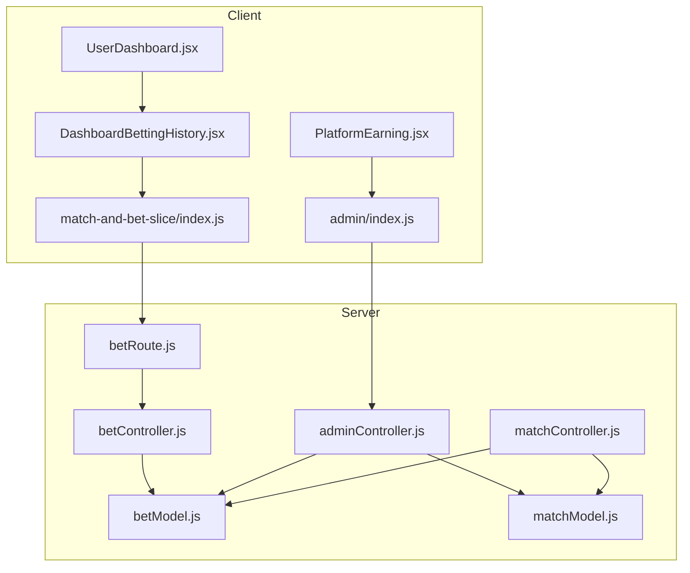
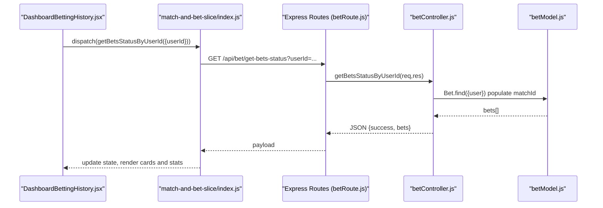
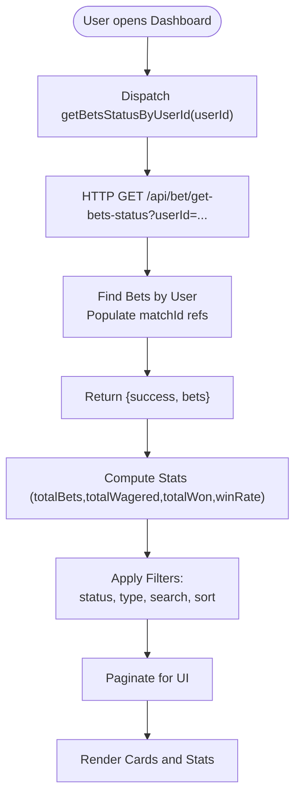
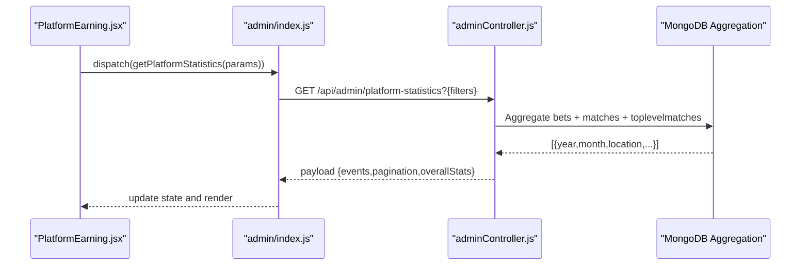
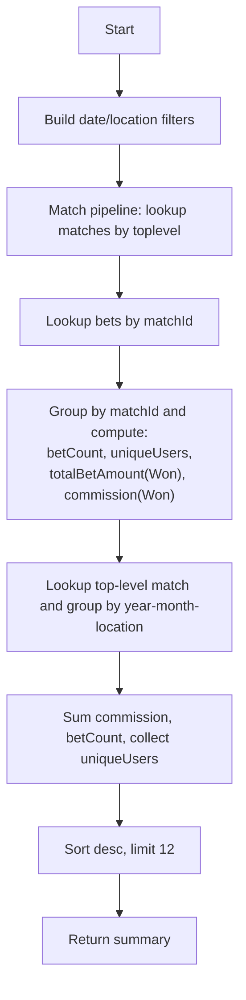
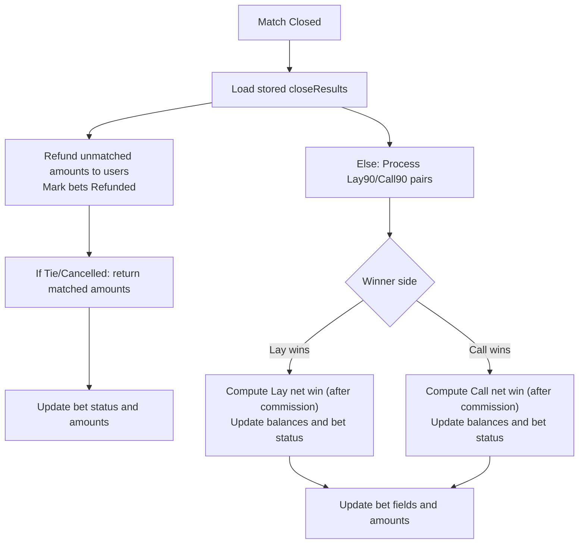
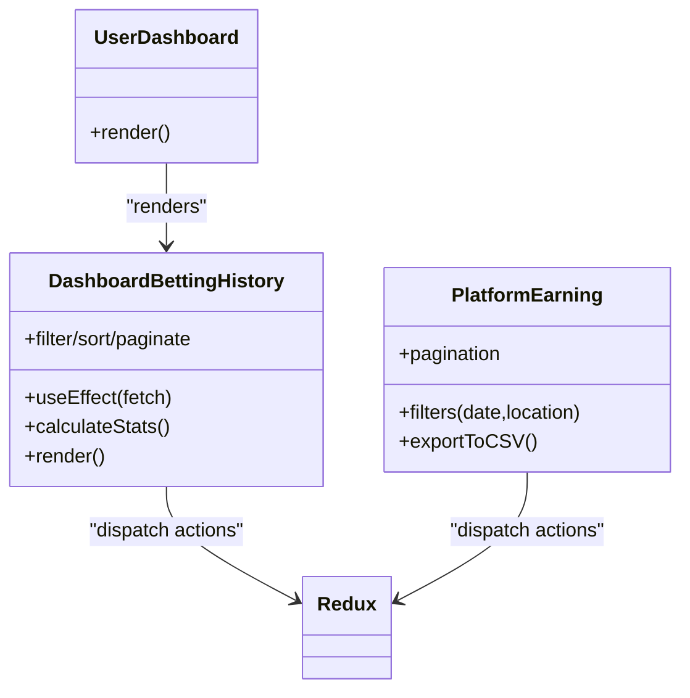
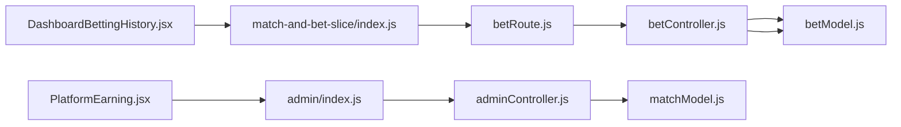

# Bet History and Analytics

<cite>
**Referenced Files in This Document**
- [betModel.js](file://server/models/betModel.js)
- [matchModel.js](file://server/models/matchModel.js)
- [betController.js](file://server/controllers/bet/betController.js)
- [betRoute.js](file://server/routes/bet/betRoute.js)
- [adminController.js](file://server/controllers/admin/adminController.js)
- [matchController.js](file://server/controllers/admin/matchController.js)
- [DashboardBettingHistory.jsx](file://client/src/components/User/DashboardBettingHistory.jsx)
- [UserDashboard.jsx](file://client/src/Pages/User/UserDashboard.jsx)
- [index.js (match-and-bet slice)](file://client/src/store/user/match-and-bet-slice/index.js)
- [index.js (admin store)](file://client/src/store/admin/index.js)
- [PlatformEarning.jsx](file://client/src/Pages/adminPage/PlatformEarning.jsx)
</cite>

## Table of Contents
1. [Introduction](#introduction)
2. [Project Structure](#project-structure)
3. [Core Components](#core-components)
4. [Architecture Overview](#architecture-overview)
5. [Detailed Component Analysis](#detailed-component-analysis)
6. [Dependency Analysis](#dependency-analysis)
7. [Performance Considerations](#performance-considerations)
8. [Troubleshooting Guide](#troubleshooting-guide)
9. [Conclusion](#conclusion)
10. [Appendices](#appendices)

## Introduction
This document describes the bet history and analytics subsystem for the betting platform. It covers:
- Bet history retrieval and filtering by user, match, and date range
- Analytics dashboard features for betting statistics, win/loss tracking, and performance metrics
- Data aggregation algorithms for historical reports and trend analysis
- Bet status tracking (pending, settled, refunded) and status transitions
- API endpoints for bet history queries and frontend integration patterns
- Examples of analytics queries, report generation, and user-facing displays
- Data retention and archival considerations

## Project Structure
The subsystem spans backend MongoDB models and controllers, Express routes, and frontend Redux slices and components.

**Diagram sources**
- [UserDashboard.jsx](file://client/src/Pages/User/UserDashboard.jsx#L1-L34)
- [DashboardBettingHistory.jsx](file://client/src/components/User/DashboardBettingHistory.jsx#L1-L565)
- [index.js (match-and-bet slice)](file://client/src/store/user/match-and-bet-slice/index.js#L1-L127)
- [index.js (admin store)](file://client/src/store/admin/index.js#L1-L334)
- [betRoute.js](file://server/routes/bet/betRoute.js#L1-L11)
- [betController.js](file://server/controllers/bet/betController.js#L1-L125)
- [adminController.js](file://server/controllers/admin/adminController.js#L128-L465)
- [matchController.js](file://server/controllers/admin/matchController.js#L850-L1049)
- [betModel.js](file://server/models/betModel.js#L1-L24)
- [matchModel.js](file://server/models/matchModel.js#L1-L101)

**Section sources**
- [betRoute.js](file://server/routes/bet/betRoute.js#L1-L11)
- [betController.js](file://server/controllers/bet/betController.js#L1-L125)
- [betModel.js](file://server/models/betModel.js#L1-L24)
- [matchModel.js](file://server/models/matchModel.js#L1-L101)
- [DashboardBettingHistory.jsx](file://client/src/components/User/DashboardBettingHistory.jsx#L1-L565)
- [index.js (match-and-bet slice)](file://client/src/store/user/match-and-bet-slice/index.js#L1-L127)
- [index.js (admin store)](file://client/src/store/admin/index.js#L1-L334)
- [PlatformEarning.jsx](file://client/src/Pages/adminPage/PlatformEarning.jsx#L1-L672)

## Core Components
- Bet model: Defines bet schema, indexes, and status lifecycle.
- Match model: Stores match metadata, sections, rounds, and close results with user-wise bet summaries.
- Bet controller: Exposes endpoints to fetch user bets, match bets, and place bets.
- Admin controller: Provides platform-level analytics via aggregations and summary endpoints.
- Frontend dashboard: Renders user betting history, filters, sorting, and stats cards.
- Admin analytics: Renders platform earnings, filters by date/location, and exports CSV.

Key capabilities:
- User-centric bet history with filtering by status and bet type, plus search by match title or selected bird.
- Match-level bet aggregation and settlement logic with unmatched amounts refunded.
- Platform-level analytics with monthly roll-ups, commissions, and user counts.

**Section sources**
- [betModel.js](file://server/models/betModel.js#L1-L24)
- [matchModel.js](file://server/models/matchModel.js#L1-L101)
- [betController.js](file://server/controllers/bet/betController.js#L108-L125)
- [adminController.js](file://server/controllers/admin/adminController.js#L128-L465)
- [DashboardBettingHistory.jsx](file://client/src/components/User/DashboardBettingHistory.jsx#L76-L124)

## Architecture Overview
End-to-end flow for retrieving user bet history and generating analytics:

**Diagram sources**
- [DashboardBettingHistory.jsx](file://client/src/components/User/DashboardBettingHistory.jsx#L56-L74)
- [index.js (match-and-bet slice)](file://client/src/store/user/match-and-bet-slice/index.js#L84-L94)
- [betRoute.js](file://server/routes/bet/betRoute.js#L7-L7)
- [betController.js](file://server/controllers/bet/betController.js#L108-L124)
- [betModel.js](file://server/models/betModel.js#L1-L24)

## Detailed Component Analysis

### Bet History Retrieval and Filtering
- Endpoint: GET /api/bet/get-bets-status?userId={id}
- Behavior:
  - Finds all bets for a given user ID.
  - Populates match metadata (round, section, top-level location) for display.
  - Returns success flag and bet array.
- Frontend:
  - Dispatches getBetsStatusByUserId thunk.
  - Computes stats (total bets, total wagered, total won, win rate).
  - Applies client-side filters: status, bet type, search term, and sort order.
  - Paginates results for UI rendering.

**Diagram sources**
- [DashboardBettingHistory.jsx](file://client/src/components/User/DashboardBettingHistory.jsx#L56-L124)
- [index.js (match-and-bet slice)](file://client/src/store/user/match-and-bet-slice/index.js#L84-L94)
- [betController.js](file://server/controllers/bet/betController.js#L108-L124)

**Section sources**
- [betController.js](file://server/controllers/bet/betController.js#L108-L124)
- [DashboardBettingHistory.jsx](file://client/src/components/User/DashboardBettingHistory.jsx#L76-L124)
- [index.js (match-and-bet slice)](file://client/src/store/user/match-and-bet-slice/index.js#L84-L94)

### Analytics Dashboard Features
- User-level:
  - Stats cards: total bets, total wagered, total won, win rate.
  - Filters: status, bet type, search by match title or selected bird.
  - Sorting and pagination.
- Platform-level:
  - Monthly roll-ups by location with commission, bet counts, and unique users.
  - Date-range filtering and location search.
  - CSV export per event.

**Diagram sources**
- [PlatformEarning.jsx](file://client/src/Pages/adminPage/PlatformEarning.jsx#L82-L107)
- [index.js (admin store)](file://client/src/store/admin/index.js#L130-L143)
- [adminController.js](file://server/controllers/admin/adminController.js#L128-L465)

**Section sources**
- [PlatformEarning.jsx](file://client/src/Pages/adminPage/PlatformEarning.jsx#L1-L672)
- [index.js (admin store)](file://client/src/store/admin/index.js#L130-L158)
- [adminController.js](file://server/controllers/admin/adminController.js#L128-L465)

### Data Aggregation Algorithms
- Platform summary aggregation:
  - Filters bets by optional date range and status = Won.
  - Joins with matches and top-level matches.
  - Groups by year-month-location and computes:
    - Total commission (10% of actualAmount).
    - Bet count.
    - Unique users.
  - Sorts by most recent and limits to 12 months.
- Platform statistics aggregation:
  - Filters completed top-level matches by date/location.
  - For each match, aggregates bet counts, unique users, total bet amounts (only won bets), and commission (only won bets).
  - Returns paginated results with overall stats.

**Diagram sources**
- [adminController.js](file://server/controllers/admin/adminController.js#L158-L451)

**Section sources**
- [adminController.js](file://server/controllers/admin/adminController.js#L128-L465)

### Bet Status Tracking and Transitions
- Bet statuses: Pending, Won, Lost, Refunded, Tied, Cancelled.
- Settlement flow:
  - Close match stores matching results (user summaries, matched pairs).
  - Refund unmatched amounts to users and mark bets as Refunded.
  - Settle matched bets based on winner:
    - Tie/Cancelled: return matched amounts to users, mark bets accordingly.
    - Lay90/Call90: compute net wins/losses with commission rates and update balances.
  - Update bet fields: actualAmount, winnings, losing, refundedAmount, winningBird.

**Diagram sources**
- [matchController.js](file://server/controllers/admin/matchController.js#L850-L1049)
- [betModel.js](file://server/models/betModel.js#L10-L18)

**Section sources**
- [matchController.js](file://server/controllers/admin/matchController.js#L850-L1049)
- [betModel.js](file://server/models/betModel.js#L10-L18)

### API Endpoints for Bet History Queries
- Place bet
  - Method: POST
  - Path: /api/bet/create
  - Body: {userId, matchId, selectedBird, amount, type}
- Get user bet history
  - Method: GET
  - Path: /api/bet/get-bets-status?userId={id}
- Get match bets
  - Method: GET
  - Path: /api/bet/:matchId
- Admin platform statistics
  - Method: GET
  - Path: /api/admin/platform-statistics?startDate&endDate&page&limit&location
- Admin platform summary
  - Method: GET
  - Path: /api/admin/platform-summary?startDate&endDate

**Section sources**
- [betRoute.js](file://server/routes/bet/betRoute.js#L6-L8)
- [betController.js](file://server/controllers/bet/betController.js#L43-L106)
- [adminController.js](file://server/controllers/admin/adminController.js#L128-L465)

### Frontend Integration Patterns
- User dashboard:
  - UserDashboard renders DashboardBettingHistory and passes stats state.
- DashboardBettingHistory:
  - Uses Redux to fetch user bets.
  - Computes stats and applies client-side filters/sorting/pagination.
  - Renders bet cards with status badges, financial details, and match info.
- Admin analytics:
  - PlatformEarning manages filters (location, date range), pagination, and CSV export.

**Diagram sources**
- [UserDashboard.jsx](file://client/src/Pages/User/UserDashboard.jsx#L10-L31)
- [DashboardBettingHistory.jsx](file://client/src/components/User/DashboardBettingHistory.jsx#L38-L565)
- [PlatformEarning.jsx](file://client/src/Pages/adminPage/PlatformEarning.jsx#L1-L672)

**Section sources**
- [UserDashboard.jsx](file://client/src/Pages/User/UserDashboard.jsx#L1-L34)
- [DashboardBettingHistory.jsx](file://client/src/components/User/DashboardBettingHistory.jsx#L1-L565)
- [PlatformEarning.jsx](file://client/src/Pages/adminPage/PlatformEarning.jsx#L1-L672)

### Examples of Analytics Queries and Report Generation
- Example: Monthly platform summary by location and date range
  - Backend aggregation pipeline groups by year-month-location and computes commission, bet counts, and unique users.
  - Frontend filters support quick date ranges (today, last 7/30 days, this month, all time).
- Example: Event-level CSV export
  - Generates CSV with event-level stats and match-level details for a selected event.

**Section sources**
- [adminController.js](file://server/controllers/admin/adminController.js#L385-L465)
- [PlatformEarning.jsx](file://client/src/Pages/adminPage/PlatformEarning.jsx#L194-L262)

### User-Facing Betting History Displays
- Stats cards: total bets, total wagered, total won, win rate.
- Filters: status, bet type, search term.
- Sorting: by creation date (descending by default).
- Pagination: 6 items per page.
- Status badges: color-coded and localized labels.

**Section sources**
- [DashboardBettingHistory.jsx](file://client/src/components/User/DashboardBettingHistory.jsx#L76-L124)
- [DashboardBettingHistory.jsx](file://client/src/components/User/DashboardBettingHistory.jsx#L438-L560)

## Dependency Analysis
- Client depends on Redux thunks to call server endpoints.
- Server routes delegate to controllers; controllers operate on models and MongoDB aggregations.
- Match model stores close results enabling efficient settlement and reporting.

**Diagram sources**
- [DashboardBettingHistory.jsx](file://client/src/components/User/DashboardBettingHistory.jsx#L1-L565)
- [index.js (match-and-bet slice)](file://client/src/store/user/match-and-bet-slice/index.js#L1-L127)
- [PlatformEarning.jsx](file://client/src/Pages/adminPage/PlatformEarning.jsx#L1-L672)
- [index.js (admin store)](file://client/src/store/admin/index.js#L1-L334)
- [betRoute.js](file://server/routes/bet/betRoute.js#L1-L11)
- [betController.js](file://server/controllers/bet/betController.js#L1-L125)
- [adminController.js](file://server/controllers/admin/adminController.js#L128-L465)
- [betModel.js](file://server/models/betModel.js#L1-L24)
- [matchModel.js](file://server/models/matchModel.js#L1-L101)

**Section sources**
- [betRoute.js](file://server/routes/bet/betRoute.js#L1-L11)
- [betController.js](file://server/controllers/bet/betController.js#L1-L125)
- [adminController.js](file://server/controllers/admin/adminController.js#L128-L465)
- [matchController.js](file://server/controllers/admin/matchController.js#L850-L1049)

## Performance Considerations
- Indexes:
  - Bet model: createdAt descending index and compound index on matchId and status to accelerate match-level queries.
  - Match model: indexes on status and createdAt for filtering and sorting.
- Aggregations:
  - Use pipeline stages to filter early and minimize documents passed downstream.
  - Limit grouped results (e.g., last 12 months) to keep responses fast.
- Frontend:
  - Client-side filtering and pagination reduce server load for user history.
  - Debounced search prevents excessive requests.

**Section sources**
- [betModel.js](file://server/models/betModel.js#L21-L22)
- [matchModel.js](file://server/models/matchModel.js#L94-L96)
- [adminController.js](file://server/controllers/admin/adminController.js#L396-L451)

## Troubleshooting Guide
- Common errors:
  - Missing required fields or invalid amount when placing bets.
  - Insufficient funds or match not active.
  - Match not found or already settled.
  - Aggregation failures due to missing close results or invalid filters.
- Recommendations:
  - Validate inputs on the client before dispatching actions.
  - Handle rejected promises from Redux thunks and show user-friendly messages.
  - Ensure match close results exist before settling.
  - Use date range and location filters to narrow down analytics queries.

**Section sources**
- [betController.js](file://server/controllers/bet/betController.js#L43-L106)
- [matchController.js](file://server/controllers/admin/matchController.js#L902-L950)
- [adminController.js](file://server/controllers/admin/adminController.js#L385-L465)

## Conclusion
The bet history and analytics subsystem integrates user-facing bet displays with robust backend aggregations and settlement logic. It supports granular filtering, real-time-like updates via sockets during match closing, and comprehensive platform analytics with export capabilities. Proper indexing and aggregation strategies ensure scalability and responsiveness.

## Appendices

### API Definitions
- Place bet
  - Method: POST
  - Path: /api/bet/create
  - Body: {userId, matchId, selectedBird, amount, type}
- Get user bet history
  - Method: GET
  - Path: /api/bet/get-bets-status?userId={id}
- Get match bets
  - Method: GET
  - Path: /api/bet/:matchId
- Admin platform statistics
  - Method: GET
  - Path: /api/admin/platform-statistics?startDate&endDate&page&limit&location
- Admin platform summary
  - Method: GET
  - Path: /api/admin/platform-summary?startDate&endDate

**Section sources**
- [betRoute.js](file://server/routes/bet/betRoute.js#L6-L8)
- [adminController.js](file://server/controllers/admin/adminController.js#L128-L465)

### Data Retention and Archival Strategies
- Retention:
  - Keep bet history indefinitely for compliance and user access.
  - Archive completed matches’ close results periodically to optimize query performance.
- Archival:
  - Move historical bets older than a threshold to cold storage with reduced indexing.
  - Maintain analytics roll-ups (monthly summaries) separately for fast reporting.
- Compliance:
  - Implement data deletion requests and anonymization for long-term retention periods.

[No sources needed since this section provides general guidance]