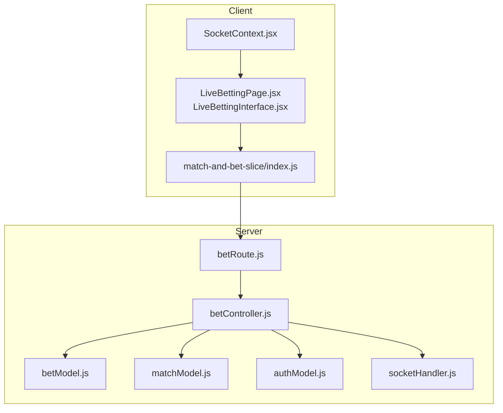
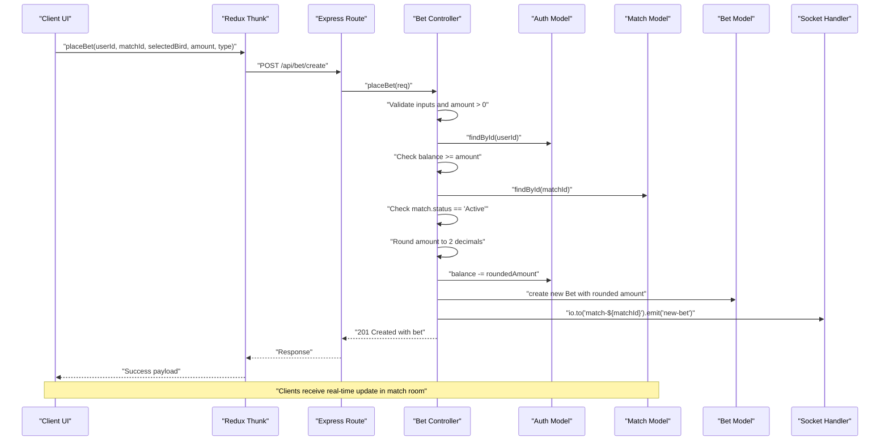
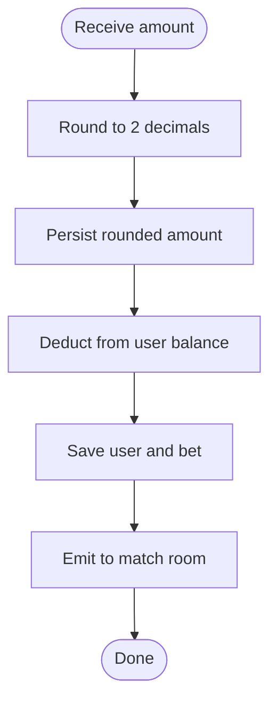
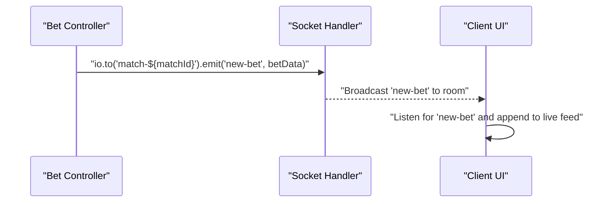
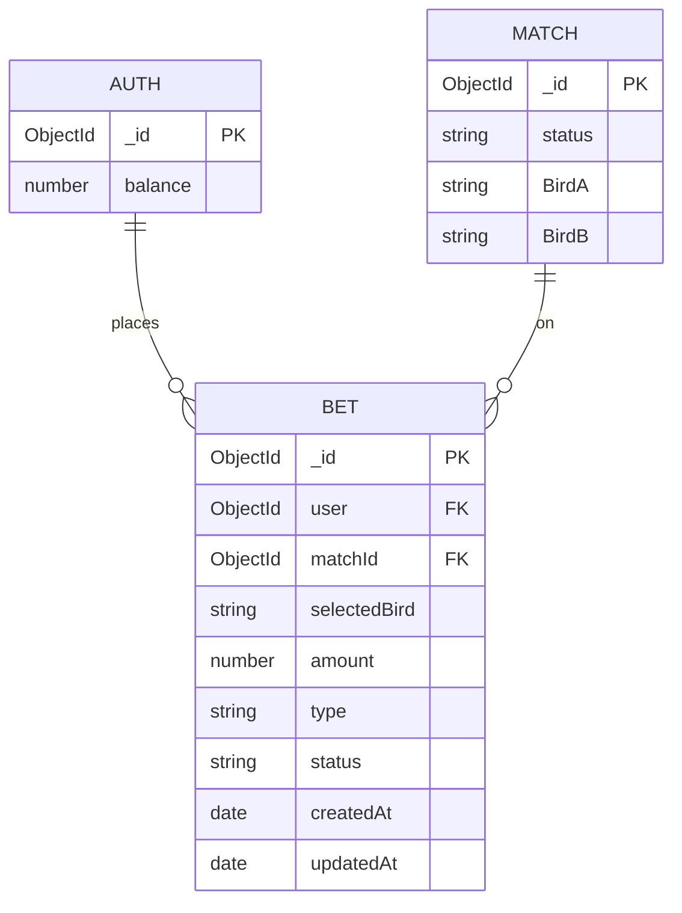
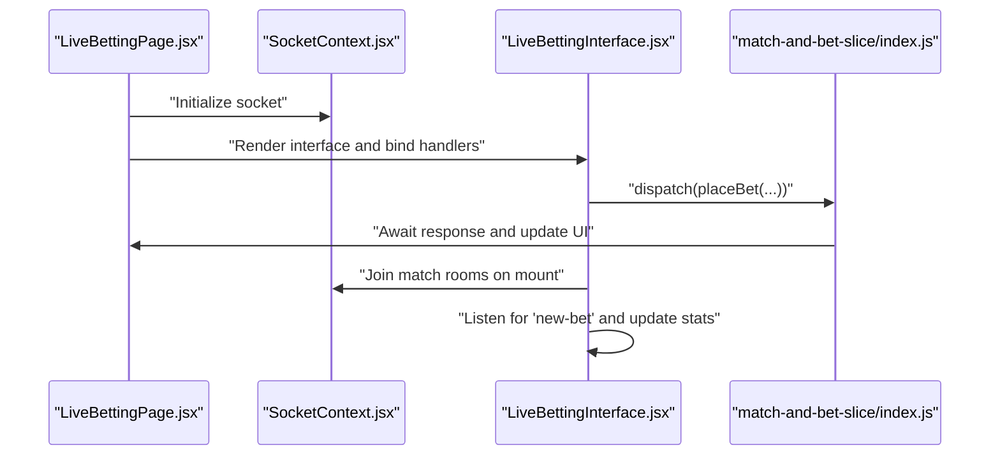
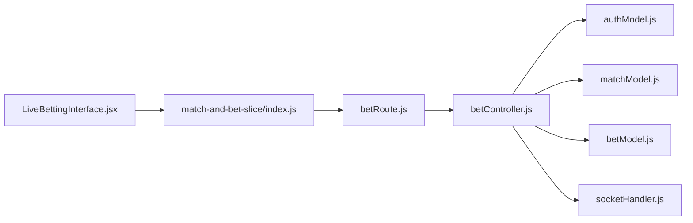

# Bet Placement Logic

<cite>
**Referenced Files in This Document**
- [betController.js](file://server/controllers/bet/betController.js)
- [betModel.js](file://server/models/betModel.js)
- [matchModel.js](file://server/models/matchModel.js)
- [authModel.js](file://server/models/authModel.js)
- [socketHandler.js](file://server/socket/socketHandler.js)
- [betRoute.js](file://server/routes/bet/betRoute.js)
- [LiveBettingPage.jsx](file://client/src/Pages/Bet/LiveBettingPage.jsx)
- [LiveBettingInterface.jsx](file://client/src/components/Bet/LiveBettingInterface.jsx)
- [SocketContext.jsx](file://client/src/context/SocketContext.jsx)
- [match-and-bet-slice/index.js](file://client/src/store/user/match-and-bet-slice/index.js)
</cite>

## Table of Contents
1. [Introduction](#introduction)
2. [Project Structure](#project-structure)
3. [Core Components](#core-components)
4. [Architecture Overview](#architecture-overview)
5. [Detailed Component Analysis](#detailed-component-analysis)
6. [Dependency Analysis](#dependency-analysis)
7. [Performance Considerations](#performance-considerations)
8. [Troubleshooting Guide](#troubleshooting-guide)
9. [Conclusion](#conclusion)

## Introduction
This document explains the bet placement logic subsystem end-to-end. It covers the complete bet creation flow: validation of inputs and match eligibility, user fund deduction, bet persistence, amount rounding, real-time emission via Socket.IO to match-specific rooms, and error handling. It also documents the supported bet types (Straight, Lay90, Call90), their validation rules, and how concurrent placements are handled within the current implementation.

## Project Structure
The bet placement logic spans the server-side controllers, models, and socket handler, and the client-side Redux store and UI components that trigger and display live bet events.

**Diagram sources**
- [betRoute.js](file://server/routes/bet/betRoute.js#L1-L11)
- [betController.js](file://server/controllers/bet/betController.js#L43-L106)
- [betModel.js](file://server/models/betModel.js#L3-L23)
- [matchModel.js](file://server/models/matchModel.js#L17-L75)
- [authModel.js](file://server/models/authModel.js#L3-L32)
- [socketHandler.js](file://server/socket/socketHandler.js#L3-L91)
- [LiveBettingPage.jsx](file://client/src/Pages/Bet/LiveBettingPage.jsx#L1-L35)
- [LiveBettingInterface.jsx](file://client/src/components/Bet/LiveBettingInterface.jsx#L1-L439)
- [SocketContext.jsx](file://client/src/context/SocketContext.jsx#L1-L62)
- [match-and-bet-slice/index.js](file://client/src/store/user/match-and-bet-slice/index.js#L95-L114)

**Section sources**
- [betRoute.js](file://server/routes/bet/betRoute.js#L1-L11)
- [betController.js](file://server/controllers/bet/betController.js#L43-L106)
- [betModel.js](file://server/models/betModel.js#L3-L23)
- [matchModel.js](file://server/models/matchModel.js#L17-L75)
- [authModel.js](file://server/models/authModel.js#L3-L32)
- [socketHandler.js](file://server/socket/socketHandler.js#L3-L91)
- [LiveBettingPage.jsx](file://client/src/Pages/Bet/LiveBettingPage.jsx#L1-L35)
- [LiveBettingInterface.jsx](file://client/src/components/Bet/LiveBettingInterface.jsx#L1-L439)
- [SocketContext.jsx](file://client/src/context/SocketContext.jsx#L1-L62)
- [match-and-bet-slice/index.js](file://client/src/store/user/match-and-bet-slice/index.js#L95-L114)

## Core Components
- Bet controller: Validates inputs, checks match status, rounds amounts, deducts funds, persists bet, and emits real-time updates.
- Bet model: Defines schema for persisted bets, including bet type enum and status fields.
- Match model: Stores match metadata and status, used to gate bet placement.
- Auth model: Holds user balances and is updated during bet placement.
- Socket handler: Manages Socket.IO rooms and emits new bet events to match-specific rooms.
- Client store and UI: Trigger bet placement, join match rooms, and render live bet feed.

**Section sources**
- [betController.js](file://server/controllers/bet/betController.js#L43-L106)
- [betModel.js](file://server/models/betModel.js#L3-L23)
- [matchModel.js](file://server/models/matchModel.js#L17-L35)
- [authModel.js](file://server/models/authModel.js#L22-L22)
- [socketHandler.js](file://server/socket/socketHandler.js#L9-L14)
- [match-and-bet-slice/index.js](file://client/src/store/user/match-and-bet-slice/index.js#L95-L114)
- [LiveBettingInterface.jsx](file://client/src/components/Bet/LiveBettingInterface.jsx#L110-L169)

## Architecture Overview
The bet placement flow is a synchronous HTTP request-response with a subsequent real-time broadcast to clients subscribed to the match room.

**Diagram sources**
- [betRoute.js](file://server/routes/bet/betRoute.js#L6-L6)
- [betController.js](file://server/controllers/bet/betController.js#L45-L102)
- [authModel.js](file://server/models/authModel.js#L22-L22)
- [matchModel.js](file://server/models/matchModel.js#L29-L33)
- [betModel.js](file://server/models/betModel.js#L9-L10)
- [socketHandler.js](file://server/socket/socketHandler.js#L80-L96)
- [match-and-bet-slice/index.js](file://client/src/store/user/match-and-bet-slice/index.js#L95-L114)
- [LiveBettingInterface.jsx](file://client/src/components/Bet/LiveBettingInterface.jsx#L110-L169)

## Detailed Component Analysis

### Bet Types and Validation Rules
- Supported bet types: Straight, Lay90, Call90.
- Validation:
  - Bet type must be one of the allowed enum values.
  - Amount must be greater than zero.
  - Match status must be Active; otherwise, placement is rejected.
  - User must exist and have sufficient funds.

These rules are enforced in the controller’s validation phase.

**Section sources**
- [betModel.js](file://server/models/betModel.js#L10-L10)
- [betController.js](file://server/controllers/bet/betController.js#L46-L58)

### Amount Rounding and Currency Handling
- Amounts are rounded to two decimal places before persistence and fund deduction.
- Currency is implicitly handled as numeric units in the database; frontend displays formatted amounts.

**Diagram sources**
- [betController.js](file://server/controllers/bet/betController.js#L60-L64)
- [betController.js](file://server/controllers/bet/betController.js#L74-L74)
- [betController.js](file://server/controllers/bet/betController.js#L80-L96)

**Section sources**
- [betController.js](file://server/controllers/bet/betController.js#L60-L64)
- [betController.js](file://server/controllers/bet/betController.js#L74-L74)
- [betController.js](file://server/controllers/bet/betController.js#L80-L96)

### Real-Time Bet Emission and Room Management
- Clients join match rooms upon navigation and listen for new-bet events.
- The server emits only once per bet to the match-specific room.
- Rooms are identified by the pattern match-{matchId}.

**Diagram sources**
- [betController.js](file://server/controllers/bet/betController.js#L80-L96)
- [socketHandler.js](file://server/socket/socketHandler.js#L9-L14)
- [LiveBettingInterface.jsx](file://client/src/components/Bet/LiveBettingInterface.jsx#L110-L169)

**Section sources**
- [socketHandler.js](file://server/socket/socketHandler.js#L9-L14)
- [LiveBettingInterface.jsx](file://client/src/components/Bet/LiveBettingInterface.jsx#L110-L169)
- [LiveBettingPage.jsx](file://client/src/Pages/Bet/LiveBettingPage.jsx#L212-L224)

### Bet Persistence and Data Model
- Bet entity stores user reference, match reference, selected bird, amount, type, and timestamps.
- Indexes support sorting and filtering by match and status.

**Diagram sources**
- [authModel.js](file://server/models/authModel.js#L22-L22)
- [matchModel.js](file://server/models/matchModel.js#L17-L35)
- [betModel.js](file://server/models/betModel.js#L3-L23)

**Section sources**
- [betModel.js](file://server/models/betModel.js#L3-L23)
- [authModel.js](file://server/models/authModel.js#L22-L22)
- [matchModel.js](file://server/models/matchModel.js#L17-L35)

### Client-Side Integration
- The client triggers bet placement via a Redux thunk that calls the server route.
- The UI joins match rooms and listens for real-time updates.
- The UI prevents placing bets when the match is not Active and disables Lay90/Call90 options for now.

**Diagram sources**
- [LiveBettingPage.jsx](file://client/src/Pages/Bet/LiveBettingPage.jsx#L212-L224)
- [SocketContext.jsx](file://client/src/context/SocketContext.jsx#L18-L54)
- [LiveBettingInterface.jsx](file://client/src/components/Bet/LiveBettingInterface.jsx#L110-L169)
- [match-and-bet-slice/index.js](file://client/src/store/user/match-and-bet-slice/index.js#L95-L114)

**Section sources**
- [LiveBettingPage.jsx](file://client/src/Pages/Bet/LiveBettingPage.jsx#L212-L224)
- [SocketContext.jsx](file://client/src/context/SocketContext.jsx#L18-L54)
- [LiveBettingInterface.jsx](file://client/src/components/Bet/LiveBettingInterface.jsx#L110-L169)
- [match-and-bet-slice/index.js](file://client/src/store/user/match-and-bet-slice/index.js#L95-L114)

## Dependency Analysis
- Controller depends on models for user, match, and bet data.
- Socket handler is injected into the controller via a getter to emit events.
- Client store depends on the server route for bet placement.

**Diagram sources**
- [betController.js](file://server/controllers/bet/betController.js#L3-L6)
- [socketHandler.js](file://server/socket/socketHandler.js#L80-L96)
- [match-and-bet-slice/index.js](file://client/src/store/user/match-and-bet-slice/index.js#L95-L114)
- [betRoute.js](file://server/routes/bet/betRoute.js#L1-L11)

**Section sources**
- [betController.js](file://server/controllers/bet/betController.js#L3-L6)
- [socketHandler.js](file://server/socket/socketHandler.js#L80-L96)
- [match-and-bet-slice/index.js](file://client/src/store/user/match-and-bet-slice/index.js#L95-L114)
- [betRoute.js](file://server/routes/bet/betRoute.js#L1-L11)

## Performance Considerations
- Amount rounding occurs in-memory before persistence; keep amounts as Numbers to avoid precision loss.
- Database queries for user and match are single lookups; ensure indexes on _id and matchId/status are leveraged.
- Socket emissions target a single room per bet; ensure room names are matchId-scoped to minimize cross-room noise.
- Consider batching or debouncing UI updates if the live feed becomes very high-frequency.

[No sources needed since this section provides general guidance]

## Troubleshooting Guide
Common errors and their causes:
- Missing required fields: The controller rejects requests missing matchId, selectedBird, amount, type, or userId.
- Bet amount must be greater than zero: Non-positive amounts are rejected.
- Insufficient funds: The controller checks user balance against the bet amount and rejects if balance is lower.
- Invalid match status: Bets are accepted only when match.status equals Active.
- Socket emit errors: Emitted safely with a try/catch; check server logs for underlying transport issues.

Operational tips:
- Verify client joined the correct match room before expecting live updates.
- Confirm the match status is Active in the UI and server before placing a bet.
- Ensure the amount is rounded to two decimals before submission.

**Section sources**
- [betController.js](file://server/controllers/bet/betController.js#L46-L58)
- [betController.js](file://server/controllers/bet/betController.js#L54-L54)
- [socketHandler.js](file://server/socket/socketHandler.js#L80-L96)
- [LiveBettingInterface.jsx](file://client/src/components/Bet/LiveBettingInterface.jsx#L110-L169)

## Conclusion
The bet placement subsystem enforces strict validation, performs precise amount rounding, deducts funds atomically with respect to bet creation, and broadcasts real-time updates to the correct match room. The current implementation focuses on Straight bets and defers Lay90/Call90 to future development. Robust error handling and room-scoped emissions ensure correctness and responsiveness. For production hardening, consider wrapping the entire operation in a database transaction to guarantee atomicity of fund deduction and bet creation.