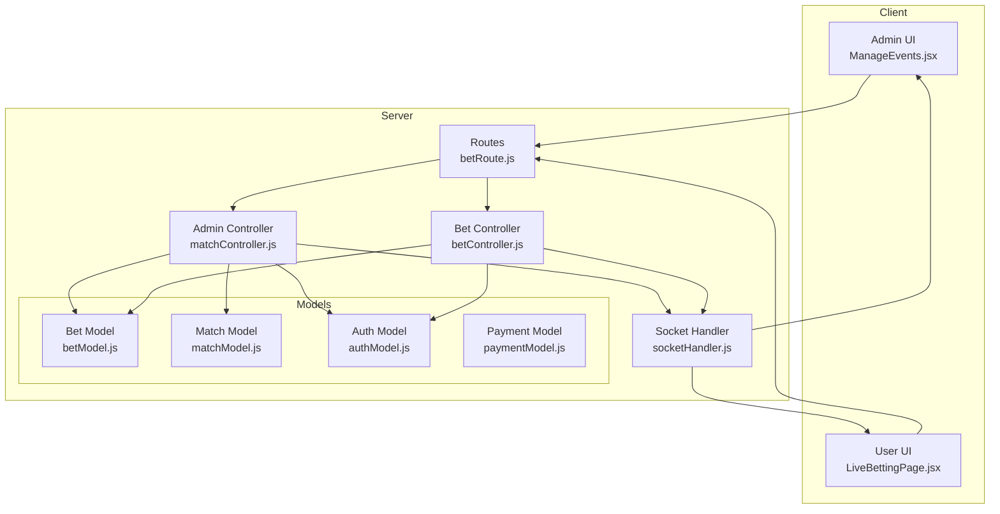
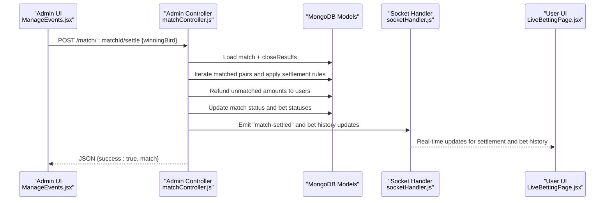
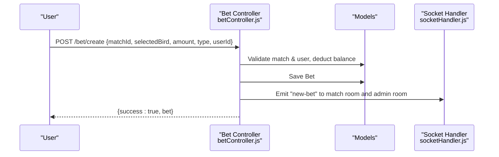
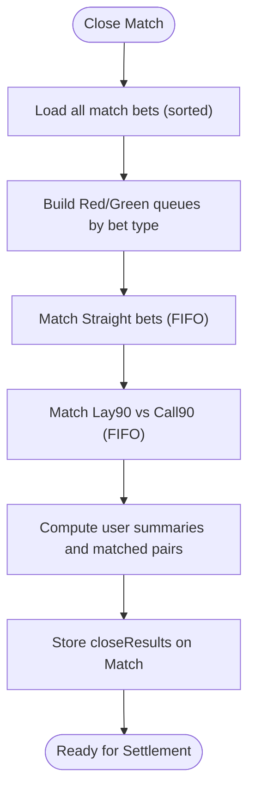
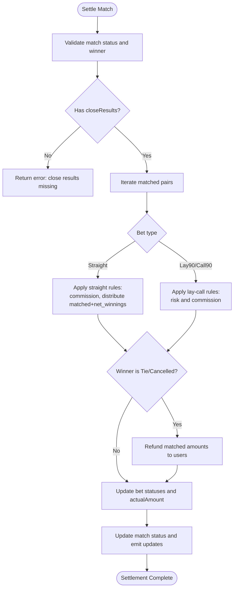
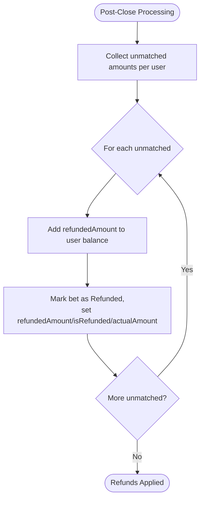
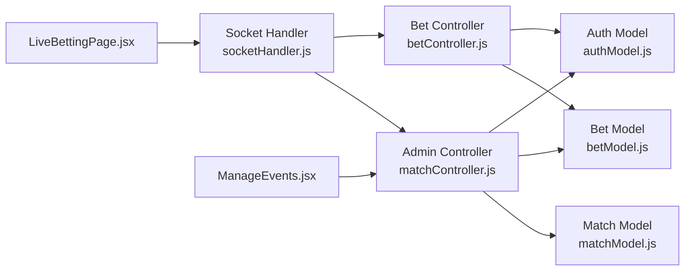
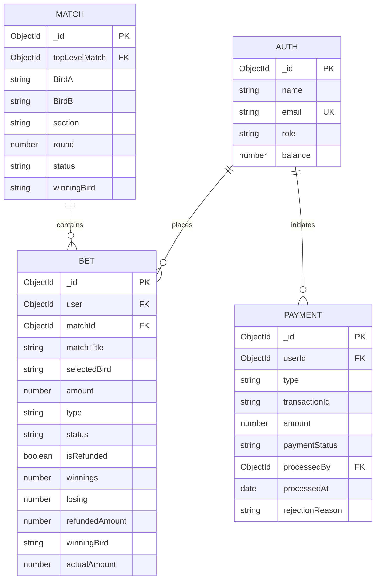

# Bet Settlement and Results Processing

<cite>
**Referenced Files in This Document**
- [betModel.js](file://server/models/betModel.js)
- [matchModel.js](file://server/models/matchModel.js)
- [authModel.js](file://server/models/authModel.js)
- [paymentModel.js](file://server/models/paymentModel.js)
- [betController.js](file://server/controllers/bet/betController.js)
- [matchController.js](file://server/controllers/admin/matchController.js)
- [socketHandler.js](file://server/socket/socketHandler.js)
- [betRoute.js](file://server/routes/bet/betRoute.js)
- [ManageEvents.jsx](file://client/src/Pages/adminPage/ManageEvents.jsx)
- [index.js](file://client/src/store/admin/index.js)
- [LiveBettingPage.jsx](file://client/src/Pages/Bet/LiveBettingPage.jsx)
</cite>

## Table of Contents
1. [Introduction](#introduction)
2. [Project Structure](#project-structure)
3. [Core Components](#core-components)
4. [Architecture Overview](#architecture-overview)
5. [Detailed Component Analysis](#detailed-component-analysis)
6. [Dependency Analysis](#dependency-analysis)
7. [Performance Considerations](#performance-considerations)
8. [Troubleshooting Guide](#troubleshooting-guide)
9. [Conclusion](#conclusion)
10. [Appendices](#appendices)

## Introduction
This document explains the bet settlement and results processing system. It covers how match results trigger automated settlement, how bet outcomes are determined, how profits/losses are calculated, how user balances are adjusted, and how transactions are logged. It also documents completed bets tracking, historical data management, settlement timing, result verification, error handling, partial settlements, void bets/refunds, and audit/reporting capabilities.

## Project Structure
The settlement system spans backend controllers and models, real-time sockets for live updates, and frontend admin and user dashboards:
- Backend models define bet, match, user, and payment schemas and indexes.
- Controllers orchestrate bet placement, match lifecycle, and settlement.
- Sockets broadcast settlement updates to admins and users.
- Frontend components render settlement status, payouts, and bet history.

**Diagram sources**
- [betRoute.js](file://server/routes/bet/betRoute.js#L1-L11)
- [betController.js](file://server/controllers/bet/betController.js#L1-L125)
- [matchController.js](file://server/controllers/admin/matchController.js#L1-L1188)
- [socketHandler.js](file://server/socket/socketHandler.js#L1-L101)
- [betModel.js](file://server/models/betModel.js#L1-L24)
- [matchModel.js](file://server/models/matchModel.js#L1-L101)
- [authModel.js](file://server/models/authModel.js#L1-L40)
- [paymentModel.js](file://server/models/paymentModel.js#L1-L160)
- [ManageEvents.jsx](file://client/src/Pages/adminPage/ManageEvents.jsx#L1-L200)
- [LiveBettingPage.jsx](file://client/src/Pages/Bet/LiveBettingPage.jsx#L753-L779)

**Section sources**
- [betRoute.js](file://server/routes/bet/betRoute.js#L1-L11)
- [betController.js](file://server/controllers/bet/betController.js#L1-L125)
- [matchController.js](file://server/controllers/admin/matchController.js#L1-L1188)
- [socketHandler.js](file://server/socket/socketHandler.js#L1-L101)
- [betModel.js](file://server/models/betModel.js#L1-L24)
- [matchModel.js](file://server/models/matchModel.js#L1-L101)
- [authModel.js](file://server/models/authModel.js#L1-L40)
- [paymentModel.js](file://server/models/paymentModel.js#L1-L160)
- [ManageEvents.jsx](file://client/src/Pages/adminPage/ManageEvents.jsx#L1-L200)
- [LiveBettingPage.jsx](file://client/src/Pages/Bet/LiveBettingPage.jsx#L753-L779)

## Core Components
- Bet model: Tracks bet metadata, stake, type, status, and settlement fields (actual amount, refunded amount, winnings, losing).
- Match model: Stores match lifecycle, winning bird, and closeResults with matched pairs and user summaries.
- Auth model: Holds user balances and roles.
- Payment model: Manages deposit/withdrawal requests and statuses (distinct from bet settlement).
- Bet controller: Places bets, deducts stake, and emits live updates.
- Admin match controller: Implements settlement logic, refunds unmatched bets, updates balances, and emits settlement notifications.
- Socket handler: Broadcasts match and bet updates to rooms for real-time UI updates.
- Frontend admin and user pages: Render settlement status, payouts, and bet history.

**Section sources**
- [betModel.js](file://server/models/betModel.js#L1-L24)
- [matchModel.js](file://server/models/matchModel.js#L1-L101)
- [authModel.js](file://server/models/authModel.js#L1-L40)
- [paymentModel.js](file://server/models/paymentModel.js#L1-L160)
- [betController.js](file://server/controllers/bet/betController.js#L43-L106)
- [matchController.js](file://server/controllers/admin/matchController.js#L902-L1165)
- [socketHandler.js](file://server/socket/socketHandler.js#L1-L101)
- [ManageEvents.jsx](file://client/src/Pages/adminPage/ManageEvents.jsx#L1-L200)
- [LiveBettingPage.jsx](file://client/src/Pages/Bet/LiveBettingPage.jsx#L753-L779)

## Architecture Overview
The settlement pipeline:
1. Admin closes a match and triggers settlement via an API call.
2. The system validates the match state and winner.
3. It iterates matched pairs and applies settlement rules:
   - Straight bets: Distributes matched stake plus net winnings minus commission to the winner; loser’s stake is recorded as loss.
   - Lay90/Call90: Computes net wins/losses considering risk and commission; adjusts both parties’ balances accordingly.
4. Refunds unmatched amounts to users and marks bets as refunded.
5. Updates match status to Completed/Tie/Cancelled and emits real-time notifications.

**Diagram sources**
- [ManageEvents.jsx](file://client/src/Pages/adminPage/ManageEvents.jsx#L804-L1082)
- [matchController.js](file://server/controllers/admin/matchController.js#L902-L1165)
- [socketHandler.js](file://server/socket/socketHandler.js#L1-L101)
- [LiveBettingPage.jsx](file://client/src/Pages/Bet/LiveBettingPage.jsx#L753-L779)

## Detailed Component Analysis

### Bet Placement and Live Updates
- On placing a bet, the system validates match and user state, deducts stake from user balance, persists the bet, and emits a live “new-bet” event to the match room and admin room.
- The bet includes match title, selected side, stake, and bet type.

**Diagram sources**
- [betController.js](file://server/controllers/bet/betController.js#L43-L106)
- [socketHandler.js](file://server/socket/socketHandler.js#L58-L72)

**Section sources**
- [betController.js](file://server/controllers/bet/betController.js#L43-L106)
- [socketHandler.js](file://server/socket/socketHandler.js#L58-L72)

### Match Closing and Matching Engine
- Admin sets match status to Closed, triggering a matching pass:
  - Builds queues for Red/Green sides and Straight/Lay90/Call90 bet types.
  - Matches bets using FIFO; records matched pairs and per-user summaries.
  - Stores closeResults on the match document for later settlement.

**Diagram sources**
- [matchController.js](file://server/controllers/admin/matchController.js#L547-L812)

**Section sources**
- [matchController.js](file://server/controllers/admin/matchController.js#L547-L812)

### Settlement Logic and Profit/Loss Calculation
- Settlement requires a valid winner (Red, Green, Tie, Cancelled) and a closed match with stored closeResults.
- Straight bets:
  - Commission deducted from matched amount; winner receives stake + net_winnings; loser stake recorded as loss.
- Lay90/Call90:
  - Net win/loss computed considering risk and commission; both parties’ balances adjusted accordingly.
- Tie/Cancelled:
  - All matched amounts returned to users; bets marked with Tie/Cancelled status and actualAmount reflects matched portion.

**Diagram sources**
- [matchController.js](file://server/controllers/admin/matchController.js#L902-L1165)

**Section sources**
- [matchController.js](file://server/controllers/admin/matchController.js#L902-L1165)

### Refund and Partial Settlements
- Unmatched amounts are refunded to users upon closing; bets marked as Refunded with refundedAmount and isRefunded flag.
- Partial settlements occur when only part of a bet is matched; actualAmount reflects matched portion; unmatched remains refunded.

**Diagram sources**
- [matchController.js](file://server/controllers/admin/matchController.js#L818-L848)

**Section sources**
- [matchController.js](file://server/controllers/admin/matchController.js#L818-L848)

### User Balance Adjustment and Transaction Logging
- Settlement updates user balances directly:
  - Winners receive stake + net winnings.
  - Losers have stake recorded as loss.
  - Tie/Cancelled refunds matched amounts.
- Bet records capture:
  - winnings, losing, refundedAmount, actualAmount, winningBird, and status.
- Payment module manages deposit/withdrawal transactions separately (not bet settlement).

**Section sources**
- [matchController.js](file://server/controllers/admin/matchController.js#L957-L1121)
- [betModel.js](file://server/models/betModel.js#L1-L24)
- [authModel.js](file://server/models/authModel.js#L1-L40)
- [paymentModel.js](file://server/models/paymentModel.js#L1-L160)

### Completed Bets Tracking and Historical Data
- closeResults on Match stores:
  - Total counts and amounts.
  - Matched pairs with bet IDs and matched amounts.
  - Per-user summaries with bet breakdowns and unmatched amounts.
- Settlement updates Bet documents with actualAmount, status, and winningBird.
- Admin and user dashboards receive real-time updates via sockets.

**Section sources**
- [matchModel.js](file://server/models/matchModel.js#L36-L72)
- [matchController.js](file://server/controllers/admin/matchController.js#L795-L812)
- [matchController.js](file://server/controllers/admin/matchController.js#L1135-L1150)
- [socketHandler.js](file://server/socket/socketHandler.js#L1-L101)

### Settlement Timing, Result Verification, and Error Handling
- Timing:
  - Admin triggers settlement after closing; settlement requires Closed match with closeResults.
- Result verification:
  - Validates winner against match sides and ensures match is Closed.
- Error handling:
  - Returns descriptive errors for invalid states, missing results, or database issues.
  - Socket emissions guarded with try/catch.

**Section sources**
- [matchController.js](file://server/controllers/admin/matchController.js#L926-L939)
- [matchController.js](file://server/controllers/admin/matchController.js#L944-L949)
- [matchController.js](file://server/controllers/admin/matchController.js#L1158-L1164)
- [socketHandler.js](file://server/socket/socketHandler.js#L84-L87)

### Examples and Scenarios
- Straight bet win (Red wins):
  - Red bet receives stake + net_winnings; Green bet marked Lost with loss recorded.
- Straight bet loss (Green wins):
  - Green bet receives stake + net_winnings; Red bet marked Lost with loss recorded.
- Tie/Cancelled:
  - All matched amounts refunded; bets marked Tie/Cancelled.
- Lay90/Call90:
  - Risk and commission applied; balances adjusted for both parties depending on winner.

**Section sources**
- [matchController.js](file://server/controllers/admin/matchController.js#L1056-L1121)
- [matchController.js](file://server/controllers/admin/matchController.js#L982-L1056)

### Audit Trail and Reporting
- Real-time audit:
  - Socket events broadcast match-settled and bet history updates to admin and user rooms.
- Historical tracking:
  - closeResults persist matched pairs and user summaries for auditability.
- Frontend displays:
  - Settlement notifications and bet close updates in admin and user UIs.

**Section sources**
- [matchController.js](file://server/controllers/admin/matchController.js#L1135-L1150)
- [matchController.js](file://server/controllers/admin/matchController.js#L53-L64)
- [ManageEvents.jsx](file://client/src/Pages/adminPage/ManageEvents.jsx#L136-L176)
- [LiveBettingPage.jsx](file://client/src/Pages/Bet/LiveBettingPage.jsx#L753-L779)

## Dependency Analysis

**Diagram sources**
- [matchController.js](file://server/controllers/admin/matchController.js#L1-L1188)
- [matchModel.js](file://server/models/matchModel.js#L1-L101)
- [betModel.js](file://server/models/betModel.js#L1-L24)
- [authModel.js](file://server/models/authModel.js#L1-L40)
- [betController.js](file://server/controllers/bet/betController.js#L1-L125)
- [socketHandler.js](file://server/socket/socketHandler.js#L1-L101)
- [ManageEvents.jsx](file://client/src/Pages/adminPage/ManageEvents.jsx#L1-L200)
- [LiveBettingPage.jsx](file://client/src/Pages/Bet/LiveBettingPage.jsx#L753-L779)

**Section sources**
- [matchController.js](file://server/controllers/admin/matchController.js#L1-L1188)
- [betController.js](file://server/controllers/bet/betController.js#L1-L125)
- [socketHandler.js](file://server/socket/socketHandler.js#L1-L101)
- [ManageEvents.jsx](file://client/src/Pages/adminPage/ManageEvents.jsx#L1-L200)
- [LiveBettingPage.jsx](file://client/src/Pages/Bet/LiveBettingPage.jsx#L753-L779)

## Performance Considerations
- Matching engine uses FIFO queues per side and bet type; complexity proportional to number of bets.
- closeResults cache avoids re-matching during settlement.
- Socket broadcasts are scoped to rooms to minimize overhead.
- Database queries leverage indexes on matchId/status and timestamps.

[No sources needed since this section provides general guidance]

## Troubleshooting Guide
- Settlement fails with “match already settled”:
  - Ensure match status is Closed and not Completed.
- Settlement fails with “close results not found”:
  - Close the match first to generate closeResults.
- Bet status not updating:
  - Verify socket connections and that admin notifications are received.
- Refund not reflected:
  - Confirm unmatched amounts were processed and user balance updated.

**Section sources**
- [matchController.js](file://server/controllers/admin/matchController.js#L919-L924)
- [matchController.js](file://server/controllers/admin/matchController.js#L944-L949)
- [socketHandler.js](file://server/socket/socketHandler.js#L84-L87)

## Conclusion
The system automates bet settlement by validating match state, applying fair settlement rules, adjusting balances, and broadcasting real-time updates. closeResults provide auditability and support reporting. The architecture cleanly separates concerns between bet placement, match lifecycle, and settlement, with robust error handling and real-time feedback.

[No sources needed since this section summarizes without analyzing specific files]

## Appendices

### Data Model Overview

**Diagram sources**
- [authModel.js](file://server/models/authModel.js#L1-L40)
- [matchModel.js](file://server/models/matchModel.js#L1-L101)
- [betModel.js](file://server/models/betModel.js#L1-L24)
- [paymentModel.js](file://server/models/paymentModel.js#L1-L160)