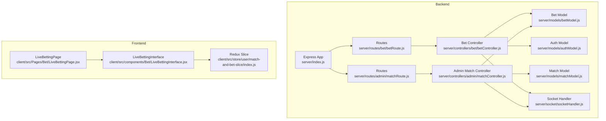
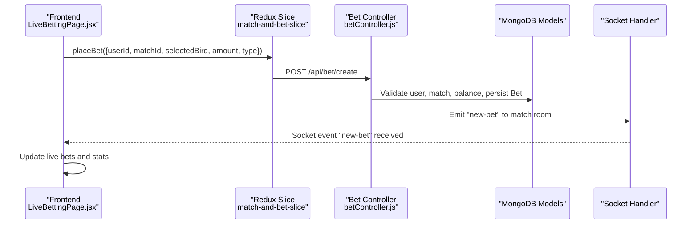
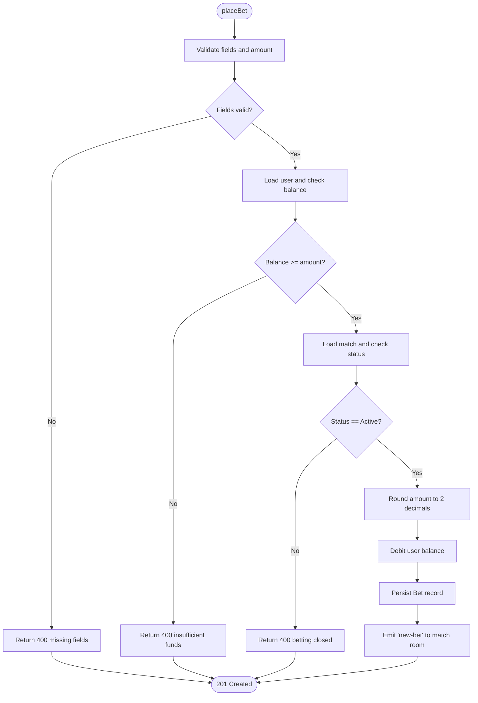
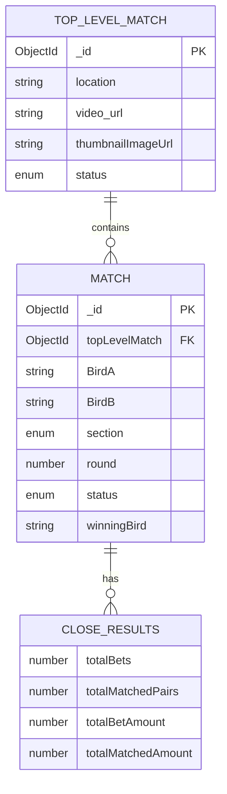
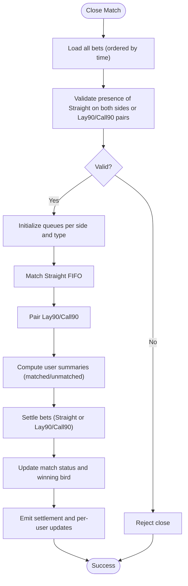
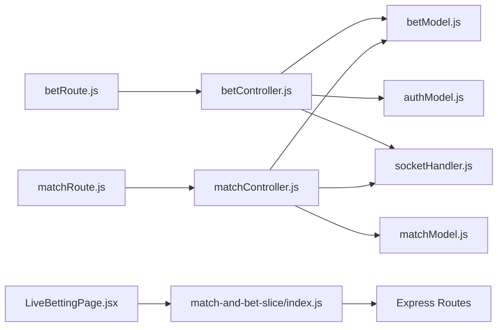

# Betting Engine

<cite>
**Referenced Files in This Document**
- [index.js](file://server/index.js)
- [matchModel.js](file://server/models/matchModel.js)
- [betModel.js](file://server/models/betModel.js)
- [authModel.js](file://server/models/authModel.js)
- [betController.js](file://server/controllers/bet/betController.js)
- [matchController.js](file://server/controllers/admin/matchController.js)
- [betRoute.js](file://server/routes/bet/betRoute.js)
- [matchRoute.js](file://server/routes/admin/matchRoute.js)
- [socketHandler.js](file://server/socket/socketHandler.js)
- [LiveBettingPage.jsx](file://client/src/Pages/Bet/LiveBettingPage.jsx)
- [LiveBettingInterface.jsx](file://client/src/components/Bet/LiveBettingInterface.jsx)
- [index.js](file://client/src/store/user/match-and-bet-slice/index.js)
</cite>

## Table of Contents
1. [Introduction](#introduction)
2. [Project Structure](#project-structure)
3. [Core Components](#core-components)
4. [Architecture Overview](#architecture-overview)
5. [Detailed Component Analysis](#detailed-component-analysis)
6. [Dependency Analysis](#dependency-analysis)
7. [Performance Considerations](#performance-considerations)
8. [Troubleshooting Guide](#troubleshooting-guide)
9. [Conclusion](#conclusion)
10. [Appendices](#appendices)

## Introduction
This document explains the betting engine’s end-to-end functionality for placing bets, managing matches and tournaments, matching bets, updating odds, settling outcomes, and maintaining real-time communication between the frontend and backend. It covers bet placement logic (stake validation, bet types), match model and tournament bracket management, the bet matching algorithm, odds and settlement updates, statistics and history, API endpoints, error handling, and frontend-backend integration.

## Project Structure
The system is split into:
- Backend (Node.js + Express): Models, Controllers, Routes, Socket handlers, and middleware.
- Frontend (React + Redux): Pages, components, and slices for API integration and real-time updates.

**Diagram sources**
- [index.js](file://server/index.js#L1-L150)
- [betRoute.js](file://server/routes/bet/betRoute.js#L1-L11)
- [matchRoute.js](file://server/routes/admin/matchRoute.js#L1-L38)
- [betController.js](file://server/controllers/bet/betController.js#L1-L125)
- [matchController.js](file://server/controllers/admin/matchController.js#L1-L1188)
- [betModel.js](file://server/models/betModel.js#L1-L24)
- [matchModel.js](file://server/models/matchModel.js#L1-L101)
- [authModel.js](file://server/models/authModel.js#L1-L40)
- [socketHandler.js](file://server/socket/socketHandler.js#L1-L101)
- [LiveBettingPage.jsx](file://client/src/Pages/Bet/LiveBettingPage.jsx#L1-L943)
- [LiveBettingInterface.jsx](file://client/src/components/Bet/LiveBettingInterface.jsx#L1-L439)
- [index.js](file://client/src/store/user/match-and-bet-slice/index.js#L1-L127)

**Section sources**
- [index.js](file://server/index.js#L1-L150)
- [betRoute.js](file://server/routes/bet/betRoute.js#L1-L11)
- [matchRoute.js](file://server/routes/admin/matchRoute.js#L1-L38)
- [LiveBettingPage.jsx](file://client/src/Pages/Bet/LiveBettingPage.jsx#L1-L943)
- [LiveBettingInterface.jsx](file://client/src/components/Bet/LiveBettingInterface.jsx#L1-L439)
- [index.js](file://client/src/store/user/match-and-bet-slice/index.js#L1-L127)

## Core Components
- Models
  - Bet: Stores user, match, selected side, amount, type, status, and financial fields.
  - Match: Stores top-level event, teams, section, round, status, and closeResults for settlement analytics.
  - Auth: User account, balance, and roles.
- Controllers
  - Bet controller: Place bets, fetch match bets, fetch user bets.
  - Admin match controller: Create/update events, create/update matches, close and settle matches, emit real-time updates.
- Routes
  - Bet routes: Place bet, fetch user bets, fetch match bets.
  - Admin match routes: CRUD for top-level events and matches, settle match, fetch bets.
- Socket
  - Real-time rooms for match, event, admin, and user-specific channels.
- Frontend
  - Live betting pages and interfaces with Redux slices for API calls and socket listeners.

**Section sources**
- [betModel.js](file://server/models/betModel.js#L1-L24)
- [matchModel.js](file://server/models/matchModel.js#L1-L101)
- [authModel.js](file://server/models/authModel.js#L1-L40)
- [betController.js](file://server/controllers/bet/betController.js#L1-L125)
- [matchController.js](file://server/controllers/admin/matchController.js#L1-L1188)
- [betRoute.js](file://server/routes/bet/betRoute.js#L1-L11)
- [matchRoute.js](file://server/routes/admin/matchRoute.js#L1-L38)
- [socketHandler.js](file://server/socket/socketHandler.js#L1-L101)
- [LiveBettingPage.jsx](file://client/src/Pages/Bet/LiveBettingPage.jsx#L1-L943)
- [LiveBettingInterface.jsx](file://client/src/components/Bet/LiveBettingInterface.jsx#L1-L439)
- [index.js](file://client/src/store/user/match-and-bet-slice/index.js#L1-L127)

## Architecture Overview
High-level flow:
- Frontend places a bet via Redux slice → Backend controller validates and persists → Socket emits to match room → Frontend updates live feed and stats.
- Admin closes a match → Backend matches bets (FIFO queues per side and bet type) → Updates balances and bet statuses → Emits settlement and per-user close updates.

**Diagram sources**
- [LiveBettingPage.jsx](file://client/src/Pages/Bet/LiveBettingPage.jsx#L420-L517)
- [index.js](file://client/src/store/user/match-and-bet-slice/index.js#L95-L114)
- [betController.js](file://server/controllers/bet/betController.js#L42-L106)
- [socketHandler.js](file://server/socket/socketHandler.js#L58-L72)

## Detailed Component Analysis

### Bet Placement Logic
- Validation
  - Required fields present.
  - Amount > 0.
  - User exists and has sufficient balance.
  - Match exists and is Active.
- Persistence
  - Round cents to two decimals.
  - Deduct amount from user balance.
  - Create Bet record with match title and type.
- Real-time
  - Emit to match-specific room only.
  - Frontend listens for “new-bet” and updates UI.

**Diagram sources**
- [betController.js](file://server/controllers/bet/betController.js#L42-L106)

**Section sources**
- [betController.js](file://server/controllers/bet/betController.js#L42-L106)
- [LiveBettingPage.jsx](file://client/src/Pages/Bet/LiveBettingPage.jsx#L420-L517)
- [LiveBettingInterface.jsx](file://client/src/components/Bet/LiveBettingInterface.jsx#L110-L169)

### Bet Types: Straight, Lay90, Call90
- Straight: Standard win/loss bet on selected side.
- Lay90: One side lays at 90% risk; paired with Call90 on the opposite side.
- Call90: Counter-bet to cover Lay90 exposure at 90%.
- Current frontend exposes Straight and marks Lay90/Call90 as “Coming Soon”.

Implementation highlights:
- Backend supports all three types in Bet model and queues.
- Matching algorithm handles Straight FIFO and Lay90/Call90 pairing.

**Section sources**
- [betModel.js](file://server/models/betModel.js#L10-L11)
- [matchController.js](file://server/controllers/admin/matchController.js#L547-L792)
- [LiveBettingInterface.jsx](file://client/src/components/Bet/LiveBettingInterface.jsx#L216-L235)

### Match Model and Tournament Bracket Management
- Top-level event (tournament) with location, media URLs.
- Matches belong to a top-level event, sectioned as A/B, auto-round assignment.
- Status lifecycle: Upcoming → Active → Closed → Completed/Tie/Cancelled.
- Close results capture:
  - Totals and per-user summaries.
  - Matched pairs and per-bet matched/unmatched amounts.

**Diagram sources**
- [matchModel.js](file://server/models/matchModel.js#L3-L96)

**Section sources**
- [matchModel.js](file://server/models/matchModel.js#L1-L101)

### Bet Matching Algorithm
- Precondition: Match status Closed with valid bets (Straight on both sides or Lay90/Call90 pairs).
- Queues: Two sides (Red/Green), three bet types (Straight/Lay90/Call90).
- Matching:
  - Straight: FIFO queues per side.
  - Lay90/Call90: Pair Red Lay with Green Call and vice versa; matched amounts computed.
- Settlement:
  - Straight: Distribute matched pool minus commission; winners receive full stake plus net; losers lose stake.
  - Lay90/Call90: If Lay side wins, Lay receives net plus stake; Call receives net stake; vice versa.

**Diagram sources**
- [matchController.js](file://server/controllers/admin/matchController.js#L547-L1165)

**Section sources**
- [matchController.js](file://server/controllers/admin/matchController.js#L547-L1165)

### Odds Updating Mechanism and Real-Time Settlement
- Odds updates are broadcast via socket events (“odds-updated”) and handled by frontend notifications.
- Settlement events (“match-settled”) include winner and summary messages; frontend triggers balance refresh.

**Section sources**
- [LiveBettingPage.jsx](file://client/src/Pages/Bet/LiveBettingPage.jsx#L285-L294)
- [matchController.js](file://server/controllers/admin/matchController.js#L1135-L1146)

### Real-Time Bet Settlement and Per-User Notifications
- After settlement, backend emits:
  - Global settlement event to clients.
  - Per-user “bet-close-update” with matched/unmatched amounts.
- Frontend stores and displays user-specific settlement summaries.

**Section sources**
- [matchController.js](file://server/controllers/admin/matchController.js#L53-L64)
- [LiveBettingPage.jsx](file://client/src/Pages/Bet/LiveBettingPage.jsx#L379-L386)

### Betting Statistics Tracking and Historical Data
- Live stats: Total bets and amounts per side, unique bettors.
- Historical data: Bet records persisted with timestamps; settlement history available via bet queries.

**Section sources**
- [LiveBettingInterface.jsx](file://client/src/components/Bet/LiveBettingInterface.jsx#L50-L73)
- [betController.js](file://server/controllers/bet/betController.js#L8-L40)
- [matchController.js](file://server/controllers/admin/matchController.js#L1166-L1187)

### API Endpoints
- Bet
  - POST /api/bet/create: Place bet (requires userId, matchId, selectedBird, amount, type).
  - GET /api/bet/get-bets-status?userId: Fetch user bets with nested match/event info.
  - GET /api/bet/:matchId: Fetch all bets for a match.
- Admin Match
  - POST /api/match/top-level/create: Create top-level event.
  - GET /api/match/top-level: List top-level events.
  - PUT /api/match/top-level/:id: Update top-level event.
  - GET /api/match/:topLevelMatchId/not-populated: Get top-level event without matches.
  - GET /api/match/top-level-user-side: Paginated active top-level events.
  - GET /api/match/top-level-user-side/completed: Paginated completed top-level events.
  - POST /api/match/create: Create match under top-level event.
  - GET /api/match/:matchId: Get match by ID.
  - PUT /api/match/:matchId/status: Update match status (Active/Closed).
  - POST /api/match/:matchId/settle: Settle match and distribute balances.
  - GET /api/match/:matchId/bets: Get all bets for a match.
  - POST /api/match/top-level/:topLevelMatchId/complete: Mark top-level event as completed.
  - GET /api/match/:topLevelMatchId/match-a-b: Fetch Section A/B matches for an event.

**Section sources**
- [betRoute.js](file://server/routes/bet/betRoute.js#L1-L11)
- [matchRoute.js](file://server/routes/admin/matchRoute.js#L1-L38)
- [betController.js](file://server/controllers/bet/betController.js#L8-L125)
- [matchController.js](file://server/controllers/admin/matchController.js#L66-L364)

### Frontend-Behind Integration
- Redux slices encapsulate API calls for matches, bets, and bet placement.
- Socket connections manage rooms for match, event, admin, and user-specific updates.
- Live betting interface listens for “new-bet”, “match-update”, and “bet-close-update” to keep UI synchronized.

**Section sources**
- [index.js](file://client/src/store/user/match-and-bet-slice/index.js#L1-L127)
- [LiveBettingPage.jsx](file://client/src/Pages/Bet/LiveBettingPage.jsx#L208-L408)
- [LiveBettingInterface.jsx](file://client/src/components/Bet/LiveBettingInterface.jsx#L110-L169)
- [socketHandler.js](file://server/socket/socketHandler.js#L1-L101)

## Dependency Analysis
- Backend dependencies
  - Controllers depend on Models and Socket handler.
  - Routes depend on Controllers.
  - Middleware (CORS, rate limiting, helmet) configured at app bootstrap.
- Frontend dependencies
  - Pages and components depend on Redux slices for data and actions.
  - Socket context integrates with backend rooms.

**Diagram sources**
- [betRoute.js](file://server/routes/bet/betRoute.js#L1-L11)
- [matchRoute.js](file://server/routes/admin/matchRoute.js#L1-L38)
- [betController.js](file://server/controllers/bet/betController.js#L1-L125)
- [matchController.js](file://server/controllers/admin/matchController.js#L1-L1188)
- [betModel.js](file://server/models/betModel.js#L1-L24)
- [matchModel.js](file://server/models/matchModel.js#L1-L101)
- [authModel.js](file://server/models/authModel.js#L1-L40)
- [socketHandler.js](file://server/socket/socketHandler.js#L1-L101)
- [LiveBettingPage.jsx](file://client/src/Pages/Bet/LiveBettingPage.jsx#L1-L943)
- [index.js](file://client/src/store/user/match-and-bet-slice/index.js#L1-L127)

**Section sources**
- [index.js](file://server/index.js#L1-L150)

## Performance Considerations
- Database indexing
  - Bet: createdAt, matchId+status.
  - Match: topLevelMatch+section+round, status+createdAt.
  - Auth: email, name, role, createdAt.
- Socket rooms minimize broadcast fan-out to relevant clients.
- Frontend debounces and incremental updates reduce render churn.
- Recommendations
  - Add capped collections or TTL for live feeds.
  - Batch settlement updates and debounce frontend renders.
  - Use aggregation pipelines for live stats and bet history.

[No sources needed since this section provides general guidance]

## Troubleshooting Guide
Common issues and resolutions:
- Invalid bet
  - Missing fields or non-positive amount → 400 Bad Request.
  - Insufficient funds → 400 Bad Request.
  - Match not Active → 400 Bad Request.
- System failures
  - Internal server error → 500 with optional stack in development.
- Socket errors
  - Initialization failure → Error thrown if socket not initialized.
  - Room join/leave → Logs indicate successful joins/leaves.
- Frontend
  - “Betting Closed” overlay prevents placing bets when match status is not Active.
  - Local storage cleanup on dual-section completion ensures clean state.

**Section sources**
- [betController.js](file://server/controllers/bet/betController.js#L42-L106)
- [index.js](file://server/index.js#L110-L140)
- [socketHandler.js](file://server/socket/socketHandler.js#L93-L98)
- [LiveBettingPage.jsx](file://client/src/Pages/Bet/LiveBettingPage.jsx#L194-L204)

## Conclusion
The betting engine provides a robust foundation for live betting with real-time updates, comprehensive bet types, and a scalable settlement pipeline. The frontend integrates seamlessly with backend APIs and sockets to deliver responsive user experiences. Extending support for Lay90/Call90 and enhancing odds calculations would further align the system with advanced betting mechanics.

[No sources needed since this section summarizes without analyzing specific files]

## Appendices

### Edge Cases and Validation Scenarios
- Place bet
  - Negative or zero amount rejected.
  - Non-existent user or insufficient balance rejected.
  - Non-existent match or non-Active status rejected.
- Close match
  - Must have valid Straight bets on both sides or Lay90/Call90 pairs.
  - Prevents direct completion; use settle endpoint.
- Settlement
  - Tie or Cancelled handled with refunds.
  - Commission applied to Straight pools; Lay90/Call90 payouts reflect risk and counter terms.

**Section sources**
- [betController.js](file://server/controllers/bet/betController.js#L42-L106)
- [matchController.js](file://server/controllers/admin/matchController.js#L527-L577)
- [matchController.js](file://server/controllers/admin/matchController.js#L982-L1056)