# Match Management

<cite>
**Referenced Files in This Document**
- [matchModel.js](file://server/models/matchModel.js)
- [matchController.js](file://server/controllers/admin/matchController.js)
- [matchRoute.js](file://server/routes/admin/matchRoute.js)
- [betController.js](file://server/controllers/bet/betController.js)
- [socketHandler.js](file://server/socket/socketHandler.js)
- [index.js](file://client/src/store/user/match-and-bet-slice/index.js)
- [ManageEvents.jsx](file://client/src/Pages/adminPage/ManageEvents.jsx)
- [LiveBettingPage.jsx](file://client/src/Pages/Bet/LiveBettingPage.jsx)
- [CreateMatchDialog.jsx](file://client/src/components/Admin/CreateMatchDialog.jsx)
</cite>

## Table of Contents
1. [Introduction](#introduction)
2. [Project Structure](#project-structure)
3. [Core Components](#core-components)
4. [Architecture Overview](#architecture-overview)
5. [Detailed Component Analysis](#detailed-component-analysis)
6. [Dependency Analysis](#dependency-analysis)
7. [Performance Considerations](#performance-considerations)
8. [Troubleshooting Guide](#troubleshooting-guide)
9. [Conclusion](#conclusion)

## Introduction
This document describes the match management system that powers tournament-style competitions with two competing teams ("BirdA" and "BirdB") organized under top-level events. It covers the data model hierarchy, match lifecycle, betting integration, real-time updates, and operational workflows for creating, updating, and settling matches. The system supports tournament brackets across sections, round sequencing, and comprehensive match population for live betting experiences.

## Project Structure
The match management system spans server-side models and controllers, client-side Redux slices and pages, and WebSocket-based real-time updates.

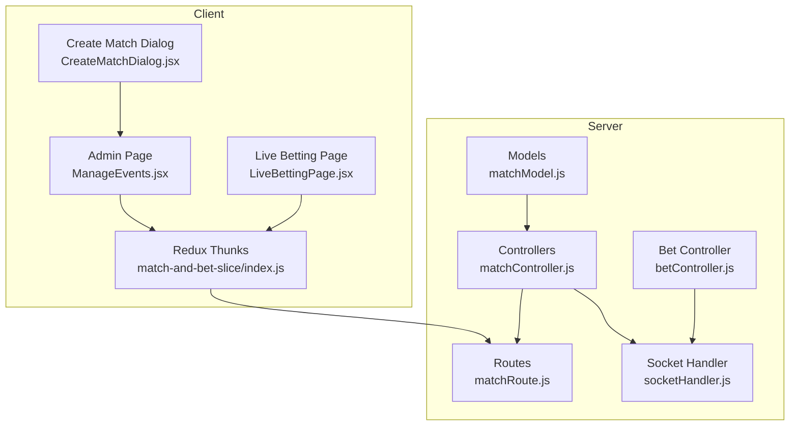

**Diagram sources**
- [matchModel.js](file://server/models/matchModel.js#L1-L101)
- [matchController.js](file://server/controllers/admin/matchController.js#L1-L1188)
- [matchRoute.js](file://server/routes/admin/matchRoute.js#L1-L38)
- [betController.js](file://server/controllers/bet/betController.js#L1-L125)
- [socketHandler.js](file://server/socket/socketHandler.js#L1-L101)
- [index.js](file://client/src/store/user/match-and-bet-slice/index.js#L1-L127)
- [ManageEvents.jsx](file://client/src/Pages/adminPage/ManageEvents.jsx#L1-L200)
- [LiveBettingPage.jsx](file://client/src/Pages/Bet/LiveBettingPage.jsx#L318-L354)
- [CreateMatchDialog.jsx](file://client/src/components/Admin/CreateMatchDialog.jsx#L1-L121)

**Section sources**
- [matchModel.js](file://server/models/matchModel.js#L1-L101)
- [matchController.js](file://server/controllers/admin/matchController.js#L1-L1188)
- [matchRoute.js](file://server/routes/admin/matchRoute.js#L1-L38)
- [betController.js](file://server/controllers/bet/betController.js#L1-L125)
- [socketHandler.js](file://server/socket/socketHandler.js#L1-L101)
- [index.js](file://client/src/store/user/match-and-bet-slice/index.js#L1-L127)
- [ManageEvents.jsx](file://client/src/Pages/adminPage/ManageEvents.jsx#L1-L200)
- [LiveBettingPage.jsx](file://client/src/Pages/Bet/LiveBettingPage.jsx#L318-L354)
- [CreateMatchDialog.jsx](file://client/src/components/Admin/CreateMatchDialog.jsx#L1-L121)

## Core Components
- Top-Level Match (Event): Tournament-level container with location, media metadata, and status.
- Match: Individual contest between two teams (BirdA vs BirdB) within a top-level match, organized by section (A or B) and round number.
- Betting Integration: Bets reference matches and users, with settlement affecting user balances and bet statuses.
- Real-Time Updates: WebSocket rooms broadcast match and bet updates to admins, users, and specific match contexts.

Key model attributes and relationships:
- TopLevelMatch: location, video_url, thumbnailImageUrl, status (Upcoming, Active, Completed).
- Match: topLevelMatch (ref), BirdA, BirdB, section (sectionA, sectionB), round (auto-incremented per section), status (Upcoming, Active, Completed, Closed, Cancelled, Tie), winningBird, closeResults (aggregated bet matching summary).
- Bet: user, matchId, selectedBird, amount, type (Straight, Lay90, Call90), status (Pending, Won, Lost, Refunded, Tie, Cancelled), winnings, losing, refundedAmount, winningBird, actualAmount.

**Section sources**
- [matchModel.js](file://server/models/matchModel.js#L3-L15)
- [matchModel.js](file://server/models/matchModel.js#L17-L75)
- [matchModel.js](file://server/models/matchModel.js#L77-L92)
- [betController.js](file://server/controllers/bet/betController.js#L3-L24)

## Architecture Overview
The system follows a layered architecture:
- Routes define endpoints for match and bet operations.
- Controllers orchestrate business logic, enforce validations, and emit real-time events.
- Models define schemas and indexes for efficient queries.
- Socket handler manages rooms and emits events to clients.
- Client Redux thunks coordinate API calls and UI updates.

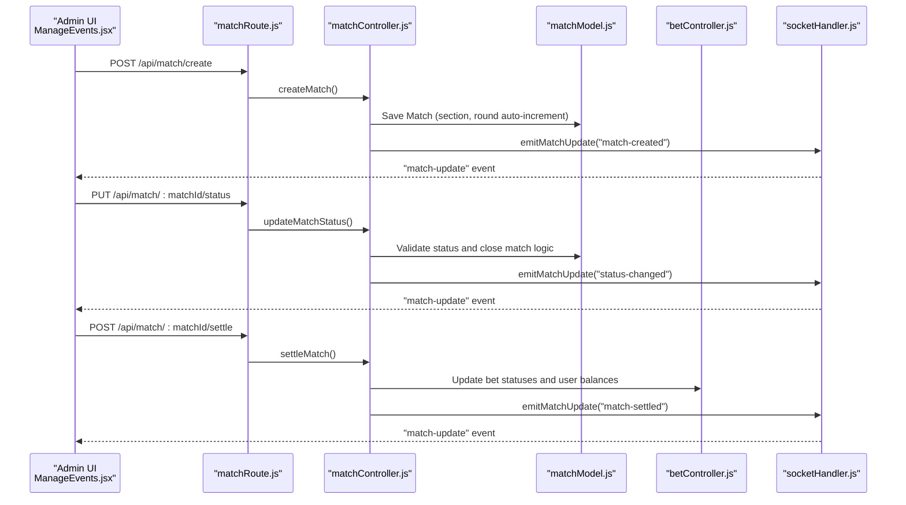

**Diagram sources**
- [matchRoute.js](file://server/routes/admin/matchRoute.js#L21-L34)
- [matchController.js](file://server/controllers/admin/matchController.js#L282-L364)
- [matchController.js](file://server/controllers/admin/matchController.js#L513-L901)
- [matchController.js](file://server/controllers/admin/matchController.js#L902-L1165)
- [socketHandler.js](file://server/socket/socketHandler.js#L6-L88)
- [betController.js](file://server/controllers/bet/betController.js#L42-L106)

## Detailed Component Analysis

### Match Model and Hierarchical Data Structure
The match model enforces:
- Tournament bracketing via top-level match reference.
- Section-based organization with per-section round sequencing.
- Comprehensive closeResults aggregation for settlement reporting.

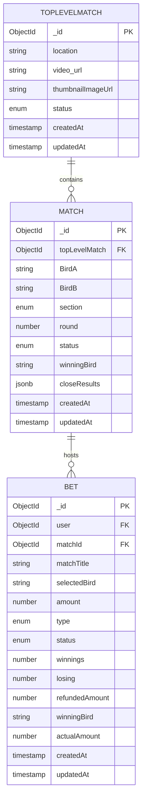

**Diagram sources**
- [matchModel.js](file://server/models/matchModel.js#L3-L15)
- [matchModel.js](file://server/models/matchModel.js#L17-L75)
- [betController.js](file://server/controllers/bet/betController.js#L3-L24)

**Section sources**
- [matchModel.js](file://server/models/matchModel.js#L3-L15)
- [matchModel.js](file://server/models/matchModel.js#L17-L75)
- [matchModel.js](file://server/models/matchModel.js#L77-L92)

### Match Status Lifecycle and Betting Availability
Status values and transitions:
- Allowed transitions for direct status updates: Upcoming → Active → Closed.
- Settlement requires prior closure and explicit winner declaration.
- Close results capture aggregated bet matching for immediate visibility.

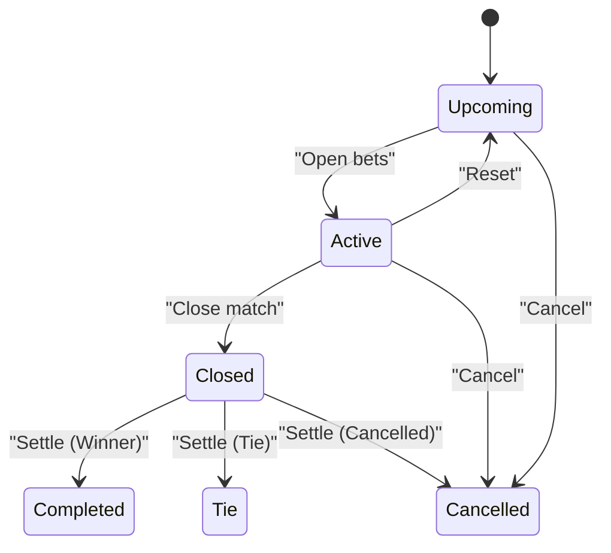

Impact on betting:
- When status becomes Active, users can place bets.
- When status becomes Closed, no further bets are accepted.
- Settlement updates bet statuses and user balances accordingly.

**Section sources**
- [matchController.js](file://server/controllers/admin/matchController.js#L513-L542)
- [matchController.js](file://server/controllers/admin/matchController.js#L549-L577)
- [betController.js](file://server/controllers/bet/betController.js#L56-L58)

### Relationship Between Top-Level Matches, Sections, and Individual Matches
- Top-level matches encapsulate multiple matches.
- Matches are grouped by section (A or B) and sequenced by round.
- Round numbers auto-increment per section for each top-level match.

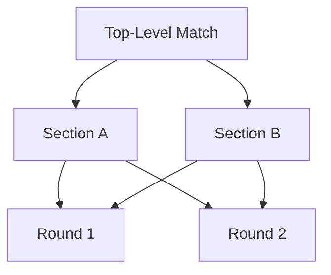

**Diagram sources**
- [matchModel.js](file://server/models/matchModel.js#L77-L92)

**Section sources**
- [matchModel.js](file://server/models/matchModel.js#L77-L92)

### Match Creation Workflow
- Validation ensures required fields and prevents identical team names.
- Section constraints prevent concurrent active matches within the same top-level match.
- Round is auto-assigned based on the highest existing round in the same section.

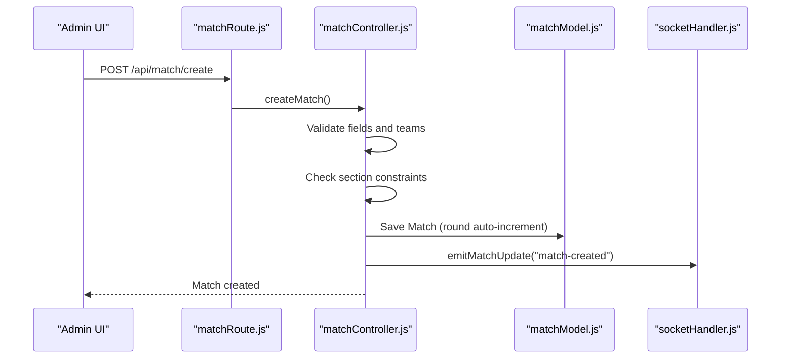

**Diagram sources**
- [matchRoute.js](file://server/routes/admin/matchRoute.js#L28-L34)
- [matchController.js](file://server/controllers/admin/matchController.js#L282-L364)
- [matchModel.js](file://server/models/matchModel.js#L77-L92)

**Section sources**
- [matchController.js](file://server/controllers/admin/matchController.js#L282-L364)
- [matchModel.js](file://server/models/matchModel.js#L77-L92)

### Match Update Workflow (Status Changes)
- Validates allowed status transitions and prevents direct completion.
- On closing, aggregates bet queues and computes matched pairs and user summaries.
- Emits real-time updates and refunds unmatched amounts to users.

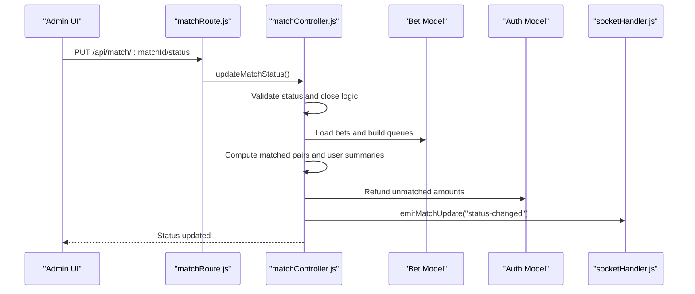

**Diagram sources**
- [matchRoute.js](file://server/routes/admin/matchRoute.js#L30-L31)
- [matchController.js](file://server/controllers/admin/matchController.js#L513-L901)
- [betController.js](file://server/controllers/bet/betController.js#L3-L24)

**Section sources**
- [matchController.js](file://server/controllers/admin/matchController.js#L513-L901)

### Match Settlement Workflow
- Requires match to be closed and winner to be declared (BirdA, BirdB, Tie, Cancelled).
- Uses stored closeResults to avoid re-matching.
- Distributes matched amounts with commission rules for Straight bets and Lay90/Call90 combinations.
- Updates bet statuses, user balances, and winningBird.

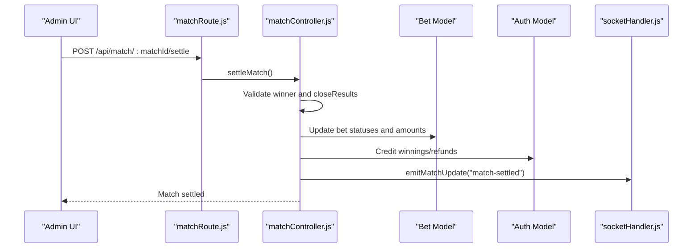

**Diagram sources**
- [matchRoute.js](file://server/routes/admin/matchRoute.js#L31-L31)
- [matchController.js](file://server/controllers/admin/matchController.js#L902-L1165)
- [betController.js](file://server/controllers/bet/betController.js#L3-L24)

**Section sources**
- [matchController.js](file://server/controllers/admin/matchController.js#L902-L1165)

### Real-Time Updates and Client Integration
- Server emits events to rooms: match-specific, event-wide, admin, and global.
- Clients join rooms and listen for updates to reflect live changes.
- Admin dashboard listens for match and event updates; live betting page listens for status changes and new matches.

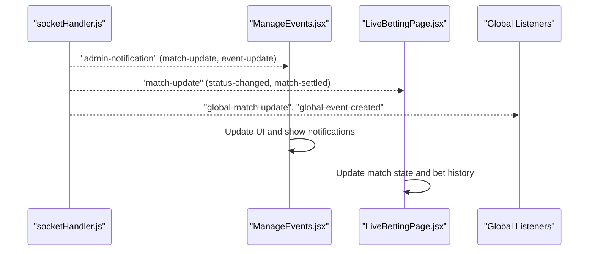

**Diagram sources**
- [socketHandler.js](file://server/socket/socketHandler.js#L6-L88)
- [matchController.js](file://server/controllers/admin/matchController.js#L8-L40)
- [ManageEvents.jsx](file://client/src/Pages/adminPage/ManageEvents.jsx#L129-L176)
- [LiveBettingPage.jsx](file://client/src/Pages/Bet/LiveBettingPage.jsx#L318-L354)

**Section sources**
- [socketHandler.js](file://server/socket/socketHandler.js#L6-L88)
- [matchController.js](file://server/controllers/admin/matchController.js#L8-L40)
- [ManageEvents.jsx](file://client/src/Pages/adminPage/ManageEvents.jsx#L129-L176)
- [LiveBettingPage.jsx](file://client/src/Pages/Bet/LiveBettingPage.jsx#L318-L354)

### Client-Side Data Fetching and UI Patterns
- Redux thunks fetch top-level matches, match details, and bet histories.
- Admin UI displays matches grouped by top-level events and allows status updates.
- Live betting page dynamically switches match rooms and reflects real-time updates.

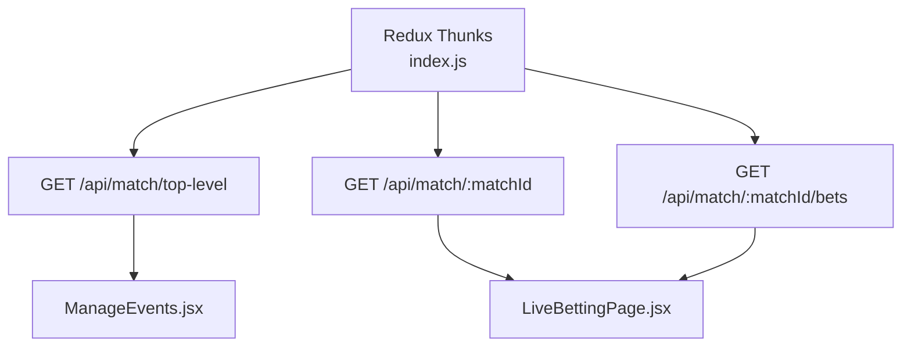

**Diagram sources**
- [index.js](file://client/src/store/user/match-and-bet-slice/index.js#L5-L83)
- [matchRoute.js](file://server/routes/admin/matchRoute.js#L22-L34)
- [ManageEvents.jsx](file://client/src/Pages/adminPage/ManageEvents.jsx#L178-L200)
- [LiveBettingPage.jsx](file://client/src/Pages/Bet/LiveBettingPage.jsx#L318-L354)

**Section sources**
- [index.js](file://client/src/store/user/match-and-bet-slice/index.js#L5-L83)
- [ManageEvents.jsx](file://client/src/Pages/adminPage/ManageEvents.jsx#L178-L200)
- [LiveBettingPage.jsx](file://client/src/Pages/Bet/LiveBettingPage.jsx#L318-L354)

## Dependency Analysis
- Controllers depend on models for persistence and on socket handler for real-time updates.
- Routes delegate to controllers for business logic.
- Client Redux thunks depend on server routes for data.
- Betting controller depends on match and user models for validation and balance updates.

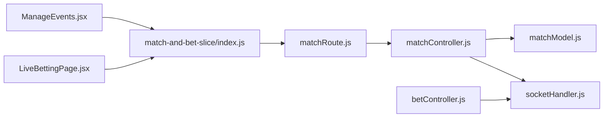

**Diagram sources**
- [matchRoute.js](file://server/routes/admin/matchRoute.js#L1-L38)
- [matchController.js](file://server/controllers/admin/matchController.js#L1-L1188)
- [matchModel.js](file://server/models/matchModel.js#L1-L101)
- [socketHandler.js](file://server/socket/socketHandler.js#L1-L101)
- [index.js](file://client/src/store/user/match-and-bet-slice/index.js#L1-L127)
- [ManageEvents.jsx](file://client/src/Pages/adminPage/ManageEvents.jsx#L1-L200)
- [LiveBettingPage.jsx](file://client/src/Pages/Bet/LiveBettingPage.jsx#L318-L354)

**Section sources**
- [matchRoute.js](file://server/routes/admin/matchRoute.js#L1-L38)
- [matchController.js](file://server/controllers/admin/matchController.js#L1-L1188)
- [matchModel.js](file://server/models/matchModel.js#L1-L101)
- [socketHandler.js](file://server/socket/socketHandler.js#L1-L101)
- [index.js](file://client/src/store/user/match-and-bet-slice/index.js#L1-L127)
- [ManageEvents.jsx](file://client/src/Pages/adminPage/ManageEvents.jsx#L1-L200)
- [LiveBettingPage.jsx](file://client/src/Pages/Bet/LiveBettingPage.jsx#L318-L354)

## Performance Considerations
- Indexes on status and createdAt enable fast filtering for user-facing lists and admin dashboards.
- Aggregated closeResults reduce repeated computation during settlement.
- Real-time updates are scoped to rooms to minimize unnecessary broadcasts.
- Client-side pagination for top-level match listings reduces payload sizes.

[No sources needed since this section provides general guidance]

## Troubleshooting Guide
Common issues and resolutions:
- Cannot close match: Ensure there are valid bets on both sides or valid Lay90/Call90 combinations.
- Status transition errors: Use only Upcoming, Active, or Closed for direct status updates; use settle endpoint for completion.
- Betting not accepting: Verify match status is Active and user has sufficient balance.
- Real-time updates not appearing: Confirm client joined the correct rooms and sockets are connected.

**Section sources**
- [matchController.js](file://server/controllers/admin/matchController.js#L527-L542)
- [matchController.js](file://server/controllers/admin/matchController.js#L549-L577)
- [betController.js](file://server/controllers/bet/betController.js#L56-L58)
- [socketHandler.js](file://server/socket/socketHandler.js#L6-L88)

## Conclusion
The match management system provides a robust, real-time framework for organizing tournaments across sections and rounds, managing match lifecycles, and integrating betting with settlement workflows. Its hierarchical model, comprehensive closeResults aggregation, and room-scoped socket emissions deliver a scalable foundation for live betting experiences.