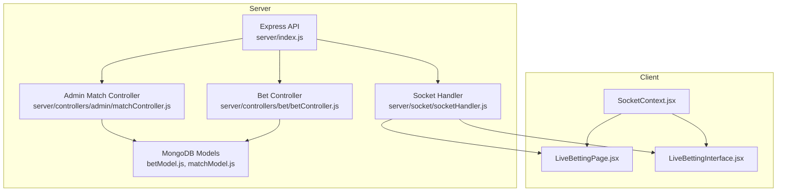
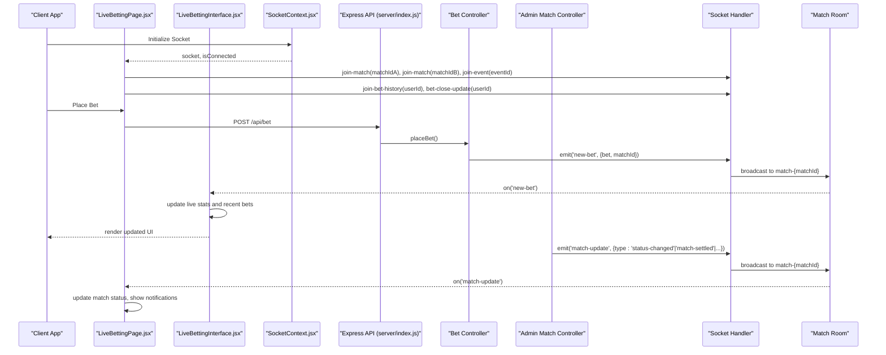
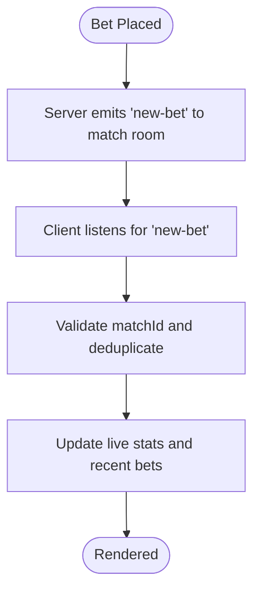
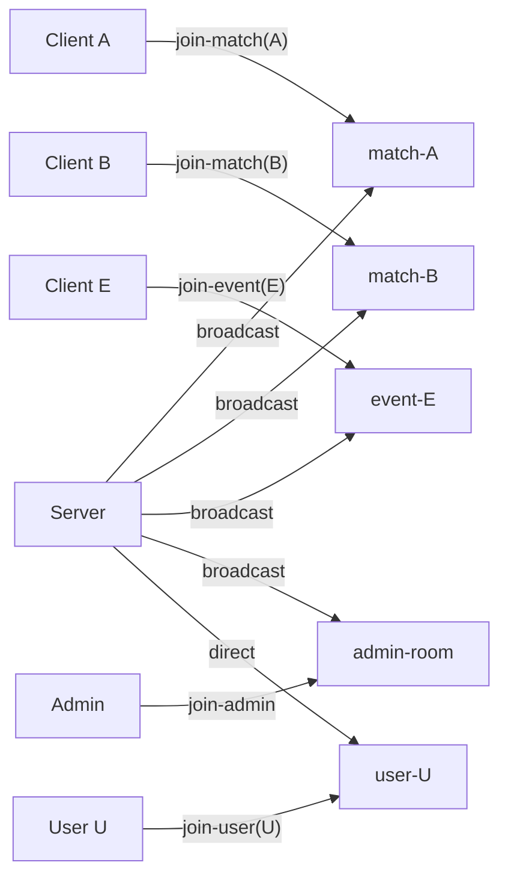
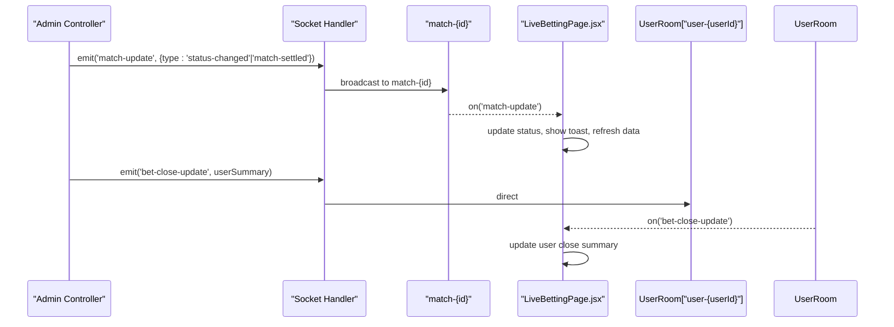
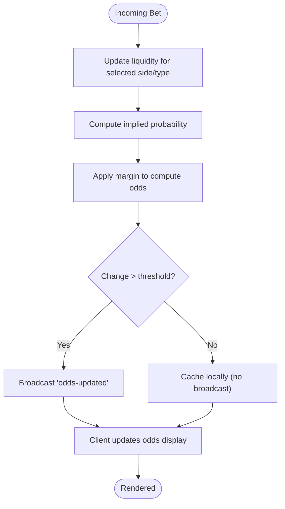
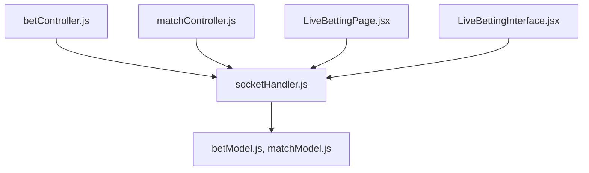

# Odds Calculation and Updating

<cite>
**Referenced Files in This Document**
- [index.js](file://server/index.js)
- [socketHandler.js](file://server/socket/socketHandler.js)
- [matchController.js](file://server/controllers/admin/matchController.js)
- [betController.js](file://server/controllers/bet/betController.js)
- [betModel.js](file://server/models/betModel.js)
- [matchModel.js](file://server/models/matchModel.js)
- [LiveBettingPage.jsx](file://client/src/Pages/Bet/LiveBettingPage.jsx)
- [LiveBettingInterface.jsx](file://client/src/components/Bet/LiveBettingInterface.jsx)
- [SocketContext.jsx](file://client/src/context/SocketContext.jsx)
</cite>

## Table of Contents
1. [Introduction](#introduction)
2. [Project Structure](#project-structure)
3. [Core Components](#core-components)
4. [Architecture Overview](#architecture-overview)
5. [Detailed Component Analysis](#detailed-component-analysis)
6. [Dependency Analysis](#dependency-analysis)
7. [Performance Considerations](#performance-considerations)
8. [Troubleshooting Guide](#troubleshooting-guide)
9. [Conclusion](#conclusion)

## Introduction
This document explains how odds are calculated and updated in the betting system, focusing on:
- How bet placement patterns and liquidity influence odds movement
- The real-time adjustment mechanism and Socket.IO event system for broadcasting updates
- Odds data structures, precision handling, and caching strategies
- How different bet types (Straight, Lay90, Call90) affect odds
- Examples of odds scenarios, real-time updates, and client-side display
- Edge cases such as extreme movements and latency considerations

Important note: The current codebase does not implement explicit odds calculation logic. Instead, it focuses on real-time bet streaming and settlement. This document therefore documents the observed real-time flow and provides recommended approaches for implementing odds calculations.

## Project Structure
The system comprises:
- Server: Express API, Socket.IO handlers, and controllers for matches and bets
- Client: React pages and components that consume real-time updates and display live betting stats

**Diagram sources**
- [index.js](file://server/index.js#L1-L150)
- [socketHandler.js](file://server/socket/socketHandler.js#L1-L101)
- [matchController.js](file://server/controllers/admin/matchController.js#L1-L200)
- [betController.js](file://server/controllers/bet/betController.js#L1-L125)
- [betModel.js](file://server/models/betModel.js#L1-L24)
- [matchModel.js](file://server/models/matchModel.js#L1-L101)
- [LiveBettingPage.jsx](file://client/src/Pages/Bet/LiveBettingPage.jsx#L1-L943)
- [LiveBettingInterface.jsx](file://client/src/components/Bet/LiveBettingInterface.jsx#L1-L439)
- [SocketContext.jsx](file://client/src/context/SocketContext.jsx#L1-L62)

**Section sources**
- [index.js](file://server/index.js#L1-L150)
- [socketHandler.js](file://server/socket/socketHandler.js#L1-L101)
- [matchController.js](file://server/controllers/admin/matchController.js#L1-L200)
- [betController.js](file://server/controllers/bet/betController.js#L1-L125)
- [betModel.js](file://server/models/betModel.js#L1-L24)
- [matchModel.js](file://server/models/matchModel.js#L1-L101)
- [LiveBettingPage.jsx](file://client/src/Pages/Bet/LiveBettingPage.jsx#L1-L943)
- [LiveBettingInterface.jsx](file://client/src/components/Bet/LiveBettingInterface.jsx#L1-L439)
- [SocketContext.jsx](file://client/src/context/SocketContext.jsx#L1-L62)

## Core Components
- Socket.IO rooms and events:
  - Rooms: match-{id}, event-{id}, admin-room, user-{userId}
  - Events: new-bet, match-update, event-update, bet-history-update, bet-close-update, global-match-update
- Real-time bet streaming:
  - On successful bet placement, the server emits a single new-bet event to the match room
  - Clients listen for new-bet and update local live betting stats and recent bets feed
- Settlement and closing:
  - Admin controller emits match-update events for status changes and settlement
  - Bet history and close updates are sent to individual user rooms

Observed behavior:
- No explicit odds calculation occurs in the current codebase
- Odds are not stored in the bet model; only bet amounts and types are persisted
- Real-time updates reflect incoming bets and match lifecycle events

Recommended implementation (conceptual):
- Maintain per-bet-type liquidity pools per match
- Compute implied probabilities from liquidity imbalance and apply margin
- Broadcast odds-updated events when significant shifts occur

**Section sources**
- [socketHandler.js](file://server/socket/socketHandler.js#L1-L101)
- [betController.js](file://server/controllers/bet/betController.js#L43-L106)
- [LiveBettingInterface.jsx](file://client/src/components/Bet/LiveBettingInterface.jsx#L110-L170)
- [LiveBettingPage.jsx](file://client/src/Pages/Bet/LiveBettingPage.jsx#L282-L295)

## Architecture Overview
The real-time flow for bet placement and updates:

**Diagram sources**
- [index.js](file://server/index.js#L94-L100)
- [betController.js](file://server/controllers/bet/betController.js#L43-L106)
- [socketHandler.js](file://server/socket/socketHandler.js#L58-L91)
- [LiveBettingPage.jsx](file://client/src/Pages/Bet/LiveBettingPage.jsx#L208-L408)
- [LiveBettingInterface.jsx](file://client/src/components/Bet/LiveBettingInterface.jsx#L110-L170)
- [SocketContext.jsx](file://client/src/context/SocketContext.jsx#L14-L61)

## Detailed Component Analysis

### Real-Time Bet Streaming and Client Updates
- Server emits a single new-bet event per bet to the match room
- Client components maintain a processedBetIds cache to avoid duplicates
- Live stats are recalculated incrementally and recent bets are appended to the top

**Diagram sources**
- [betController.js](file://server/controllers/bet/betController.js#L79-L96)
- [socketHandler.js](file://server/socket/socketHandler.js#L58-L72)
- [LiveBettingInterface.jsx](file://client/src/components/Bet/LiveBettingInterface.jsx#L110-L170)

**Section sources**
- [betController.js](file://server/controllers/bet/betController.js#L43-L106)
- [socketHandler.js](file://server/socket/socketHandler.js#L1-L101)
- [LiveBettingInterface.jsx](file://client/src/components/Bet/LiveBettingInterface.jsx#L110-L170)

### Socket Rooms and Event Broadcasting
- Rooms:
  - match-{matchId}: per-match real-time updates
  - event-{eventId}: per-event updates for all matches in the event
  - admin-room: administrative notifications
  - user-{userId}: per-user bet history and close updates
- Events:
  - new-bet: bet placement notification
  - match-update: status changes, settlement, and other match lifecycle events
  - event-update: event-level updates
  - bet-history-update: per-user bet history updates
  - bet-close-update: per-user settlement summary when a match closes

**Diagram sources**
- [socketHandler.js](file://server/socket/socketHandler.js#L9-L56)
- [LiveBettingPage.jsx](file://client/src/Pages/Bet/LiveBettingPage.jsx#L211-L224)

**Section sources**
- [socketHandler.js](file://server/socket/socketHandler.js#L1-L101)
- [LiveBettingPage.jsx](file://client/src/Pages/Bet/LiveBettingPage.jsx#L208-L408)

### Settlement and Close Notifications
- Admin controller emits match-update events for status changes and settlement
- Client displays notifications and refreshes match data
- Per-user bet-close-update is emitted for unmatched bets refund summary

**Diagram sources**
- [matchController.js](file://server/controllers/admin/matchController.js#L8-L40)
- [LiveBettingPage.jsx](file://client/src/Pages/Bet/LiveBettingPage.jsx#L282-L390)

**Section sources**
- [matchController.js](file://server/controllers/admin/matchController.js#L1-L200)
- [LiveBettingPage.jsx](file://client/src/Pages/Bet/LiveBettingPage.jsx#L282-L390)

### Odds Data Model and Precision Handling
- Current bet model stores:
  - user, matchId, selectedBird, amount, type, status, winnings, losing, actualAmount
- No odds field is currently persisted
- Amount precision is rounded to two decimal places on bet placement

Recommendations:
- Add an odds field to the bet model and/or a separate odds collection keyed by match and bet type
- Persist odds with sufficient precision (e.g., six decimals) to support fine-grained adjustments
- Apply rounding consistently during calculations and display

**Section sources**
- [betModel.js](file://server/models/betModel.js#L1-L24)
- [betController.js](file://server/controllers/bet/betController.js#L60-L74)

### Bet Types and Their Impact on Odds
Observed bet types:
- Straight: Standard outright bet on a bird
- Lay90: Lay bet with 90% risk contribution (not actively enabled for selection)
- Call90: Call bet with 90% risk contribution (not actively enabled for selection)

Impact considerations:
- Straight bets directly affect liquidity imbalance between the two sides
- Lay90/Call90 introduce asymmetric risk sharing and require special matching logic
- Odds should reflect the effective probability implied by liquidity and margin

Note: Lay90/Call90 are marked as “Coming Soon” in the UI and are not selectable for Straight bets.

**Section sources**
- [LiveBettingInterface.jsx](file://client/src/components/Bet/LiveBettingInterface.jsx#L216-L235)
- [matchModel.js](file://server/models/matchModel.js#L17-L75)

### Real-Time Odds Adjustment Mechanism (Recommended Implementation)
Conceptual algorithm:
- Maintain per-side liquidity totals per bet type
- Compute implied probability from liquidity imbalance
- Apply a bookmaker margin to derive odds
- Broadcast odds-updated events when changes exceed thresholds
- Client-side caching with optimistic updates and rollback on conflicts

[No sources needed since this diagram shows conceptual workflow, not actual code structure]

### Examples of Odds Scenarios
- Scenario A: Large Straight bet on BirdA increases BirdA odds downward and BirdB odds upward
- Scenario B: Multiple small Lay90/Call90 orders create depth; odds remain stable until threshold met
- Scenario C: Extreme imbalance triggers larger odds movement; client receives odds-updated notification

[No sources needed since this section provides conceptual examples]

### Client-Side Odds Display
- LiveBettingInterface.jsx maintains live stats and recent bets
- LiveBettingPage.jsx listens for match-update and odds-updated notifications
- UI reflects betting activity and match lifecycle events

**Section sources**
- [LiveBettingInterface.jsx](file://client/src/components/Bet/LiveBettingInterface.jsx#L327-L439)
- [LiveBettingPage.jsx](file://client/src/Pages/Bet/LiveBettingPage.jsx#L282-L295)

### Edge Cases and Latency Considerations
- Duplicate detection: processedBetIds cache prevents duplicate rendering
- Undefined match rooms: server supports match-undefined for transitional states
- Latency: Socket.IO reconnection and polling transports improve resilience
- Extreme movements: Implement thresholds to avoid excessive broadcasts; clients should debounce UI updates

**Section sources**
- [LiveBettingInterface.jsx](file://client/src/components/Bet/LiveBettingInterface.jsx#L35-L36)
- [LiveBettingPage.jsx](file://client/src/Pages/Bet/LiveBettingPage.jsx#L211-L224)
- [SocketContext.jsx](file://client/src/context/SocketContext.jsx#L18-L27)

## Dependency Analysis
- Controllers depend on Socket.IO handler for emitting events
- Client pages and interfaces depend on SocketContext for connection state and socket instance
- Models define persistence for bets and matches; settlement logic resides in admin controller

**Diagram sources**
- [betController.js](file://server/controllers/bet/betController.js#L1-L125)
- [matchController.js](file://server/controllers/admin/matchController.js#L1-L200)
- [socketHandler.js](file://server/socket/socketHandler.js#L1-L101)
- [betModel.js](file://server/models/betModel.js#L1-L24)
- [matchModel.js](file://server/models/matchModel.js#L1-L101)
- [LiveBettingPage.jsx](file://client/src/Pages/Bet/LiveBettingPage.jsx#L1-L943)
- [LiveBettingInterface.jsx](file://client/src/components/Bet/LiveBettingInterface.jsx#L1-L439)

**Section sources**
- [betController.js](file://server/controllers/bet/betController.js#L1-L125)
- [matchController.js](file://server/controllers/admin/matchController.js#L1-L200)
- [socketHandler.js](file://server/socket/socketHandler.js#L1-L101)
- [betModel.js](file://server/models/betModel.js#L1-L24)
- [matchModel.js](file://server/models/matchModel.js#L1-L101)
- [LiveBettingPage.jsx](file://client/src/Pages/Bet/LiveBettingPage.jsx#L1-L943)
- [LiveBettingInterface.jsx](file://client/src/components/Bet/LiveBettingInterface.jsx#L1-L439)

## Performance Considerations
- Minimize redundant broadcasts: emit only when odds change beyond thresholds
- Client-side caching: maintain a local odds cache keyed by matchId and bet type
- Debounce UI updates: batch frequent updates to reduce re-renders
- Efficient deduplication: keep processedBetIds as a Set for O(1) lookup
- Transport tuning: leverage WebSocket with polling fallback for reliability

[No sources needed since this section provides general guidance]

## Troubleshooting Guide
- Socket not initialized: getIO throws an error if called before initialization
- Connection issues: SocketContext manages reconnection attempts and transport fallback
- Duplicate events: processedBetIds cache prevents duplicate processing
- Room joining: Ensure correct room names (match-{id}, event-{id}, user-{userId})

**Section sources**
- [socketHandler.js](file://server/socket/socketHandler.js#L93-L98)
- [SocketContext.jsx](file://client/src/context/SocketContext.jsx#L18-L54)
- [LiveBettingInterface.jsx](file://client/src/components/Bet/LiveBettingInterface.jsx#L122-L129)

## Conclusion
The current system streams live bets and match lifecycle events effectively but does not implement explicit odds calculations. To add robust odds computation:
- Introduce liquidity tracking per bet type and side
- Derive odds from implied probabilities plus margin
- Broadcast odds-updated events on meaningful changes
- Implement client-side caching and debouncing for responsive UI
- Extend settlement logic to include odds-based payouts where applicable

[No sources needed since this section summarizes without analyzing specific files]