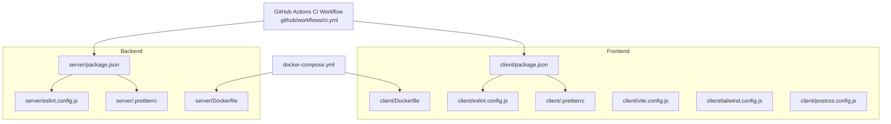
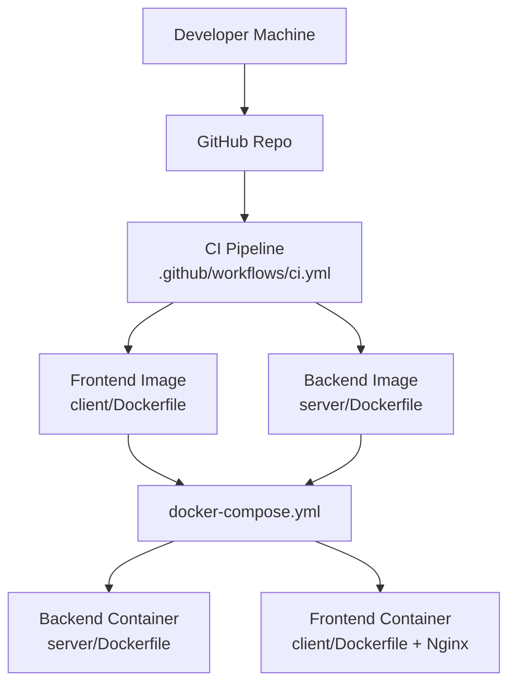
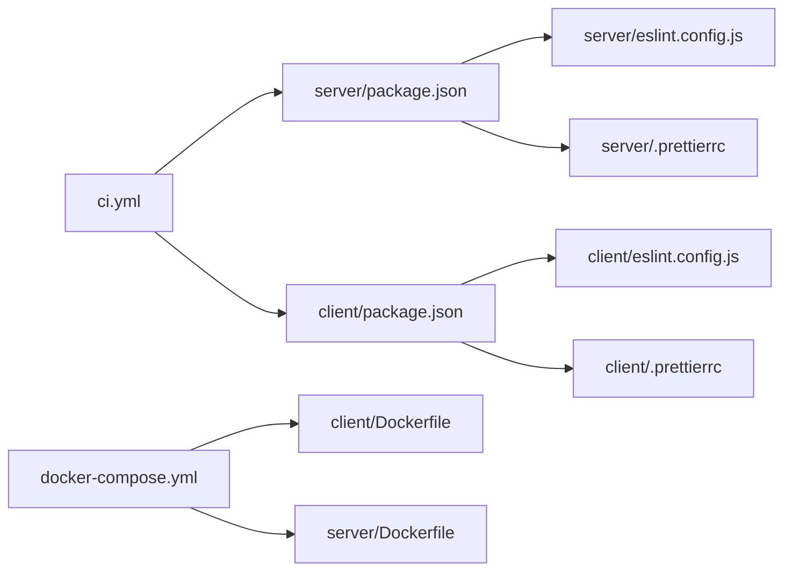

# Contributing Guidelines

<cite>
**Referenced Files in This Document**
- [README.md](file://README.md)
- [.github/workflows/ci.yml](file://.github/workflows/ci.yml)
- [client/package.json](file://client/package.json)
- [client/eslint.config.js](file://client/eslint.config.js)
- [client/.prettierrc](file://client/.prettierrc)
- [client/Dockerfile](file://client/Dockerfile)
- [client/vite.config.js](file://client/vite.config.js)
- [client/tailwind.config.js](file://client/tailwind.config.js)
- [client/postcss.config.js](file://client/postcss.config.js)
- [server/package.json](file://server/package.json)
- [server/eslint.config.js](file://server/eslint.config.js)
- [server/.prettierrc](file://server/.prettierrc)
- [server/Dockerfile](file://server/Dockerfile)
- [docker-compose.yml](file://docker-compose.yml)
</cite>

## Table of Contents
1. [Introduction](#introduction)
2. [Project Structure](#project-structure)
3. [Core Components](#core-components)
4. [Architecture Overview](#architecture-overview)
5. [Detailed Component Analysis](#detailed-component-analysis)
6. [Dependency Analysis](#dependency-analysis)
7. [Performance Considerations](#performance-considerations)
8. [Troubleshooting Guide](#troubleshooting-guide)
9. [Conclusion](#conclusion)
10. [Appendices](#appendices)

## Introduction
Thank you for your interest in contributing to the Betting Platform project. This document defines the development workflow, code style, testing and quality assurance expectations, review process, issue reporting, release and version management, licensing, community standards, continuous integration, and onboarding for new contributors.

## Project Structure
The project is a full-stack application composed of:
- A React-based frontend (client) served via Nginx in a production container
- A Node.js/Express backend with MongoDB connectivity and real-time features via Socket.IO
- Shared CI pipeline orchestrated via GitHub Actions
- Docker-based local and deployment environments

**Diagram sources**
- [.github/workflows/ci.yml](file://.github/workflows/ci.yml#L1-L88)
- [client/package.json](file://client/package.json#L1-L70)
- [client/eslint.config.js](file://client/eslint.config.js#L1-L39)
- [client/.prettierrc](file://client/.prettierrc#L1-L6)
- [client/Dockerfile](file://client/Dockerfile#L1-L27)
- [client/vite.config.js](file://client/vite.config.js#L1-L14)
- [client/tailwind.config.js](file://client/tailwind.config.js#L1-L85)
- [client/postcss.config.js](file://client/postcss.config.js#L1-L7)
- [server/package.json](file://server/package.json#L1-L43)
- [server/eslint.config.js](file://server/eslint.config.js#L1-L9)
- [server/.prettierrc](file://server/.prettierrc#L1-L6)
- [server/Dockerfile](file://server/Dockerfile#L1-L21)
- [docker-compose.yml](file://docker-compose.yml#L1-L50)

**Section sources**
- [README.md](file://README.md#L1-L1)
- [.github/workflows/ci.yml](file://.github/workflows/ci.yml#L1-L88)
- [docker-compose.yml](file://docker-compose.yml#L1-L50)

## Core Components
- Frontend (client): React application built with Vite, styled with Tailwind CSS, and bundled via Nginx in production.
- Backend (server): Node.js/Express service with MongoDB, rate limiting, helmet, JWT, and Socket.IO for live updates.
- CI/CD: Automated linting and image builds for frontend and backend on push and pull requests targeting main and dev.
- Local Dev Environment: Docker Compose orchestrates backend and frontend containers with health checks and SSL volume mounting.

**Section sources**
- [client/package.json](file://client/package.json#L1-L70)
- [server/package.json](file://server/package.json#L1-L43)
- [.github/workflows/ci.yml](file://.github/workflows/ci.yml#L1-L88)
- [docker-compose.yml](file://docker-compose.yml#L1-L50)

## Architecture Overview
High-level runtime architecture and CI flow:

**Diagram sources**
- [.github/workflows/ci.yml](file://.github/workflows/ci.yml#L1-L88)
- [client/Dockerfile](file://client/Dockerfile#L1-L27)
- [server/Dockerfile](file://server/Dockerfile#L1-L21)
- [docker-compose.yml](file://docker-compose.yml#L1-L50)

## Detailed Component Analysis

### Development Workflow
- Branching model
  - Use feature branches prefixed with your initials or team name followed by a slash and a descriptive name (e.g., feature/add-auth-ui, bugfix/resolve-login-error).
  - Merge to dev for integration and to main for releases.
- Commit messages
  - Use imperative mood and concise summaries. Reference related issues with a short code (e.g., feat(auth): add login form #123).
  - Keep subject lines under 50 characters; separate body from subject with a blank line.
- Pull Requests
  - Open PRs from feature branches to dev first for integration, then to main for release.
  - Include a summary, rationale, testing notes, and any screenshots or links to related issues.
  - Ensure CI passes and address reviewer feedback promptly.

[No sources needed since this section provides general guidance]

### Code Style Guidelines (Prettier and ESLint)
- Formatting (Prettier)
  - Single quotes, semicolons, print width 100.
  - Apply formatting locally before committing.
- Linting (ESLint)
  - React recommended rules plus hooks and refresh rules are enabled.
  - Server enforces semicolons for JavaScript files.
- Running locally
  - Frontend: lint and format scripts are defined in the client package.
  - Backend: lint and format scripts are defined in the server package.

**Section sources**
- [client/.prettierrc](file://client/.prettierrc#L1-L6)
- [client/eslint.config.js](file://client/eslint.config.js#L1-L39)
- [server/.prettierrc](file://server/.prettierrc#L1-L6)
- [server/eslint.config.js](file://server/eslint.config.js#L1-L9)
- [client/package.json](file://client/package.json#L6-L12)
- [server/package.json](file://server/package.json#L7-L13)

### Testing Requirements and Quality Assurance
- Current state
  - The backend package script for tests prints a message indicating no test is currently configured.
- Recommended practices
  - Add unit and integration tests aligned with the tech stack (e.g., Vitest for frontend, Jest/Mocha for backend).
  - Include tests for critical paths: authentication, payment, match management, and real-time events.
  - Maintain a dedicated test command in package.json and ensure CI validates tests when implemented.
- Quality gates
  - Enforce lint-free commits and formatting consistency.
  - Prefer small, focused PRs to reduce regression risk.

**Section sources**
- [server/package.json](file://server/package.json#L10-L10)

### Review Process and Approval Workflows
- Code review standards
  - Focus on correctness, readability, maintainability, security, and performance.
  - Verify adherence to style guides and ensure tests accompany new logic.
- Approval workflow
  - Require at least one maintainer approval before merging.
  - Keep PRs small and update them incrementally to facilitate review.

[No sources needed since this section provides general guidance]

### Issue Reporting and Bug Fix Protocols
- Issue reporting
  - Use GitHub Issues with clear titles, steps to reproduce, expected vs. actual behavior, and logs/environment details.
- Bug fix protocol
  - Link the issue in the PR description and commit message.
  - Add a test case that reproduces the bug and verifies the fix.

[No sources needed since this section provides general guidance]

### Release Process and Version Management
- Versioning
  - Follow semantic versioning. Increment patch for bug fixes, minor for backward-compatible features, major for breaking changes.
- Release branches
  - Merge dev into main for releases; tag annotated tags on main for releases.
- CI deployment
  - The current CI workflow builds images but does not deploy automatically. Deployment can be added downstream as needed.

**Section sources**
- [.github/workflows/ci.yml](file://.github/workflows/ci.yml#L1-L88)

### Contribution Licensing and Intellectual Property
- Contributor License Agreement (CLA)
  - Contributors retain copyright; by submitting code, you agree to license it under the project’s existing open-source license.
- License notice
  - The backend package declares ISC; align contributions with this license or coordinate a change via maintainers.
- IP considerations
  - Do not submit third-party code without permission or incompatible licenses.
  - Remove sensitive data and credentials from submissions.

**Section sources**
- [server/package.json](file://server/package.json#L17-L18)

### Community Guidelines and Communication Standards
- Communication
  - Use respectful, inclusive language in issues, PRs, and reviews.
  - Provide constructive feedback and be responsive to reviewer comments.
- First-time contributors
  - Newcomers can start with good first issues labeled appropriately.

[No sources needed since this section provides general guidance]

### Continuous Integration and Automated Testing
- Triggers
  - CI runs on push and pull_request to main and dev.
- Steps
  - Node.js setup, backend linting, and building backend/frontend Docker images.
- Recommendations
  - Enable frontend linting in CI.
  - Add automated tests and enforce warnings-as-errors for linting.

**Section sources**
- [.github/workflows/ci.yml](file://.github/workflows/ci.yml#L5-L39)

### Onboarding and Mentorship
- Getting started
  - Fork the repo, create a feature branch, install dependencies, and run the app locally with Docker Compose.
- Local environment
  - Use docker-compose.yml to spin up backend and frontend containers with health checks and SSL mounted.
- Mentorship
  - Connect with maintainers for guidance on architecture, testing, and contribution pathways.

**Section sources**
- [docker-compose.yml](file://docker-compose.yml#L1-L50)

## Dependency Analysis
- Internal dependencies
  - Frontend and backend each define their own lint/format scripts and tooling.
- External dependencies
  - Frontend: React, Redux, Radix UI, Tailwind CSS, Vite, Prettier, ESLint, PostCSS, Autoprefixer.
  - Backend: Express, Mongoose, bcrypt, helmet, rate limiting, JWT, nodemailer, Cloudinary, Socket.IO, validator.
- CI dependencies
  - GitHub Actions, Node.js 20, Docker.

**Diagram sources**
- [client/package.json](file://client/package.json#L1-L70)
- [client/eslint.config.js](file://client/eslint.config.js#L1-L39)
- [client/.prettierrc](file://client/.prettierrc#L1-L6)
- [server/package.json](file://server/package.json#L1-L43)
- [server/eslint.config.js](file://server/eslint.config.js#L1-L9)
- [server/.prettierrc](file://server/.prettierrc#L1-L6)
- [.github/workflows/ci.yml](file://.github/workflows/ci.yml#L1-L88)
- [docker-compose.yml](file://docker-compose.yml#L1-L50)
- [client/Dockerfile](file://client/Dockerfile#L1-L27)
- [server/Dockerfile](file://server/Dockerfile#L1-L21)

**Section sources**
- [client/package.json](file://client/package.json#L1-L70)
- [server/package.json](file://server/package.json#L1-L43)
- [.github/workflows/ci.yml](file://.github/workflows/ci.yml#L1-L88)
- [docker-compose.yml](file://docker-compose.yml#L1-L50)

## Performance Considerations
- Optimize bundle size by avoiding unnecessary dependencies and enabling tree-shaking.
- Use lazy loading and code splitting for large pages.
- Minimize DOM re-renders and leverage efficient state management.
- Keep lint warnings minimal to avoid regressions.

[No sources needed since this section provides general guidance]

## Troubleshooting Guide
- Lint failures
  - Run the appropriate lint script in client or server and fix reported issues.
- Formatting inconsistencies
  - Run the format script in client or server to apply Prettier rules.
- CI failures
  - Review the CI logs for lint/build errors; ensure local scripts pass before pushing.

**Section sources**
- [client/package.json](file://client/package.json#L9-L12)
- [server/package.json](file://server/package.json#L11-L13)
- [.github/workflows/ci.yml](file://.github/workflows/ci.yml#L29-L39)

## Conclusion
By following these guidelines, contributors can collaborate effectively, maintain high-quality code, and accelerate delivery. Adhering to style, testing, review, and release processes ensures a robust and scalable Betting Platform.

[No sources needed since this section summarizes without analyzing specific files]

## Appendices
- Useful commands
  - Frontend: npm run dev, npm run build, npm run lint, npm run lint:fix, npm run format
  - Backend: npm run dev, npm run lint, npm run lint:fix, npm run format
  - CI: Triggered automatically on push/pull_request to main and dev
  - Docker: docker-compose up --build

**Section sources**
- [client/package.json](file://client/package.json#L6-L12)
- [server/package.json](file://server/package.json#L7-L13)
- [.github/workflows/ci.yml](file://.github/workflows/ci.yml#L5-L9)
- [docker-compose.yml](file://docker-compose.yml#L1-L50)