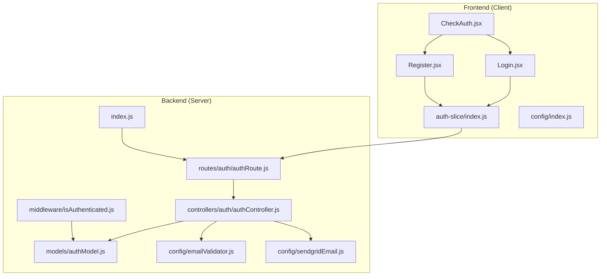
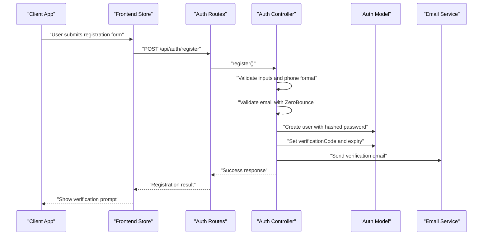
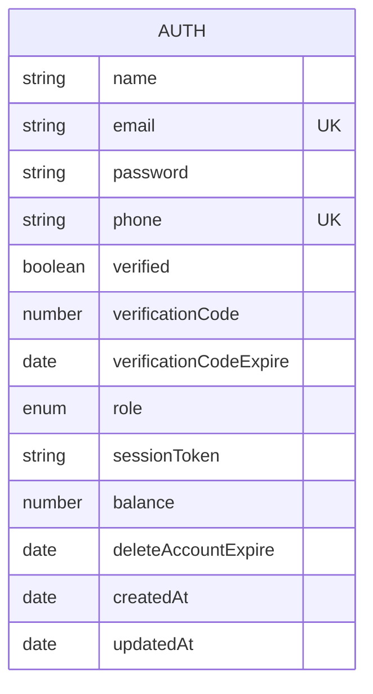
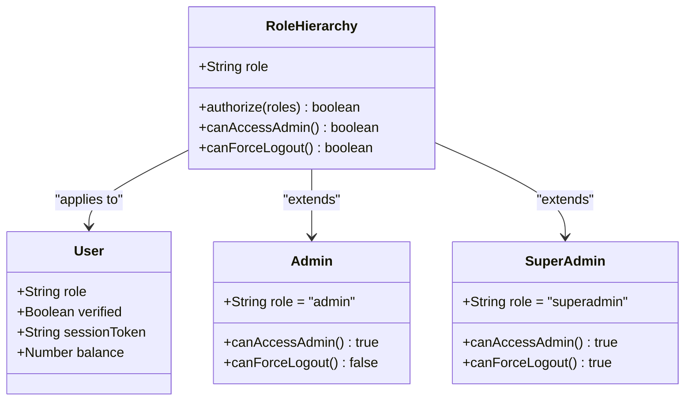
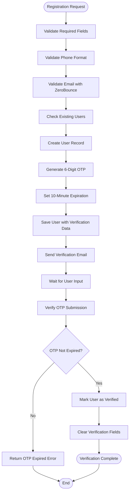
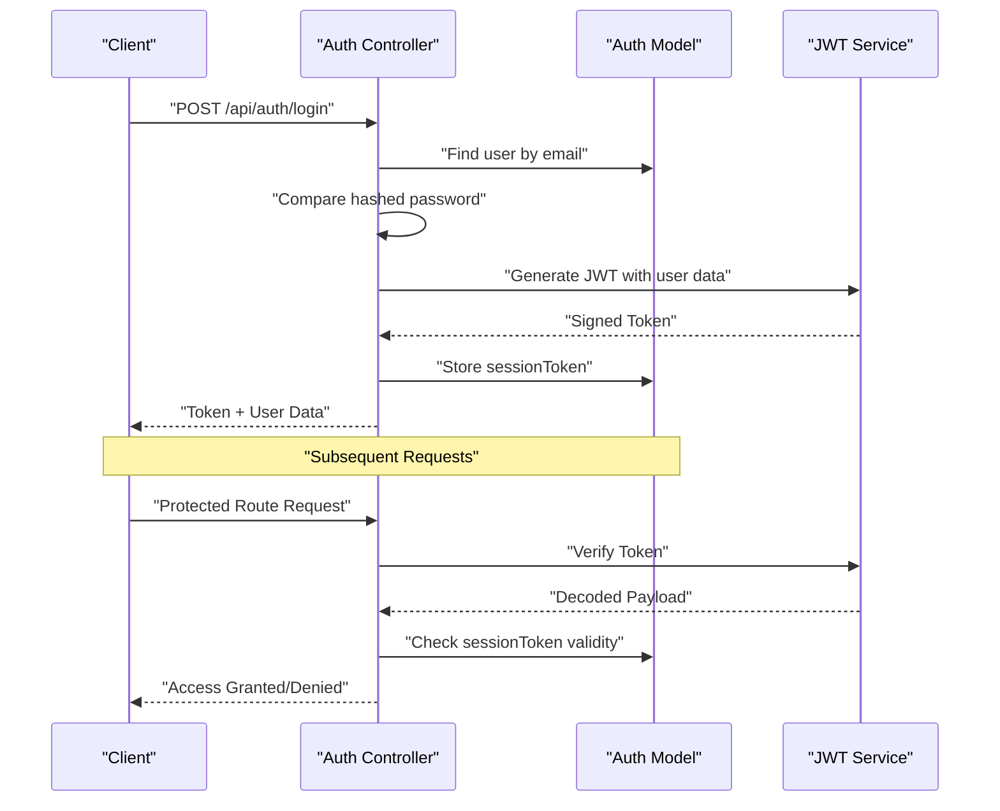
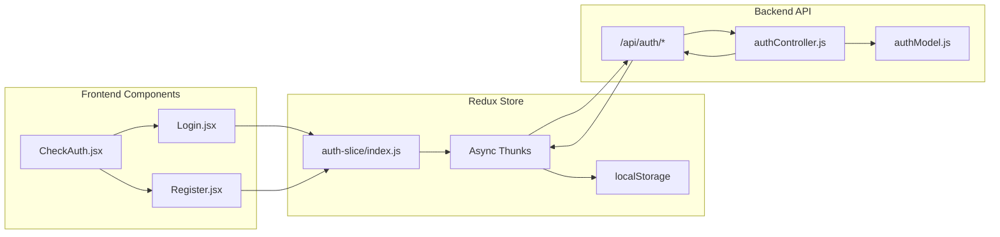
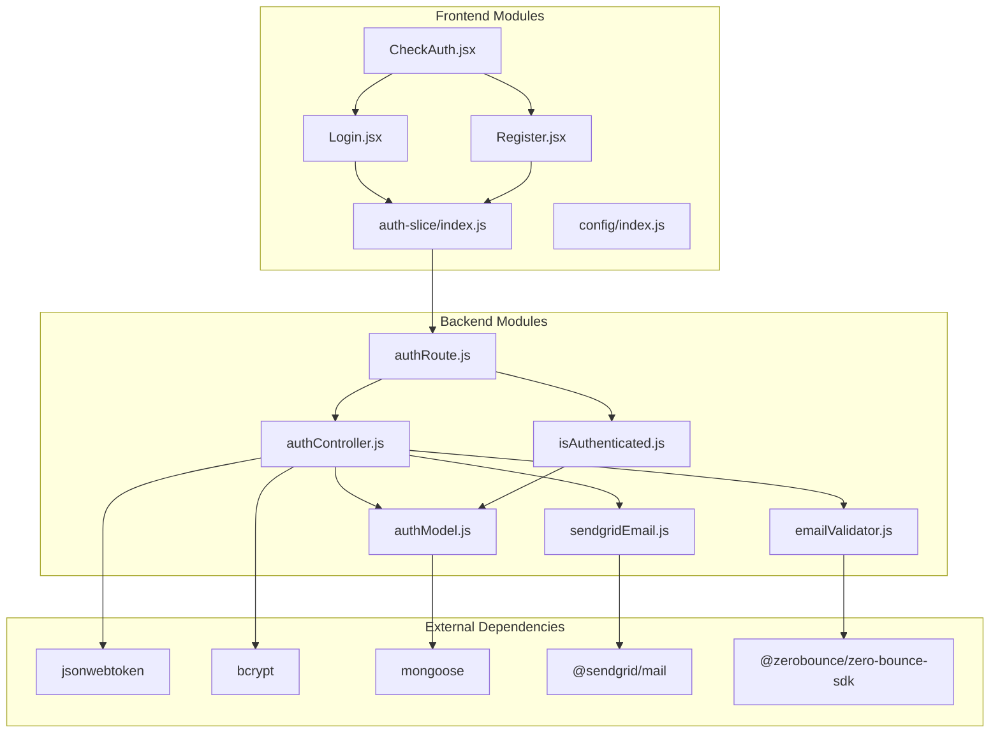

# Authentication Model

<cite>
**Referenced Files in This Document**
- [authModel.js](file://server/models/authModel.js)
- [authController.js](file://server/controllers/auth/authController.js)
- [isAuthenticated.js](file://server/middleware/isAuthenticated.js)
- [authRoute.js](file://server/routes/auth/authRoute.js)
- [checkAuth.js](file://server/controllers/auth/checkAuth.js)
- [index.js](file://server/index.js)
- [emailValidator.js](file://server/config/emailValidator.js)
- [sendgridEmail.js](file://server/config/sendgridEmail.js)
- [Login.jsx](file://client/src/Pages/authPage/Login.jsx)
- [Register.jsx](file://client/src/Pages/authPage/Register.jsx)
- [CheckAuth.jsx](file://client/src/components/common/CheckAuth.jsx)
- [index.js](file://client/src/store/auth-slice/index.js)
- [index.js](file://client/src/config/index.js)
</cite>

## Table of Contents
1. [Introduction](#introduction)
2. [Project Structure](#project-structure)
3. [Core Components](#core-components)
4. [Architecture Overview](#architecture-overview)
5. [Detailed Component Analysis](#detailed-component-analysis)
6. [Dependency Analysis](#dependency-analysis)
7. [Performance Considerations](#performance-considerations)
8. [Troubleshooting Guide](#troubleshooting-guide)
9. [Conclusion](#conclusion)
10. [Appendices](#appendices)

## Introduction
This document provides comprehensive documentation for the Authentication Model schema and the complete authentication system. It covers the MongoDB schema definition, field validations, role-based access control, verification workflow, session management, indexing strategy, and integration with frontend components and middleware. The system implements secure user registration, email verification via OTP, login/logout mechanisms, password reset, and administrative force logout capabilities.

## Project Structure
The authentication system spans both backend (Node.js/MongoDB) and frontend (React/Redux) layers. The backend defines the Auth model, exposes REST endpoints, and handles JWT-based session management. The frontend manages user interactions, form submissions, and maintains authentication state.

**Diagram sources**
- [index.js](file://server/index.js#L93-L100)
- [authRoute.js](file://server/routes/auth/authRoute.js#L1-L34)
- [authController.js](file://server/controllers/auth/authController.js#L1-L457)
- [authModel.js](file://server/models/authModel.js#L1-L40)
- [isAuthenticated.js](file://server/middleware/isAuthenticated.js#L1-L62)
- [emailValidator.js](file://server/config/emailValidator.js#L1-L127)
- [sendgridEmail.js](file://server/config/sendgridEmail.js#L1-L58)
- [Login.jsx](file://client/src/Pages/authPage/Login.jsx#L1-L221)
- [Register.jsx](file://client/src/Pages/authPage/Register.jsx#L1-L223)
- [CheckAuth.jsx](file://client/src/components/common/CheckAuth.jsx#L1-L44)
- [index.js](file://client/src/store/auth-slice/index.js#L1-L342)
- [index.js](file://client/src/config/index.js#L1-L70)

**Section sources**
- [index.js](file://server/index.js#L93-L100)
- [authRoute.js](file://server/routes/auth/authRoute.js#L1-L34)

## Core Components
This section documents the Authentication Model schema, including all fields, data types, constraints, and validation rules. It also explains the role hierarchy, verification workflow, session management, and indexing strategy.

- Schema Definition and Fields
  - name: String, required
  - email: String, required, unique
  - password: String, required
  - phone: String, required, unique
  - verified: Boolean, default false
  - verificationCode: Number, default null
  - verificationCodeExpire: Date, default 10 minutes from creation
  - role: Enum ['admin', 'user', 'superadmin'], default 'user'
  - sessionToken: String, default null
  - balance: Number, default 0
  - deleteAccountExpire: Date, default null
  - registrationAttempts: Array of timestamps
  - createdAt: Date (auto-generated by timestamps)
  - updatedAt: Date (auto-generated by timestamps)

- Validation Rules and Constraints
  - All required fields must be present during registration
  - Passwords must match during registration
  - Phone number must pass regex validation
  - Email uniqueness enforced at DB level
  - Phone number uniqueness enforced at DB level
  - Role must be one of the allowed enum values
  - Verification code expires after 10 minutes
  - Registration attempts limited to prevent abuse

- Indexing Strategy
  - Compound indexes for efficient lookups:
    - email: 1
    - name: 1
    - role: 1
    - createdAt: -1 (descending for recent-first queries)

- Session Management
  - JWT tokens generated upon successful login
  - sessionToken stored in DB to enable force logout
  - Token invalidated on logout or forced logout
  - Middleware validates token and checks sessionToken

- Role-Based Access Control
  - authorize middleware restricts routes by role
  - Superadmin can force logout all users or specific users
  - Frontend routing adapts based on user role

**Section sources**
- [authModel.js](file://server/models/authModel.js#L3-L32)
- [authModel.js](file://server/models/authModel.js#L34-L37)

## Architecture Overview
The authentication architecture follows a layered approach with clear separation of concerns:
- Frontend handles user interface and state management
- Backend provides REST APIs and business logic
- Database stores user data with appropriate indexes
- Middleware enforces authentication and authorization
- Email service handles verification communications

**Diagram sources**
- [authRoute.js](file://server/routes/auth/authRoute.js#L20-L21)
- [authController.js](file://server/controllers/auth/authController.js#L50-L124)
- [authModel.js](file://server/models/authModel.js#L85-L105)
- [emailValidator.js](file://server/config/emailValidator.js#L10-L126)
- [sendgridEmail.js](file://server/config/sendgridEmail.js#L6-L31)

**Section sources**
- [authController.js](file://server/controllers/auth/authController.js#L50-L124)
- [authRoute.js](file://server/routes/auth/authRoute.js#L1-L34)

## Detailed Component Analysis

### Authentication Model Schema
The Auth model defines the complete user profile structure with comprehensive validation and security measures.

**Diagram sources**
- [authModel.js](file://server/models/authModel.js#L3-L32)

Key schema characteristics:
- Unique constraints on email and phone fields
- Enum validation for role field
- Automatic timestamp management
- Default values for critical fields
- Expiration tracking for verification and account deletion

**Section sources**
- [authModel.js](file://server/models/authModel.js#L3-L32)

### Role-Based Access Control System
The system implements hierarchical roles with specific permissions and capabilities.

**Diagram sources**
- [isAuthenticated.js](file://server/middleware/isAuthenticated.js#L51-L61)
- [authModel.js](file://server/models/authModel.js#L15-L20)

Role capabilities:
- User: Full access to personal features, limited admin access
- Admin: Elevated privileges, cannot force logout users
- SuperAdmin: Full administrative control including force logout

**Section sources**
- [isAuthenticated.js](file://server/middleware/isAuthenticated.js#L51-L61)
- [authModel.js](file://server/models/authModel.js#L15-L20)

### Verification Workflow with Expiration Times
The verification system implements a robust OTP mechanism with time-based expiration.

**Diagram sources**
- [authController.js](file://server/controllers/auth/authController.js#L50-L124)
- [authController.js](file://server/controllers/auth/authController.js#L150-L193)

Verification workflow specifics:
- OTP generation: 6-digit random number
- Expiration: 10 minutes from creation
- Email validation: Multi-layered verification
- Attempt limits: Prevent brute force attacks

**Section sources**
- [authController.js](file://server/controllers/auth/authController.js#L27-L29)
- [authController.js](file://server/controllers/auth/authController.js#L102-L105)
- [authController.js](file://server/controllers/auth/authController.js#L150-L193)

### Session Management
The session management system uses JWT tokens with database-backed invalidation.

**Diagram sources**
- [authController.js](file://server/controllers/auth/authController.js#L195-L250)
- [isAuthenticated.js](file://server/middleware/isAuthenticated.js#L12-L44)
- [authModel.js](file://server/models/authModel.js#L21-L22)

Session lifecycle:
- Token generation on successful login
- Database storage for token invalidation
- Middleware validation on protected routes
- Force logout capability for administrators

**Section sources**
- [authController.js](file://server/controllers/auth/authController.js#L227-L240)
- [isAuthenticated.js](file://server/middleware/isAuthenticated.js#L12-L44)

### Frontend Authentication Integration
The frontend integrates seamlessly with the backend authentication system through Redux actions and React components.

**Diagram sources**
- [Login.jsx](file://client/src/Pages/authPage/Login.jsx#L1-L221)
- [Register.jsx](file://client/src/Pages/authPage/Register.jsx#L1-L223)
- [CheckAuth.jsx](file://client/src/components/common/CheckAuth.jsx#L1-L44)
- [index.js](file://client/src/store/auth-slice/index.js#L1-L342)
- [authRoute.js](file://server/routes/auth/authRoute.js#L1-L34)

Frontend features:
- Form validation and error handling
- OTP modal dialogs for verification
- Role-based navigation
- Persistent authentication state
- Internationalization support

**Section sources**
- [Login.jsx](file://client/src/Pages/authPage/Login.jsx#L30-L61)
- [Register.jsx](file://client/src/Pages/authPage/Register.jsx#L35-L79)
- [CheckAuth.jsx](file://client/src/components/common/CheckAuth.jsx#L4-L41)
- [index.js](file://client/src/store/auth-slice/index.js#L257-L342)

## Dependency Analysis
The authentication system has well-defined dependencies between components, ensuring maintainability and scalability.

**Diagram sources**
- [authController.js](file://server/controllers/auth/authController.js#L1-L6)
- [authModel.js](file://server/models/authModel.js#L1)
- [isAuthenticated.js](file://server/middleware/isAuthenticated.js#L1-L2)
- [emailValidator.js](file://server/config/emailValidator.js#L1-L8)
- [sendgridEmail.js](file://server/config/sendgridEmail.js#L1-L4)
- [Login.jsx](file://client/src/Pages/authPage/Login.jsx#L1-L10)
- [Register.jsx](file://client/src/Pages/authPage/Register.jsx#L1-L11)
- [CheckAuth.jsx](file://client/src/components/common/CheckAuth.jsx#L1-L2)
- [index.js](file://client/src/store/auth-slice/index.js#L1-L3)

Key dependency relationships:
- Backend depends on database abstraction and external services
- Frontend depends on backend APIs and Redux for state management
- Both layers depend on shared configuration and environment variables

**Section sources**
- [authController.js](file://server/controllers/auth/authController.js#L1-L6)
- [authModel.js](file://server/models/authModel.js#L1)
- [isAuthenticated.js](file://server/middleware/isAuthenticated.js#L1-L2)

## Performance Considerations
The authentication system incorporates several performance optimizations and security measures:

- Database Indexing
  - Compound indexes on frequently queried fields (email, name, role)
  - Reverse chronological index on timestamps for recent queries
  - Unique indexes on email and phone for fast lookups

- Token Management
  - JWT tokens minimize database queries for authenticated requests
  - sessionToken field enables immediate invalidation without token revocation
  - Token expiration handled by JWT library

- Email Service
  - Asynchronous email sending prevents blocking operations
  - Error handling for email delivery failures
  - Fallback mechanisms for email validation

- Frontend Optimization
  - Redux state management reduces unnecessary re-renders
  - Conditional rendering based on authentication state
  - Loading states for async operations

[No sources needed since this section provides general guidance]

## Troubleshooting Guide
Common authentication issues and their solutions:

### Registration Issues
- Duplicate email/phone: Check unique constraint violations
- Invalid phone format: Verify regex validation
- Email validation failures: Review ZeroBounce API response
- Maximum registration attempts: User exceeded 3 attempts

### Verification Issues
- OTP not received: Check email delivery logs
- OTP expired: Verify 10-minute expiration window
- Invalid OTP: Confirm exact match with generated code
- Account not verified: Handle verification-required responses

### Login Issues
- Invalid credentials: Verify password hash comparison
- Account not verified: Prompt for OTP verification
- Session expired: Require user to log in again
- Force logout: Check sessionToken mismatch

### Administrative Issues
- Superadmin permissions: Verify role hierarchy
- Force logout failures: Check user existence and sessionToken
- Role-based routing: Ensure proper authorization middleware

**Section sources**
- [authController.js](file://server/controllers/auth/authController.js#L7-L20)
- [authController.js](file://server/controllers/auth/authController.js#L54-L62)
- [authController.js](file://server/controllers/auth/authController.js#L172-L180)
- [isAuthenticated.js](file://server/middleware/isAuthenticated.js#L14-L40)

## Conclusion
The Authentication Model provides a comprehensive, secure, and scalable foundation for user management. Its design balances security requirements with usability, incorporating robust verification workflows, flexible role-based access control, and efficient session management. The system's modular architecture ensures maintainability while supporting future enhancements such as multi-factor authentication, audit logging, and advanced analytics.

Key strengths of the implementation:
- Strong security through hashing, JWT, and verification
- Flexible role hierarchy with clear permission boundaries
- Comprehensive error handling and user feedback
- Well-structured frontend-backend integration
- Scalable database design with appropriate indexing

## Appendices

### Field Validation Rules Reference
- Required fields: name, email, phone, password
- Password confirmation: Must match during registration
- Phone validation: International format with country codes
- Email validation: Multi-layered verification process
- Role validation: Enum-based with strict enforcement
- OTP validation: Numeric 6-digit code with expiration

### API Endpoint Reference
- POST /api/auth/register: User registration with verification
- POST /api/auth/verify-otp: OTP verification for account activation
- POST /api/auth/login: User login with JWT token generation
- POST /api/auth/logout: User logout with token invalidation
- POST /api/auth/resend-otp: Resend verification code
- POST /api/auth/forgot-password: Password reset initiation
- POST /api/auth/reset-password: Password reset completion
- POST /api/auth/superadmin-force-logout-all: Admin force logout all users
- POST /api/auth/superadmin-force-logout-user: Admin force logout specific user

### Frontend Integration Patterns
- Form validation with real-time feedback
- Modal dialogs for OTP verification
- Role-based navigation and UI adaptation
- Persistent authentication state management
- Internationalization support for global deployment