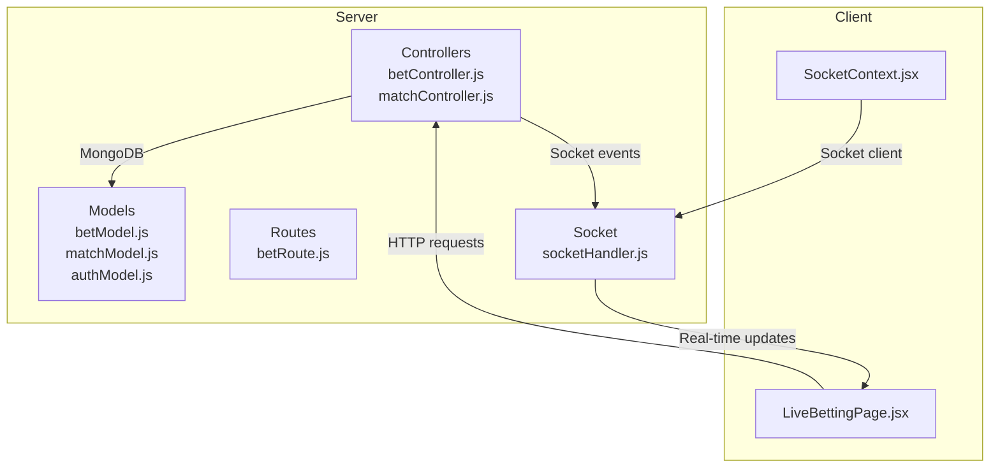
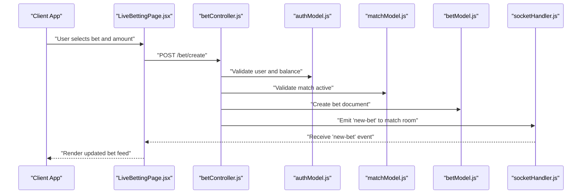
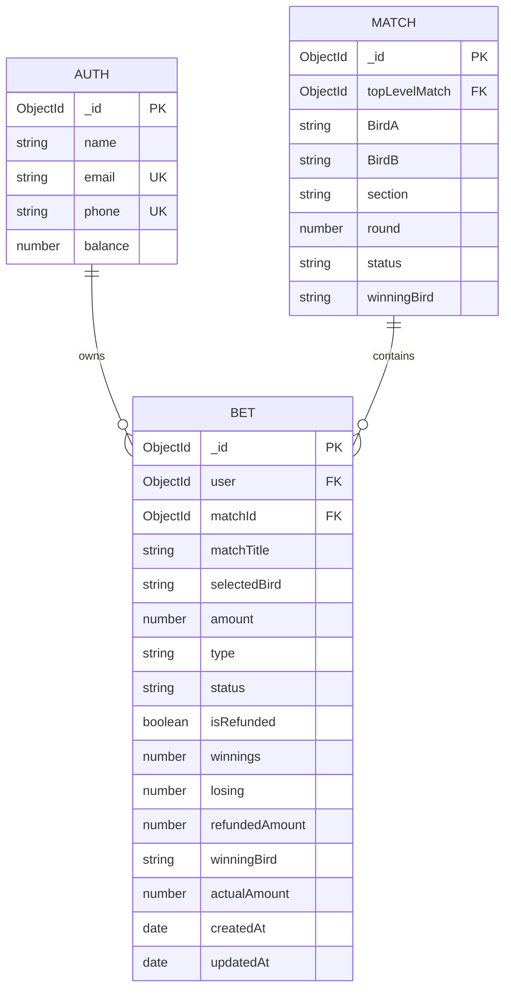
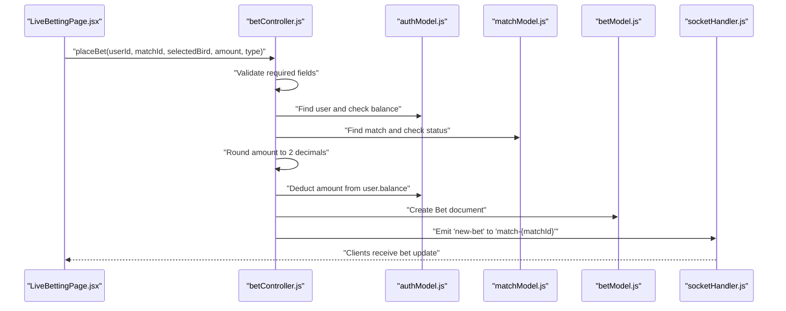
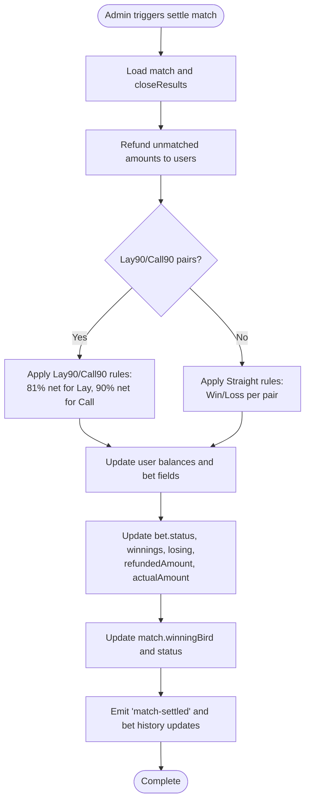
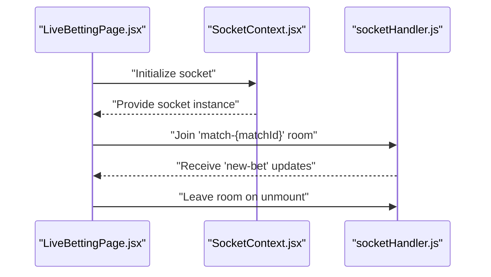
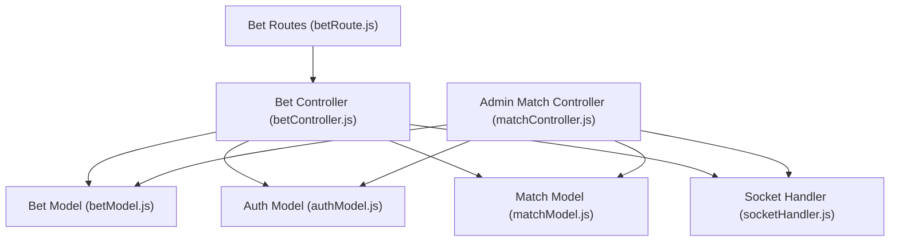

# Bet Model

<cite>
**Referenced Files in This Document**
- [betModel.js](file://server/models/betModel.js)
- [matchModel.js](file://server/models/matchModel.js)
- [authModel.js](file://server/models/authModel.js)
- [betController.js](file://server/controllers/bet/betController.js)
- [matchController.js](file://server/controllers/admin/matchController.js)
- [betRoute.js](file://server/routes/bet/betRoute.js)
- [socketHandler.js](file://server/socket/socketHandler.js)
- [LiveBettingPage.jsx](file://client/src/Pages/Bet/LiveBettingPage.jsx)
- [SocketContext.jsx](file://client/src/context/SocketContext.jsx)
</cite>

## Table of Contents
1. [Introduction](#introduction)
2. [Project Structure](#project-structure)
3. [Core Components](#core-components)
4. [Architecture Overview](#architecture-overview)
5. [Detailed Component Analysis](#detailed-component-analysis)
6. [Dependency Analysis](#dependency-analysis)
7. [Performance Considerations](#performance-considerations)
8. [Troubleshooting Guide](#troubleshooting-guide)
9. [Conclusion](#conclusion)

## Introduction
This document provides comprehensive documentation for the Bet Model schema and its ecosystem. It covers bet placement fields, relationships with authentication and match models, bet type classification (Straight, Lay90, Call90), bet outcome tracking, result settlement logic, profit/loss calculations, status management, settlement processing, historical record keeping, field validation, indexing for query performance, and real-time bet notifications via sockets. It also includes practical examples of bet placement, odds updates, result processing, and settlement workflows.

## Project Structure
The Bet Model resides in the server models and integrates with controllers, routes, and socket handlers. The client-side pages consume real-time updates and trigger bet placement actions.

**Diagram sources**
- [betModel.js](file://server/models/betModel.js#L1-L24)
- [matchModel.js](file://server/models/matchModel.js#L1-L101)
- [authModel.js](file://server/models/authModel.js#L1-L40)
- [betController.js](file://server/controllers/bet/betController.js#L1-L125)
- [matchController.js](file://server/controllers/admin/matchController.js#L1-L1188)
- [betRoute.js](file://server/routes/bet/betRoute.js#L1-L11)
- [socketHandler.js](file://server/socket/socketHandler.js#L1-L101)
- [LiveBettingPage.jsx](file://client/src/Pages/Bet/LiveBettingPage.jsx#L400-L599)
- [SocketContext.jsx](file://client/src/context/SocketContext.jsx#L1-L62)

**Section sources**
- [betModel.js](file://server/models/betModel.js#L1-L24)
- [matchModel.js](file://server/models/matchModel.js#L1-L101)
- [authModel.js](file://server/models/authModel.js#L1-L40)
- [betController.js](file://server/controllers/bet/betController.js#L1-L125)
- [matchController.js](file://server/controllers/admin/matchController.js#L1-L1188)
- [betRoute.js](file://server/routes/bet/betRoute.js#L1-L11)
- [socketHandler.js](file://server/socket/socketHandler.js#L1-L101)
- [LiveBettingPage.jsx](file://client/src/Pages/Bet/LiveBettingPage.jsx#L400-L599)
- [SocketContext.jsx](file://client/src/context/SocketContext.jsx#L1-L62)

## Core Components
- Bet Model: Defines the bet schema, relationships, and indexes.
- Match Model: Stores match metadata, status, and settlement results.
- Auth Model: Provides user identity and balance used during bet placement.
- Bet Controller: Handles bet placement, validation, user balance deduction, and real-time notifications.
- Admin Match Controller: Manages settlement, updates match status, and emits settlement events.
- Socket Handler: Initializes socket rooms and emits real-time events for clients.
- Client Pages: Validate inputs, submit bets, and render real-time updates.

Key schema highlights:
- Fields: user, matchId, matchTitle, selectedBird, amount, type, status, isRefunded, winnings, losing, refundedAmount, winningBird, actualAmount, timestamps.
- Enumerations: type includes Straight, Lay90, Call90; status includes Pending, Won, Lost, Refunded, Tie, Cancelled.
- Indexes: createdAt, (matchId, status), and others for performance.

**Section sources**
- [betModel.js](file://server/models/betModel.js#L3-L23)
- [matchModel.js](file://server/models/matchModel.js#L17-L96)
- [authModel.js](file://server/models/authModel.js#L3-L37)
- [betController.js](file://server/controllers/bet/betController.js#L42-L106)
- [matchController.js](file://server/controllers/admin/matchController.js#L1120-L1165)

## Architecture Overview
The Bet Model participates in a request-response flow for placing bets and a real-time event-driven flow for live updates. Settlement is handled by the admin controller, which updates match status and emits settlement events.

**Diagram sources**
- [LiveBettingPage.jsx](file://client/src/Pages/Bet/LiveBettingPage.jsx#L420-L517)
- [betController.js](file://server/controllers/bet/betController.js#L42-L106)
- [authModel.js](file://server/models/authModel.js#L1-L40)
- [matchModel.js](file://server/models/matchModel.js#L1-L101)
- [betModel.js](file://server/models/betModel.js#L1-L24)
- [socketHandler.js](file://server/socket/socketHandler.js#L58-L72)

## Detailed Component Analysis

### Bet Model Schema
The Bet Model defines the core structure for bets, including references to users and matches, bet type classification, and financial outcome fields.

- Relationships:
  - user references Auth.
  - matchId references Match.
- Enumerations:
  - type: Straight, Lay90, Call90.
  - status: Pending, Won, Lost, Refunded, Tie, Cancelled.
- Financial fields:
  - amount: staked amount.
  - actualAmount: settled matched amount.
  - winnings: total win credited.
  - losing: total loss debited.
  - refundedAmount: refund amount processed.
- Timestamps:
  - createdAt, updatedAt managed automatically.

**Diagram sources**
- [betModel.js](file://server/models/betModel.js#L3-L23)
- [authModel.js](file://server/models/authModel.js#L3-L37)
- [matchModel.js](file://server/models/matchModel.js#L17-L34)

**Section sources**
- [betModel.js](file://server/models/betModel.js#L3-L23)

### Bet Placement Workflow
This workflow covers validation, balance checks, bet creation, and real-time notification.

Validation and constraints:
- Required fields: matchId, selectedBird, amount, type, userId.
- Amount must be greater than zero.
- User must exist and have sufficient balance.
- Match must be Active.

Real-time notification:
- Emits to the match-specific room only.
- Uses socket rooms to avoid broadcasting to unrelated clients.

**Diagram sources**
- [betController.js](file://server/controllers/bet/betController.js#L42-L106)
- [authModel.js](file://server/models/authModel.js#L1-L40)
- [matchModel.js](file://server/models/matchModel.js#L1-L101)
- [socketHandler.js](file://server/socket/socketHandler.js#L58-L72)
- [LiveBettingPage.jsx](file://client/src/Pages/Bet/LiveBettingPage.jsx#L420-L517)

**Section sources**
- [betController.js](file://server/controllers/bet/betController.js#L42-L106)
- [LiveBettingPage.jsx](file://client/src/Pages/Bet/LiveBettingPage.jsx#L420-L517)

### Bet Outcome Tracking and Settlement Logic
Settlement is performed by the admin controller upon match closure. It updates bet statuses, credits/debits balances, and emits settlement events.

Settlement specifics:
- Lay90/Call90:
  - Lay risk is matched; Lay receives 81% net plus stake; Call receives 90% net plus stake.
  - Winner status set accordingly; actualAmount derived from closeResults.
- Straight:
  - Winner receives gross return plus stake; loser’s stake remains as loss.
- Tie/Cancelled:
  - Bets refunded; status reflects Tie or Cancelled; actualAmount reflects refunded amount.

**Diagram sources**
- [matchController.js](file://server/controllers/admin/matchController.js#L785-L1165)

**Section sources**
- [matchController.js](file://server/controllers/admin/matchController.js#L785-L1165)

### Profit/Loss Calculation and Historical Records
Profit/loss fields:
- winnings: cumulative credited wins per bet.
- losing: cumulative debits for losses per bet.
- refundedAmount: refunded portion of a bet.
- actualAmount: the matched amount used for settlement computations.

Historical records:
- Bet documents persist with timestamps and status changes.
- Settlement updates are broadcast to users via socket events and stored in bet documents.

**Section sources**
- [betModel.js](file://server/models/betModel.js#L11-L17)
- [matchController.js](file://server/controllers/admin/matchController.js#L980-L1121)

### Real-Time Bet Notifications and Socket Integration
Socket rooms:
- Clients join match-specific rooms to receive targeted updates.
- Admin and global rooms receive administrative and event-wide updates.

Client-side integration:
- Socket provider establishes persistent connections.
- Pages subscribe to rooms and listen for events to update UI in real time.

**Diagram sources**
- [socketHandler.js](file://server/socket/socketHandler.js#L6-L40)
- [SocketContext.jsx](file://client/src/context/SocketContext.jsx#L14-L54)
- [LiveBettingPage.jsx](file://client/src/Pages/Bet/LiveBettingPage.jsx#L400-L408)

**Section sources**
- [socketHandler.js](file://server/socket/socketHandler.js#L6-L40)
- [SocketContext.jsx](file://client/src/context/SocketContext.jsx#L14-L54)
- [LiveBettingPage.jsx](file://client/src/Pages/Bet/LiveBettingPage.jsx#L400-L408)

### Field Validation and Indexing
Field validation:
- Required fields enforced at controller level.
- Amount validated to be positive.
- User balance checked before deduction.
- Match status validated to be Active.

Indexing for query performance:
- Bet model indexes:
  - createdAt: descending for recent-first queries.
  - (matchId, status): composite index for efficient filtering by match and status.
- Match model indexes:
  - (topLevelMatch, section, round): for grouping rounds within sections.
  - status, createdAt: for status-based queries.
- Auth model indexes:
  - email, name, role, createdAt: for user lookups and analytics.

**Section sources**
- [betModel.js](file://server/models/betModel.js#L21-L22)
- [matchModel.js](file://server/models/matchModel.js#L94-L96)
- [authModel.js](file://server/models/authModel.js#L33-L37)
- [betController.js](file://server/controllers/bet/betController.js#L46-L58)

### Examples

#### Example 1: Bet Placement
- Input: userId, matchId, selectedBird, amount, type.
- Validation: fields present, amount > 0, user exists, user balance sufficient, match Active.
- Action: deduct amount from user.balance, create Bet document, emit 'new-bet' to match room.
- Output: success payload with bet details.

**Section sources**
- [betController.js](file://server/controllers/bet/betController.js#L42-L106)
- [LiveBettingPage.jsx](file://client/src/Pages/Bet/LiveBettingPage.jsx#L420-L517)

#### Example 2: Odds Updates and Live Feed
- Client joins match room and listens for 'new-bet'.
- On each bet placement, clients receive the latest bet payload and update the UI.

**Section sources**
- [socketHandler.js](file://server/socket/socketHandler.js#L58-L72)
- [LiveBettingPage.jsx](file://client/src/Pages/Bet/LiveBettingPage.jsx#L400-L408)

#### Example 3: Result Processing and Settlement
- Admin settles match with a winningBird or tie/cancelled.
- System refunds unmatched, applies Lay90/Call90 or Straight rules, updates user balances and bet fields, and emits settlement events.

**Section sources**
- [matchController.js](file://server/controllers/admin/matchController.js#L785-L1165)

## Dependency Analysis
The Bet Model depends on Auth and Match models. Controllers orchestrate validation, persistence, and real-time updates. Routes expose endpoints for bet operations. Socket handlers manage rooms and event broadcasting.

**Diagram sources**
- [betModel.js](file://server/models/betModel.js#L1-L24)
- [authModel.js](file://server/models/authModel.js#L1-L40)
- [matchModel.js](file://server/models/matchModel.js#L1-L101)
- [betController.js](file://server/controllers/bet/betController.js#L1-L125)
- [matchController.js](file://server/controllers/admin/matchController.js#L1-L1188)
- [betRoute.js](file://server/routes/bet/betRoute.js#L1-L11)
- [socketHandler.js](file://server/socket/socketHandler.js#L1-L101)

**Section sources**
- [betModel.js](file://server/models/betModel.js#L1-L24)
- [authModel.js](file://server/models/authModel.js#L1-L40)
- [matchModel.js](file://server/models/matchModel.js#L1-L101)
- [betController.js](file://server/controllers/bet/betController.js#L1-L125)
- [matchController.js](file://server/controllers/admin/matchController.js#L1-L1188)
- [betRoute.js](file://server/routes/bet/betRoute.js#L1-L11)
- [socketHandler.js](file://server/socket/socketHandler.js#L1-L101)

## Performance Considerations
- Use indexes on frequently queried fields:
  - Bet: createdAt, (matchId, status).
  - Match: (topLevelMatch, section, round), status, createdAt.
  - Auth: email, name, role, createdAt.
- Round amounts to two decimal places to prevent precision drift.
- Emit socket events only to relevant rooms to reduce bandwidth.
- Batch UI updates after receiving settlement events to minimize re-renders.

[No sources needed since this section provides general guidance]

## Troubleshooting Guide
Common issues and resolutions:
- Missing required fields: Ensure matchId, selectedBird, amount, type, userId are provided.
- Insufficient funds: Verify user.balance >= amount before bet placement.
- Match not Active: Confirm match.status is Active before accepting bets.
- Socket emit errors: Check socket initialization and room membership.
- Settlement discrepancies: Validate closeResults and bet.actualAmount alignment.

**Section sources**
- [betController.js](file://server/controllers/bet/betController.js#L46-L58)
- [socketHandler.js](file://server/socket/socketHandler.js#L93-L98)
- [matchController.js](file://server/controllers/admin/matchController.js#L785-L1165)

## Conclusion
The Bet Model schema provides a robust foundation for capturing bets, linking them to users and matches, and enabling real-time updates. Settlement logic supports both Straight and Lay90/Call90 bet types, with clear profit/loss tracking and refund mechanisms. Proper indexing and room-based socket communication ensure scalable and responsive performance. The documented workflows and examples offer practical guidance for implementing and maintaining the betting system.