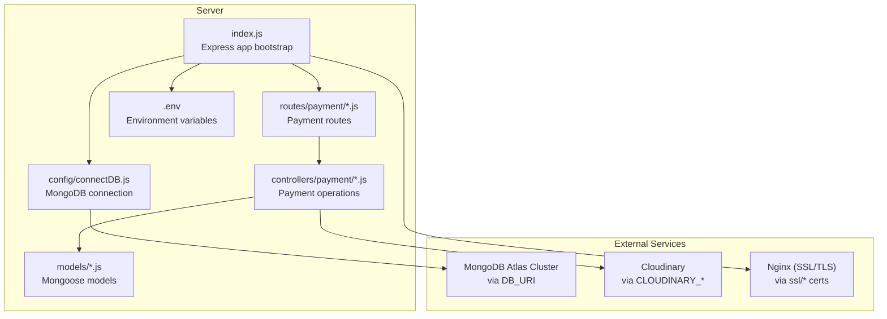
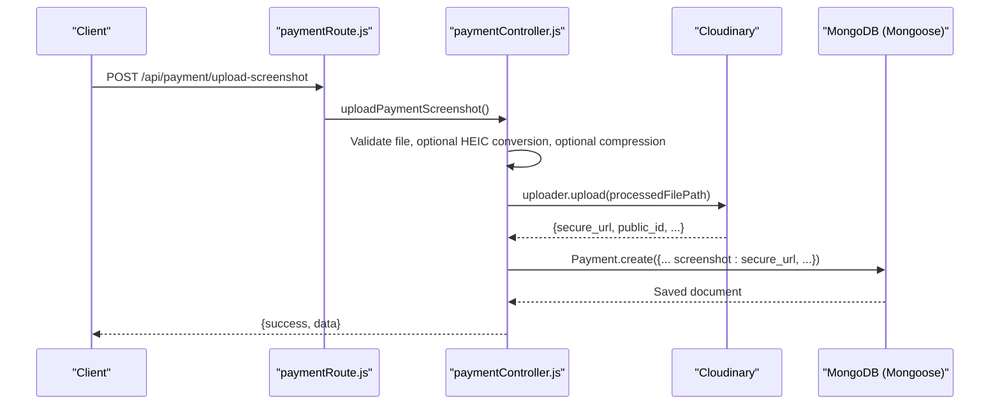
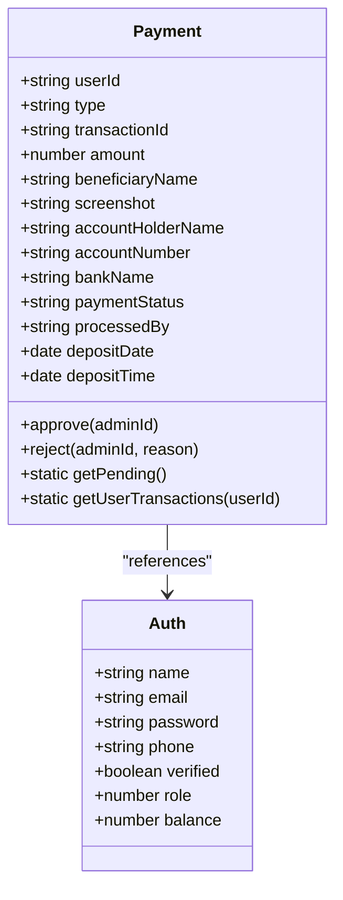
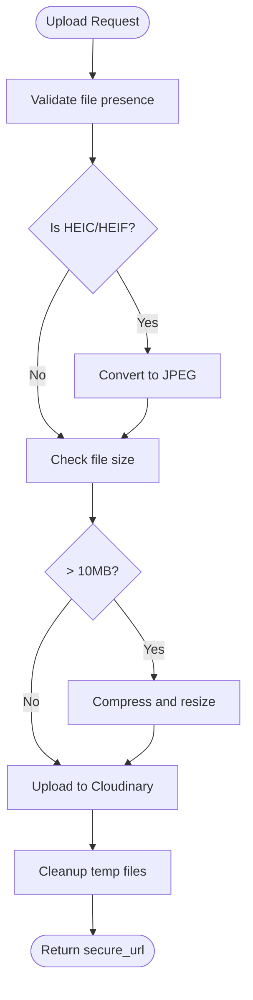
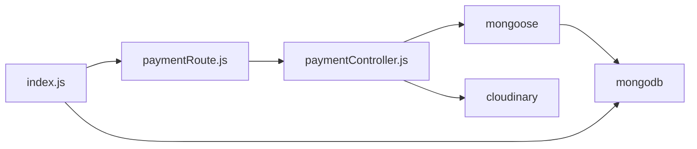

# Database Configuration

<cite>
**Referenced Files in This Document**
- [connectDB.js](file://server/config/connectDB.js)
- [cloudinary.js](file://server/config/cloudinary.js)
- [server/index.js](file://server/index.js)
- [paymentModel.js](file://server/models/paymentModel.js)
- [authModel.js](file://server/models/authModel.js)
- [paymentController.js](file://server/controllers/payment/paymentController.js)
- [paymentRoute.js](file://server/routes/payment/paymentRoute.js)
- [server/.env](file://server/.env)
- [client/.env](file://client/.env)
- [docker-compose.yml](file://docker-compose.yml)
- [nginx.conf](file://client/nginx.conf)
- [ssl/cert.pem](file://ssl/cert.pem)
- [ssl/privkey.pem](file://ssl/privkey.pem)
- [server/package.json](file://server/package.json)
</cite>

## Table of Contents
1. [Introduction](#introduction)
2. [Project Structure](#project-structure)
3. [Core Components](#core-components)
4. [Architecture Overview](#architecture-overview)
5. [Detailed Component Analysis](#detailed-component-analysis)
6. [Dependency Analysis](#dependency-analysis)
7. [Performance Considerations](#performance-considerations)
8. [Troubleshooting Guide](#troubleshooting-guide)
9. [Conclusion](#conclusion)
10. [Appendices](#appendices)

## Introduction
This document provides comprehensive guidance for database configuration and connection management in the Betting project. It covers MongoDB connection setup via Mongoose, connection pooling, environment variable configuration, SSL/TLS for transport security, and Cloudinary integration for storing payment screenshots. It also outlines environment-specific configurations for development, staging, and production, along with operational topics such as migration strategies, backups, monitoring, and best practices for various deployment scenarios.

## Project Structure
The database and storage configuration spans several areas:
- Database connection initialization and Mongoose options
- Environment variables for database URI and Cloudinary credentials
- Payment model and controller logic that persist and retrieve data
- Frontend SSL/TLS termination via Nginx and certificate management
- Docker Compose orchestration for production-like environments

**Diagram sources**
- [server/index.js](file://server/index.js#L1-L150)
- [server/config/connectDB.js](file://server/config/connectDB.js#L1-L17)
- [server/models/paymentModel.js](file://server/models/paymentModel.js#L1-L160)
- [server/controllers/payment/paymentController.js](file://server/controllers/payment/paymentController.js#L1-L868)
- [server/routes/payment/paymentRoute.js](file://server/routes/payment/paymentRoute.js#L1-L82)
- [server/.env](file://server/.env#L1-L44)
- [client/nginx.conf](file://client/nginx.conf#L1-L49)
- [ssl/cert.pem](file://ssl/cert.pem#L1-L49)
- [ssl/privkey.pem](file://ssl/privkey.pem#L1-L6)

**Section sources**
- [server/index.js](file://server/index.js#L1-L150)
- [server/config/connectDB.js](file://server/config/connectDB.js#L1-L17)
- [server/.env](file://server/.env#L1-L44)

## Core Components
- MongoDB connection via Mongoose with pool sizing and timeouts
- Environment-driven configuration for database URI and Cloudinary credentials
- Payment model with indexes and methods for transaction lifecycle
- Payment controller orchestrating screenshot upload to Cloudinary and persistence in MongoDB
- Frontend SSL/TLS termination with Nginx and certificate rotation support
- Docker Compose for production-like orchestration with health checks

Key implementation references:
- [MongoDB connection setup](file://server/config/connectDB.js#L3-L15)
- [Payment model schema and indexes](file://server/models/paymentModel.js#L3-L114)
- [Payment controller upload and Cloudinary integration](file://server/controllers/payment/paymentController.js#L11-L200)
- [Payment route bindings](file://server/routes/payment/paymentRoute.js#L24-L61)
- [Environment variables](file://server/.env#L1-L44)
- [Frontend SSL/TLS configuration](file://client/nginx.conf#L7-L16)
- [Certificate files](file://ssl/cert.pem#L1-L49), [private key](file://ssl/privkey.pem#L1-L6)
- [Docker Compose orchestration](file://docker-compose.yml#L1-L50)

**Section sources**
- [server/config/connectDB.js](file://server/config/connectDB.js#L1-L17)
- [server/models/paymentModel.js](file://server/models/paymentModel.js#L1-L160)
- [server/controllers/payment/paymentController.js](file://server/controllers/payment/paymentController.js#L1-L868)
- [server/routes/payment/paymentRoute.js](file://server/routes/payment/paymentRoute.js#L1-L82)
- [server/.env](file://server/.env#L1-L44)
- [client/nginx.conf](file://client/nginx.conf#L1-L49)
- [ssl/cert.pem](file://ssl/cert.pem#L1-L49)
- [ssl/privkey.pem](file://ssl/privkey.pem#L1-L6)
- [docker-compose.yml](file://docker-compose.yml#L1-L50)

## Architecture Overview
The system connects to MongoDB using Mongoose with explicit pool and timeout options. Payment operations involve:
- Uploading images to Cloudinary
- Persisting payment records in MongoDB
- Admin workflows for approvals and denials with transactional safety

**Diagram sources**
- [server/routes/payment/paymentRoute.js](file://server/routes/payment/paymentRoute.js#L24-L33)
- [server/controllers/payment/paymentController.js](file://server/controllers/payment/paymentController.js#L11-L200)
- [server/models/paymentModel.js](file://server/models/paymentModel.js#L37-L42)

## Detailed Component Analysis

### MongoDB Connection Setup and Pooling
- Connection is established at application startup and logs success or failure.
- Pooling and timeouts are configured via Mongoose connect options:
  - maxPoolSize: controls concurrency
  - serverSelectionTimeoutMS: controls cluster selection timeout
  - socketTimeoutMS: controls socket operation timeout
- On connection failure, the process exits to prevent running with an invalid state.

Operational implications:
- Adjust maxPoolSize according to expected concurrent operations.
- Tune serverSelectionTimeoutMS and socketTimeoutMS for network latency.
- Consider adding retry loops around initial connect in production deployments.

References:
- [Connection function](file://server/config/connectDB.js#L3-L15)
- [Startup invocation](file://server/index.js#L24-L25)

**Section sources**
- [server/config/connectDB.js](file://server/config/connectDB.js#L1-L17)
- [server/index.js](file://server/index.js#L24-L25)

### Mongoose ODM Implementation and Models
- Payment model defines fields for deposits and withdrawals, including references to the Auth model and indexes for performance.
- Methods and statics encapsulate common operations like approval/rejection and fetching pending transactions.
- Auth model stores user profiles and balances.

References:
- [Payment schema and indexes](file://server/models/paymentModel.js#L3-L114)
- [Payment methods/statics](file://server/models/paymentModel.js#L129-L151)
- [Auth schema and indexes](file://server/models/authModel.js#L3-L37)

**Diagram sources**
- [server/models/authModel.js](file://server/models/authModel.js#L3-L37)
- [server/models/paymentModel.js](file://server/models/paymentModel.js#L3-L151)

**Section sources**
- [server/models/paymentModel.js](file://server/models/paymentModel.js#L1-L160)
- [server/models/authModel.js](file://server/models/authModel.js#L1-L40)

### Connection Error Handling and Retry Mechanisms
- Current implementation logs the error and exits on connection failure.
- Recommended enhancements for production:
  - Implement exponential backoff retry loop around the connect call.
  - Use environment flags to enable/disable automatic retries.
  - Emit health events or metrics on repeated failures.

References:
- [Connection error handling](file://server/config/connectDB.js#L11-L14)

**Section sources**
- [server/config/connectDB.js](file://server/config/connectDB.js#L1-L17)

### Cloudinary Configuration for Image Storage
- Cloudinary is configured with environment variables for cloud name, API key, and API secret.
- Secure flag ensures HTTPS URLs.
- Payment controller uploads images to Cloudinary with transformations and chunked upload support.

References:
- [Cloudinary config](file://server/config/cloudinary.js#L3-L8)
- [Payment screenshot upload](file://server/controllers/payment/paymentController.js#L11-L200)
- [Cloudinary environment variables](file://server/.env#L18-L20)

**Diagram sources**
- [server/controllers/payment/paymentController.js](file://server/controllers/payment/paymentController.js#L11-L200)

**Section sources**
- [server/config/cloudinary.js](file://server/config/cloudinary.js#L1-L10)
- [server/controllers/payment/paymentController.js](file://server/controllers/payment/paymentController.js#L1-L868)
- [server/.env](file://server/.env#L18-L20)

### Environment Variable Configuration
- Database URI is loaded from DB_URI.
- Cloudinary credentials are loaded from CLOUDINARY_CLOUD_NAME, CLOUDINARY_API_KEY, CLOUDINARY_API_SECRET.
- Frontend base URL is configured via VITE_SERVER_BASE_URL.
- Production environment variables are commented out for staging/production overrides.

References:
- [Server .env](file://server/.env#L1-L44)
- [Client .env](file://client/.env#L1-L3)

**Section sources**
- [server/.env](file://server/.env#L1-L44)
- [client/.env](file://client/.env#L1-L3)

### Environment-Specific Configurations
- Development: Local MongoDB connection string and local Cloudinary credentials.
- Staging/Production: Override environment variables via Docker Compose and secrets management.
- Docker Compose sets NODE_ENV=production and exposes health checks for readiness.

References:
- [Docker Compose env injection](file://docker-compose.yml#L8-L15)
- [Health checks](file://docker-compose.yml#L20-L24)

**Section sources**
- [docker-compose.yml](file://docker-compose.yml#L1-L50)

### SSL/TLS Configuration and Security Considerations
- Frontend SSL/TLS termination via Nginx with TLSv1.2 and TLSv1.3 enabled.
- Certificates mounted from ssl/ directory.
- Renewal script automates certificate renewal and updates mounted files.
- Express app uses Helmet for security headers.

References:
- [Nginx SSL config](file://client/nginx.conf#L7-L16)
- [Renewal script](file://renew-ssl.sh#L1-L14)
- [Certificates](file://ssl/cert.pem#L1-L49), [private key](file://ssl/privkey.pem#L1-L6)
- [Helmet usage](file://server/index.js#L28-L31)

**Section sources**
- [client/nginx.conf](file://client/nginx.conf#L1-L49)
- [ssl/cert.pem](file://ssl/cert.pem#L1-L49)
- [ssl/privkey.pem](file://ssl/privkey.pem#L1-L6)
- [server/index.js](file://server/index.js#L28-L31)

### Database Migration Strategies
- Schema changes should be versioned and applied via a controlled migration script or tool.
- For MongoDB, consider using a migration framework that tracks applied migrations.
- Backward compatibility: ensure new fields are optional or have defaults until all documents are migrated.

[No sources needed since this section provides general guidance]

### Backup Procedures
- Use MongoDB Atlas backup or on-premises snapshot strategies.
- Store Cloudinary media under a dedicated folder and maintain metadata in MongoDB for auditability.
- Regularly export and test restore procedures for both databases.

[No sources needed since this section provides general guidance]

### Monitoring Setup
- Health endpoints: use the existing /api/health endpoint for liveness/readiness probes.
- Docker health checks: leverage compose healthcheck directives.
- Application logs: centralize logs and monitor for database connection errors and Cloudinary upload failures.

References:
- [Health endpoint](file://server/index.js#L82-L91)
- [Compose health checks](file://docker-compose.yml#L20-L24)

**Section sources**
- [server/index.js](file://server/index.js#L82-L91)
- [docker-compose.yml](file://docker-compose.yml#L20-L24)

## Dependency Analysis
- Mongoose depends on MongoDB driver and manages connection pooling.
- Payment controller depends on Cloudinary SDK and Mongoose models.
- Routes depend on controllers and middleware for authentication and file uploads.
- Docker Compose ties together backend and frontend with shared networking and health checks.

**Diagram sources**
- [server/package.json](file://server/package.json#L19-L37)
- [server/controllers/payment/paymentController.js](file://server/controllers/payment/paymentController.js#L1-L8)
- [server/routes/payment/paymentRoute.js](file://server/routes/payment/paymentRoute.js#L1-L18)
- [server/index.js](file://server/index.js#L1-L16)

**Section sources**
- [server/package.json](file://server/package.json#L19-L37)
- [server/controllers/payment/paymentController.js](file://server/controllers/payment/paymentController.js#L1-L8)
- [server/routes/payment/paymentRoute.js](file://server/routes/payment/paymentRoute.js#L1-L18)
- [server/index.js](file://server/index.js#L1-L16)

## Performance Considerations
- Connection pooling: adjust maxPoolSize based on workload and database capacity.
- Timeouts: tune serverSelectionTimeoutMS and socketTimeoutMS for your network conditions.
- Image processing: leverage Cloudinary transformations to reduce payload sizes; keep server-side conversions minimal.
- Indexes: ensure appropriate indexes exist for frequent queries (e.g., by status, type, and user).

[No sources needed since this section provides general guidance]

## Troubleshooting Guide
Common issues and resolutions:
- MongoDB connection fails:
  - Verify DB_URI correctness and network accessibility.
  - Check DNS resolution and firewall rules.
  - Review connection error logs and exit behavior.
- Cloudinary upload failures:
  - Confirm CLOUDINARY_* variables are set and valid.
  - Inspect upload timeouts and chunk sizes.
  - Validate file types and sizes.
- CORS and security headers:
  - Ensure origin lists match client URLs.
  - Review Helmet configuration for CSP and other headers.
- Health checks:
  - Use /api/health to validate service status.
  - Inspect Docker health check logs.

References:
- [Connection error handling](file://server/config/connectDB.js#L11-L14)
- [Cloudinary config](file://server/config/cloudinary.js#L3-L8)
- [CORS configuration](file://server/index.js#L34-L51)
- [Helmet configuration](file://server/index.js#L28-L31)
- [Health endpoint](file://server/index.js#L82-L91)

**Section sources**
- [server/config/connectDB.js](file://server/config/connectDB.js#L1-L17)
- [server/config/cloudinary.js](file://server/config/cloudinary.js#L1-L10)
- [server/index.js](file://server/index.js#L28-L51)
- [server/index.js](file://server/index.js#L82-L91)

## Conclusion
The Betting project integrates Mongoose for MongoDB connectivity, Cloudinary for image storage, and Nginx for SSL/TLS termination. Configuration relies heavily on environment variables, with Docker Compose enabling production-like deployments and health checks. For robust operations, augment connection handling with retry logic, implement structured migrations and backups, and monitor both application and infrastructure health.

[No sources needed since this section summarizes without analyzing specific files]

## Appendices

### Example: Establishing a Connection
- Import and call the connection function during app bootstrap.
- Ensure environment variables are present before startup.

References:
- [Connection function](file://server/config/connectDB.js#L3-L15)
- [Startup invocation](file://server/index.js#L24-L25)

**Section sources**
- [server/config/connectDB.js](file://server/config/connectDB.js#L1-L17)
- [server/index.js](file://server/index.js#L24-L25)

### Example: Error Handling Patterns
- Centralized try/catch around database operations.
- Graceful degradation for optional image processing steps.
- Comprehensive error logging with contextual details.

References:
- [Payment controller error handling](file://server/controllers/payment/paymentController.js#L163-L199)
- [Global error middleware](file://server/index.js#L110-L140)

**Section sources**
- [server/controllers/payment/paymentController.js](file://server/controllers/payment/paymentController.js#L163-L199)
- [server/index.js](file://server/index.js#L110-L140)

### Best Practices for Deployment Scenarios
- Development:
  - Use local MongoDB and sandbox Cloudinary settings.
  - Keep NODE_ENV unset or "development".
- Staging:
  - Mirror production traffic patterns with scaled resources.
  - Validate SSL/TLS and certificate renewal processes.
- Production:
  - Use managed MongoDB Atlas with automated backups.
  - Store secrets externally (e.g., environment files or secret managers).
  - Enforce strict health checks and auto-recovery.

[No sources needed since this section provides general guidance]