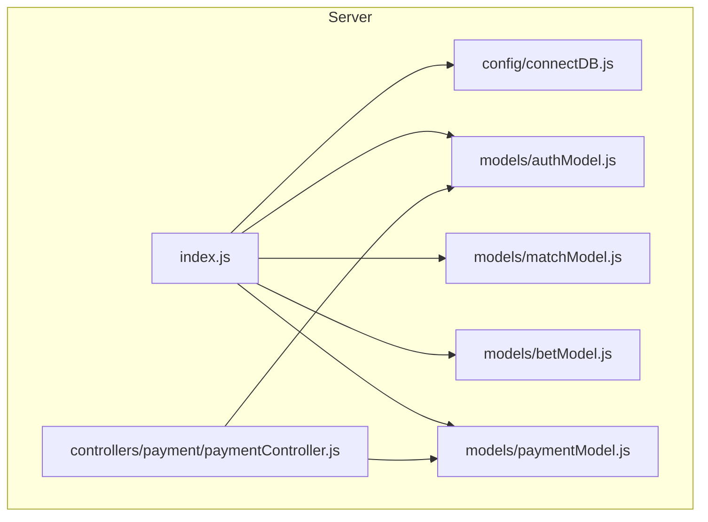
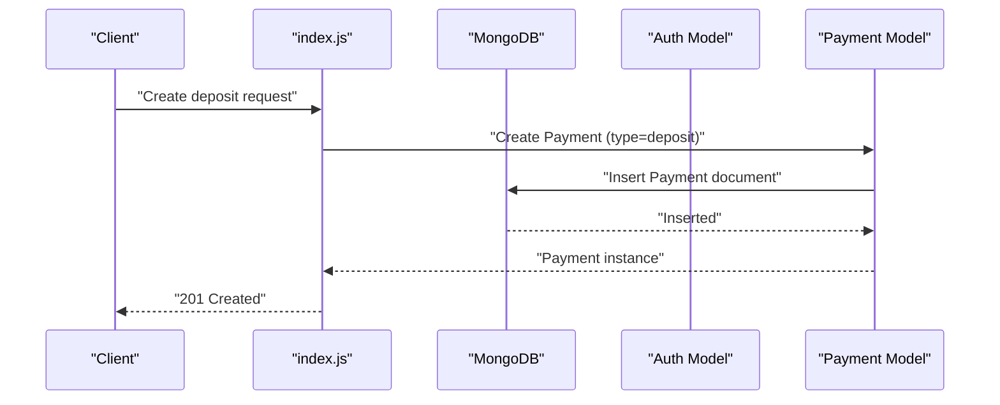
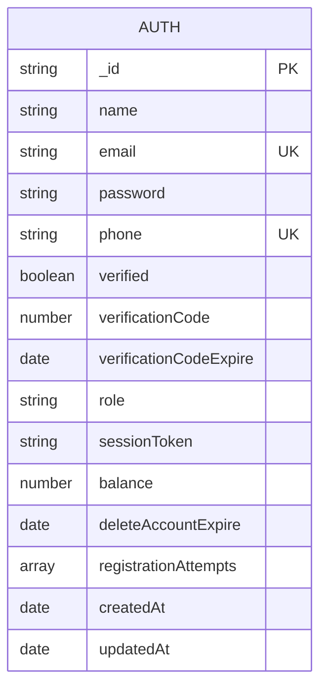
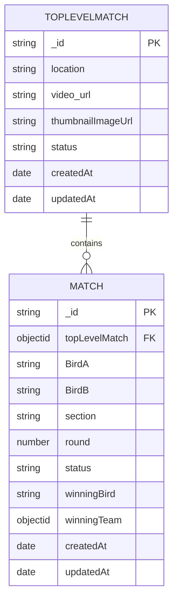
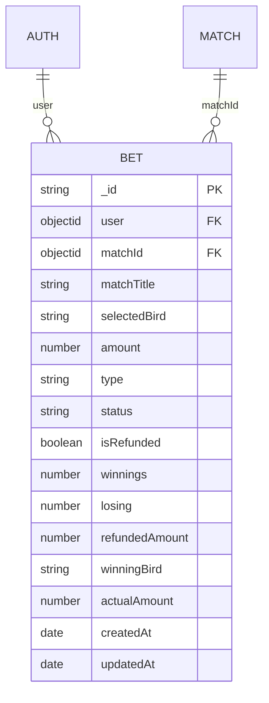
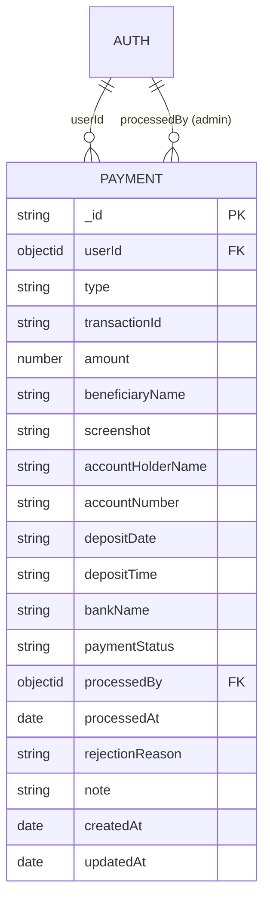
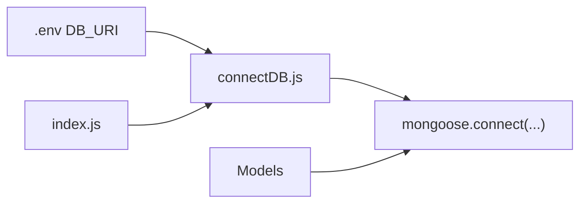

# Database Schema

<cite>
**Referenced Files in This Document**
- [authModel.js](file://server/models/authModel.js)
- [matchModel.js](file://server/models/matchModel.js)
- [betModel.js](file://server/models/betModel.js)
- [paymentModel.js](file://server/models/paymentModel.js)
- [connectDB.js](file://server/config/connectDB.js)
- [index.js](file://server/index.js)
- [paymentController.js](file://server/controllers/payment/paymentController.js)
- [.env](file://server/.env)
- [package.json](file://server/package.json)
</cite>

## Table of Contents
1. [Introduction](#introduction)
2. [Project Structure](#project-structure)
3. [Core Components](#core-components)
4. [Architecture Overview](#architecture-overview)
5. [Detailed Component Analysis](#detailed-component-analysis)
6. [Dependency Analysis](#dependency-analysis)
7. [Performance Considerations](#performance-considerations)
8. [Troubleshooting Guide](#troubleshooting-guide)
9. [Conclusion](#conclusion)
10. [Appendices](#appendices)

## Introduction
This document provides comprehensive database schema documentation for the betting platform. It covers the authentication model (user credentials, roles, balances, verification), match model (tournament brackets, teams, and betting odds), bet model (individual bets, stakes, selections, outcomes), and payment model (transactions, methods, and verification). It also documents the database connection configuration using Mongoose ODM, indexing strategies, query optimization, data relationships, validation rules, and operational considerations such as migrations, security, backups, and performance.

## Project Structure
The database layer is implemented using Mongoose ODM within the server-side models. The application connects to MongoDB via a centralized connection module and exposes routes that interact with these models. Environment variables define the database URI and other runtime configurations.

**Diagram sources**
- [index.js](file://server/index.js#L24-L25)
- [connectDB.js](file://server/config/connectDB.js#L3-L15)
- [authModel.js](file://server/models/authModel.js#L39-L39)
- [matchModel.js](file://server/models/matchModel.js#L98-L99)
- [betModel.js](file://server/models/betModel.js#L23-L23)
- [paymentModel.js](file://server/models/paymentModel.js#L158-L159)
- [paymentController.js](file://server/controllers/payment/paymentController.js#L1-L10)

**Section sources**
- [index.js](file://server/index.js#L24-L25)
- [connectDB.js](file://server/config/connectDB.js#L3-L15)
- [package.json](file://server/package.json#L19-L37)

## Core Components
This section outlines the four primary schemas and their core attributes, relationships, and validations.

- Authentication Model (Auth)
  - Purpose: Stores user credentials, roles, balances, verification metadata, and registration attempts.
  - Key fields: name, email (unique), password, phone (unique), verified, verificationCode, verificationCodeExpire, role (enum), sessionToken, balance, deleteAccountExpire, registrationAttempts[].
  - Indexes: email, name, role, createdAt desc.
  - Relationships: referenced by Payment.userId and Match.closeResults.userSummaries.userId.

- Match Model (TopLevelMatch and Match)
  - Purpose: Defines tournament-level metadata and per-round match details with bracket progression.
  - TopLevelMatch fields: location, video_url, thumbnailImageUrl, status (enum).
  - Match fields: topLevelMatch (refers to TopLevelMatch), BirdA/B, section (enum), round, status (enum), winningBird, closeResults (aggregated match data).
  - Indexes: TopLevelMatch: status, createdAt desc; Match: topLevelMatch, section, round; Match: status, createdAt desc.
  - Relationships: Match.topLevelMatch references TopLevelMatch; closeResults.bets.refers to Bet; closeResults.userSummaries.userId refers to Auth.

- Bet Model (Bet)
  - Purpose: Tracks individual bets placed by users against matches.
  - Fields: user (ref Auth), matchId (ref Match), matchTitle, selectedBird, amount, type (enum), status (enum), isRefunded, winnings, losing, refundedAmount, winningBird, actualAmount.
  - Indexes: createdAt desc, matchId, status.
  - Relationships: user references Auth; matchId references Match.

- Payment Model (Payment)
  - Purpose: Manages deposit and withdrawal requests with status tracking and admin actions.
  - Fields: userId (ref Auth), type (enum), transactionId (required for deposits), amount (min 0), beneficiaryName/screenshot (deposits), accountHolderName/accountNumber (withdrawals), depositDate/depositTime, bankName, paymentStatus (enum), processedBy (ref Auth), processedAt, rejectionReason, note, timestamps.
  - Indexes: userId, createdAt desc; paymentStatus; type, paymentStatus.
  - Methods: approve(), reject(); Statics: getPending(), getUserTransactions().
  - Relationships: userId references Auth; processedBy references Auth.

**Section sources**
- [authModel.js](file://server/models/authModel.js#L3-L39)
- [matchModel.js](file://server/models/matchModel.js#L3-L99)
- [betModel.js](file://server/models/betModel.js#L3-L23)
- [paymentModel.js](file://server/models/paymentModel.js#L3-L159)

## Architecture Overview
The application initializes the database connection during startup and exposes routes that operate on the models. Payments involve user balance updates and transaction logging. Matches maintain aggregated bet data for reporting and settlement.

**Diagram sources**
- [index.js](file://server/index.js#L24-L25)
- [paymentController.js](file://server/controllers/payment/paymentController.js#L341-L396)
- [paymentModel.js](file://server/models/paymentModel.js#L3-L159)

## Detailed Component Analysis

### Authentication Model
- Data types and constraints:
  - Strings for identifiers and enums for role/status.
  - Unique constraints on email and phone enforced at schema level.
  - Enumerations for role and verification-related fields.
  - Default values for booleans and numeric fields.
- Indexing:
  - Single-field indexes on email, name, role.
  - Compound index on createdAt desc for reverse chronological queries.
- Relationships:
  - Referenced by Payment.userId and Match.closeResults.userSummaries.userId.

**Diagram sources**
- [authModel.js](file://server/models/authModel.js#L3-L39)

**Section sources**
- [authModel.js](file://server/models/authModel.js#L3-L39)

### Match Model
- Data types and constraints:
  - ObjectId references for parent-child relationships.
  - Enums for status and section.
  - Nested arrays for closeResults aggregation (userSummaries, matchedPairs).
- Indexing:
  - TopLevelMatch: status, createdAt desc.
  - Match: topLevelMatch, section, round; status, createdAt desc.
- Pre-save hook:
  - Auto-increments round based on latest sibling match within the same topLevelMatch and section.

**Diagram sources**
- [matchModel.js](file://server/models/matchModel.js#L3-L99)

**Section sources**
- [matchModel.js](file://server/models/matchModel.js#L3-L99)

### Bet Model
- Data types and constraints:
  - Enumerations for type and status.
  - Numeric fields for amounts with defaults.
  - References to Auth and Match.
- Indexing:
  - createdAt desc for recent bets.
  - Compound index on matchId, status for filtering by match and outcome.

**Diagram sources**
- [betModel.js](file://server/models/betModel.js#L3-L23)
- [authModel.js](file://server/models/authModel.js#L39-L39)
- [matchModel.js](file://server/models/matchModel.js#L98-L99)

**Section sources**
- [betModel.js](file://server/models/betModel.js#L3-L23)

### Payment Model
- Data types and constraints:
  - Conditional required fields based on type (deposit vs withdrawal).
  - Amount min 0; note maxLength 500.
  - Enumerations for type and paymentStatus.
- Indexing:
  - userId, createdAt desc; paymentStatus; type, paymentStatus.
- Methods and statics:
  - approve(adminId) sets status to approved and populates processedBy/processedAt.
  - reject(adminId, reason) sets status to rejected and stores rejectionReason.
  - getPending() returns pending payments populated with user details.
  - getUserTransactions(userId) returns sorted transaction history.
- Controller usage:
  - Payment.create invoked for deposits and withdrawals.
  - Balance adjustments occur in payment approval/rejection flows.

**Diagram sources**
- [paymentModel.js](file://server/models/paymentModel.js#L3-L159)
- [authModel.js](file://server/models/authModel.js#L39-L39)

**Section sources**
- [paymentModel.js](file://server/models/paymentModel.js#L3-L159)
- [paymentController.js](file://server/controllers/payment/paymentController.js#L341-L464)
- [paymentController.js](file://server/controllers/payment/paymentController.js#L627-L744)

## Dependency Analysis
- Database connection:
  - Centralized in connectDB.js using mongoose.connect with pool and timeout options.
  - Called once at application startup in index.js.
- Environment configuration:
  - DB_URI loaded from .env and passed to mongoose.connect.
- Dependencies:
  - Mongoose ODM version 8.7.0 is declared in package.json.

**Diagram sources**
- [connectDB.js](file://server/config/connectDB.js#L3-L15)
- [index.js](file://server/index.js#L24-L25)
- [.env](file://server/.env#L3-L3)
- [package.json](file://server/package.json#L32-L32)

**Section sources**
- [connectDB.js](file://server/config/connectDB.js#L3-L15)
- [index.js](file://server/index.js#L24-L25)
- [.env](file://server/.env#L3-L3)
- [package.json](file://server/package.json#L32-L32)

## Performance Considerations
- Indexing strategy:
  - Auth: email, name, role, createdAt desc to support login, listing, and sorting.
  - Match: compound indexes for bracket navigation and status-based queries.
  - Bet: createdAt desc and matchId+status for efficient retrieval.
  - Payment: userId+createdAt desc, paymentStatus, type+paymentStatus for admin dashboards and filtering.
- Query optimization:
  - Use populate judiciously; avoid N+1 queries by batching population where possible.
  - Prefer compound indexes aligned with frequent filters (e.g., status, createdAt).
  - Limit projection to only required fields in paginated lists.
- Connection tuning:
  - Pool size and timeouts configured in connectDB.js to handle concurrent requests and long-running operations.
- Operational notes:
  - No explicit migration scripts observed in the repository; schema changes should be validated and tested carefully.

[No sources needed since this section provides general guidance]

## Troubleshooting Guide
- Connection failures:
  - Verify DB_URI correctness and network accessibility.
  - Review connection logs and error messages emitted by connectDB.js.
- Duplicate key errors:
  - Auth email and phone uniqueness constraints may cause insert conflicts; ensure validation before creation.
- Payment approvals:
  - Ensure transactions are pending before attempting approval/rejection.
  - Confirm user exists and balance adjustments align with type (deposit adds, withdrawal refunds).
- Logging and monitoring:
  - Application logs include request-level traces and global error handling; inspect logs for detailed error context.

**Section sources**
- [connectDB.js](file://server/config/connectDB.js#L3-L15)
- [authModel.js](file://server/models/authModel.js#L5-L8)
- [paymentController.js](file://server/controllers/payment/paymentController.js#L627-L744)

## Conclusion
The betting platform’s database layer is structured around four core models with clear relationships and targeted indexes. Mongoose ODM manages connections and document interactions, while controllers orchestrate business logic such as payment approvals and balance updates. The schema supports tournament-style matches, individual betting, and financial workflows with appropriate validations and enumerations. For production readiness, consider implementing formal migration tooling, comprehensive backup strategies, and continuous performance monitoring.

[No sources needed since this section summarizes without analyzing specific files]

## Appendices

### Schema Validation Rules and Constraints
- Auth
  - Required: name, email, password, phone, role.
  - Unique: email, phone.
  - Enum: role in ["admin", "user", "superadmin"].
  - Defaults: verified=false, balance=0, verificationCodeExpire now+10m.
- Match
  - Required: topLevelMatch, BirdA, BirdB, section, status.
  - Enum: section in ["sectionA", "sectionB"], status in ["Upcoming", "Active", "Completed", "Closed", "Cancelled", "Tie"].
  - Pre-save: auto-increment round per topLevelMatch and section.
- Bet
  - Required: user, matchId, selectedBird, amount, type.
  - Enum: type in ["Straight", "Lay90", "Call90"], status in ["Pending", "Won", "Lost", "Refunded", "Tie", "Cancelled"].
- Payment
  - Required: userId, type, amount, bankName.
  - Conditional required: transactionId, beneficiaryName, screenshot for deposits; accountHolderName, accountNumber for withdrawals.
  - Min: amount >= 0.
  - Enum: type in ["deposit", "withdrawal"], paymentStatus in ["pending", "approved", "rejected", "completed", "failed", "cancelled"].

**Section sources**
- [authModel.js](file://server/models/authModel.js#L5-L20)
- [matchModel.js](file://server/models/matchModel.js#L17-L33)
- [betModel.js](file://server/models/betModel.js#L5-L12)
- [paymentModel.js](file://server/models/paymentModel.js#L11-L98)

### Data Relationships Summary
- Auth ↔ Payment: One-to-many via userId.
- Auth ↔ Bet: One-to-many via user.
- Match ↔ Bet: One-to-many via matchId.
- TopLevelMatch ↔ Match: One-to-many via topLevelMatch.
- Match.closeResults.userSummaries.userId ↔ Auth: Reference for per-user aggregation.

**Section sources**
- [authModel.js](file://server/models/authModel.js#L39-L39)
- [matchModel.js](file://server/models/matchModel.js#L44-L46)
- [betModel.js](file://server/models/betModel.js#L5-L6)
- [paymentModel.js](file://server/models/paymentModel.js#L6-L10)

### Database Migration and Version Management
- Current state: No migration scripts or versioning files were identified in the repository.
- Recommendation: Introduce a migration framework (e.g., migrations directory with timestamped scripts) to track and apply schema changes safely across environments.

[No sources needed since this section provides general guidance]

### Data Security and Backup Strategies
- Security:
  - Enforce unique constraints on sensitive fields (email, phone).
  - Validate and sanitize inputs; leverage Mongoose validators.
  - Use HTTPS and secure headers via Helmet; configure CORS appropriately.
- Backups:
  - Schedule regular MongoDB backups using cloud provider tools or automated scripts.
  - Maintain offsite copies and test restore procedures periodically.

[No sources needed since this section provides general guidance]