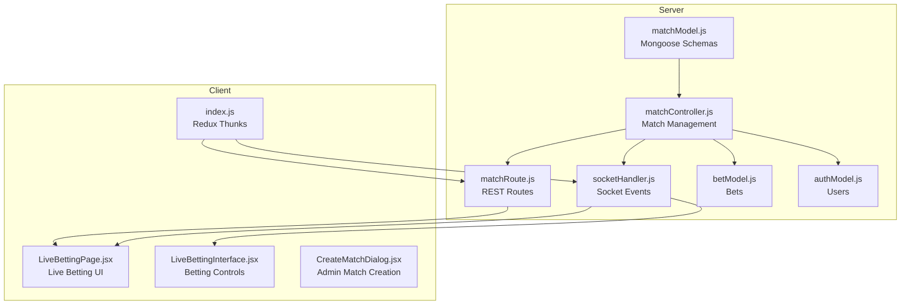
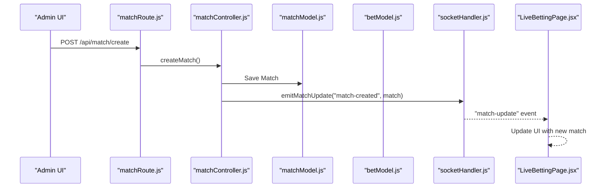
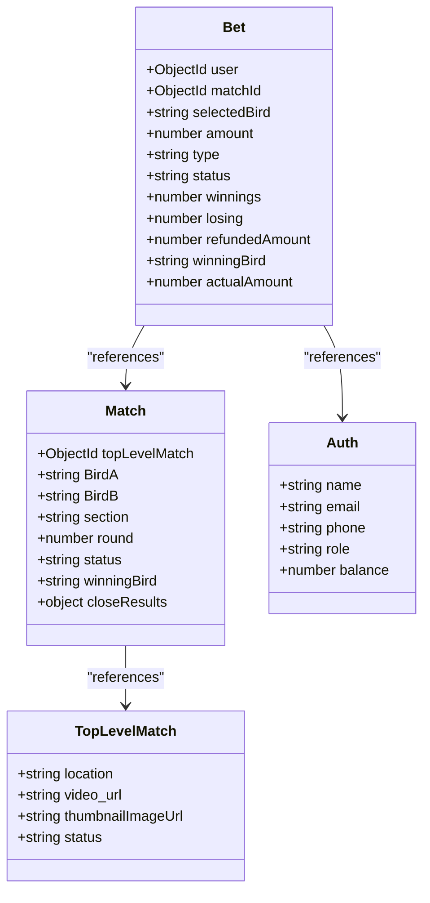

# Match Model

<cite>
**Referenced Files in This Document**
- [matchModel.js](file://server/models/matchModel.js)
- [matchController.js](file://server/controllers/admin/matchController.js)
- [matchRoute.js](file://server/routes/admin/matchRoute.js)
- [socketHandler.js](file://server/socket/socketHandler.js)
- [betModel.js](file://server/models/betModel.js)
- [authModel.js](file://server/models/authModel.js)
- [CreateMatchDialog.jsx](file://client/src/components/Admin/CreateMatchDialog.jsx)
- [LiveBettingPage.jsx](file://client/src/Pages/Bet/LiveBettingPage.jsx)
- [LiveBettingInterface.jsx](file://client/src/components/Bet/LiveBettingInterface.jsx)
- [index.js](file://client/src/store/user/match-and-bet-slice/index.js)
</cite>

## Table of Contents
1. [Introduction](#introduction)
2. [Project Structure](#project-structure)
3. [Core Components](#core-components)
4. [Architecture Overview](#architecture-overview)
5. [Detailed Component Analysis](#detailed-component-analysis)
6. [Dependency Analysis](#dependency-analysis)
7. [Performance Considerations](#performance-considerations)
8. [Troubleshooting Guide](#troubleshooting-guide)
9. [Conclusion](#conclusion)
10. [Appendices](#appendices)

## Introduction
This document provides comprehensive documentation for the Match Model schema and its ecosystem. It covers tournament structure with bracket systems, team information, match scheduling, venue details, betting odds management, live score tracking, match status enumeration, hierarchical structure for tournaments and groups, match result recording, winner determination logic, automatic progression mechanisms, field validation, indexing strategies, real-time update integration, and the relationship with betting operations and socket event broadcasting. It also includes practical examples of match creation, status updates, and live betting integration patterns.

## Project Structure
The Match Model is part of a full-stack betting application with separate server and client layers. The server exposes REST endpoints for match management and integrates with Socket.IO for real-time updates. The client consumes these APIs and renders live betting experiences with real-time updates.

**Diagram sources**
- [matchModel.js](file://server/models/matchModel.js#L1-L101)
- [matchController.js](file://server/controllers/admin/matchController.js#L1-L1188)
- [matchRoute.js](file://server/routes/admin/matchRoute.js#L1-L38)
- [socketHandler.js](file://server/socket/socketHandler.js#L1-L101)
- [betModel.js](file://server/models/betModel.js#L1-L24)
- [authModel.js](file://server/models/authModel.js#L1-L40)
- [LiveBettingPage.jsx](file://client/src/Pages/Bet/LiveBettingPage.jsx#L1-L943)
- [LiveBettingInterface.jsx](file://client/src/components/Bet/LiveBettingInterface.jsx#L1-L439)
- [CreateMatchDialog.jsx](file://client/src/components/Admin/CreateMatchDialog.jsx#L1-L122)
- [index.js](file://client/src/store/user/match-and-bet-slice/index.js#L1-L127)

**Section sources**
- [matchModel.js](file://server/models/matchModel.js#L1-L101)
- [matchController.js](file://server/controllers/admin/matchController.js#L1-L1188)
- [matchRoute.js](file://server/routes/admin/matchRoute.js#L1-L38)
- [socketHandler.js](file://server/socket/socketHandler.js#L1-L101)
- [LiveBettingPage.jsx](file://client/src/Pages/Bet/LiveBettingPage.jsx#L1-L943)
- [LiveBettingInterface.jsx](file://client/src/components/Bet/LiveBettingInterface.jsx#L1-L439)
- [CreateMatchDialog.jsx](file://client/src/components/Admin/CreateMatchDialog.jsx#L1-L122)
- [index.js](file://client/src/store/user/match-and-bet-slice/index.js#L1-L127)

## Core Components
- Top-Level Match (Tournament/Event): Represents a tournament or event with location, media, and status.
- Match (Bracket Round): Represents individual matches within a tournament, including teams, section, round, and status.
- Betting Integration: Bets are linked to matches and users, with settlement logic integrated into match settlement.
- Real-Time Updates: Socket.IO handles live updates for match status, bet placement, and settlement notifications.

Key schema fields and enumerations:
- Top-Level Match: location, video_url, thumbnailImageUrl, status (Upcoming, Active, Completed).
- Match: topLevelMatch (ref), BirdA, BirdB, section (sectionA, sectionB), round, status (Upcoming, Active, Completed, Closed, Cancelled, Tie), winningBird, closeResults (aggregated bet matching data).
- Bet: user (ref), matchId (ref), matchTitle, selectedBird, amount, type (Straight, Lay90, Call90), status (Pending, Won, Lost, Refunded, Tie, Cancelled), isRefunded, winnings, losing, refundedAmount, winningBird, actualAmount.

Validation and constraints:
- Required fields enforced at schema level.
- Unique constraints via MongoDB ObjectId references.
- Enumerations restrict status and bet type values.

**Section sources**
- [matchModel.js](file://server/models/matchModel.js#L3-L15)
- [matchModel.js](file://server/models/matchModel.js#L17-L75)
- [betModel.js](file://server/models/betModel.js#L3-L20)

## Architecture Overview
The system follows a layered architecture:
- Data Layer: Mongoose models define schemas and indexes.
- Business Logic Layer: Controllers orchestrate match lifecycle, status transitions, and settlement.
- API Layer: Express routes expose endpoints for match management.
- Real-Time Layer: Socket.IO manages rooms and emits events to clients.
- Presentation Layer: Client components render live betting and listen for updates.

**Diagram sources**
- [matchRoute.js](file://server/routes/admin/matchRoute.js#L28-L34)
- [matchController.js](file://server/controllers/admin/matchController.js#L282-L364)
- [matchModel.js](file://server/models/matchModel.js#L98-L99)
- [socketHandler.js](file://server/socket/socketHandler.js#L8-L31)
- [LiveBettingPage.jsx](file://client/src/Pages/Bet/LiveBettingPage.jsx#L297-L351)

## Detailed Component Analysis

### Match Schema and Indexing
The Match schema defines:
- Hierarchical relationship: Each match belongs to a Top-Level Match.
- Team representation: BirdA and BirdB represent competing teams.
- Section and round: Section A and B organize bracket rounds.
- Status lifecycle: Upcoming → Active → Closed → Completed/Tie/Cancelled.
- Close results aggregation: Stores bet matching summary for settlement.

Indexing strategy:
- Compound index on {topLevelMatch: 1, section: 1, round: 1} for efficient bracket queries.
- Compound index on {status: 1, createdAt: -1} for filtering and sorting by status and recency.

Round assignment:
- Pre-save hook automatically assigns the next round number based on the highest existing round in the same section.

**Section sources**
- [matchModel.js](file://server/models/matchModel.js#L17-L96)

### Top-Level Match Schema
Top-Level Match represents the tournament/event:
- Venue details: location, video_url, thumbnailImageUrl.
- Status lifecycle: Upcoming → Active → Completed.
- Nested matches: Populated in controller for listing.

**Section sources**
- [matchModel.js](file://server/models/matchModel.js#L3-L15)
- [matchController.js](file://server/controllers/admin/matchController.js#L366-L387)

### Match Lifecycle and Status Management
Endpoints:
- Create Match: Validates teams, prevents concurrent matches in the same section, and creates the match.
- Update Match Status: Validates transitions and triggers bet matching when closing.
- Settle Match: Processes settlement based on winner, distributes funds, and updates match status.

Status transitions:
- Allowed transitions: Upcoming → Active → Closed.
- Settlement requires Closed status and a valid winner (BirdA, BirdB, Tie, Cancelled).

Close logic:
- Collects all bets for the match.
- Validates presence of bets on both sides or Lay90/Call90 combinations.
- Builds queues for Straight, Lay90, and Call90 bets.
- Matches bets using FIFO across sides and bet types.
- Calculates user summaries and matched pairs for settlement.

Settlement logic:
- Tie/Cancelled: Refunds matched amounts to users.
- Straight bets: Distributes matched pool minus commission to winners.
- Lay90/Call90: Computes net outcomes based on bet types and sides.

Refund and balance updates:
- Unmatched amounts are refunded to user balances and bet records.

Socket emissions:
- Emits match updates to match room, event room, admin room, and globally.
- Emits bet history updates to users upon close and settlement.

**Section sources**
- [matchController.js](file://server/controllers/admin/matchController.js#L282-L364)
- [matchController.js](file://server/controllers/admin/matchController.js#L513-L901)
- [matchController.js](file://server/controllers/admin/matchController.js#L902-L1165)

### Betting Integration and Real-Time Updates
Bets:
- Linked to users and matches.
- Types: Straight, Lay90, Call90.
- Status tracking: Pending, Won, Lost, Refunded, Tie, Cancelled.

Socket events:
- Bet placed: Broadcasts to match room and admin room.
- Match updates: Broadcasts status changes, settlement results, and global updates.
- Bet history updates: Sends user-specific bet close/update notifications.

Client integration:
- LiveBettingPage listens for match and event updates, joins match and event rooms, and displays notifications.
- LiveBettingInterface fetches live bets, calculates stats, and updates UI in real-time.

**Section sources**
- [betModel.js](file://server/models/betModel.js#L3-L20)
- [socketHandler.js](file://server/socket/socketHandler.js#L58-L72)
- [LiveBettingPage.jsx](file://client/src/Pages/Bet/LiveBettingPage.jsx#L208-L408)
- [LiveBettingInterface.jsx](file://client/src/components/Bet/LiveBettingInterface.jsx#L110-L169)

### Tournament Structure and Bracket Systems
Hierarchical structure:
- Top-Level Match (tournament/event) contains multiple Matches.
- Matches are grouped by section (A and B) and ordered by round.
- Rounds are auto-incremented per section.

Bracket progression:
- Matches are created per section.
- Status transitions drive betting and settlement.
- Settlement determines winners and affects downstream progression logic.

**Section sources**
- [matchModel.js](file://server/models/matchModel.js#L77-L92)
- [matchController.js](file://server/controllers/admin/matchController.js#L282-L364)

### Venue Details and Media
Top-Level Match stores:
- location: Tournament venue.
- video_url: Stream URL.
- thumbnailImageUrl: Thumbnail for display.

These fields are used in the client to render live streams and venue information.

**Section sources**
- [matchModel.js](file://server/models/matchModel.js#L5-L7)
- [LiveBettingPage.jsx](file://client/src/Pages/Bet/LiveBettingPage.jsx#L612-L616)

### Field Validation and Constraints
Server-side validation:
- Required fields enforced in schemas.
- Enumerations restrict status and bet types.
- Controller-level checks prevent invalid operations (e.g., setting status to Completed directly).

Client-side validation:
- Amount limits, balance checks, and status checks in the betting interface.

**Section sources**
- [matchModel.js](file://server/models/matchModel.js#L18-L33)
- [matchController.js](file://server/controllers/admin/matchController.js#L286-L298)
- [LiveBettingInterface.jsx](file://client/src/components/Bet/LiveBettingInterface.jsx#L40-L48)

### Indexing Strategies for Performance
Indexes:
- Top-Level Match: {status: 1, createdAt: -1} for listing active/upcoming events.
- Match: {topLevelMatch: 1, section: 1, round: 1} for bracket queries.
- Match: {status: 1, createdAt: -1} for filtering by status.
- Bet: {matchId: 1, status: 1} and {createdAt: -1} for bet queries.

These indexes optimize:
- Listing tournaments by status.
- Finding matches by section and round.
- Filtering bets by match and status.
- Sorting bets by creation time.

**Section sources**
- [matchModel.js](file://server/models/matchModel.js#L94-L96)
- [betModel.js](file://server/models/betModel.js#L21-L22)

### Real-Time Update Integration
Rooms and events:
- Match room: "match-{matchId}" for per-match updates.
- Event room: "event-{eventId}" for tournament-wide updates.
- Admin room: "admin-room" for administrative notifications.
- Global events: "global-match-update", "global-event-created", "global-event-updated".

Client joins:
- LiveBettingPage joins match and event rooms and listens for updates.
- Leaves rooms on unmount to prevent memory leaks.

**Section sources**
- [socketHandler.js](file://server/socket/socketHandler.js#L6-L56)
- [LiveBettingPage.jsx](file://client/src/Pages/Bet/LiveBettingPage.jsx#L208-L408)

### Examples

#### Example: Match Creation
- Admin selects a Top-Level Match and section.
- Calls POST /api/match/create with BirdA, BirdB, topLevelMatchId, and section.
- Server validates inputs, prevents concurrent matches in the same section, saves the match, and emits "match-created" to relevant rooms.

**Section sources**
- [CreateMatchDialog.jsx](file://client/src/components/Admin/CreateMatchDialog.jsx#L27-L58)
- [matchRoute.js](file://server/routes/admin/matchRoute.js#L28-L34)
- [matchController.js](file://server/controllers/admin/matchController.js#L282-L364)

#### Example: Status Update and Bet Matching
- Admin updates match status to Closed.
- Server validates bets, builds queues, matches bets, calculates user summaries, and refunds unmatched amounts.
- Emits "status-changed" with matching results to users and admin.

**Section sources**
- [matchController.js](file://server/controllers/admin/matchController.js#L513-L901)

#### Example: Live Betting Integration
- Client joins match and event rooms.
- On bet placement, server broadcasts "new-bet" to match room and admin room.
- Client receives "new-bet" and "match-update" events to update UI and stats.

**Section sources**
- [socketHandler.js](file://server/socket/socketHandler.js#L58-L72)
- [LiveBettingPage.jsx](file://client/src/Pages/Bet/LiveBettingPage.jsx#L208-L408)
- [LiveBettingInterface.jsx](file://client/src/components/Bet/LiveBettingInterface.jsx#L110-L169)

## Dependency Analysis
The Match Model depends on:
- Mongoose for schema definition and indexing.
- Socket.IO for real-time communication.
- Bet and Auth models for settlement and user balances.
- Express routes for API exposure.

**Diagram sources**
- [matchModel.js](file://server/models/matchModel.js#L3-L75)
- [betModel.js](file://server/models/betModel.js#L3-L20)
- [authModel.js](file://server/models/authModel.js#L3-L32)

**Section sources**
- [matchModel.js](file://server/models/matchModel.js#L1-L101)
- [betModel.js](file://server/models/betModel.js#L1-L24)
- [authModel.js](file://server/models/authModel.js#L1-L40)

## Performance Considerations
- Use compound indexes for frequent queries (topLevelMatch+section+round, status+createdAt).
- Batch settlement operations to minimize database writes.
- Limit real-time listeners to necessary rooms to reduce overhead.
- Cache frequently accessed Top-Level Match metadata on the client.

## Troubleshooting Guide
Common issues and resolutions:
- Cannot close match: Ensure there are valid bets on both sides or Lay90/Call90 combinations.
- Settlement fails: Verify match is Closed and a valid winner is provided.
- Socket events not received: Confirm client joined correct rooms and listeners are attached.
- Duplicate matches in section: Server prevents concurrent matches; settle the existing match first.

**Section sources**
- [matchController.js](file://server/controllers/admin/matchController.js#L572-L577)
- [matchController.js](file://server/controllers/admin/matchController.js#L926-L931)
- [LiveBettingPage.jsx](file://client/src/Pages/Bet/LiveBettingPage.jsx#L208-L408)

## Conclusion
The Match Model provides a robust foundation for tournament-style betting with clear status lifecycles, automated round assignment, comprehensive bet matching, and seamless real-time updates. Its design supports scalable bracket structures, efficient querying through strategic indexing, and a responsive client experience through Socket.IO integration.

## Appendices

### API Definitions
- Create Match: POST /api/match/create
- Update Match Status: PUT /api/match/:matchId/status
- Settle Match: POST /api/match/:matchId/settle
- Get Matches by Top-Level: GET /api/match/:topLevelMatchId/match-a-b
- Get Top-Level Matches: GET /api/match/top-level
- Get Match by ID: GET /api/match/:matchId

**Section sources**
- [matchRoute.js](file://server/routes/admin/matchRoute.js#L1-L38)