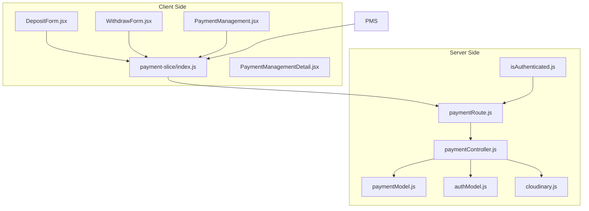
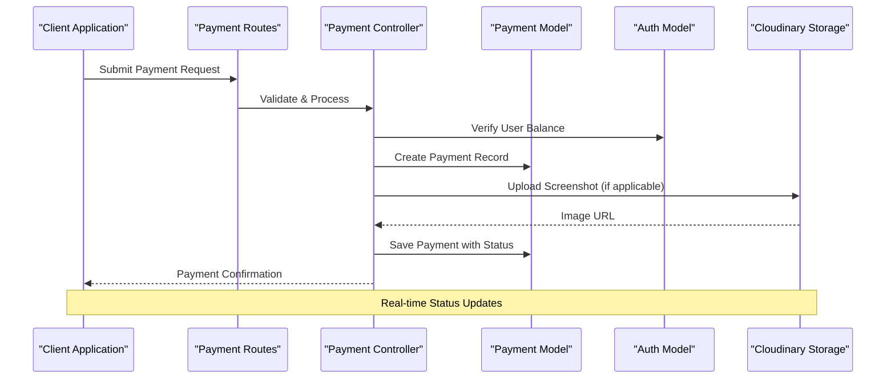
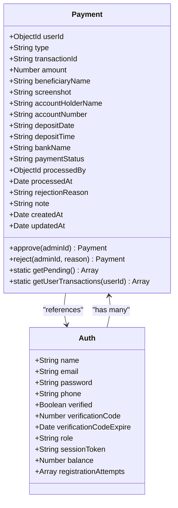
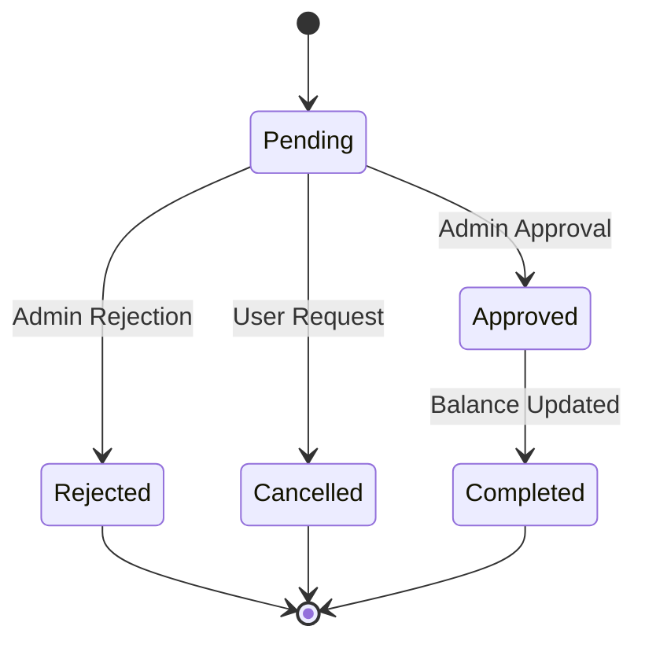
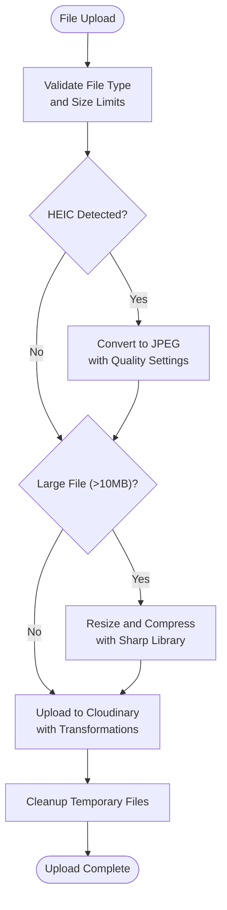
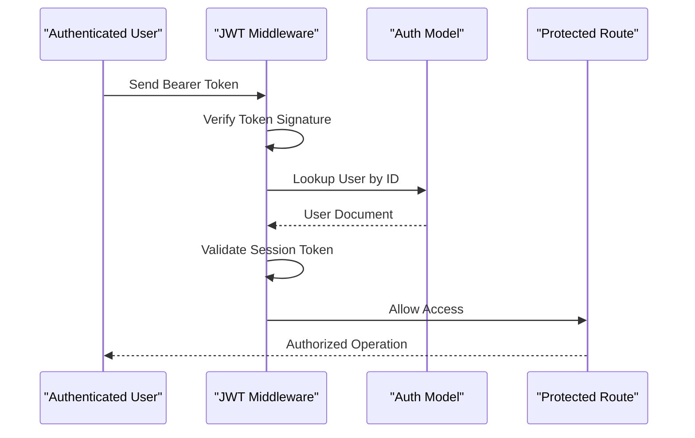
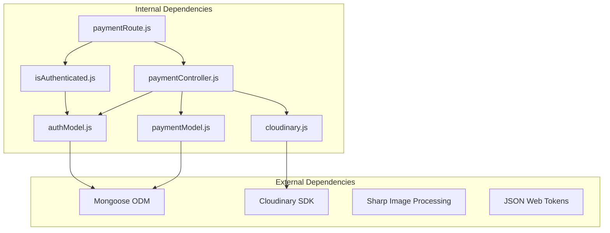

# Payment Model

<cite>
**Referenced Files in This Document**
- [paymentModel.js](file://server/models/paymentModel.js)
- [paymentController.js](file://server/controllers/payment/paymentController.js)
- [paymentRoute.js](file://server/routes/payment/paymentRoute.js)
- [cloudinary.js](file://server/config/cloudinary.js)
- [authModel.js](file://server/models/authModel.js)
- [isAuthenticated.js](file://server/middleware/isAuthenticated.js)
- [DepositForm.jsx](file://client/src/components/User/walletComponent/DepositForm.jsx)
- [WithdrawForm.jsx](file://client/src/components/User/walletComponent/WithdrawForm.jsx)
- [payment-slice/index.js](file://client/src/store/user/payment-slice/index.js)
- [PaymentManagement.jsx](file://client/src/Pages/adminPage/PaymentManagement.jsx)
- [PaymentManagementDetail.jsx](file://client/src/components/Admin/PaymentManagementDetail.jsx)
</cite>

## Table of Contents
1. [Introduction](#introduction)
2. [Project Structure](#project-structure)
3. [Core Components](#core-components)
4. [Architecture Overview](#architecture-overview)
5. [Detailed Component Analysis](#detailed-component-analysis)
6. [Dependency Analysis](#dependency-analysis)
7. [Performance Considerations](#performance-considerations)
8. [Troubleshooting Guide](#troubleshooting-guide)
9. [Conclusion](#conclusion)

## Introduction
This document provides comprehensive documentation for the Payment Model schema and associated payment processing system. It covers transaction types (deposit, withdrawal), amount tracking, payment method specifications, verification workflows, authentication integration, Cloudinary image storage for payment screenshots, payment status management, approval workflows, audit trail requirements, field validation, indexing strategies, transaction history tracking, integration with payment processing systems, real-time status updates, approval/rejection workflows, admin oversight processes, and financial reporting capabilities.

## Project Structure
The payment system spans both backend and frontend components with clear separation of concerns:

**Diagram sources**
- [paymentRoute.js](file://server/routes/payment/paymentRoute.js#L1-L82)
- [paymentController.js](file://server/controllers/payment/paymentController.js#L1-L868)
- [paymentModel.js](file://server/models/paymentModel.js#L1-L160)
- [authModel.js](file://server/models/authModel.js#L1-L40)
- [isAuthenticated.js](file://server/middleware/isAuthenticated.js#L1-L62)
- [cloudinary.js](file://server/config/cloudinary.js#L1-L10)

**Section sources**
- [paymentRoute.js](file://server/routes/payment/paymentRoute.js#L1-L82)
- [paymentController.js](file://server/controllers/payment/paymentController.js#L1-L868)
- [paymentModel.js](file://server/models/paymentModel.js#L1-L160)

## Core Components
The payment system consists of several key components working together to provide a complete financial transaction solution:

### Payment Schema
The Payment model defines the core structure for all financial transactions with comprehensive validation and relationships.

### Payment Controllers
Controllers handle business logic for payment operations including creation, approval, rejection, and administrative functions.

### Frontend Forms and State Management
React components provide user interfaces for deposit and withdrawal operations with Redux state management for seamless user experience.

### Authentication and Authorization
Middleware ensures secure access to payment operations with role-based permissions for administrative functions.

**Section sources**
- [paymentModel.js](file://server/models/paymentModel.js#L1-L160)
- [paymentController.js](file://server/controllers/payment/paymentController.js#L1-L868)
- [authModel.js](file://server/models/authModel.js#L1-L40)
- [isAuthenticated.js](file://server/middleware/isAuthenticated.js#L1-L62)

## Architecture Overview
The payment system follows a layered architecture with clear separation between presentation, business logic, and data persistence layers:

**Diagram sources**
- [paymentRoute.js](file://server/routes/payment/paymentRoute.js#L24-L61)
- [paymentController.js](file://server/controllers/payment/paymentController.js#L341-L464)
- [paymentModel.js](file://server/models/paymentModel.js#L1-L160)
- [cloudinary.js](file://server/config/cloudinary.js#L1-L10)

## Detailed Component Analysis

### Payment Model Schema
The Payment model serves as the foundation for all financial transactions with comprehensive field definitions and validation rules.

**Diagram sources**
- [paymentModel.js](file://server/models/paymentModel.js#L3-L158)
- [authModel.js](file://server/models/authModel.js#L3-L39)

#### Transaction Types and Validation
The system supports two primary transaction types with specific validation requirements:

**Deposit Transactions:**
- Require beneficiary name, transaction ID, and screenshot
- Minimum amount: $100
- Additional fields: deposit date and time
- Bank name is mandatory

**Withdrawal Transactions:**
- Require account holder name, account number, and bank name
- Minimum amount: $500
- No screenshot required
- Bank name is mandatory

#### Payment Status Management
The system implements a comprehensive status lifecycle:

**Diagram sources**
- [paymentModel.js](file://server/models/paymentModel.js#L74-L78)

#### Field Validation and Constraints
The schema enforces strict validation rules:
- Required fields vary by transaction type
- Amount fields have minimum value constraints
- Enumerated status values prevent invalid states
- String length limits prevent excessive data storage
- Timestamps automatically managed by Mongoose

**Section sources**
- [paymentModel.js](file://server/models/paymentModel.js#L11-L114)

### Payment Controller Operations
The controller layer implements comprehensive business logic for payment operations:

#### User Operations
- **Deposit Creation**: Validates amount, collects beneficiary details, and creates pending payment records
- **Withdrawal Processing**: Checks user balance, validates bank details, and reserves funds
- **Transaction History**: Provides paginated access to user payment history with filtering

#### Administrative Operations
- **Approval Workflow**: Processes pending payments with database transaction support
- **Rejection Workflow**: Handles rejected payments with automatic fund restoration
- **Statistics Reporting**: Aggregates payment data for administrative dashboards

#### Cloudinary Integration
The system integrates with Cloudinary for secure image storage and optimization:

**Diagram sources**
- [paymentController.js](file://server/controllers/payment/paymentController.js#L11-L200)

**Section sources**
- [paymentController.js](file://server/controllers/payment/paymentController.js#L341-L868)

### Frontend Integration
The client-side implementation provides intuitive user interfaces for payment operations:

#### Deposit Form Features
- Multi-language support (Spanish/English)
- Real-time form validation
- File upload with progress tracking
- Bank information display
- Date/time selection components

#### Withdrawal Form Features
- Balance-aware amount limiting
- Bank account validation
- Real-time availability display
- Form submission handling

#### State Management
Redux slices handle asynchronous operations with proper error handling and loading states.

**Section sources**
- [DepositForm.jsx](file://client/src/components/User/walletComponent/DepositForm.jsx#L1-L329)
- [WithdrawForm.jsx](file://client/src/components/User/walletComponent/WithdrawForm.jsx#L1-L118)
- [payment-slice/index.js](file://client/src/store/user/payment-slice/index.js#L1-L344)

### Authentication and Authorization
The system implements robust security measures:

**Diagram sources**
- [isAuthenticated.js](file://server/middleware/isAuthenticated.js#L3-L49)
- [authModel.js](file://server/models/authModel.js#L21-L22)

**Section sources**
- [isAuthenticated.js](file://server/middleware/isAuthenticated.js#L1-L62)
- [authModel.js](file://server/models/authModel.js#L1-L40)

## Dependency Analysis
The payment system exhibits well-structured dependencies with clear separation of concerns:

**Diagram sources**
- [paymentController.js](file://server/controllers/payment/paymentController.js#L1-L8)
- [paymentModel.js](file://server/models/paymentModel.js#L1)
- [authModel.js](file://server/models/authModel.js#L1)
- [isAuthenticated.js](file://server/middleware/isAuthenticated.js#L1)
- [cloudinary.js](file://server/config/cloudinary.js#L1)

### Indexing Strategy
The payment model implements strategic indexing for optimal query performance:

| Index | Purpose | Query Pattern |
|-------|---------|---------------|
| `{userId: 1, createdAt: -1}` | User transaction history | User-specific queries sorted by recency |
| `{paymentStatus: 1}` | Status-based filtering | Admin dashboard and reporting |
| `{type: 1, paymentStatus: 1}` | Transaction type analysis | Financial reporting and analytics |

**Section sources**
- [paymentModel.js](file://server/models/paymentModel.js#L116-L119)

## Performance Considerations
The system incorporates several performance optimization strategies:

### Image Processing Pipeline
- HEIC to JPEG conversion for universal compatibility
- Automatic compression for large files (>10MB)
- Cloudinary transformation for responsive image delivery
- Chunked upload support for large files

### Database Optimization
- Strategic indexing reduces query times
- Aggregation pipelines minimize database round trips
- Population strategies optimize relationship queries

### Caching and CDN
- Cloudinary CDN for global image delivery
- Client-side caching for frequently accessed data
- Efficient pagination for large datasets

## Troubleshooting Guide

### Common Issues and Solutions

**Upload Failures**
- Large file sizes exceeding 20MB
- Unsupported file formats (non-image files)
- Network timeouts during upload
- HEIC conversion failures

**Validation Errors**
- Insufficient balance for withdrawals
- Missing required fields in forms
- Invalid amount ranges
- Authentication token expiration

**Database Issues**
- Duplicate transaction IDs
- Index conflicts
- Population errors
- Transaction rollback scenarios

### Error Handling Patterns
The system implements comprehensive error handling:
- Specific HTTP status codes for different error types
- Detailed error messages for debugging
- Graceful degradation for partial failures
- Logging for audit trail purposes

**Section sources**
- [paymentController.js](file://server/controllers/payment/paymentController.js#L163-L199)
- [paymentController.js](file://server/controllers/payment/paymentController.js#L495-L502)

## Conclusion
The Payment Model schema provides a robust foundation for financial transactions with comprehensive validation, security, and operational features. The system successfully integrates user-friendly interfaces with secure backend processing, real-time status updates, and administrative oversight capabilities. The modular architecture supports future enhancements while maintaining data integrity and user experience standards.

Key strengths of the implementation include:
- Comprehensive field validation and business rule enforcement
- Secure authentication and authorization mechanisms
- Scalable image processing and storage solutions
- Flexible status management with audit trail capabilities
- Real-time administrative oversight and reporting
- Performance-optimized database design with strategic indexing

The system provides a solid foundation for financial operations while maintaining extensibility for future requirements such as additional payment methods, advanced reporting features, and integration with external payment processors.