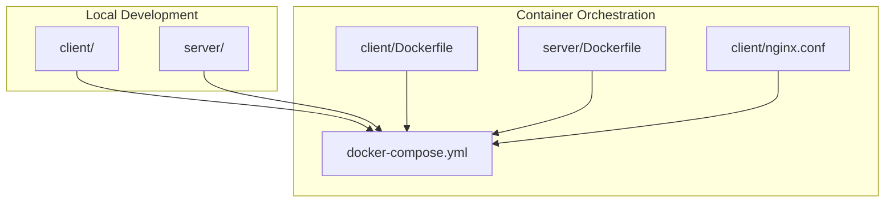
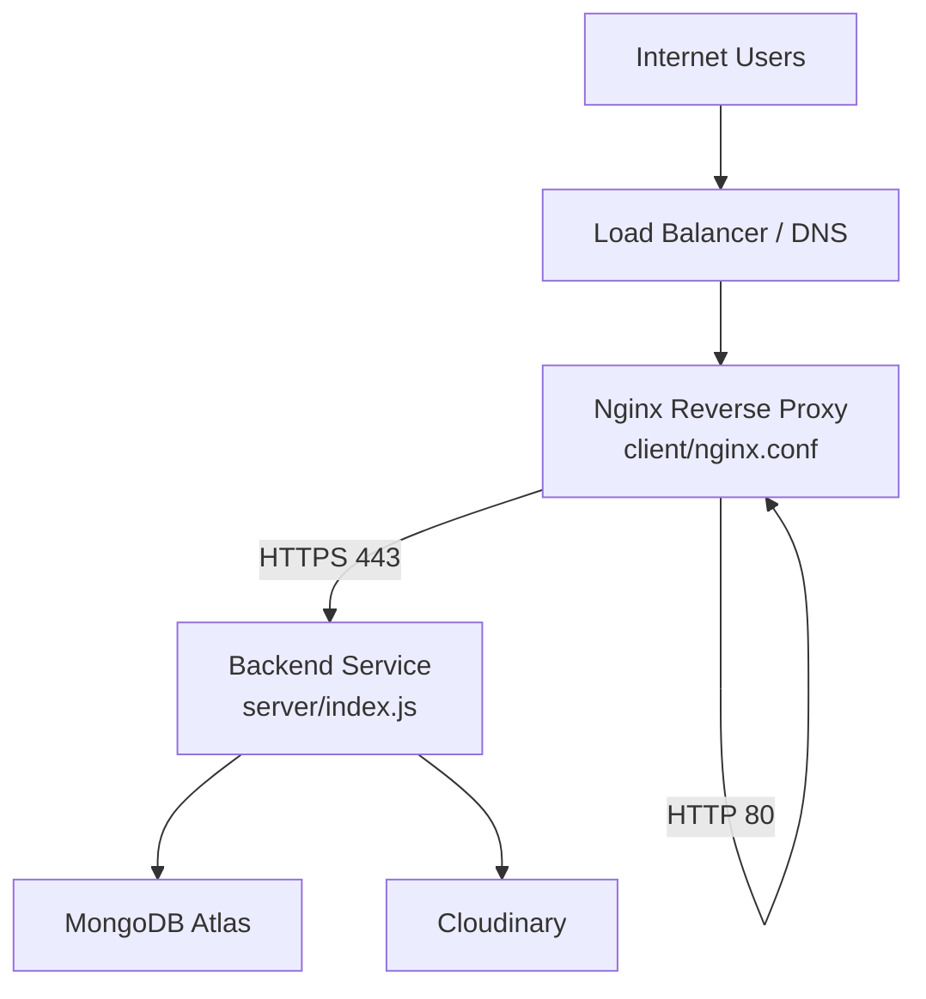
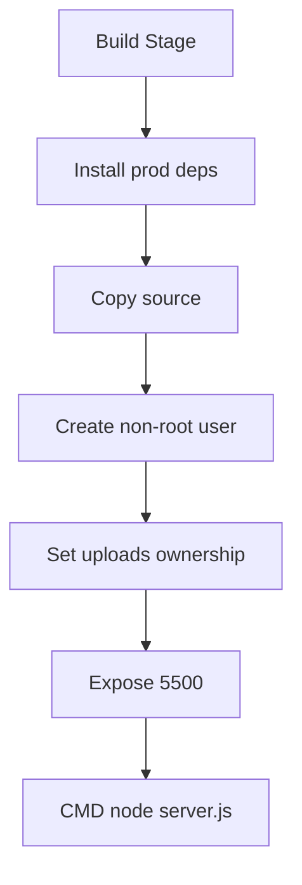
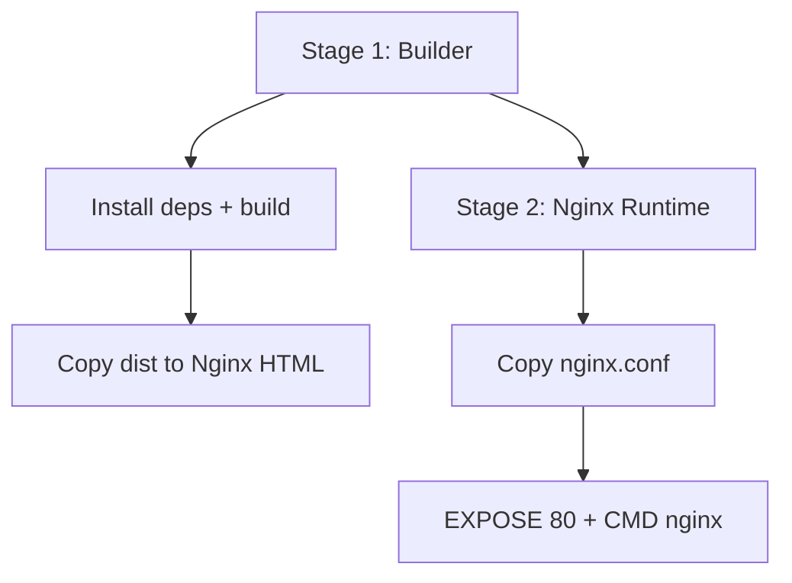
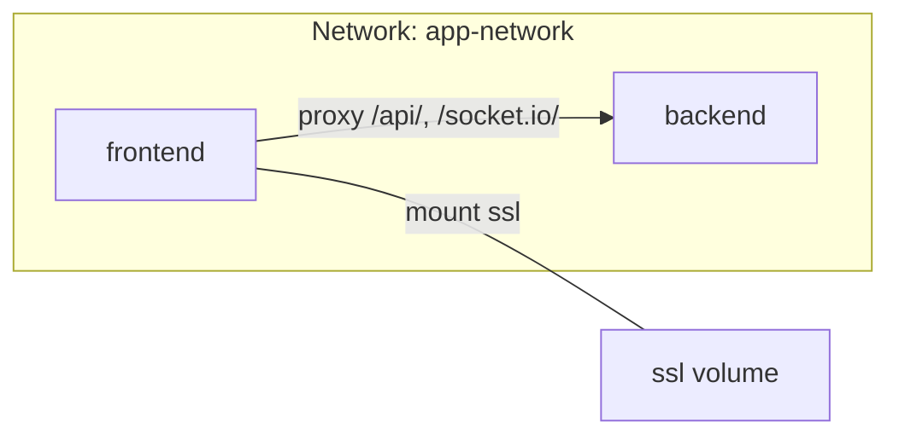
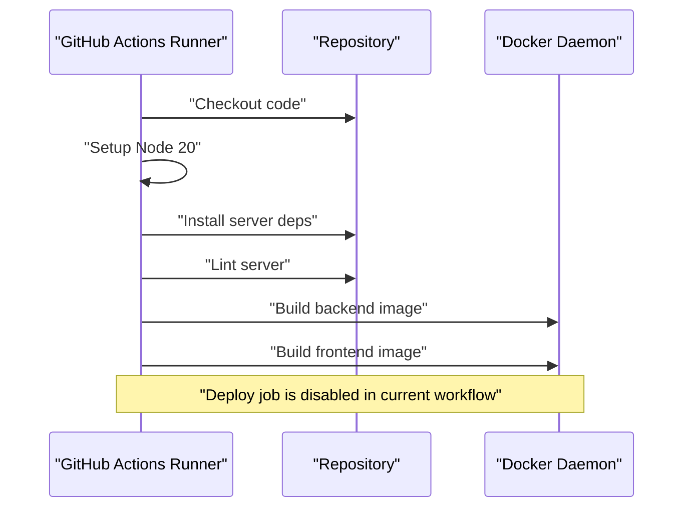
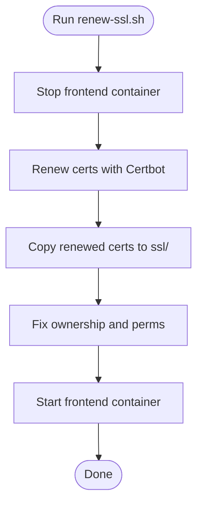
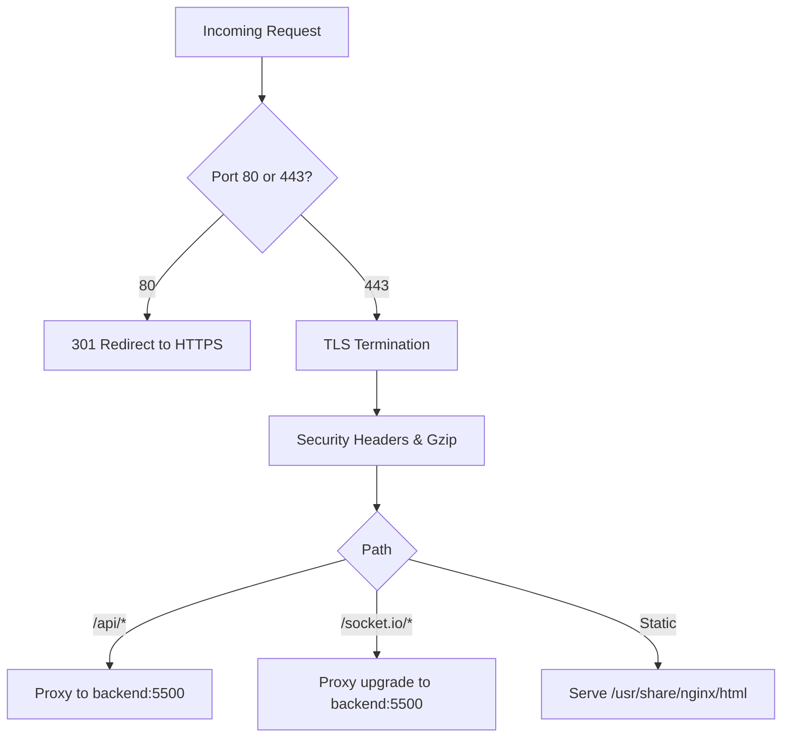
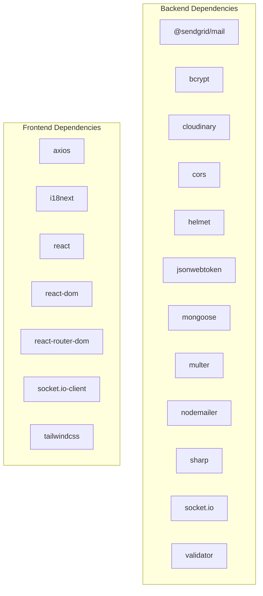

# Deployment and DevOps

<cite>
**Referenced Files in This Document**
- [docker-compose.yml](file://docker-compose.yml)
- [ci.yml](file://.github/workflows/ci.yml)
- [client/Dockerfile](file://client/Dockerfile)
- [server/Dockerfile](file://server/Dockerfile)
- [client/nginx.conf](file://client/nginx.conf)
- [server/index.js](file://server/index.js)
- [server/config/cloudinary.js](file://server/config/cloudinary.js)
- [server/config/connectDB.js](file://server/config/connectDB.js)
- [client/.env](file://client/.env)
- [server/.env](file://server/.env)
- [renew-ssl.sh](file://renew-ssl.sh)
- [client/package.json](file://client/package.json)
- [server/package.json](file://server/package.json)
</cite>

## Table of Contents
1. [Introduction](#introduction)
2. [Project Structure](#project-structure)
3. [Core Components](#core-components)
4. [Architecture Overview](#architecture-overview)
5. [Detailed Component Analysis](#detailed-component-analysis)
6. [Dependency Analysis](#dependency-analysis)
7. [Performance Considerations](#performance-considerations)
8. [Troubleshooting Guide](#troubleshooting-guide)
9. [Conclusion](#conclusion)
10. [Appendices](#appendices)

## Introduction
This document provides comprehensive deployment and DevOps guidance for the Betting application. It covers containerization strategies for frontend and backend, docker-compose orchestration, CI/CD with GitHub Actions, SSL certificate management (manual and renewal), production environment setup via Nginx reverse proxy, environment variable management across stages, monitoring and logging, health checks, scaling and high availability, rollback and disaster recovery, and security hardening.

## Project Structure
The repository is organized into:
- Frontend (React/Vite) under client/
- Backend (Node.js/Express) under server/
- Shared deployment artifacts: docker-compose.yml, Dockerfiles, Nginx configuration, SSL certificates, and CI workflow

**Diagram sources**
- [docker-compose.yml](file://docker-compose.yml#L1-L50)
- [client/Dockerfile](file://client/Dockerfile#L1-L27)
- [server/Dockerfile](file://server/Dockerfile#L1-L21)
- [client/nginx.conf](file://client/nginx.conf#L1-L100)

**Section sources**
- [docker-compose.yml](file://docker-compose.yml#L1-L50)
- [client/Dockerfile](file://client/Dockerfile#L1-L27)
- [server/Dockerfile](file://server/Dockerfile#L1-L21)
- [client/nginx.conf](file://client/nginx.conf#L1-L100)

## Core Components
- Backend service
  - Built from server/Dockerfile, exposes port 5500, runs Node.js server.js
  - Health check endpoint at /api/health
  - Environment variables loaded from server/.env
- Frontend service
  - Multi-stage build: Node builder stage produces static assets, Nginx serves them
  - Nginx configured via client/nginx.conf with SSL, proxying /api/ and /socket.io/ to backend
  - Exposes ports 80/443 and mounts ssl volume for certificates
- Orchestration
  - docker-compose.yml defines two services, a shared network, health checks, and environment propagation
- CI/CD
  - GitHub Actions workflow builds images and prepares for deployment (deployment steps are currently disabled)

**Section sources**
- [server/Dockerfile](file://server/Dockerfile#L1-L21)
- [server/index.js](file://server/index.js#L82-L91)
- [server/.env](file://server/.env#L1-L44)
- [client/Dockerfile](file://client/Dockerfile#L1-L27)
- [client/nginx.conf](file://client/nginx.conf#L1-L100)
- [docker-compose.yml](file://docker-compose.yml#L1-L50)
- [.github/workflows/ci.yml](file://.github/workflows/ci.yml#L1-L88)

## Architecture Overview
High-level deployment architecture with Nginx reverse proxy terminating TLS and routing traffic to backend services.

**Diagram sources**
- [client/nginx.conf](file://client/nginx.conf#L1-L100)
- [server/index.js](file://server/index.js#L1-L150)
- [server/config/connectDB.js](file://server/config/connectDB.js#L1-L16)
- [server/config/cloudinary.js](file://server/config/cloudinary.js#L1-L9)

## Detailed Component Analysis

### Containerization Strategy

#### Backend Container
- Base image: node:20-alpine
- Installs production dependencies only
- Creates non-root user and sets ownership for uploads directory
- Exposes port 5500
- Runs node server.js

**Diagram sources**
- [server/Dockerfile](file://server/Dockerfile#L1-L21)

**Section sources**
- [server/Dockerfile](file://server/Dockerfile#L1-L21)

#### Frontend Container
- Multi-stage build:
  - Builder stage: Node with all dependencies, builds static assets
  - Runtime stage: Nginx Alpine serving built assets
- Copies custom Nginx configuration
- Exposes port 80

**Diagram sources**
- [client/Dockerfile](file://client/Dockerfile#L1-L27)
- [client/nginx.conf](file://client/nginx.conf#L1-L100)

**Section sources**
- [client/Dockerfile](file://client/Dockerfile#L1-L27)
- [client/nginx.conf](file://client/nginx.conf#L1-L100)

### Docker Compose Orchestration
- Two services: backend and frontend
- Shared bridge network app-network
- Health checks for both services
- Environment propagation from server/.env and docker-compose.yml
- Frontend depends_on backend to ensure startup order
- SSL volume mounted for Nginx

**Diagram sources**
- [docker-compose.yml](file://docker-compose.yml#L1-L50)

**Section sources**
- [docker-compose.yml](file://docker-compose.yml#L1-L50)

### CI/CD Pipeline with GitHub Actions
- Triggers: push to main/dev and pull_request to main/dev
- Jobs:
  - build-and-lint: installs backend dependencies, runs lint, builds backend and frontend images
  - deploy: currently commented out; includes placeholder for EC2 deployment via SSH and docker compose

**Diagram sources**
- [.github/workflows/ci.yml](file://.github/workflows/ci.yml#L1-L88)

**Section sources**
- [.github/workflows/ci.yml](file://.github/workflows/ci.yml#L1-L88)

### SSL Certificate Management
- Manual certificates: ssl/cert.pem and ssl/privkey.pem are mounted into Nginx
- Renewal script: renew-ssl.sh stops frontend, renews certificates via Certbot, copies renewed certs to ssl/, fixes permissions, then restarts frontend

**Diagram sources**
- [renew-ssl.sh](file://renew-ssl.sh#L1-L15)

**Section sources**
- [renew-ssl.sh](file://renew-ssl.sh#L1-L15)
- [client/nginx.conf](file://client/nginx.conf#L11-L12)

### Production Environment Setup (Nginx Reverse Proxy)
Key Nginx configuration highlights:
- HTTP to HTTPS redirect for domain names
- TLSv1.2+/secure ciphers
- Security headers (X-Frame-Options, X-XSS-Protection, X-Content-Type-Options, Referrer-Policy, HSTS)
- Static asset caching and gzip compression
- API proxy to backend with upgraded WebSocket support
- Increased timeouts and buffer sizes for uploads
- Socket.IO proxy passthrough

**Diagram sources**
- [client/nginx.conf](file://client/nginx.conf#L1-L100)

**Section sources**
- [client/nginx.conf](file://client/nginx.conf#L1-L100)

### Environment Variable Management
- Backend variables (server/.env):
  - Database URI, JWT secret, Cloudinary credentials, SendGrid keys, ZeroBounce key
  - Production Cloudinary variables commented for staging/prod toggling
- Frontend variables (client/.env):
  - VITE_SERVER_BASE_URL pointing to backend
- docker-compose.yml:
  - Passes NODE_ENV, PORT, and Cloudinary variables from environment to backend container

Best practices:
- Keep secrets out of images; use env_file and external secrets management
- Use separate .env files per environment and CI secrets
- Validate required variables at startup

**Section sources**
- [server/.env](file://server/.env#L1-L44)
- [client/.env](file://client/.env#L1-L3)
- [docker-compose.yml](file://docker-compose.yml#L8-L15)

### Monitoring, Logging, and Health Checks
- Backend health check endpoint: GET /api/health
- docker-compose healthchecks:
  - Backend: probes http://localhost:5500/api/health
  - Frontend: probes http://localhost:80
- Application logging:
  - Request logging middleware in Express
  - Global error handler and unhandled rejection listener

Recommendations:
- Integrate container logs to centralized logging (e.g., ELK, Loki)
- Add structured logging and correlation IDs
- Set up alerts for failing health checks and elevated error rates

**Section sources**
- [server/index.js](file://server/index.js#L66-L70)
- [server/index.js](file://server/index.js#L110-L147)
- [server/index.js](file://server/index.js#L82-L91)
- [docker-compose.yml](file://docker-compose.yml#L20-L24)
- [docker-compose.yml](file://docker-compose.yml#L42-L46)

### Scaling, Load Balancing, and High Availability
- Current setup: single container per service behind Nginx
- Recommended enhancements:
  - Horizontal Pod Autoscaling (HPA) with Kubernetes or replica scaling in Compose
  - Sticky sessions for Socket.IO if scaling horizontally
  - Shared persistent storage for uploads or CDN integration
  - Separate MongoDB Atlas cluster for production
  - Redis for session/state if needed

[No sources needed since this section provides general guidance]

### Rollback Procedures and Disaster Recovery
- Image tagging and version pinning in CI/CD
- Rolling updates with zero downtime using Compose or Kubernetes
- Database backups to Atlas and offsite snapshots
- Immutable deployments with tagged images
- Drift detection and automated remediation

[No sources needed since this section provides general guidance]

### Security Hardening and Vulnerability Management
- Non-root containers (backend)
- Minimal base images (Alpine)
- Secure Nginx TLS configuration and headers
- Helmet middleware and CORS hardening
- Upload size limits and request timeouts
- Dependency hygiene: lock files present, linting in CI

Recommended improvements:
- Add runtime security scanning for images
- Enforce secrets rotation policies
- Network segmentation and firewall rules
- WAF and rate limiting at ingress

**Section sources**
- [server/Dockerfile](file://server/Dockerfile#L10-L17)
- [client/nginx.conf](file://client/nginx.conf#L14-L52)
- [server/index.js](file://server/index.js#L27-L31)
- [server/index.js](file://server/index.js#L34-L51)

## Dependency Analysis
Runtime and build-time dependencies for each component.

**Diagram sources**
- [server/package.json](file://server/package.json#L19-L37)
- [client/package.json](file://client/package.json#L14-L51)

**Section sources**
- [server/package.json](file://server/package.json#L1-L43)
- [client/package.json](file://client/package.json#L1-L70)

## Performance Considerations
- Nginx gzip and cache headers reduce bandwidth and improve latency
- Increased timeouts and buffer sizes accommodate large uploads
- Express JSON/URL-encoded limits and global timeout middleware
- MongoDB connection pooling and timeouts configured in connectDB
- Cloudinary secure delivery enabled

[No sources needed since this section provides general guidance]

## Troubleshooting Guide
Common issues and resolutions:
- Health check failures:
  - Verify /api/health responds and backend container is reachable
  - Check docker-compose healthcheck intervals/timeouts
- CORS errors:
  - Confirm CLIENT_BASE_URL matches frontend origin
  - Review CORS configuration and preflight handling
- Upload failures:
  - Ensure client_max_body_size and proxy timeouts are sufficient
  - Check backend request size limits
- SSL/TLS issues:
  - Confirm certificate/key paths in nginx.conf
  - Validate certificate permissions after renewal

**Section sources**
- [docker-compose.yml](file://docker-compose.yml#L20-L24)
- [docker-compose.yml](file://docker-compose.yml#L42-L46)
- [server/index.js](file://server/index.js#L34-L51)
- [client/nginx.conf](file://client/nginx.conf#L21-L23)
- [client/nginx.conf](file://client/nginx.conf#L79-L87)
- [server/config/connectDB.js](file://server/config/connectDB.js#L4-L9)
- [client/nginx.conf](file://client/nginx.conf#L11-L12)

## Conclusion
The Betting application is container-first with a clear separation between frontend and backend. docker-compose orchestrates both services with health checks and a shared network. Nginx terminates TLS and proxies API and WebSocket traffic to the backend. The GitHub Actions workflow builds images and lays groundwork for automated deployment. To operate reliably in production, augment with CI secrets, centralized logging, robust monitoring, horizontal scaling, and hardened security practices.

## Appendices

### Appendix A: Environment Variables Reference
- Backend (.env)
  - PORT, CLIENT_BASE_URL, DB_URI, JWT_SECRET_KEY, WEBHOOK_SECRET, CLOUDINARY_* keys, SENDGRID_* keys, ZEROBOUNCE_API_KEY
- Frontend (.env)
  - VITE_SERVER_BASE_URL
- docker-compose.yml
  - NODE_ENV, PORT, and Cloudinary variables passed to backend

**Section sources**
- [server/.env](file://server/.env#L1-L44)
- [client/.env](file://client/.env#L1-L3)
- [docker-compose.yml](file://docker-compose.yml#L8-L15)

### Appendix B: Key Endpoints and Paths
- Backend health: GET /api/health
- Frontend static assets: served from Nginx root
- API proxy: /api/ -> backend:5500
- Socket.IO proxy: /socket.io/ -> backend:5500

**Section sources**
- [server/index.js](file://server/index.js#L82-L91)
- [client/nginx.conf](file://client/nginx.conf#L68-L87)
- [client/nginx.conf](file://client/nginx.conf#L89-L99)