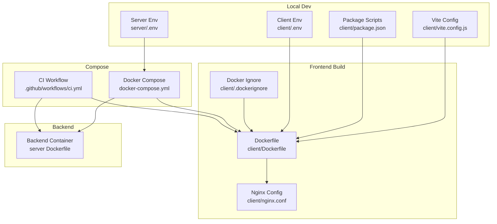
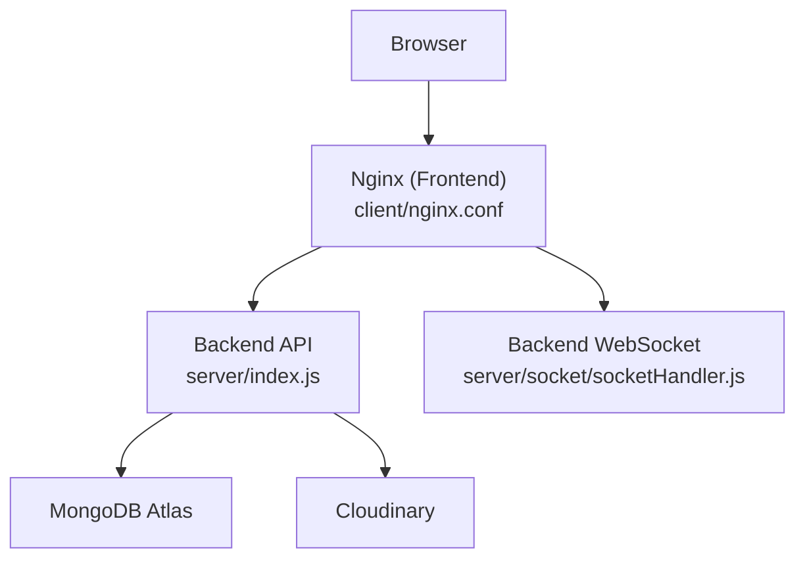
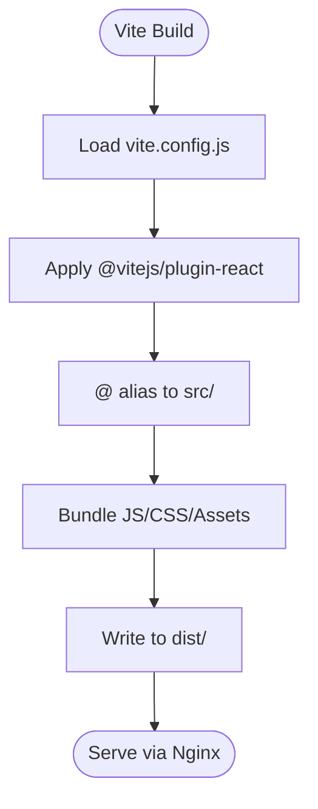
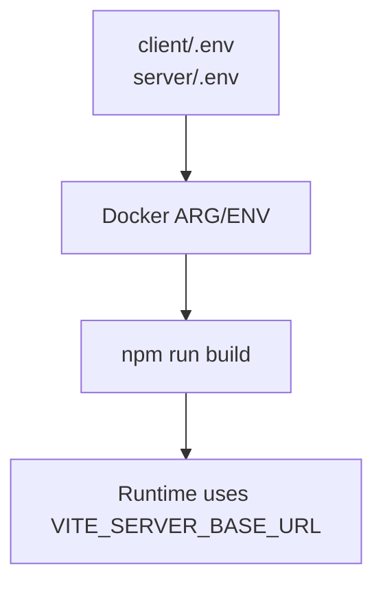
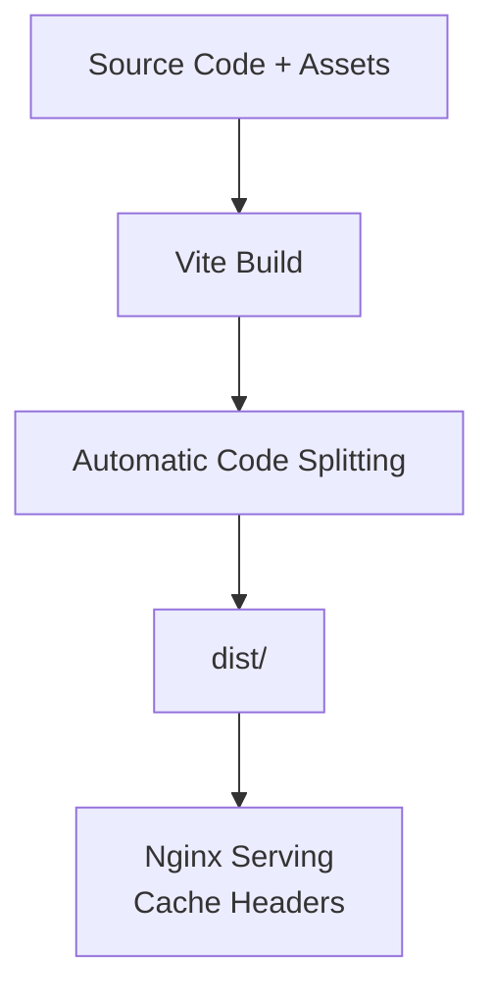
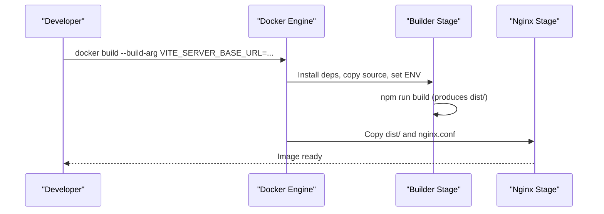
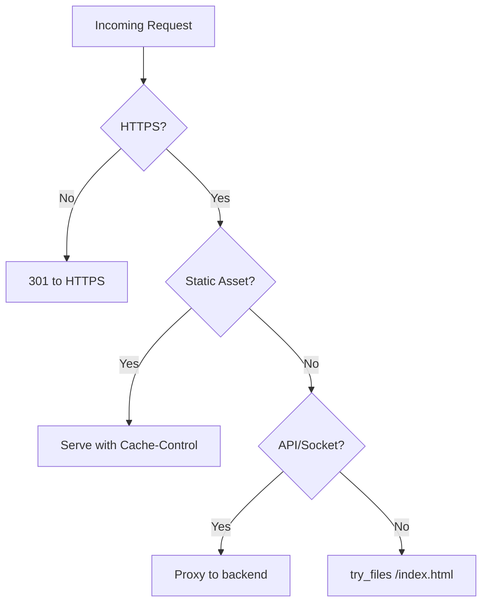
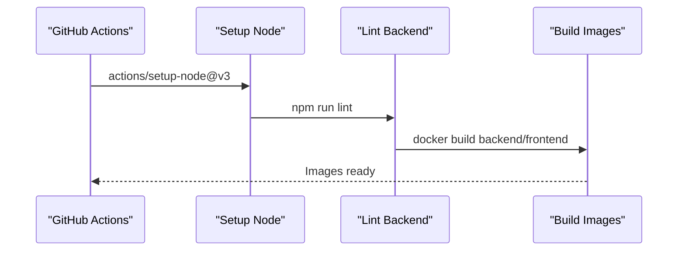
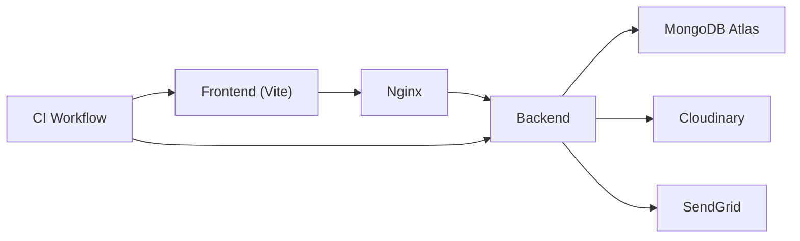

# Build and Deployment

<cite>
**Referenced Files in This Document**
- [vite.config.js](file://client/vite.config.js)
- [package.json](file://client/package.json)
- [Dockerfile](file://client/Dockerfile)
- [docker-compose.yml](file://docker-compose.yml)
- [nginx.conf](file://client/nginx.conf)
- [.env](file://client/.env)
- [server/.env](file://server/.env)
- [ci.yml](file://.github/workflows/ci.yml)
- [postcss.config.js](file://client/postcss.config.js)
- [tailwind.config.js](file://client/tailwind.config.js)
- [eslint.config.js](file://client/eslint.config.js)
- [.prettierrc](file://client/.prettierrc)
- [.dockerignore](file://client/.dockerignore)
- [server/.dockerignore](file://server/.dockerignore)
</cite>

## Table of Contents
1. [Introduction](#introduction)
2. [Project Structure](#project-structure)
3. [Core Components](#core-components)
4. [Architecture Overview](#architecture-overview)
5. [Detailed Component Analysis](#detailed-component-analysis)
6. [Dependency Analysis](#dependency-analysis)
7. [Performance Considerations](#performance-considerations)
8. [Troubleshooting Guide](#troubleshooting-guide)
9. [Conclusion](#conclusion)
10. [Appendices](#appendices)

## Introduction
This document explains the Vite build system and deployment pipeline for the betting application. It covers build configuration, environment variable handling, production optimization, asset handling, code splitting, bundle analysis techniques, Docker containerization, Nginx configuration, static asset serving, CI/CD integration, automated testing, and performance monitoring and caching strategies. The goal is to provide a clear, actionable guide for building, deploying, and operating the application reliably and efficiently.

## Project Structure
The project is split into two primary services:
- Frontend (React + Vite): Built into a static site and served via Nginx.
- Backend (Node.js + Express): Exposed to the frontend via reverse proxy and socket upgrades.

Key build and deployment artifacts:
- Vite configuration defines React plugin and path aliases.
- Dockerfile builds the frontend and serves it via Nginx.
- docker-compose orchestrates backend and frontend containers, SSL mounting, and inter-service networking.
- Nginx configuration handles HTTPS redirect, security headers, gzip, cache policies, and API/socket proxying.
- CI workflow builds images but does not deploy by default; deployment steps are commented out for future use.

**Diagram sources**
- [vite.config.js](file://client/vite.config.js#L1-L14)
- [package.json](file://client/package.json#L1-L70)
- [.env](file://client/.env#L1-L3)
- [server/.env](file://server/.env#L1-L44)
- [Dockerfile](file://client/Dockerfile#L1-L27)
- [nginx.conf](file://client/nginx.conf#L1-L100)
- [.dockerignore](file://client/.dockerignore#L1-L9)
- [docker-compose.yml](file://docker-compose.yml#L1-L50)
- [ci.yml](file://.github/workflows/ci.yml#L1-L88)

**Section sources**
- [vite.config.js](file://client/vite.config.js#L1-L14)
- [package.json](file://client/package.json#L1-L70)
- [Dockerfile](file://client/Dockerfile#L1-L27)
- [docker-compose.yml](file://docker-compose.yml#L1-L50)
- [nginx.conf](file://client/nginx.conf#L1-L100)
- [ci.yml](file://.github/workflows/ci.yml#L1-L88)

## Core Components
- Vite build configuration:
  - React plugin enabled.
  - Path alias for "@".
  - No explicit build target or output dir overrides; defaults apply.
- Environment variables:
  - Frontend: VITE_SERVER_BASE_URL injected during build via Docker ARG/ENV.
  - Backend: PORT, CLIENT_BASE_URL, database URI, JWT secret, email providers, Cloudinary credentials.
- Static site generation:
  - Vite build produces dist/.
  - Nginx serves dist/ as static assets with aggressive caching and security headers.
- Reverse proxy and WebSocket support:
  - Nginx proxies /api/ and /socket.io/ to backend service.
  - Upgrades handled for real-time features.
- CI/CD:
  - GitHub Actions builds backend and frontend images.
  - Deployment steps are present but commented out for manual activation.

**Section sources**
- [vite.config.js](file://client/vite.config.js#L1-L14)
- [package.json](file://client/package.json#L1-L70)
- [Dockerfile](file://client/Dockerfile#L1-L27)
- [nginx.conf](file://client/nginx.conf#L1-L100)
- [ci.yml](file://.github/workflows/ci.yml#L1-L88)
- [.env](file://client/.env#L1-L3)
- [server/.env](file://server/.env#L1-L44)

## Architecture Overview
The deployment architecture consists of:
- Frontend service: Vite-built static assets served by Nginx.
- Backend service: Node.js server exposing REST APIs and WebSocket endpoints.
- Inter-service communication: Nginx reverse proxies API and WebSocket traffic to backend.
- Orchestration: docker-compose manages containers, networking, SSL certificates, and health checks.

**Diagram sources**
- [nginx.conf](file://client/nginx.conf#L68-L99)
- [server/.env](file://server/.env#L1-L44)

**Section sources**
- [docker-compose.yml](file://docker-compose.yml#L1-L50)
- [nginx.conf](file://client/nginx.conf#L1-L100)
- [server/.env](file://server/.env#L1-L44)

## Detailed Component Analysis

### Vite Build Configuration
- Purpose: Configure React plugin, path aliases, and defaults for development and production builds.
- Notable aspects:
  - React plugin enables JSX transform and fast refresh.
  - Alias "@" resolves to src/, simplifying imports.
  - No explicit rollupOptions or build.target; rely on Vite defaults for modern browsers.
- Impact on production:
  - Vite’s default minifier and bundling are sufficient for most apps.
  - For advanced optimization, consider adding rollupOptions for manual chunking or external libraries.

**Diagram sources**
- [vite.config.js](file://client/vite.config.js#L1-L14)
- [package.json](file://client/package.json#L6-L12)

**Section sources**
- [vite.config.js](file://client/vite.config.js#L1-L14)
- [package.json](file://client/package.json#L6-L12)

### Environment Variables and Secrets
- Frontend:
  - VITE_SERVER_BASE_URL is injected at build time via Docker ARG/ENV and used by the app to determine API base URL.
- Backend:
  - PORT, CLIENT_BASE_URL, DB_URI, JWT_SECRET_KEY, WEBHOOK_SECRET, Cloudinary credentials, SendGrid keys, ZeroBounce key.
- Security and separation:
  - Keep secrets in .env files and pass them via docker-compose env_file and environment blocks.
  - Avoid committing secrets; ensure .dockerignore excludes .env and node_modules.

**Diagram sources**
- [.env](file://client/.env#L1-L3)
- [server/.env](file://server/.env#L1-L44)
- [Dockerfile](file://client/Dockerfile#L11-L12)

**Section sources**
- [.env](file://client/.env#L1-L3)
- [server/.env](file://server/.env#L1-L44)
- [Dockerfile](file://client/Dockerfile#L11-L12)

### Asset Handling and Code Splitting
- Assets:
  - Static assets under client/public are copied as-is to dist/.
  - Nginx sets long cache TTLs for JS/CSS/fonts/images and immutable cache-control headers.
- Code splitting:
  - Vite performs automatic route-based code splitting for React Router.
  - Manual split points can be introduced via dynamic imports for heavy components.
- CSS:
  - Tailwind CSS is configured with PostCSS and autoprefixer; purge occurs during build.
  - Consider enabling PurgeCSS in production builds if not already handled by Tailwind.

**Diagram sources**
- [nginx.conf](file://client/nginx.conf#L60-L65)
- [tailwind.config.js](file://client/tailwind.config.js#L1-L85)
- [postcss.config.js](file://client/postcss.config.js#L1-L7)

**Section sources**
- [nginx.conf](file://client/nginx.conf#L60-L65)
- [tailwind.config.js](file://client/tailwind.config.js#L1-L85)
- [postcss.config.js](file://client/postcss.config.js#L1-L7)

### Bundle Analysis Techniques
- Recommended tools:
  - Rollup plugin “rollup-plugin-visualizer” to generate HTML reports of bundle composition.
  - “bundle-analyzer” for interactive treemap views.
- Implementation approach:
  - Add the plugin to Vite’s rollupOptions.plugins in vite.config.js.
  - Run a production build and open the generated report.
- Actionable insights:
  - Identify large dependencies (e.g., date-fns, lucide-react) and consider tree-shaking or lighter alternatives.
  - Split vendor chunks to improve caching.

[No sources needed since this section provides general guidance]

### Docker Containerization
- Multi-stage build:
  - Builder stage installs dependencies, copies source, injects VITE_SERVER_BASE_URL, and runs npm run build.
  - Production stage uses nginx:alpine, copies dist/, and applies custom nginx.conf.
- Arguments and environment:
  - VITE_SERVER_BASE_URL passed as ARG and set as ENV for the builder stage.
- Health checks:
  - docker-compose defines health checks for backend and frontend services.

**Diagram sources**
- [Dockerfile](file://client/Dockerfile#L1-L27)
- [docker-compose.yml](file://docker-compose.yml#L26-L31)

**Section sources**
- [Dockerfile](file://client/Dockerfile#L1-L27)
- [docker-compose.yml](file://docker-compose.yml#L26-L31)

### Nginx Configuration and Static Asset Serving
- HTTPS redirect and SSL:
  - HTTP to HTTPS redirect with certificate and key mounted from host.
  - TLS 1.2/1.3 protocols and strong cipher suite.
- Security headers:
  - X-Frame-Options, X-XSS-Protection, X-Content-Type-Options, Referrer-Policy, HSTS.
- Gzip compression:
  - Enabled with appropriate types and minimum length.
- Caching:
  - HTML: short TTL with immutable cache-control.
  - Static assets: 1-year TTL with immutable cache-control and vary header for encodings.
- Proxying:
  - /api/ proxied to backend with upgrade headers for WebSockets.
  - /socket.io/ proxied similarly with upgrade support.
- Uploads:
  - Increased timeouts and disabled proxy buffering for large uploads.

**Diagram sources**
- [nginx.conf](file://client/nginx.conf#L1-L100)

**Section sources**
- [nginx.conf](file://client/nginx.conf#L1-L100)

### CI/CD Integration and Automated Testing
- Workflow:
  - Triggers on pushes and pull requests to main/dev.
  - Sets up Node 20, lints backend, builds backend and frontend Docker images.
- Deployment:
  - Deployment steps are present but commented out; uncomment and configure secrets for EC2 deployment.

**Diagram sources**
- [ci.yml](file://.github/workflows/ci.yml#L1-L88)

**Section sources**
- [ci.yml](file://.github/workflows/ci.yml#L1-L88)

### Performance Monitoring, Caching Strategies, and CDN Integration
- Monitoring:
  - Enable Application Performance Monitoring (APM) SDKs in the frontend/backend for latency and error tracking.
  - Use browser devtools and Lighthouse for audits.
- Caching:
  - Nginx long-cache immutable assets; consider cache-busting filenames for updates.
  - CDN edge caching for static assets; serve HTML with short cache TTL.
- CDN integration:
  - Serve static assets (JS/CSS/fonts/images) from CDN with HTTPS and cache headers.
  - Keep API endpoints on origin to avoid CORS complexities.
- Observability:
  - Centralized logging and structured logs in backend.
  - Health checks in docker-compose ensure service readiness.

[No sources needed since this section provides general guidance]

## Dependency Analysis
- Internal dependencies:
  - Frontend build depends on Vite config, package scripts, and environment variables.
  - Nginx depends on dist/ and docker-compose network configuration.
  - Backend depends on environment variables for DB, JWT, and third-party integrations.
- External dependencies:
  - MongoDB Atlas for persistence.
  - Cloudinary for media storage.
  - SendGrid for transactional emails.
  - GitHub Actions for CI.

**Diagram sources**
- [docker-compose.yml](file://docker-compose.yml#L1-L50)
- [server/.env](file://server/.env#L1-L44)

**Section sources**
- [docker-compose.yml](file://docker-compose.yml#L1-L50)
- [server/.env](file://server/.env#L1-L44)

## Performance Considerations
- Build-time:
  - Prefer modern browserslist targets; avoid polyfills when unnecessary.
  - Minimize heavy dependencies; consider lazy loading for large libraries.
- Runtime:
  - Enable gzip/HTTP/2; use long cache TTLs for static assets.
  - Offload static assets to CDN for global performance.
- Observability:
  - Instrument critical paths (APIs, WebSocket connections).
  - Monitor bundle sizes and render performance.

[No sources needed since this section provides general guidance]

## Troubleshooting Guide
- Frontend not loading in production:
  - Verify VITE_SERVER_BASE_URL is correctly passed to the builder and matches backend URL.
  - Confirm dist/ exists after build and is copied into the Nginx stage.
- API errors:
  - Check Nginx proxy settings for /api/ and /socket.io/.
  - Ensure backend health check passes and listens on the expected port.
- SSL issues:
  - Confirm certificate and key paths in nginx.conf match mounted volumes.
  - Validate server_name and certificate domain alignment.
- CI failures:
  - Review lint and build steps; ensure Node version and dependency installation succeed.
  - Un-comment and configure deployment steps if using EC2.

**Section sources**
- [Dockerfile](file://client/Dockerfile#L11-L12)
- [nginx.conf](file://client/nginx.conf#L68-L99)
- [docker-compose.yml](file://docker-compose.yml#L20-L24)
- [ci.yml](file://.github/workflows/ci.yml#L47-L87)

## Conclusion
The application employs a robust, containerized deployment pipeline using Vite for the frontend and Nginx for secure, high-performance static hosting. Environment variables are cleanly separated between frontend and backend, and CI/CD supports building images with room for automated deployment. By leveraging Nginx caching, gzip, and CDN distribution, and by instrumenting performance monitoring, the system can deliver a fast, reliable user experience at scale.

## Appendices
- Development and formatting:
  - ESLint and Prettier configurations are provided for consistent code quality.
  - Docker ignore files exclude unnecessary files from the build context.

**Section sources**
- [eslint.config.js](file://client/eslint.config.js#L1-L39)
- [.prettierrc](file://client/.prettierrc#L1-L6)
- [.dockerignore](file://client/.dockerignore#L1-L9)
- [server/.dockerignore](file://server/.dockerignore#L1-L10)