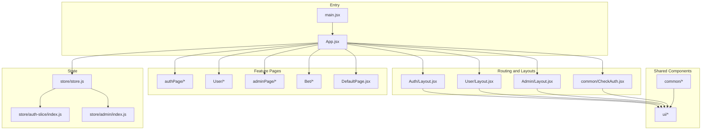
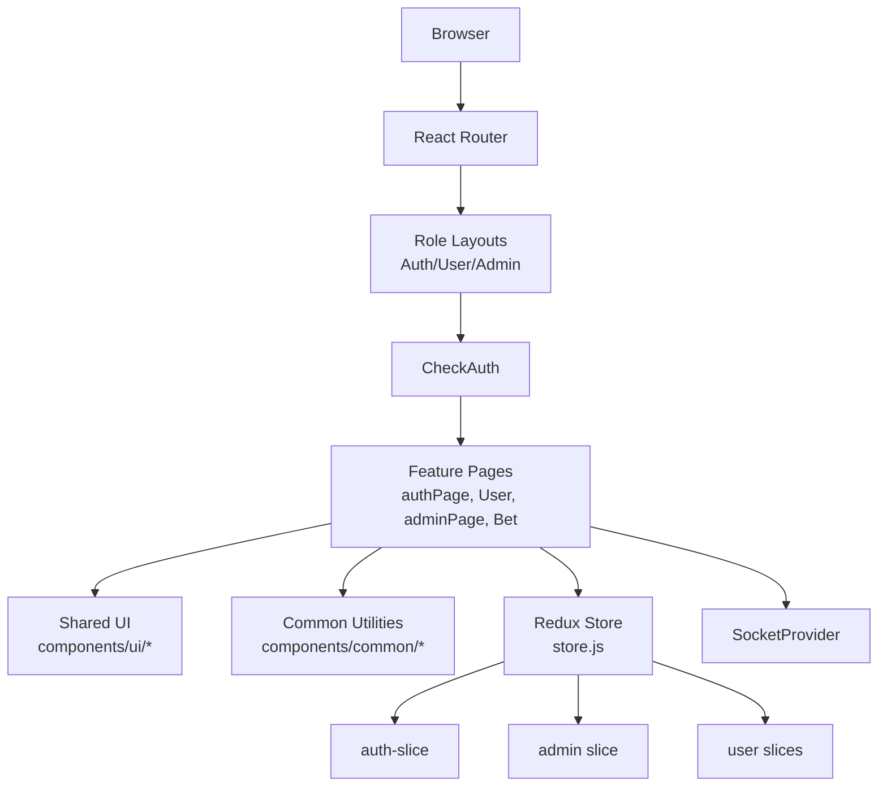
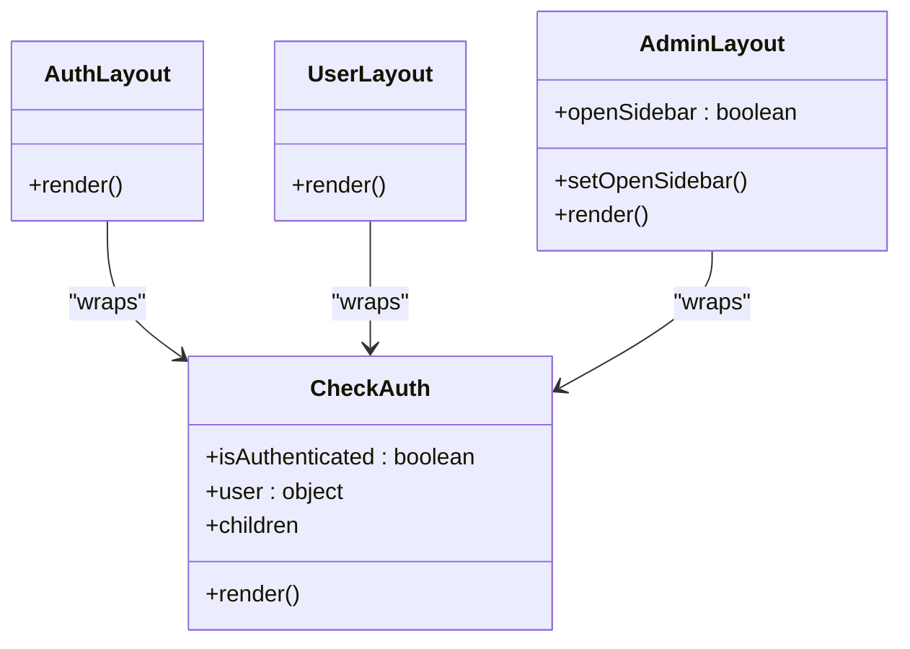
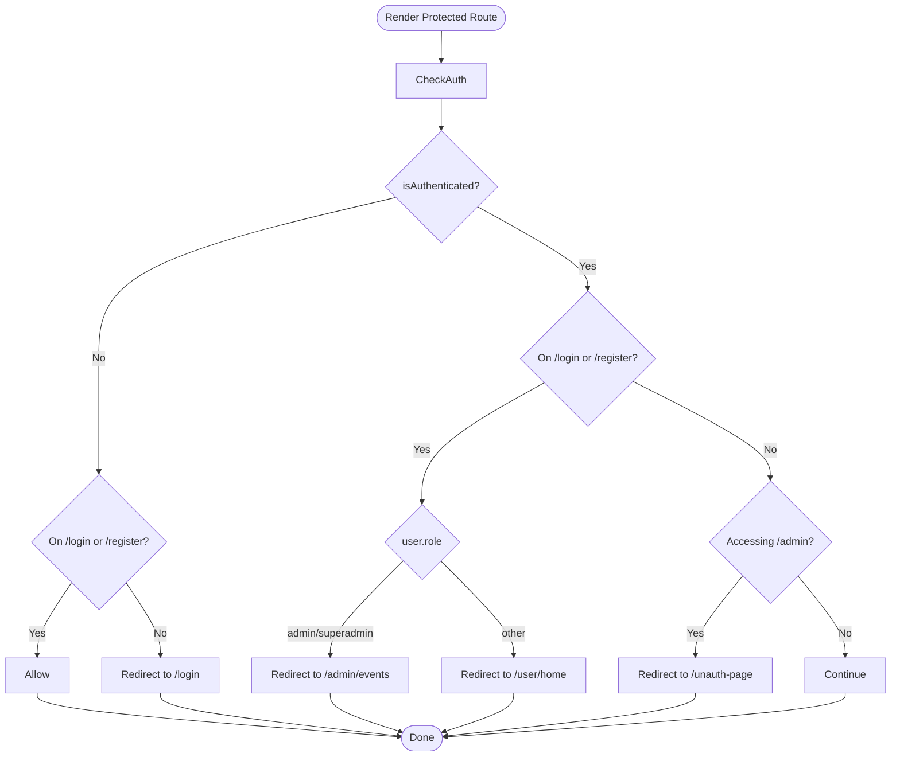
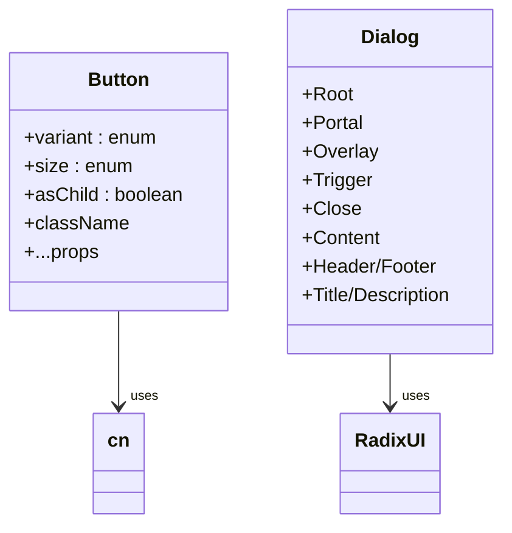
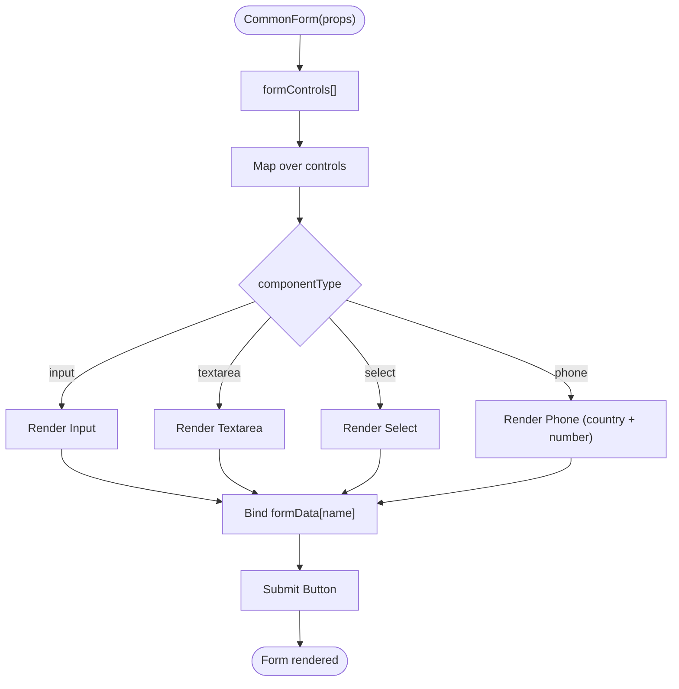
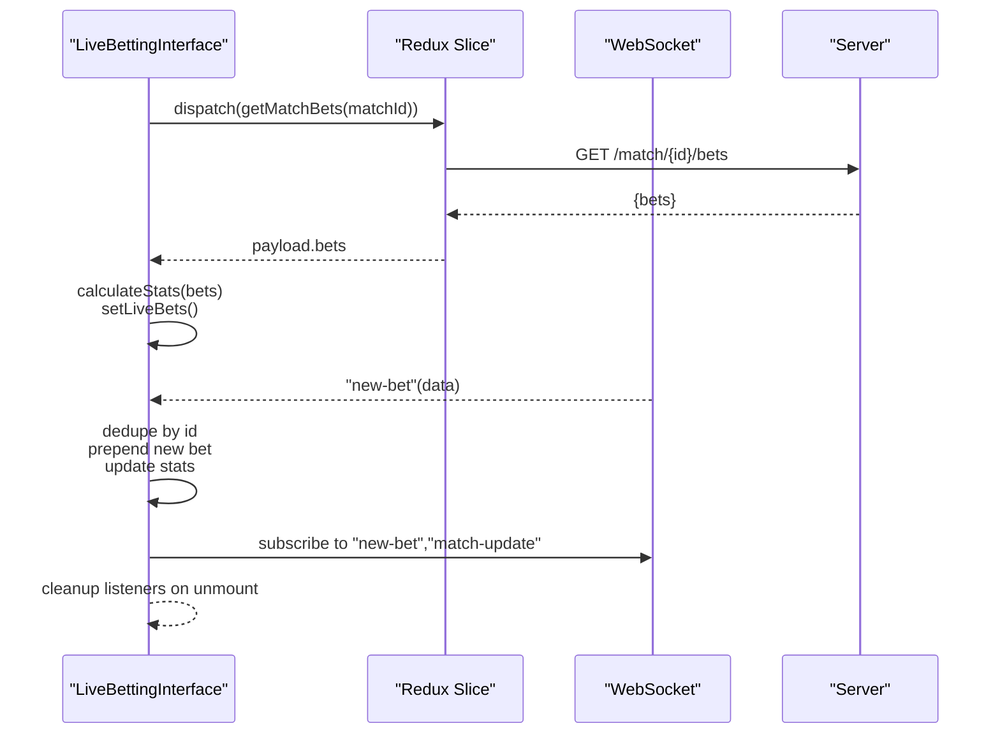
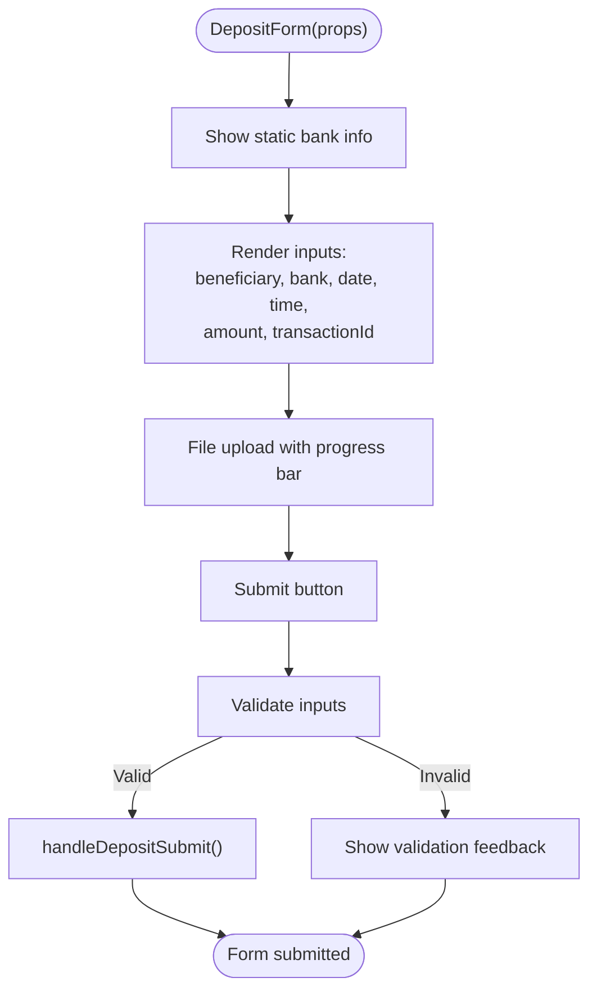
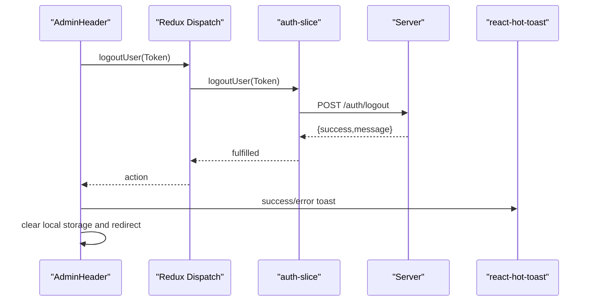
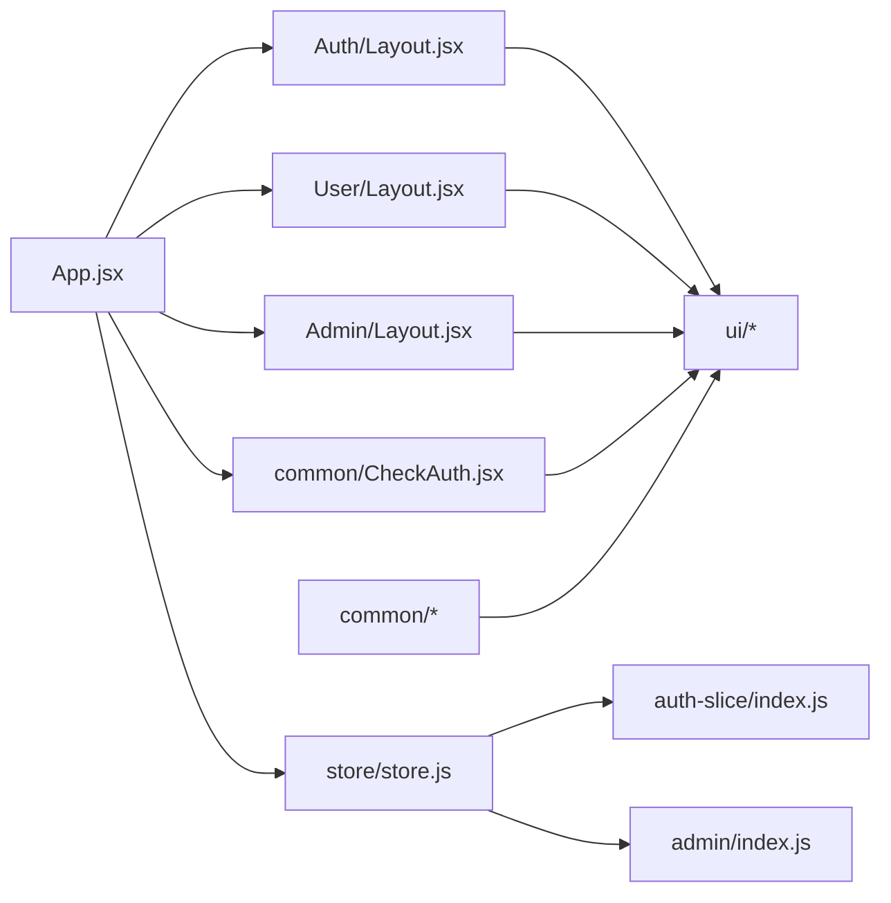

# Component Organization

<cite>
**Referenced Files in This Document**
- [App.jsx](file://client/src/App.jsx)
- [main.jsx](file://client/src/main.jsx)
- [Layout.jsx (Admin)](file://client/src/components/Admin/Layout.jsx)
- [Layout.jsx (User)](file://client/src/components/User/Layout.jsx)
- [Layout.jsx (Auth)](file://client/src/components/Auth/Layout.jsx)
- [CheckAuth.jsx](file://client/src/components/common/CheckAuth.jsx)
- [button.jsx](file://client/src/components/ui/button.jsx)
- [dialog.jsx](file://client/src/components/ui/dialog.jsx)
- [Form.jsx](file://client/src/components/common/Form.jsx)
- [Header.jsx (Admin)](file://client/src/components/Admin/Header.jsx)
- [LiveBettingInterface.jsx](file://client/src/components/Bet/LiveBettingInterface.jsx)
- [DepositForm.jsx](file://client/src/components/User/walletComponent/DepositForm.jsx)
- [store.js](file://client/src/store/store.js)
- [auth-slice/index.js](file://client/src/store/auth-slice/index.js)
- [admin/index.js](file://client/src/store/admin/index.js)
</cite>

## Table of Contents
1. [Introduction](#introduction)
2. [Project Structure](#project-structure)
3. [Core Components](#core-components)
4. [Architecture Overview](#architecture-overview)
5. [Detailed Component Analysis](#detailed-component-analysis)
6. [Dependency Analysis](#dependency-analysis)
7. [Performance Considerations](#performance-considerations)
8. [Accessibility Considerations](#accessibility-considerations)
9. [Testing and Storybook Integration](#testing-and-storybook-integration)
10. [Design System Adherence](#design-system-adherence)
11. [Folder Structure Conventions and Naming Patterns](#folder-structure-conventions-and-naming-patterns)
12. [Troubleshooting Guide](#troubleshooting-guide)
13. [Conclusion](#conclusion)

## Introduction
This document explains the component architecture and organizational patterns used in the betting application. It focuses on feature-based component grouping, the shared component library, layout components per role, reusable UI components, prop interfaces, lifecycle management, performance optimization, accessibility, testing and Storybook integration, design system adherence, and folder/naming conventions.

## Project Structure
The frontend is a React application structured around:
- Feature-based grouping under components (Auth, User, Admin, Bet, Default, common, ui)
- Pages organized by route contexts (authPage, User, adminPage, Bet)
- Centralized routing and layout orchestration in App.jsx
- Global state via Redux Toolkit slices
- Shared UI primitives under components/ui
- Common utilities under components/common

**Diagram sources**
- [main.jsx](file://client/src/main.jsx#L1-L20)
- [App.jsx](file://client/src/App.jsx#L1-L114)
- [Layout.jsx (Auth)](file://client/src/components/Auth/Layout.jsx#L1-L81)
- [Layout.jsx (User)](file://client/src/components/User/Layout.jsx#L1-L19)
- [Layout.jsx (Admin)](file://client/src/components/Admin/Layout.jsx#L1-L22)
- [CheckAuth.jsx](file://client/src/components/common/CheckAuth.jsx#L1-L44)
- [store.js](file://client/src/store/store.js#L1-L26)
- [auth-slice/index.js](file://client/src/store/auth-slice/index.js#L1-L342)
- [admin/index.js](file://client/src/store/admin/index.js#L1-L334)

**Section sources**
- [main.jsx](file://client/src/main.jsx#L1-L20)
- [App.jsx](file://client/src/App.jsx#L1-L114)

## Core Components
- Routing and layout orchestration: App.jsx sets up routes and wraps pages with role-based layouts and authentication checks.
- Role-based layouts: Auth, User, and Admin layouts define page scaffolding and outlet rendering.
- Authentication guard: CheckAuth enforces role-aware navigation and redirects.
- Shared UI primitives: Radix UI-based components (button, dialog, input, etc.) with Tailwind variants.
- Common form renderer: Form.jsx renders forms declaratively from control descriptors.
- Feature-specific components: Betting interface, wallet forms, and admin management UIs.

**Section sources**
- [App.jsx](file://client/src/App.jsx#L27-L111)
- [Layout.jsx (Auth)](file://client/src/components/Auth/Layout.jsx#L1-L81)
- [Layout.jsx (User)](file://client/src/components/User/Layout.jsx#L1-L19)
- [Layout.jsx (Admin)](file://client/src/components/Admin/Layout.jsx#L1-L22)
- [CheckAuth.jsx](file://client/src/components/common/CheckAuth.jsx#L4-L41)
- [button.jsx](file://client/src/components/ui/button.jsx#L1-L48)
- [dialog.jsx](file://client/src/components/ui/dialog.jsx#L1-L95)
- [Form.jsx](file://client/src/components/common/Form.jsx#L14-L170)

## Architecture Overview
The app uses a layered pattern:
- Presentation layer: Feature components and shared UI
- Routing layer: App.jsx orchestrates routes and guards
- State layer: Redux slices manage domain logic and async flows
- Context layer: SocketProvider supplies WebSocket connectivity

**Diagram sources**
- [App.jsx](file://client/src/App.jsx#L27-L111)
- [Layout.jsx (Auth)](file://client/src/components/Auth/Layout.jsx#L1-L81)
- [Layout.jsx (User)](file://client/src/components/User/Layout.jsx#L1-L19)
- [Layout.jsx (Admin)](file://client/src/components/Admin/Layout.jsx#L1-L22)
- [CheckAuth.jsx](file://client/src/components/common/CheckAuth.jsx#L4-L41)
- [store.js](file://client/src/store/store.js#L1-L26)
- [auth-slice/index.js](file://client/src/store/auth-slice/index.js#L1-L342)
- [admin/index.js](file://client/src/store/admin/index.js#L1-L334)
- [main.jsx](file://client/src/main.jsx#L10-L19)

## Detailed Component Analysis

### Role-Based Layouts and Composition
- Auth layout: Two-column responsive design with banner and auth form outlet; integrates internationalization and shared header/footer.
- User layout: Minimal scaffold with header and outlet for user-centric pages.
- Admin layout: Collapsible sidebar and main content area with outlet for admin pages.

**Diagram sources**
- [Layout.jsx (Auth)](file://client/src/components/Auth/Layout.jsx#L8-L81)
- [Layout.jsx (User)](file://client/src/components/User/Layout.jsx#L5-L19)
- [Layout.jsx (Admin)](file://client/src/components/Admin/Layout.jsx#L6-L22)
- [CheckAuth.jsx](file://client/src/components/common/CheckAuth.jsx#L4-L41)

**Section sources**
- [Layout.jsx (Auth)](file://client/src/components/Auth/Layout.jsx#L1-L81)
- [Layout.jsx (User)](file://client/src/components/User/Layout.jsx#L1-L19)
- [Layout.jsx (Admin)](file://client/src/components/Admin/Layout.jsx#L1-L22)
- [CheckAuth.jsx](file://client/src/components/common/CheckAuth.jsx#L1-L44)

### Authentication Guard and Navigation
CheckAuth enforces:
- Redirect unauthenticated users away from protected areas
- Redirect authenticated users to appropriate dashboards based on role
- Prevent cross-role access attempts

**Diagram sources**
- [CheckAuth.jsx](file://client/src/components/common/CheckAuth.jsx#L4-L41)

**Section sources**
- [CheckAuth.jsx](file://client/src/components/common/CheckAuth.jsx#L1-L44)

### Shared UI Component Library
The shared ui library provides Radix UI primitives with Tailwind-based variants and consistent styling.

**Diagram sources**
- [button.jsx](file://client/src/components/ui/button.jsx#L36-L47)
- [dialog.jsx](file://client/src/components/ui/dialog.jsx#L7-L94)

**Section sources**
- [button.jsx](file://client/src/components/ui/button.jsx#L1-L48)
- [dialog.jsx](file://client/src/components/ui/dialog.jsx#L1-L95)

### Common Form Renderer
CommonForm renders declarative forms from a control descriptor array, supporting input, textarea, select, and phone controls, with i18n and loading states.

**Diagram sources**
- [Form.jsx](file://client/src/components/common/Form.jsx#L14-L170)

**Section sources**
- [Form.jsx](file://client/src/components/common/Form.jsx#L1-L170)

### Feature-Specific Components

#### Betting Interface
LiveBettingInterface manages:
- Real-time bet feed via socket listeners
- Local stats calculation and incremental updates
- UI state for selections, amounts, and closed status
- Integration with Redux for fetching match bets

**Diagram sources**
- [LiveBettingInterface.jsx](file://client/src/components/Bet/LiveBettingInterface.jsx#L50-L169)
- [auth-slice/index.js](file://client/src/store/auth-slice/index.js#L1-L342)

**Section sources**
- [LiveBettingInterface.jsx](file://client/src/components/Bet/LiveBettingInterface.jsx#L1-L439)

#### Wallet Deposit Form
DepositForm handles:
- Static bank details display
- Beneficiary, bank, date/time, amount, transaction ID
- File upload with progress
- i18n and date localization

**Diagram sources**
- [DepositForm.jsx](file://client/src/components/User/walletComponent/DepositForm.jsx#L24-L329)

**Section sources**
- [DepositForm.jsx](file://client/src/components/User/walletComponent/DepositForm.jsx#L1-L329)

### Admin Header and Navigation
AdminHeader provides:
- Language dropdown integration
- Logout action via Redux thunk
- Sidebar toggle trigger

**Diagram sources**
- [Header.jsx (Admin)](file://client/src/components/Admin/Header.jsx#L17-L27)
- [auth-slice/index.js](file://client/src/store/auth-slice/index.js#L117-L130)

**Section sources**
- [Header.jsx (Admin)](file://client/src/components/Admin/Header.jsx#L1-L55)
- [auth-slice/index.js](file://client/src/store/auth-slice/index.js#L117-L130)

## Dependency Analysis
- App.jsx depends on:
  - Layouts and pages for each role
  - CheckAuth for route protection
  - Redux store for auth state
- Layouts depend on:
  - Outlet for nested routes
  - Shared UI components
  - Common utilities (e.g., language dropdown)
- Shared UI components depend on:
  - Radix UI primitives
  - Utility functions for class merging
- Feature components depend on:
  - Redux slices for data/state
  - Shared UI and common components
  - i18n utilities

**Diagram sources**
- [App.jsx](file://client/src/App.jsx#L1-L114)
- [store.js](file://client/src/store/store.js#L1-L26)
- [auth-slice/index.js](file://client/src/store/auth-slice/index.js#L1-L342)
- [admin/index.js](file://client/src/store/admin/index.js#L1-L334)

**Section sources**
- [App.jsx](file://client/src/App.jsx#L1-L114)
- [store.js](file://client/src/store/store.js#L1-L26)

## Performance Considerations
- Memoization and callbacks:
  - Use of useCallback for stats calculation and fetch functions prevents unnecessary re-renders in betting interface.
  - Stable references reduce downstream recomputation.
- Event listeners:
  - Single socket listeners with explicit cleanup prevent memory leaks and redundant work.
- Loading states:
  - isLoading flags and early returns avoid rendering heavy lists before data arrives.
- Redux state normalization:
  - Keep slices focused and avoid deeply nested state to simplify selector computations.
- UI primitives:
  - Prefer forwardRef and minimal wrappers to reduce DOM overhead.

**Section sources**
- [LiveBettingInterface.jsx](file://client/src/components/Bet/LiveBettingInterface.jsx#L50-L108)
- [LiveBettingInterface.jsx](file://client/src/components/Bet/LiveBettingInterface.jsx#L111-L169)

## Accessibility Considerations
- Semantic markup:
  - Use of native elements (button, input) with proper labeling.
- Focus management:
  - Radix UI dialogs expose focus traps and overlay handling.
- Keyboard navigation:
  - Dialog triggers and overlays support keyboard interactions.
- Screen reader support:
  - Hidden labels for icons (e.g., sr-only) improve assistive tech compatibility.
- Contrast and color:
  - Tailwind utilities enforce readable text on dark backgrounds.

**Section sources**
- [dialog.jsx](file://client/src/components/ui/dialog.jsx#L35-L42)
- [button.jsx](file://client/src/components/ui/button.jsx#L36-L44)

## Testing and Storybook Integration
- Component testing:
  - Use React Testing Library to test component rendering, event handlers, and Redux-connected logic.
  - Mock Redux store and router for isolated tests.
  - Test guards (CheckAuth) with different role and pathname scenarios.
- Storybook:
  - Export stories for each component with controls for props (variants, sizes, disabled states).
  - Create stories for interactive states (loading, error, empty).
  - Document accessibility and i18n toggles.
- UI library:
  - Storybook stories for shared components (Button, Dialog) should cover all variants and sizes.

[No sources needed since this section provides general guidance]

## Design System Adherence
- Consistent variants and sizes:
  - Button supports variant and size tokens; maintain a single source of truth for styles.
- Theming:
  - Dark theme palette applied via Tailwind classes; keep consistent color tokens across components.
- Typography and spacing:
  - Use consistent text weights and spacing utilities; avoid ad-hoc overrides.
- Iconography:
  - lucide-react icons ensure visual consistency; pair with accessible labels.

**Section sources**
- [button.jsx](file://client/src/components/ui/button.jsx#L7-L34)

## Folder Structure Conventions and Naming Patterns
- Feature-based grouping:
  - components/Auth, components/User, components/Admin, components/Bet, components/Default, components/common, components/ui
- Pages by route context:
  - Pages/authPage, Pages/User, Pages/adminPage, Pages/Bet
- Naming:
  - PascalCase for components (e.g., Layout.jsx)
  - camelCase for files (e.g., LiveBettingInterface.jsx)
  - Feature folders mirror domain (e.g., walletComponent under User)
- Props:
  - Use concise prop names; group related props into objects (e.g., formData)
- i18n:
  - Keep translation keys under bet.* namespaces for betting features

**Section sources**
- [App.jsx](file://client/src/App.jsx#L1-L114)
- [LiveBettingInterface.jsx](file://client/src/components/Bet/LiveBettingInterface.jsx#L8-L23)

## Troubleshooting Guide
- Authentication loops:
  - Verify CheckAuth conditions for /login and /register paths and user roles.
- Socket events not updating:
  - Ensure single listener registration and cleanup; confirm matchId filtering.
- Redux state not resetting:
  - Confirm logout action clears state and removes Token from localStorage.
- Upload progress not visible:
  - Ensure onUploadProgress callback updates progress state and UI.

**Section sources**
- [CheckAuth.jsx](file://client/src/components/common/CheckAuth.jsx#L4-L41)
- [LiveBettingInterface.jsx](file://client/src/components/Bet/LiveBettingInterface.jsx#L111-L169)
- [auth-slice/index.js](file://client/src/store/auth-slice/index.js#L333-L337)

## Conclusion
The application follows a clear feature-based organization with role-specific layouts, a shared UI library, and guarded routing. State is centralized via Redux slices, and performance is optimized through memoization and careful event handling. The design system ensures consistency, while i18n and accessibility practices improve usability. Adopting Storybook and robust testing strategies will further strengthen reliability and developer experience.