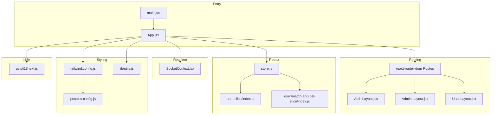
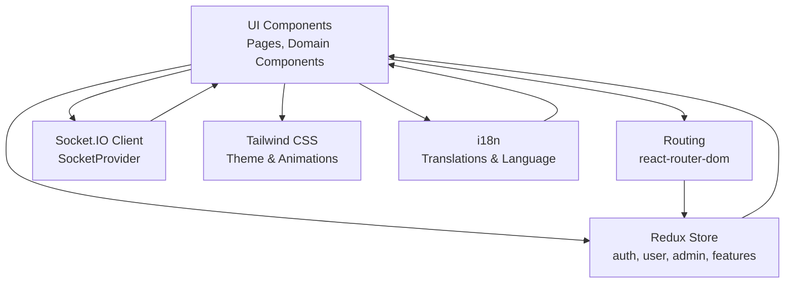
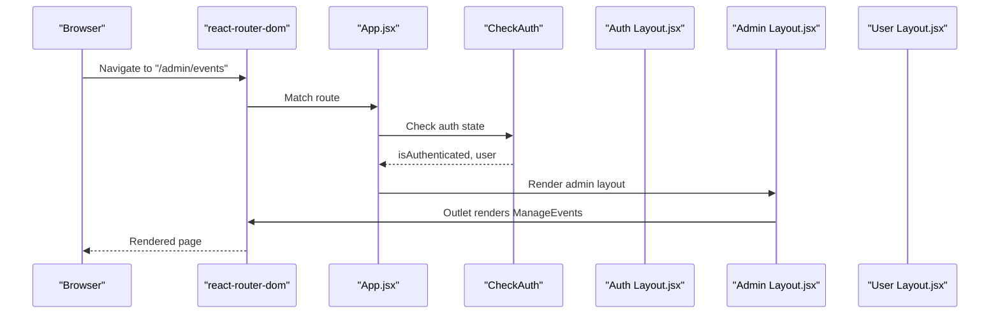
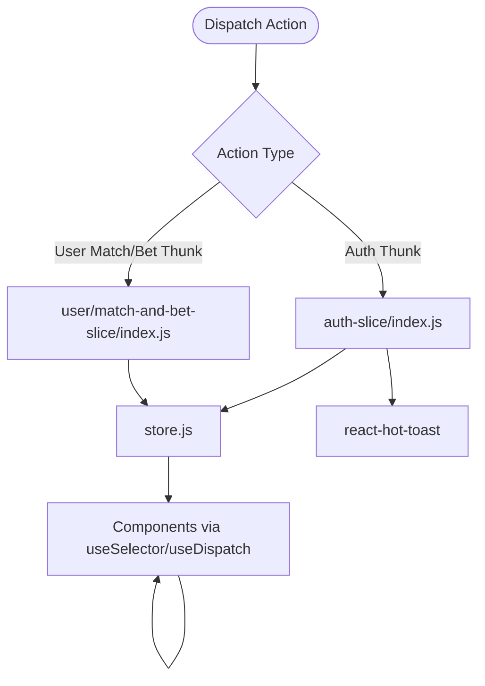
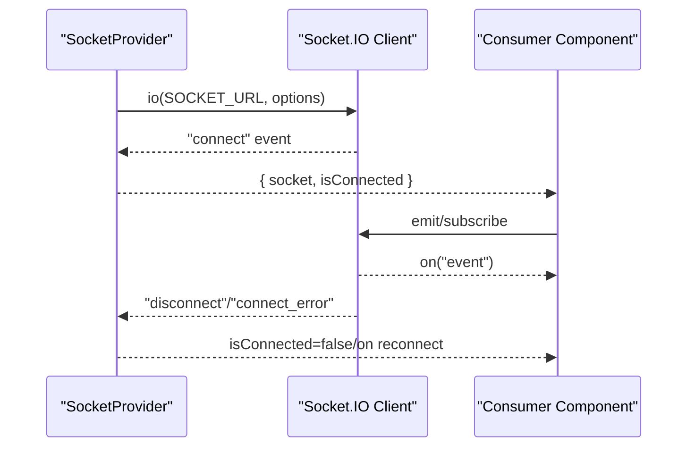
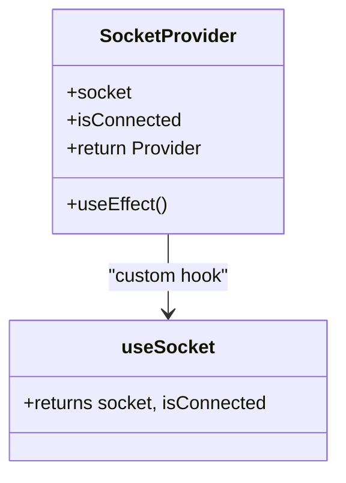
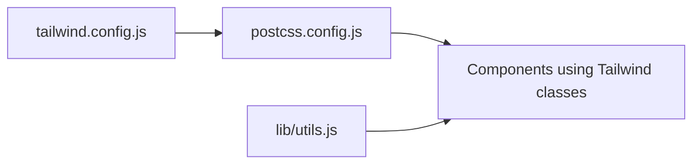
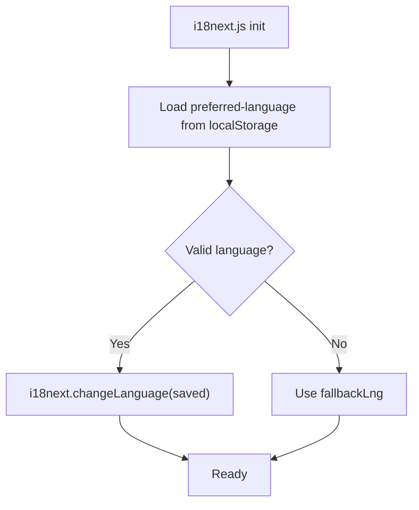
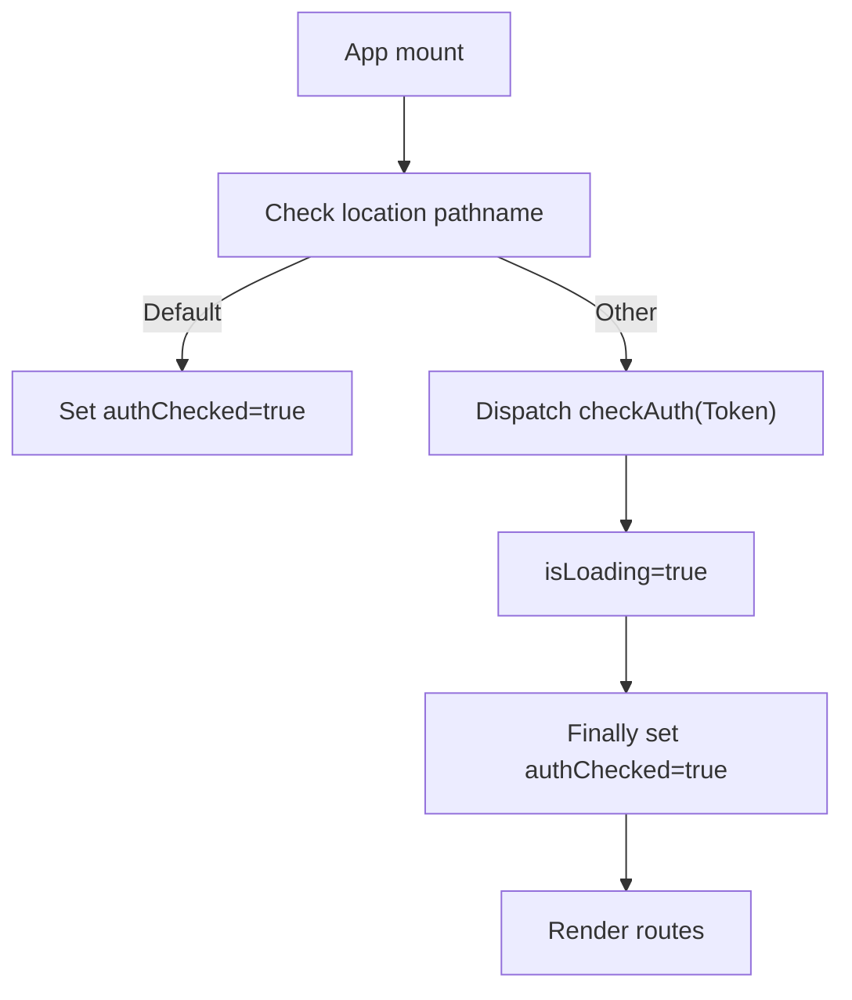
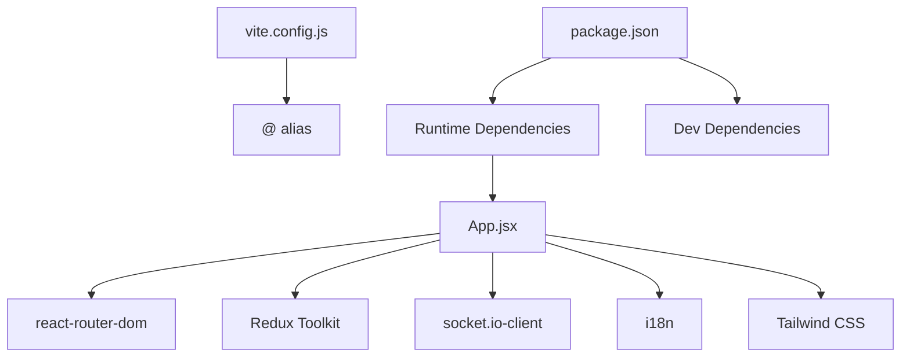

# Frontend Architecture

<cite>
**Referenced Files in This Document**
- [main.jsx](file://client/src/main.jsx)
- [App.jsx](file://client/src/App.jsx)
- [vite.config.js](file://client/vite.config.js)
- [package.json](file://client/package.json)
- [tailwind.config.js](file://client/tailwind.config.js)
- [postcss.config.js](file://client/postcss.config.js)
- [store.js](file://client/src/store/store.js)
- [SocketContext.jsx](file://client/src/context/SocketContext.jsx)
- [i18next.js](file://client/src/utils/i18next.js)
- [utils.js](file://client/src/lib/utils.js)
- [Layout.jsx (Admin)](file://client/src/components/Admin/Layout.jsx)
- [Layout.jsx (User)](file://client/src/components/User/Layout.jsx)
- [Layout.jsx (Auth)](file://client/src/components/Auth/Layout.jsx)
- [index.js (auth slice)](file://client/src/store/auth-slice/index.js)
- [index.js (match-and-bet slice)](file://client/src/store/user/match-and-bet-slice/index.js)
</cite>

## Table of Contents
1. [Introduction](#introduction)
2. [Project Structure](#project-structure)
3. [Core Components](#core-components)
4. [Architecture Overview](#architecture-overview)
5. [Detailed Component Analysis](#detailed-component-analysis)
6. [Dependency Analysis](#dependency-analysis)
7. [Performance Considerations](#performance-considerations)
8. [Troubleshooting Guide](#troubleshooting-guide)
9. [Conclusion](#conclusion)
10. [Appendices](#appendices)

## Introduction
This document describes the frontend architecture of the React application. It covers the component hierarchy, routing structure, Redux Toolkit state management, Socket.IO integration for real-time updates, context provider pattern for global state, Tailwind CSS styling and responsive design, Vite build configuration, modular organization by feature domains (auth, user, admin, bet), internationalization setup, component lifecycle patterns, error boundaries, performance optimization strategies, code splitting and lazy loading, and bundle analysis techniques.

## Project Structure
The frontend is organized around feature-based domains:
- Pages: top-level route handlers grouped by domain (auth, user, admin, bet)
- Components: reusable UI and layout components grouped by domain (Auth, User, Admin, Default, common, ui)
- Store: Redux slices grouped by feature (auth-slice, user, admin, features)
- Context: global providers (SocketContext)
- Utils: i18n initialization and shared utilities
- Config: Vite, Tailwind, PostCSS configurations

**Diagram sources**
- [main.jsx](file://client/src/main.jsx#L1-L20)
- [App.jsx](file://client/src/App.jsx#L1-L114)
- [store.js](file://client/src/store/store.js#L1-L26)
- [SocketContext.jsx](file://client/src/context/SocketContext.jsx#L1-L62)
- [tailwind.config.js](file://client/tailwind.config.js#L1-L85)
- [postcss.config.js](file://client/postcss.config.js#L1-L7)
- [utils.js](file://client/src/lib/utils.js#L1-L7)
- [i18next.js](file://client/src/utils/i18next.js#L1-L691)
- [Layout.jsx (Admin)](file://client/src/components/Admin/Layout.jsx#L1-L22)
- [Layout.jsx (User)](file://client/src/components/User/Layout.jsx#L1-L19)
- [Layout.jsx (Auth)](file://client/src/components/Auth/Layout.jsx#L1-L81)
- [index.js (auth slice)](file://client/src/store/auth-slice/index.js#L1-L342)
- [index.js (match-and-bet slice)](file://client/src/store/user/match-and-bet-slice/index.js#L1-L127)

**Section sources**
- [main.jsx](file://client/src/main.jsx#L1-L20)
- [App.jsx](file://client/src/App.jsx#L1-L114)
- [vite.config.js](file://client/vite.config.js#L1-L14)
- [package.json](file://client/package.json#L1-L70)
- [tailwind.config.js](file://client/tailwind.config.js#L1-L85)
- [postcss.config.js](file://client/postcss.config.js#L1-L7)
- [store.js](file://client/src/store/store.js#L1-L26)
- [SocketContext.jsx](file://client/src/context/SocketContext.jsx#L1-L62)
- [i18next.js](file://client/src/utils/i18next.js#L1-L691)
- [utils.js](file://client/src/lib/utils.js#L1-L7)
- [Layout.jsx (Admin)](file://client/src/components/Admin/Layout.jsx#L1-L22)
- [Layout.jsx (User)](file://client/src/components/User/Layout.jsx#L1-L19)
- [Layout.jsx (Auth)](file://client/src/components/Auth/Layout.jsx#L1-L81)
- [index.js (auth slice)](file://client/src/store/auth-slice/index.js#L1-L342)
- [index.js (match-and-bet slice)](file://client/src/store/user/match-and-bet-slice/index.js#L1-L127)

## Core Components
- Application bootstrap wires routing, Redux provider, Socket provider, and notifications.
- App defines nested routes per domain with shared layouts and guarded routes via a check-auth wrapper.
- Redux store combines domain reducers and handles logout by resetting state.
- Socket provider manages connection lifecycle and exposes connection status.
- Tailwind and PostCSS enable utility-first styling with animations and theme tokens.
- i18n initializes translations and persists language preference.

Key implementation references:
- Bootstrap and providers: [main.jsx](file://client/src/main.jsx#L1-L20)
- Routing and guarded layouts: [App.jsx](file://client/src/App.jsx#L1-L114)
- Redux store root reducer and logout handling: [store.js](file://client/src/store/store.js#L1-L26)
- Socket provider and connection lifecycle: [SocketContext.jsx](file://client/src/context/SocketContext.jsx#L1-L62)
- Tailwind theme and animations: [tailwind.config.js](file://client/tailwind.config.js#L1-L85)
- PostCSS pipeline: [postcss.config.js](file://client/postcss.config.js#L1-L7)
- i18n initialization and language persistence: [i18next.js](file://client/src/utils/i18next.js#L1-L691)

**Section sources**
- [main.jsx](file://client/src/main.jsx#L1-L20)
- [App.jsx](file://client/src/App.jsx#L1-L114)
- [store.js](file://client/src/store/store.js#L1-L26)
- [SocketContext.jsx](file://client/src/context/SocketContext.jsx#L1-L62)
- [tailwind.config.js](file://client/tailwind.config.js#L1-L85)
- [postcss.config.js](file://client/postcss.config.js#L1-L7)
- [i18next.js](file://client/src/utils/i18next.js#L1-L691)

## Architecture Overview
The frontend follows a layered architecture:
- Presentation Layer: React components and pages
- Routing Layer: Nested routes with domain-specific layouts
- State Layer: Redux slices for auth, user, admin, and features
- Realtime Layer: Socket.IO client with provider pattern
- Styling Layer: Tailwind CSS with theme tokens and animations
- Internationalization Layer: i18n with persisted language preference

[No sources needed since this diagram shows conceptual workflow, not actual code structure]

## Detailed Component Analysis

### Routing and Layouts
- Root app initializes providers and renders nested routes under domain-specific layouts.
- Auth domain routes are wrapped with a check-auth guard and use Auth layout with split-pane design.
- Admin domain routes use Admin layout with sidebar and header.
- User domain routes use User layout with header and outlet for page content.
- Default page and not-found routes are defined at the root level.

**Diagram sources**
- [App.jsx](file://client/src/App.jsx#L1-L114)
- [Layout.jsx (Admin)](file://client/src/components/Admin/Layout.jsx#L1-L22)
- [Layout.jsx (User)](file://client/src/components/User/Layout.jsx#L1-L19)
- [Layout.jsx (Auth)](file://client/src/components/Auth/Layout.jsx#L1-L81)

**Section sources**
- [App.jsx](file://client/src/App.jsx#L1-L114)
- [Layout.jsx (Admin)](file://client/src/components/Admin/Layout.jsx#L1-L22)
- [Layout.jsx (User)](file://client/src/components/User/Layout.jsx#L1-L19)
- [Layout.jsx (Auth)](file://client/src/components/Auth/Layout.jsx#L1-L81)

### Redux Toolkit State Management
- Central store combines reducers for auth, payments, admin, and tabs.
- Logout triggers a root reducer reset to undefined, clearing persisted state.
- Auth slice encapsulates async thunks for auth operations and manages loading and OTP dialog state.
- User match-and-bet slice encapsulates async thunks for fetching matches, placing bets, and retrieving match bets.

**Diagram sources**
- [store.js](file://client/src/store/store.js#L1-L26)
- [index.js (auth slice)](file://client/src/store/auth-slice/index.js#L1-L342)
- [index.js (match-and-bet slice)](file://client/src/store/user/match-and-bet-slice/index.js#L1-L127)

**Section sources**
- [store.js](file://client/src/store/store.js#L1-L26)
- [index.js (auth slice)](file://client/src/store/auth-slice/index.js#L1-L342)
- [index.js (match-and-bet slice)](file://client/src/store/user/match-and-bet-slice/index.js#L1-L127)

### Socket.IO Integration
- Socket provider creates a Socket.IO client with reconnection settings and transports.
- Connection events update connection status; provider exposes socket and isConnected.
- Components consume socket via a custom hook to handle real-time updates.

**Diagram sources**
- [SocketContext.jsx](file://client/src/context/SocketContext.jsx#L1-L62)

**Section sources**
- [SocketContext.jsx](file://client/src/context/SocketContext.jsx#L1-L62)

### Context Provider Pattern
- SocketProvider wraps the app tree to expose socket and connection status.
- Consumers use a custom hook to access socket utilities.
- Provider cleans up on unmount.

**Diagram sources**
- [SocketContext.jsx](file://client/src/context/SocketContext.jsx#L1-L62)

**Section sources**
- [SocketContext.jsx](file://client/src/context/SocketContext.jsx#L1-L62)

### Tailwind CSS and Responsive Design
- Tailwind is configured with theme extensions, color tokens, and animation keyframes.
- PostCSS pipeline enables Tailwind and Autoprefixer.
- Utility classes are used for responsive breakpoints and layout composition.
- A shared cn utility merges class names safely.

**Diagram sources**
- [tailwind.config.js](file://client/tailwind.config.js#L1-L85)
- [postcss.config.js](file://client/postcss.config.js#L1-L7)
- [utils.js](file://client/src/lib/utils.js#L1-L7)

**Section sources**
- [tailwind.config.js](file://client/tailwind.config.js#L1-L85)
- [postcss.config.js](file://client/postcss.config.js#L1-L7)
- [utils.js](file://client/src/lib/utils.js#L1-L7)

### Internationalization Setup
- i18n initializes resources for English and Spanish, with translation keys for default, auth, user, bet, and admin domains.
- Language preference is persisted in local storage and restored on initialization.
- Components can use translation helpers or react-i18next hooks.

**Diagram sources**
- [i18next.js](file://client/src/utils/i18next.js#L1-L691)

**Section sources**
- [i18next.js](file://client/src/utils/i18next.js#L1-L691)

### Component Lifecycle Patterns
- App performs initial auth check on non-default routes and shows a spinner while checking.
- Auth layout conditionally renders content based on language detection and translation helper.
- Socket provider establishes connections on mount and tears down on unmount.

**Diagram sources**
- [App.jsx](file://client/src/App.jsx#L1-L114)

**Section sources**
- [App.jsx](file://client/src/App.jsx#L1-L114)

### Error Boundaries
- No explicit React error boundaries were identified in the reviewed files.
- Consider adding boundaries around high-risk areas (admin panels, payment flows) to gracefully handle rendering errors.

[No sources needed since this section provides general guidance]

### Modular Component Organization by Feature Domains
- Auth domain: Pages (Login, Register), Layout, and related UI.
- User domain: Pages (Home, Dashboard), Account pages, Wallet forms, and related UI.
- Admin domain: Pages (ManageEvents, UserManagement, Payments), Layout, and related UI.
- Bet domain: Pages (LiveBettingPage) and related UI components.
- Shared: Default pages, common components, and UI primitives.

**Section sources**
- [Layout.jsx (Auth)](file://client/src/components/Auth/Layout.jsx#L1-L81)
- [Layout.jsx (User)](file://client/src/components/User/Layout.jsx#L1-L19)
- [Layout.jsx (Admin)](file://client/src/components/Admin/Layout.jsx#L1-L22)

## Dependency Analysis
- Build toolchain: Vite with React plugin and path aliasing.
- Runtime dependencies include React, React Router DOM, Redux Toolkit, Socket.IO client, i18n ecosystem, Radix UI primitives, Tailwind variants, and UI libraries.
- Dev dependencies include ESLint, Prettier, Tailwind, and Vite.

**Diagram sources**
- [vite.config.js](file://client/vite.config.js#L1-L14)
- [package.json](file://client/package.json#L1-L70)
- [main.jsx](file://client/src/main.jsx#L1-L20)

**Section sources**
- [vite.config.js](file://client/vite.config.js#L1-L14)
- [package.json](file://client/package.json#L1-L70)

## Performance Considerations
- Lazy loading: Dynamically import heavy pages and components to reduce initial bundle size.
- Code splitting: Use React.lazy and Suspense around domain routes to load on demand.
- Bundle analysis: Use Vite’s built-in preview and external tools to inspect bundle composition.
- Optimizations: Leverage Vite’s production build defaults; consider dynamic imports for large vendor chunks.
- State normalization: Normalize data in Redux slices to minimize re-renders and improve cache locality.
- Memoization: Use memoized selectors and shallow comparisons where appropriate.
- Network: Debounce/throttle frequent requests; batch updates where possible.

[No sources needed since this section provides general guidance]

## Troubleshooting Guide
- Socket connection issues: Verify server base URL environment variable and network connectivity; inspect connection/disconnect/reconnect logs.
- Authentication failures: Confirm token presence and validity; check rejected auth thunks and toast messages.
- Routing problems: Ensure nested routes align with layout outlets and guards.
- Styling anomalies: Validate Tailwind content paths and PostCSS pipeline; rebuild after theme changes.
- i18n issues: Confirm language key existence and persisted language preference.

**Section sources**
- [SocketContext.jsx](file://client/src/context/SocketContext.jsx#L1-L62)
- [index.js (auth slice)](file://client/src/store/auth-slice/index.js#L1-L342)
- [App.jsx](file://client/src/App.jsx#L1-L114)
- [tailwind.config.js](file://client/tailwind.config.js#L1-L85)
- [i18next.js](file://client/src/utils/i18next.js#L1-L691)

## Conclusion
The frontend employs a clean, feature-based architecture with robust routing, Redux Toolkit state management, Socket.IO for real-time updates, Tailwind CSS for styling, and i18n for internationalization. Providers encapsulate cross-cutting concerns, while domain-specific layouts and pages organize functionality. Adopting lazy loading, code splitting, and bundle analysis will further enhance performance and maintainability.

## Appendices
- Environment variables: VITE_SERVER_BASE_URL consumed by Socket.IO and API endpoints.
- Aliasing: Path alias “@” resolves to src for concise imports.

**Section sources**
- [SocketContext.jsx](file://client/src/context/SocketContext.jsx#L1-L62)
- [index.js (auth slice)](file://client/src/store/auth-slice/index.js#L1-L342)
- [vite.config.js](file://client/vite.config.js#L1-L14)