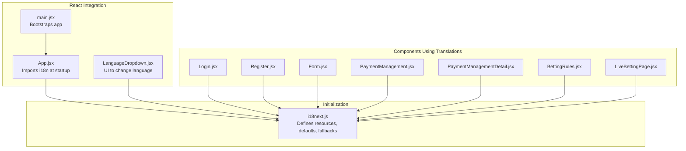
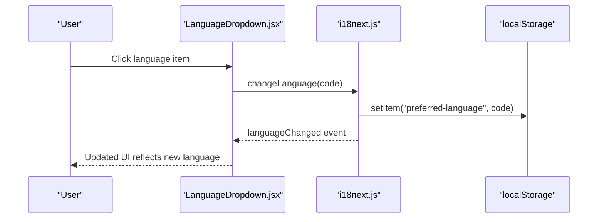
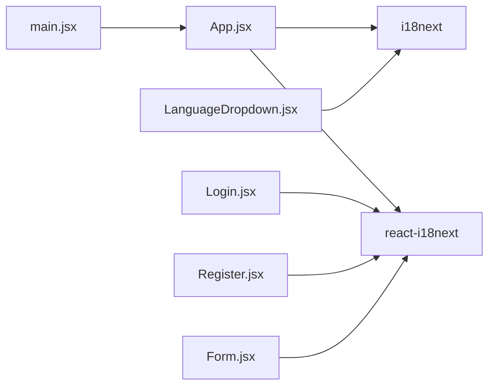

# Internationalization

<cite>
**Referenced Files in This Document**
- [i18next.js](file://client/src/utils/i18next.js)
- [LanguageDropdown.jsx](file://client/src/components/common/LanguageDropdown.jsx)
- [App.jsx](file://client/src/App.jsx)
- [main.jsx](file://client/src/main.jsx)
- [Login.jsx](file://client/src/Pages/authPage/Login.jsx)
- [Register.jsx](file://client/src/Pages/authPage/Register.jsx)
- [Form.jsx](file://client/src/components/common/Form.jsx)
- [PaymentManagement.jsx](file://client/src/Pages/adminPage/PaymentManagement.jsx)
- [PaymentManagementDetail.jsx](file://client/src/components/Admin/PaymentManagementDetail.jsx)
- [BettingRules.jsx](file://client/src/components/Bet/BettingRules.jsx)
- [LiveBettingPage.jsx](file://client/src/Pages/Bet/LiveBettingPage.jsx)
- [index.js](file://client/src/config/index.js)
- [package.json](file://client/package.json)
</cite>

## Table of Contents
1. [Introduction](#introduction)
2. [Project Structure](#project-structure)
3. [Core Components](#core-components)
4. [Architecture Overview](#architecture-overview)
5. [Detailed Component Analysis](#detailed-component-analysis)
6. [Dependency Analysis](#dependency-analysis)
7. [Performance Considerations](#performance-considerations)
8. [Troubleshooting Guide](#troubleshooting-guide)
9. [Conclusion](#conclusion)

## Introduction
This document explains the internationalization (i18n) implementation and multi-language support for the Betting application. It covers the i18next configuration, translation file organization, dynamic language switching, language detection and fallback strategies, pluralization rules, integration with React components, form validation messages, and date/time formatting. It also outlines the translation workflow, editor integration, quality assurance processes, and performance considerations for large translation datasets and lazy loading of language resources.

## Project Structure
The i18n system is centered around a single initialization module that defines translation resources for supported languages and integrates with React via react-i18next. Language switching is exposed through a shared UI component, and various pages and components consume translations using hooks. Additional formatting for dates and statuses is handled locally within components.

**Diagram sources**
- [i18next.js](file://client/src/utils/i18next.js#L1-L691)
- [LanguageDropdown.jsx](file://client/src/components/common/LanguageDropdown.jsx#L1-L111)
- [App.jsx](file://client/src/App.jsx#L1-L114)
- [main.jsx](file://client/src/main.jsx#L1-L20)
- [Login.jsx](file://client/src/Pages/authPage/Login.jsx#L1-L221)
- [Register.jsx](file://client/src/Pages/authPage/Register.jsx#L1-L223)
- [Form.jsx](file://client/src/components/common/Form.jsx#L1-L170)
- [PaymentManagement.jsx](file://client/src/Pages/adminPage/PaymentManagement.jsx#L115-L159)
- [PaymentManagementDetail.jsx](file://client/src/components/Admin/PaymentManagementDetail.jsx#L135-L302)
- [BettingRules.jsx](file://client/src/components/Bet/BettingRules.jsx#L44-L128)
- [LiveBettingPage.jsx](file://client/src/Pages/Bet/LiveBettingPage.jsx#L15-L221)

**Section sources**
- [i18next.js](file://client/src/utils/i18next.js#L1-L691)
- [LanguageDropdown.jsx](file://client/src/components/common/LanguageDropdown.jsx#L1-L111)
- [App.jsx](file://client/src/App.jsx#L1-L114)
- [main.jsx](file://client/src/main.jsx#L1-L20)

## Core Components
- i18next configuration and resources:
  - Initializes i18next with react-i18next.
  - Defines translation resources for English and Spanish under a single namespace.
  - Sets default and fallback language to Spanish.
  - Interpolation escapeValue is disabled to allow HTML in translations.
  - Wraps changeLanguage to persist preferred language in localStorage.
  - Loads wallet-specific nested translations from a dedicated module.

- Language switching UI:
  - LanguageDropdown provides a dropdown menu to switch languages.
  - Uses useTranslation and listens to languageChanged events.
  - Persists selection in localStorage and updates UI state.

- Translation consumption:
  - Components import the i18n initialization early in the app lifecycle.
  - Pages and components use useTranslation to render localized content.
  - Some components implement hybrid approaches mixing t() and inline helpers.

**Section sources**
- [i18next.js](file://client/src/utils/i18next.js#L1-L691)
- [LanguageDropdown.jsx](file://client/src/components/common/LanguageDropdown.jsx#L1-L111)
- [App.jsx](file://client/src/App.jsx#L19-L19)
- [Login.jsx](file://client/src/Pages/authPage/Login.jsx#L12-L13)
- [Register.jsx](file://client/src/Pages/authPage/Register.jsx#L13-L14)
- [Form.jsx](file://client/src/components/common/Form.jsx#L22-L24)

## Architecture Overview
The i18n architecture follows a centralized initialization pattern with reactive UI updates and local persistence.

**Diagram sources**
- [LanguageDropdown.jsx](file://client/src/components/common/LanguageDropdown.jsx#L25-L32)
- [i18next.js](file://client/src/utils/i18next.js#L679-L689)

**Section sources**
- [LanguageDropdown.jsx](file://client/src/components/common/LanguageDropdown.jsx#L1-L111)
- [i18next.js](file://client/src/utils/i18next.js#L679-L689)

## Detailed Component Analysis

### i18next Configuration and Resources
- Initialization:
  - Uses react-i18next plugin.
  - Defines resources for English and Spanish under a single namespace.
  - Default language and fallback language are set to Spanish.
  - Interpolation escapeValue is disabled.

- Translation resources:
  - Hierarchical keys organized by feature areas (default, auth, user, bet, admin).
  - Nested wallet translations are imported and injected into user.wallet.
  - Keys are structured to match component usage patterns.

- Language persistence:
  - Overrides changeLanguage to save preferred language to localStorage.
  - On app load, reads saved language and initializes accordingly.

- Integration entry:
  - App imports the i18n module early to ensure resources are loaded before rendering.

**Section sources**
- [i18next.js](file://client/src/utils/i18next.js#L5-L678)
- [i18next.js](file://client/src/utils/i18next.js#L679-L690)
- [App.jsx](file://client/src/App.jsx#L19-L19)

### Dynamic Language Switching
- UI component:
  - Provides a dropdown with language options and flags.
  - Tracks selected language and prevents hydration mismatches during SSR-like scenarios.
  - Listens to languageChanged events to update UI state reactively.

- Behavior:
  - changeLanguage triggers a language change and persists the choice.
  - The override ensures localStorage reflects the current language.

**Section sources**
- [LanguageDropdown.jsx](file://client/src/components/common/LanguageDropdown.jsx#L19-L49)
- [LanguageDropdown.jsx](file://client/src/components/common/LanguageDropdown.jsx#L25-L32)
- [i18next.js](file://client/src/utils/i18next.js#L679-L689)

### Translation Consumption in Components
- Authentication pages:
  - Login and Register pages use useTranslation and a helper to toggle between English and Spanish for labels and messages.
  - Inline translations are used for dynamic content and toast notifications.

- Common form component:
  - Renders labels and placeholders using the current language.
  - Supports translated select options via a translatedLabel property.

- Admin pages:
  - Payment management and detail pages implement hybrid localization:
    - Use t() for static keys.
    - Maintain local translation maps for status and type values.
    - Format dates and times using locale-aware formatting.

- Betting rules page:
  - Uses t() with array returnObjects to render lists of examples.

- Live betting page:
  - Uses t() for localized strings and displays dynamic content.

**Section sources**
- [Login.jsx](file://client/src/Pages/authPage/Login.jsx#L12-L61)
- [Register.jsx](file://client/src/Pages/authPage/Register.jsx#L13-L79)
- [Form.jsx](file://client/src/components/common/Form.jsx#L22-L82)
- [PaymentManagement.jsx](file://client/src/Pages/adminPage/PaymentManagement.jsx#L143-L145)
- [PaymentManagementDetail.jsx](file://client/src/components/Admin/PaymentManagementDetail.jsx#L155-L171)
- [BettingRules.jsx](file://client/src/components/Bet/BettingRules.jsx#L44-L128)
- [LiveBettingPage.jsx](file://client/src/Pages/Bet/LiveBettingPage.jsx#L25-L644)

### Language Detection and Fallback Strategies
- Language detection:
  - The project includes the i18next-browser-languagedetector dependency but does not initialize it in the configuration.
  - Current behavior relies on explicit changeLanguage and saved preferences.

- Fallback strategy:
  - Default language and fallback language are set to Spanish.
  - If a key is missing, i18next will fall back to the configured fallback.

- Recommendations:
  - Enable browser language detection for automatic locale selection.
  - Consider adding pluralization support for languages with complex rules.
  - Implement namespace separation for large applications.

**Section sources**
- [i18next.js](file://client/src/utils/i18next.js#L673-L674)
- [package.json](file://client/package.json#L38-L38)

### Pluralization Rules
- Current implementation:
  - No explicit pluralization configuration is present in the i18next setup.
  - Components rely on t() with arrays and manual plural handling.

- Recommendations:
  - Configure pluralization rules using i18next’s pluralization features.
  - Use ICU-style plural forms for keys that require count-dependent variants.

**Section sources**
- [i18next.js](file://client/src/utils/i18next.js#L5-L678)

### Date and Time Formatting
- Implementation:
  - Payment detail page formats date and time using locale-aware methods based on the current language.
  - Uses new Date(...).toLocaleDateString and toLocaleTimeString with language-specific locales.

- Consistency:
  - Consider centralizing date/time formatting utilities for reuse across components.

**Section sources**
- [PaymentManagementDetail.jsx](file://client/src/components/Admin/PaymentManagementDetail.jsx#L171-L171)

### Form Validation Messages
- Implementation:
  - Login and Register pages use a translation helper to show validation and error messages in the current language.
  - CommonForm renders labels and placeholders based on the current language.

- Recommendations:
  - Integrate react-i18next’s built-in validation helpers for consistent message formatting.
  - Centralize validation messages in translation resources for maintainability.

**Section sources**
- [Login.jsx](file://client/src/Pages/authPage/Login.jsx#L35-L60)
- [Register.jsx](file://client/src/Pages/authPage/Register.jsx#L39-L58)
- [Form.jsx](file://client/src/components/common/Form.jsx#L152-L164)

### Translation Workflow and Editor Integration
- Workflow:
  - Define translation keys in the i18next resources.
  - Consume translations via useTranslation in components.
  - Persist user language preference in localStorage.

- Editor integration:
  - Use IDE plugins for i18next key completion and validation.
  - Maintain separate translation files per language for team collaboration.

- Quality assurance:
  - Add tests that assert presence of required keys for each language.
  - Validate that fallback keys are present when primary keys are missing.

**Section sources**
- [i18next.js](file://client/src/utils/i18next.js#L5-L678)
- [LanguageDropdown.jsx](file://client/src/components/common/LanguageDropdown.jsx#L25-L32)

## Dependency Analysis
- External libraries:
  - i18next and react-i18next provide core i18n functionality.
  - i18next-browser-languagedetector is available for automatic language detection.

- Internal dependencies:
  - App imports i18n initialization to ensure resources are loaded before rendering.
  - Components depend on react-i18next hooks for translation consumption.

**Diagram sources**
- [package.json](file://client/package.json#L37-L45)
- [App.jsx](file://client/src/App.jsx#L19-L19)
- [main.jsx](file://client/src/main.jsx#L1-L20)
- [LanguageDropdown.jsx](file://client/src/components/common/LanguageDropdown.jsx#L1-L111)
- [Login.jsx](file://client/src/Pages/authPage/Login.jsx#L1-L221)
- [Register.jsx](file://client/src/Pages/authPage/Register.jsx#L1-L223)
- [Form.jsx](file://client/src/components/common/Form.jsx#L1-L170)

**Section sources**
- [package.json](file://client/package.json#L14-L51)
- [App.jsx](file://client/src/App.jsx#L19-L19)
- [main.jsx](file://client/src/main.jsx#L1-L20)

## Performance Considerations
- Large translation datasets:
  - Keep translation keys flat or moderately nested to reduce traversal overhead.
  - Split large namespaces into smaller chunks for targeted loading.

- Lazy loading language resources:
  - Implement dynamic imports for language bundles to defer loading until a language switch occurs.
  - Use webpack’s magic comments to split vendor and language chunks.

- Rendering performance:
  - Avoid unnecessary re-renders by memoizing translation calls.
  - Use shallow comparisons for props that include translation keys.

- Bundle size:
  - Minimize duplicate translations across languages.
  - Consider removing unused keys periodically.

[No sources needed since this section provides general guidance]

## Troubleshooting Guide
- Language does not persist after reload:
  - Verify that localStorage.setItem is called and the saved language is read on initialization.
  - Ensure the saved language is one of the supported codes.

- Missing translations:
  - Confirm that the key exists in the appropriate language resource.
  - Check for typos in key paths and namespace usage.

- Hydration mismatch warnings:
  - Ensure components using language state are guarded during initial render.
  - Avoid rendering language-dependent content before i18n is initialized.

- Browser language detection not working:
  - Initialize i18next-browser-languagedetector in the configuration.
  - Verify that the detector is registered before initialization completes.

**Section sources**
- [i18next.js](file://client/src/utils/i18next.js#L679-L690)
- [LanguageDropdown.jsx](file://client/src/components/common/LanguageDropdown.jsx#L55-L64)

## Conclusion
The Betting application implements a straightforward yet effective i18n system using i18next and react-i18next. Translation resources are centrally defined, language switching is persisted, and components consume translations consistently. While the current setup focuses on English and Spanish with a Spanish fallback, extending it to include automatic language detection, pluralization rules, and lazy-loaded language bundles would further improve scalability and user experience.