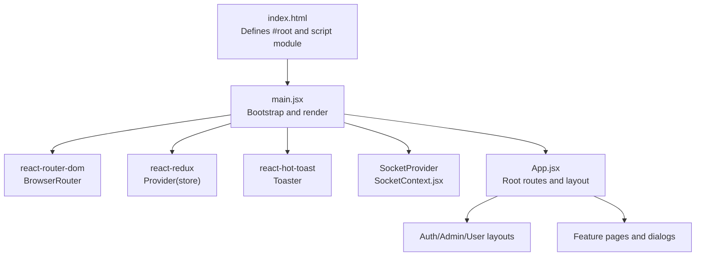
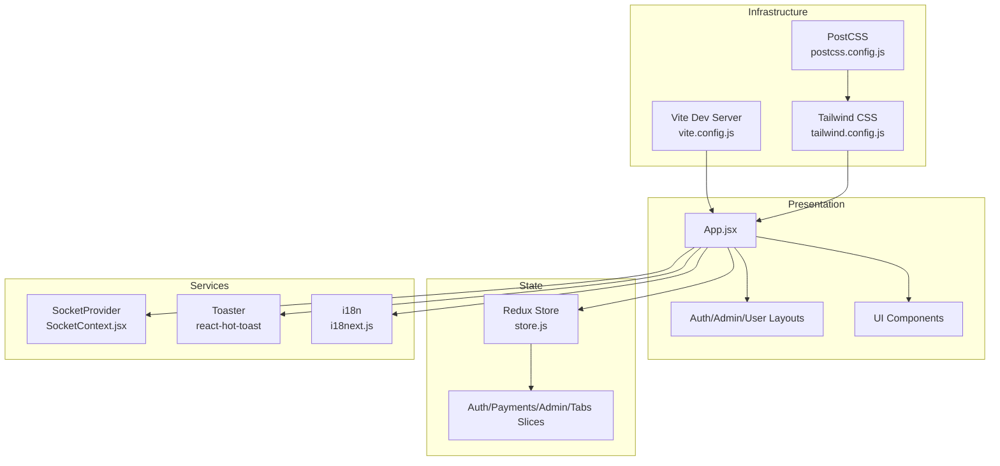
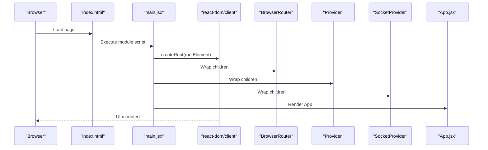
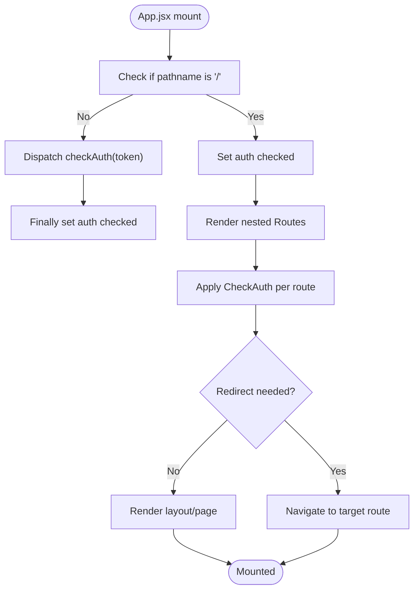
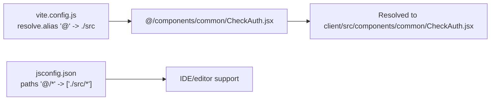
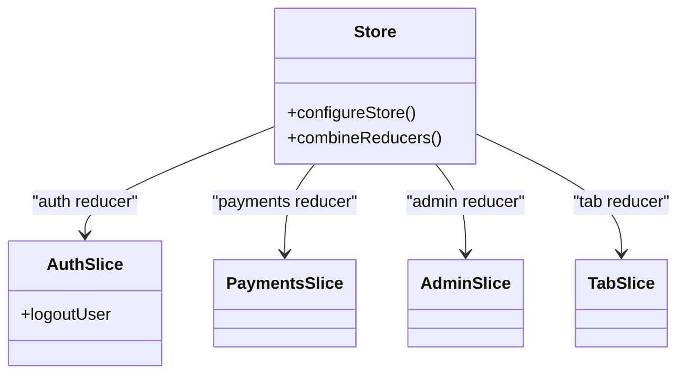
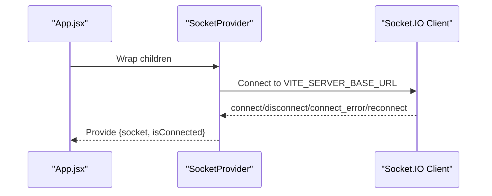
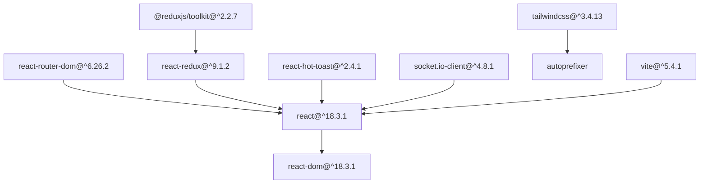

# React Application Structure

<cite>
**Referenced Files in This Document**
- [main.jsx](file://client/src/main.jsx)
- [App.jsx](file://client/src/App.jsx)
- [index.html](file://client/index.html)
- [vite.config.js](file://client/vite.config.js)
- [package.json](file://client/package.json)
- [jsconfig.json](file://client/jsconfig.json)
- [store.js](file://client/src/store/store.js)
- [SocketContext.jsx](file://client/src/context/SocketContext.jsx)
- [CheckAuth.jsx](file://client/src/components/common/CheckAuth.jsx)
- [i18next.js](file://client/src/utils/i18next.js)
- [index.css](file://client/src/index.css)
- [tailwind.config.js](file://client/tailwind.config.js)
- [postcss.config.js](file://client/postcss.config.js)
</cite>

## Table of Contents
1. [Introduction](#introduction)
2. [Project Structure](#project-structure)
3. [Core Components](#core-components)
4. [Architecture Overview](#architecture-overview)
5. [Detailed Component Analysis](#detailed-component-analysis)
6. [Dependency Analysis](#dependency-analysis)
7. [Performance Considerations](#performance-considerations)
8. [Troubleshooting Guide](#troubleshooting-guide)
9. [Conclusion](#conclusion)

## Introduction
This document explains the React application structure and entry point configuration for the Betting project. It covers the bootstrap process in main.jsx, the root component setup in App.jsx, and the HTML template configuration. It also documents JSX transformation via Vite, React version compatibility, development versus production configurations, module resolution and aliasing, application initialization sequence, routing and authentication guards, and strategies for code splitting and lazy loading to optimize performance.

## Project Structure
The client-side React application is organized around a modern Vite-based build pipeline with Tailwind CSS for styling and Redux Toolkit for state management. The entry point initializes providers for routing, state, notifications, and real-time communication, then renders the root App component into the DOM.

**Diagram sources**
- [index.html](file://client/index.html#L18-L22)
- [main.jsx](file://client/src/main.jsx#L1-L20)
- [App.jsx](file://client/src/App.jsx#L1-L114)
- [SocketContext.jsx](file://client/src/context/SocketContext.jsx#L14-L61)

**Section sources**
- [index.html](file://client/index.html#L1-L23)
- [main.jsx](file://client/src/main.jsx#L1-L20)
- [vite.config.js](file://client/vite.config.js#L1-L14)
- [package.json](file://client/package.json#L1-L70)

## Core Components
- Bootstrap entry point: Initializes providers and mounts the root component.
- Root component: Declares nested routes, applies authentication checks, and renders appropriate layouts.
- Store: Centralized Redux state with reducers and logout reset logic.
- Socket provider: Manages WebSocket connections and exposes connection state.
- Authentication guard: Redirects based on role and route context.
- Internationalization: Configures i18n resources and language persistence.

**Section sources**
- [main.jsx](file://client/src/main.jsx#L1-L20)
- [App.jsx](file://client/src/App.jsx#L1-L114)
- [store.js](file://client/src/store/store.js#L1-L26)
- [SocketContext.jsx](file://client/src/context/SocketContext.jsx#L1-L62)
- [CheckAuth.jsx](file://client/src/components/common/CheckAuth.jsx#L1-L44)
- [i18next.js](file://client/src/utils/i18next.js#L1-L691)

## Architecture Overview
The application follows a layered architecture:
- Presentation layer: React components and layouts.
- Routing layer: Nested routes with authentication guards.
- State layer: Redux slices integrated via Redux Toolkit.
- Services layer: Socket connections and toast notifications.
- Infrastructure: Vite build toolchain, Tailwind CSS, and environment-driven configuration.

**Diagram sources**
- [vite.config.js](file://client/vite.config.js#L1-L14)
- [tailwind.config.js](file://client/tailwind.config.js#L1-L85)
- [postcss.config.js](file://client/postcss.config.js#L1-L7)
- [App.jsx](file://client/src/App.jsx#L1-L114)
- [store.js](file://client/src/store/store.js#L1-L26)
- [SocketContext.jsx](file://client/src/context/SocketContext.jsx#L1-L62)
- [i18next.js](file://client/src/utils/i18next.js#L1-L691)

## Detailed Component Analysis

### Bootstrap and Root Rendering (main.jsx)
- Imports React DOM root, App, global CSS, routing, Redux Provider, toast notifier, and SocketProvider.
- Creates a root and renders the application tree inside BrowserRouter, Provider, SocketProvider, App, and Toaster.
- Ensures all context providers wrap the App component so child components can consume them.

**Diagram sources**
- [index.html](file://client/index.html#L18-L22)
- [main.jsx](file://client/src/main.jsx#L1-L20)

**Section sources**
- [main.jsx](file://client/src/main.jsx#L1-L20)
- [index.html](file://client/index.html#L18-L22)

### Root Component and Routing (App.jsx)
- Uses react-router-dom to define nested routes under "/", "/admin", "/user", and additional auth routes.
- Applies an authentication guard via CheckAuth to redirect unauthenticated or unauthorized users.
- Integrates internationalization initialization and displays a spinner while checking auth status.
- Renders feature-specific pages and dialogs under respective layouts.

**Diagram sources**
- [App.jsx](file://client/src/App.jsx#L27-L111)
- [CheckAuth.jsx](file://client/src/components/common/CheckAuth.jsx#L4-L41)

**Section sources**
- [App.jsx](file://client/src/App.jsx#L1-L114)
- [CheckAuth.jsx](file://client/src/components/common/CheckAuth.jsx#L1-L44)

### HTML Template Configuration (index.html)
- Provides the root container div with id "root".
- Loads the application entry point as an ES module script.
- Includes meta tags for SEO and viewport configuration.

**Section sources**
- [index.html](file://client/index.html#L1-L23)

### Module Resolution and Aliasing
- Vite resolves aliases via vite.config.js, mapping "@" to the src directory.
- JS configuration mirrors the same alias for editor support and TypeScript compatibility.
- This enables concise imports across the codebase.

**Diagram sources**
- [vite.config.js](file://client/vite.config.js#L8-L12)
- [jsconfig.json](file://client/jsconfig.json#L4-L8)

**Section sources**
- [vite.config.js](file://client/vite.config.js#L1-L14)
- [jsconfig.json](file://client/jsconfig.json#L1-L10)

### State Management (Redux)
- Combines reducers for auth, payments, admin, and tabs.
- Implements a root reducer that resets state on logout action.
- Configured store is passed to Provider at the root.

**Diagram sources**
- [store.js](file://client/src/store/store.js#L1-L26)

**Section sources**
- [store.js](file://client/src/store/store.js#L1-L26)

### Real-Time Communication (SocketProvider)
- Establishes a Socket.IO connection using environment variables.
- Tracks connection state and handles reconnect attempts.
- Exposes socket and connection status via context for child components.

**Diagram sources**
- [SocketContext.jsx](file://client/src/context/SocketContext.jsx#L14-L61)

**Section sources**
- [SocketContext.jsx](file://client/src/context/SocketContext.jsx#L1-L62)

### Internationalization (i18n)
- Initializes i18next with English and Spanish resources.
- Persists preferred language in localStorage and restores on load.
- Integrates with React via initReactI18next.

**Section sources**
- [i18next.js](file://client/src/utils/i18next.js#L1-L691)

### Styling Pipeline
- Tailwind CSS configured via tailwind.config.js with dark mode and custom animations.
- PostCSS pipeline enabled by postcss.config.js.
- Global styles imported in index.css using Tailwind directives.

**Section sources**
- [tailwind.config.js](file://client/tailwind.config.js#L1-L85)
- [postcss.config.js](file://client/postcss.config.js#L1-L7)
- [index.css](file://client/src/index.css#L1-L112)

## Dependency Analysis
The application relies on modern React ecosystem packages and Vite for development and build. The dependency graph highlights core runtime dependencies and their roles.

**Diagram sources**
- [package.json](file://client/package.json#L14-L52)

**Section sources**
- [package.json](file://client/package.json#L1-L70)

## Performance Considerations
- Code splitting and lazy loading: Use dynamic imports to split bundles by route. This reduces initial bundle size and improves time-to-first-byte and interactive metrics. Recommended pattern: import components with dynamic import inside route definitions.
- Environment-specific builds: Vite distinguishes development and production modes automatically; production builds minify and optimize assets.
- Asset optimization: Leverage Vite’s built-in image and asset handling; consider preloading critical fonts and icons.
- State normalization: Keep Redux slices focused and avoid unnecessary re-renders by selecting minimal state and using memoization.
- Network resilience: SocketProvider already implements reconnection; ensure retry limits and exponential backoff are tuned for your backend.

[No sources needed since this section provides general guidance]

## Troubleshooting Guide
- Root element missing: Ensure index.html contains a div with id "root" so the app can mount.
- Routing issues: Verify BrowserRouter wraps the entire app and routes are nested correctly under App.
- Redux state not persisting: Confirm Provider wraps the app and store is properly configured.
- Socket connection errors: Check VITE_SERVER_BASE_URL environment variable and network connectivity; review connection events and logs.
- Build failures: Validate Vite and plugin versions in package.json; ensure aliases are consistent between vite.config.js and jsconfig.json.

**Section sources**
- [index.html](file://client/index.html#L18-L22)
- [main.jsx](file://client/src/main.jsx#L10-L19)
- [store.js](file://client/src/store/store.js#L21-L23)
- [SocketContext.jsx](file://client/src/context/SocketContext.jsx#L19-L54)
- [vite.config.js](file://client/vite.config.js#L6-L13)
- [jsconfig.json](file://client/jsconfig.json#L4-L8)

## Conclusion
The Betting client application is structured around a clean React entry point, robust routing with authentication guards, centralized state management, and real-time communication. Vite provides efficient development and production builds, while Tailwind CSS ensures consistent styling. By adopting dynamic imports for code splitting and maintaining environment-driven configuration, the application achieves optimal performance and maintainability.