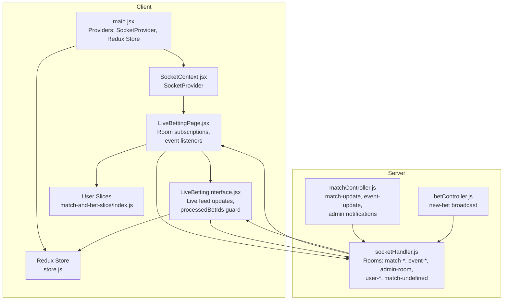
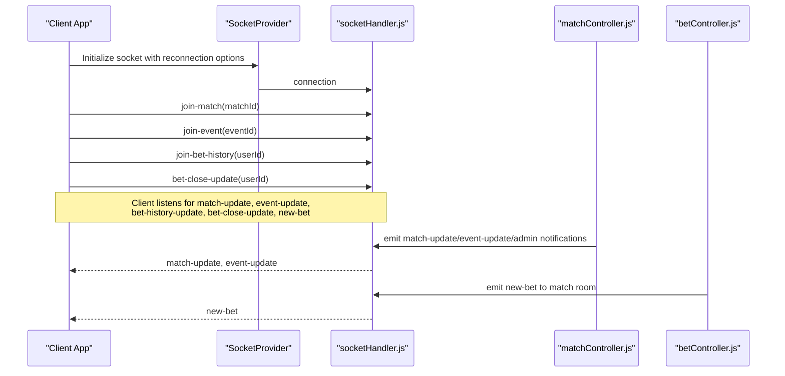
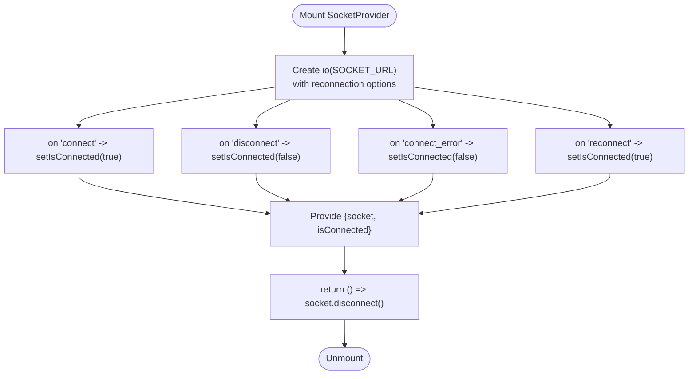
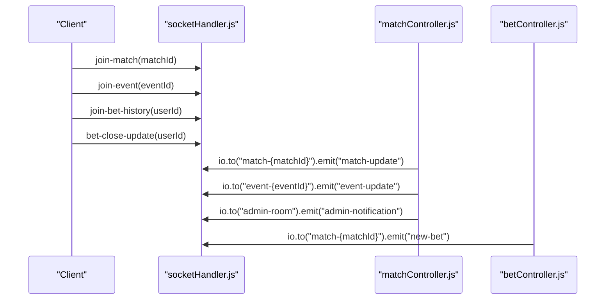
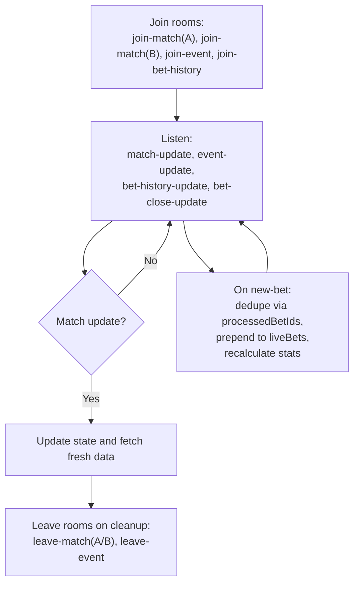
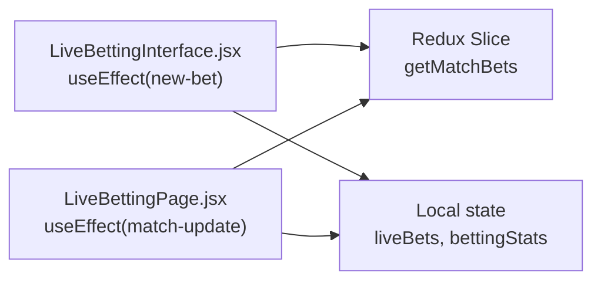
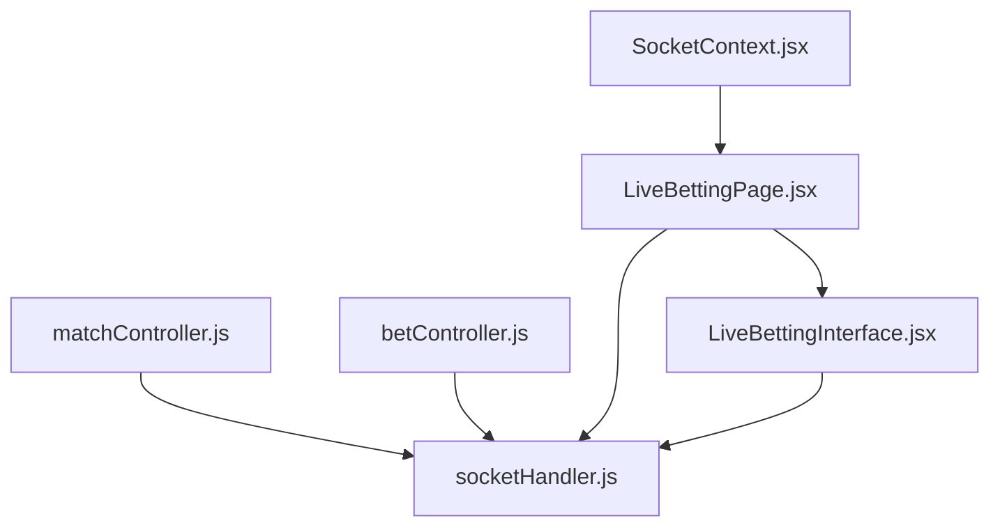

# Real-time Communication

<cite>
**Referenced Files in This Document**
- [SocketContext.jsx](file://client/src/context/SocketContext.jsx)
- [main.jsx](file://client/src/main.jsx)
- [LiveBettingPage.jsx](file://client/src/Pages/Bet/LiveBettingPage.jsx)
- [LiveBettingInterface.jsx](file://client/src/components/Bet/LiveBettingInterface.jsx)
- [socketHandler.js](file://server/socket/socketHandler.js)
- [matchController.js](file://server/controllers/admin/matchController.js)
- [betController.js](file://server/controllers/bet/betController.js)
- [store.js](file://client/src/store/store.js)
- [index.js](file://client/src/store/user/match-and-bet-slice/index.js)
</cite>

## Table of Contents
1. [Introduction](#introduction)
2. [Project Structure](#project-structure)
3. [Core Components](#core-components)
4. [Architecture Overview](#architecture-overview)
5. [Detailed Component Analysis](#detailed-component-analysis)
6. [Dependency Analysis](#dependency-analysis)
7. [Performance Considerations](#performance-considerations)
8. [Troubleshooting Guide](#troubleshooting-guide)
9. [Conclusion](#conclusion)

## Introduction
This document explains the Socket.IO integration and real-time communication architecture used for live betting. It covers the SocketContext provider setup, connection lifecycle management, event handling patterns, room-based communication, event broadcasting, client-side subscription management, error handling and reconnection strategies, graceful degradation, and how real-time updates trigger UI changes through Redux. It also includes performance considerations for high-frequency updates and memory leak prevention.

## Project Structure
The real-time system spans the client and server:
- Client-side provider and consumers: SocketContext, LiveBettingPage, LiveBettingInterface
- Server-side socket handler and controllers: socketHandler, matchController, betController
- State management: Redux store and slices

**Diagram sources**
- [main.jsx](file://client/src/main.jsx#L1-L20)
- [SocketContext.jsx](file://client/src/context/SocketContext.jsx#L1-L62)
- [LiveBettingPage.jsx](file://client/src/Pages/Bet/LiveBettingPage.jsx#L1-L408)
- [LiveBettingInterface.jsx](file://client/src/components/Bet/LiveBettingInterface.jsx#L1-L170)
- [socketHandler.js](file://server/socket/socketHandler.js#L1-L101)
- [matchController.js](file://server/controllers/admin/matchController.js#L1-L42)
- [betController.js](file://server/controllers/bet/betController.js#L1-L125)
- [store.js](file://client/src/store/store.js#L1-L26)
- [index.js](file://client/src/store/user/match-and-bet-slice/index.js#L1-L127)

**Section sources**
- [main.jsx](file://client/src/main.jsx#L1-L20)
- [SocketContext.jsx](file://client/src/context/SocketContext.jsx#L1-L62)
- [socketHandler.js](file://server/socket/socketHandler.js#L1-L101)

## Core Components
- SocketProvider: Creates and manages a Socket.IO client instance with reconnection settings, tracks connection state, and exposes socket and isConnected to consumers.
- Room management: Clients join match rooms (per matchId), event rooms (per event), admin room, and per-user history/close rooms. Controllers emit to specific rooms and optionally globally.
- Event handling: Clients listen for match-update, event-update, bet-history-update, bet-close-update, and new-bet. They also handle disconnect/connect/reconnect lifecycle.
- UI integration: LiveBettingPage subscribes to rooms and reacts to match and event updates. LiveBettingInterface renders live feeds and stats, deduplicating via processedBetIds.

**Section sources**
- [SocketContext.jsx](file://client/src/context/SocketContext.jsx#L14-L61)
- [socketHandler.js](file://server/socket/socketHandler.js#L9-L88)
- [LiveBettingPage.jsx](file://client/src/Pages/Bet/LiveBettingPage.jsx#L208-L408)
- [LiveBettingInterface.jsx](file://client/src/components/Bet/LiveBettingInterface.jsx#L110-L170)

## Architecture Overview
The system uses Socket.IO rooms to deliver targeted real-time updates:
- Clients join match rooms to receive per-match bets and match status changes.
- Clients join event rooms to receive updates for all matches in an event.
- Admin clients join admin rooms to receive administrative notifications.
- Per-user rooms receive personalized bet history and close/refund summaries.
- Controllers emit to specific rooms and optionally globally to ensure efficient delivery.

**Diagram sources**
- [SocketContext.jsx](file://client/src/context/SocketContext.jsx#L18-L54)
- [socketHandler.js](file://server/socket/socketHandler.js#L6-L88)
- [matchController.js](file://server/controllers/admin/matchController.js#L8-L40)
- [betController.js](file://server/controllers/bet/betController.js#L79-L96)
- [LiveBettingPage.jsx](file://client/src/Pages/Bet/LiveBettingPage.jsx#L208-L408)

## Detailed Component Analysis

### SocketContext Provider Setup and Lifecycle
- Provider creates a Socket.IO client with automatic reconnection, capped attempts/delay, and dual transport support.
- Listens to connect/disconnect/connect_error/reconnect to keep isConnected accurate.
- Exposes socket and isConnected to descendants.
- Disconnects on unmount to prevent leaks.

**Diagram sources**
- [SocketContext.jsx](file://client/src/context/SocketContext.jsx#L18-L54)

**Section sources**
- [SocketContext.jsx](file://client/src/context/SocketContext.jsx#L14-L61)

### Room-Based Communication and Broadcasting
- Rooms:
  - match-{matchId}: per-match live bets and match updates
  - event-{eventId}: all matches in an event
  - admin-room: administrative notifications
  - user-{userId}: per-user bet history and close updates
  - match-undefined: transitional room for newly created matches
- Server emits:
  - match-controller: match-update, event-update, admin notifications, global-match-update
  - bet-controller: new-bet to match room only
- Client joins/leaves rooms upon route changes and state updates.

**Diagram sources**
- [socketHandler.js](file://server/socket/socketHandler.js#L9-L88)
- [matchController.js](file://server/controllers/admin/matchController.js#L8-L40)
- [betController.js](file://server/controllers/bet/betController.js#L79-L96)

**Section sources**
- [socketHandler.js](file://server/socket/socketHandler.js#L9-L88)
- [matchController.js](file://server/controllers/admin/matchController.js#L8-L40)
- [betController.js](file://server/controllers/bet/betController.js#L79-L96)

### Client-Side Subscription Management
- LiveBettingPage:
  - Joins match rooms for both sections and the event room.
  - Subscribes to match-update, event-update, bet-history-update, bet-close-update.
  - Leaves rooms and removes listeners on unmount.
  - Handles dynamic room changes when new matches are created.
- LiveBettingInterface:
  - Subscribes to new-bet and match-update.
  - Uses processedBetIds to avoid duplicate processing of the same bet.
  - Updates live bets and stats incrementally.

**Diagram sources**
- [LiveBettingPage.jsx](file://client/src/Pages/Bet/LiveBettingPage.jsx#L208-L408)
- [LiveBettingInterface.jsx](file://client/src/components/Bet/LiveBettingInterface.jsx#L110-L170)

**Section sources**
- [LiveBettingPage.jsx](file://client/src/Pages/Bet/LiveBettingPage.jsx#L208-L408)
- [LiveBettingInterface.jsx](file://client/src/components/Bet/LiveBettingInterface.jsx#L110-L170)

### Event Handling Patterns
- Match updates:
  - Server emits match-update to match room and event room.
  - Client filters by current matchId and updates state, including completion tracking.
- Event updates:
  - Server emits event-update for match-created and status-changed.
  - Client handles dynamic room transitions when new matches appear.
- Bet placement:
  - Server emits new-bet to match room only.
  - Client appends new bets and recalculates stats.
- Personalized updates:
  - bet-history-update and bet-close-update delivered to user-specific room.

**Section sources**
- [matchController.js](file://server/controllers/admin/matchController.js#L8-L40)
- [betController.js](file://server/controllers/bet/betController.js#L79-L96)
- [LiveBettingPage.jsx](file://client/src/Pages/Bet/LiveBettingPage.jsx#L288-L395)
- [LiveBettingInterface.jsx](file://client/src/components/Bet/LiveBettingInterface.jsx#L110-L170)

### Integration with Redux for State Synchronization
- Redux store combines auth, payments, admin, and tab reducers.
- LiveBettingInterface uses Redux actions to fetch historical bets and calculate stats.
- Real-time updates complement Redux by keeping UI reactive to live changes without blocking synchronous state updates.

**Diagram sources**
- [LiveBettingInterface.jsx](file://client/src/components/Bet/LiveBettingInterface.jsx#L75-L99)
- [index.js](file://client/src/store/user/match-and-bet-slice/index.js#L116-L127)
- [store.js](file://client/src/store/store.js#L1-L26)

**Section sources**
- [store.js](file://client/src/store/store.js#L1-L26)
- [index.js](file://client/src/store/user/match-and-bet-slice/index.js#L116-L127)
- [LiveBettingInterface.jsx](file://client/src/components/Bet/LiveBettingInterface.jsx#L75-L99)

## Dependency Analysis
- Client depends on SocketContext for socket availability and connection state.
- LiveBettingPage orchestrates room subscriptions and event listeners.
- LiveBettingInterface focuses on rendering live data and incremental updates.
- Server controllers depend on socketHandler to emit to rooms.
- No circular dependencies observed between client and server modules.

**Diagram sources**
- [SocketContext.jsx](file://client/src/context/SocketContext.jsx#L1-L62)
- [LiveBettingPage.jsx](file://client/src/Pages/Bet/LiveBettingPage.jsx#L1-L408)
- [LiveBettingInterface.jsx](file://client/src/components/Bet/LiveBettingInterface.jsx#L1-L170)
- [socketHandler.js](file://server/socket/socketHandler.js#L1-L101)
- [matchController.js](file://server/controllers/admin/matchController.js#L1-L42)
- [betController.js](file://server/controllers/bet/betController.js#L1-L125)

**Section sources**
- [SocketContext.jsx](file://client/src/context/SocketContext.jsx#L1-L62)
- [LiveBettingPage.jsx](file://client/src/Pages/Bet/LiveBettingPage.jsx#L1-L408)
- [LiveBettingInterface.jsx](file://client/src/components/Bet/LiveBettingInterface.jsx#L1-L170)
- [socketHandler.js](file://server/socket/socketHandler.js#L1-L101)
- [matchController.js](file://server/controllers/admin/matchController.js#L1-L42)
- [betController.js](file://server/controllers/bet/betController.js#L1-L125)

## Performance Considerations
- Room targeting: Emit only to match-specific rooms to minimize network overhead.
- Incremental UI updates: LiveBettingInterface prepends new bets and recalculates stats incrementally to reduce render cost.
- Deduplication guard: processedBetIds prevents duplicate processing of the same bet across re-emissions or reconnects.
- Efficient listeners: Single listener per effect with precise filtering by matchId.
- Reconnection strategy: Controlled reconnection attempts and delays reduce server load during transient failures.
- Local caching: Initial fetch via Redux slice reduces redundant polling while maintaining live updates.

[No sources needed since this section provides general guidance]

## Troubleshooting Guide
- Connection lifecycle:
  - Monitor connect/disconnect/connect_error/reconnect events to detect and surface connection issues.
  - Use isConnected to disable controls or show connectivity indicators.
- Room mismatches:
  - Ensure clients leave old rooms before joining new ones when matches change dynamically.
  - Verify room names match server-side conventions (e.g., match-undefined for transitional states).
- Duplicate events:
  - Confirm processedBetIds guard is active and matchId filtering is applied in listeners.
- Listener leaks:
  - Always remove listeners in cleanup functions and ensure rooms are left on unmount.
- Server-side emissions:
  - Confirm controllers emit to correct rooms and avoid unnecessary global broadcasts.

**Section sources**
- [SocketContext.jsx](file://client/src/context/SocketContext.jsx#L29-L47)
- [LiveBettingPage.jsx](file://client/src/Pages/Bet/LiveBettingPage.jsx#L308-L341)
- [LiveBettingInterface.jsx](file://client/src/components/Bet/LiveBettingInterface.jsx#L115-L125)
- [socketHandler.js](file://server/socket/socketHandler.js#L74-L87)

## Conclusion
The Socket.IO integration leverages rooms for efficient, targeted real-time updates. The SocketProvider centralizes connection lifecycle and state exposure. Clients subscribe to relevant rooms and apply robust event handling with deduplication and cleanup to prevent leaks. Server controllers emit to precise rooms, ensuring scalability and responsiveness. Together with Redux, the system delivers synchronized, high-performance real-time experiences for live betting.