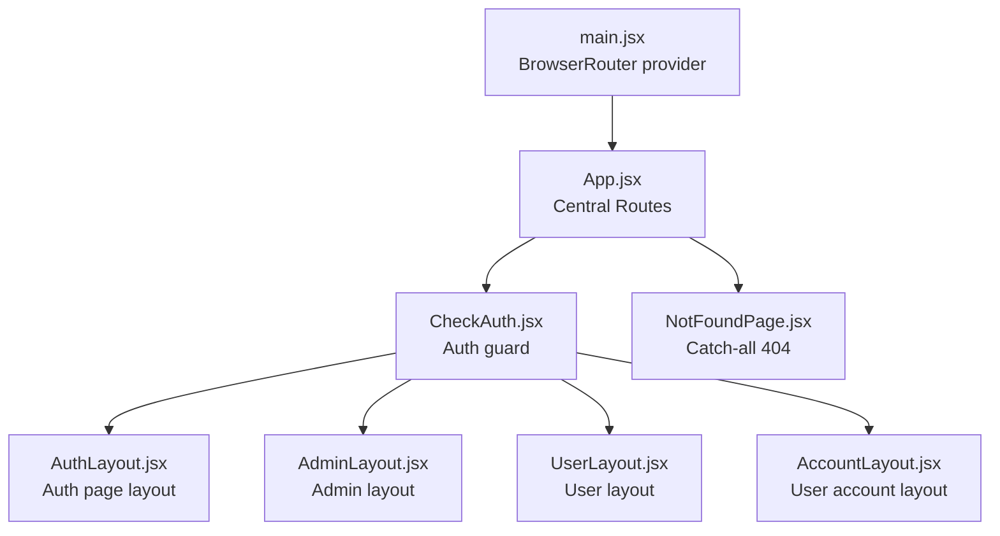
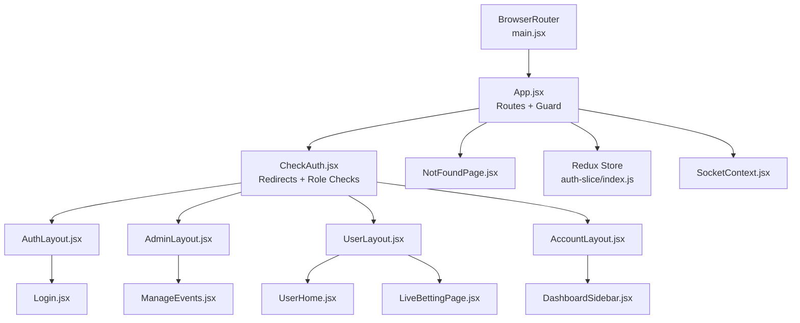
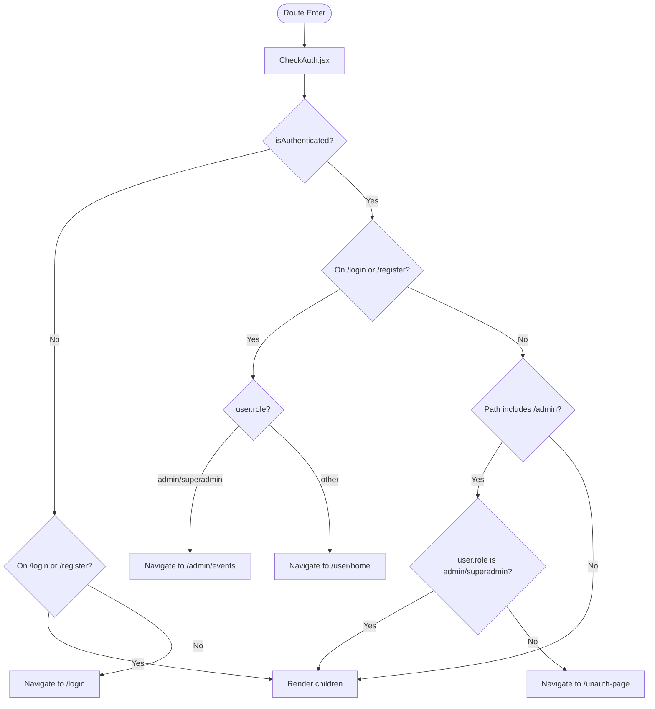
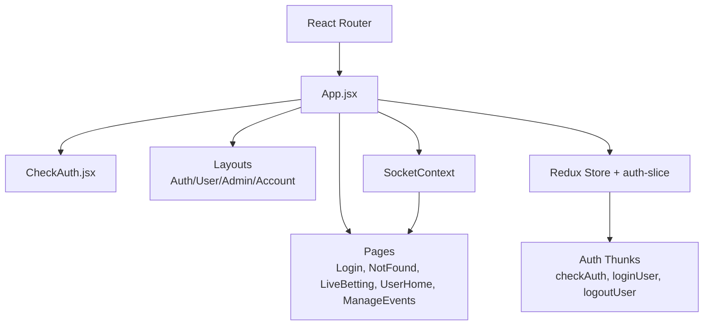

# Routing System

<cite>
**Referenced Files in This Document**
- [main.jsx](file://client/src/main.jsx)
- [App.jsx](file://client/src/App.jsx)
- [CheckAuth.jsx](file://client/src/components/common/CheckAuth.jsx)
- [AuthLayout.jsx](file://client/src/components/Auth/Layout.jsx)
- [AdminLayout.jsx](file://client/src/components/Admin/Layout.jsx)
- [UserLayout.jsx](file://client/src/components/User/Layout.jsx)
- [AccountLayout.jsx](file://client/src/components/User/AccountLayout.jsx)
- [NotFoundPage.jsx](file://client/src/Pages/NotFoundPage.jsx)
- [LiveBettingPage.jsx](file://client/src/Pages/Bet/LiveBettingPage.jsx)
- [Login.jsx](file://client/src/Pages/authPage/Login.jsx)
- [UserHome.jsx](file://client/src/Pages/User/Home.jsx)
- [ManageEvents.jsx](file://client/src/Pages/adminPage/ManageEvents.jsx)
- [DashboardSidebar.jsx](file://client/src/components/User/DashboardSidebar.jsx)
- [AdminSidebar.jsx](file://client/src/components/Admin/Sidebar.jsx)
- [auth-slice/index.js](file://client/src/store/auth-slice/index.js)
- [store.js](file://client/src/store/store.js)
- [SocketContext.jsx](file://client/src/context/SocketContext.jsx)
</cite>

## Table of Contents
1. [Introduction](#introduction)
2. [Project Structure](#project-structure)
3. [Core Components](#core-components)
4. [Architecture Overview](#architecture-overview)
5. [Detailed Component Analysis](#detailed-component-analysis)
6. [Dependency Analysis](#dependency-analysis)
7. [Performance Considerations](#performance-considerations)
8. [Troubleshooting Guide](#troubleshooting-guide)
9. [Conclusion](#conclusion)

## Introduction
This document explains the React Router-based navigation system used in the betting application. It covers route configuration, nested routing patterns, dynamic route parameters, authentication guards, role-based access control, lazy loading strategies, 404 handling, and navigation patterns. It also details how routes integrate with the authentication context and respond to authentication state changes.

## Project Structure
The routing system is initialized at the application root and configured centrally in the main application component. Layout components wrap nested routes to provide shared UI and outlet rendering. Authentication state is managed via Redux and enforced by a dedicated guard component.

**Diagram sources**
- [main.jsx](file://client/src/main.jsx#L1-L20)
- [App.jsx](file://client/src/App.jsx#L27-L114)
- [CheckAuth.jsx](file://client/src/components/common/CheckAuth.jsx#L4-L44)
- [AuthLayout.jsx](file://client/src/components/Auth/Layout.jsx#L8-L81)
- [AdminLayout.jsx](file://client/src/components/Admin/Layout.jsx#L6-L22)
- [UserLayout.jsx](file://client/src/components/User/Layout.jsx#L5-L19)
- [AccountLayout.jsx](file://client/src/components/User/AccountLayout.jsx#L6-L23)
- [NotFoundPage.jsx](file://client/src/Pages/NotFoundPage.jsx#L7-L61)

**Section sources**
- [main.jsx](file://client/src/main.jsx#L1-L20)
- [App.jsx](file://client/src/App.jsx#L27-L114)

## Core Components
- Central router and nested routes: The central App component defines top-level routes and nested routes under shared layouts. It also sets up a pre-authentication check and a loading state during initialization.
- Authentication guard: A reusable guard checks authentication state and redirects accordingly, including role-aware redirections.
- Layout wrappers: Dedicated layout components provide shared UI scaffolding around nested routes.
- 404 handling: A catch-all route renders a user-friendly not-found page.

Key implementation references:
- Central routing and nested routes: [App.jsx](file://client/src/App.jsx#L53-L108)
- Authentication guard logic: [CheckAuth.jsx](file://client/src/components/common/CheckAuth.jsx#L4-L44)
- Auth layout wrapper: [AuthLayout.jsx](file://client/src/components/Auth/Layout.jsx#L8-L81)
- Admin layout wrapper: [AdminLayout.jsx](file://client/src/components/Admin/Layout.jsx#L6-L22)
- User layout wrapper: [UserLayout.jsx](file://client/src/components/User/Layout.jsx#L5-L19)
- Account layout wrapper: [AccountLayout.jsx](file://client/src/components/User/AccountLayout.jsx#L6-L23)
- 404 page: [NotFoundPage.jsx](file://client/src/Pages/NotFoundPage.jsx#L7-L61)

**Section sources**
- [App.jsx](file://client/src/App.jsx#L27-L114)
- [CheckAuth.jsx](file://client/src/components/common/CheckAuth.jsx#L4-L44)
- [AuthLayout.jsx](file://client/src/components/Auth/Layout.jsx#L8-L81)
- [AdminLayout.jsx](file://client/src/components/Admin/Layout.jsx#L6-L22)
- [UserLayout.jsx](file://client/src/components/User/Layout.jsx#L5-L19)
- [AccountLayout.jsx](file://client/src/components/User/AccountLayout.jsx#L6-L23)
- [NotFoundPage.jsx](file://client/src/Pages/NotFoundPage.jsx#L7-L61)

## Architecture Overview
The routing architecture combines React Router with Redux for authentication state and a socket provider for real-time updates. The guard component ensures only authorized users reach protected areas, and role-based logic redirects users appropriately.

**Diagram sources**
- [main.jsx](file://client/src/main.jsx#L10-L19)
- [App.jsx](file://client/src/App.jsx#L27-L114)
- [CheckAuth.jsx](file://client/src/components/common/CheckAuth.jsx#L4-L44)
- [AuthLayout.jsx](file://client/src/components/Auth/Layout.jsx#L8-L81)
- [AdminLayout.jsx](file://client/src/components/Admin/Layout.jsx#L6-L22)
- [UserLayout.jsx](file://client/src/components/User/Layout.jsx#L5-L19)
- [AccountLayout.jsx](file://client/src/components/User/AccountLayout.jsx#L6-L23)
- [UserHome.jsx](file://client/src/Pages/User/Home.jsx#L7-L31)
- [DashboardSidebar.jsx](file://client/src/components/User/DashboardSidebar.jsx#L22-L248)
- [ManageEvents.jsx](file://client/src/Pages/adminPage/ManageEvents.jsx#L57-L201)
- [LiveBettingPage.jsx](file://client/src/Pages/Bet/LiveBettingPage.jsx#L19-L800)
- [Login.jsx](file://client/src/Pages/authPage/Login.jsx#L12-L221)
- [auth-slice/index.js](file://client/src/store/auth-slice/index.js#L100-L116)
- [SocketContext.jsx](file://client/src/context/SocketContext.jsx#L14-L62)

## Detailed Component Analysis

### Route Configuration and Nested Routing
- Root and nested routes: The central App component defines top-level routes and nests child routes under shared layouts. Examples include authentication pages under an auth layout, admin routes under an admin layout, user routes under user and account layouts, and a catch-all 404 route.
- Dynamic segments: A live betting route uses a dynamic segment for a top-level match identifier.
- Redirects on default page: On the root path, the app avoids redundant authentication checks and proceeds immediately.

References:
- [App.jsx](file://client/src/App.jsx#L53-L108)

**Section sources**
- [App.jsx](file://client/src/App.jsx#L53-L108)

### Authentication Guards and Role-Based Access Control
- Guard behavior: The guard checks whether a user is authenticated and redirects unauthenticated users to the login page. It also prevents authenticated users from accessing login/register and redirects them to appropriate dashboards based on role. It blocks access to admin routes for non-admin users and vice versa.
- Role-aware redirects: After login, users are redirected to either the admin dashboard or user home depending on role. Non-admin users attempting to access admin routes are redirected to a safe fallback.

References:
- [CheckAuth.jsx](file://client/src/components/common/CheckAuth.jsx#L4-L44)

**Diagram sources**
- [CheckAuth.jsx](file://client/src/components/common/CheckAuth.jsx#L4-L44)

**Section sources**
- [CheckAuth.jsx](file://client/src/components/common/CheckAuth.jsx#L4-L44)

### Protected Routes and Authentication State Integration
- Pre-authentication check: On non-root paths, the app dispatches a check-auth thunk to hydrate the Redux store with current user data before rendering routes. A loading indicator is shown until the check completes.
- Redux auth slice: The auth slice exposes thunks for login, logout, user retrieval, and check-auth. These are used by the guard and pages to manage authentication state and persist tokens.
- Logout behavior: The store root reducer resets state on logout, ensuring clean state after sign-out.

References:
- [App.jsx](file://client/src/App.jsx#L34-L43)
- [auth-slice/index.js](file://client/src/store/auth-slice/index.js#L100-L116)
- [store.js](file://client/src/store/store.js#L14-L23)

**Section sources**
- [App.jsx](file://client/src/App.jsx#L34-L43)
- [auth-slice/index.js](file://client/src/store/auth-slice/index.js#L100-L116)
- [store.js](file://client/src/store/store.js#L14-L23)

### Dynamic Route Parameters
- Live betting route: The live betting route includes a dynamic segment for a top-level match identifier. The page extracts this parameter from the URL to load the correct match data and subscribe to real-time updates.
- Parameter extraction: The page reads the path segment containing the dynamic parameter and uses it to fetch match data and join socket rooms.

References:
- [App.jsx](file://client/src/App.jsx#L90-L90)
- [LiveBettingPage.jsx](file://client/src/Pages/Bet/LiveBettingPage.jsx#L38-L106)

**Section sources**
- [App.jsx](file://client/src/App.jsx#L90-L90)
- [LiveBettingPage.jsx](file://client/src/Pages/Bet/LiveBettingPage.jsx#L38-L106)

### Layout Wrappers and Navigation Patterns
- Auth layout: Provides a split-pane auth page with a banner and form area, rendering nested auth routes inside an outlet.
- Admin layout: Renders a responsive admin interface with header and sidebar, and an outlet for nested admin routes.
- User layout: Provides a header and outlet for user routes.
- Account layout: Offers a sidebar and header for user account pages, with an outlet for nested account routes.

References:
- [AuthLayout.jsx](file://client/src/components/Auth/Layout.jsx#L8-L81)
- [AdminLayout.jsx](file://client/src/components/Admin/Layout.jsx#L6-L22)
- [UserLayout.jsx](file://client/src/components/User/Layout.jsx#L5-L19)
- [AccountLayout.jsx](file://client/src/components/User/AccountLayout.jsx#L6-L23)

**Section sources**
- [AuthLayout.jsx](file://client/src/components/Auth/Layout.jsx#L8-L81)
- [AdminLayout.jsx](file://client/src/components/Admin/Layout.jsx#L6-L22)
- [UserLayout.jsx](file://client/src/components/User/Layout.jsx#L5-L19)
- [AccountLayout.jsx](file://client/src/components/User/AccountLayout.jsx#L6-L23)

### 404 Error Handling
- Catch-all route: A wildcard route renders a dedicated not-found page with navigation options to go back or return to the home page.
- UX: The page includes friendly messaging and buttons to guide users back to known areas.

References:
- [App.jsx](file://client/src/App.jsx#L107-L107)
- [NotFoundPage.jsx](file://client/src/Pages/NotFoundPage.jsx#L7-L61)

**Section sources**
- [App.jsx](file://client/src/App.jsx#L107-L107)
- [NotFoundPage.jsx](file://client/src/Pages/NotFoundPage.jsx#L7-L61)

### Route Transitions and Navigation Patterns
- Programmatic navigation: Pages and components use programmatic navigation to redirect users after actions (e.g., login, logout, placing bets).
- Sidebar-driven navigation: Both admin and user dashboards provide navigation to different sections, with active state tracking and URL parameter handling.
- Real-time navigation aids: The live betting page uses navigation to guide users to the wallet when insufficient balance is detected.

References:
- [Login.jsx](file://client/src/Pages/authPage/Login.jsx#L172-L196)
- [DashboardSidebar.jsx](file://client/src/components/User/DashboardSidebar.jsx#L22-L248)
- [AdminSidebar.jsx](file://client/src/components/Admin/Sidebar.jsx#L37-L177)
- [LiveBettingPage.jsx](file://client/src/Pages/Bet/LiveBettingPage.jsx#L446-L460)

**Section sources**
- [Login.jsx](file://client/src/Pages/authPage/Login.jsx#L172-L196)
- [DashboardSidebar.jsx](file://client/src/components/User/DashboardSidebar.jsx#L22-L248)
- [AdminSidebar.jsx](file://client/src/components/Admin/Sidebar.jsx#L37-L177)
- [LiveBettingPage.jsx](file://client/src/Pages/Bet/LiveBettingPage.jsx#L446-L460)

### Integration with Authentication Context and State Changes
- Socket integration: The socket provider supplies a connected socket instance to components, enabling real-time updates for live betting and admin dashboards.
- Auth state changes: The guard reacts to authentication state changes and redirects accordingly. The store’s logout action clears state and tokens, ensuring routes reflect the updated state.

References:
- [SocketContext.jsx](file://client/src/context/SocketContext.jsx#L14-L62)
- [auth-slice/index.js](file://client/src/store/auth-slice/index.js#L117-L130)
- [store.js](file://client/src/store/store.js#L14-L23)

**Section sources**
- [SocketContext.jsx](file://client/src/context/SocketContext.jsx#L14-L62)
- [auth-slice/index.js](file://client/src/store/auth-slice/index.js#L117-L130)
- [store.js](file://client/src/store/store.js#L14-L23)

### Lazy Loading and Route-Based Code Splitting
- Current state: The routing configuration imports page components directly at the top level of the central router. There is no explicit React.lazy usage demonstrated in the provided files.
- Recommended approach: To enable lazy loading and route-based code splitting, replace direct imports with dynamic imports using React.lazy and Suspense around the router. This reduces initial bundle size and improves perceived performance for less-frequently visited routes.

[No sources needed since this section provides general guidance]

## Dependency Analysis
The routing system depends on:
- React Router for routing primitives and guards.
- Redux for authentication state and thunks.
- Socket.IO for real-time updates integrated via a context provider.
- Layout components that depend on outlets to render nested routes.

**Diagram sources**
- [App.jsx](file://client/src/App.jsx#L27-L114)
- [CheckAuth.jsx](file://client/src/components/common/CheckAuth.jsx#L4-L44)
- [AuthLayout.jsx](file://client/src/components/Auth/Layout.jsx#L8-L81)
- [AdminLayout.jsx](file://client/src/components/Admin/Layout.jsx#L6-L22)
- [UserLayout.jsx](file://client/src/components/User/Layout.jsx#L5-L19)
- [AccountLayout.jsx](file://client/src/components/User/AccountLayout.jsx#L6-L23)
- [Login.jsx](file://client/src/Pages/authPage/Login.jsx#L12-L221)
- [NotFoundPage.jsx](file://client/src/Pages/NotFoundPage.jsx#L7-L61)
- [LiveBettingPage.jsx](file://client/src/Pages/Bet/LiveBettingPage.jsx#L19-L800)
- [UserHome.jsx](file://client/src/Pages/User/Home.jsx#L7-L31)
- [ManageEvents.jsx](file://client/src/Pages/adminPage/ManageEvents.jsx#L57-L201)
- [auth-slice/index.js](file://client/src/store/auth-slice/index.js#L100-L116)
- [SocketContext.jsx](file://client/src/context/SocketContext.jsx#L14-L62)

**Section sources**
- [App.jsx](file://client/src/App.jsx#L27-L114)
- [auth-slice/index.js](file://client/src/store/auth-slice/index.js#L100-L116)
- [SocketContext.jsx](file://client/src/context/SocketContext.jsx#L14-L62)

## Performance Considerations
- Initial hydration: The pre-authentication check on non-root paths ensures the app has user data before rendering protected routes, preventing unnecessary redirects and improving UX.
- Bundle size: Introducing React.lazy for route components would reduce initial payload and improve first-load performance.
- Real-time updates: Socket connections are established early and cleaned up on component unmount to avoid leaks and excessive reconnect attempts.

[No sources needed since this section provides general guidance]

## Troubleshooting Guide
- Stuck on loader: If the app remains in a loading state, verify the pre-authentication check resolves and the Redux auth slice fulfills the check-auth thunk.
- Unexpected redirects: Confirm the guard logic and user role values. Ensure the auth slice updates state correctly after login/logout.
- 404 page not rendering: Verify the catch-all route is defined last and not shadowed by earlier routes.
- Socket disconnections: Check the socket provider’s connection lifecycle and error handlers.

**Section sources**
- [App.jsx](file://client/src/App.jsx#L34-L50)
- [auth-slice/index.js](file://client/src/store/auth-slice/index.js#L100-L116)
- [SocketContext.jsx](file://client/src/context/SocketContext.jsx#L18-L54)

## Conclusion
The routing system centers on a clear separation of concerns: a central router with nested layouts, a robust authentication guard enforcing both authentication and role-based access, and a Redux-backed auth state. While the current configuration provides strong functionality, adopting route-based code splitting via lazy loading would further enhance performance. The integration with the socket provider enables real-time features, and the guard ensures secure navigation across roles.