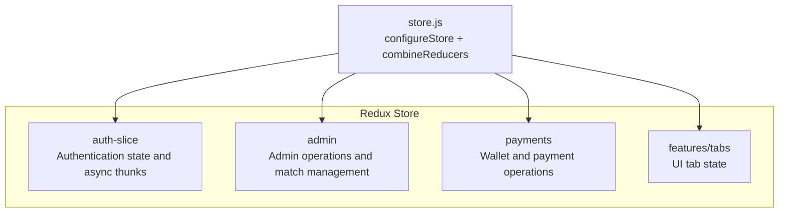
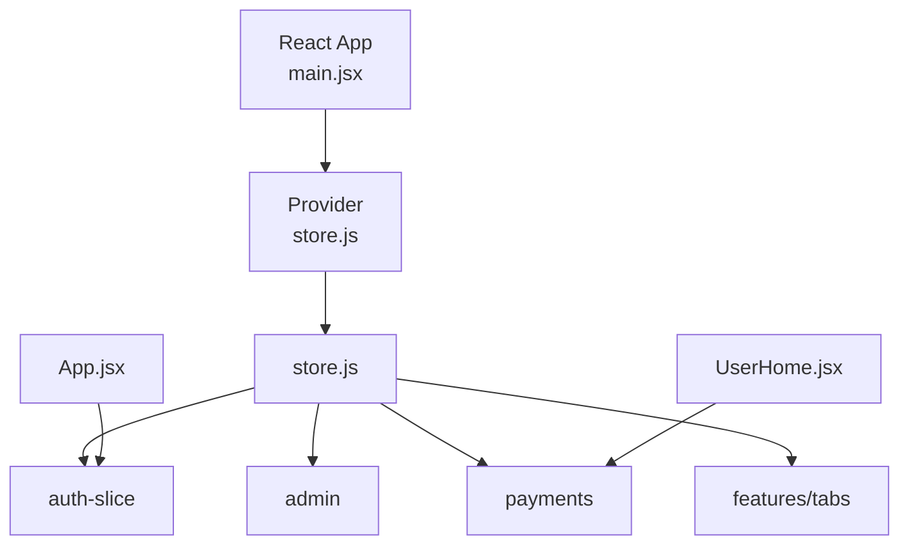
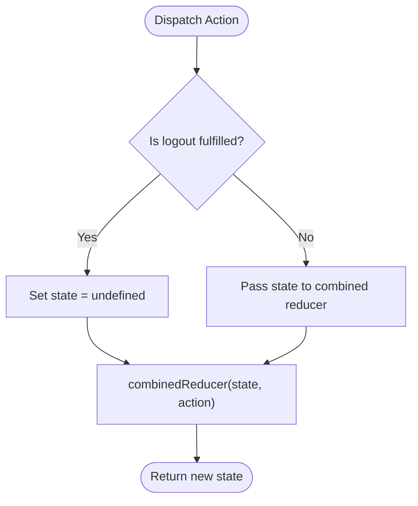
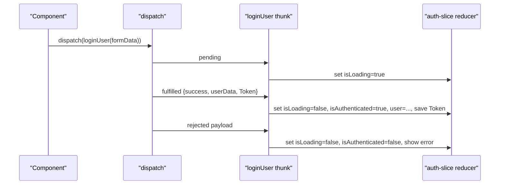
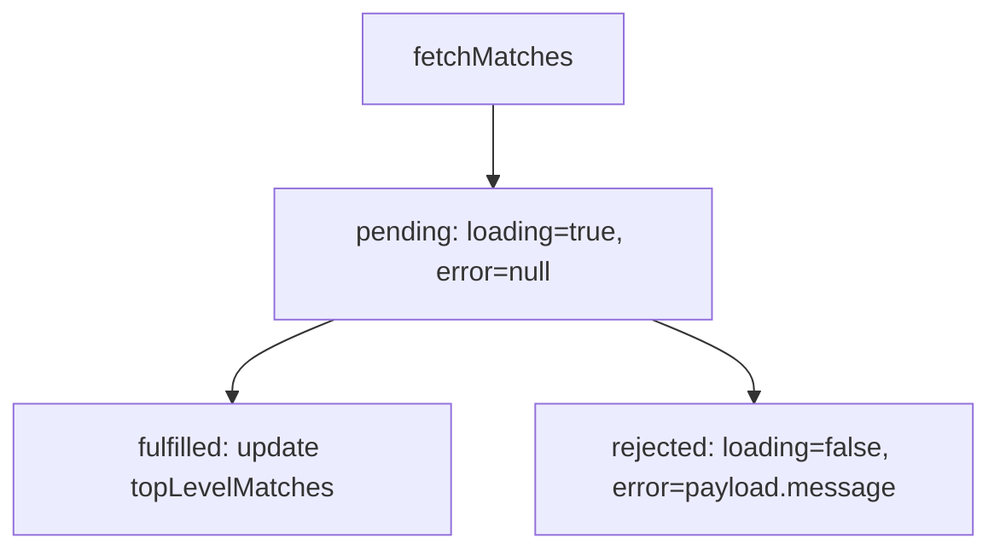
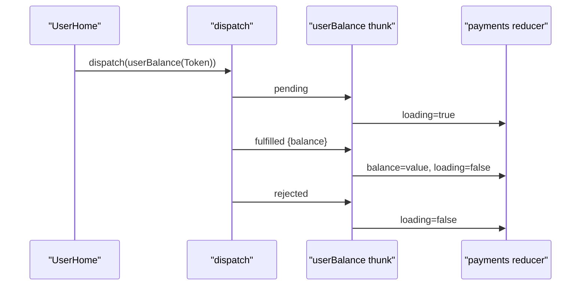
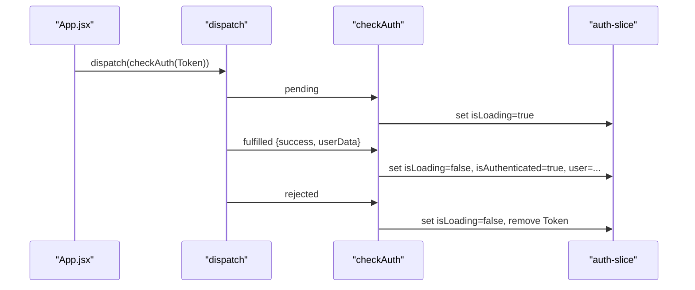
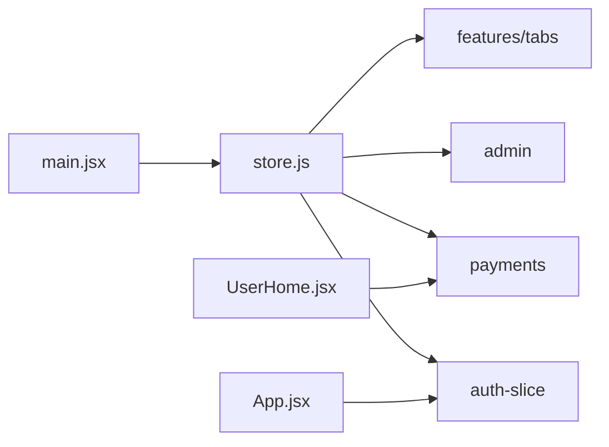

# State Management with Redux

<cite>
**Referenced Files in This Document**
- [store.js](file://client/src/store/store.js)
- [auth-slice/index.js](file://client/src/store/auth-slice/index.js)
- [admin/index.js](file://client/src/store/admin/index.js)
- [payment-slice/index.js](file://client/src/store/user/payment-slice/index.js)
- [tabSlice.js](file://client/src/store/features/tabs/tabSlice.js)
- [main.jsx](file://client/src/main.jsx)
- [App.jsx](file://client/src/App.jsx)
- [UserHome.jsx](file://client/src/Pages/User/Home.jsx)
- [package.json](file://client/package.json)
</cite>

## Table of Contents
1. [Introduction](#introduction)
2. [Project Structure](#project-structure)
3. [Core Components](#core-components)
4. [Architecture Overview](#architecture-overview)
5. [Detailed Component Analysis](#detailed-component-analysis)
6. [Dependency Analysis](#dependency-analysis)
7. [Performance Considerations](#performance-considerations)
8. [Troubleshooting Guide](#troubleshooting-guide)
9. [Conclusion](#conclusion)
10. [Appendices](#appendices)

## Introduction
This document explains the Redux Toolkit state management architecture used in the betting application. It covers store configuration, slice creation patterns, reducer organization, async thunks for API interactions, loading/error handling, selector usage, state normalization considerations, performance optimizations, persistence strategies, dev tools integration, debugging techniques, and React component integration via hooks. The goal is to help developers understand how state flows through the app and how to extend or maintain it effectively.

## Project Structure
The state management is organized under a single store that composes multiple slices:
- Authentication slice handles registration, login, OTP verification, user retrieval, and logout.
- Admin slice manages platform statistics, match CRUD operations, user management, and bets retrieval.
- Payments slice manages user balance, deposits, withdrawals, transactions, and payment approvals.
- Tabs slice maintains UI state for active tab selection.
- The store is configured in a central file and wired into the React app via the Redux Provider.

**Diagram sources**
- [store.js](file://client/src/store/store.js#L1-L25)
- [auth-slice/index.js](file://client/src/store/auth-slice/index.js#L1-L342)
- [admin/index.js](file://client/src/store/admin/index.js#L1-L334)
- [payment-slice/index.js](file://client/src/store/user/payment-slice/index.js#L1-L344)
- [tabSlice.js](file://client/src/store/features/tabs/tabSlice.js#L1-L17)

**Section sources**
- [store.js](file://client/src/store/store.js#L1-L25)
- [main.jsx](file://client/src/main.jsx#L1-L20)

## Core Components
- Store configuration: Centralized store with a root reducer that resets state on logout.
- Slice composition: Each domain (auth, admin, payments, tabs) encapsulates its own state, reducers, and async thunks.
- Async thunks: Standardized patterns for pending/fulfilled/rejected handling and error propagation via rejectWithValue.
- Selectors: Components consume normalized or flat state via useSelector for minimal re-renders.

Key implementation patterns:
- Root reducer clears state upon logout fulfillment.
- Thunks encapsulate network requests and surface errors via payload.
- Reducers update loading flags and data fields consistently.

**Section sources**
- [store.js](file://client/src/store/store.js#L14-L23)
- [auth-slice/index.js](file://client/src/store/auth-slice/index.js#L257-L342)
- [admin/index.js](file://client/src/store/admin/index.js#L310-L334)
- [payment-slice/index.js](file://client/src/store/user/payment-slice/index.js#L323-L344)
- [tabSlice.js](file://client/src/store/features/tabs/tabSlice.js#L4-L17)

## Architecture Overview
The store integrates with React through Provider. Components dispatch thunks to fetch or mutate data and subscribe to relevant slices using useSelector. Authentication checks occur on app initialization, and UI state (tabs) is kept separate from domain data.

**Diagram sources**
- [main.jsx](file://client/src/main.jsx#L10-L19)
- [store.js](file://client/src/store/store.js#L1-L25)
- [UserHome.jsx](file://client/src/Pages/User/Home.jsx#L1-L31)
- [App.jsx](file://client/src/App.jsx#L27-L43)

## Detailed Component Analysis

### Store Configuration and Root Reducer
- Combines domain reducers into a single root reducer.
- Resets entire state to undefined when logout fulfillment is dispatched, ensuring clean session cleanup.
- Uses Redux Toolkit’s configureStore with a custom reducer pipeline.

**Diagram sources**
- [store.js](file://client/src/store/store.js#L14-L19)

**Section sources**
- [store.js](file://client/src/store/store.js#L1-L25)

### Authentication Slice
Responsibilities:
- Registration, login, OTP resend/verification, user retrieval, logout, and password management.
- Loading flags and OTP dialog visibility.
- Persisted token stored locally after login.

Async thunk pattern:
- Pending: set isLoading true.
- Fulfilled: update authentication status, user data, and persist token; handle OTP flow.
- Rejected: reset loading and authentication state; show error notifications.

**Diagram sources**
- [auth-slice/index.js](file://client/src/store/auth-slice/index.js#L49-L63)
- [auth-slice/index.js](file://client/src/store/auth-slice/index.js#L282-L304)

**Section sources**
- [auth-slice/index.js](file://client/src/store/auth-slice/index.js#L1-L342)
- [App.jsx](file://client/src/App.jsx#L27-L43)

### Admin Slice
Responsibilities:
- Fetch top-level matches and manage sub-matches.
- Upload thumbnails with progress tracking.
- Platform statistics and summaries.
- User management operations (role, balance) and bet settlement/status updates.
- Retrieve bets by match ID.

Async thunk pattern:
- Pending: set loading true and clear error.
- Fulfilled: replace or update lists and entities.
- Rejected: set loading false and capture error message.

**Diagram sources**
- [admin/index.js](file://client/src/store/admin/index.js#L10-L22)
- [admin/index.js](file://client/src/store/admin/index.js#L314-L327)

**Section sources**
- [admin/index.js](file://client/src/store/admin/index.js#L1-L334)

### Payments Slice
Responsibilities:
- User balance retrieval.
- Deposit, withdrawal, and transaction history.
- Payment screenshot upload with progress callbacks and robust error messaging.
- Admin payment operations (approve/reject, stats, pending).

Async thunk pattern:
- Pending: set loading true.
- Fulfilled: update balance and clear loading.
- Rejected: clear loading.

**Diagram sources**
- [payment-slice/index.js](file://client/src/store/user/payment-slice/index.js#L12-L32)
- [payment-slice/index.js](file://client/src/store/user/payment-slice/index.js#L327-L339)
- [UserHome.jsx](file://client/src/Pages/User/Home.jsx#L7-L16)

**Section sources**
- [payment-slice/index.js](file://client/src/store/user/payment-slice/index.js#L1-L344)
- [UserHome.jsx](file://client/src/Pages/User/Home.jsx#L1-L31)

### Tabs Slice
Responsibilities:
- Maintain active tab state for UI navigation.

Usage:
- Dispatch setActiveTab to update current tab.
- Consume state via useSelector in components.

**Section sources**
- [tabSlice.js](file://client/src/store/features/tabs/tabSlice.js#L1-L17)

### Selector Patterns and Component Integration
- Components import useDispatch and useSelector from react-redux.
- App-level selectors extract authentication and user data; pages select payments and tab state.
- Dispatch patterns:
  - App initializes by dispatching checkAuth on route changes (except default page).
  - UserHome triggers userBalance on mount.

**Diagram sources**
- [App.jsx](file://client/src/App.jsx#L27-L43)
- [auth-slice/index.js](file://client/src/store/auth-slice/index.js#L100-L116)
- [auth-slice/index.js](file://client/src/store/auth-slice/index.js#L319-L332)

**Section sources**
- [App.jsx](file://client/src/App.jsx#L1-L114)
- [UserHome.jsx](file://client/src/Pages/User/Home.jsx#L1-L31)

## Dependency Analysis
- Store depends on four reducers: auth, payments, admin, and tabs.
- Root reducer conditionally resets state on logout fulfillment.
- Components depend on react-redux hooks and Redux Toolkit utilities.

**Diagram sources**
- [main.jsx](file://client/src/main.jsx#L10-L19)
- [store.js](file://client/src/store/store.js#L1-L25)
- [App.jsx](file://client/src/App.jsx#L27-L43)
- [UserHome.jsx](file://client/src/Pages/User/Home.jsx#L7-L16)

**Section sources**
- [store.js](file://client/src/store/store.js#L1-L25)
- [package.json](file://client/package.json#L30-L48)

## Performance Considerations
- Prefer fine-grained selectors to avoid unnecessary re-renders. While the codebase does not currently use createSelector, adopting it would enable memoized selectors for derived data and reduce recomputation.
- Keep state normalized where appropriate (e.g., lists keyed by ID) to minimize deep comparisons.
- Debounce or batch frequent UI updates (e.g., progress callbacks) to avoid excessive renders.
- Avoid storing large transient UI flags in global state; keep them in component state when possible.

[No sources needed since this section provides general guidance]

## Troubleshooting Guide
Common issues and resolutions:
- Authentication state not updating after logout:
  - Verify logout fulfillment resets state and removes persisted token.
- Network timeouts or large file uploads:
  - Thunks set explicit timeouts and provide detailed error messages; inspect rejected payloads for actionable messages.
- Toast notifications:
  - Success and error notifications are surfaced via toasts during login, OTP resend, and other async flows.

**Section sources**
- [store.js](file://client/src/store/store.js#L14-L19)
- [auth-slice/index.js](file://client/src/store/auth-slice/index.js#L29-L47)
- [payment-slice/index.js](file://client/src/store/user/payment-slice/index.js#L75-L101)
- [admin/index.js](file://client/src/store/admin/index.js#L56-L82)

## Conclusion
The Redux Toolkit architecture cleanly separates concerns across slices, uses async thunks for predictable async flows, and integrates tightly with React via hooks. The store’s root reducer ensures clean session resets, while components selectively subscribe to state slices. Adopting memoized selectors and normalization can further improve performance. The existing patterns provide a strong foundation for extending features and maintaining reliability.

[No sources needed since this section summarizes without analyzing specific files]

## Appendices

### Async Thunk Lifecycle Reference
- Pending: Set loading flags.
- Fulfilled: Update entity lists or fields; persist tokens when applicable.
- Rejected: Clear loading flags; propagate error messages via rejectWithValue.

**Section sources**
- [auth-slice/index.js](file://client/src/store/auth-slice/index.js#L265-L341)
- [admin/index.js](file://client/src/store/admin/index.js#L314-L330)
- [payment-slice/index.js](file://client/src/store/user/payment-slice/index.js#L327-L339)

### Persistence and Dev Tools
- Local storage token persistence for authentication.
- No explicit Redux DevTools extension configuration detected; browser extension can be used for inspection if desired.

**Section sources**
- [auth-slice/index.js](file://client/src/store/auth-slice/index.js#L290-L291)
- [payment-slice/index.js](file://client/src/store/user/payment-slice/index.js#L9-L10)