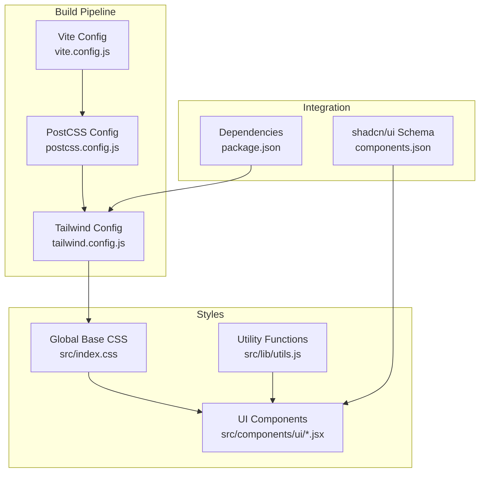
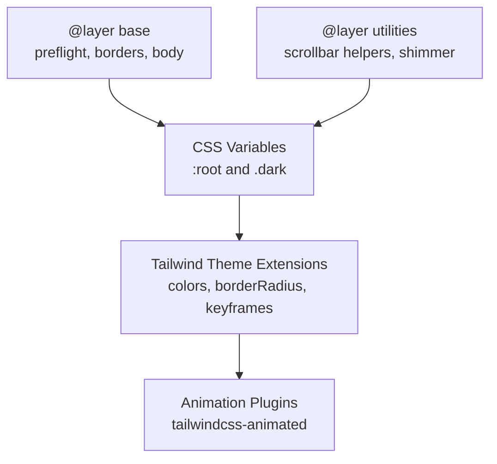
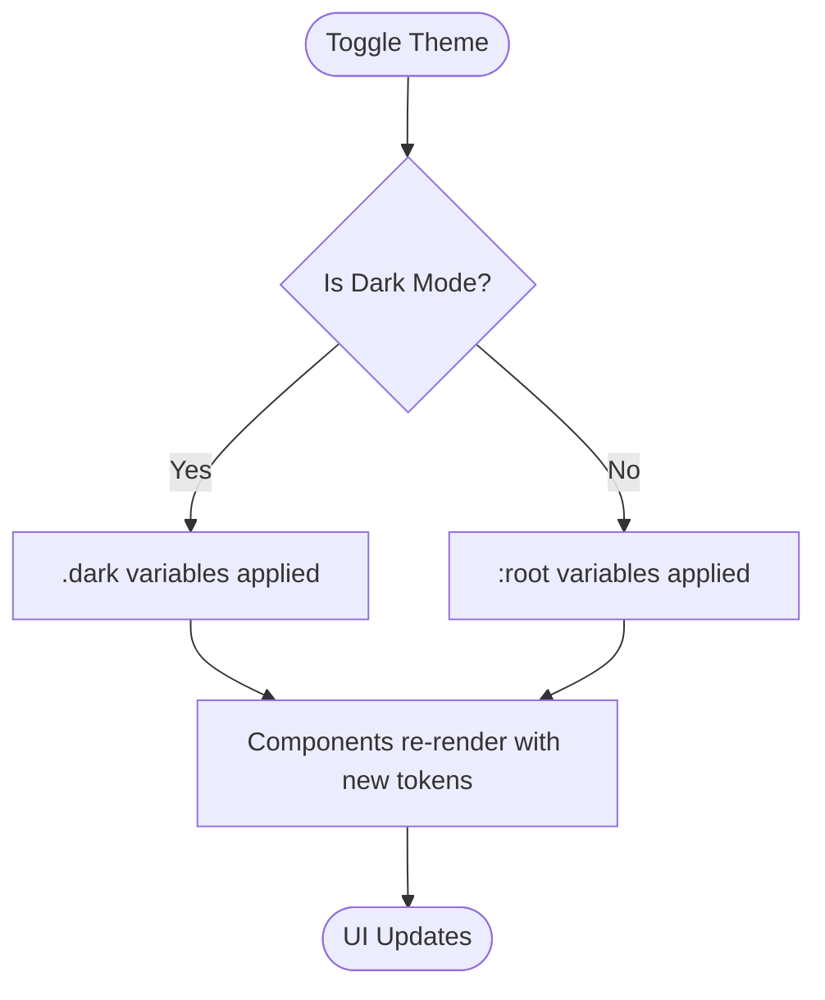
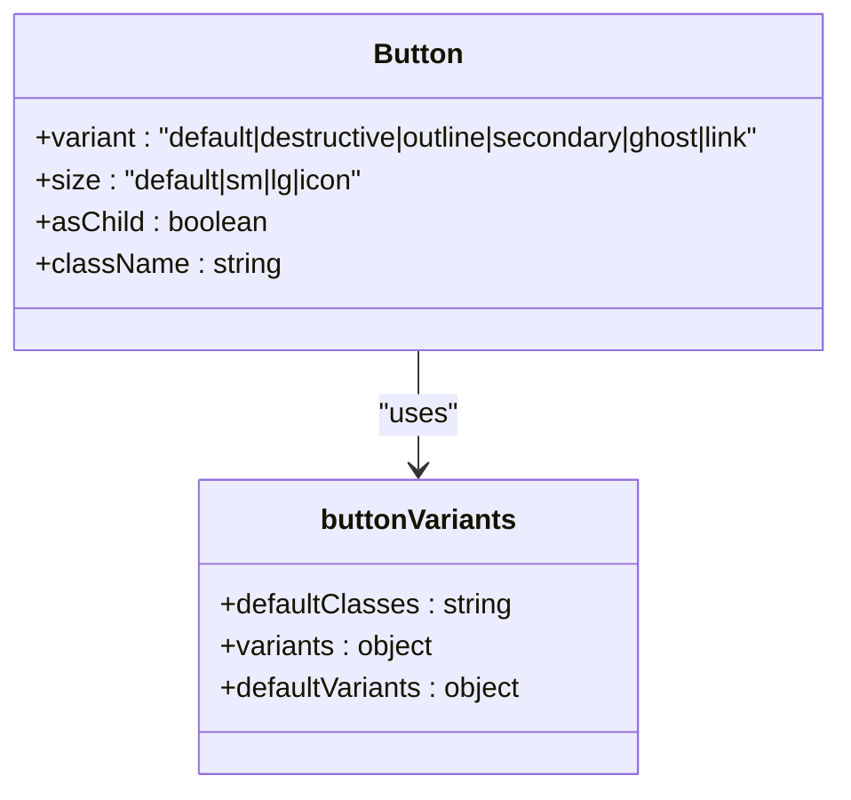
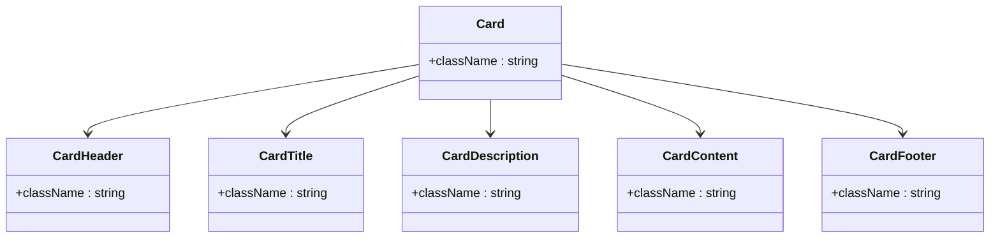
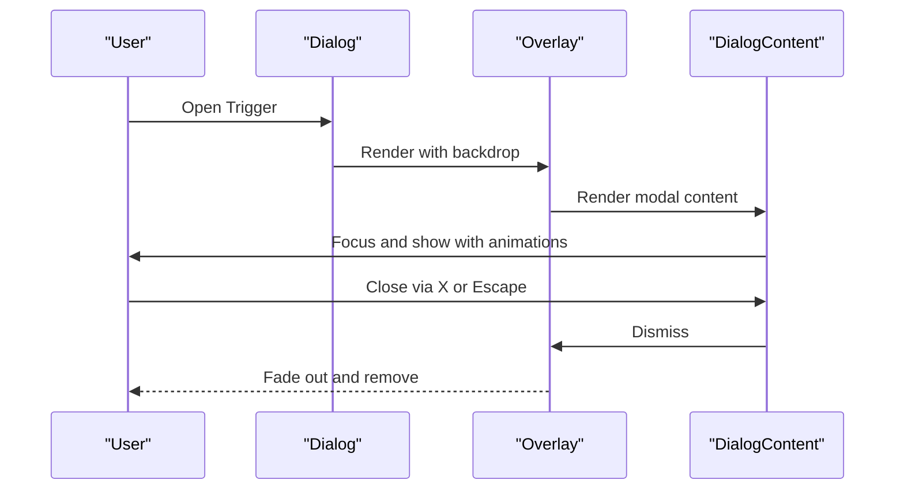
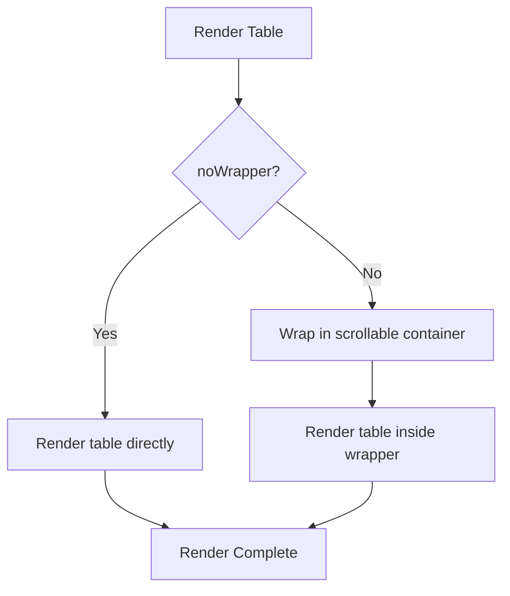
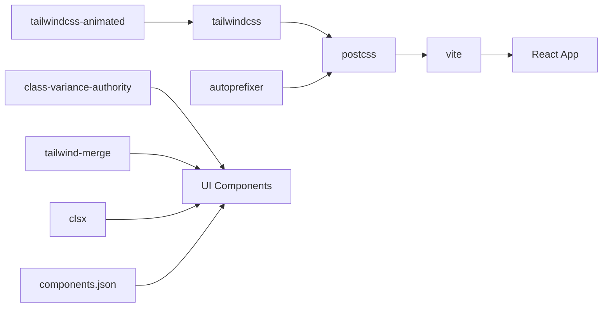

# Styling and Theming

<cite>
**Referenced Files in This Document**
- [tailwind.config.js](file://client/tailwind.config.js)
- [index.css](file://client/src/index.css)
- [postcss.config.js](file://client/postcss.config.js)
- [vite.config.js](file://client/vite.config.js)
- [package.json](file://client/package.json)
- [components.json](file://client/components.json)
- [utils.js](file://client/src/lib/utils.js)
- [button.jsx](file://client/src/components/ui/button.jsx)
- [input.jsx](file://client/src/components/ui/input.jsx)
- [card.jsx](file://client/src/components/ui/card.jsx)
- [dialog.jsx](file://client/src/components/ui/dialog.jsx)
- [table.jsx](file://client/src/components/ui/table.jsx)
- [App.jsx](file://client/src/App.jsx)
</cite>

## Table of Contents
1. [Introduction](#introduction)
2. [Project Structure](#project-structure)
3. [Core Components](#core-components)
4. [Architecture Overview](#architecture-overview)
5. [Detailed Component Analysis](#detailed-component-analysis)
6. [Dependency Analysis](#dependency-analysis)
7. [Performance Considerations](#performance-considerations)
8. [Troubleshooting Guide](#troubleshooting-guide)
9. [Conclusion](#conclusion)
10. [Appendices](#appendices)

## Introduction
This document explains the Tailwind CSS styling architecture and theming system used in the betting application. It covers the utility-first approach, custom theme configuration, responsive design patterns, component styling strategies, dark mode implementation, color system organization, CSS-in-JS alternatives, animation libraries, transitions, the build pipeline with PostCSS, purging strategies, performance optimization, integration with shadcn/ui components, custom styling patterns, and maintainability considerations for large-scale styling.

## Project Structure
The styling system is organized around:
- Tailwind configuration defining theme extensions, dark mode, and animations
- Global CSS layers establishing base styles, dark mode tokens, and reusable utilities
- UI primitives built with shadcn/ui patterns and class composition
- Build pipeline via Vite and PostCSS with Tailwind and Autoprefixer

**Diagram sources**
- [vite.config.js](file://client/vite.config.js#L1-L14)
- [postcss.config.js](file://client/postcss.config.js#L1-L7)
- [tailwind.config.js](file://client/tailwind.config.js#L1-L85)
- [index.css](file://client/src/index.css#L1-L112)
- [components.json](file://client/components.json#L1-L20)
- [package.json](file://client/package.json#L1-L70)

**Section sources**
- [vite.config.js](file://client/vite.config.js#L1-L14)
- [postcss.config.js](file://client/postcss.config.js#L1-L7)
- [tailwind.config.js](file://client/tailwind.config.js#L1-L85)
- [index.css](file://client/src/index.css#L1-L112)
- [components.json](file://client/components.json#L1-L20)
- [package.json](file://client/package.json#L1-L70)

## Core Components
- Utility-first primitives: Buttons, Inputs, Cards, Dialogs, Tables
- Theme tokens: CSS variables for light/dark modes and semantic color roles
- Composition utilities: clsx and tailwind-merge for safe class merging
- Animations: Tailwind animations and custom keyframes

Key implementation patterns:
- Variant-driven UI components using class-variance-authority (CVA)
- Semantic color usage via CSS variables mapped to Tailwind theme
- Animation utilities and motion primitives integrated with Radix UI

**Section sources**
- [button.jsx](file://client/src/components/ui/button.jsx#L1-L48)
- [input.jsx](file://client/src/components/ui/input.jsx#L1-L20)
- [card.jsx](file://client/src/components/ui/card.jsx#L1-L51)
- [dialog.jsx](file://client/src/components/ui/dialog.jsx#L1-L95)
- [table.jsx](file://client/src/components/ui/table.jsx#L1-L97)
- [utils.js](file://client/src/lib/utils.js#L1-L7)
- [index.css](file://client/src/index.css#L1-L112)
- [tailwind.config.js](file://client/tailwind.config.js#L1-L85)

## Architecture Overview
The styling architecture follows a layered approach:
- Base layer defines CSS variables and global resets
- Component layer composes primitives with semantic tokens
- Animation layer extends Tailwind with custom keyframes and variants
- Dark mode layer switches variables via a class strategy

**Diagram sources**
- [index.css](file://client/src/index.css#L4-L99)
- [tailwind.config.js](file://client/tailwind.config.js#L9-L82)

**Section sources**
- [index.css](file://client/src/index.css#L4-L99)
- [tailwind.config.js](file://client/tailwind.config.js#L9-L82)

## Detailed Component Analysis

### Theme Tokens and Dark Mode
- CSS variables define semantic roles (background, foreground, primary, secondary, muted, accent, destructive, border, input, ring, chart)
- Light and dark variable sets enable seamless switching via a class strategy
- Tailwind theme maps CSS variables to color utilities for consistent usage across components

**Diagram sources**
- [index.css](file://client/src/index.css#L5-L57)
- [tailwind.config.js](file://client/tailwind.config.js#L16-L56)

**Section sources**
- [index.css](file://client/src/index.css#L5-L57)
- [tailwind.config.js](file://client/tailwind.config.js#L16-L56)

### Variant-Driven Components (Button)
- Uses class-variance-authority to define variants and sizes
- Composes with cn for safe merging of default, variant, size, and custom classes
- Integrates focus, ring, disabled, and icon-specific behaviors

**Diagram sources**
- [button.jsx](file://client/src/components/ui/button.jsx#L7-L34)

**Section sources**
- [button.jsx](file://client/src/components/ui/button.jsx#L1-L48)
- [utils.js](file://client/src/lib/utils.js#L4-L6)

### Semantic Components (Card)
- Encapsulates header, title, description, content, and footer slots
- Uses semantic tokens for background, foreground, and borders
- Maintains consistent spacing and typography scales

**Diagram sources**
- [card.jsx](file://client/src/components/ui/card.jsx#L5-L48)

**Section sources**
- [card.jsx](file://client/src/components/ui/card.jsx#L1-L51)

### Modal and Overlay (Dialog)
- Implements Radix UI primitives with Tailwind classes
- Uses data-state attributes for smooth enter/exit animations
- Integrates overlay backdrop and close triggers with consistent tokens

**Diagram sources**
- [dialog.jsx](file://client/src/components/ui/dialog.jsx#L15-L43)

**Section sources**
- [dialog.jsx](file://client/src/components/ui/dialog.jsx#L1-L95)

### Data Table Component
- Provides a wrapper for overflow and responsive behavior
- Uses semantic tokens for borders, hover, and selected states
- Supports custom wrapper classes for layout flexibility

**Diagram sources**
- [table.jsx](file://client/src/components/ui/table.jsx#L5-L24)

**Section sources**
- [table.jsx](file://client/src/components/ui/table.jsx#L1-L97)

### Responsive Design Patterns
- Utility-first breakpoints and spacing scale are used across components
- Container queries and overflow wrappers support adaptive layouts
- Typography utilities ensure readable scales across devices

[No sources needed since this section provides general guidance]

### Animation Libraries and Transitions
- Tailwind animations via tailwindcss-animated plugin
- Custom keyframes for shimmer effects
- Radix UI data-state driven transitions for modals and accordions

**Section sources**
- [tailwind.config.js](file://client/tailwind.config.js#L58-L79)
- [index.css](file://client/src/index.css#L100-L112)
- [dialog.jsx](file://client/src/components/ui/dialog.jsx#L19-L34)

### CSS-in-JS Alternatives
- Class composition with class-variance-authority and clsx/tailwind-merge
- Minimal inline styles; most styling remains in CSS classes
- Utility-first reduces the need for CSS-in-JS while preserving flexibility

**Section sources**
- [button.jsx](file://client/src/components/ui/button.jsx#L3-L5)
- [utils.js](file://client/src/lib/utils.js#L1-L7)

## Dependency Analysis
The styling stack relies on:
- Tailwind CSS for utility generation and theme extension
- PostCSS with Tailwind and Autoprefixer for vendor prefixing and optimization
- Vite for module resolution and dev/build pipeline
- shadcn/ui for component scaffolding and consistent design tokens
- Animation plugins for motion primitives

**Diagram sources**
- [package.json](file://client/package.json#L14-L52)
- [postcss.config.js](file://client/postcss.config.js#L1-L7)
- [vite.config.js](file://client/vite.config.js#L1-L14)
- [components.json](file://client/components.json#L1-L20)
- [tailwind.config.js](file://client/tailwind.config.js#L2-L82)

**Section sources**
- [package.json](file://client/package.json#L14-L52)
- [postcss.config.js](file://client/postcss.config.js#L1-L7)
- [vite.config.js](file://client/vite.config.js#L1-L14)
- [components.json](file://client/components.json#L1-L20)
- [tailwind.config.js](file://client/tailwind.config.js#L2-L82)

## Performance Considerations
- Purge strategy: Tailwind content globs scan HTML and JS/TSX files to remove unused styles
- Build-time optimizations: PostCSS and Autoprefixer reduce vendor prefixes and finalize CSS
- Component composition: Using semantic tokens and variants minimizes custom CSS bloat
- Animation performance: Prefer transform and opacity; avoid layout-affecting properties
- Bundle size: Keep animation plugins minimal; remove unused variants and utilities

[No sources needed since this section provides general guidance]

## Troubleshooting Guide
Common issues and resolutions:
- Dark mode not applying: Verify the class strategy and ensure the dark class is toggled on the root element
- Styles missing after build: Confirm content globs include all template paths and that PostCSS runs before bundling
- Conflicting classes: Use the cn utility to merge classes safely and avoid duplicates
- Animation glitches: Ensure data-state attributes are present for Radix UI components and that keyframes are defined

**Section sources**
- [tailwind.config.js](file://client/tailwind.config.js#L4-L8)
- [index.css](file://client/src/index.css#L32-L57)
- [utils.js](file://client/src/lib/utils.js#L4-L6)
- [dialog.jsx](file://client/src/components/ui/dialog.jsx#L19-L34)

## Conclusion
The styling architecture leverages Tailwind’s utility-first philosophy with a robust theming system centered on CSS variables and semantic tokens. Components are built using shadcn/ui patterns and class composition, ensuring consistency and maintainability. The build pipeline integrates Tailwind and PostCSS for efficient production builds, while animations and transitions enhance user experience. This foundation supports large-scale styling with predictable patterns and strong developer ergonomics.

## Appendices

### Build Process and PostCSS Integration
- Tailwind scans configured content paths and generates utilities
- PostCSS applies Tailwind and Autoprefixer during build
- Vite resolves aliases and compiles TypeScript/JSX

**Section sources**
- [tailwind.config.js](file://client/tailwind.config.js#L5-L8)
- [postcss.config.js](file://client/postcss.config.js#L1-L7)
- [vite.config.js](file://client/vite.config.js#L8-L12)

### shadcn/ui Integration
- Schema defines style, TSX usage, Tailwind config and CSS variables
- Aliases map to project structure for consistent imports
- Components follow default style and use semantic tokens

**Section sources**
- [components.json](file://client/components.json#L1-L20)

### Example Component Styling Patterns
- Buttons: variant and size combinations with focus/ring behavior
- Inputs: consistent padding, border, and focus states
- Cards: semantic backgrounds and typography hierarchy
- Dialogs: overlay backdrop and animated content transitions
- Tables: responsive wrapper and hover/selected states

**Section sources**
- [button.jsx](file://client/src/components/ui/button.jsx#L10-L33)
- [input.jsx](file://client/src/components/ui/input.jsx#L9-L12)
- [card.jsx](file://client/src/components/ui/card.jsx#L8-L38)
- [dialog.jsx](file://client/src/components/ui/dialog.jsx#L15-L43)
- [table.jsx](file://client/src/components/ui/table.jsx#L4-L24)