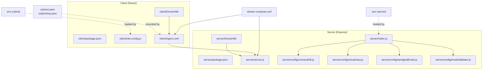
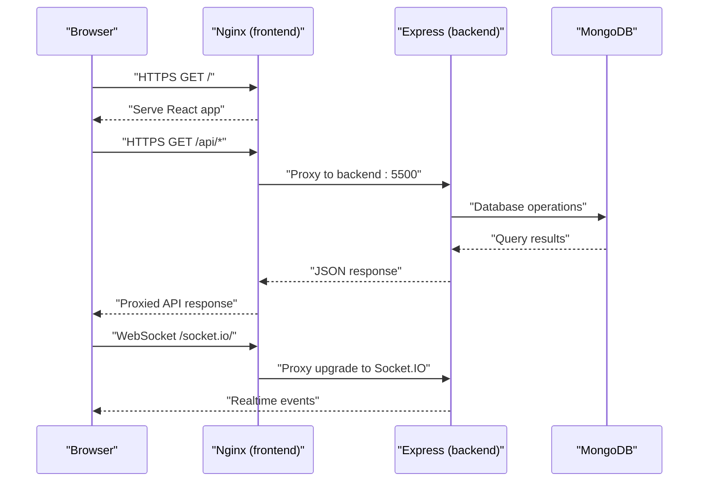

# Getting Started

<cite>
**Referenced Files in This Document**
- [README.md](file://README.md)
- [docker-compose.yml](file://docker-compose.yml)
- [renew-ssl.sh](file://renew-ssl.sh)
- [client/package.json](file://client/package.json)
- [client/vite.config.js](file://client/vite.config.js)
- [client/Dockerfile](file://client/Dockerfile)
- [client/nginx.conf](file://client/nginx.conf)
- [client/.env](file://client/.env)
- [server/package.json](file://server/package.json)
- [server/index.js](file://server/index.js)
- [server/server.js](file://server/server.js)
- [server/Dockerfile](file://server/Dockerfile)
- [server/.env](file://server/.env)
- [server/config/connectDB.js](file://server/config/connectDB.js)
- [server/config/cloudinary.js](file://server/config/cloudinary.js)
- [server/config/sendgridEmail.js](file://server/config/sendgridEmail.js)
- [server/config/emailValidator.js](file://server/config/emailValidator.js)
</cite>

## Table of Contents
1. [Introduction](#introduction)
2. [Project Structure](#project-structure)
3. [Prerequisites](#prerequisites)
4. [Environment Variables](#environment-variables)
5. [Local Development Setup](#local-development-setup)
6. [Docker-Based Deployment](#docker-based-deployment)
7. [Initial Database Seeding](#initial-database-seeding)
8. [SSL Certificate Setup](#ssl-certificate-setup)
9. [First-Time Configuration](#first-time-configuration)
10. [Verification Steps](#verification-steps)
11. [Troubleshooting Guide](#troubleshooting-guide)
12. [Conclusion](#conclusion)

## Introduction
This guide helps you install and run the Betting Platform locally and in production. It covers prerequisites, environment configuration, local development with Vite and Express, Docker-based deployment, SSL certificates, initial configuration, and verification steps. The platform consists of:
- Frontend built with React and served via Nginx
- Backend built with Express and Socket.IO
- MongoDB for persistence
- Cloudinary for media
- SendGrid for email delivery
- Optional ZeroBounce email validation

## Project Structure
The repository is organized into:
- client: React SPA with Vite tooling, Nginx for production serving
- server: Express server with Socket.IO, MongoDB connectivity, email integrations
- docker-compose.yml: Orchestration for backend, frontend, and networking
- ssl/: SSL certificate and private key for HTTPS
- renew-ssl.sh: Optional script for certificate renewal

**Diagram sources**
- [docker-compose.yml](file://docker-compose.yml#L1-L50)
- [client/nginx.conf](file://client/nginx.conf#L1-L100)
- [client/Dockerfile](file://client/Dockerfile#L1-L27)
- [server/Dockerfile](file://server/Dockerfile#L1-L21)
- [server/index.js](file://server/index.js#L1-L150)
- [server/server.js](file://server/server.js#L1-L92)
- [server/config/connectDB.js](file://server/config/connectDB.js#L1-L17)
- [server/config/cloudinary.js](file://server/config/cloudinary.js#L1-L10)
- [server/config/sendgridEmail.js](file://server/config/sendgridEmail.js#L1-L58)
- [server/config/emailValidator.js](file://server/config/emailValidator.js#L1-L127)
- [client/.env](file://client/.env#L1-L3)
- [server/.env](file://server/.env#L1-L44)

**Section sources**
- [README.md](file://README.md#L1-L1)
- [docker-compose.yml](file://docker-compose.yml#L1-L50)

## Prerequisites
Install the following tools and services before proceeding:
- Node.js: LTS recommended (used by both client and server)
- npm or yarn: For dependency management
- MongoDB: Local or Atlas URI configured via environment
- Docker and Docker Compose: For containerized deployment
- OpenSSL: To generate or manage SSL certificates (optional, if self-signing)

Notes:
- The project uses ES modules; ensure your Node.js version supports native ES modules.
- The server sets strict timeouts and security headers; ensure network and firewall allow required ports.

**Section sources**
- [client/package.json](file://client/package.json#L1-L70)
- [server/package.json](file://server/package.json#L1-L43)
- [server/config/connectDB.js](file://server/config/connectDB.js#L1-L17)

## Environment Variables
Configure environment variables for both client and server. These are loaded at runtime and influence behavior such as database connection, JWT signing, Cloudinary uploads, email delivery, and CORS origins.

- Server (.env)
  - PORT: Backend port (default 5500)
  - CLIENT_BASE_URL: Allowed frontend origins for CORS
  - DB_URI: MongoDB connection string
  - JWT_SECRET_KEY: Secret for signing JSON Web Tokens
  - WEBHOOK_SECRET: Secret for webhook validation
  - CLOUDINARY_CLOUD_NAME, CLOUDINARY_API_KEY, CLOUDINARY_API_SECRET: Cloudinary credentials
  - SENDGRID_API_ID, SENDGRID_API_KEY: SendGrid credentials
  - FROM_NAME, REPLY_TO_EMAIL: Sender identity and reply-to address
  - ZEROBOUNCE_API_KEY: Email validation service key

- Client (.env)
  - VITE_SERVER_BASE_URL: Base URL for API proxy during development

Examples and placeholders are provided in the repository’s .env files. Replace placeholders with your own values.

**Section sources**
- [server/.env](file://server/.env#L1-L44)
- [client/.env](file://client/.env#L1-L3)

## Local Development Setup
Follow these steps to run the platform locally using Vite and Express:

1. Install dependencies
   - Navigate to client and server directories and install dependencies using npm or yarn.

2. Start the backend
   - From the server directory, run the development script to start the Express server with hot reloading via nodemon.

3. Start the frontend
   - From the client directory, run the development script to start Vite’s dev server.

4. Access the application
   - Open the frontend URL in your browser.
   - API calls are proxied to the backend automatically via the configured base URL.

5. Enable hot reload and debugging
   - Vite provides fast refresh for React components.
   - Use your IDE’s Node.js debugger to attach to the server process for breakpoints and inspection.

Optional: Use Docker for local development if desired, leveraging the provided Dockerfiles and compose configuration.

**Section sources**
- [client/package.json](file://client/package.json#L6-L12)
- [server/package.json](file://server/package.json#L7-L14)
- [client/vite.config.js](file://client/vite.config.js#L1-L14)
- [client/.env](file://client/.env#L1-L3)
- [server/server.js](file://server/server.js#L1-L92)

## Docker-Based Deployment
The platform supports containerized deployment using Docker Compose. The setup includes:
- backend service: Express server with Socket.IO
- frontend service: Nginx serving the React build with SSL
- shared network for inter-service communication
- health checks for both services

Key behaviors:
- Backend exposes port 5500 and loads environment variables from the server .env file.
- Frontend builds the React app and serves it via Nginx, mounting SSL certificates from the ssl/ directory.
- Nginx proxies API and Socket.IO traffic to the backend service.
- Health checks ensure readiness.

**Diagram sources**
- [docker-compose.yml](file://docker-compose.yml#L1-L50)
- [client/nginx.conf](file://client/nginx.conf#L67-L100)
- [server/server.js](file://server/server.js#L25-L40)
- [server/index.js](file://server/index.js#L93-L100)

**Section sources**
- [docker-compose.yml](file://docker-compose.yml#L1-L50)
- [client/Dockerfile](file://client/Dockerfile#L1-L27)
- [server/Dockerfile](file://server/Dockerfile#L1-L21)
- [client/nginx.conf](file://client/nginx.conf#L1-L100)

## Initial Database Seeding
The repository does not include automated seed scripts. To prepare your database:
- Use the admin interface or API endpoints to create initial administrative accounts and configurations.
- Seed match data and betting options via admin routes.
- Verify connectivity using the health check endpoint.

Note: The backend connects to MongoDB using the configured URI and logs successful connection or exits on failure.

**Section sources**
- [server/config/connectDB.js](file://server/config/connectDB.js#L1-L17)
- [server/index.js](file://server/index.js#L24-L25)

## SSL Certificate Setup
The frontend Nginx container expects SSL certificates at specific paths. To enable HTTPS:
- Place your certificate and private key in ssl/cert.pem and ssl/privkey.pem respectively.
- Ensure permissions allow the Nginx container to read the files.
- Nginx listens on 443 and redirects HTTP to HTTPS.

If using a reverse proxy or load balancer, configure it to terminate TLS and forward to Nginx.

**Section sources**
- [client/nginx.conf](file://client/nginx.conf#L7-L17)
- [docker-compose.yml](file://docker-compose.yml#L36-L38)

## First-Time Configuration
Complete these tasks after environment variables are set:
- Confirm database connectivity using the health endpoint.
- Verify CORS origins match your frontend URLs.
- Test email delivery using the configured provider.
- Validate Cloudinary upload capability.
- Ensure Socket.IO connections work for real-time features.

**Section sources**
- [server/index.js](file://server/index.js#L82-L91)
- [server/index.js](file://server/index.js#L34-L51)
- [server/config/sendgridEmail.js](file://server/config/sendgridEmail.js#L1-L58)
- [server/config/cloudinary.js](file://server/config/cloudinary.js#L1-L10)
- [server/server.js](file://server/server.js#L25-L40)

## Verification Steps
After setup, verify the platform:
- Backend health: Call the health endpoint and confirm status OK.
- Frontend availability: Load the homepage and ensure static assets are served.
- API reachability: Access a sample route under /api/.
- Real-time features: Establish a Socket.IO connection and observe events.
- Email and Cloudinary: Trigger actions that use these services and confirm success.

Common checks:
- Ensure ports 80/443 (frontend) and 5500 (backend) are open.
- Confirm CORS allows your frontend origin.
- Validate environment variables are loaded (check server logs).

**Section sources**
- [server/index.js](file://server/index.js#L72-L91)
- [client/nginx.conf](file://client/nginx.conf#L67-L100)
- [server/server.js](file://server/server.js#L50-L56)

## Troubleshooting Guide
- Port conflicts
  - If the backend port is in use, change PORT in the server .env and rebuild/restart the service.
- CORS errors
  - Ensure CLIENT_BASE_URL includes your frontend origin(s).
- Database connection failures
  - Verify DB_URI and network access to MongoDB.
  - Check server logs for connection errors.
- SSL issues
  - Confirm certificate and key paths and permissions.
  - Ensure Nginx SSL directives match mounted paths.
- Email delivery problems
  - Validate provider credentials and sender identity.
  - Review error responses from the email module.
- Socket.IO disconnections
  - Check proxy headers and transport settings in Nginx.
  - Confirm allowed origins and timeouts.

**Section sources**
- [server/server.js](file://server/server.js#L58-L64)
- [server/index.js](file://server/index.js#L110-L140)
- [client/nginx.conf](file://client/nginx.conf#L67-L100)
- [server/config/sendgridEmail.js](file://server/config/sendgridEmail.js#L31-L57)

## Conclusion
You now have the essentials to install, configure, and run the Betting Platform locally and in production using Docker. Ensure environment variables are correctly set, SSL certificates are in place, and services are reachable. Use the verification steps to confirm functionality and consult the troubleshooting section for common issues.