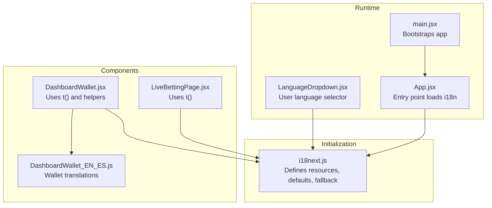
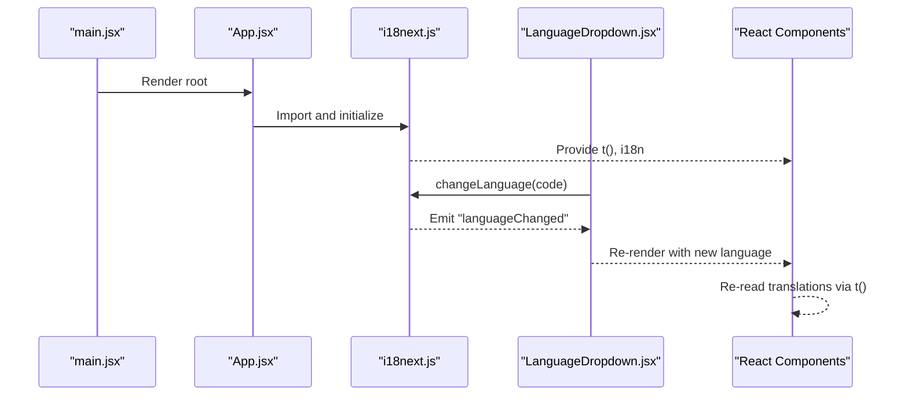
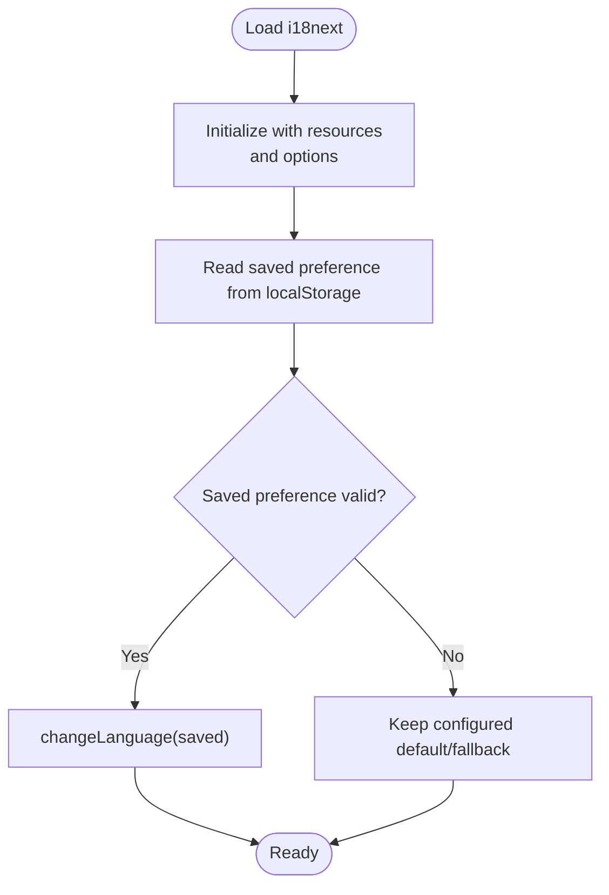
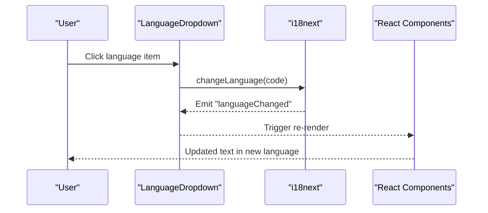
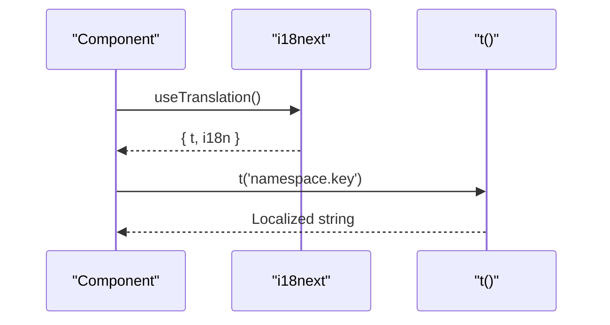
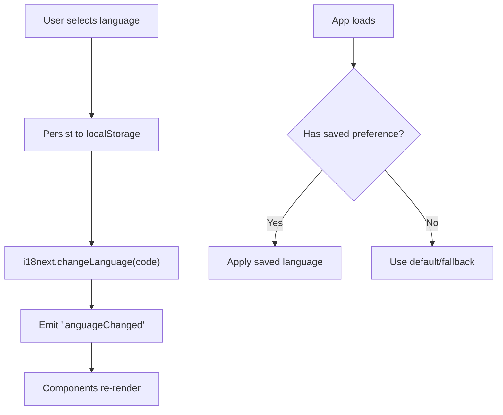
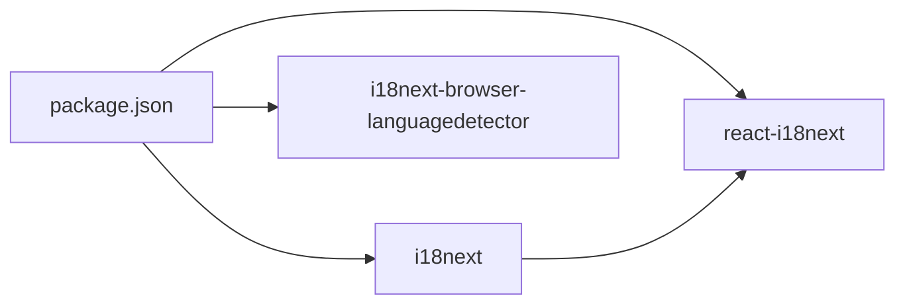

# Internationalization

<cite>
**Referenced Files in This Document**
- [i18next.js](file://client/src/utils/i18next.js)
- [LanguageDropdown.jsx](file://client/src/components/common/LanguageDropdown.jsx)
- [main.jsx](file://client/src/main.jsx)
- [App.jsx](file://client/src/App.jsx)
- [LiveBettingPage.jsx](file://client/src/Pages/Bet/LiveBettingPage.jsx)
- [DashboardWallet.jsx](file://client/src/components/User/DashboardWallet.jsx)
- [DashboardWallet_EN_ES.js](file://client/src/utils/language/users/userDashboard/wallet/index.js)
- [package.json](file://client/package.json)
</cite>

## Table of Contents
1. [Introduction](#introduction)
2. [Project Structure](#project-structure)
3. [Core Components](#core-components)
4. [Architecture Overview](#architecture-overview)
5. [Detailed Component Analysis](#detailed-component-analysis)
6. [Dependency Analysis](#dependency-analysis)
7. [Performance Considerations](#performance-considerations)
8. [Troubleshooting Guide](#troubleshooting-guide)
9. [Conclusion](#conclusion)
10. [Appendices](#appendices)

## Introduction
This document explains the internationalization (i18n) implementation for the Betting application. It covers how i18next is integrated with React, how language detection and fallback work, how translations are organized and loaded, and how users can switch languages. It also documents the LanguageDropdown component, user preference handling, RTL considerations, locale-specific formatting, testing strategies, and best practices for adding new languages and maintaining translations.

## Project Structure
The i18n system centers around a single initialization module that defines resources for supported languages, a LanguageDropdown component for user-driven language switching, and React components that consume translations via react-i18next hooks. Wallet-specific translations are modularized into separate files and included in the main resource tree.

**Diagram sources**
- [i18next.js](file://client/src/utils/i18next.js#L1-L691)
- [LanguageDropdown.jsx](file://client/src/components/common/LanguageDropdown.jsx#L1-L111)
- [main.jsx](file://client/src/main.jsx#L1-L20)
- [App.jsx](file://client/src/App.jsx#L1-L114)
- [LiveBettingPage.jsx](file://client/src/Pages/Bet/LiveBettingPage.jsx#L640-L690)
- [DashboardWallet.jsx](file://client/src/components/User/DashboardWallet.jsx#L1-L200)
- [DashboardWallet_EN_ES.js](file://client/src/utils/language/users/userDashboard/wallet/index.js#L1-L58)

**Section sources**
- [i18next.js](file://client/src/utils/i18next.js#L1-L691)
- [LanguageDropdown.jsx](file://client/src/components/common/LanguageDropdown.jsx#L1-L111)
- [main.jsx](file://client/src/main.jsx#L1-L20)
- [App.jsx](file://client/src/App.jsx#L1-L114)
- [DashboardWallet_EN_ES.js](file://client/src/utils/language/users/userDashboard/wallet/index.js#L1-L58)

## Core Components
- i18next initialization and resources: Defines supported languages, default language, fallback language, and translation keys. Includes modularized wallet translations.
- LanguageDropdown: Provides a user interface to switch languages and persists the selection in local storage.
- React integration: Components use react-i18next hooks to render translated content.

Key behaviors:
- Language persistence: Preferred language is stored in local storage and restored on load.
- Fallback: A fallback language is configured so the app remains functional if a key is missing in the active language.
- Modularization: Large translation blocks (like wallet) are split into dedicated files and imported into the main resource tree.

**Section sources**
- [i18next.js](file://client/src/utils/i18next.js#L1-L691)
- [LanguageDropdown.jsx](file://client/src/components/common/LanguageDropdown.jsx#L1-L111)

## Architecture Overview
The i18n pipeline integrates at startup, exposes translation functions to components, and reacts to user language changes.

**Diagram sources**
- [main.jsx](file://client/src/main.jsx#L1-L20)
- [App.jsx](file://client/src/App.jsx#L1-L114)
- [i18next.js](file://client/src/utils/i18next.js#L1-L691)
- [LanguageDropdown.jsx](file://client/src/components/common/LanguageDropdown.jsx#L1-L111)

## Detailed Component Analysis

### i18next Initialization and Resource Model
- Supported languages: English and Spanish.
- Default and fallback language: Both configured to Spanish.
- Translation keys: Hierarchical under namespaces (e.g., default, user, auth, bet, admin).
- Modular translation inclusion: Wallet translations are imported and assigned to user.DashboardWallet.
- Language persistence: Overrides changeLanguage to persist preferred language in local storage and restores it on load.

**Diagram sources**
- [i18next.js](file://client/src/utils/i18next.js#L673-L691)

**Section sources**
- [i18next.js](file://client/src/utils/i18next.js#L1-L691)
- [DashboardWallet_EN_ES.js](file://client/src/utils/language/users/userDashboard/wallet/index.js#L1-L58)

### LanguageDropdown Component
- Purpose: Allow users to select a language from a predefined list.
- Behavior:
  - Reads current language from i18n.
  - On selection, calls i18next.changeLanguage and updates internal state.
  - Listens to i18n "languageChanged" to stay synchronized.
  - Hydration-safe rendering during initial mount.
  - Uses translation keys for UI labels.

**Diagram sources**
- [LanguageDropdown.jsx](file://client/src/components/common/LanguageDropdown.jsx#L1-L111)
- [i18next.js](file://client/src/utils/i18next.js#L679-L691)

**Section sources**
- [LanguageDropdown.jsx](file://client/src/components/common/LanguageDropdown.jsx#L1-L111)

### React Integration and Translation Usage
- Components import and use react-i18next hooks to render localized content.
- Examples:
  - Live betting page reads nested keys for UI labels.
  - Wallet component uses t() and a helper to toggle between English and Spanish for specific fields.

**Diagram sources**
- [LiveBettingPage.jsx](file://client/src/Pages/Bet/LiveBettingPage.jsx#L640-L690)
- [DashboardWallet.jsx](file://client/src/components/User/DashboardWallet.jsx#L1-L200)

**Section sources**
- [LiveBettingPage.jsx](file://client/src/Pages/Bet/LiveBettingPage.jsx#L640-L690)
- [DashboardWallet.jsx](file://client/src/components/User/DashboardWallet.jsx#L1-L200)

### Language Switching and User Preference Handling
- Persistence: The overridden changeLanguage writes the selected language to local storage.
- Restoration: On app load, the saved preference is read and applied if valid.
- Hydration safety: LanguageDropdown defers rendering until mounted to avoid SSR mismatches.

**Diagram sources**
- [i18next.js](file://client/src/utils/i18next.js#L679-L691)
- [LanguageDropdown.jsx](file://client/src/components/common/LanguageDropdown.jsx#L34-L49)

**Section sources**
- [i18next.js](file://client/src/utils/i18next.js#L679-L691)
- [LanguageDropdown.jsx](file://client/src/components/common/LanguageDropdown.jsx#L34-L49)

### Translation Keys and Organization
- Structure: Keys are grouped by feature and domain (default, user, auth, bet, admin).
- Nested hierarchy: Deeper nesting organizes related UI strings (e.g., bet.BetTab, bet.BettingRules).
- Modular inclusion: Large sections (e.g., user.DashboardWallet) are externalized and merged into resources.

Best practices derived from structure:
- Keep keys descriptive and hierarchical.
- Split large translation blocks into separate files for maintainability.
- Use consistent naming across languages.

**Section sources**
- [i18next.js](file://client/src/utils/i18next.js#L1-L691)
- [DashboardWallet_EN_ES.js](file://client/src/utils/language/users/userDashboard/wallet/index.js#L1-L58)

### Right-to-Left (RTL) Language Support
- Current implementation: No explicit RTL configuration is present in the initialization or components.
- Recommendation: When adding RTL languages (e.g., Arabic, Hebrew), configure directionality at the document/html level and adjust layout styles accordingly. Consider using a library that detects and applies RTL automatically if needed.

[No sources needed since this section provides general guidance]

### Locale-Specific Formatting
- Current usage: Components use JavaScript’s built-in date/time formatting with locale-specific locales when needed.
- Recommendation: Centralize locale-aware formatting in a shared utility to ensure consistency across the app.

**Section sources**
- [DashboardWallet.jsx](file://client/src/components/User/DashboardWallet.jsx#L150-L172)

## Dependency Analysis
- i18next: Core internationalization library.
- react-i18next: React bindings for i18next.
- i18next-browser-languagedetector: Optional browser language detection (declared in dependencies).

**Diagram sources**
- [package.json](file://client/package.json#L14-L52)

**Section sources**
- [package.json](file://client/package.json#L14-L52)

## Performance Considerations
- Single initialization: i18next is initialized once at startup; avoid re-initializing per route or component.
- Minimal re-renders: Use t() and i18n hooks efficiently; avoid unnecessary translations inside tight loops.
- Bundle size: Keep translation files modular to reduce initial payload; lazy-load large sections if needed.
- Hydration: Ensure server-side rendering does not conflict with client-side language preferences.

[No sources needed since this section provides general guidance]

## Troubleshooting Guide
Common issues and resolutions:
- Missing translation keys: Verify keys exist in the active language; rely on fallback language to prevent runtime errors.
- Hydration mismatch: Ensure components using translations are rendered after hydration completes (handled by LanguageDropdown).
- Language not persisting: Confirm local storage writes and reads are successful and the saved value is valid.
- Unexpected language changes: Check for programmatic calls to changeLanguage and ensure listeners are attached.

**Section sources**
- [LanguageDropdown.jsx](file://client/src/components/common/LanguageDropdown.jsx#L34-L49)
- [i18next.js](file://client/src/utils/i18next.js#L679-L691)

## Conclusion
The Betting application integrates i18next with React to provide multi-language support. Language switching is user-driven and persisted, with a fallback language ensuring resilience. Translation keys are organized hierarchically, and large sections are modularized for maintainability. RTL and locale-specific formatting are not currently configured but can be added following the recommendations.

[No sources needed since this section summarizes without analyzing specific files]

## Appendices

### Adding a New Language
Steps:
1. Add a new language block in the i18next resources with the appropriate namespace and keys.
2. If applicable, create a dedicated translation file for large sections and import it into the resources.
3. Update LanguageDropdown to include the new language option.
4. Test switching and persistence.
5. Verify that fallback language prevents missing key errors.

**Section sources**
- [i18next.js](file://client/src/utils/i18next.js#L1-L691)
- [LanguageDropdown.jsx](file://client/src/components/common/LanguageDropdown.jsx#L14-L17)

### Updating Translations
- Maintain consistency in key names across languages.
- Prefer hierarchical keys for readability and scoping.
- Use the modular pattern for large translation blocks.
- Validate translations after updates to ensure completeness.

**Section sources**
- [i18next.js](file://client/src/utils/i18next.js#L1-L691)
- [DashboardWallet_EN_ES.js](file://client/src/utils/language/users/userDashboard/wallet/index.js#L1-L58)

### Testing Strategies
- Unit tests: Verify that t() resolves to the correct language and that fallback works.
- Integration tests: Simulate user language switching and confirm persistence and re-rendering.
- Accessibility tests: Ensure labels and messages are readable in the selected language.
- Edge-case tests: Validate behavior when keys are missing or local storage is unavailable.

[No sources needed since this section provides general guidance]